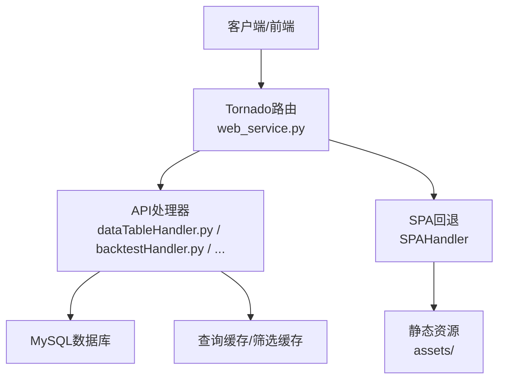
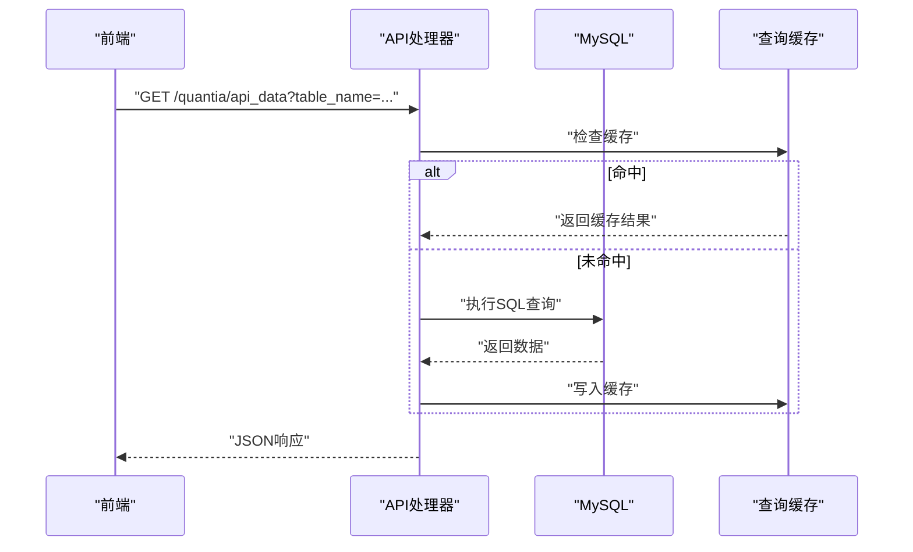
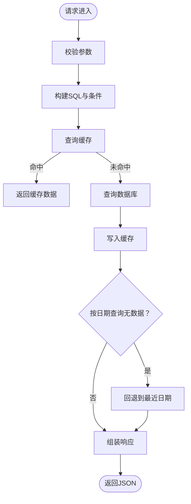
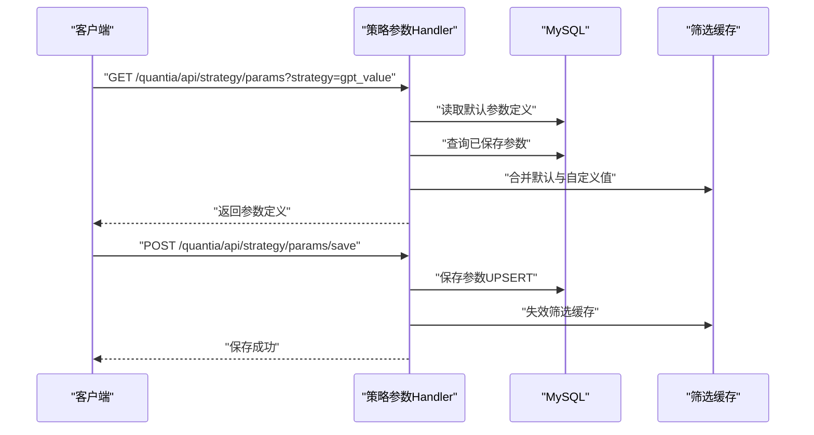
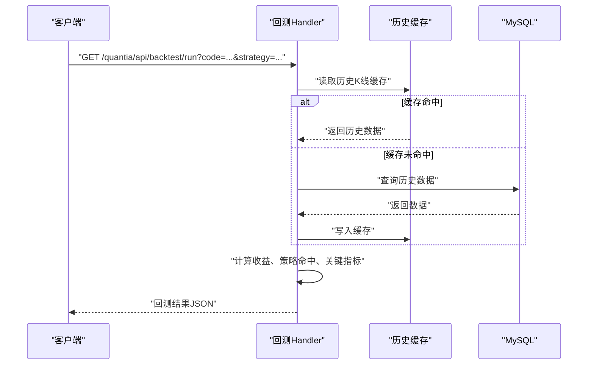
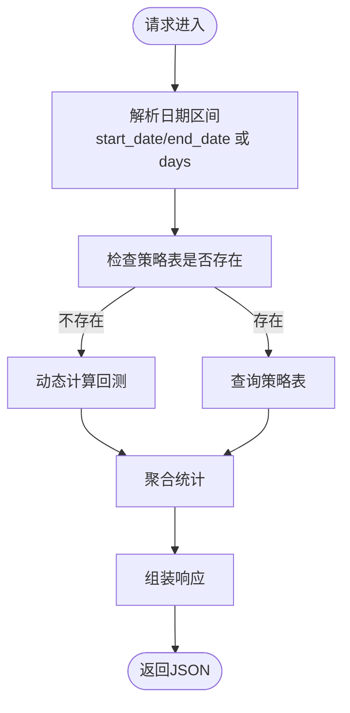
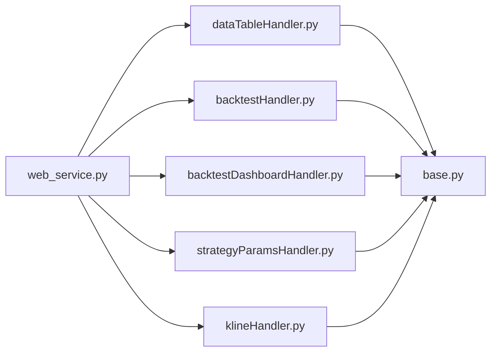

# API参考文档

<cite>
**本文档引用的文件**
- [API_REFERENCE.md](file://document/API_REFERENCE.md)
- [README.md](file://README.md)
- [web_service.py](file://quantia/web/web_service.py)
- [base.py](file://quantia/web/base.py)
- [dataTableHandler.py](file://quantia/web/dataTableHandler.py)
- [dataIndicatorsHandler.py](file://quantia/web/dataIndicatorsHandler.py)
- [backtestHandler.py](file://quantia/web/backtestHandler.py)
- [backtestDashboardHandler.py](file://quantia/web/backtestDashboardHandler.py)
- [strategyParamsHandler.py](file://quantia/web/strategyParamsHandler.py)
- [klineHandler.py](file://quantia/web/klineHandler.py)
</cite>

## 目录
1. [简介](#简介)
2. [项目结构](#项目结构)
3. [核心组件](#核心组件)
4. [架构总览](#架构总览)
5. [详细组件分析](#详细组件分析)
6. [依赖分析](#依赖分析)
7. [性能考虑](#性能考虑)
8. [故障排查指南](#故障排查指南)
9. [结论](#结论)
10. [附录](#附录)

## 简介
本文件为 Quantia（Quantia）系统的完整API参考文档，涵盖RESTful接口、请求/响应格式、参数定义、返回值说明、错误码、认证授权机制、版本管理与兼容性、性能优化建议，以及WebSocket与IPC通信机制说明。系统基于Tornado框架提供Web服务，支持前端SPA路由与后端API协同工作。

## 项目结构
- Web服务入口与路由注册位于应用层，统一处理静态资源、API路由与SPA回退。
- 各业务模块通过Handler实现，分别处理数据查询、指标可视化、回测、策略参数管理、K线数据等。
- 数据访问通过统一的数据库连接与缓存策略，确保高并发下的稳定性与性能。

**图表来源**
- [web_service.py](file://quantia/web/web_service.py#L53-L98)
- [dataTableHandler.py](file://quantia/web/dataTableHandler.py#L54-L215)
- [backtestHandler.py](file://quantia/web/backtestHandler.py#L69-L79)

**章节来源**
- [web_service.py](file://quantia/web/web_service.py#L53-L98)
- [README.md](file://README.md#L321-L342)

## 核心组件
- Web应用与路由
  - 应用类负责注册所有API与静态资源路由，启用CORS，维护全局数据库连接。
  - SPA回退处理器支持前端路由，非API路径返回index.html。
- 基础Handler
  - 统一设置CORS头，处理预检请求，提供数据库连接检查与自动重连。
- 数据查询与缓存
  - 数据表查询支持分页、关键词搜索、排序与缓存，自动处理表不存在与列不存在的回退逻辑。
- 回测与回测看板
  - 提供单股回测、批量回测、跨策略总览、时间序列、明细、收益分布、买入-卖出配对等接口。
- 策略参数管理
  - 支持查询、保存、重置策略参数，动态筛选股票。
- K线数据
  - 提供ECharts友好的K线与技术指标JSON数据，支持日线与周/月/季/年重采样。

**章节来源**
- [web_service.py](file://quantia/web/web_service.py#L53-L125)
- [base.py](file://quantia/web/base.py#L14-L36)
- [dataTableHandler.py](file://quantia/web/dataTableHandler.py#L54-L215)
- [backtestHandler.py](file://quantia/web/backtestHandler.py#L69-L79)
- [strategyParamsHandler.py](file://quantia/web/strategyParamsHandler.py#L563-L684)
- [klineHandler.py](file://quantia/web/klineHandler.py#L212-L354)

## 架构总览
系统采用前后端分离架构：前端SPA通过AJAX调用后端API；后端基于Tornado提供RESTful接口，统一CORS与数据库连接管理；数据层通过缓存与查询优化提升性能。

**图表来源**
- [dataTableHandler.py](file://quantia/web/dataTableHandler.py#L123-L151)
- [base.py](file://quantia/web/base.py#L28-L36)

**章节来源**
- [web_service.py](file://quantia/web/web_service.py#L53-L98)
- [base.py](file://quantia/web/base.py#L14-L36)

## 详细组件分析

### RESTful API接口清单与规范
- 基础信息
  - Base URL: http://localhost:9988
  - 响应格式: JSON / HTML
  - 端口: 9988
- CORS
  - 支持跨域请求，允许的方法与头已在基础Handler中统一设置。
- 认证与授权
  - 本系统未实现鉴权中间件，建议在生产环境中接入认证/授权机制（如JWT、OAuth2）。
- 错误处理
  - 统一返回JSON错误对象，包含error标志与message说明。
  - 常见HTTP状态码：400（参数错误）、404（资源不存在）、500（服务器内部错误）。

**章节来源**
- [API_REFERENCE.md](file://document/API_REFERENCE.md#L7-L13)
- [base.py](file://quantia/web/base.py#L16-L26)
- [API_REFERENCE.md](file://document/API_REFERENCE.md#L346-L364)

### 数据查询API
- 接口：GET /quantia/api_data
  - 功能：按表名查询数据，支持分页、关键词搜索、排序与缓存。
  - 参数：
    - table_name: string（必填）
    - date: string（可选，YYYY-MM-DD）
    - columns: string（可选）
    - order: string（可选）
    - search: string（可选）
    - start: int（可选）
    - length: int（可选）
  - 支持的表名：详见文档“支持的表名”。
  - 响应：包含列定义、数据列表与总数；若按日期查询无数据，自动回退到最近有数据的日期。
  - 错误：400（缺少必要参数）、404（表不存在）、500（查询异常）。

**图表来源**
- [dataTableHandler.py](file://quantia/web/dataTableHandler.py#L54-L215)

**章节来源**
- [API_REFERENCE.md](file://document/API_REFERENCE.md#L31-L107)
- [dataTableHandler.py](file://quantia/web/dataTableHandler.py#L54-L215)

### 数据表页面API
- 接口：GET /quantia/data
  - 功能：返回带DataTable的HTML页面。
  - 参数：table_name（必填）、date（可选）。
  - 响应：HTML页面。

**章节来源**
- [API_REFERENCE.md](file://document/API_REFERENCE.md#L110-L129)

### 指标图表API
- 接口：GET /quantia/data/indicators
  - 功能：返回包含K线图、指标图、筹码分布图的HTML页面。
  - 参数：code（必填）、date（可选）、type（可选）。
  - 响应：HTML页面。

**章节来源**
- [API_REFERENCE.md](file://document/API_REFERENCE.md#L131-L161)
- [dataIndicatorsHandler.py](file://quantia/web/dataIndicatorsHandler.py#L16-L41)

### 关注管理API
- 接口：POST /quantia/control/attention
  - 功能：添加/删除关注。
  - 请求体：{"code": "000001", "action": "add|remove"}
  - 响应：{"status": "success", "message": "..."}。

**章节来源**
- [API_REFERENCE.md](file://document/API_REFERENCE.md#L163-L195)
- [dataIndicatorsHandler.py](file://quantia/web/dataIndicatorsHandler.py#L45-L62)

### 交易日期API
- 接口：GET /quantia/api/trade_date
  - 功能：获取最近交易日期。
  - 响应：{"run_date": "YYYY-MM-DD", "run_date_nph": "YYYY-MM-DD"}。

**章节来源**
- [API_REFERENCE.md](file://document/API_REFERENCE.md#L727-L746)
- [dataTableHandler.py](file://quantia/web/dataTableHandler.py#L218-L232)

### 策略参数管理API
- 接口：GET /quantia/api/strategy/params
  - 功能：获取策略参数配置；不带参数时返回可配置策略列表。
  - 参数：strategy（可选）。
  - 响应：策略参数定义（含默认值与用户自定义值）。
- 接口：POST /quantia/api/strategy/params/save
  - 功能：保存策略参数。
  - 请求体：{"strategy": "...", "params": {...}}。
  - 响应：{"success": true, "message": "..."}。
- 接口：POST /quantia/api/strategy/params/reset
  - 功能：重置策略参数为默认值。
  - 请求体：{"strategy": "..."}。
  - 响应：{"success": true, "message": "..."}。
- 接口：GET /quantia/api/strategy/filter
  - 功能：根据当前策略参数动态筛选股票。
  - 参数：strategy（必填）、date（可选）、page（可选）、page_size（可选）。
  - 响应：分页的筛选结果与总数。

**图表来源**
- [strategyParamsHandler.py](file://quantia/web/strategyParamsHandler.py#L563-L684)

**章节来源**
- [API_REFERENCE.md](file://document/API_REFERENCE.md#L198-L289)
- [strategyParamsHandler.py](file://quantia/web/strategyParamsHandler.py#L563-L684)

### 回测验证API
- 接口：GET /quantia/api/backtest/config
  - 功能：获取可用回测周期与策略列表。
  - 响应：包含周期、策略、默认horizons与最大horizon。
- 接口：GET /quantia/api/backtest/run
  - 功能：执行单股回测。
  - 参数：code（必填）、strategy（可选）、period（可选）、start_date（可选）、end_date（可选）、checkpoints（可选）。
  - 响应：买入日期、价格、各周期收益率、最大涨幅/回撤、策略命中、关键指标。
- 接口：GET /quantia/api/backtest/batch
  - 功能：批量策略回测。
  - 参数：strategy（必填）、period（可选）、limit（可选）、horizons（可选）、success_days（可选）。
  - 响应：按日汇总的选股数量、成功率、平均收益。

**图表来源**
- [backtestHandler.py](file://quantia/web/backtestHandler.py#L166-L289)

**章节来源**
- [API_REFERENCE.md](file://document/API_REFERENCE.md#L437-L489)
- [backtestHandler.py](file://quantia/web/backtestHandler.py#L69-L126)

### 回测看板API
- 接口：GET /quantia/api/backtest/dashboard/overview
  - 功能：跨策略总览。
  - 参数：days（可选）、start_date/end_date（二选一）、metric（可选）。
  - 响应：各策略信号数、平均成功率、各horizon平均收益、最佳/最差日期。
- 接口：GET /quantia/api/backtest/dashboard/timeline
  - 功能：策略表现时间序列。
  - 参数：strategies（可选）、days（可选）、start_date/end_date（二选一）、horizon（可选）。
  - 响应：按日期聚合的收益序列。
- 接口：GET /quantia/api/backtest/dashboard/strategy_detail
  - 功能：单策略明细。
  - 参数：strategy（必填）、days（可选）、start_date/end_date（二选一）、horizons（可选）、page（可选）、page_size（可选）。
  - 响应：分页rows，包含rate_1..rate_N。
- 接口：GET /quantia/api/backtest/dashboard/distribution
  - 功能：收益分布。
  - 参数：strategy（必填）、days（可选）、start_date/end_date（二选一）、horizon（可选）。
  - 响应：分箱统计。
- 接口：GET /quantia/api/backtest/dashboard/trade_pairs
  - 功能：买入-卖出配对明细。
  - 参数：strategy（必填）、days（可选）、page（可选）、page_size（可选）、max_hold（可选）。
  - 响应：买入/卖出日期、价格、持有天数、收益率与退出类型。

**图表来源**
- [backtestDashboardHandler.py](file://quantia/web/backtestDashboardHandler.py#L227-L284)
- [backtestDashboardHandler.py](file://quantia/web/backtestDashboardHandler.py#L360-L467)

**章节来源**
- [API_REFERENCE.md](file://document/API_REFERENCE.md#L491-L724)
- [backtestDashboardHandler.py](file://quantia/web/backtestDashboardHandler.py#L360-L467)

### K线数据API
- 接口：GET /quantia/api/kline
  - 功能：返回ECharts友好的K线与技术指标JSON。
  - 参数：code（必填）、date（可选）、period（可选：daily/weekly/monthly/quarterly/yearly）、days（可选）、name（可选）。
  - 响应：包含日期、OHLC、成交量、MA、成交量MA、布林带、RSI、MACD、KDJ、WR等。
  - 错误：400（缺少code）、500（异常）。

**章节来源**
- [API_REFERENCE.md](file://document/API_REFERENCE.md#L1-L6)
- [klineHandler.py](file://quantia/web/klineHandler.py#L212-L354)

### WebSocket与实时接口
- 当前REST API未提供WebSocket接口。
- 若需实时推送，可在现有Handler基础上扩展WebSocket端点，结合事件引擎或消息队列实现订阅发布模式。

[本节为概念性说明，不直接分析具体文件]

### IPC通信机制
- 系统通过数据库与文件缓存实现进程间数据共享。
- 建议在分布式部署时引入消息中间件（如RabbitMQ/Kafka）或Redis实现事件驱动与缓存一致性。

[本节为概念性说明，不直接分析具体文件]

## 依赖分析
- 组件耦合
  - web_service.py集中注册路由，依赖各Handler模块；Handler依赖base.py提供的CORS与DB连接。
  - 数据查询依赖查询缓存与数据库；回测依赖历史缓存与策略函数；策略参数依赖MySQL表。
- 外部依赖
  - Tornado、MySQL、pandas/numpy、TA-Lib（指标计算）。

**图表来源**
- [web_service.py](file://quantia/web/web_service.py#L56-L88)

**章节来源**
- [web_service.py](file://quantia/web/web_service.py#L53-L98)

## 性能考虑
- 查询缓存
  - 数据查询与筛选结果均使用LRU缓存，减少数据库压力；参数变更会主动失效筛选缓存。
- 分页与限制
  - 数据查询支持分页与最大页大小限制，避免超大数据集返回。
- 指标计算
  - K线指标在服务端按需计算，建议前端按需请求与裁剪数据。
- 连接管理
  - 基础Handler定期检查数据库连接并自动重连，降低连接中断影响。
- 并发与批处理
  - 批量回测采用线程池并发处理，提升吞吐。

**章节来源**
- [dataTableHandler.py](file://quantia/web/dataTableHandler.py#L123-L151)
- [strategyParamsHandler.py](file://quantia/web/strategyParamsHandler.py#L619-L626)
- [backtestHandler.py](file://quantia/web/backtestHandler.py#L540-L560)
- [base.py](file://quantia/web/base.py#L28-L36)

## 故障排查指南
- 常见问题
  - 400参数错误：检查必填参数与格式（日期YYYY-MM-DD、股票代码6位数字）。
  - 404资源不存在：确认表名正确或相关数据作业已运行。
  - 500服务器内部错误：查看服务日志，定位数据库查询或缓存异常。
- 日志
  - Web服务日志：stock_web.log；数据作业日志：stock_execute_job.log；交易服务日志：stock_trade.log。
- 数据作业
  - 确保数据采集、指标计算、策略数据与回测数据作业已按计划运行。

**章节来源**
- [API_REFERENCE.md](file://document/API_REFERENCE.md#L346-L364)
- [README.md](file://README.md#L314-L318)

## 结论
本API文档覆盖了Quantia系统的主要RESTful接口与回测看板能力，提供了参数定义、响应格式、错误码与性能优化建议。建议在生产环境中增加认证授权、限流与监控，并根据业务扩展WebSocket或消息队列实现实时推送与事件驱动。

## 附录
- 使用示例（Python/JavaScript/cURL）与注意事项详见文档“使用示例”与“注意事项”。

**章节来源**
- [API_REFERENCE.md](file://document/API_REFERENCE.md#L367-L435)
