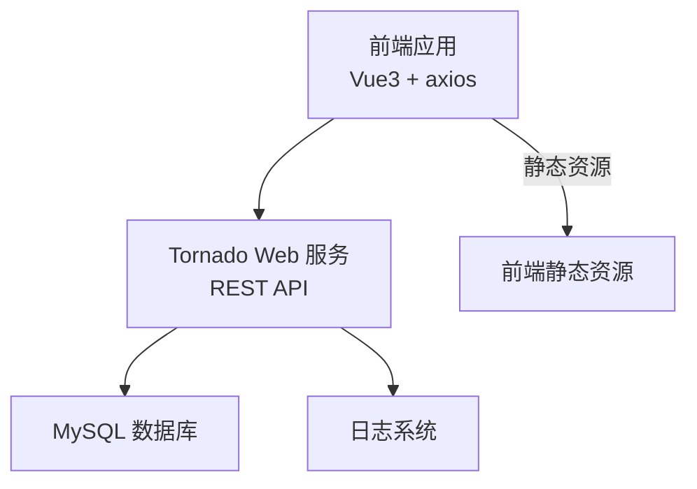
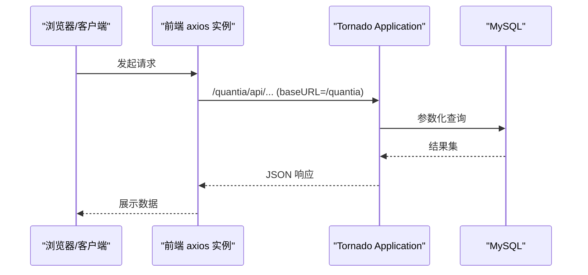
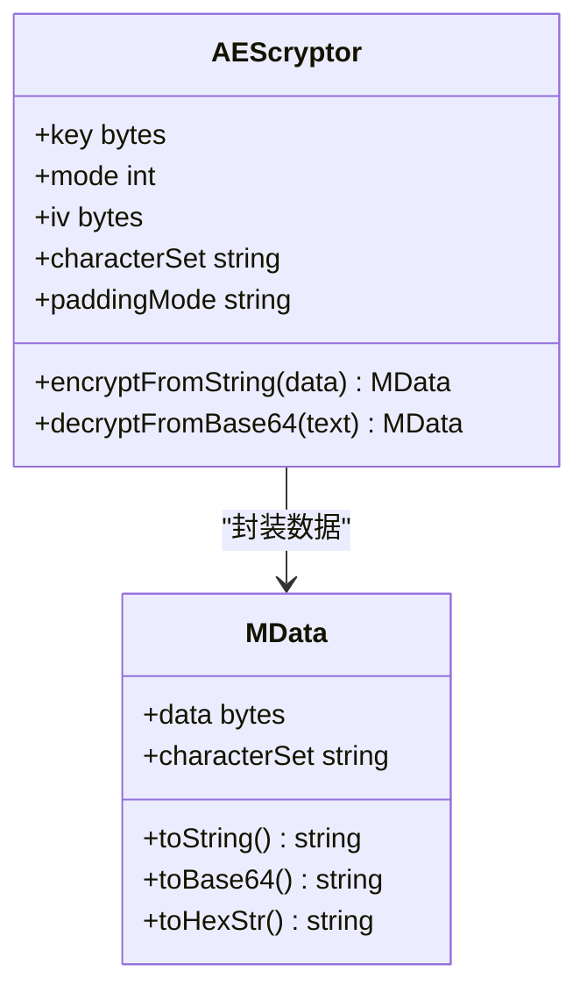
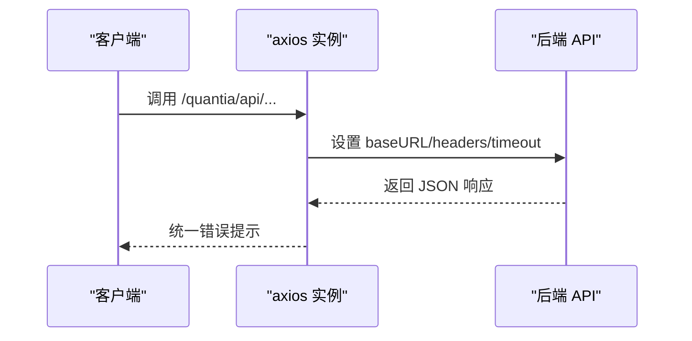
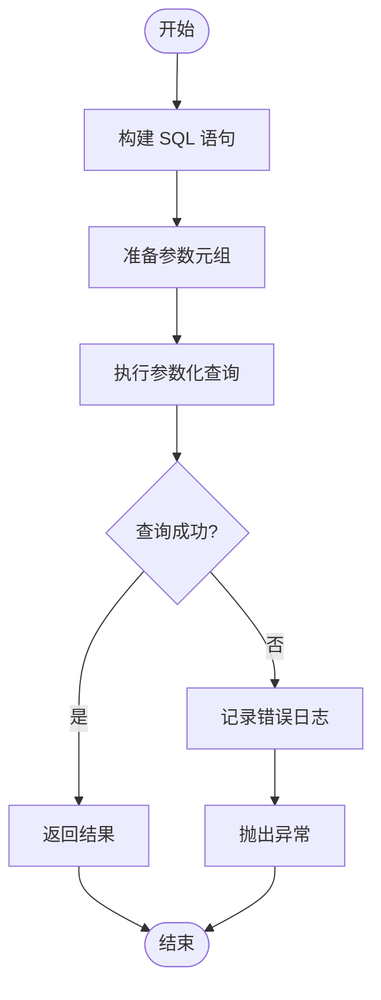
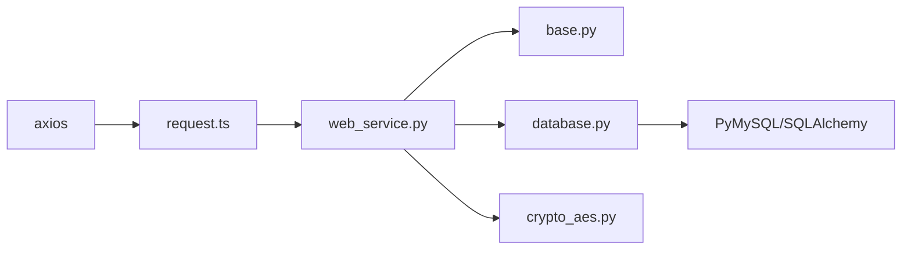

# API认证与授权

<cite>
**本文引用的文件**
- [web_service.py](file://docker/stock/quantia/web/web_service.py)
- [base.py](file://docker/stock/quantia/web/base.py)
- [dataTableHandler.py](file://docker/stock/quantia/web/dataTableHandler.py)
- [strategyParamsHandler.py](file://docker/stock/quantia/web/strategyParamsHandler.py)
- [crypto_aes.py](file://docker/stock/quantia/lib/crypto_aes.py)
- [database.py](file://docker/stock/quantia/lib/database.py)
- [torndb.py](file://docker/stock/quantia/lib/torndb.py)
- [request.ts](file://docker/stock/quantia/fontWeb/src/api/request.ts)
- [StrategyConfig.vue](file://docker/stock/quantia/fontWeb/src/views/strategy/StrategyConfig.vue)
- [mockServiceWorker.js](file://docker/stock/quantia/fontWeb/public/mockServiceWorker.js)
- [robots.txt](file://docker/stock/quantia/web/static/robots.txt)
</cite>

## 目录
1. [简介](#简介)
2. [项目结构](#项目结构)
3. [核心组件](#核心组件)
4. [架构总览](#架构总览)
5. [详细组件分析](#详细组件分析)
6. [依赖分析](#依赖分析)
7. [性能考量](#性能考量)
8. [故障排查指南](#故障排查指南)
9. [结论](#结论)
10. [附录](#附录)

## 简介
本文件针对 Quantia API 系统的认证与授权机制进行系统化梳理与说明，覆盖安全策略、认证方式、权限控制、密钥管理、签名与加密、会话与令牌刷新、客户端集成、权限分级与资源访问控制、操作审计以及安全最佳实践与常见威胁防护等内容。文档以仓库现有实现为基础，结合前端与后端组件，给出可操作的配置与集成指南。

## 项目结构
Quantia 采用前后端分离架构：前端使用 Vue3 + Element Plus，通过 axios 发起对后端 Tornado Web 服务的请求；后端提供 REST 风格 API 并统一设置 CORS；数据库连接通过 SQLAlchemy/TornadoDB 管理。

图表来源
- [web_service.py](file://docker/stock/quantia/web/web_service.py#L53-L99)
- [request.ts](file://docker/stock/quantia/fontWeb/src/api/request.ts#L1-L39)

章节来源
- [web_service.py](file://docker/stock/quantia/web/web_service.py#L53-L99)
- [base.py](file://docker/stock/quantia/web/base.py#L14-L36)
- [request.ts](file://docker/stock/quantia/fontWeb/src/api/request.ts#L1-L39)

## 核心组件
- Web 应用与路由：集中于 Tornado Application，注册 API 路由与 SPA 回退。
- 基础 Handler：统一设置 CORS，维护数据库连接健康。
- 数据 API：提供股票数据查询、分页、缓存与回退逻辑。
- 策略参数 API：提供策略参数的查询、保存、重置与动态筛选。
- 加密库：封装 AES 加密/解密工具，用于敏感参数的本地存储。
- 数据库连接：集中管理连接池、参数化查询与日志脱敏。
- 前端请求封装：统一 baseURL、超时与错误提示。

章节来源
- [web_service.py](file://docker/stock/quantia/web/web_service.py#L53-L99)
- [base.py](file://docker/stock/quantia/web/base.py#L14-L36)
- [dataTableHandler.py](file://docker/stock/quantia/web/dataTableHandler.py#L54-L214)
- [strategyParamsHandler.py](file://docker/stock/quantia/web/strategyParamsHandler.py#L563-L790)
- [crypto_aes.py](file://docker/stock/quantia/lib/crypto_aes.py#L55-L198)
- [database.py](file://docker/stock/quantia/lib/database.py#L78-L231)
- [request.ts](file://docker/stock/quantia/fontWeb/src/api/request.ts#L1-L39)

## 架构总览
Quantia 的认证与授权现状：
- 无显式全局认证中间件：API 路由未强制要求 Token 或 Cookie。
- CORS 允许跨域：前端与后端分离部署时无需额外代理。
- 敏感参数本地存储采用 AES 加密：策略参数中的密钥字段以加密形式落库。
- 数据库连接参数化查询：避免 SQL 注入风险。
- 前端 Mock Service Worker：仅用于开发调试，生产环境需禁用。

图表来源
- [request.ts](file://docker/stock/quantia/fontWeb/src/api/request.ts#L5-L11)
- [web_service.py](file://docker/stock/quantia/web/web_service.py#L56-L87)
- [database.py](file://docker/stock/quantia/lib/database.py#L196-L215)

## 详细组件分析

### 认证与会话机制
- 当前实现：未发现全局认证中间件或会话管理逻辑。API 路由未强制校验 Authorization 头或 Cookie。
- CORS：基础 Handler 统一设置跨域头，便于前端直连后端。
- Cookie：Application 初始化设置了 cookie_secret，但未启用 xsrf_cookies，且未见会话登录/登出流程。
- 建议：若需要认证，应在 Application 中间件层引入鉴权逻辑（如 JWT、API Key），并在路由层标注受保护路径。

章节来源
- [base.py](file://docker/stock/quantia/web/base.py#L14-L36)
- [web_service.py](file://docker/stock/quantia/web/web_service.py#L89-L96)

### 权限控制与资源访问
- 当前实现：未发现细粒度权限控制（RBAC/ABAC）。API 对外开放，未区分用户角色与资源边界。
- 建议：引入基于角色的访问控制（RBAC），为不同用户组分配只读/写/管理权限；对敏感操作（如策略参数保存）进行权限校验。

章节来源
- [strategyParamsHandler.py](file://docker/stock/quantia/web/strategyParamsHandler.py#L591-L661)

### API 密钥管理与加密
- 存储策略：策略参数表 cn_strategy_params 保存用户自定义值；其中 api_key 字段在前端界面标记为“加密存储”。
- 加密实现：crypto_aes.py 提供 AES 加密/解密工具类，支持 CBC/ECB 模式与多种填充方式。
- 使用建议：在保存 api_key 前进行加密，读取时解密；密钥材料与加密密钥应分离存放，建议使用 KMS 或环境变量注入。

图表来源
- [crypto_aes.py](file://docker/stock/quantia/lib/crypto_aes.py#L13-L198)

章节来源
- [strategyParamsHandler.py](file://docker/stock/quantia/web/strategyParamsHandler.py#L358-L373)
- [crypto_aes.py](file://docker/stock/quantia/lib/crypto_aes.py#L55-L198)

### 用户身份验证流程与令牌刷新
- 当前实现：未实现登录/注册、令牌签发与刷新流程。
- 建议：采用短期访问令牌（Access Token）与长期刷新令牌（Refresh Token）组合；Access Token 放置于 Authorization 头，Refresh Token 存放于 HttpOnly Cookie；刷新时验证 Refresh Token 并签发新的 Access Token。

章节来源
- [web_service.py](file://docker/stock/quantia/web/web_service.py#L89-L96)

### API 客户端集成指南
- 基础配置
  - baseURL：/quantia（与后端路由一致）
  - 超时：60000ms
  - Content-Type：application/json;charset=UTF-8
- 请求头
  - 若启用认证，需在请求头添加 Authorization: Bearer <access_token>
  - CORS 已由后端统一处理，前端无需额外设置
- 安全传输
  - 生产环境必须启用 HTTPS
  - 前端 Mock Service Worker 仅用于开发，生产需移除

图表来源
- [request.ts](file://docker/stock/quantia/fontWeb/src/api/request.ts#L5-L11)

章节来源
- [request.ts](file://docker/stock/quantia/fontWeb/src/api/request.ts#L1-L39)
- [base.py](file://docker/stock/quantia/web/base.py#L14-L36)

### 权限分级、资源访问控制与操作审计
- 权限分级：建议引入用户角色（访客/普通用户/管理员）与资源边界（只读/写/管理）。
- 资源访问控制：对策略参数保存、重置等敏感操作进行权限校验。
- 操作审计：记录关键操作（登录、参数修改、筛选执行）的时间、用户、IP、参数与结果，便于追踪与合规。

章节来源
- [strategyParamsHandler.py](file://docker/stock/quantia/web/strategyParamsHandler.py#L591-L661)

### 数据库安全与参数化查询
- 参数化查询：数据库层广泛使用 %s 占位符，避免 SQL 注入。
- 连接池与超时：合理设置连接池大小与超时，防止资源耗尽。
- 日志脱敏：日志中对密码进行脱敏处理，避免明文泄露。

图表来源
- [database.py](file://docker/stock/quantia/lib/database.py#L196-L215)

章节来源
- [database.py](file://docker/stock/quantia/lib/database.py#L78-L231)
- [torndb.py](file://docker/stock/quantia/lib/torndb.py#L243-L250)

### 前端密钥输入与展示
- 前端界面提供密码类型输入框，支持显示/隐藏；保存时应加密后再提交。
- 建议：前端仅在保存时进行加密，读取时不直接展示明文密钥。

章节来源
- [StrategyConfig.vue](file://docker/stock/quantia/fontWeb/src/views/strategy/StrategyConfig.vue#L345-L348)
- [strategyParamsHandler.py](file://docker/stock/quantia/web/strategyParamsHandler.py#L358-L373)

### 前端 Mock 与生产环境
- 开发环境：mockServiceWorker.js 用于拦截请求，便于离线调试。
- 生产环境：需移除或禁用该脚本，避免请求被拦截导致线上异常。

章节来源
- [mockServiceWorker.js](file://docker/stock/quantia/fontWeb/public/mockServiceWorker.js#L1-L61)

## 依赖分析
- 前端依赖 axios 作为 HTTP 客户端，统一拦截器处理请求与响应。
- 后端依赖 Tornado 提供异步 HTTP 服务，统一设置 CORS 与静态资源。
- 数据库依赖 SQLAlchemy 与 PyMySQL，提供连接池与参数化查询。
- 加密依赖 pycryptodome（AEScryptor）。

图表来源
- [request.ts](file://docker/stock/quantia/fontWeb/src/api/request.ts#L1-L39)
- [web_service.py](file://docker/stock/quantia/web/web_service.py#L53-L99)
- [base.py](file://docker/stock/quantia/web/base.py#L14-L36)
- [database.py](file://docker/stock/quantia/lib/database.py#L78-L231)
- [crypto_aes.py](file://docker/stock/quantia/lib/crypto_aes.py#L55-L198)

章节来源
- [request.ts](file://docker/stock/quantia/fontWeb/src/api/request.ts#L1-L39)
- [web_service.py](file://docker/stock/quantia/web/web_service.py#L53-L99)
- [database.py](file://docker/stock/quantia/lib/database.py#L78-L231)

## 性能考量
- 数据缓存：数据 API 对查询总数与数据进行缓存，减少数据库压力。
- 连接池：数据库连接池大小与回收策略影响并发性能。
- 前端分页：合理限制 page_size，避免一次性返回过多数据。

章节来源
- [dataTableHandler.py](file://docker/stock/quantia/web/dataTableHandler.py#L123-L151)
- [database.py](file://docker/stock/quantia/lib/database.py#L58-L69)

## 故障排查指南
- CORS 问题：确认后端已设置 Access-Control-Allow-Origin 与允许的方法/头部。
- 数据库连接异常：检查连接参数、超时与连接池配置；查看日志定位 OperationalError。
- 参数化查询异常：确保 SQL 使用 %s 占位符，避免字符串拼接。
- 前端 Mock 干扰：生产环境移除 mockServiceWorker.js。
- robots.txt：后端提供 /robots.txt，避免搜索引擎爬虫产生大量 404 日志。

章节来源
- [base.py](file://docker/stock/quantia/web/base.py#L14-L36)
- [database.py](file://docker/stock/quantia/lib/database.py#L78-L231)
- [torndb.py](file://docker/stock/quantia/lib/torndb.py#L243-L250)
- [mockServiceWorker.js](file://docker/stock/quantia/fontWeb/public/mockServiceWorker.js#L1-L61)
- [web_service.py](file://docker/stock/quantia/web/web_service.py#L46-L51)

## 结论
Quantia 当前未实现全局认证与细粒度权限控制，API 路由对所有请求开放。建议尽快引入基于角色的访问控制（RBAC）、短期访问令牌与刷新令牌机制，并完善操作审计与日志脱敏。同时，强化数据库参数化查询与前端 Mock 管控，确保生产环境安全与稳定。

## 附录

### API 客户端集成清单
- 基础 URL：/quantia
- 超时：60000ms
- Content-Type：application/json;charset=UTF-8
- 认证头：Authorization: Bearer <access_token>（待实现）
- CORS：由后端统一处理，无需额外设置
- 安全传输：必须使用 HTTPS

章节来源
- [request.ts](file://docker/stock/quantia/fontWeb/src/api/request.ts#L5-L11)
- [base.py](file://docker/stock/quantia/web/base.py#L14-L36)

### 安全最佳实践
- 强制 HTTPS 传输
- 最小权限原则与 RBAC
- 访问令牌短周期、刷新令牌安全存储
- 密钥与证书轮换
- 输入校验与参数化查询
- 日志脱敏与最小暴露
- 前端 Mock 禁用与完整性校验

### 常见威胁与防护
- 未认证访问：引入认证与授权中间件
- XSS/CSRF：启用 SameSite Cookie、CSP、X-XSS-Protection
- 注入攻击：严格参数化查询、白名单校验
- 暴力破解：速率限制、账户锁定策略
- 供应链攻击：依赖扫描与镜像加固
