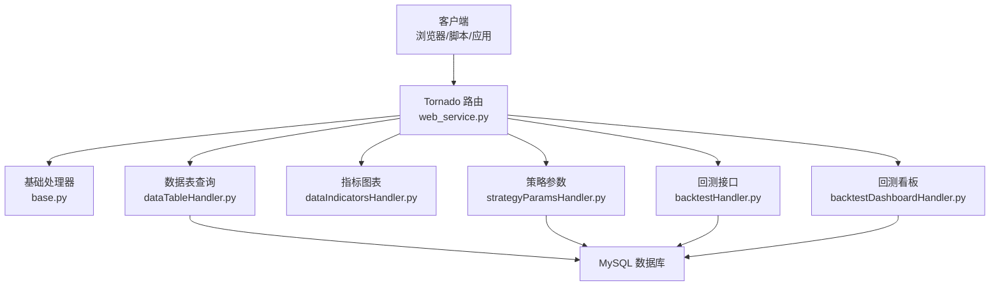
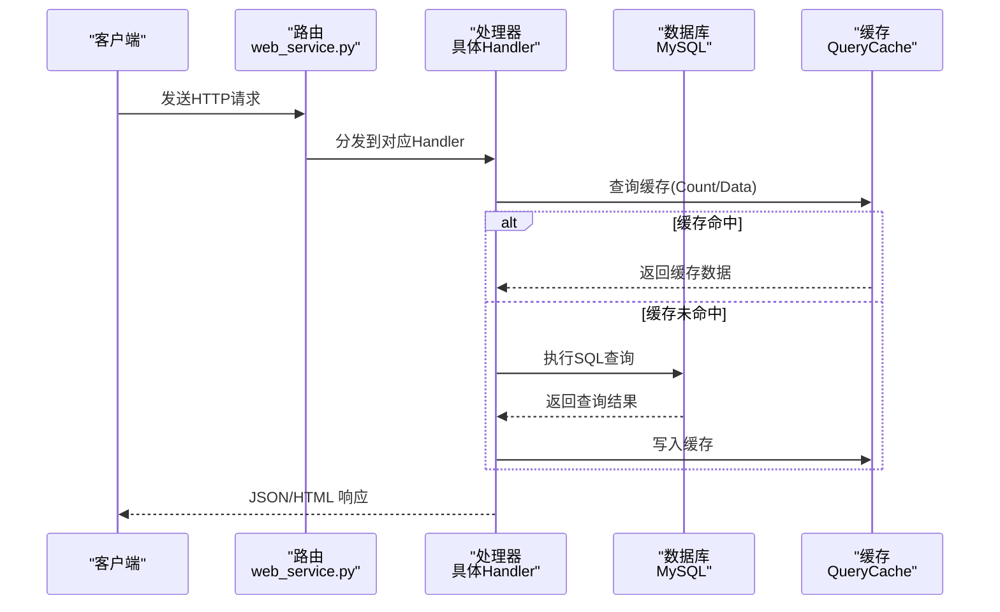

# RESTful API接口

<cite>
**本文引用的文件**
- [API参考文档](file://document/API_REFERENCE.md)
- [项目说明](file://README.md)
- [Web服务路由配置](file://docker/stock/quantia/web/web_service.py)
- [基础处理器](file://docker/stock/quantia/web/base.py)
- [数据表查询处理器](file://docker/stock/quantia/web/dataTableHandler.py)
- [指标图表处理器](file://docker/stock/quantia/web/dataIndicatorsHandler.py)
- [策略参数处理器](file://docker/stock/quantia/web/strategyParamsHandler.py)
- [回测处理器](file://docker/stock/quantia/web/backtestHandler.py)
- [回测看板处理器](file://docker/stock/quantia/web/backtestDashboardHandler.py)
- [数据表结构定义](file://docker/stock/quantia/core/tablestructure.py)
- [查询缓存模块](file://docker/stock/quantia/lib/query_cache.py)
</cite>

## 目录
1. [简介](#简介)
2. [项目结构](#项目结构)
3. [核心组件](#核心组件)
4. [架构总览](#架构总览)
5. [详细组件分析](#详细组件分析)
6. [依赖关系分析](#依赖关系分析)
7. [性能考虑](#性能考虑)
8. [故障排查指南](#故障排查指南)
9. [结论](#结论)

## 简介
本文件为 Quantia 系统的 RESTful API 接口权威文档，覆盖数据表查询、股票指标、策略参数配置、回测验证等核心接口。内容包含：
- 接口清单、请求方法、URL 模式、参数定义、响应格式
- 分页、搜索过滤、排序机制
- 认证与错误码说明
- cURL、Python requests、JavaScript fetch 使用示例
- 性能优化建议与最佳实践

## 项目结构
Quantia 基于 Tornado Web 框架提供 REST API，路由集中在 web_service.py 中注册，各功能模块通过对应的 Handler 实现：
- 数据表查询：/quantia/api_data、/quantia/api/trade_date
- 指标图表：/quantia/data/indicators、关注操作：/quantia/control/attention
- 策略参数：/quantia/api/strategy/params、/quantia/api/strategy/params/save、/quantia/api/strategy/params/reset、/quantia/api/strategy/filter
- 回测验证：/quantia/api/backtest/config、/quantia/api/backtest/run、/quantia/api/backtest/batch
- 回测看板：/quantia/api/backtest/dashboard/*

**图表来源**
- [Web服务路由配置](file://docker/stock/quantia/web/web_service.py#L56-L88)
- [基础处理器](file://docker/stock/quantia/web/base.py#L14-L36)
- [数据表查询处理器](file://docker/stock/quantia/web/dataTableHandler.py#L54-L214)
- [指标图表处理器](file://docker/stock/quantia/web/dataIndicatorsHandler.py#L16-L41)
- [策略参数处理器](file://docker/stock/quantia/web/strategyParamsHandler.py#L563-L661)
- [回测处理器](file://docker/stock/quantia/web/backtestHandler.py#L69-L126)
- [回测看板处理器](file://docker/stock/quantia/web/backtestDashboardHandler.py#L360-L466)

**章节来源**
- [Web服务路由配置](file://docker/stock/quantia/web/web_service.py#L56-L88)
- [基础处理器](file://docker/stock/quantia/web/base.py#L14-L36)

## 核心组件
- 基础处理器 BaseHandler：统一设置 CORS、数据库连接检查与重连
- 数据表查询处理器 GetStockDataHandler：支持分页、搜索、排序、日期回退、缓存
- 指标图表处理器 GetDataIndicatorsHandler：返回指标可视化 HTML 片段
- 策略参数处理器：参数查询/保存/重置、动态筛选
- 回测处理器：单股回测、批量回测、回测配置
- 回测看板处理器：跨策略总览、时间序列、明细、收益分布、交易对明细

**章节来源**
- [基础处理器](file://docker/stock/quantia/web/base.py#L14-L36)
- [数据表查询处理器](file://docker/stock/quantia/web/dataTableHandler.py#L54-L214)
- [指标图表处理器](file://docker/stock/quantia/web/dataIndicatorsHandler.py#L16-L41)
- [策略参数处理器](file://docker/stock/quantia/web/strategyParamsHandler.py#L563-L661)
- [回测处理器](file://docker/stock/quantia/web/backtestHandler.py#L69-L126)
- [回测看板处理器](file://docker/stock/quantia/web/backtestDashboardHandler.py#L360-L466)

## 架构总览
API 采用 JSON 响应为主，部分接口返回 HTML 片段（如指标图表）。所有接口均支持跨域（CORS），数据库连接异常时自动重连。

**图表来源**
- [Web服务路由配置](file://docker/stock/quantia/web/web_service.py#L56-L88)
- [数据表查询处理器](file://docker/stock/quantia/web/dataTableHandler.py#L123-L151)
- [查询缓存模块](file://docker/stock/quantia/lib/query_cache.py#L51-L92)

**章节来源**
- [Web服务路由配置](file://docker/stock/quantia/web/web_service.py#L56-L88)
- [查询缓存模块](file://docker/stock/quantia/lib/query_cache.py#L27-L156)

## 详细组件分析

### 1. 数据表查询 API
- 基础信息
  - 方法：GET
  - URL：/quantia/api_data
  - 响应：JSON
  - 说明：支持分页、搜索、排序、日期回退、缓存

- 请求参数
  - table_name: string, 必填, 数据表名
  - date: string, 可选, 日期(YYYY-MM-DD)
  - columns: string, 可选, 指定返回列
  - order: string, 可选, 排序字段
  - search: string, 可选, 搜索关键字
  - start: int, 可选, 分页起始位置
  - length: int, 可选, 每页数量

- 响应结构
  - draw: number, 与 Datatables 兼容的绘图计数
  - recordsTotal: number, 总记录数
  - recordsFiltered: number, 过滤后记录数
  - data: array, 行数据数组
  - columns: array, 列定义（当使用 GetStockDataHandler 时返回）

- 分页机制
  - start/length 参数映射为 SQL LIMIT/OFFSET
  - 默认最大页大小 500

- 搜索过滤
  - search 支持 code/name 模糊匹配
  - 支持自定义 where 条件拼接

- 排序
  - order_by 与 order_columns 由数据模块定义
  - 若排序列不存在，自动去除排序重试

- 日期回退
  - 当按指定 date 查询无数据时，自动回退到表中最新日期

- 缓存
  - COUNT 查询与 DATA 查询分别缓存，TTL 5分钟
  - 缓存 key 由 SQL + 参数组成

- 错误处理
  - 参数缺失返回 400
  - 表不存在返回 404
  - 其他异常返回 500

- 示例
  - cURL
    - curl "http://localhost:9988/quantia/api_data?table_name=cn_stock_spot&date=2024-01-15&length=100"
  - Python requests
    - requests.get("http://localhost:9988/quantia/api_data", params={"table_name": "cn_stock_spot", "date": "2024-01-15", "length": 100})
  - JavaScript fetch
    - fetch("/quantia/api_data?table_name=cn_stock_spot&date=2024-01-15")

**章节来源**
- [API参考文档](file://document/API_REFERENCE.md#L31-L108)
- [数据表查询处理器](file://docker/stock/quantia/web/dataTableHandler.py#L54-L214)
- [查询缓存模块](file://docker/stock/quantia/lib/query_cache.py#L147-L156)

### 2. 数据表页面 API
- 基础信息
  - 方法：GET
  - URL：/quantia/data
  - 响应：HTML（DataTables 页面）
  - 说明：返回带 DataTables 的 HTML 页面

- 请求参数
  - table_name: string, 必填, 数据表名
  - date: string, 可选, 日期(YYYY-MM-DD)

**章节来源**
- [API参考文档](file://document/API_REFERENCE.md#L110-L129)

### 3. 股票指标图表 API
- 基础信息
  - 方法：GET
  - URL：/quantia/data/indicators
  - 响应：HTML（指标图表片段）
  - 说明：返回 K线图、指标图、筹码分布图等 HTML 片段

- 请求参数
  - code: string, 必填, 股票代码
  - date: string, 可选, 日期(YYYY-MM-DD)
  - type: string, 可选, 图表类型

**章节来源**
- [API参考文档](file://document/API_REFERENCE.md#L131-L161)
- [指标图表处理器](file://docker/stock/quantia/web/dataIndicatorsHandler.py#L16-L41)

### 4. 关注操作 API
- 基础信息
  - 方法：POST
  - URL：/quantia/control/attention
  - 响应：JSON
  - 说明：添加/删除关注

- 请求体
  - code: string, 必填, 股票代码
  - action: string, 必填, 操作类型: add/remove

- 响应
  - status: string, success/fail
  - message: string, 描述信息

**章节来源**
- [API参考文档](file://document/API_REFERENCE.md#L163-L196)
- [指标图表处理器](file://docker/stock/quantia/web/dataIndicatorsHandler.py#L45-L62)

### 5. 策略参数查询 API
- 基础信息
  - 方法：GET
  - URL：/quantia/api/strategy/params
  - 响应：JSON
  - 说明：获取策略参数配置

- 请求参数
  - strategy: string, 必填, 策略类型: gpt_value / moat_scoring / ai_model

- 响应示例
  - status: string, success/fail
  - data: object, 包含策略名、描述、参数组、参数定义

**章节来源**
- [API参考文档](file://document/API_REFERENCE.md#L198-L227)
- [策略参数处理器](file://docker/stock/quantia/web/strategyParamsHandler.py#L563-L589)

### 6. 保存策略参数 API
- 基础信息
  - 方法：POST
  - URL：/quantia/api/strategy/params/save
  - 响应：JSON
  - 说明：保存策略参数

- 请求体
  - strategy: string, 必填, 策略类型
  - params: object, 必填, 参数键值对

- 响应
  - success: boolean
  - message: string
  - saved_count: number

**章节来源**
- [API参考文档](file://document/API_REFERENCE.md#L230-L251)
- [策略参数处理器](file://docker/stock/quantia/web/strategyParamsHandler.py#L591-L627)

### 7. 重置策略参数 API
- 基础信息
  - 方法：POST
  - URL：/quantia/api/strategy/params/reset
  - 响应：JSON
  - 说明：重置策略参数为默认值

- 请求体
  - strategy: string, 必填, 策略类型

- 响应
  - success: boolean
  - message: string

**章节来源**
- [API参考文档](file://document/API_REFERENCE.md#L253-L269)
- [策略参数处理器](file://docker/stock/quantia/web/strategyParamsHandler.py#L629-L661)

### 8. 动态筛选股票 API
- 基础信息
  - 方法：GET
  - URL：/quantia/api/strategy/filter
  - 响应：JSON
  - 说明：根据用户配置的策略参数，从 cn_stock_selection 表动态执行 SQL 查询

- 请求参数
  - strategy: string, 必填, 策略类型
  - date: string, 可选, 日期(YYYY-MM-DD)
  - page: int, 可选, 页码
  - page_size: int, 可选, 每页数量

- 响应
  - 分页字段：total、page、page_size
  - 数据字段：按策略筛选结果

- 缓存
  - TTL 10分钟，使用 filter_result_cache

**章节来源**
- [API参考文档](file://document/API_REFERENCE.md#L271-L290)
- [策略参数处理器](file://docker/stock/quantia/web/strategyParamsHandler.py#L663-L800)
- [查询缓存模块](file://docker/stock/quantia/lib/query_cache.py#L152-L156)

### 9. 回测配置 API
- 基础信息
  - 方法：GET
  - URL：/quantia/api/backtest/config
  - 响应：JSON
  - 说明：返回可用的回测周期和策略列表

- 响应字段
  - periods: array, 可选周期
  - strategies: array, 策略列表
  - default_horizons: array, 默认持有天数
  - max_table_horizon: number, 表支持最大 horizon

**章节来源**
- [API参考文档](file://document/API_REFERENCE.md#L437-L454)
- [回测处理器](file://docker/stock/quantia/web/backtestHandler.py#L69-L79)

### 10. 单股回测 API
- 基础信息
  - 方法：GET
  - URL：/quantia/api/backtest/run
  - 响应：JSON
  - 说明：对单只股票执行回测

- 请求参数
  - code: string, 必填, 股票代码
  - strategy: string, 可选, 策略名称
  - period: string, 可选, 回测周期(1w/2w/1m/3m/6m/1y)，默认 1m
  - start_date: string, 可选, 开始日期(YYYY-MM-DD)
  - end_date: string, 可选, 结束日期(YYYY-MM-DD)
  - checkpoints: string, 可选, 输出点(逗号分隔，如 1,3,5,10,20)

- 响应字段
  - code、name、period
  - buy_date、buy_price
  - returns: array，各周期收益率
  - strategy_result: boolean/null
  - indicators: object，关键指标值
  - max_return、max_drawdown
  - data_points

**章节来源**
- [API参考文档](file://document/API_REFERENCE.md#L456-L471)
- [回测处理器](file://docker/stock/quantia/web/backtestHandler.py#L82-L101)

### 11. 批量策略回测 API
- 基础信息
  - 方法：GET
  - URL：/quantia/api/backtest/batch
  - 响应：JSON
  - 说明：对某策略在指定时间段内的所有选股记录进行回测

- 请求参数
  - strategy: string, 必填, 策略名称
  - period: string, 可选, 回测周期，默认 1m
  - limit: int, 可选, 统计天数，默认 30
  - horizons: string, 可选, 汇总使用的持有天数列表
  - success_days: int, 可选, 成功定义使用的持有天数

- 响应字段
  - strategy、period、total、success_count、success_rate
  - avg_returns: object，各 horizon 平均收益
  - details: array，每日明细

**章节来源**
- [API参考文档](file://document/API_REFERENCE.md#L473-L488)
- [回测处理器](file://docker/stock/quantia/web/backtestHandler.py#L103-L126)

### 12. 回测看板 API
- 跨策略总览
  - URL：/quantia/api/backtest/dashboard/overview
  - 参数：days、start_date、end_date、metric
  - 响应：按策略汇总的信号数、成功率、平均收益、最佳/最差日期

- 时间序列
  - URL：/quantia/api/backtest/dashboard/timeline
  - 参数：strategies、days、start_date、end_date、horizon
  - 响应：各策略按信号日的时间序列

- 单策略明细
  - URL：/quantia/api/backtest/dashboard/strategy_detail
  - 参数：strategy、days、start_date、end_date、horizons、page、page_size
  - 响应：分页 rows，包含 rate_h 列

- 收益分布
  - URL：/quantia/api/backtest/dashboard/distribution
  - 参数：strategy、days、start_date、end_date、horizon
  - 响应：分箱统计 bins

- 买入-卖出配对明细
  - URL：/quantia/api/backtest/dashboard/trade_pairs
  - 参数：strategy、days、start_date、end_date、max_hold、page、page_size
  - 响应：buy/sell 日期、价格、持有天数、收益率与退出类型

**章节来源**
- [API参考文档](file://document/API_REFERENCE.md#L491-L724)
- [回测看板处理器](file://docker/stock/quantia/web/backtestDashboardHandler.py#L360-L800)

### 13. 交易日期 API
- 基础信息
  - 方法：GET
  - URL：/quantia/api/trade_date
  - 响应：JSON
  - 说明：返回最近交易日期

- 响应字段
  - run_date: 最近已收盘的交易日
  - run_date_nph: 当前交易日（含未收盘）

**章节来源**
- [API参考文档](file://document/API_REFERENCE.md#L727-L746)
- [数据表查询处理器](file://docker/stock/quantia/web/dataTableHandler.py#L217-L232)

## 依赖关系分析
- 路由到处理器
  - web_service.py 注册所有 API 路由，分发到对应 Handler
- 处理器到数据库
  - 所有 Handler 继承 BaseHandler，通过 self.db 访问数据库
  - 数据库连接异常时自动 reconnect
- 处理器到缓存
  - 数据表查询使用 stock_data_cache
  - 策略筛选使用 filter_result_cache
- 处理器到数据结构
  - tablestructure.py 定义表结构、列类型、策略映射

```mermaid
classDiagram
class BaseHandler {
+set_default_headers()
+options()
+db
}
class GetStockDataHandler {
+get()
}
class GetDataIndicatorsHandler {
+get()
}
class GetStrategyParamsHandler {
+get()
}
class SaveStrategyParamsHandler {
+post()
}
class ResetStrategyParamsHandler {
+post()
}
class FilterStocksHandler {
+get()
}
class GetBacktestConfigHandler {
+get()
}
class RunBacktestHandler {
+get()
}
class RunBatchBacktestHandler {
+get()
}
class DashboardOverviewHandler {
+get()
}
class PerformanceTimelineHandler {
+get()
}
class StrategyDetailHandler {
+get()
}
class ReturnDistributionHandler {
+get()
}
class TradePairHandler {
+get()
}
BaseHandler <|-- GetStockDataHandler
BaseHandler <|-- GetDataIndicatorsHandler
BaseHandler <|-- GetStrategyParamsHandler
BaseHandler <|-- SaveStrategyParamsHandler
BaseHandler <|-- ResetStrategyParamsHandler
BaseHandler <|-- FilterStocksHandler
BaseHandler <|-- GetBacktestConfigHandler
BaseHandler <|-- RunBacktestHandler
BaseHandler <|-- RunBatchBacktestHandler
BaseHandler <|-- DashboardOverviewHandler
BaseHandler <|-- PerformanceTimelineHandler
BaseHandler <|-- StrategyDetailHandler
BaseHandler <|-- ReturnDistributionHandler
BaseHandler <|-- TradePairHandler
```

**图表来源**
- [基础处理器](file://docker/stock/quantia/web/base.py#L14-L36)
- [数据表查询处理器](file://docker/stock/quantia/web/dataTableHandler.py#L54-L214)
- [指标图表处理器](file://docker/stock/quantia/web/dataIndicatorsHandler.py#L16-L62)
- [策略参数处理器](file://docker/stock/quantia/web/strategyParamsHandler.py#L563-L661)
- [回测处理器](file://docker/stock/quantia/web/backtestHandler.py#L69-L126)
- [回测看板处理器](file://docker/stock/quantia/web/backtestDashboardHandler.py#L360-L800)

**章节来源**
- [Web服务路由配置](file://docker/stock/quantia/web/web_service.py#L56-L88)
- [数据表结构定义](file://docker/stock/quantia/core/tablestructure.py#L409-L467)

## 性能考虑
- 缓存策略
  - 数据表查询：COUNT/DATA 分别缓存，TTL 5分钟，适合分页翻页场景
  - 策略筛选：TTL 10分钟，适合参数变更频率较低的场景
  - 缓存键：SQL + 参数哈希，命中后移动到末尾
- 数据库连接
  - BaseHandler 每次请求检查并自动重连，避免连接失效
- 分页与过滤
  - 合理设置 page/page_size，避免超大页码
  - 搜索关键词建议配合索引列使用
- 回测
  - 单股回测使用缓存历史数据，避免重复网络请求
  - 批量回测支持并行处理，提升性能

**章节来源**
- [查询缓存模块](file://docker/stock/quantia/lib/query_cache.py#L27-L156)
- [基础处理器](file://docker/stock/quantia/web/base.py#L28-L36)
- [数据表查询处理器](file://docker/stock/quantia/web/dataTableHandler.py#L123-L151)

## 故障排查指南
- 常见错误码
  - 400：参数错误
  - 404：资源不存在
  - 500：服务器内部错误
- 错误响应格式
  - {"error": true, "message": "错误描述信息"}
- 典型问题定位
  - 参数缺失：检查必填参数是否传递
  - 表不存在：确认 table_name 是否正确，数据作业是否运行
  - 查询异常：查看日志，确认 SQL 语法与列是否存在
  - 缓存问题：使用缓存失效接口或等待 TTL 过期

**章节来源**
- [API参考文档](file://document/API_REFERENCE.md#L346-L365)
- [数据表查询处理器](file://docker/stock/quantia/web/dataTableHandler.py#L151-L179)

## 结论
Quantia 的 RESTful API 设计清晰，覆盖数据查询、指标可视化、策略参数管理、回测验证与看板展示等核心场景。通过合理的缓存策略与错误处理，能够在大数据量场景下保持良好性能与稳定性。建议在生产环境中结合监控与日志，持续优化查询与缓存策略。
