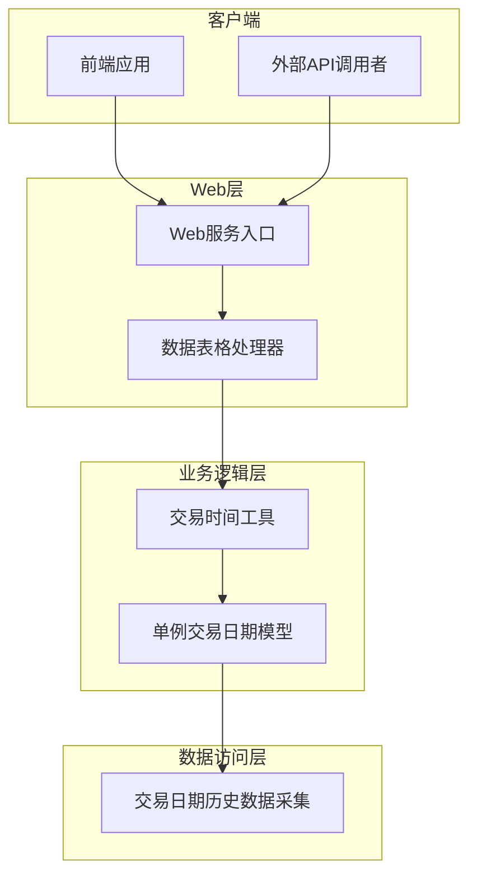
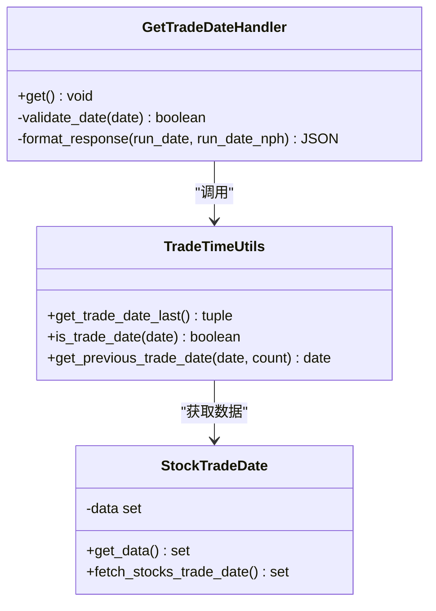
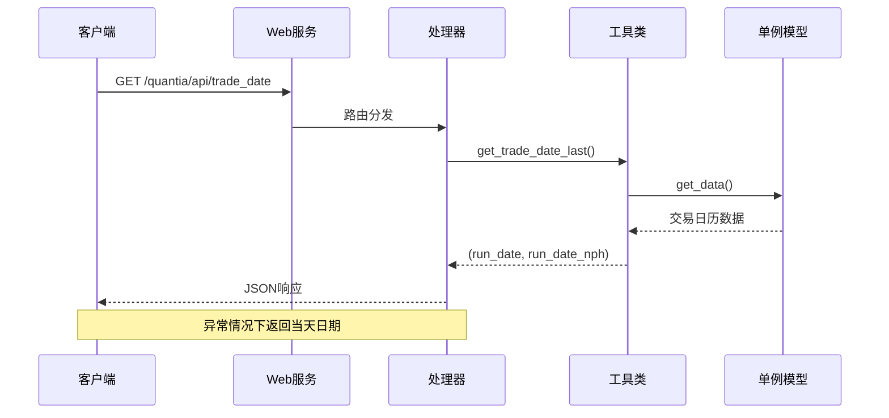
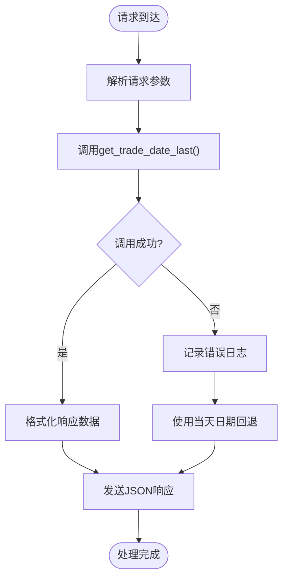
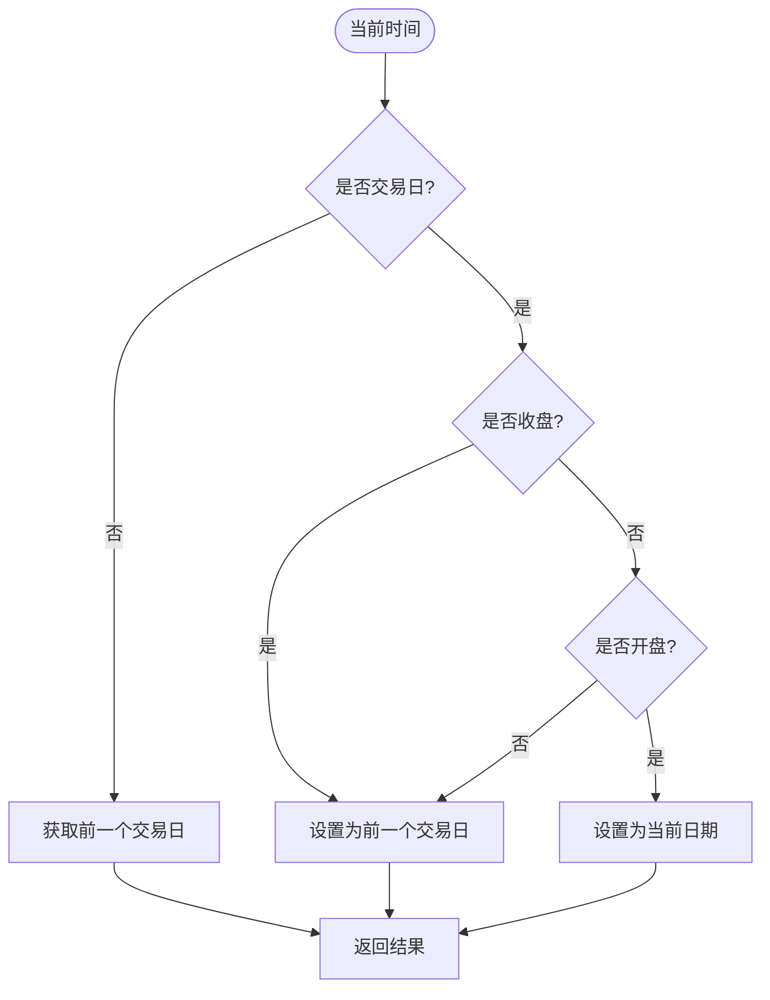
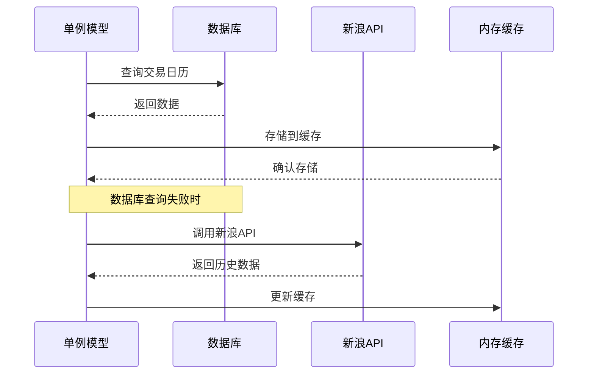
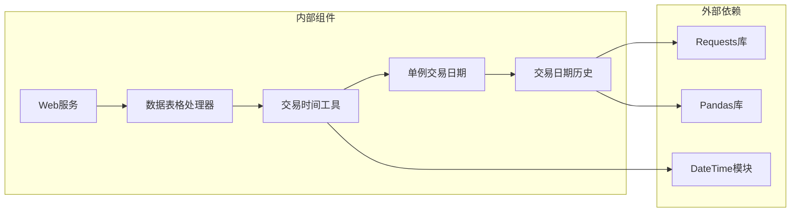

# 交易日期接口

<cite>
**本文引用的文件列表**
- [API参考文档](file://document/API_REFERENCE.md)
- [Web服务入口](file://quantia/web/web_service.py)
- [数据表格处理器](file://quantia/web/dataTableHandler.py)
- [交易时间工具](file://quantia/lib/trade_time.py)
- [单例交易日期模型](file://quantia/core/singleton_trade_date.py)
- [交易日期历史数据采集](file://quantia/core/crawling/trade_date_hist.py)
- [Docker版Web服务入口](file://docker/stock/quantia/web/web_service.py)
- [Docker版数据表格处理器](file://docker/stock/quantia/web/dataTableHandler.py)
- [Docker版交易时间工具](file://docker/stock/quantia/lib/trade_time.py)
- [Docker版单例交易日期模型](file://docker/stock/quantia/core/singleton_trade_date.py)
- [Docker版交易日期历史数据采集](file://docker/stock/quantia/core/crawling/trade_date_hist.py)
</cite>

## 目录
1. [简介](#简介)
2. [项目结构](#项目结构)
3. [核心组件](#核心组件)
4. [架构概览](#架构概览)
5. [详细组件分析](#详细组件分析)
6. [依赖关系分析](#依赖关系分析)
7. [性能考虑](#性能考虑)
8. [故障排除指南](#故障排除指南)
9. [结论](#结论)

## 简介
本文档详细介绍Quantia系统中交易日期API的功能和使用方法，重点说明获取最近交易日期接口（/quantia/api/trade_date）的设计原理和应用场景。该接口返回两个关键日期字段：run_date（最近已收盘的交易日，用于非实时数据表）和run_date_nph（当前交易日，含未收盘，用于实时数据表）。这些日期字段在数据查询、回测验证、策略执行等核心业务流程中发挥着至关重要的作用。

## 项目结构
Quantia系统采用分层架构设计，交易日期API位于Web层，通过统一的服务入口提供RESTful接口。系统支持两种部署模式：标准模式和Docker模式，两者在文件组织上略有差异但功能保持一致。

**图表来源**
- [Web服务入口](file://quantia/web/web_service.py#L53-L97)
- [数据表格处理器](file://quantia/web/dataTableHandler.py#L217-L232)
- [交易时间工具](file://quantia/lib/trade_time.py#L171-L183)

**章节来源**
- [Web服务入口](file://quantia/web/web_service.py#L53-L97)
- [Docker版Web服务入口](file://docker/stock/quantia/web/web_service.py#L53-L97)

## 核心组件
交易日期API系统由多个核心组件协同工作，形成完整的交易日历管理系统：

### 接口定义
- **端点**: `/quantia/api/trade_date`
- **方法**: GET
- **响应格式**: JSON
- **响应内容**: 包含run_date和run_date_nph两个日期字段

### 数据模型

**图表来源**
- [数据表格处理器](file://quantia/web/dataTableHandler.py#L217-L232)
- [交易时间工具](file://quantia/lib/trade_time.py#L171-L183)
- [单例交易日期模型](file://quantia/core/singleton_trade_date.py#L11-L22)

**章节来源**
- [API参考文档](file://document/API_REFERENCE.md#L727-L746)
- [数据表格处理器](file://quantia/web/dataTableHandler.py#L217-L232)

## 架构概览
交易日期API采用典型的三层架构设计，确保了系统的可维护性和扩展性。

**图表来源**
- [Web服务入口](file://quantia/web/web_service.py#L60-L61)
- [数据表格处理器](file://quantia/web/dataTableHandler.py#L217-L232)
- [交易时间工具](file://quantia/lib/trade_time.py#L171-L183)

## 详细组件分析

### 接口实现详解
GetTradeDateHandler类负责处理交易日期查询请求，实现了完整的错误处理机制。

#### 核心处理流程

**图表来源**
- [数据表格处理器](file://quantia/web/dataTableHandler.py#L217-L232)

#### 错误处理机制
系统实现了多层次的错误处理策略：
1. **主要异常处理**: 当交易时间工具调用失败时，记录错误日志
2. **回退机制**: 使用当前日期作为默认值
3. **日志记录**: 详细的异常信息便于问题诊断

**章节来源**
- [数据表格处理器](file://quantia/web/dataTableHandler.py#L217-L232)

### 交易时间计算逻辑
交易时间工具类提供了精确的交易日计算算法，确保在不同时间段内返回正确的日期值。

#### 交易日计算规则

**图表来源**
- [交易时间工具](file://quantia/lib/trade_time.py#L171-L183)

#### 时间状态判断
系统内置了完整的工作时间判断机制：
- **开盘时间**: 9:30以后
- **交易时段**: 9:15-11:30 和 13:00-15:00
- **休市时段**: 11:30-12:59:30
- **收盘时间**: 15:00以后

**章节来源**
- [交易时间工具](file://quantia/lib/trade_time.py#L58-L124)

### 数据源管理
单例交易日期模型确保了交易日历数据的高效访问和一致性。

#### 数据获取流程

**图表来源**
- [单例交易日期模型](file://quantia/core/singleton_trade_date.py#L11-L22)
- [交易日期历史数据采集](file://quantia/core/crawling/trade_date_hist.py#L352-L382)

**章节来源**
- [单例交易日期模型](file://quantia/core/singleton_trade_date.py#L11-L22)
- [交易日期历史数据采集](file://quantia/core/crawling/trade_date_hist.py#L352-L382)

## 依赖关系分析
交易日期API系统具有清晰的依赖层次结构，各组件之间的耦合度较低，便于维护和扩展。

**图表来源**
- [Web服务入口](file://quantia/web/web_service.py#L34-L40)
- [数据表格处理器](file://quantia/web/dataTableHandler.py#L10-L13)
- [交易日期历史数据采集](file://quantia/core/crawling/trade_date_hist.py#L11-L14)

### 组件间交互
系统采用松耦合设计，通过明确的接口进行通信：

1. **Web层**: 提供RESTful接口和路由分发
2. **业务层**: 实现核心业务逻辑和数据处理
3. **数据层**: 负责数据持久化和外部数据获取

**章节来源**
- [Web服务入口](file://quantia/web/web_service.py#L53-L97)
- [数据表格处理器](file://quantia/web/dataTableHandler.py#L217-L232)

## 性能考虑
系统在设计时充分考虑了性能优化，采用了多种策略来提升响应速度和资源利用率。

### 缓存策略
- **内存缓存**: 单例模式确保交易日历数据只加载一次
- **查询缓存**: 数据表格处理器使用缓存减少数据库查询压力
- **响应缓存**: 针对频繁查询的接口提供短期缓存

### 异步处理
- **非阻塞I/O**: 使用Tornado框架实现异步请求处理
- **连接池管理**: 数据库连接采用连接池复用机制
- **代理池**: 支持动态代理切换，提高外部API访问稳定性

## 故障排除指南

### 常见问题及解决方案

#### 1. 接口响应异常
**症状**: 返回500错误或响应格式错误
**原因**: 交易时间工具调用失败
**解决**: 检查日志文件，确认异常堆栈信息

#### 2. 日期计算不准确
**症状**: 返回的日期与预期不符
**原因**: 交易日历数据缺失或过期
**解决**: 验证数据库连接，检查交易日历更新任务

#### 3. 性能问题
**症状**: 接口响应时间过长
**原因**: 缓存未命中或数据库查询缓慢
**解决**: 检查缓存配置，优化数据库索引

### 调试建议
1. **启用详细日志**: 检查`stock_web.log`文件
2. **验证数据源**: 确认交易日历数据完整性
3. **测试网络连接**: 验证外部API可达性

**章节来源**
- [数据表格处理器](file://quantia/web/dataTableHandler.py#L228-L231)

## 结论
Quantia系统的交易日期API通过精心设计的架构和完善的错误处理机制，为整个系统提供了可靠的交易日历服务。接口的两个关键字段run_date和run_date_nph分别服务于非实时和实时数据场景，确保了数据查询、回测验证和策略执行的准确性。

系统采用的单例模式、缓存策略和异步处理技术，有效提升了性能表现。同时，多层次的错误处理和监控机制保证了系统的稳定性和可维护性。对于开发者而言，理解这两个日期字段的语义和使用场景，是正确集成和使用该API的关键。
