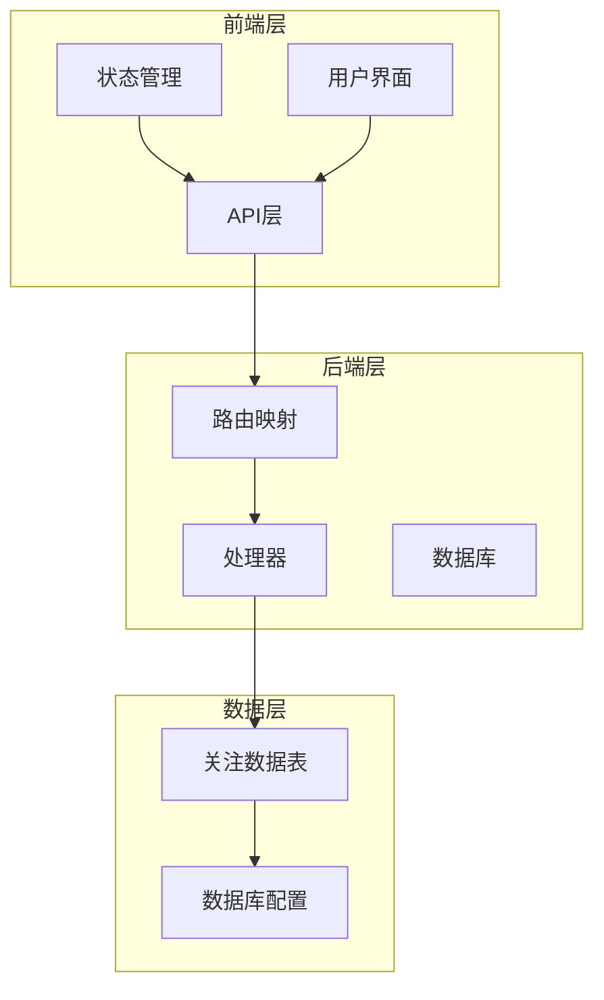
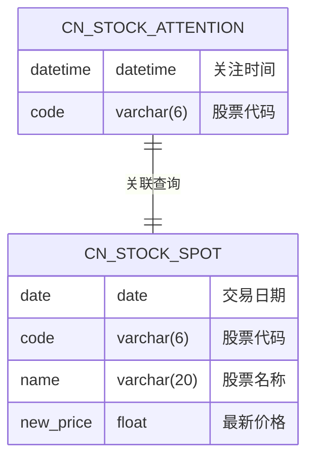
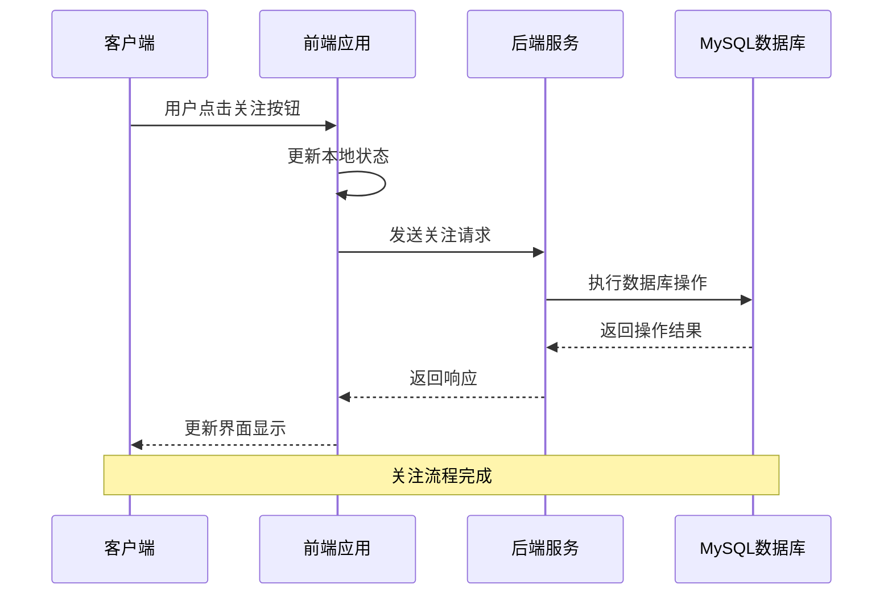
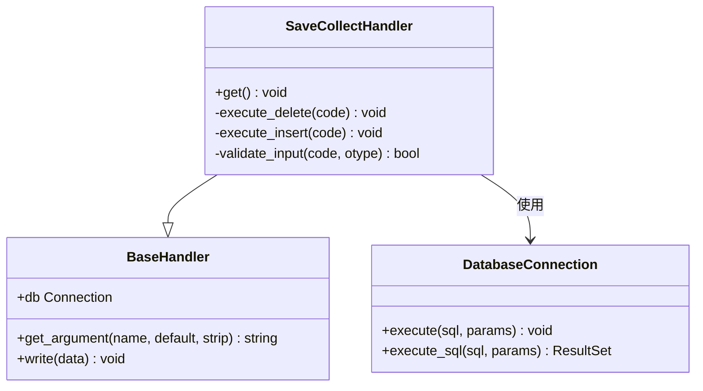
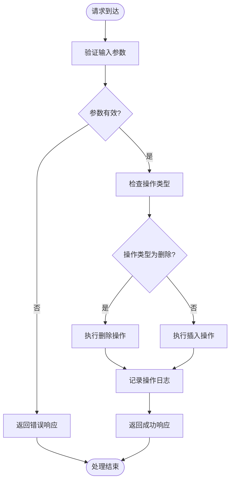
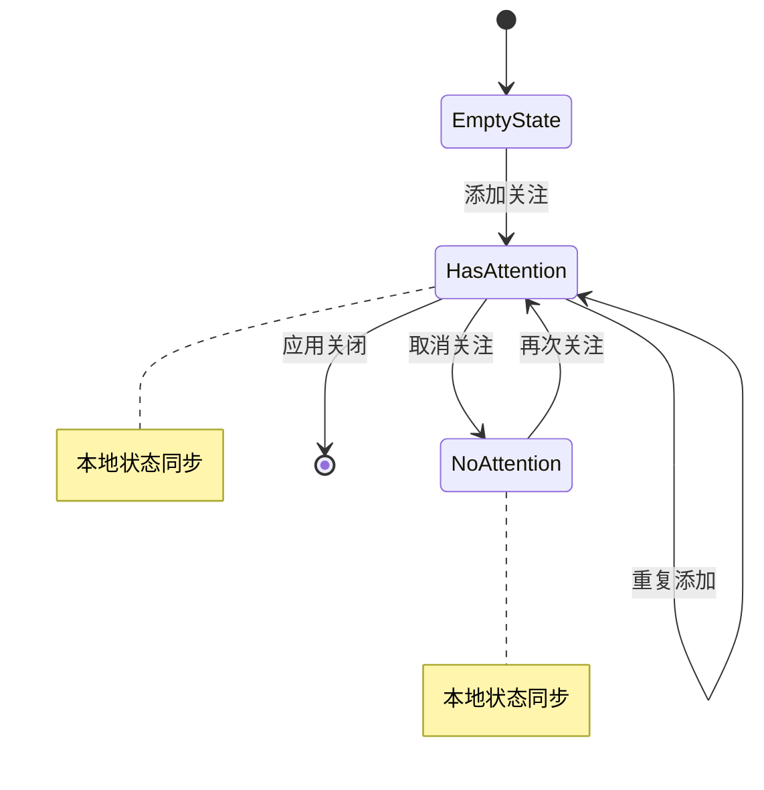
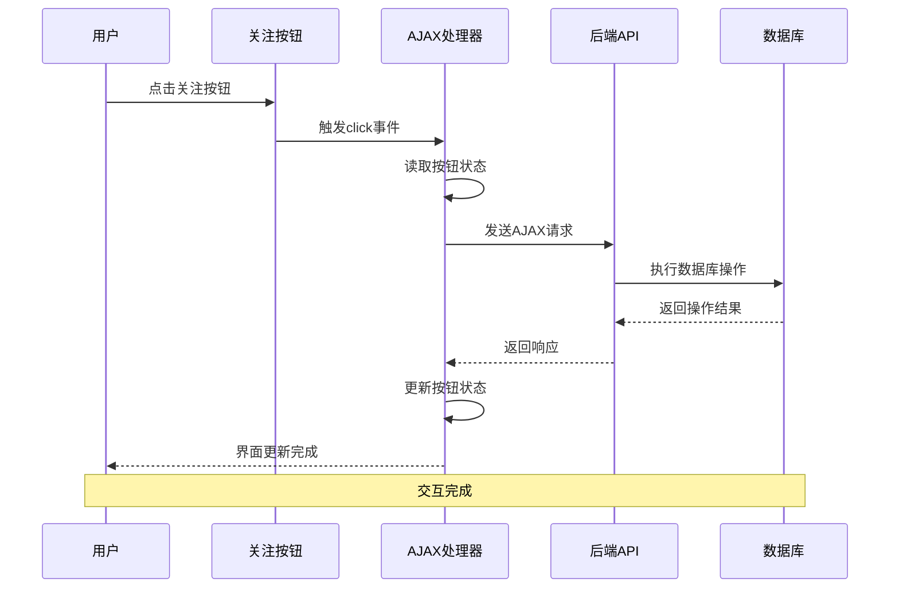
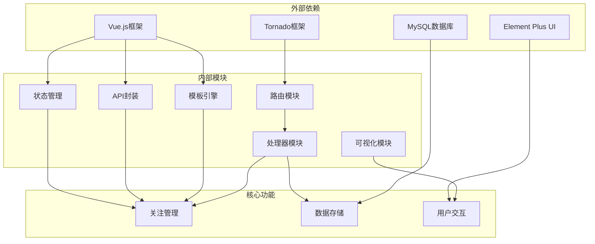
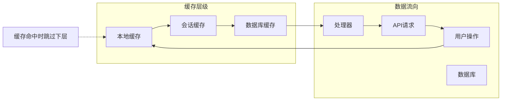
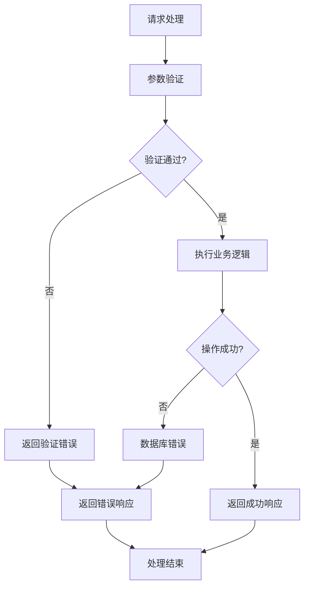

# 关注管理接口

<cite>
**本文档引用的文件**
- [API_REFERENCE.md](file://document/API_REFERENCE.md)
- [web_service.py](file://quantia/web/web_service.py)
- [dataIndicatorsHandler.py](file://quantia/web/dataIndicatorsHandler.py)
- [stock.ts](file://quantia/fontWeb/src/stores/stock.ts)
- [stock.ts](file://quantia/fontWeb/src/api/stock.ts)
- [stock_indicators.html](file://quantia/web/templates/stock_indicators.html)
- [visualization.py](file://quantia/core/kline/visualization.py)
- [init_database.sql](file://docker/init_database.sql)
- [database_schema.md](file://document/database_schema.md)
- [handlers.test.ts](file://quantia/fontWeb/tests/api/handlers.test.ts)
</cite>

## 目录
1. [简介](#简介)
2. [项目结构](#项目结构)
3. [核心组件](#核心组件)
4. [架构概览](#架构概览)
5. [详细组件分析](#详细组件分析)
6. [依赖关系分析](#依赖关系分析)
7. [性能考虑](#性能考虑)
8. [故障排除指南](#故障排除指南)
9. [结论](#结论)

## 简介

关注管理接口是Quantia系统中用于管理用户关注股票的核心功能模块。该接口允许用户添加或删除关注的股票，为后续的数据分析、策略回测和个性化展示提供基础支持。

系统采用前后端分离架构，后端使用Tornado框架提供RESTful API，前端使用Vue.js构建用户界面。关注数据存储在MySQL数据库中，通过专门的数据表实现高效的数据管理和查询。

## 项目结构

Quantia系统采用模块化设计，关注管理功能分布在多个层次中：

**图表来源**
- [web_service.py](file://quantia/web/web_service.py#L56-L88)
- [dataIndicatorsHandler.py](file://quantia/web/dataIndicatorsHandler.py#L45-L62)

**章节来源**
- [web_service.py](file://quantia/web/web_service.py#L53-L98)

## 核心组件

### API接口定义

关注管理接口遵循RESTful设计原则，提供标准的HTTP方法支持：

| 组件 | 描述 | 实现位置 |
|------|------|----------|
| **端点** | `/quantia/control/attention` | 路由配置 |
| **方法** | GET/POST | 处理器实现 |
| **请求格式** | JSON | 前端API封装 |
| **响应格式** | JSON | 标准响应结构 |

### 数据模型

关注数据采用简单而高效的存储结构：

**图表来源**
- [init_database.sql](file://docker/init_database.sql#L10-L15)
- [database_schema.md](file://document/database_schema.md#L51-L56)

### 前端集成

系统提供多层次的前端集成方式：

- **Vue Store**: 状态管理，支持本地状态同步
- **API封装**: 类型安全的请求封装
- **模板渲染**: 服务器端模板集成
- **测试覆盖**: 完整的单元测试

**章节来源**
- [stock.ts](file://quantia/fontWeb/src/stores/stock.ts#L10-L69)
- [stock.ts](file://quantia/fontWeb/src/api/stock.ts#L52-L58)

## 架构概览

关注管理系统的整体架构采用分层设计，确保功能的可维护性和扩展性：

**图表来源**
- [stock_indicators.html](file://quantia/web/templates/stock_indicators.html#L7-L23)
- [dataIndicatorsHandler.py](file://quantia/web/dataIndicatorsHandler.py#L45-L62)

## 详细组件分析

### 后端处理器实现

关注管理的核心逻辑由`SaveCollectHandler`类实现，负责处理关注状态的变更：

**图表来源**
- [dataIndicatorsHandler.py](file://quantia/web/dataIndicatorsHandler.py#L45-L62)

#### 处理器工作流程

关注操作的处理流程如下：

**图表来源**
- [dataIndicatorsHandler.py](file://quantia/web/dataIndicatorsHandler.py#L47-L61)

### 数据库设计

关注功能的数据库设计采用简洁高效的模式：

#### 表结构定义

| 字段名 | 数据类型 | 约束条件 | 说明 |
|--------|----------|----------|------|
| datetime | datetime | NOT NULL | 关注时间戳 |
| code | varchar(6) | NOT NULL, 主键 | 股票代码 |

#### 索引优化

- **主键索引**: `(datetime, code)` - 确保唯一性
- **辅助索引**: `idx_code` - 支持按股票代码查询

### 前端状态管理

系统提供双重状态管理机制：

#### Vue Store状态管理

**图表来源**
- [stock.ts](file://quantia/fontWeb/src/stores/stock.ts#L21-L39)

#### API封装设计

前端API封装提供了类型安全的接口：

| 方法 | 参数 | 返回值 | 说明 |
|------|------|--------|------|
| `toggleAttention()` | `AttentionParams` | `Promise` | 切换关注状态 |
| `addAttention()` | `StockItem` | `void` | 添加关注 |
| `removeAttention()` | `string` | `void` | 取消关注 |
| `isAttention()` | `string` | `boolean` | 检查关注状态 |

### 前端交互实现

关注按钮的前端交互采用事件驱动的方式：

**图表来源**
- [stock_indicators.html](file://quantia/web/templates/stock_indicators.html#L7-L23)

**章节来源**
- [stock_indicators.html](file://quantia/web/templates/stock_indicators.html#L1-L31)

## 依赖关系分析

关注管理功能涉及多个组件间的复杂依赖关系：

**图表来源**
- [web_service.py](file://quantia/web/web_service.py#L34-L40)
- [dataIndicatorsHandler.py](file://quantia/web/dataIndicatorsHandler.py#L7-L9)

### 关键依赖关系

1. **路由到处理器**: `/quantia/control/attention` → `SaveCollectHandler`
2. **处理器到数据库**: `torndb.Connection` → MySQL操作
3. **前端到后端**: `toggleAttention()` → `/quantia/control/attention`
4. **模板到处理器**: `stock_indicators.html` → `SaveCollectHandler`

**章节来源**
- [web_service.py](file://quantia/web/web_service.py#L64-L65)

## 性能考虑

### 数据库性能优化

关注功能的数据库操作经过精心优化：

- **索引设计**: 主键索引确保O(1)的查找性能
- **批量操作**: 支持批量关注管理操作
- **连接池**: 使用连接池减少连接开销
- **事务处理**: 确保数据一致性

### 前端性能优化

- **状态缓存**: 本地状态缓存减少网络请求
- **懒加载**: 按需加载关注数据
- **虚拟滚动**: 大数据集的高效展示
- **防抖处理**: 防止重复提交

### 缓存策略

系统采用多层缓存策略：

## 故障排除指南

### 常见问题及解决方案

#### 1. 关注功能无法使用

**症状**: 点击关注按钮无响应

**可能原因**:
- 数据库连接失败
- 股票代码格式错误
- 权限不足

**解决步骤**:
1. 检查数据库连接配置
2. 验证股票代码格式（6位数字）
3. 确认用户权限

#### 2. 数据库表缺失

**症状**: 关注操作报错，提示表不存在

**解决步骤**:
1. 运行数据库初始化脚本
2. 确认`cn_stock_attention`表存在
3. 检查表权限设置

#### 3. 前端状态不同步

**症状**: 界面显示与实际状态不符

**解决步骤**:
1. 刷新页面重新加载状态
2. 检查浏览器控制台错误
3. 清除浏览器缓存

### 错误处理机制

系统提供完善的错误处理机制：

**图表来源**
- [dataIndicatorsHandler.py](file://quantia/web/dataIndicatorsHandler.py#L60-L61)

**章节来源**
- [dataIndicatorsHandler.py](file://quantia/web/dataIndicatorsHandler.py#L47-L61)

## 结论

Quantia系统的关注管理接口设计合理，实现了功能完整、性能优良的关注管理功能。系统采用现代化的技术栈，提供了良好的用户体验和可靠的后台支持。

### 主要优势

1. **架构清晰**: 分层设计便于维护和扩展
2. **性能优秀**: 数据库优化和缓存策略确保高效运行
3. **用户体验**: 前后端协同提供流畅的操作体验
4. **可靠性强**: 完善的错误处理和异常恢复机制

### 技术亮点

- **前后端分离**: 提供灵活的客户端适配
- **类型安全**: TypeScript提供编译时类型检查
- **测试覆盖**: 完整的单元测试确保代码质量
- **文档完善**: 详细的API文档和使用指南

该关注管理接口为Quantia系统提供了坚实的基础，支持后续的功能扩展和业务发展需求。
