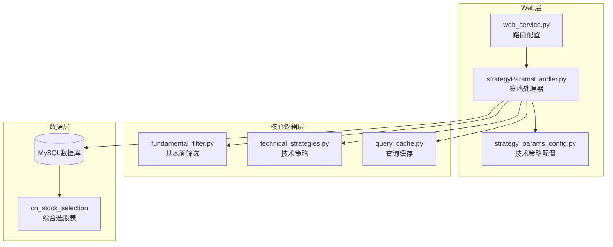
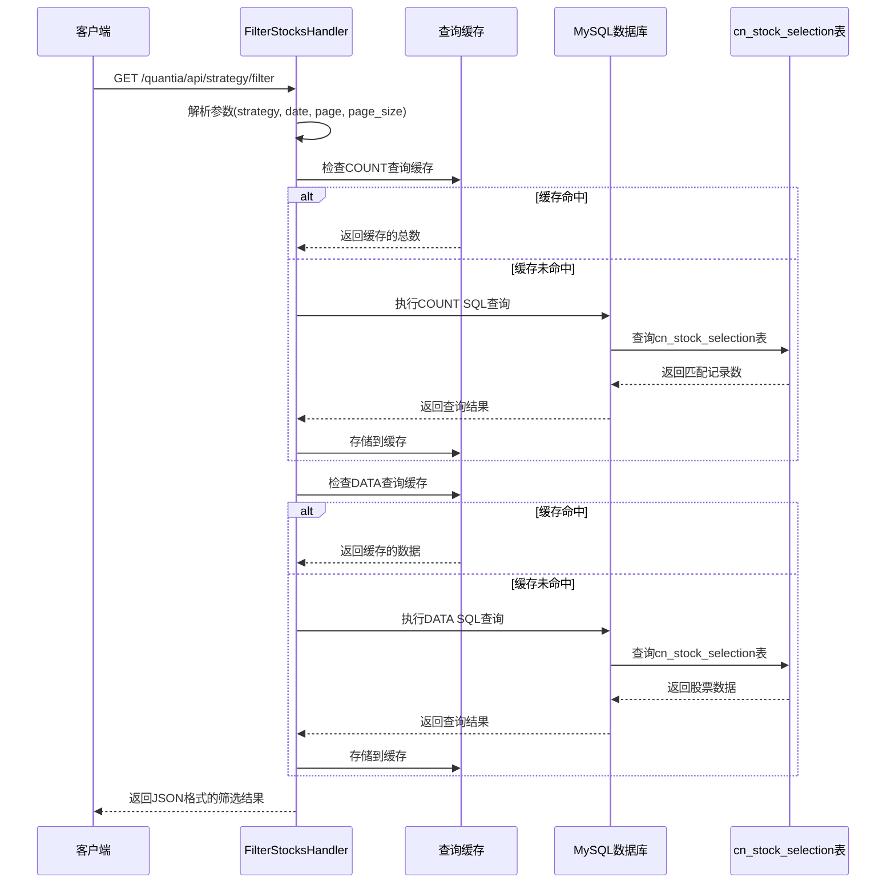
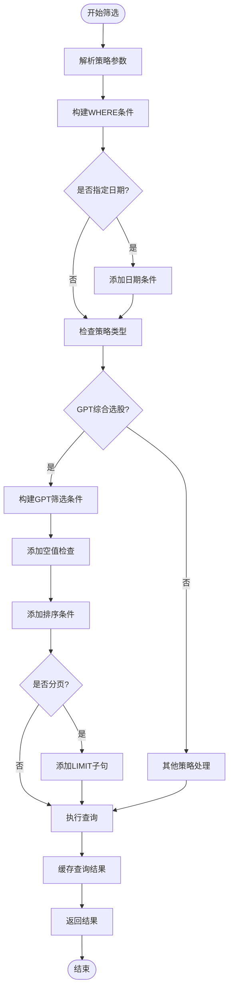
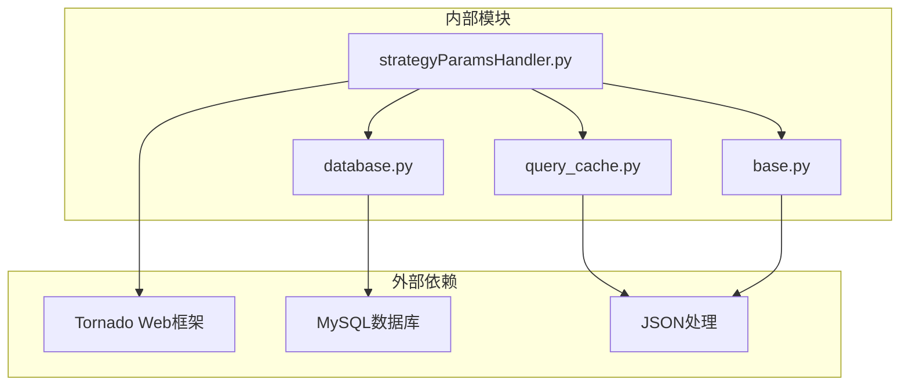

# 动态筛选接口

<cite>
**本文档引用的文件**
- [strategyParamsHandler.py](file://docker/stock/quantia/web/strategyParamsHandler.py)
- [web_service.py](file://docker/stock/quantia/web/web_service.py)
- [API_REFERENCE.md](file://document/API_REFERENCE.md)
- [query_cache.py](file://docker/stock/quantia/lib/query_cache.py)
- [strategy_params_config.py](file://docker/stock/quantia/web/strategy_params_config.py)
- [fundamental_filter.py](file://docker/stock/quantia/core/strategy/fundamental/fundamental_filter.py)
- [ma_strategies.py](file://docker/stock/quantia/core/strategy/technical/ma_strategies.py)
</cite>

## 目录
1. [简介](#简介)
2. [项目结构](#项目结构)
3. [核心组件](#核心组件)
4. [架构概览](#架构概览)
5. [详细组件分析](#详细组件分析)
6. [依赖关系分析](#依赖关系分析)
7. [性能考虑](#性能考虑)
8. [故障排除指南](#故障排除指南)
9. [结论](#结论)

## 简介

动态筛选接口（/quantia/api/strategy/filter）是Quantia系统的核心功能模块，专门用于根据用户配置的策略参数从cn_stock_selection表动态执行SQL查询，返回满足条件的股票列表。该接口支持多种策略类型，包括GPT综合选股、基本面选股、技术指标选股等，并实现了10分钟LRU缓存机制以提升查询性能。

该接口在量化投资决策中发挥着重要作用，为投资者提供了灵活、可定制的股票筛选工具，能够根据不同的投资理念和市场环境快速调整筛选条件，提高选股效率和准确性。

## 项目结构

Quantia系统采用模块化的架构设计，动态筛选功能主要分布在以下目录结构中：



**图表来源**
- [web_service.py](file://docker/stock/quantia/web/web_service.py#L53-L88)
- [strategyParamsHandler.py](file://docker/stock/quantia/web/strategyParamsHandler.py#L1-L50)
- [query_cache.py](file://docker/stock/quantia/lib/query_cache.py#L27-L43)

**章节来源**
- [web_service.py](file://docker/stock/quantia/web/web_service.py#L53-L88)
- [strategyParamsHandler.py](file://docker/stock/quantia/web/strategyParamsHandler.py#L1-L50)

## 核心组件

### 主要接口定义

动态筛选接口的核心实现位于strategyParamsHandler.py文件中，主要包括以下关键组件：

#### FilterStocksHandler类
这是动态筛选功能的主要处理器，负责：
- 接收HTTP GET请求
- 解析策略参数和筛选条件
- 动态构建SQL查询语句
- 执行数据库查询并返回结果
- 实现缓存机制优化性能

#### 策略参数管理系统
系统支持多种策略类型的参数配置：
- **GPT综合选股**：基于财务安全、盈利能力、成长质量、估值约束的多层筛选
- **基本面选股**：传统的价值投资策略
- **技术指标选股**：基于KDJ、RSI、MACD等技术指标
- **技术策略选股**：基于均线、突破等技术分析

#### 缓存机制
实现了专用的查询缓存系统，具有以下特点：
- LRU（最近最少使用）淘汰策略
- 10分钟TTL（生存时间）
- 线程安全设计
- 自动清理过期缓存

**章节来源**
- [strategyParamsHandler.py](file://docker/stock/quantia/web/strategyParamsHandler.py#L663-L700)
- [query_cache.py](file://docker/stock/quantia/lib/query_cache.py#L27-L43)

## 架构概览

动态筛选接口的整体架构采用分层设计，确保了良好的可维护性和扩展性：



**图表来源**
- [strategyParamsHandler.py](file://docker/stock/quantia/web/strategyParamsHandler.py#L685-L852)
- [query_cache.py](file://docker/stock/quantia/lib/query_cache.py#L51-L92)

## 详细组件分析

### 接口参数详解

动态筛选接口支持以下参数：

| 参数名 | 类型 | 必填 | 默认值 | 说明 |
|--------|------|------|--------|------|
| strategy | string | 是 | - | 策略类型，支持"gpt_value"、"fundamental_buy"等 |
| date | string | 否 | - | 日期筛选条件，格式YYYY-MM-DD |
| page | integer | 否 | - | 页码，用于分页显示 |
| page_size | integer | 否 | - | 每页大小，最大500 |

#### 策略类型支持

系统支持多种策略类型，每种策略都有其特定的参数配置：

**GPT综合选股策略**（strategy=gpt_value）
- 财务安全过滤：资产负债率、每股经营现金流、流动比率、速动比率
- 盈利能力筛选：ROE、毛利率、净利率、ROA
- 成长质量筛选：营收3年CAGR、净利润3年CAGR、扣非净利润增长率
- 估值约束：PE(TTM)范围、PB(MRQ)上限

**基本面选股策略**（strategy=fundamental_buy）
- 传统价值投资参数配置
- PE/PB限制条件
- ROE最低要求

**技术指标策略**（strategy=indicator_buy/sell）
- KDJ指标阈值
- RSI指标阈值
- CCI、WR等技术指标

**章节来源**
- [strategyParamsHandler.py](file://docker/stock/quantia/web/strategyParamsHandler.py#L663-L684)
- [strategyParamsHandler.py](file://docker/stock/quantia/web/strategyParamsHandler.py#L685-L790)

### SQL查询构建逻辑

动态筛选接口的核心功能是根据用户配置的参数动态构建SQL查询语句。查询构建遵循以下规则：



**图表来源**
- [strategyParamsHandler.py](file://docker/stock/quantia/web/strategyParamsHandler.py#L701-L790)

### 缓存机制实现

系统实现了专用的查询缓存机制，专门针对筛选结果进行优化：

#### 缓存特性
- **TTL设置**：10分钟（600秒）生存时间
- **容量限制**：最多128条缓存记录
- **淘汰策略**：LRU（最近最少使用）
- **线程安全**：使用锁机制保证并发安全

#### 缓存键生成
缓存键由SQL语句和参数组合生成，确保不同查询条件的缓存隔离：
- SQL语句作为基础
- 参数值序列化后附加
- 使用MD5哈希生成最终键

#### 缓存更新策略
- 参数变更时自动清除相关缓存
- 缓存过期自动清理
- 支持手动失效操作

**章节来源**
- [query_cache.py](file://docker/stock/quantia/lib/query_cache.py#L27-L155)
- [strategyParamsHandler.py](file://docker/stock/quantia/web/strategyParamsHandler.py#L619-L620)

### 错误处理机制

动态筛选接口实现了完善的错误处理机制：

#### 常见错误类型
- **参数错误**：无效的策略类型或参数格式
- **数据库错误**：表不存在或查询异常
- **权限错误**：数据库连接失败
- **超时错误**：查询执行时间过长

#### 错误响应格式
所有错误都返回标准化的JSON格式：
```json
{
    "error": "错误描述信息",
    "code": 400/404/500
}
```

#### 特殊情况处理
- cn_stock_selection表不存在时返回友好提示
- 查询结果为空时返回空数组而非null
- 参数解析失败时返回400状态码

**章节来源**
- [strategyParamsHandler.py](file://docker/stock/quantia/web/strategyParamsHandler.py#L838-L851)

## 依赖关系分析

动态筛选接口的依赖关系相对简单，主要依赖于以下几个核心模块：



**图表来源**
- [strategyParamsHandler.py](file://docker/stock/quantia/web/strategyParamsHandler.py#L10-L16)
- [query_cache.py](file://docker/stock/quantia/lib/query_cache.py#L15-L19)

### 模块间耦合度分析

动态筛选接口的模块设计体现了良好的内聚性和低耦合性：

- **高内聚**：所有筛选逻辑集中在单一处理器中
- **低耦合**：与缓存、数据库等模块通过接口交互
- **可扩展性**：新的策略类型可通过配置文件轻松添加
- **可维护性**：核心逻辑清晰，便于调试和修改

**章节来源**
- [strategyParamsHandler.py](file://docker/stock/quantia/web/strategyParamsHandler.py#L1-L20)
- [web_service.py](file://docker/stock/quantia/web/web_service.py#L66-L70)

## 性能考虑

动态筛选接口在设计时充分考虑了性能优化，主要体现在以下几个方面：

### 缓存策略优化
- **10分钟TTL**：平衡缓存命中率和数据新鲜度
- **LRU淘汰**：优先保留常用查询结果
- **独立缓存实例**：专门为筛选结果设计的缓存
- **自动失效**：参数变更时自动清除相关缓存

### 查询优化
- **索引利用**：合理使用日期和数值字段索引
- **条件优化**：优先使用可索引字段进行筛选
- **分页处理**：支持大数据集的分页查询
- **空值处理**：避免不必要的NULL值检查

### 内存管理
- **缓存容量限制**：防止内存过度占用
- **过期自动清理**：定期清理过期缓存
- **线程安全**：支持高并发访问
- **资源回收**：及时释放数据库连接

## 故障排除指南

### 常见问题及解决方案

#### 1. 接口返回空结果
**可能原因**：
- 策略参数设置过于严格
- cn_stock_selection表数据不足
- 日期筛选条件过于精确

**解决方法**：
- 调整策略参数的宽松度
- 检查数据作业是否正常运行
- 使用更宽泛的日期范围

#### 2. 缓存导致的结果陈旧
**可能原因**：
- 缓存TTL时间过长
- 参数变更后缓存未及时更新

**解决方法**：
- 等待缓存自然过期（10分钟）
- 手动清除相关缓存
- 重新配置策略参数

#### 3. 数据库连接异常
**可能原因**：
- MySQL服务不可用
- 连接池耗尽
- 权限配置错误

**解决方法**：
- 检查MySQL服务状态
- 增加连接池大小
- 验证数据库权限配置

### 调试技巧

#### 启用详细日志
在开发环境中可以启用更详细的日志记录来帮助诊断问题。

#### 参数验证
在客户端调用时先验证参数的有效性，避免无效请求。

#### 性能监控
监控接口的响应时间和缓存命中率，及时发现性能问题。

**章节来源**
- [strategyParamsHandler.py](file://docker/stock/quantia/web/strategyParamsHandler.py#L838-L851)
- [query_cache.py](file://docker/stock/quantia/lib/query_cache.py#L114-L121)

## 结论

动态筛选接口作为Quantia系统的核心功能，为量化投资提供了强大而灵活的工具。通过合理的架构设计和性能优化，该接口能够在保证查询准确性的同时，提供高效的筛选体验。

### 主要优势
- **灵活性强**：支持多种策略类型和自定义参数
- **性能优异**：10分钟LRU缓存显著提升查询速度
- **易于使用**：简洁的API设计和清晰的参数说明
- **扩展性强**：模块化设计便于添加新的策略类型

### 应用场景
- 量化投资组合构建
- 个股深度分析
- 市场趋势监控
- 投资策略回测

### 发展方向
随着系统的发展，可以考虑增加更多高级筛选功能，如机器学习驱动的智能筛选、实时数据流处理等，进一步提升系统的智能化水平。
