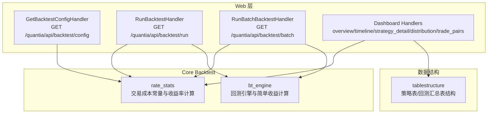
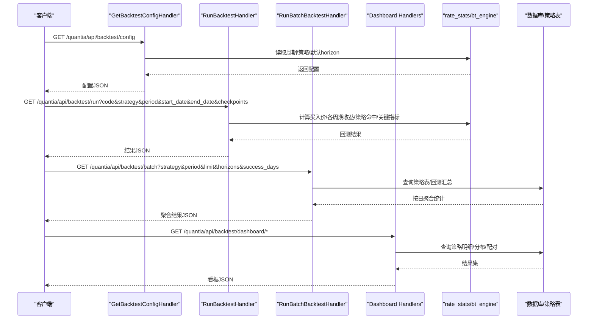
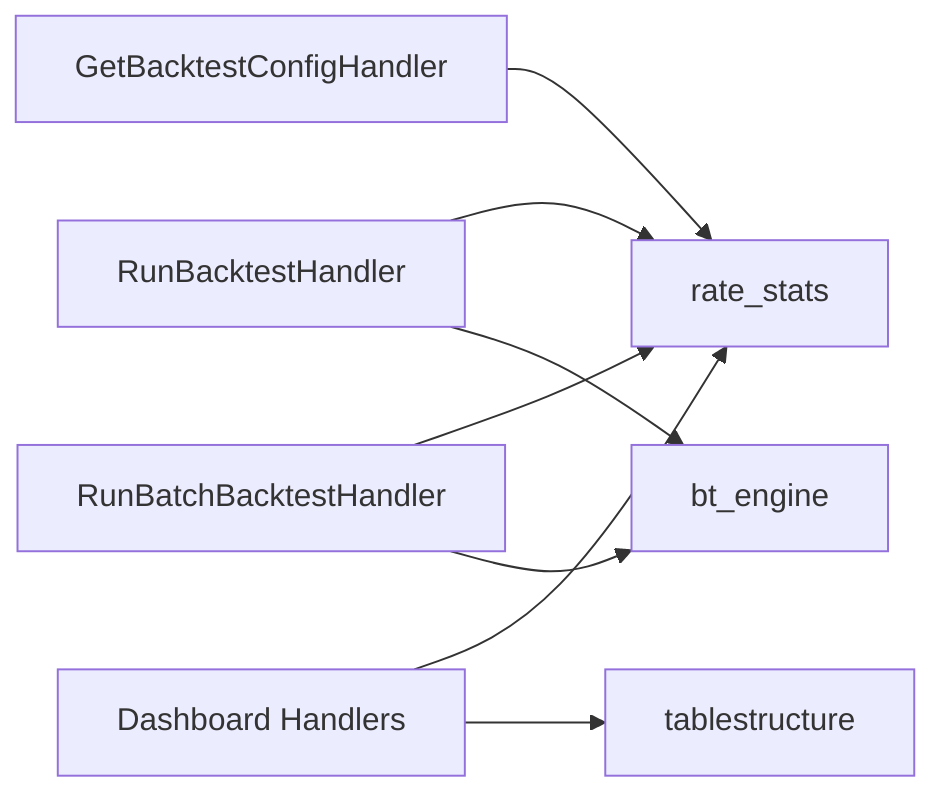

# 回测验证接口

<cite>
**本文引用的文件**
- [backtestHandler.py](file://quantia/web/backtestHandler.py)
- [backtestDashboardHandler.py](file://quantia/web/backtestDashboardHandler.py)
- [rate_stats.py](file://quantia/core/backtest/rate_stats.py)
- [bt_engine.py](file://quantia/core/backtest/bt_engine.py)
- [tablestructure.py](file://quantia/core/tablestructure.py)
- [API_REFERENCE.md](file://document/API_REFERENCE.md)
- [test_backtest_integrity.py](file://tests/test_backtest_integrity.py)
- [test_backtest_dashboard_date_range.py](file://tests/test_backtest_dashboard_date_range.py)
</cite>

## 目录
1. [简介](#简介)
2. [项目结构](#项目结构)
3. [核心组件](#核心组件)
4. [架构总览](#架构总览)
5. [详细组件分析](#详细组件分析)
6. [依赖关系分析](#依赖关系分析)
7. [性能考量](#性能考量)
8. [故障排查指南](#故障排查指南)
9. [结论](#结论)
10. [附录](#附录)

## 简介
本文件面向 Quantia 系统的回测验证 API，覆盖单股回测、批量策略回测以及回测看板相关接口。文档详细说明：
- 回测配置接口：获取可选回测周期、策略列表、默认持有天数等
- 单股回测执行接口：支持股票代码、策略、回测周期、日期范围、输出点等参数
- 批量策略回测接口：按策略在指定时间段内对历史选股记录进行回测
- 回测看板接口：跨策略总览、策略表现时间序列、单策略明细、收益分布、买入卖出配对明细
- 日期区间参数的灵活使用方式与解析规则

## 项目结构
回测相关代码主要位于 quantia/web 与 quantia/core/backtest 两个目录：
- web 层：提供 HTTP 接口处理器，负责参数解析、业务编排与响应
- core/backtest 层：提供回测引擎、交易成本常量、收益率计算等核心逻辑
- tablestructure：定义策略表、回测汇总表等数据结构
- 文档与测试：API 参考文档与单元测试保障接口行为与日期区间解析

图表来源
- [backtestHandler.py](file://quantia/web/backtestHandler.py#L69-L126)
- [backtestDashboardHandler.py](file://quantia/web/backtestDashboardHandler.py#L360-L906)
- [rate_stats.py](file://quantia/core/backtest/rate_stats.py#L1-L108)
- [bt_engine.py](file://quantia/core/backtest/bt_engine.py#L1-L388)
- [tablestructure.py](file://quantia/core/tablestructure.py#L29-L44)

章节来源
- [backtestHandler.py](file://quantia/web/backtestHandler.py#L1-L673)
- [backtestDashboardHandler.py](file://quantia/web/backtestDashboardHandler.py#L1-L906)
- [rate_stats.py](file://quantia/core/backtest/rate_stats.py#L1-L108)
- [bt_engine.py](file://quantia/core/backtest/bt_engine.py#L1-L388)
- [tablestructure.py](file://quantia/core/tablestructure.py#L29-L44)

## 核心组件
- 回测配置接口：返回可选回测周期、策略列表、默认持有天数、最大表支持天数
- 单股回测接口：按策略与周期计算买入价、各周期收益率、最大涨幅/回撤、策略命中、关键指标
- 批量策略回测接口：从策略表或实时计算，按日聚合统计选股数量、成功率、平均收益
- 回测看板接口：跨策略总览、时间序列、单策略明细、收益分布、买入卖出配对明细
- 交易成本与日期解析：统一的交易成本常量、日期区间解析与容错

章节来源
- [backtestHandler.py](file://quantia/web/backtestHandler.py#L69-L126)
- [backtestDashboardHandler.py](file://quantia/web/backtestDashboardHandler.py#L360-L906)
- [rate_stats.py](file://quantia/core/backtest/rate_stats.py#L1-L108)
- [bt_engine.py](file://quantia/core/backtest/bt_engine.py#L1-L388)

## 架构总览
回测验证 API 的请求流程如下：
- 客户端发起 HTTP 请求至相应接口
- Handler 解析参数，调用核心逻辑（交易成本、收益率计算、日期解析）
- 若涉及策略表数据，通过数据库访问层读取；若策略表不存在，则尝试实时计算
- 统一 JSON 序列化返回，错误时返回标准错误对象

图表来源
- [backtestHandler.py](file://quantia/web/backtestHandler.py#L69-L126)
- [backtestDashboardHandler.py](file://quantia/web/backtestDashboardHandler.py#L360-L906)
- [rate_stats.py](file://quantia/core/backtest/rate_stats.py#L34-L108)
- [bt_engine.py](file://quantia/core/backtest/bt_engine.py#L310-L358)

## 详细组件分析

### 回测配置接口（/quantia/api/backtest/config）
- 功能：返回可选回测周期、策略列表、默认持有天数、最大表支持天数
- 关键点：
  - 回测周期：1周、2周、1个月、3个月、6个月、1年
  - 策略列表：包含策略表与指标买入/卖出两类
  - 默认持有天数：1、3、5、10、20
  - 最大表支持天数：100
- 响应字段：
  - periods：每个周期的值、标签与交易日天数
  - strategies：策略名称、中文名、类型
  - default_horizons：默认持有天数列表
  - max_table_horizon：最大表支持天数

章节来源
- [backtestHandler.py](file://quantia/web/backtestHandler.py#L30-L80)
- [tablestructure.py](file://quantia/core/tablestructure.py#L409-L467)

### 单股回测执行接口（/quantia/api/backtest/run）
- 请求参数
  - code：股票代码（必填）
  - strategy：策略名称（可选）
  - period：回测周期（可选，默认1个月）
  - start_date：开始日期（可选，默认自动选择）
  - end_date：结束日期（可选，默认自动选择）
  - checkpoints：输出点（可选，逗号分隔，默认使用系统默认值）
- 处理逻辑
  - 解析参数与日期范围
  - 读取缓存历史数据，确定买入日与后续窗口
  - 计算买入价（T+1开盘价，考虑涨停过滤）
  - 计算各周期收益率（扣除交易成本）
  - 计算区间最大涨幅/最大回撤
  - 可选：检测策略是否命中
  - 计算关键指标（如 KDJ、RSI、MACD、CCI、WR、VR、ATR 等）
- 响应字段
  - code、name、period
  - buy_date、buy_price
  - returns：各周期收益数组（含天数、收益、价格、日期）
  - checkpoints：实际使用的输出点
  - max_return、max_drawdown
  - strategy、strategy_result
  - indicators：关键指标值
  - data_points：有效数据点数

章节来源
- [backtestHandler.py](file://quantia/web/backtestHandler.py#L82-L126)
- [backtestHandler.py](file://quantia/web/backtestHandler.py#L166-L290)
- [rate_stats.py](file://quantia/core/backtest/rate_stats.py#L34-L108)

### 批量策略回测接口（/quantia/api/backtest/batch）
- 请求参数
  - strategy：策略名称（必填）
  - period：回测周期（可选，默认1个月）
  - limit：统计天数（可选，默认30）
  - horizons：汇总使用的持有天数列表（可选，逗号分隔）
  - success_days：成功定义使用的持有天数（可选）
- 处理逻辑
  - 解析策略与周期
  - 解析 horizons 与 success_days
  - 优先查询策略表（支持 rate_1..rate_100）
  - 若策略表不存在或查询失败，尝试实时计算（并行遍历股票与日期）
  - 按日聚合：选股数量、成功数量、平均收益、成功率
- 响应字段
  - strategy、strategy_name、period
  - horizons、success_days
  - total_stocks、total_days、success_count、success_rate
  - avg_returns：各 horizon 的平均收益
  - details：按日明细（date、stock_count、success_count、success_rate、avg_{h}d）

章节来源
- [backtestHandler.py](file://quantia/web/backtestHandler.py#L103-L126)
- [backtestHandler.py](file://quantia/web/backtestHandler.py#L292-L421)
- [backtestHandler.py](file://quantia/web/backtestHandler.py#L423-L612)

### 回测看板接口

#### 跨策略总览（/quantia/api/backtest/dashboard/overview）
- 请求参数
  - days：最近 N 个交易日窗口（可选，默认60）
  - start_date / end_date：显式日期区间（可选，优先级最高）
  - metric：排名指标持有天数（仅支持 1/3/5/10/20，默认5）
- 响应字段
  - date_range：开始/结束/交易日数量
  - horizons：支持的持有天数列表
  - metric_horizon：用于排序的指标天数
  - items：每个策略的统计项（total_signals、avg_success_rate、avg_returns、best_day、worst_day）

章节来源
- [backtestDashboardHandler.py](file://quantia/web/backtestDashboardHandler.py#L360-L467)

#### 策略表现时间序列（/quantia/api/backtest/dashboard/timeline）
- 请求参数
  - strategies：策略列表（逗号分隔，为空表示全部）
  - days：最近 N 个交易日窗口（可选，默认90）
  - start_date / end_date：显式日期区间（可选）
  - horizon：收益周期（仅支持 1/3/5/10/20，默认5）
- 响应字段
  - date_range、horizon
  - series：每个策略的时间序列（date/value）

章节来源
- [backtestDashboardHandler.py](file://quantia/web/backtestDashboardHandler.py#L469-L547)

#### 单策略明细（/quantia/api/backtest/dashboard/strategy_detail）
- 请求参数
  - strategy：策略名称（必填）
  - days：最近 N 个交易日窗口（可选，默认30）
  - start_date / end_date：显式日期区间（可选）
  - horizons：明细收益周期列表（逗号分隔，支持 1..100，默认 1,3,5,10,20）
  - page/page_size：分页参数（可选）
- 响应字段
  - strategy_name、strategy_cn、date_range、horizons
  - page、page_size、total
  - rows：包含 date、code、name、rate_{h} 的明细

章节来源
- [backtestDashboardHandler.py](file://quantia/web/backtestDashboardHandler.py#L549-L637)

#### 收益分布（/quantia/api/backtest/dashboard/distribution）
- 请求参数
  - strategy：策略名称（必填）
  - days：最近 N 个交易日窗口（可选，默认60）
  - start_date / end_date：显式日期区间（可选）
  - horizon：收益周期（支持 1..100，默认5）
- 响应字段
  - strategy_name、strategy_cn、date_range、horizon
  - bins：分箱统计（range/count/percentage）
  - total：样本总数

章节来源
- [backtestDashboardHandler.py](file://quantia/web/backtestDashboardHandler.py#L639-L724)

#### 买入-卖出配对明细（/quantia/api/backtest/dashboard/trade_pairs）
- 请求参数
  - strategy：策略名称（必填，买入信号来源）
  - days：最近 N 个交易日窗口（可选，默认60）
  - start_date / end_date：显式日期区间（可选）
  - max_hold：最大持有天数（无卖点时超时退出，默认100）
  - page/page_size：分页参数（可选）
- 响应字段
  - strategy_name、strategy_cn、date_range、page、page_size、total、max_hold
  - rows：每笔交易的 buy_date/sell_date/code/name/hold_days/buy_price/sell_price/return_rate/exit_type

章节来源
- [backtestDashboardHandler.py](file://quantia/web/backtestDashboardHandler.py#L726-L906)

### 日期区间参数与解析规则
- 支持两种方式：
  - 显式区间：start_date / end_date（优先级最高）
  - 最近 N 天：days（未传显式区间时生效）
- 日期格式兼容：YYYY-MM-DD、YYYYMMDD、YYYY/MM/DD、YYYY.MM.DD
- 解析逻辑要点：
  - 若仅提供 start_date 或 end_date，另一端自动填充为同一天
  - 若 start_date > end_date，自动交换
  - 日期区间过大（超过366天）将报错
  - 未传显式区间时，按策略表/汇总表的最近交易日窗口计算

章节来源
- [backtestDashboardHandler.py](file://quantia/web/backtestDashboardHandler.py#L227-L284)
- [backtestDashboardHandler.py](file://quantia/web/backtestDashboardHandler.py#L74-L147)
- [test_backtest_dashboard_date_range.py](file://tests/test_backtest_dashboard_date_range.py#L36-L135)

### 交易成本与收益计算
- 交易成本常量（A股）：
  - 佣金：单边 0.025%
  - 印花税：卖出单边 0.05%
  - 滑点：单边 0.05%
  - 单次往返总成本：约 0.20%
- 收益计算规则：
  - 买入价使用 T+1 开盘价（信号在 T 日收盘后产生）
  - 涨停过滤：T+1 开盘价较 T 日收盘价涨幅 ≥ 9.5% 视为涨停，无法买入
  - 收益率 = (卖出价 - 买入价) / 买入价 × 100% - 交易成本
  - 区间最大涨幅/最大回撤：基于 T+1 开盘价与后续窗口内的最高/最低价

章节来源
- [rate_stats.py](file://quantia/core/backtest/rate_stats.py#L11-L32)
- [rate_stats.py](file://quantia/core/backtest/rate_stats.py#L34-L108)
- [backtestHandler.py](file://quantia/web/backtestHandler.py#L235-L252)
- [test_backtest_integrity.py](file://tests/test_backtest_integrity.py#L68-L137)

## 依赖关系分析
- 回测配置与单股回测依赖交易成本常量与收益率计算模块
- 批量回测优先查询策略表，若失败则回退到实时计算（并行处理）
- 回测看板接口统一使用日期区间解析与策略映射
- 策略表结构定义在 tablestructure 中，涵盖策略表、指标表、回测汇总表等

图表来源
- [backtestHandler.py](file://quantia/web/backtestHandler.py#L69-L126)
- [backtestDashboardHandler.py](file://quantia/web/backtestDashboardHandler.py#L360-L906)
- [rate_stats.py](file://quantia/core/backtest/rate_stats.py#L1-L108)
- [bt_engine.py](file://quantia/core/backtest/bt_engine.py#L1-L388)
- [tablestructure.py](file://quantia/core/tablestructure.py#L29-L44)

章节来源
- [backtestHandler.py](file://quantia/web/backtestHandler.py#L1-L673)
- [backtestDashboardHandler.py](file://quantia/web/backtestDashboardHandler.py#L1-L906)
- [rate_stats.py](file://quantia/core/backtest/rate_stats.py#L1-L108)
- [bt_engine.py](file://quantia/core/backtest/bt_engine.py#L1-L388)
- [tablestructure.py](file://quantia/core/tablestructure.py#L29-L44)

## 性能考量
- 批量回测采用并行处理股票与日期，提升实时计算效率
- 回测看板接口支持分页与有限的 horizons 列表，避免大查询
- 交易成本统一常量，减少重复计算
- 建议：
  - 控制 horizons 与 page_size，避免一次性返回过多数据
  - 合理设置 days 或显式 start_date/end_date，避免超大区间
  - 在策略表存在时优先使用数据库聚合，减少实时计算压力

[本节为通用指导，无需特定文件引用]

## 故障排查指南
- 参数错误
  - 缺少必要参数（如批量回测缺少 strategy）将返回 400
  - 日期格式不正确将返回错误提示
- 数据缺失
  - 单股回测：无缓存数据或买入日之后无足够数据将返回错误
  - 批量回测：策略表不存在或查询失败将尝试实时计算
- 交易成本与涨停过滤
  - T+1 开盘涨停（≥9.5%）将跳过该信号，视为无法买入
  - 扣除交易成本后收益可能为负
- 日期区间过大
  - 显式区间超过 366 天将报错

章节来源
- [backtestHandler.py](file://quantia/web/backtestHandler.py#L94-L101)
- [backtestHandler.py](file://quantia/web/backtestHandler.py#L114-L126)
- [backtestHandler.py](file://quantia/web/backtestHandler.py#L206-L234)
- [backtestDashboardHandler.py](file://quantia/web/backtestDashboardHandler.py#L246-L268)
- [test_backtest_integrity.py](file://tests/test_backtest_integrity.py#L112-L137)
- [test_backtest_dashboard_date_range.py](file://tests/test_backtest_dashboard_date_range.py#L94-L116)

## 结论
Quantia 的回测验证 API 提供了从单股到批量再到看板的完整回测能力。通过统一的交易成本模型、严格的日期区间解析与策略表/实时计算双通道，系统在保证回测真实性的同时兼顾性能与易用性。建议在生产使用中遵循参数约束与性能建议，确保稳定高效的回测体验。

[本节为总结性内容，无需特定文件引用]

## 附录

### 接口一览与参数说明
- 回测配置：GET /quantia/api/backtest/config
  - 响应：periods、strategies、default_horizons、max_table_horizon
- 单股回测：GET /quantia/api/backtest/run
  - 参数：code、strategy、period、start_date、end_date、checkpoints
  - 响应：买入价、各周期收益、最大涨幅/回撤、策略命中、关键指标
- 批量策略回测：GET /quantia/api/backtest/batch
  - 参数：strategy、period、limit、horizons、success_days
  - 响应：按日汇总统计与明细
- 回测看板
  - 跨策略总览：GET /quantia/api/backtest/dashboard/overview
  - 时间序列：GET /quantia/api/backtest/dashboard/timeline
  - 单策略明细：GET /quantia/api/backtest/dashboard/strategy_detail
  - 收益分布：GET /quantia/api/backtest/dashboard/distribution
  - 买入-卖出配对：GET /quantia/api/backtest/dashboard/trade_pairs

章节来源
- [API_REFERENCE.md](file://document/API_REFERENCE.md#L437-L724)
