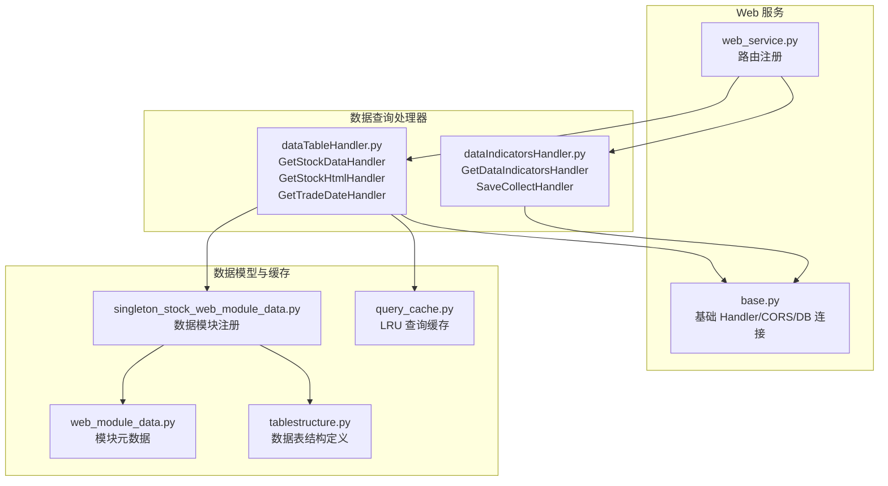
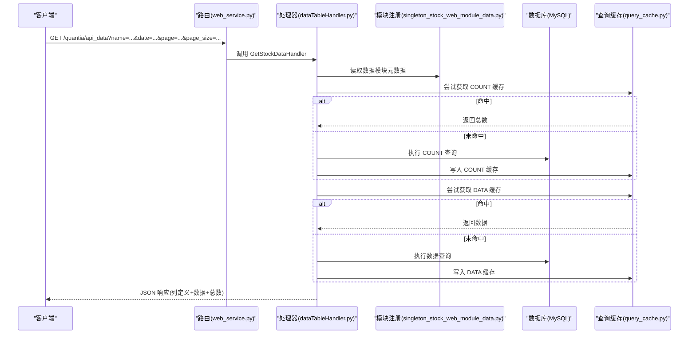
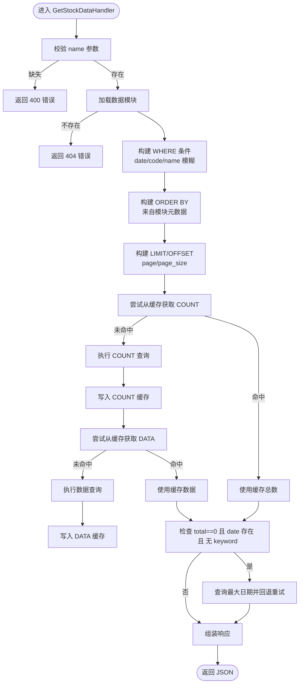
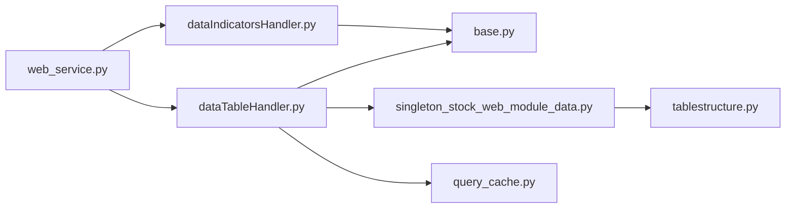

# 数据查询接口

<cite>
**本文引用的文件**
- [quantia/web/web_service.py](file://quantia/web/web_service.py)
- [quantia/web/base.py](file://quantia/web/base.py)
- [quantia/web/dataTableHandler.py](file://quantia/web/dataTableHandler.py)
- [quantia/web/dataIndicatorsHandler.py](file://quantia/web/dataIndicatorsHandler.py)
- [quantia/lib/query_cache.py](file://quantia/lib/query_cache.py)
- [quantia/core/tablestructure.py](file://quantia/core/tablestructure.py)
- [quantia/core/singleton_stock_web_module_data.py](file://quantia/core/singleton_stock_web_module_data.py)
- [quantia/core/web_module_data.py](file://quantia/core/web_module_data.py)
- [document/API_REFERENCE.md](file://document/API_REFERENCE.md)
</cite>

## 目录
1. [简介](#简介)
2. [项目结构](#项目结构)
3. [核心组件](#核心组件)
4. [架构总览](#架构总览)
5. [详细组件分析](#详细组件分析)
6. [依赖分析](#依赖分析)
7. [性能考虑](#性能考虑)
8. [故障排查指南](#故障排查指南)
9. [结论](#结论)
10. [附录](#附录)

## 简介
本文件面向 Quantia 系统的数据查询 API，聚焦以下核心接口：
- 数据表查询接口：/quantia/api_data
- 数据表页面接口：/quantia/data
- 股票指标图表接口：/quantia/data/indicators

文档将详细说明每个接口的请求参数、响应格式、分页机制、搜索过滤、排序功能；解释支持的数据表类型（如每日股票数据、ETF 数据、资金流向、分红配送、龙虎榜、大宗交易等）；给出字段说明（如 cn_stock_spot、cn_stock_indicators 等）；并提供 cURL、Python、JavaScript 的调用示例。

## 项目结构
Quantia Web 层通过 Tornado 路由注册多个 API，其中数据查询相关的关键路由如下：
- /quantia/api_data → GetStockDataHandler（JSON 数据查询）
- /quantia/api/trade_date → GetTradeDateHandler（获取最近交易日）
- /quantia/data → GetStockHtmlHandler（数据表页面入口）
- /quantia/data/indicators → GetDataIndicatorsHandler（指标图表页面）
- /quantia/control/attention → SaveCollectHandler（关注股票）

**图示来源**
- [quantia/web/web_service.py](file://quantia/web/web_service.py#L56-L88)
- [quantia/web/base.py](file://quantia/web/base.py#L14-L36)
- [quantia/web/dataTableHandler.py](file://quantia/web/dataTableHandler.py#L35-L51)
- [quantia/web/dataIndicatorsHandler.py](file://quantia/web/dataIndicatorsHandler.py#L16-L41)
- [quantia/core/singleton_stock_web_module_data.py](file://quantia/core/singleton_stock_web_module_data.py#L12-L279)
- [quantia/core/web_module_data.py](file://quantia/core/web_module_data.py#L9-L22)
- [quantia/core/tablestructure.py](file://quantia/core/tablestructure.py#L63-L104)
- [quantia/lib/query_cache.py](file://quantia/lib/query_cache.py#L27-L150)

**章节来源**
- [quantia/web/web_service.py](file://quantia/web/web_service.py#L56-L88)

## 核心组件
- 基础 Handler（CORS、DB 连接检查与自动重连）
- 数据表查询处理器（GetStockDataHandler）：支持按表名、日期、关键词搜索、分页、排序
- 数据表页面处理器（GetStockHtmlHandler）：渲染数据表页面
- 指标图表处理器（GetDataIndicatorsHandler）：基于本地缓存的历史数据生成可视化
- 查询缓存（QueryCache）：LRU + TTL，COUNT 与 DATA 分离缓存
- 数据模块注册（stock_web_module_data）：集中管理可用数据表及其排序、列定义

**章节来源**
- [quantia/web/base.py](file://quantia/web/base.py#L14-L36)
- [quantia/web/dataTableHandler.py](file://quantia/web/dataTableHandler.py#L54-L214)
- [quantia/web/dataIndicatorsHandler.py](file://quantia/web/dataIndicatorsHandler.py#L16-L61)
- [quantia/lib/query_cache.py](file://quantia/lib/query_cache.py#L27-L150)
- [quantia/core/singleton_stock_web_module_data.py](file://quantia/core/singleton_stock_web_module_data.py#L12-L279)

## 架构总览
数据查询的整体流程如下：

**图示来源**
- [quantia/web/web_service.py](file://quantia/web/web_service.py#L56-L61)
- [quantia/web/dataTableHandler.py](file://quantia/web/dataTableHandler.py#L69-L150)
- [quantia/lib/query_cache.py](file://quantia/lib/query_cache.py#L51-L92)

## 详细组件分析

### 数据表查询接口 /quantia/api_data
- 功能：按数据模块（表）查询数据，支持日期过滤、关键词搜索、分页、排序
- 请求方法：GET
- 请求参数
  - name（必填，string）：数据模块/表名
  - date（可选，string）：日期 YYYY-MM-DD
  - page（可选，int）：页码（>=1）
  - page_size（可选，int）：每页条数（1~500）
  - keyword（可选，string）：代码或名称模糊搜索
- 响应格式：JSON
  - columns：列定义数组（含字段名、显示名、宽度、类型等）
  - data：数据行数组
  - total：满足条件的总记录数
  - actual_date（可选）：当按指定 date 查询无数据时，返回回退到的最新日期
- 分页机制：page/page_size → LIMIT offset, size；默认无分页
- 搜索过滤：支持 code/name 模糊匹配；若模块列包含对应字段才生效
- 排序：依据模块元数据中的 order_by/order_columns；若排序列不存在，自动降级移除排序重试
- 错误处理：缺少 name 返回 400；模块不存在返回 404；查询异常返回 500
- 日期回退：当按 date 查询无数据且无 keyword 时，自动回退到表中最大日期重新查询

**图示来源**
- [quantia/web/dataTableHandler.py](file://quantia/web/dataTableHandler.py#L54-L214)
- [quantia/lib/query_cache.py](file://quantia/lib/query_cache.py#L51-L92)

**章节来源**
- [quantia/web/dataTableHandler.py](file://quantia/web/dataTableHandler.py#L54-L214)
- [quantia/lib/query_cache.py](file://quantia/lib/query_cache.py#L27-L150)
- [quantia/core/singleton_stock_web_module_data.py](file://quantia/core/singleton_stock_web_module_data.py#L12-L279)

### 数据表页面接口 /quantia/data
- 功能：渲染数据表页面，支持实时数据与非实时数据的日期选择
- 请求方法：GET
- 请求参数
  - table_name（必填，string）：数据模块/表名
- 响应：HTML 页面，包含左侧菜单与数据表视图
- 日期逻辑：根据模块 is_realtime 决定使用“运行日”或“非盘前运行日”

**章节来源**
- [quantia/web/dataTableHandler.py](file://quantia/web/dataTableHandler.py#L35-L51)
- [quantia/core/singleton_stock_web_module_data.py](file://quantia/core/singleton_stock_web_module_data.py#L12-L279)

### 股票指标图表接口 /quantia/data/indicators
- 功能：基于本地历史缓存生成指标图表页面片段
- 请求方法：GET
- 请求参数
  - code（必填，string）：股票代码
  - date（可选，string）：日期 YYYY-MM-DD
  - name（可选，string）：指标名称（用于页面标题/组件）
- 响应：HTML 片段（Bokeh 图表），若缓存无数据则返回空
- 关注功能：/quantia/control/attention 支持添加/取消关注

**章节来源**
- [quantia/web/dataIndicatorsHandler.py](file://quantia/web/dataIndicatorsHandler.py#L16-L61)

### 支持的数据表类型与字段说明
以下为系统内置支持的主要数据表（模块）及关键字段概览（字段中文名、类型、宽度等由模块元数据生成）：
- 每日股票数据（cn_stock_spot）
  - 字段示例：date、code、name、new_price、change_rate、volume、deal_amount、turnoverrate、pe、pb、roe、总股本、流通市值等
- ETF 每日数据（cn_etf_spot）
  - 字段示例：date、code、name、new_price、change_rate、volume、deal_amount、open/high/low、turnoverrate、总市值、流通市值
- 股票资金流向（cn_stock_fund_flow）
  - 字段示例：date、多周期（今日/3日/5日/10日）主力净流入/占比、大小单分布等
- 行业/概念资金流向（cn_stock_fund_flow_industry、cn_stock_fund_flow_concept）
  - 字段示例：name、change_rate、fund_amount、fund_rate、stock_name 等
- 股票分红配送（cn_stock_bonus）
  - 字段示例：date、code、name、送转比例、现金分红比例、股息率、每股收益、每股净资产、总股本、预案/登记/除权除息日等
- 龙虎榜（cn_stock_lhb、cn_stock_top）
  - 字段示例：date、code、name、上榜次数、累计净买额、买入/卖出额、换手率、流通市值、上榜后 X 日涨跌幅等
- 大宗交易（cn_stock_blocktrade）
  - 字段示例：date、code、name、收盘价、涨跌幅、成交均价、折溢率、成交笔数、总量/总额、占流通市值比等
- 股票指标数据（cn_stock_indicators）
  - 字段示例：date、code、name、各类技术指标（MACD、KDJ、布林、RSI、ATR、WR、CCI 等）
- 综合选股（cn_stock_selection）
  - 字段示例：date、code、name、最新价、涨跌幅、成交量、成交额、换手率、市盈率、市净率、ROE、毛利率、净利润同比增长、总市值、流通市值、行业/概念/板块等

以上字段由模块元数据自动生成列定义，包含字段中文名、宽度、数据类型标识（string/numeric/bigint/datetime）等，便于前端表格渲染与条件格式化。

**章节来源**
- [quantia/core/tablestructure.py](file://quantia/core/tablestructure.py#L46-L296)
- [quantia/core/tablestructure.py](file://quantia/core/tablestructure.py#L320-L398)
- [quantia/core/tablestructure.py](file://quantia/core/tablestructure.py#L1100-L1137)
- [quantia/core/singleton_stock_web_module_data.py](file://quantia/core/singleton_stock_web_module_data.py#L12-L279)

### 参数定义与调用示例
- 基础信息
  - Base URL：http://localhost:9988
  - 响应格式：JSON / HTML
  - 端口：9988
- 接口列表与参数
  - /quantia/api_data
    - 必填：name
    - 可选：date、page、page_size、keyword
    - 返回：columns、data、total、actual_date（可选）
  - /quantia/data
    - 必填：table_name
    - 返回：HTML 页面
  - /quantia/data/indicators
    - 必填：code
    - 可选：date、name
    - 返回：HTML 片段（图表）
  - /quantia/control/attention
    - 必填：code
    - 可选：otype（1 表示取消关注，其他表示添加关注）
    - 返回：空数据对象
- 常见错误码：400（参数错误）、404（资源不存在）、500（服务器内部错误）
- 使用示例（参考 API 文档）
  - Python requests
  - JavaScript fetch
  - cURL

**章节来源**
- [document/API_REFERENCE.md](file://document/API_REFERENCE.md#L1-L433)

## 依赖分析
- 路由与处理器
  - web_service.py 注册 /quantia/api_data、/quantia/data、/quantia/data/indicators 等路由
  - base.py 提供 CORS、DB 连接检查与自动重连
- 数据模块与表结构
  - singleton_stock_web_module_data.py 统一注册所有可用数据模块，包含表名、列名、排序规则、是否实时等
  - tablestructure.py 定义各表字段类型、中文名、宽度等
- 查询缓存
  - query_cache.py 提供 LRU + TTL 的线程安全缓存，COUNT 与 DATA 分离缓存，提升分页查询性能

**图示来源**
- [quantia/web/web_service.py](file://quantia/web/web_service.py#L56-L88)
- [quantia/web/dataTableHandler.py](file://quantia/web/dataTableHandler.py#L54-L214)
- [quantia/web/dataIndicatorsHandler.py](file://quantia/web/dataIndicatorsHandler.py#L16-L61)
- [quantia/web/base.py](file://quantia/web/base.py#L14-L36)
- [quantia/core/singleton_stock_web_module_data.py](file://quantia/core/singleton_stock_web_module_data.py#L12-L279)
- [quantia/core/tablestructure.py](file://quantia/core/tablestructure.py#L63-L104)
- [quantia/lib/query_cache.py](file://quantia/lib/query_cache.py#L27-L150)

**章节来源**
- [quantia/web/web_service.py](file://quantia/web/web_service.py#L56-L88)
- [quantia/web/base.py](file://quantia/web/base.py#L14-L36)
- [quantia/lib/query_cache.py](file://quantia/lib/query_cache.py#L27-L150)

## 性能考虑
- 查询缓存
  - COUNT 与 DATA 分离缓存，命中后避免重复查询
  - LRU 淘汰策略，TTL 过期自动失效
  - stock_data_cache：最大 512 条，TTL 5 分钟，适合股票列表分页高频访问
- 分页限制
  - page/page_size 自动规范化，最大 page_size 为 500，防止过大请求
- 排序降级
  - 当 ORDER BY 引用不存在列时，自动去除排序重试，避免 500 错误
- 数据回退
  - 按指定 date 查询无数据时，自动回退到表中最大日期，提升可用性

**章节来源**
- [quantia/lib/query_cache.py](file://quantia/lib/query_cache.py#L27-L150)
- [quantia/web/dataTableHandler.py](file://quantia/web/dataTableHandler.py#L112-L179)

## 故障排查指南
- 400 参数错误
  - 缺少 name 参数
- 404 资源不存在
  - 指定的模块/表名不存在
- 500 服务器内部错误
  - 数据库查询异常；若为“表不存在”或“未知列”，会返回空数据并记录警告
- CORS 跨域问题
  - 基础 Handler 已设置允许跨域请求头；若前端跨域失败，请检查浏览器控制台与网络面板
- DB 连接异常
  - 基础 Handler 会在每次请求检查并自动重连；若持续失败，检查数据库配置与网络

**章节来源**
- [quantia/web/dataTableHandler.py](file://quantia/web/dataTableHandler.py#L64-L179)
- [quantia/web/base.py](file://quantia/web/base.py#L16-L36)

## 结论
Quantia 的数据查询 API 通过模块化数据表注册、统一的查询处理器与查询缓存，提供了稳定、高效的分页、搜索、排序能力。结合丰富的数据表类型与字段定义，能够满足股票行情、资金流向、技术指标、策略筛选等多种场景的查询需求。建议在高并发场景下充分利用缓存与分页限制，在前端进行合理的日期与字段选择，以获得最佳性能与体验。

## 附录
- 常用调用示例（Python/JavaScript/cURL）请参阅 API 文档
- 字段类型映射：DATE→datetime，FLOAT/BIGINT/SmallInteger/BIT→numeric，其余→string
- 前端表格渲染：columns 中包含字段值、显示名、宽度、数据类型与条件格式化规则

**章节来源**
- [document/API_REFERENCE.md](file://document/API_REFERENCE.md#L367-L424)
- [quantia/core/tablestructure.py](file://quantia/core/tablestructure.py#L1130-L1137)
