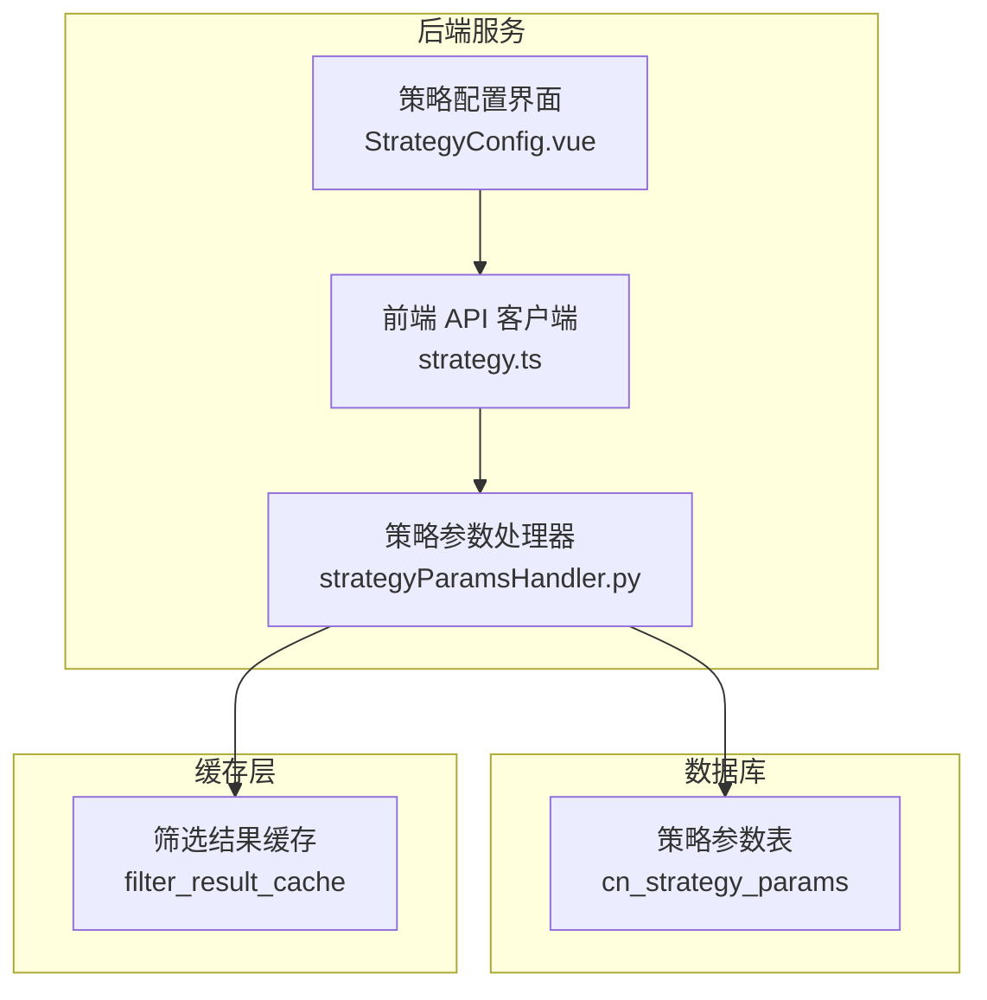
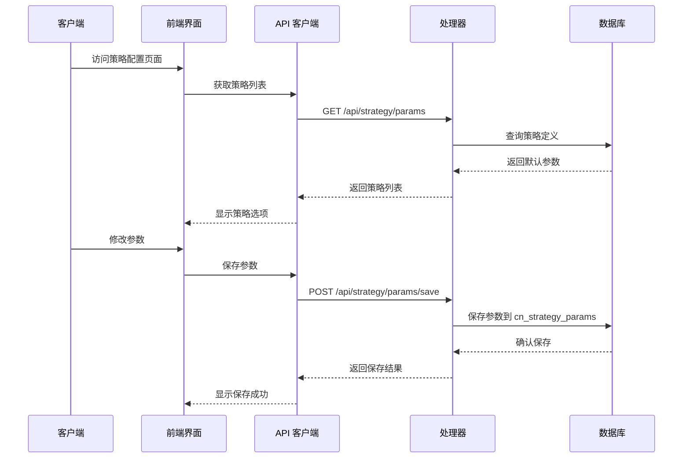
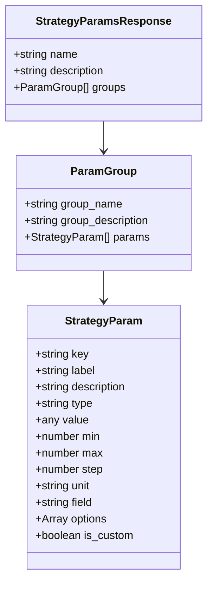
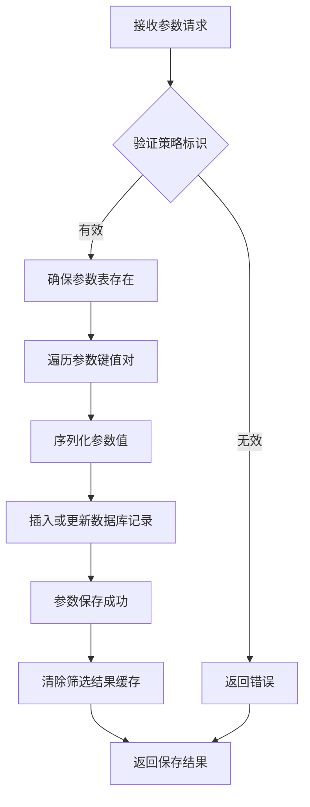
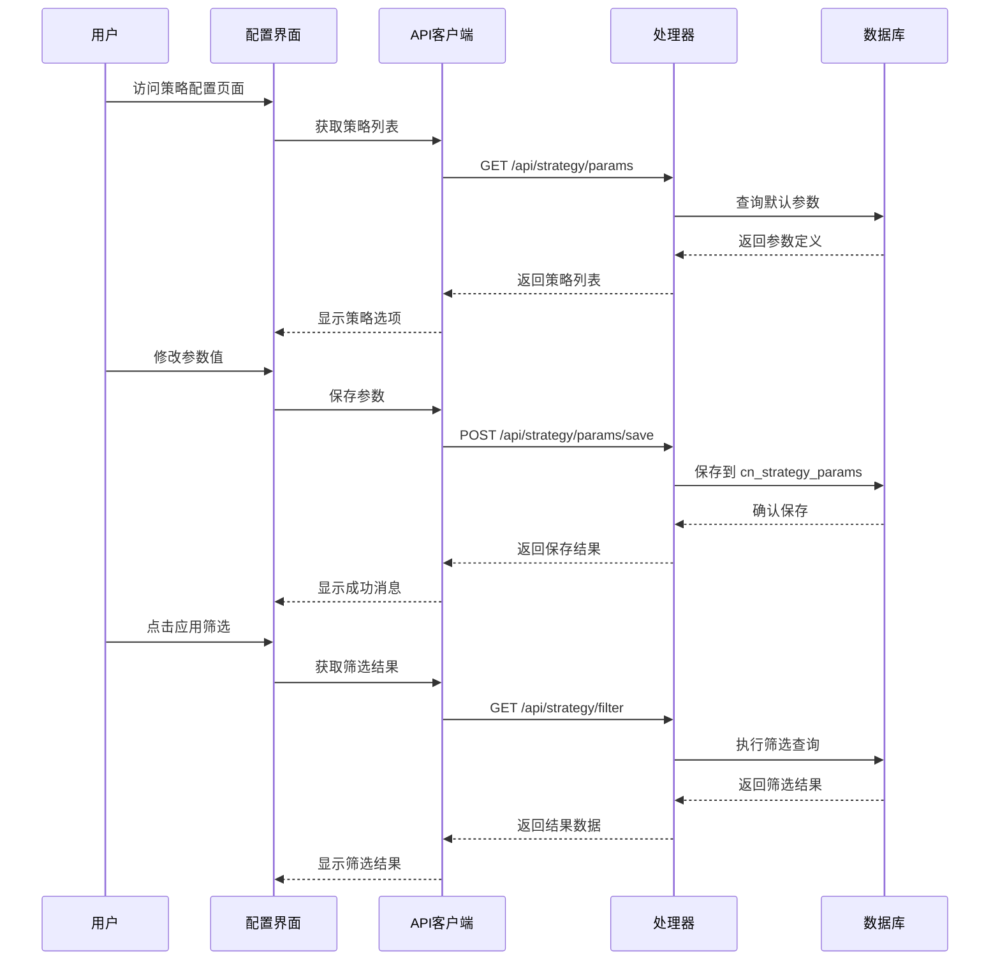
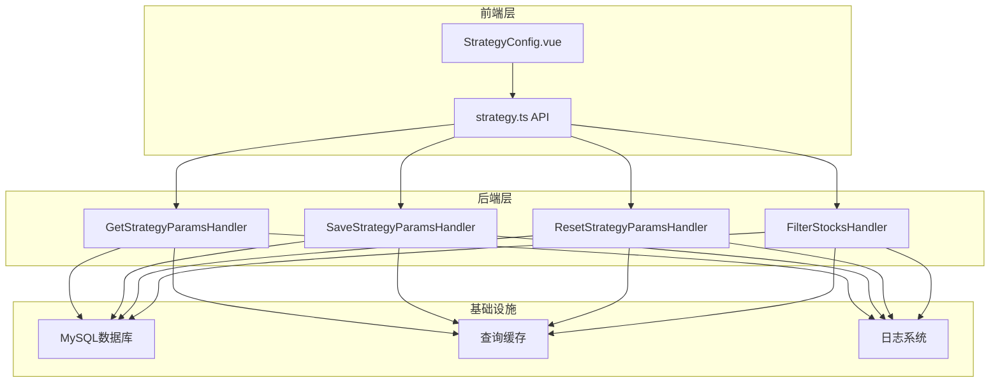

# 策略配置接口

<cite>
**本文档引用的文件**
- [quantia/web/strategyParamsHandler.py](file://quantia/web/strategyParamsHandler.py)
- [docker/stock/quantia/web/strategyParamsHandler.py](file://docker/stock/quantia/web/strategyParamsHandler.py)
- [quantia/fontWeb/src/api/strategy.ts](file://quantia/fontWeb/src/api/strategy.ts)
- [docker/stock/quantia/fontWeb/src/api/strategy.ts](file://docker/stock/quantia/fontWeb/src/api/strategy.ts)
- [quantia/fontWeb/src/views/strategy/StrategyConfig.vue](file://quantia/fontWeb/src/views/strategy/StrategyConfig.vue)
</cite>

## 目录
1. [简介](#简介)
2. [项目结构](#项目结构)
3. [核心组件](#核心组件)
4. [架构概览](#架构概览)
5. [详细组件分析](#详细组件分析)
6. [依赖分析](#依赖分析)
7. [性能考虑](#性能考虑)
8. [故障排除指南](#故障排除指南)
9. [结论](#结论)

## 简介
本文档详细介绍了 Quantia 系统的策略配置 API，涵盖策略参数获取、保存和重置等核心功能。系统支持多种策略类型，包括 GPT 综合选股、护城河评分模型、AI 模型配置以及技术分析策略。通过统一的 API 接口，用户可以灵活配置各类策略的参数，实现个性化的股票筛选。

## 项目结构
策略配置功能主要分布在以下模块中：

**图表来源**
- [quantia/web/strategyParamsHandler.py](file://quantia/web/strategyParamsHandler.py#L1-L50)
- [docker/stock/quantia/web/strategyParamsHandler.py](file://docker/stock/quantia/web/strategyParamsHandler.py#L1-L50)

**章节来源**
- [quantia/web/strategyParamsHandler.py](file://quantia/web/strategyParamsHandler.py#L1-L50)
- [docker/stock/quantia/web/strategyParamsHandler.py](file://docker/stock/quantia/web/strategyParamsHandler.py#L1-L50)

## 核心组件
系统提供了三个核心的策略配置 API：

### 1. 策略参数获取接口
- **路径**: `/api/strategy/params`
- **方法**: GET
- **功能**: 获取策略参数配置或策略列表
- **参数**: 
  - `strategy`: 可选，指定策略标识符
- **返回**: 策略参数定义或策略列表

### 2. 策略参数保存接口
- **路径**: `/api/strategy/params/save`
- **方法**: POST
- **功能**: 保存策略参数配置
- **请求体**: 
  - `strategy`: 策略标识符
  - `params`: 参数对象
- **返回**: 保存结果和统计信息

### 3. 策略参数重置接口
- **路径**: `/api/strategy/params/reset`
- **方法**: POST
- **功能**: 将策略参数重置为默认值
- **请求体**: `strategy`: 策略标识符
- **返回**: 重置结果

**章节来源**
- [quantia/fontWeb/src/api/strategy.ts](file://quantia/fontWeb/src/api/strategy.ts#L40-L92)
- [docker/stock/quantia/fontWeb/src/api/strategy.ts](file://docker/stock/quantia/fontWeb/src/api/strategy.ts#L40-L92)

## 架构概览
系统采用前后端分离架构，后端提供 RESTful API，前端通过 Vue.js 实现交互界面。

**图表来源**
- [quantia/fontWeb/src/views/strategy/StrategyConfig.vue](file://quantia/fontWeb/src/views/strategy/StrategyConfig.vue#L64-L108)
- [quantia/fontWeb/src/api/strategy.ts](file://quantia/fontWeb/src/api/strategy.ts#L40-L92)
- [quantia/web/strategyParamsHandler.py](file://quantia/web/strategyParamsHandler.py#L563-L627)

## 详细组件分析

### 策略参数数据模型
系统使用统一的数据模型来描述策略参数：

**图表来源**
- [quantia/fontWeb/src/api/strategy.ts](file://quantia/fontWeb/src/api/strategy.ts#L7-L32)

### 支持的策略类型

#### 1. GPT综合选股策略
该策略采用四层过滤机制：

**财务安全过滤层**
- 资产负债率上限：默认60%，范围20%-90%
- 每股经营现金流下限：默认0，范围-5到10元
- 流动比率下限：默认1.0，范围0.5-3.0
- 速动比率下限：默认0.7，范围0.3-2.0

**盈利能力筛选层**
- ROE(加权)下限：默认15%，范围5%-40%
- 毛利率下限：默认25%，范围10%-80%
- 净利率下限：默认8%，范围3%-50%
- ROA下限：默认4%，范围1%-20%

**成长质量筛选层**
- 营收3年CAGR下限：默认8%，范围0%-50%
- 净利润3年CAGR下限：默认8%，范围0%-50%
- 扣非净利润增长率下限：默认0%，范围-20%到50%

**估值约束层**
- PE(TTM)下限：默认0（排除亏损股）
- PE(TTM)上限：默认50，范围15-200
- PB(MRQ)上限：默认10，范围2-50

#### 2. 护城河评分模型
用于量化评估公司护城河强度：

**盈利能力权重配置**
- ROE权重：默认0.15，范围0.05-0.30
- 毛利率权重：默认0.10，范围0.05-0.20
- 净利率权重：默认0.10，范围0.05-0.20

**成长能力权重配置**
- 营收增长权重：默认0.10，范围0.05-0.20
- 净利润增长权重：默认0.10，范围0.05-0.20

**评级阈值配置**
- A级(强烈推荐)分数线：默认80，范围70-95分
- B级(推荐关注)分数线：默认65，范围50-80分
- C级(谨慎持有)分数线：默认50，范围30-65分

**综合评分权重**
- 量化评分权重：默认0.60，范围0.30-0.90

#### 3. AI模型配置
支持多种大语言模型的接口配置：

**API接口配置**
- API基础地址：默认 https://api.openai.com/v1
- API密钥：密码类型，支持加密存储
- 模型名称：支持多种预设模型
- 自定义模型名：当选择"自定义"时使用

**模型参数**
- 温度(Temperature)：默认0.3，范围0-1.0
- 最大Token数：默认2000，范围500-8000
- 请求超时时间：默认60秒，范围10-300秒

**章节来源**
- [quantia/web/strategyParamsHandler.py](file://quantia/web/strategyParamsHandler.py#L24-L442)

### 参数持久化机制
系统使用 MySQL 数据库存储用户自定义的策略参数：

**图表来源**
- [quantia/web/strategyParamsHandler.py](file://quantia/web/strategyParamsHandler.py#L591-L627)

**章节来源**
- [quantia/web/strategyParamsHandler.py](file://quantia/web/strategyParamsHandler.py#L450-L497)

### 参数配置流程
完整的策略参数配置流程如下：

**图表来源**
- [quantia/fontWeb/src/views/strategy/StrategyConfig.vue](file://quantia/fontWeb/src/views/strategy/StrategyConfig.vue#L89-L180)
- [quantia/fontWeb/src/api/strategy.ts](file://quantia/fontWeb/src/api/strategy.ts#L83-L92)

**章节来源**
- [quantia/fontWeb/src/views/strategy/StrategyConfig.vue](file://quantia/fontWeb/src/views/strategy/StrategyConfig.vue#L64-L180)

## 依赖分析

### 组件耦合关系
系统各组件之间的依赖关系如下：

**图表来源**
- [quantia/web/strategyParamsHandler.py](file://quantia/web/strategyParamsHandler.py#L1-L20)
- [quantia/fontWeb/src/api/strategy.ts](file://quantia/fontWeb/src/api/strategy.ts#L1-L5)

### 外部依赖
- **数据库**: MySQL 用于持久化策略参数
- **缓存**: 查询缓存提升筛选性能
- **前端框架**: Vue.js + Element Plus 提供用户界面
- **HTTP客户端**: Axios 用于 API 通信

**章节来源**
- [quantia/web/strategyParamsHandler.py](file://quantia/web/strategyParamsHandler.py#L10-L16)

## 性能考虑
系统在设计时充分考虑了性能优化：

### 缓存策略
- **查询缓存**: 使用 `filter_result_cache` 缓存筛选结果
- **缓存失效**: 参数变更时自动清除相关缓存
- **缓存键**: 基于 SQL 参数构建唯一缓存键

### 数据库优化
- **索引设计**: 主键索引支持快速查找
- **批量操作**: 参数保存采用批量插入/更新
- **连接池**: 数据库连接复用减少开销

### 前端优化
- **懒加载**: 策略参数按需加载
- **分页显示**: 筛选结果支持分页
- **防抖搜索**: 输入搜索时使用防抖机制

## 故障排除指南

### 常见问题及解决方案

#### 1. 策略参数无法保存
**症状**: 保存参数后返回错误
**可能原因**:
- 策略标识符无效
- 数据库连接失败
- JSON 解析错误

**解决方法**:
1. 检查策略标识符是否在支持列表中
2. 验证数据库连接状态
3. 确认请求体格式正确

#### 2. 筛选结果为空
**症状**: 应用筛选后没有股票结果
**可能原因**:
- 参数设置过于严格
- 目标日期数据不存在
- 数据库表未初始化

**解决方法**:
1. 适当放宽筛选参数
2. 检查目标日期的有效性
3. 确认相关数据表已创建

#### 3. API 调用超时
**症状**: 请求长时间无响应
**可能原因**:
- 数据库查询复杂度过高
- 网络连接不稳定
- 缓存未命中导致重复计算

**解决方法**:
1. 优化筛选条件
2. 检查网络连接
3. 清理缓存后重试

**章节来源**
- [quantia/web/strategyParamsHandler.py](file://quantia/web/strategyParamsHandler.py#L591-L661)

## 结论
Quantia 系统的策略配置 API 提供了完整的策略参数管理功能，支持多种策略类型的灵活配置。通过统一的 API 接口和直观的前端界面，用户可以轻松地调整策略参数，实现个性化的股票筛选。系统采用合理的架构设计和性能优化措施，确保了良好的用户体验和系统稳定性。

未来可以考虑的功能扩展包括：
- 更丰富的策略类型支持
- 参数导入导出功能
- 策略参数版本管理
- 实时参数验证和预览
