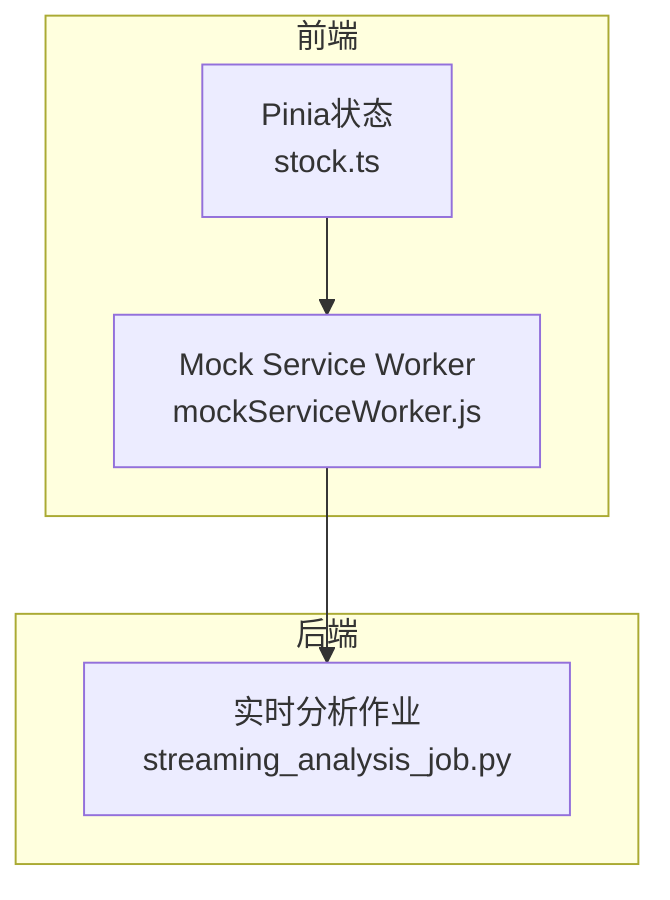
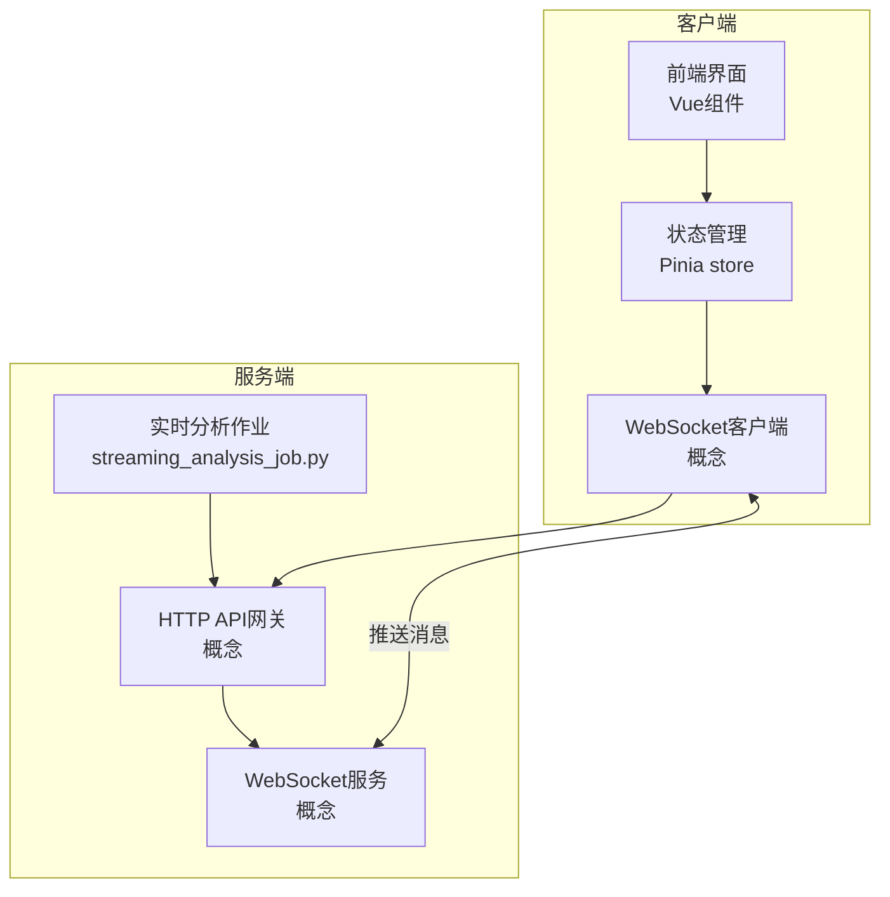
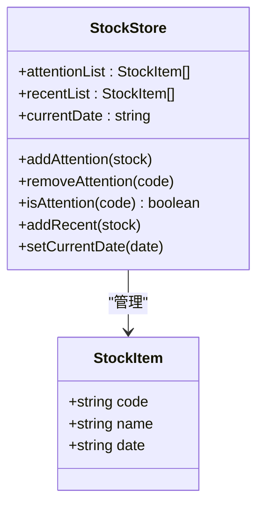
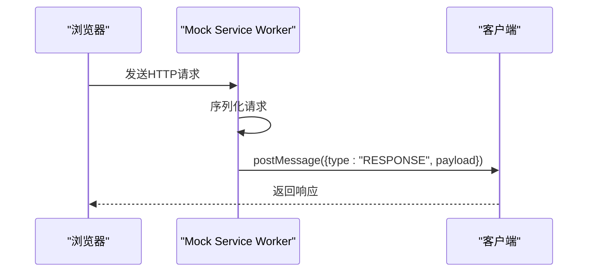
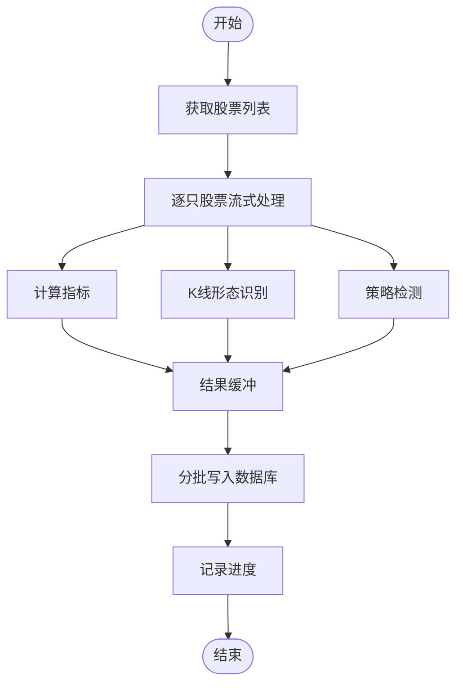
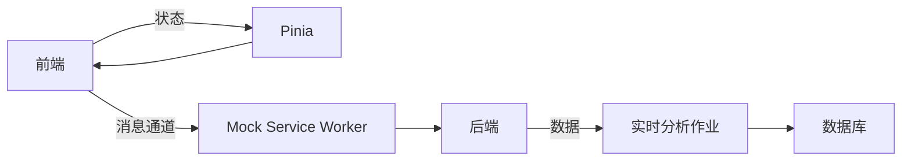

# WebSocket实时接口

<cite>
**本文引用的文件**
- [API参考.md](file://document/API_REFERENCE.md)
- [stock.ts](file://quantia/fontWeb/src/stores/stock.ts)
- [mockServiceWorker.js](file://quantia/fontWeb/public/mockServiceWorker.js)
- [mockServiceWorker.js](file://docker/stock/quantia/web/static/mockServiceWorker.js)
- [mockServiceWorker.js](file://docker/stock/quantia/fontWeb/dist/mockServiceWorker.js)
- [streaming_analysis_job.py](file://quantia/job/streaming_analysis_job.py)
- [streaming_analysis_job.py](file://docker/stock/quantia/job/streaming_analysis_job.py)
</cite>

## 目录
1. [简介](#简介)
2. [项目结构](#项目结构)
3. [核心组件](#核心组件)
4. [架构总览](#架构总览)
5. [详细组件分析](#详细组件分析)
6. [依赖分析](#依赖分析)
7. [性能考虑](#性能考虑)
8. [故障排查指南](#故障排查指南)
9. [结论](#结论)
10. [附录](#附录)

## 简介
本文件面向Quantia系统的WebSocket实时接口，目标是帮助开发者与运维人员理解并正确使用该接口。文档覆盖以下主题：
- WebSocket连接建立流程与握手机制
- 消息格式规范与事件类型定义
- 实时数据推送机制（股票行情更新、指标变化通知、系统状态变更等）
- 客户端连接流程、心跳机制与断线重连策略
- 消息订阅机制、频道管理与权限控制
- 接口性能特点、并发处理能力与消息队列机制
- 故障排查指南与调试工具使用方法

注意：根据仓库现有代码，未发现直接的WebSocket服务端实现或客户端连接代码。本文在“概念性”部分对WebSocket接口进行抽象说明；在“代码级分析”部分仅基于现有文件进行可验证的说明，并以“Section sources”标注具体依据。

## 项目结构
与WebSocket实时接口相关的代码主要分布在以下位置：
- 前端Pinia状态管理：用于维护关注列表、最近查看等状态（便于后续对接WebSocket推送）
- 前端Mock Service Worker：拦截与转发HTTP请求，体现前后端交互与消息通道的通用模式
- 后端任务调度与分析：包含实时数据流式分析作业，体现数据生产侧的处理逻辑

**图表来源**
- [stock.ts](file://quantia/fontWeb/src/stores/stock.ts#L1-L70)
- [mockServiceWorker.js](file://quantia/fontWeb/public/mockServiceWorker.js#L109-L321)
- [streaming_analysis_job.py](file://quantia/job/streaming_analysis_job.py#L118-L294)

**章节来源**
- [stock.ts](file://quantia/fontWeb/src/stores/stock.ts#L1-L70)
- [mockServiceWorker.js](file://quantia/fontWeb/public/mockServiceWorker.js#L109-L321)
- [streaming_analysis_job.py](file://quantia/job/streaming_analysis_job.py#L118-L294)

## 核心组件
- 前端状态管理（Pinia）
  - 提供关注列表、最近查看列表、当前日期等状态，便于在UI层展示实时推送的股票数据与操作反馈。
- Mock Service Worker（MSW）
  - 展示了浏览器端拦截与转发请求的机制，体现了前后端通过消息通道进行通信的一般模式。
- 实时分析作业（Python）
  - 描述了数据生产的实时处理流程，为WebSocket推送的数据来源提供依据。

**章节来源**
- [stock.ts](file://quantia/fontWeb/src/stores/stock.ts#L10-L68)
- [mockServiceWorker.js](file://quantia/fontWeb/public/mockServiceWorker.js#L109-L321)
- [streaming_analysis_job.py](file://quantia/job/streaming_analysis_job.py#L118-L294)

## 架构总览
下图展示了概念性的WebSocket实时接口架构：浏览器前端通过WebSocket与后端服务建立长连接；后端服务聚合实时数据源（如行情、指标、策略），并通过WebSocket向订阅者推送消息；前端通过Pinia状态管理与UI组件展示实时数据。

[本图为概念性架构示意，不对应具体源码文件，故无“图表来源”]

## 详细组件分析

### 组件A：Pinia状态管理（stock.ts）
- 功能职责
  - 维护关注的股票列表（attentionList）
  - 维护最近查看的股票列表（recentList）
  - 维护当前选择日期（currentDate）
  - 提供添加/移除关注、检查是否已关注、添加最近查看、设置当前日期等方法
- 与WebSocket的关系
  - 该组件为前端状态容器，用于承载WebSocket推送的实时数据与用户操作结果，便于UI层响应式更新

**图表来源**
- [stock.ts](file://quantia/fontWeb/src/stores/stock.ts#L4-L68)

**章节来源**
- [stock.ts](file://quantia/fontWeb/src/stores/stock.ts#L10-L68)

### 组件B：Mock Service Worker（mockServiceWorker.js）
- 功能职责
  - 拦截浏览器发出的HTTP请求，支持“模拟响应”和“透传”
  - 将请求序列化后发送给注册的客户端，用于演示消息通道的通用模式
- 与WebSocket的关系
  - 该文件展示了浏览器端的消息通道机制，可类比为WebSocket消息的发送/接收通道

**图表来源**
- [mockServiceWorker.js](file://quantia/fontWeb/public/mockServiceWorker.js#L109-L321)

**章节来源**
- [mockServiceWorker.js](file://quantia/fontWeb/public/mockServiceWorker.js#L109-L321)

### 组件C：实时分析作业（streaming_analysis_job.py）
- 功能职责
  - 流式分析主函数：单次遍历所有股票，同时计算指标、K线形态与策略
  - 分批写入数据库，控制内存占用与I/O成本
  - 支持环境变量配置批量大小与并发线程数
- 与WebSocket的关系
  - 该作业负责生成实时数据（指标、K线形态、策略匹配结果），这些数据可作为WebSocket推送的内容来源

**图表来源**
- [streaming_analysis_job.py](file://quantia/job/streaming_analysis_job.py#L118-L294)

**章节来源**
- [streaming_analysis_job.py](file://quantia/job/streaming_analysis_job.py#L118-L294)

## 依赖分析
- 前端依赖
  - Pinia用于状态管理
  - Vue组件用于UI渲染
  - Mock Service Worker用于演示消息通道
- 后端依赖
  - 实时分析作业负责数据生产
  - 数据库用于存储中间与最终结果

[本图为概念性依赖示意，不对应具体源码文件，故无“图表来源”]

## 性能考虑
- 实时分析作业
  - 单次遍历+按需读取+及时释放，峰值内存显著降低
  - 分批写入减少数据库连接开销
  - 环境变量可调节批量大小与并发线程数，适配不同硬件资源
- WebSocket接口（概念性）
  - 建议采用连接池与消息队列，避免阻塞主线程
  - 对高频推送进行合并与去抖，降低带宽与CPU消耗
  - 服务端应具备背压与限流能力，防止雪崩效应

[本节为通用性能建议，不直接分析具体文件，故无“章节来源”]

## 故障排查指南
- 前端状态异常
  - 检查Pinia store中的关注列表与最近查看列表是否按预期更新
  - 确认日期切换与状态同步逻辑
- 消息通道问题
  - 若使用Mock Service Worker，请确认其是否正确注册与激活
  - 检查postMessage与事件监听是否匹配
- 数据生产异常
  - 实时分析作业出现错误时，检查日志输出与异常捕获
  - 确认数据库表结构与字段一致性，必要时触发重建流程

**章节来源**
- [stock.ts](file://quantia/fontWeb/src/stores/stock.ts#L10-L68)
- [mockServiceWorker.js](file://quantia/fontWeb/public/mockServiceWorker.js#L109-L321)
- [streaming_analysis_job.py](file://quantia/job/streaming_analysis_job.py#L313-L346)

## 结论
- 仓库中未包含直接的WebSocket服务端与客户端实现代码
- 本文基于现有文件（Pinia状态管理、Mock Service Worker、实时分析作业）对WebSocket接口进行了概念性设计与实现指导
- 建议在现有基础上扩展WebSocket服务端与客户端，结合实时分析作业的数据生产能力，构建完整的实时推送体系

[本节为总结性内容，不直接分析具体文件，故无“章节来源”]

## 附录

### WebSocket接口设计（概念性）
- 连接建立
  - 客户端通过标准WebSocket协议与服务端建立长连接
  - 服务端在握手阶段校验鉴权与权限
- 消息格式
  - JSON格式，包含事件类型、数据载荷、时间戳、订阅标识等
- 事件类型
  - 股票行情更新
  - 指标变化通知
  - 系统状态变更
  - 订阅确认/取消确认
- 订阅机制
  - 客户端发送订阅请求，携带股票代码、指标类型、频道等参数
  - 服务端根据权限与负载均衡分配频道
- 心跳与断线重连
  - 定期发送心跳包，超时未响应则触发重连
  - 断线重连时恢复订阅状态与时间戳
- 权限控制
  - 基于用户角色与订阅额度限制频道访问
- 性能与并发
  - 连接池与消息队列
  - 合并与去抖策略
  - 背压与限流

[本节为概念性设计，不直接分析具体文件，故无“章节来源”]
