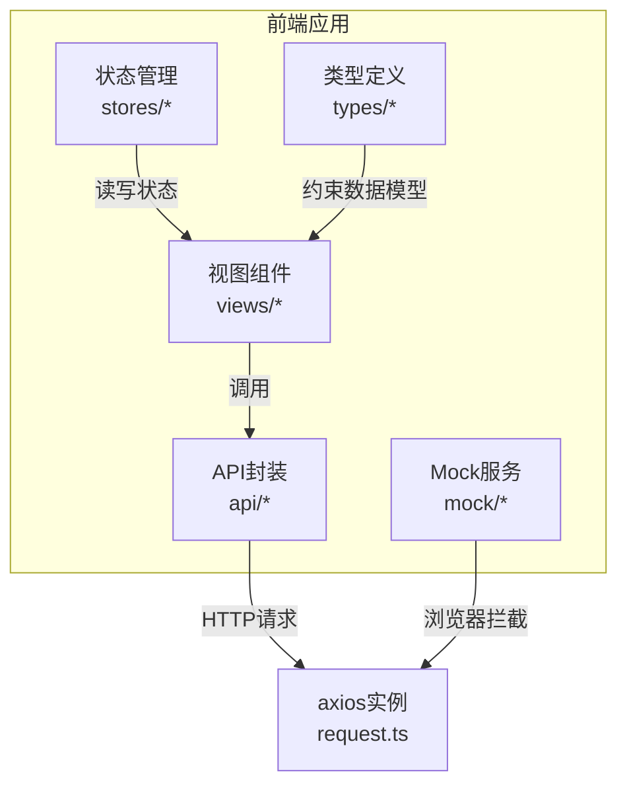
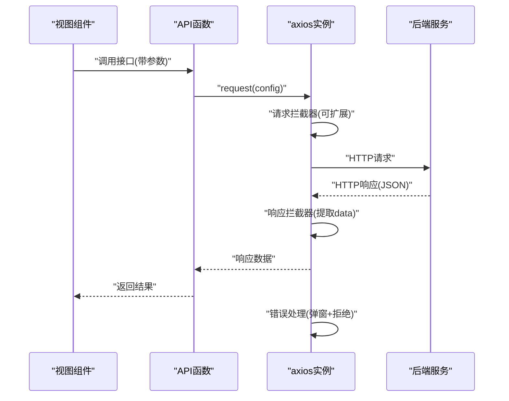
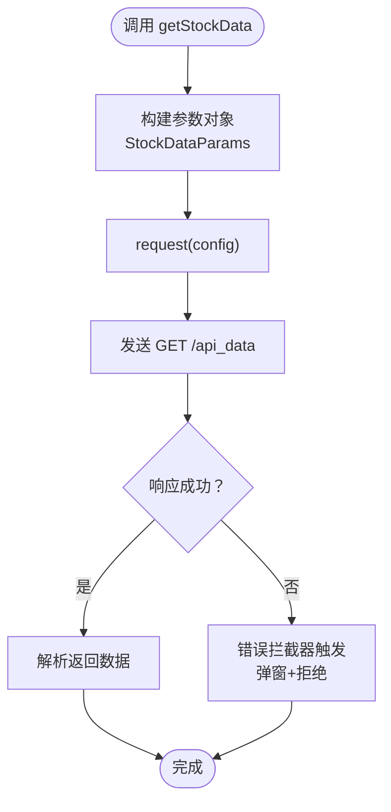
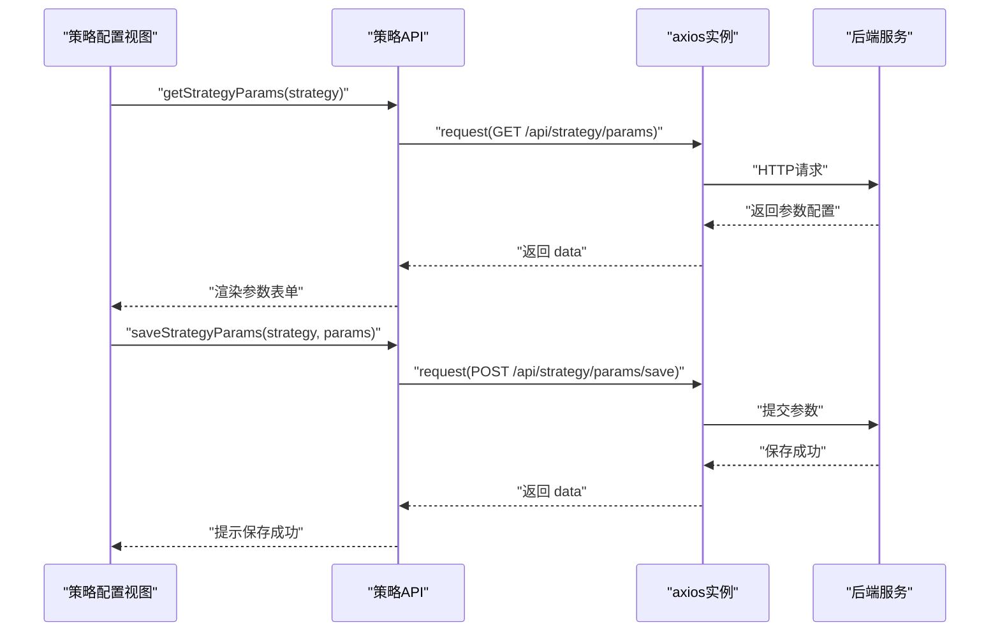
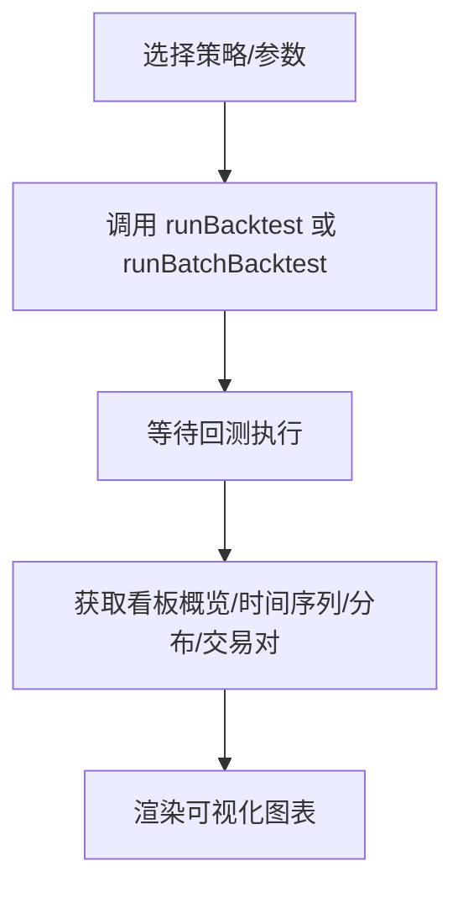
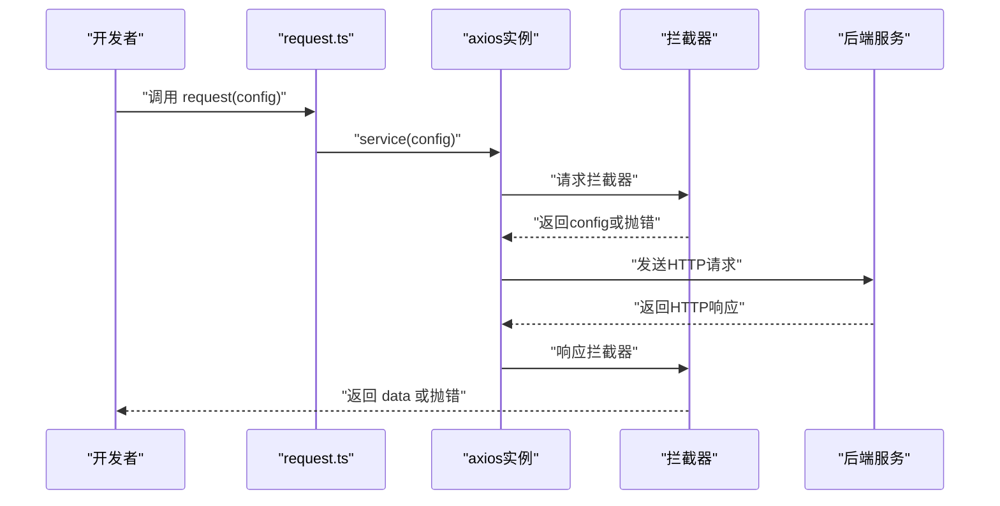
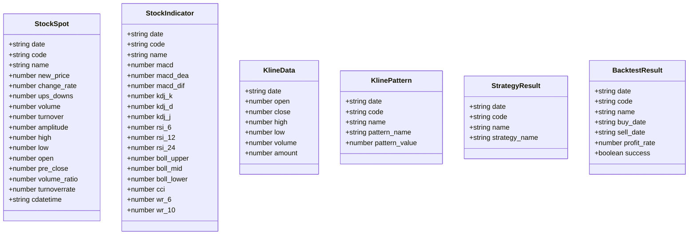
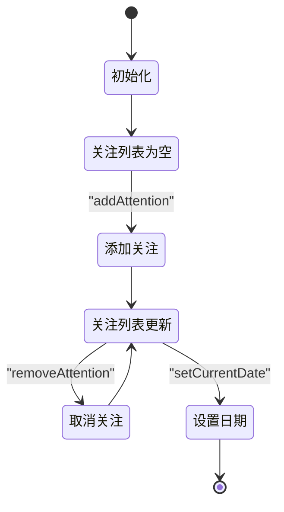
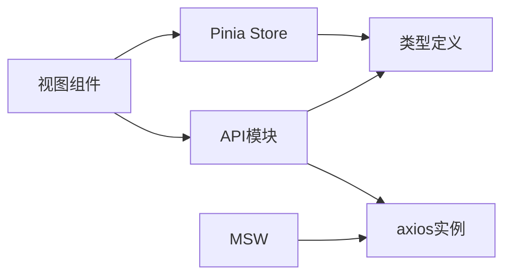

# 前端API接口

<cite>
**本文引用的文件**
- [docker/stock/quantia/fontWeb/src/api/index.ts](file://docker/stock/quantia/fontWeb/src/api/index.ts)
- [docker/stock/quantia/fontWeb/src/api/request.ts](file://docker/stock/quantia/fontWeb/src/api/request.ts)
- [docker/stock/quantia/fontWeb/src/api/stock.ts](file://docker/stock/quantia/fontWeb/src/api/stock.ts)
- [docker/stock/quantia/fontWeb/src/api/strategy.ts](file://docker/stock/quantia/fontWeb/src/api/strategy.ts)
- [docker/stock/quantia/fontWeb/src/types/index.ts](file://docker/stock/quantia/fontWeb/src/types/index.ts)
- [docker/stock/quantia/fontWeb/src/types/stock.ts](file://docker/stock/quantia/fontWeb/src/types/stock.ts)
- [docker/stock/quantia/fontWeb/src/stores/stock.ts](file://docker/stock/quantia/fontWeb/src/stores/stock.ts)
- [docker/stock/quantia/fontWeb/src/stores/index.ts](file://docker/stock/quantia/fontWeb/src/stores/index.ts)
- [docker/stock/quantia/fontWeb/src/mock/index.ts](file://docker/stock/quantia/fontWeb/src/mock/index.ts)
- [docker/stock/quantia/fontWeb/src/mock/browser.ts](file://docker/stock/quantia/fontWeb/src/mock/browser.ts)
- [docker/stock/quantia/fontWeb/src/views/strategy/StrategyConfig.vue](file://docker/stock/quantia/fontWeb/src/views/strategy/StrategyConfig.vue)
- [docker/stock/quantia/fontWeb/src/views/backtest/dashboard.vue](file://docker/stock/quantia/fontWeb/src/views/backtest/dashboard.vue)
- [docker/stock/quantia/fontWeb/src/views/stock/StockData.vue](file://docker/stock/quantia/fontWeb/src/views/stock/StockData.vue)
- [docker/stock/quantia/fontWeb/src/utils/backtestDashboardLinks.ts](file://docker/stock/quantia/fontWeb/src/utils/backtestDashboardLinks.ts)
- [docker/stock/quantia/fontWeb/src/router/index.ts](file://docker/stock/quantia/fontWeb/src/router/index.ts)
- [docker/stock/quantia/fontWeb/package.json](file://docker/stock/quantia/fontWeb/package.json)
- [docker/stock/quantia/fontWeb/vite.config.ts](file://docker/stock/quantia/fontWeb/vite.config.ts)
- [docker/stock/quantia/fontWeb/tsconfig.json](file://docker/stock/quantia/fontWeb/tsconfig.json)
- [docker/stock/quantia/fontWeb/vitest.config.ts](file://docker/stock/quantia/fontWeb/vitest.config.ts)
- [docker/stock/quantia/fontWeb/tests/api/handlers.test.ts](file://docker/stock/quantia/fontWeb/tests/api/handlers.test.ts)
- [docker/stock/quantia/fontWeb/tests/mock/mockData.test.ts](file://docker/stock/quantia/fontWeb/tests/mock/mockData.test.ts)
- [docker/stock/quantia/fontWeb/tests/stores/stock.test.ts](file://docker/stock/quantia/fontWeb/tests/stores/stock.test.ts)
- [docker/stock/quantia/fontWeb/tests/views/StockData.test.ts](file://docker/stock/quantia/fontWeb/tests/views/StockData.test.ts)
- [docker/stock/quantia/fontWeb/tests/setup.ts](file://docker/stock/quantia/fontWeb/tests/setup.ts)
- [docker/stock/quantia/fontWeb/README.md](file://docker/stock/quantia/fontWeb/README.md)
</cite>

## 目录
1. [简介](#简介)
2. [项目结构](#项目结构)
3. [核心组件](#核心组件)
4. [架构总览](#架构总览)
5. [详细组件分析](#详细组件分析)
6. [依赖关系分析](#依赖关系分析)
7. [性能考虑](#性能考虑)
8. [故障排查指南](#故障排查指南)
9. [结论](#结论)
10. [附录](#附录)

## 简介
本文件面向Quantia前端团队与集成方，系统化梳理Vue.js前端应用的API接口规范与SDK使用指南。内容覆盖：
- 接口契约与TypeScript类型定义
- 股票数据API、策略配置API、回测看板API的实现要点
- 前端SDK（基于axios）配置、拦截器与错误处理
- 数据传输格式、缓存策略与状态管理
- Mock数据服务与测试环境配置
- 版本管理、向后兼容与升级迁移建议
- 集成最佳实践、性能优化与安全防护

## 项目结构
前端位于docker/stock/quantia/fontWeb目录，采用Vue 3 + TypeScript + Vite + Pinia + Element Plus技术栈。API层通过统一的axios实例封装，按功能拆分为股票、策略、回测看板等模块；类型定义集中于types目录；状态管理使用Pinia；Mock服务采用MSW。

图表来源
- [docker/stock/quantia/fontWeb/src/api/request.ts](file://docker/stock/quantia/fontWeb/src/api/request.ts#L1-L39)
- [docker/stock/quantia/fontWeb/src/api/stock.ts](file://docker/stock/quantia/fontWeb/src/api/stock.ts#L1-L187)
- [docker/stock/quantia/fontWeb/src/api/strategy.ts](file://docker/stock/quantia/fontWeb/src/api/strategy.ts#L1-L93)
- [docker/stock/quantia/fontWeb/src/stores/stock.ts](file://docker/stock/quantia/fontWeb/src/stores/stock.ts#L1-L70)
- [docker/stock/quantia/fontWeb/src/types/stock.ts](file://docker/stock/quantia/fontWeb/src/types/stock.ts#L1-L80)
- [docker/stock/quantia/fontWeb/src/mock/browser.ts](file://docker/stock/quantia/fontWeb/src/mock/browser.ts#L1-L6)

章节来源
- [docker/stock/quantia/fontWeb/src/api/index.ts](file://docker/stock/quantia/fontWeb/src/api/index.ts#L1-L2)
- [docker/stock/quantia/fontWeb/src/api/request.ts](file://docker/stock/quantia/fontWeb/src/api/request.ts#L1-L39)
- [docker/stock/quantia/fontWeb/src/types/index.ts](file://docker/stock/quantia/fontWeb/src/types/index.ts#L1-L2)
- [docker/stock/quantia/fontWeb/src/stores/index.ts](file://docker/stock/quantia/fontWeb/src/stores/index.ts#L1-L2)
- [docker/stock/quantia/fontWeb/src/mock/index.ts](file://docker/stock/quantia/fontWeb/src/mock/index.ts#L1-L3)

## 核心组件
- axios实例与拦截器：统一基地址、超时、请求/响应拦截、错误提示
- 股票API模块：股票列表、指标、关注、交易日、K线、回测相关接口
- 策略API模块：策略列表、参数配置、保存/重置、动态筛选
- 类型系统：StockSpot、StockIndicator、KlineData、KlinePattern、StrategyResult、BacktestResult等
- 状态管理：Pinia Store维护关注/最近浏览/当前日期
- Mock服务：MSW浏览器拦截器，支持离线开发与测试

章节来源
- [docker/stock/quantia/fontWeb/src/api/request.ts](file://docker/stock/quantia/fontWeb/src/api/request.ts#L1-L39)
- [docker/stock/quantia/fontWeb/src/api/stock.ts](file://docker/stock/quantia/fontWeb/src/api/stock.ts#L1-L187)
- [docker/stock/quantia/fontWeb/src/api/strategy.ts](file://docker/stock/quantia/fontWeb/src/api/strategy.ts#L1-L93)
- [docker/stock/quantia/fontWeb/src/types/stock.ts](file://docker/stock/quantia/fontWeb/src/types/stock.ts#L1-L80)
- [docker/stock/quantia/fontWeb/src/stores/stock.ts](file://docker/stock/quantia/fontWeb/src/stores/stock.ts#L1-L70)
- [docker/stock/quantia/fontWeb/src/mock/browser.ts](file://docker/stock/quantia/fontWeb/src/mock/browser.ts#L1-L6)

## 架构总览
前端通过API模块发起HTTP请求，经由axios实例统一处理；后端返回标准JSON数据，响应拦截器提取data并透传给调用方；错误时统一弹窗提示并拒绝Promise，便于上层捕获。

图表来源
- [docker/stock/quantia/fontWeb/src/api/request.ts](file://docker/stock/quantia/fontWeb/src/api/request.ts#L14-L36)
- [docker/stock/quantia/fontWeb/src/api/stock.ts](file://docker/stock/quantia/fontWeb/src/api/stock.ts#L26-L32)
- [docker/stock/quantia/fontWeb/src/api/strategy.ts](file://docker/stock/quantia/fontWeb/src/api/strategy.ts#L43-L48)

## 详细组件分析

### 股票数据API
- 接口清单
  - 获取股票数据列表：GET /api_data（支持名称、日期、分页、关键词）
  - 获取股票指标详情：GET /data/indicators（支持代码、日期、名称）
  - 关注/取消关注：GET /control/attention（参数：code, otype）
  - 最近交易日：GET /api/trade_date（返回最近收盘日与当前交易日）
  - K线数据：GET /api/kline（支持周期、天数、名称）
- 参数与返回类型
  - 参数类型：StockDataParams、StockIndicatorParams、AttentionParams、KlineParams
  - 返回类型：StockSpot、StockIndicator、KlineData、KlinePattern等
- 使用示例（以路径代替具体代码）
  - [getStockData](file://docker/stock/quantia/fontWeb/src/api/stock.ts#L26-L32)
  - [getStockIndicators](file://docker/stock/quantia/fontWeb/src/api/stock.ts#L38-L44)
  - [toggleAttention](file://docker/stock/quantia/fontWeb/src/api/stock.ts#L50-L56)
  - [getTradeDate](file://docker/stock/quantia/fontWeb/src/api/stock.ts#L64-L69)
  - [getKlineData](file://docker/stock/quantia/fontWeb/src/api/stock.ts#L184-L186)

图表来源
- [docker/stock/quantia/fontWeb/src/api/stock.ts](file://docker/stock/quantia/fontWeb/src/api/stock.ts#L26-L32)
- [docker/stock/quantia/fontWeb/src/api/request.ts](file://docker/stock/quantia/fontWeb/src/api/request.ts#L25-L36)

章节来源
- [docker/stock/quantia/fontWeb/src/api/stock.ts](file://docker/stock/quantia/fontWeb/src/api/stock.ts#L1-L187)
- [docker/stock/quantia/fontWeb/src/types/stock.ts](file://docker/stock/quantia/fontWeb/src/types/stock.ts#L1-L80)

### 策略配置API
- 接口清单
  - 获取策略列表：GET /api/strategy/params
  - 获取策略参数：GET /api/strategy/params（查询参数：strategy）
  - 保存策略参数：POST /api/strategy/params/save（body：{strategy, params}）
  - 重置策略参数：POST /api/strategy/params/reset（body：{strategy}）
  - 动态筛选股票：GET /api/strategy/filter（查询参数：strategy, date, page, page_size）
- 参数与返回类型
  - StrategyParam、ParamGroup、StrategyParamsResponse、StrategyListItem
- 使用示例（以路径代替具体代码）
  - [getStrategyList](file://docker/stock/quantia/fontWeb/src/api/strategy.ts#L43-L48)
  - [getStrategyParams](file://docker/stock/quantia/fontWeb/src/api/strategy.ts#L53-L59)
  - [saveStrategyParams](file://docker/stock/quantia/fontWeb/src/api/strategy.ts#L64-L70)
  - [resetStrategyParams](file://docker/stock/quantia/fontWeb/src/api/strategy.ts#L75-L81)
  - [filterStocks](file://docker/stock/quantia/fontWeb/src/api/strategy.ts#L86-L92)

图表来源
- [docker/stock/quantia/fontWeb/src/api/strategy.ts](file://docker/stock/quantia/fontWeb/src/api/strategy.ts#L53-L70)
- [docker/stock/quantia/fontWeb/src/api/request.ts](file://docker/stock/quantia/fontWeb/src/api/request.ts#L25-L36)

章节来源
- [docker/stock/quantia/fontWeb/src/api/strategy.ts](file://docker/stock/quantia/fontWeb/src/api/strategy.ts#L1-L93)
- [docker/stock/quantia/fontWeb/src/views/strategy/StrategyConfig.vue](file://docker/stock/quantia/fontWeb/src/views/strategy/StrategyConfig.vue)

### 回测看板API
- 接口清单
  - 回测配置：GET /api/backtest/config
  - 单只回测：GET /api/backtest/run（参数：code, strategy, period, start_date, end_date, checkpoints）
  - 批量回测：GET /api/backtest/batch（参数：strategy, period, limit, horizons, success_days）
  - 看板概览：GET /api/backtest/dashboard/overview（参数：days, metric, start_date, end_date）
  - 时间序列：GET /api/backtest/dashboard/timeline（参数：strategies, days, horizon, start_date, end_date）
  - 策略明细：GET /api/backtest/dashboard/strategy_detail（参数：strategy, days, horizons, page, page_size, start_date, end_date）
  - 分布统计：GET /api/backtest/dashboard/distribution（参数：strategy, days, horizon, start_date, end_date）
  - 交易对：GET /api/backtest/dashboard/trade_pairs（参数：strategy, days, page, page_size, max_hold, start_date, end_date）
- 参数与返回类型
  - BacktestParams、BatchBacktestParams、DashboardOverviewParams、DashboardTimelineParams、DashboardStrategyDetailParams、DashboardDistributionParams、DashboardTradePairsParams
- 使用示例（以路径代替具体代码）
  - [getBacktestConfig](file://docker/stock/quantia/fontWeb/src/api/stock.ts#L94-L96)
  - [runBacktest](file://docker/stock/quantia/fontWeb/src/api/stock.ts#L99-L101)
  - [runBatchBacktest](file://docker/stock/quantia/fontWeb/src/api/stock.ts#L104-L106)
  - [getBacktestDashboardOverview](file://docker/stock/quantia/fontWeb/src/api/stock.ts#L117-L119)
  - [getBacktestDashboardTimeline](file://docker/stock/quantia/fontWeb/src/api/stock.ts#L129-L131)
  - [getBacktestDashboardStrategyDetail](file://docker/stock/quantia/fontWeb/src/api/stock.ts#L143-L145)
  - [getBacktestDashboardDistribution](file://docker/stock/quantia/fontWeb/src/api/stock.ts#L155-L157)
  - [getBacktestDashboardTradePairs](file://docker/stock/quantia/fontWeb/src/api/stock.ts#L169-L171)

图表来源
- [docker/stock/quantia/fontWeb/src/api/stock.ts](file://docker/stock/quantia/fontWeb/src/api/stock.ts#L94-L171)
- [docker/stock/quantia/fontWeb/src/views/backtest/dashboard.vue](file://docker/stock/quantia/fontWeb/src/views/backtest/dashboard.vue)

章节来源
- [docker/stock/quantia/fontWeb/src/api/stock.ts](file://docker/stock/quantia/fontWeb/src/api/stock.ts#L71-L187)
- [docker/stock/quantia/fontWeb/src/utils/backtestDashboardLinks.ts](file://docker/stock/quantia/fontWeb/src/utils/backtestDashboardLinks.ts)

### 前端SDK（axios配置、拦截器、错误处理）
- 基础配置
  - 基址：/quantia
  - 超时：60秒
  - Content-Type：application/json;charset=UTF-8
- 请求拦截器：可扩展注入鉴权、签名、埋点等
- 响应拦截器：统一提取data、错误弹窗、拒绝Promise
- 错误处理：优先展示后端error.message，其次error.message，最后“网络错误”

图表来源
- [docker/stock/quantia/fontWeb/src/api/request.ts](file://docker/stock/quantia/fontWeb/src/api/request.ts#L5-L36)

章节来源
- [docker/stock/quantia/fontWeb/src/api/request.ts](file://docker/stock/quantia/fontWeb/src/api/request.ts#L1-L39)

### 类型系统与数据模型
- 股票基础数据：StockSpot（最新价、涨跌幅、成交量、换手率等）
- 技术指标：StockIndicator（MACD、KDJ、RSI、BOLL、CCI、WR等）
- K线数据：KlineData（OHLC、成交量）
- K线形态：KlinePattern（形态信号）
- 策略结果：StrategyResult
- 回测结果：BacktestResult
- 统一导出入口：types/index.ts与types/stock.ts

图表来源
- [docker/stock/quantia/fontWeb/src/types/stock.ts](file://docker/stock/quantia/fontWeb/src/types/stock.ts#L4-L80)

章节来源
- [docker/stock/quantia/fontWeb/src/types/index.ts](file://docker/stock/quantia/fontWeb/src/types/index.ts#L1-L2)
- [docker/stock/quantia/fontWeb/src/types/stock.ts](file://docker/stock/quantia/fontWeb/src/types/stock.ts#L1-L80)

### 状态管理（Pinia）
- 状态项
  - 关注列表：StockItem[]
  - 最近浏览：StockItem[]（最多20条）
  - 当前日期：string
- 方法
  - addAttention/removeAttention/isAttention
  - addRecent/setCurrentDate
- 导出入口：stores/index.ts

图表来源
- [docker/stock/quantia/fontWeb/src/stores/stock.ts](file://docker/stock/quantia/fontWeb/src/stores/stock.ts#L10-L68)

章节来源
- [docker/stock/quantia/fontWeb/src/stores/index.ts](file://docker/stock/quantia/fontWeb/src/stores/index.ts#L1-L2)
- [docker/stock/quantia/fontWeb/src/stores/stock.ts](file://docker/stock/quantia/fontWeb/src/stores/stock.ts#L1-L70)

### Mock数据服务与测试
- Mock服务
  - 浏览器Worker：setupWorker(...handlers)
  - 导出：stockData、handlers等
- 测试配置
  - Vitest配置、JSDOM、全局setup
  - 单元测试覆盖API、Mock、Store、视图
- 使用建议
  - 开发阶段启用MSW，离线调试与联调并行
  - 测试中使用Mock数据保证稳定性与可重复性

章节来源
- [docker/stock/quantia/fontWeb/src/mock/index.ts](file://docker/stock/quantia/fontWeb/src/mock/index.ts#L1-L3)
- [docker/stock/quantia/fontWeb/src/mock/browser.ts](file://docker/stock/quantia/fontWeb/src/mock/browser.ts#L1-L6)
- [docker/stock/quantia/fontWeb/vitest.config.ts](file://docker/stock/quantia/fontWeb/vitest.config.ts)
- [docker/stock/quantia/fontWeb/tests/setup.ts](file://docker/stock/quantia/fontWeb/tests/setup.ts)
- [docker/stock/quantia/fontWeb/tests/api/handlers.test.ts](file://docker/stock/quantia/fontWeb/tests/api/handlers.test.ts)
- [docker/stock/quantia/fontWeb/tests/mock/mockData.test.ts](file://docker/stock/quantia/fontWeb/tests/mock/mockData.test.ts)
- [docker/stock/quantia/fontWeb/tests/stores/stock.test.ts](file://docker/stock/quantia/fontWeb/tests/stores/stock.test.ts)
- [docker/stock/quantia/fontWeb/tests/views/StockData.test.ts](file://docker/stock/quantia/fontWeb/tests/views/StockData.test.ts)

## 依赖关系分析
- 模块耦合
  - API模块仅依赖axios实例，低耦合、高内聚
  - 视图组件通过API模块访问后端，避免直接引入axios
  - 类型定义被视图与Store复用，形成稳定契约
- 外部依赖
  - axios、Element Plus、Pinia、Vue Router、MSW、Vitest等
- 潜在风险
  - 响应拦截器统一错误处理，需确保后端返回结构一致
  - Mock与真实接口字段需保持一致，避免联调偏差

图表来源
- [docker/stock/quantia/fontWeb/src/api/request.ts](file://docker/stock/quantia/fontWeb/src/api/request.ts#L1-L39)
- [docker/stock/quantia/fontWeb/src/api/stock.ts](file://docker/stock/quantia/fontWeb/src/api/stock.ts#L1-L2)
- [docker/stock/quantia/fontWeb/src/api/strategy.ts](file://docker/stock/quantia/fontWeb/src/api/strategy.ts#L1-L2)
- [docker/stock/quantia/fontWeb/src/types/stock.ts](file://docker/stock/quantia/fontWeb/src/types/stock.ts#L1-L80)
- [docker/stock/quantia/fontWeb/src/stores/stock.ts](file://docker/stock/quantia/fontWeb/src/stores/stock.ts#L1-L70)
- [docker/stock/quantia/fontWeb/src/mock/browser.ts](file://docker/stock/quantia/fontWeb/src/mock/browser.ts#L1-L6)

章节来源
- [docker/stock/quantia/fontWeb/package.json](file://docker/stock/quantia/fontWeb/package.json)
- [docker/stock/quantia/fontWeb/src/router/index.ts](file://docker/stock/quantia/fontWeb/src/router/index.ts)

## 性能考虑
- 请求合并与节流：对高频查询（如K线、指标）进行防抖/节流
- 分页与懒加载：列表接口使用分页，滚动加载减少首屏压力
- 缓存策略：短期缓存（如当日交易日、策略参数），长缓存（如历史K线）需加版本戳
- 图表渲染：大数据量时采用虚拟滚动、采样与增量渲染
- 并发控制：批量回测时限制并发数量，避免阻塞UI
- 资源优化：按需加载视图与路由，减少初始包体

## 故障排查指南
- 常见问题
  - 网络错误：检查代理与CORS配置，确认后端可达
  - 后端报错：查看响应拦截器中的serverMsg，定位业务异常
  - Mock不生效：确认MSW worker已启动且拦截路径匹配
- 调试技巧
  - 使用浏览器Network面板观察请求/响应
  - 在请求拦截器中打印config，定位参数构造问题
  - 在响应拦截器中打印error.response，定位后端错误码
- 单元测试
  - 通过Vitest运行测试，结合Mock数据验证API行为
  - 对Store状态变更进行断言，确保交互正确

章节来源
- [docker/stock/quantia/fontWeb/src/api/request.ts](file://docker/stock/quantia/fontWeb/src/api/request.ts#L25-L36)
- [docker/stock/quantia/fontWeb/tests/api/handlers.test.ts](file://docker/stock/quantia/fontWeb/tests/api/handlers.test.ts)
- [docker/stock/quantia/fontWeb/tests/mock/mockData.test.ts](file://docker/stock/quantia/fontWeb/tests/mock/mockData.test.ts)
- [docker/stock/quantia/fontWeb/tests/stores/stock.test.ts](file://docker/stock/quantia/fontWeb/tests/stores/stock.test.ts)

## 结论
本文档提供了Quantia前端API的完整接口规范与SDK使用指南，涵盖数据契约、类型定义、状态管理、Mock与测试、性能与安全建议。建议在后续迭代中持续完善接口文档、增强类型约束与单元测试覆盖率，确保前后端协作高效、稳定。

## 附录

### 接口契约速查
- 股票数据
  - GET /api_data → 列表数据
  - GET /data/indicators → 指标详情
  - GET /control/attention → 关注/取消关注
  - GET /api/trade_date → 交易日
  - GET /api/kline → K线数据
- 回测
  - GET /api/backtest/config → 配置
  - GET /api/backtest/run → 单只回测
  - GET /api/backtest/batch → 批量回测
  - GET /api/backtest/dashboard/overview → 概览
  - GET /api/backtest/dashboard/timeline → 时间序列
  - GET /api/backtest/dashboard/strategy_detail → 策略明细
  - GET /api/backtest/dashboard/distribution → 分布
  - GET /api/backtest/dashboard/trade_pairs → 交易对
- 策略
  - GET /api/strategy/params → 策略列表/参数
  - POST /api/strategy/params/save → 保存参数
  - POST /api/strategy/params/reset → 重置参数
  - GET /api/strategy/filter → 动态筛选

章节来源
- [docker/stock/quantia/fontWeb/src/api/stock.ts](file://docker/stock/quantia/fontWeb/src/api/stock.ts#L26-L186)
- [docker/stock/quantia/fontWeb/src/api/strategy.ts](file://docker/stock/quantia/fontWeb/src/api/strategy.ts#L43-L92)

### 版本管理与升级迁移
- 版本策略
  - 语义化版本：PATCH用于修复，MINOR用于新增接口/字段，MAJOR用于破坏性变更
  - 后端接口版本前缀：/v1、/v2，前端通过baseURL切换
- 兼容性
  - 新增字段保持可选，避免强制迁移
  - 删除字段先标记废弃，保留过渡期
- 迁移步骤
  - 发布预发布版本，标注破坏性变更
  - 提供迁移脚本与类型别名
  - 前端逐步替换调用点，统一清理旧逻辑

### 集成最佳实践
- 前端集成
  - 将request.ts作为唯一HTTP入口，避免直接使用axios
  - 在请求拦截器中注入通用头与鉴权信息
  - 对错误进行分类处理（网络、业务、权限）
- 性能优化
  - 合理分页与缓存，避免一次性拉取大量数据
  - 图表组件使用虚拟化与采样
- 安全防护
  - 输入校验与参数过滤
  - 防止XSS与CSRF，必要时添加CSP
  - 仅在HTTPS环境下启用Mock
