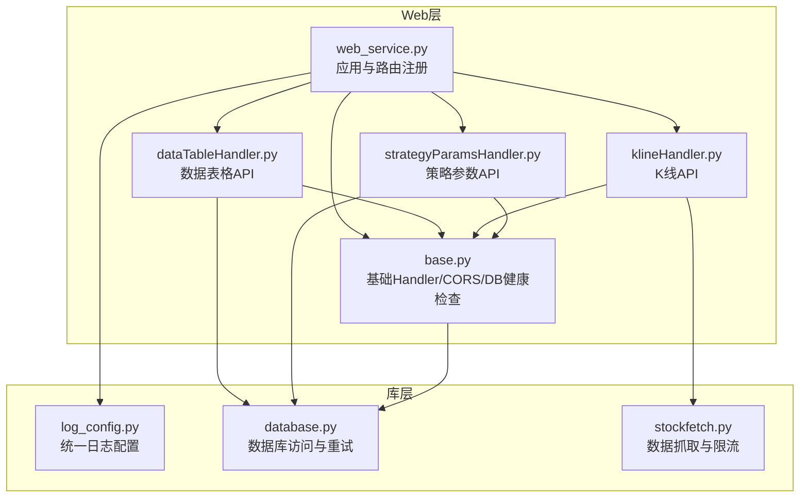
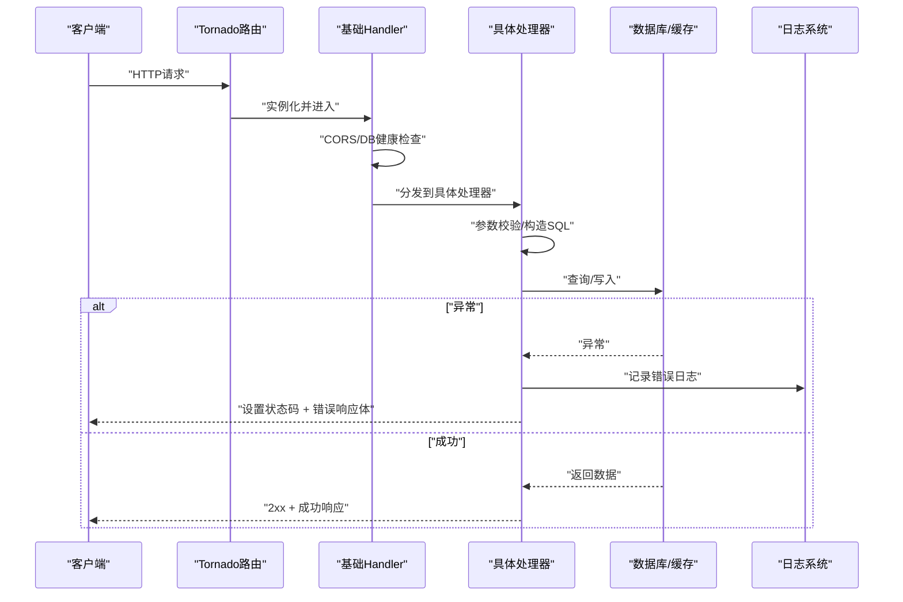
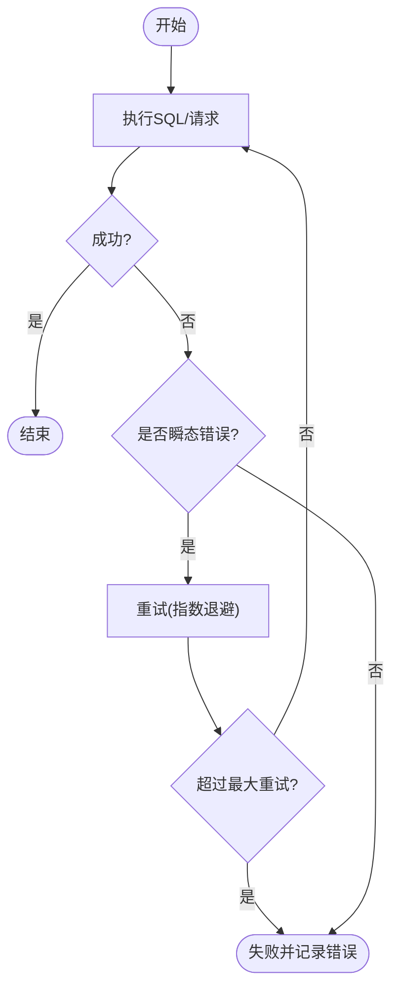
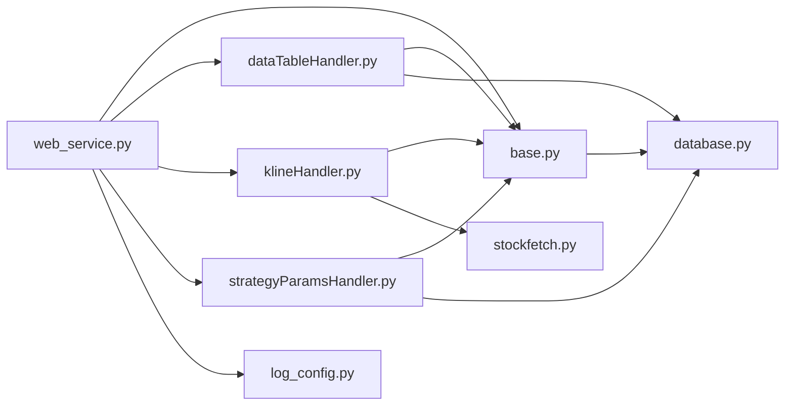

# 错误处理与状态码

<cite>
**本文引用的文件**
- [API参考文档](file://document/API_REFERENCE.md)
- [Web应用入口](file://docker/stock/quantia/web/web_service.py)
- [基础Handler与CORS](file://docker/stock/quantia/web/base.py)
- [数据表格API处理器](file://docker/stock/quantia/web/dataTableHandler.py)
- [K线API处理器](file://docker/stock/quantia/web/klineHandler.py)
- [策略参数API处理器](file://docker/stock/quantia/web/strategyParamsHandler.py)
- [数据库访问与重试](file://docker/stock/quantia/lib/database.py)
- [统一日志配置](file://docker/stock/quantia/lib/log_config.py)
- [股票数据抓取与限流](file://docker/stock/quantia/core/stockfetch.py)
- [测试用例：分页与兼容性](file://tests/test_pagination.py)
</cite>

## 目录
1. [简介](#简介)
2. [项目结构](#项目结构)
3. [核心组件](#核心组件)
4. [架构总览](#架构总览)
5. [详细组件分析](#详细组件分析)
6. [依赖关系分析](#依赖关系分析)
7. [性能考量](#性能考量)
8. [故障排查指南](#故障排查指南)
9. [结论](#结论)
10. [附录](#附录)

## 简介
本文件聚焦于Quantia API系统的错误处理机制，系统性梳理HTTP状态码使用规范、错误响应格式、错误码定义、国际化策略、常见错误诊断与修复、重试与超时策略、降级与容灾、日志与监控告警以及客户端最佳实践。目标是帮助开发者与运维人员快速定位问题、优化用户体验并提升系统稳定性。

## 项目结构
- Web服务采用Tornado框架，统一在应用入口注册路由与中间件，基础Handler负责CORS与数据库连接健康检查。
- API层按功能拆分：数据表格、K线、策略参数、回测等，各处理器独立处理输入校验、异常捕获与状态码返回。
- 底层库提供统一日志配置、数据库访问与重试、缓存与查询封装，支撑上层API的健壮性。

图表来源
- [Web应用入口](file://docker/stock/quantia/web/web_service.py#L53-L97)
- [基础Handler与CORS](file://docker/stock/quantia/web/base.py#L14-L36)
- [数据表格API处理器](file://docker/stock/quantia/web/dataTableHandler.py#L54-L214)
- [K线API处理器](file://docker/stock/quantia/web/klineHandler.py#L212-L354)
- [策略参数API处理器](file://docker/stock/quantia/web/strategyParamsHandler.py#L563-L684)
- [统一日志配置](file://docker/stock/quantia/lib/log_config.py#L47-L103)
- [数据库访问与重试](file://docker/stock/quantia/lib/database.py#L267-L303)
- [股票数据抓取与限流](file://docker/stock/quantia/core/stockfetch.py#L170-L1350)

章节来源
- [Web应用入口](file://docker/stock/quantia/web/web_service.py#L53-L97)
- [基础Handler与CORS](file://docker/stock/quantia/web/base.py#L14-L36)

## 核心组件
- 统一日志配置：集中输出全量日志与错误日志，支持轮转与控制台输出，便于问题追溯与监控。
- 数据库访问：提供带重试的SQL执行封装，区分瞬态错误与不可重试错误，避免雪崩。
- API处理器：对输入参数进行严格校验，按场景返回相应HTTP状态码与标准化错误响应。
- 限流与退避：在数据抓取层实现指数退避与熔断保护，避免对上游源造成冲击或被封禁。
- 缓存与降级：对高频查询与筛选结果进行缓存，异常时提供降级策略（如表不存在返回空数据）。

章节来源
- [统一日志配置](file://docker/stock/quantia/lib/log_config.py#L47-L103)
- [数据库访问与重试](file://docker/stock/quantia/lib/database.py#L267-L303)
- [数据表格API处理器](file://docker/stock/quantia/web/dataTableHandler.py#L54-L214)
- [K线API处理器](file://docker/stock/quantia/web/klineHandler.py#L212-L354)
- [策略参数API处理器](file://docker/stock/quantia/web/strategyParamsHandler.py#L563-L684)
- [股票数据抓取与限流](file://docker/stock/quantia/core/stockfetch.py#L170-L1350)

## 架构总览
API请求从Tornado路由进入，经基础Handler进行CORS与DB健康检查，再由具体处理器完成参数校验与业务逻辑，最后统一写入标准化错误响应或成功数据。异常路径通过状态码与错误体明确指示问题类型，日志系统记录堆栈以便定位。

图表来源
- [Web应用入口](file://docker/stock/quantia/web/web_service.py#L56-L88)
- [基础Handler与CORS](file://docker/stock/quantia/web/base.py#L16-L36)
- [数据表格API处理器](file://docker/stock/quantia/web/dataTableHandler.py#L54-L214)
- [K线API处理器](file://docker/stock/quantia/web/klineHandler.py#L237-L354)
- [策略参数API处理器](file://docker/stock/quantia/web/strategyParamsHandler.py#L566-L684)
- [统一日志配置](file://docker/stock/quantia/lib/log_config.py#L47-L103)

## 详细组件分析

### HTTP状态码与错误响应规范
- 2xx 成功
  - 200 OK：常规成功响应，返回JSON数据。
- 4xx 客户端错误
  - 400 Bad Request：请求参数缺失或格式错误。
  - 404 Not Found：资源不存在（如数据模块、策略标识）。
- 5xx 服务器错误
  - 500 Internal Server Error：服务器内部异常，通常伴随错误响应体。

错误响应格式
- 统一错误响应体包含布尔字段与消息，便于前端识别与展示。
- 部分处理器返回包含状态码字段的错误对象，便于客户端区分不同错误类型。

章节来源
- [API参考文档](file://document/API_REFERENCE.md#L346-L355)
- [数据表格API处理器](file://docker/stock/quantia/web/dataTableHandler.py#L64-L73)
- [策略参数API处理器](file://docker/stock/quantia/web/strategyParamsHandler.py#L583-L610)
- [K线API处理器](file://docker/stock/quantia/web/klineHandler.py#L245-L248)

### 错误响应格式与错误码定义
- 错误响应体字段
  - error: 布尔值，标记是否为错误响应。
  - message: 错误描述信息。
  - code: 可选，用于标识错误类型或HTTP状态码。
- 错误码建议
  - 400：参数缺失/非法
  - 404：资源不存在
  - 500：服务器内部异常
  - 503：服务不可用（可选，用于熔断/降级）

章节来源
- [API参考文档](file://document/API_REFERENCE.md#L346-L355)
- [数据表格API处理器](file://docker/stock/quantia/web/dataTableHandler.py#L171-L178)
- [策略参数API处理器](file://docker/stock/quantia/web/strategyParamsHandler.py#L599-L610)

### 错误国际化
- 当前错误消息以中文为主，建议在前端层维护多语言映射，后端保持稳定的消息键与占位符，便于国际化。
- 建议引入消息模板与翻译键，避免硬编码错误文本。

[本节为通用指导，不直接分析具体文件]

### 常见错误与诊断

- 网络连接错误
  - 现象：请求超时、连接被拒绝、DNS解析失败。
  - 诊断：检查上游服务可达性、防火墙与代理配置。
  - 解决：增加重试与超时配置，启用指数退避与熔断。

- 数据验证错误
  - 现象：400错误，提示参数缺失或非法。
  - 诊断：核对必填参数与类型，查看处理器参数校验分支。
  - 解决：完善前端校验与后端校验双层防护。

- 权限认证错误
  - 现象：401/403（若后续接入鉴权）。
  - 诊断：确认鉴权中间件与令牌有效性。
  - 解决：补充鉴权中间件与刷新令牌流程。

- 数据库异常
  - 现象：500错误，SQL执行失败。
  - 诊断：查看数据库日志与错误文件，区分瞬态与不可重试错误。
  - 解决：对瞬态错误进行有限重试，对不可重试错误降级或返回友好提示。

- 缓存/降级
  - 现象：表不存在或列不存在，返回空数据而非500。
  - 诊断：确认表结构与列同步情况。
  - 解决：提供回退逻辑与降级策略，记录警告日志。

章节来源
- [数据表格API处理器](file://docker/stock/quantia/web/dataTableHandler.py#L154-L178)
- [数据库访问与重试](file://docker/stock/quantia/lib/database.py#L267-L303)

### 重试策略、超时处理与降级机制

- 数据库重试
  - 对瞬态错误进行有限次数重试，重试间隔随次数递增。
  - 记录重试过程与最终异常，避免掩盖真实问题。

- 数据抓取与限流
  - 指数退避：首次重试等待基础间隔，随后按2的幂次增长。
  - 熔断保护：连续失败达到阈值后触发暂停，多次后停止任务避免进一步封禁。
  - 恢复降速：熔断恢复后自动提高请求间隔上限，降低对上游压力。

- API降级
  - 表不存在：返回空数据与零总数，避免500。
  - 列不存在：移除排序条件后重试，失败则返回500并记录错误。

图表来源
- [数据库访问与重试](file://docker/stock/quantia/lib/database.py#L267-L303)
- [股票数据抓取与限流](file://docker/stock/quantia/core/stockfetch.py#L170-L1350)

章节来源
- [数据库访问与重试](file://docker/stock/quantia/lib/database.py#L267-L303)
- [股票数据抓取与限流](file://docker/stock/quantia/core/stockfetch.py#L170-L1350)
- [数据表格API处理器](file://docker/stock/quantia/web/dataTableHandler.py#L154-L178)

### 日志记录规范、错误追踪与监控告警

- 日志输出
  - 全量日志：INFO及以上，按大小轮转。
  - 错误日志：ERROR及以上，包含完整堆栈，便于问题定位。
  - 控制台：WARNING及以上，避免刷屏。

- 错误追踪
  - 统一异常捕获与记录，保留上下文信息与堆栈。
  - 错误响应体包含错误描述，便于前端展示与用户感知。

- 监控告警
  - 建议基于错误日志统计错误率、超时率与熔断事件，设置阈值告警。
  - 结合状态码分布与响应时间，建立SLA监控。

章节来源
- [统一日志配置](file://docker/stock/quantia/lib/log_config.py#L47-L103)
- [数据表格API处理器](file://docker/stock/quantia/web/dataTableHandler.py#L171-L178)
- [K线API处理器](file://docker/stock/quantia/web/klineHandler.py#L356-L360)

### API客户端最佳实践与用户体验优化

- 请求侧
  - 参数校验：在客户端进行基础校验，减少无效请求。
  - 重试与超时：对408/429/503等可恢复错误进行指数退避重试。
  - 优雅降级：在网络异常时显示缓存数据或提示稍后再试。

- 响应侧
  - 统一错误处理：根据错误码与消息进行分类提示。
  - 用户引导：对404/400错误给出修复建议或跳转指引。
  - 分页与兼容：遵循API返回的数据结构，兼容旧格式响应。

章节来源
- [测试用例：分页与兼容性](file://tests/test_pagination.py#L566-L610)
- [API参考文档](file://document/API_REFERENCE.md#L346-L355)

## 依赖关系分析

图表来源
- [Web应用入口](file://docker/stock/quantia/web/web_service.py#L53-L97)
- [基础Handler与CORS](file://docker/stock/quantia/web/base.py#L14-L36)
- [数据表格API处理器](file://docker/stock/quantia/web/dataTableHandler.py#L54-L214)
- [K线API处理器](file://docker/stock/quantia/web/klineHandler.py#L212-L354)
- [策略参数API处理器](file://docker/stock/quantia/web/strategyParamsHandler.py#L563-L684)
- [数据库访问与重试](file://docker/stock/quantia/lib/database.py#L267-L303)
- [统一日志配置](file://docker/stock/quantia/lib/log_config.py#L47-L103)
- [股票数据抓取与限流](file://docker/stock/quantia/core/stockfetch.py#L170-L1350)

章节来源
- [Web应用入口](file://docker/stock/quantia/web/web_service.py#L53-L97)

## 性能考量
- 数据库层：对瞬态错误进行有限重试，避免雪崩；对不可重试错误快速失败并降级。
- 抓取层：指数退避与熔断保护，防止对上游源造成过大压力；恢复后自动降速。
- 缓存层：对高频查询与筛选结果进行缓存，异常时提供降级策略。
- 前端：对429/503等错误进行指数退避重试，避免重复抖动。

[本节为通用指导，不直接分析具体文件]

## 故障排查指南

- 快速定位
  - 查看错误日志：确认异常堆栈与上下文。
  - 检查状态码与错误体：判断是参数错误还是服务异常。
  - 核对参数：确认必填参数与类型是否正确。

- 常见场景
  - 400错误：检查必填参数与类型转换。
  - 404错误：确认资源是否存在（如策略标识、数据模块）。
  - 500错误：查看数据库异常与缓存降级逻辑。
  - 网络波动：启用指数退避与熔断，观察错误率与恢复时间。

章节来源
- [统一日志配置](file://docker/stock/quantia/lib/log_config.py#L47-L103)
- [数据表格API处理器](file://docker/stock/quantia/web/dataTableHandler.py#L64-L73)
- [策略参数API处理器](file://docker/stock/quantia/web/strategyParamsHandler.py#L583-L610)
- [K线API处理器](file://docker/stock/quantia/web/klineHandler.py#L245-L248)

## 结论
本系统通过统一的日志、严格的参数校验、数据库重试与熔断保护、缓存降级与指数退避策略，构建了稳健的错误处理体系。建议在后续迭代中完善国际化、鉴权与更细粒度的监控告警，持续提升用户体验与系统可靠性。

[本节为总结性内容，不直接分析具体文件]

## 附录

### API状态码与响应示例（依据仓库文档）
- 2xx：成功响应，返回JSON数据。
- 4xx：客户端错误，返回包含布尔字段与消息的错误对象。
- 5xx：服务器错误，返回包含错误描述的错误对象。

章节来源
- [API参考文档](file://document/API_REFERENCE.md#L346-L355)
