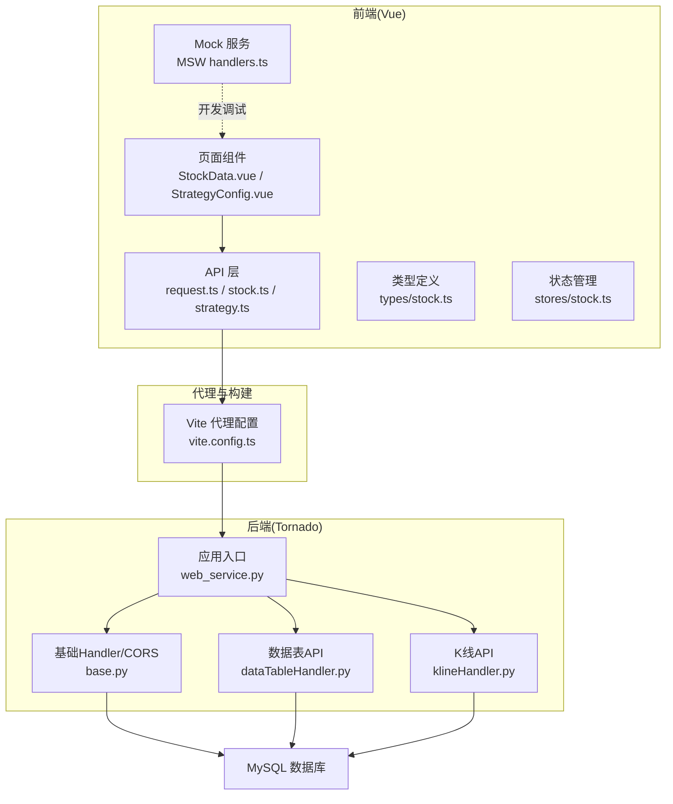
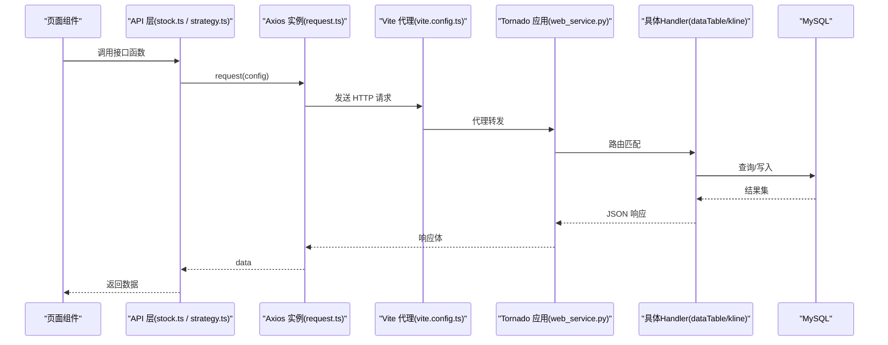
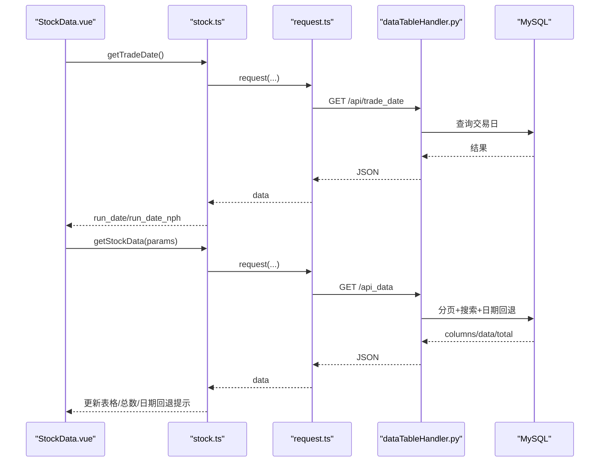
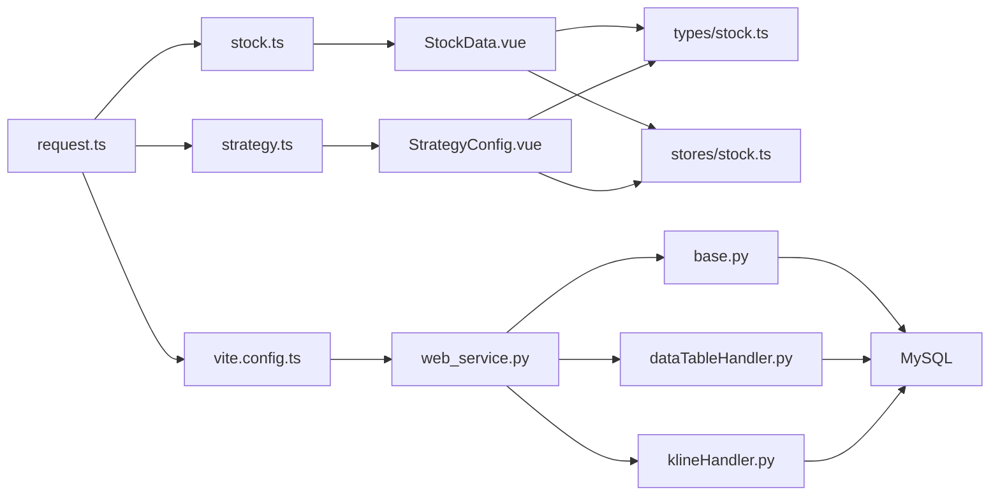

# API接口集成

<cite>
**本文引用的文件**
- [quantia\fontWeb\src\api\request.ts](file://quantia/fontWeb/src/api/request.ts)
- [quantia\fontWeb\src\api\stock.ts](file://quantia/fontWeb/src/api/stock.ts)
- [quantia\fontWeb\src\api\strategy.ts](file://quantia/fontWeb/src/api/strategy.ts)
- [quantia\fontWeb\src\mock\handlers.ts](file://quantia/fontWeb/src/mock/handlers.ts)
- [quantia\fontWeb\src\mock\stockData.ts](file://quantia/fontWeb/src/mock/stockData.ts)
- [quantia\fontWeb\src\types\stock.ts](file://quantia/fontWeb/src/types/stock.ts)
- [quantia\fontWeb\src\stores\stock.ts](file://quantia/fontWeb/src/stores/stock.ts)
- [quantia\fontWeb\src\views\stock\StockData.vue](file://quantia/fontWeb/src/views/stock/StockData.vue)
- [quantia\fontWeb\src\views\strategy\StrategyConfig.vue](file://quantia/fontWeb/src/views/strategy/StrategyConfig.vue)
- [quantia\fontWeb\vite.config.ts](file://quantia/fontWeb/vite.config.ts)
- [quantia\web\web_service.py](file://quantia/web/web_service.py)
- [quantia\web\dataTableHandler.py](file://quantia/web/dataTableHandler.py)
- [quantia\web\klineHandler.py](file://quantia/web/klineHandler.py)
- [quantia\web\base.py](file://quantia/web/base.py)
</cite>

## 目录
1. [简介](#简介)
2. [项目结构](#项目结构)
3. [核心组件](#核心组件)
4. [架构总览](#架构总览)
5. [详细组件分析](#详细组件分析)
6. [依赖关系分析](#依赖关系分析)
7. [性能考虑](#性能考虑)
8. [故障排查指南](#故障排查指南)
9. [结论](#结论)
10. [附录](#附录)

## 简介
本文件面向前端开发者，系统性梳理 Quantia 项目中前端与后端交互的 API 接口集成方案。重点涵盖：
- Axios 封装与 HTTP 请求配置
- 响应拦截器与错误处理机制
- 股票数据 API、策略配置 API、回测数据 API 的接口设计与使用方法
- 请求参数格式、响应数据结构、分页与搜索过滤
- API 认证机制、请求重试策略、超时处理、并发控制
- API 开发规范、Mock 数据服务、接口测试策略

## 项目结构
前端采用 Vue 3 + Vite + Element Plus 构建，后端基于 Tornado 提供 REST 风格 API。前端通过 Axios 实例统一发起请求，后端通过路由映射到具体 Handler，最终访问 MySQL 数据库。

图表来源
- [quantia\fontWeb\src\api\request.ts](file://quantia/fontWeb/src/api/request.ts#L1-L39)
- [quantia\fontWeb\src\api\stock.ts](file://quantia/fontWeb/src/api/stock.ts#L1-L189)
- [quantia\fontWeb\src\api\strategy.ts](file://quantia/fontWeb/src/api/strategy.ts#L1-L93)
- [quantia\fontWeb\src\views\stock\StockData.vue](file://quantia/fontWeb/src/views/stock/StockData.vue#L1-L617)
- [quantia\fontWeb\src\views\strategy\StrategyConfig.vue](file://quantia/fontWeb/src/views/strategy/StrategyConfig.vue#L1-L697)
- [quantia\fontWeb\src\mock\handlers.ts](file://quantia/fontWeb/src/mock/handlers.ts#L1-L81)
- [quantia\fontWeb\vite.config.ts](file://quantia/fontWeb/vite.config.ts#L1-L32)
- [quantia\web\web_service.py](file://quantia/web/web_service.py#L53-L100)
- [quantia\web\base.py](file://quantia/web/base.py#L14-L36)
- [quantia\web\dataTableHandler.py](file://quantia/web/dataTableHandler.py#L54-L232)
- [quantia\web\klineHandler.py](file://quantia/web/klineHandler.py#L212-L360)

章节来源
- [quantia\fontWeb\src\api\request.ts](file://quantia/fontWeb/src/api/request.ts#L1-L39)
- [quantia\fontWeb\src\api\stock.ts](file://quantia/fontWeb/src/api/stock.ts#L1-L189)
- [quantia\fontWeb\src\api\strategy.ts](file://quantia/fontWeb/src/api/strategy.ts#L1-L93)
- [quantia\fontWeb\src\views\stock\StockData.vue](file://quantia/fontWeb/src/views/stock/StockData.vue#L1-L617)
- [quantia\fontWeb\src\views\strategy\StrategyConfig.vue](file://quantia/fontWeb/src/views/strategy/StrategyConfig.vue#L1-L697)
- [quantia\fontWeb\src\mock\handlers.ts](file://quantia/fontWeb/src/mock/handlers.ts#L1-L81)
- [quantia\fontWeb\vite.config.ts](file://quantia/fontWeb/vite.config.ts#L1-L32)
- [quantia\web\web_service.py](file://quantia/web/web_service.py#L53-L100)
- [quantia\web\base.py](file://quantia/web/base.py#L14-L36)
- [quantia\web\dataTableHandler.py](file://quantia/web/dataTableHandler.py#L54-L232)
- [quantia\web\klineHandler.py](file://quantia/web/klineHandler.py#L212-L360)

## 核心组件
- Axios 实例封装与拦截器
  - 统一 baseURL、超时、Content-Type
  - 请求拦截：占位，便于扩展
  - 响应拦截：统一提取 data，错误弹窗与透传
- 股票数据 API
  - 列表查询、关注/取消关注、交易日查询、K线数据
- 策略配置 API
  - 策略列表、参数配置、保存/重置、动态筛选
- 回测 API
  - 配置、单标的回测、批量回测、看板接口
- Mock 服务
  - MSW 拦截 /quantia* 请求，模拟数据与 HTML 返回
- 类型与状态
  - TypeScript 类型定义、Pinia Store 管理关注/最近浏览/日期

章节来源
- [quantia\fontWeb\src\api\request.ts](file://quantia/fontWeb/src/api/request.ts#L1-L39)
- [quantia\fontWeb\src\api\stock.ts](file://quantia/fontWeb/src/api/stock.ts#L1-L189)
- [quantia\fontWeb\src\api\strategy.ts](file://quantia/fontWeb/src/api/strategy.ts#L1-L93)
- [quantia\fontWeb\src\mock\handlers.ts](file://quantia/fontWeb/src/mock/handlers.ts#L1-L81)
- [quantia\fontWeb\src\types\stock.ts](file://quantia/fontWeb/src/types/stock.ts#L1-L80)
- [quantia\fontWeb\src\stores\stock.ts](file://quantia/fontWeb/src/stores/stock.ts#L1-L70)

## 架构总览
前后端交互链路如下：
- 前端通过 Axios 发起请求至 /quantia/* 或 /api/*
- Vite 代理将请求转发到后端 Tornado 服务（默认 9988）
- Tornado 路由映射到各 Handler，执行业务逻辑并访问数据库
- 响应经拦截器统一处理后返回前端

图表来源
- [quantia\fontWeb\src\api\stock.ts](file://quantia/fontWeb/src/api/stock.ts#L26-L188)
- [quantia\fontWeb\src\api\strategy.ts](file://quantia/fontWeb/src/api/strategy.ts#L43-L92)
- [quantia\fontWeb\src\api\request.ts](file://quantia/fontWeb/src/api/request.ts#L5-L38)
- [quantia\fontWeb\vite.config.ts](file://quantia/fontWeb/vite.config.ts#L13-L26)
- [quantia\web\web_service.py](file://quantia/web/web_service.py#L56-L87)
- [quantia\web\dataTableHandler.py](file://quantia/web/dataTableHandler.py#L54-L232)
- [quantia\web\klineHandler.py](file://quantia/web/klineHandler.py#L212-L360)

## 详细组件分析

### Axios 封装与拦截器
- 实例配置
  - baseURL: /quantia
  - timeout: 60000 ms
  - Content-Type: application/json
- 请求拦截器
  - 当前为空，预留鉴权、签名、埋点等扩展点
- 响应拦截器
  - 成功：返回 response.data
  - 失败：弹出错误消息（优先取后端 error 字段），Promise.reject 透传

建议
- 在请求拦截器中注入 Token、签名、TraceId
- 对特定错误码进行统一处理（如 401 重定向登录）

章节来源
- [quantia\fontWeb\src\api\request.ts](file://quantia/fontWeb/src/api/request.ts#L5-L38)

### 股票数据 API
- 接口清单
  - 获取股票数据列表：GET /quantia/api_data
  - 获取股票指标详情（HTML）：GET /quantia/data/indicators
  - 关注/取消关注：GET /quantia/control/attention
  - 获取最近交易日：GET /quantia/api/trade_date
  - 获取K线数据（含指标）：GET /quantia/api/kline
- 请求参数与响应
  - 列表查询：name（表名）、date（可选）、page/page_size、keyword（可选）
  - 指标详情：code、date、name（可选）
  - 关注操作：code、otype（0 添加/1 取消）
  - 交易日：返回 run_date、run_date_nph
  - K线：code、date、period（daily/weekly/monthly/quarterly/yearly）、days、name
- 响应结构
  - 列表接口返回 columns、data、total；若无数据且存在日期参数，可能返回 actual_date
  - 指标接口返回 HTML（前端自行渲染）
  - K线接口返回 code/name/period/total + 时间序列数组（dates/ohlc/volumes + 指标）

前端使用要点
- 页面组件通过 getStockData、toggleAttention、getTradeDate、getKlineData 调用
- 列表支持分页、搜索关键词、日期回退提示
- K线接口支持周期重采样与天数截取

章节来源
- [quantia\fontWeb\src\api\stock.ts](file://quantia/fontWeb/src/api/stock.ts#L26-L188)
- [quantia\fontWeb\src\views\stock\StockData.vue](file://quantia/fontWeb/src/views/stock/StockData.vue#L81-L124)
- [quantia\fontWeb\src\views\stock\StockData.vue](file://quantia/fontWeb/src/views/stock/StockData.vue#L346-L356)

### 策略配置 API
- 接口清单
  - 获取策略列表：GET /quantia/api/strategy/params
  - 获取策略参数：GET /quantia/api/strategy/params?strategy=xxx
  - 保存策略参数：POST /quantia/api/strategy/params/save
  - 重置策略参数：POST /quantia/api/strategy/params/reset
  - 动态筛选股票：GET /quantia/api/strategy/filter
- 请求参数与响应
  - 列表/参数：返回 name/description/groups（含参数项 key/label/type/value/options 等）
  - 保存/重置：返回 message
  - 筛选：返回 columns/data/total/params_used

前端使用要点
- 页面组件通过 getStrategyList/getStrategyParams/saveStrategyParams/resetStrategyParams/filterStocks 调用
- 支持分页、搜索关键词、日期选择
- 筛选结果展示并支持回测入口

章节来源
- [quantia\fontWeb\src\api\strategy.ts](file://quantia/fontWeb/src/api/strategy.ts#L43-L92)
- [quantia\fontWeb\src\views\strategy\StrategyConfig.vue](file://quantia/fontWeb/src/views/strategy/StrategyConfig.vue#L64-L150)

### 回测 API
- 接口清单
  - 获取回测配置：GET /quantia/api/backtest/config
  - 执行单只股票回测：GET /quantia/api/backtest/run
  - 批量回测：GET /quantia/api/backtest/batch
  - 回测看板：overview、timeline、strategy_detail、distribution、trade_pairs
- 请求参数
  - 单标/批量：code/strategy/period/start_date/end_date/checkpoints/horizons/success_days 等
  - 看板：days/metric/strategies/horizon/page/page_size/max_hold 等

前端使用要点
- 页面组件通过 getBacktestConfig/runBacktest/runBatchBacktest 与看板接口调用
- 支持日期范围、策略/周期组合、批量汇总与明细查看

章节来源
- [quantia\fontWeb\src\api\stock.ts](file://quantia/fontWeb/src/api/stock.ts#L96-L173)
- [quantia\fontWeb\src\views\strategy\StrategyConfig.vue](file://quantia/fontWeb/src/views/strategy/StrategyConfig.vue#L205-L213)

### Mock 数据服务
- MSW 处理器
  - /quantia/api_data：按 name/date 返回不同表数据
  - /quantia/control/attention：关注/取消关注占位
  - /quantia/api/kline：返回 K 线历史数据
  - /quantia/data/indicators：返回空 HTML（前端自行渲染）
- Mock 数据源
  - 股票快照、指标、K 线形态、策略选股、龙虎榜、ETF、资金流等

使用建议
- 开发阶段启用 MSW，提升联调效率
- 生产环境关闭或移除 MSW 注册

章节来源
- [quantia\fontWeb\src\mock\handlers.ts](file://quantia/fontWeb/src/mock/handlers.ts#L30-L80)
- [quantia\fontWeb\src\mock\stockData.ts](file://quantia/fontWeb/src/mock/stockData.ts#L1-L470)

### 类型与状态
- 类型定义
  - 股票快照、指标、K 线、K 线形态、策略结果、回测结果
- Pinia Store
  - 关注列表、最近浏览、当前日期、增删查改方法

章节来源
- [quantia\fontWeb\src\types\stock.ts](file://quantia/fontWeb/src/types/stock.ts#L4-L80)
- [quantia\fontWeb\src\stores\stock.ts](file://quantia/fontWeb/src/stores/stock.ts#L10-L69)

### 页面组件工作流
- 股票数据页
  - 初始化：获取交易日 -> 加载数据（分页/搜索/日期）
  - 交互：关注/取消关注、查看指标、进入回测看板
- 策略配置页
  - 初始化：加载策略列表与参数 -> 保存/重置
  - 交互：筛选股票 -> 查看指标 -> 进入自定义回测

图表来源
- [quantia\fontWeb\src\views\stock\StockData.vue](file://quantia/fontWeb/src/views/stock/StockData.vue#L346-L356)
- [quantia\fontWeb\src\views\stock\StockData.vue](file://quantia/fontWeb/src/views/stock/StockData.vue#L81-L124)
- [quantia\fontWeb\src\api\stock.ts](file://quantia/fontWeb/src/api/stock.ts#L66-L71)
- [quantia\fontWeb\src\api\stock.ts](file://quantia/fontWeb/src/api/stock.ts#L26-L32)
- [quantia\web\dataTableHandler.py](file://quantia/web/dataTableHandler.py#L218-L232)
- [quantia\web\dataTableHandler.py](file://quantia/web/dataTableHandler.py#L54-L214)

## 依赖关系分析
- 前端依赖
  - Axios 实例依赖 Element Plus 消息提示
  - 页面组件依赖 API 层、类型定义、Pinia Store
  - 开发依赖 MSW Mock
- 后端依赖
  - Tornado 路由映射到 Handler
  - Handler 依赖数据库连接池、查询缓存、交易日工具
  - CORS 由基础 Handler 统一设置

图表来源
- [quantia\fontWeb\src\api\request.ts](file://quantia/fontWeb/src/api/request.ts#L1-L39)
- [quantia\fontWeb\src\api\stock.ts](file://quantia/fontWeb/src/api/stock.ts#L1-L189)
- [quantia\fontWeb\src\api\strategy.ts](file://quantia/fontWeb/src/api/strategy.ts#L1-L93)
- [quantia\fontWeb\src\views\stock\StockData.vue](file://quantia/fontWeb/src/views/stock/StockData.vue#L1-L617)
- [quantia\fontWeb\src\views\strategy\StrategyConfig.vue](file://quantia/fontWeb/src/views/strategy/StrategyConfig.vue#L1-L697)
- [quantia\fontWeb\src\types\stock.ts](file://quantia/fontWeb/src/types/stock.ts#L1-L80)
- [quantia\fontWeb\src\stores\stock.ts](file://quantia/fontWeb/src/stores/stock.ts#L1-L70)
- [quantia\fontWeb\vite.config.ts](file://quantia/fontWeb/vite.config.ts#L1-L32)
- [quantia\web\web_service.py](file://quantia/web/web_service.py#L53-L100)
- [quantia\web\base.py](file://quantia/web/base.py#L14-L36)
- [quantia\web\dataTableHandler.py](file://quantia/web/dataTableHandler.py#L54-L232)
- [quantia\web\klineHandler.py](file://quantia/web/klineHandler.py#L212-L360)

## 性能考虑
- 分页与搜索
  - 后端对分页参数进行校验与限制，避免过大 page_size
  - 搜索关键词支持模糊匹配，注意索引与查询成本
- 缓存
  - 后端对 COUNT 与数据查询使用缓存，减少数据库压力
- K 线指标计算
  - 后端在内存中计算 MA/EMA/BOLL/RSI/MACD/KDJ/WR，注意大数据量时的 CPU 与内存开销
- 代理与跨域
  - Vite 代理仅用于开发环境，生产环境需在 Nginx/Tornado 上统一处理 CORS

## 故障排查指南
- 常见错误与处理
  - 缺少必要参数：后端返回 400 并携带 error 字段
  - 表不存在或列不存在：后端返回空数据或去掉排序重试
  - 查询异常：后端返回 500 并携带 error 字段
  - 前端拦截器：统一弹窗提示，Promise.reject 透传
- 建议排查步骤
  - 检查 baseURL 与代理配置
  - 核对请求参数类型与必填项
  - 查看浏览器 Network 面板与后端日志
  - 使用 Mock 服务隔离后端依赖验证前端逻辑

章节来源
- [quantia\fontWeb\src\api\request.ts](file://quantia/fontWeb/src/api/request.ts#L26-L36)
- [quantia\web\dataTableHandler.py](file://quantia/web/dataTableHandler.py#L64-L73)
- [quantia\web\dataTableHandler.py](file://quantia/web/dataTableHandler.py#L154-L179)
- [quantia\web\klineHandler.py](file://quantia/web/klineHandler.py#L245-L248)
- [quantia\web\klineHandler.py](file://quantia/web/klineHandler.py#L356-L359)

## 结论
本项目通过 Axios 统一封装、Tornado 路由与 Handler 实现、以及前端组件化的页面设计，形成了清晰的前后端协作模式。建议在现有基础上进一步完善：
- 请求拦截器中加入鉴权与签名
- 对高频接口增加前端缓存与去重
- 完善接口文档与契约校验
- 增强错误恢复与重试策略
- 在生产环境统一处理 CORS 与静态资源

## 附录

### API 开发规范
- 命名规范
  - 接口函数命名：动词短语（如 getStockData、saveStrategyParams）
  - 参数对象命名：名词短语（如 StockDataParams、StrategyParam）
- 参数与响应
  - 必填参数必须校验，可选参数提供默认值
  - 响应统一包含 total 字段，便于分页
- 错误处理
  - 后端返回标准 JSON 错误体（包含 error 与 code）
  - 前端统一拦截并提示用户

### 接口测试策略
- 单元测试
  - 对 API 函数进行参数构造与返回值断言
- 集成测试
  - 使用 MSW Mock 模拟后端，验证页面组件行为
- 端到端测试
  - 使用 Vitest + Vue Test Utils 验证交互流程

### 并发控制与重试
- 并发控制
  - 使用防抖（搜索）与节流（滚动）降低请求频率
  - 对同一接口在短时间内多次调用进行去重
- 重试策略
  - 对 5xx 或网络异常进行有限次数重试
  - 区分幂等与非幂等请求，谨慎重试
