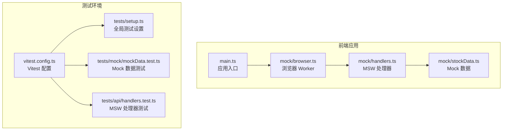
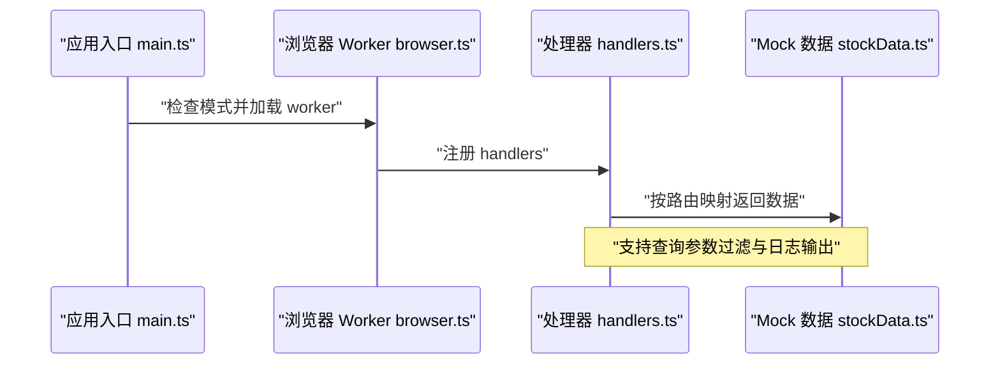
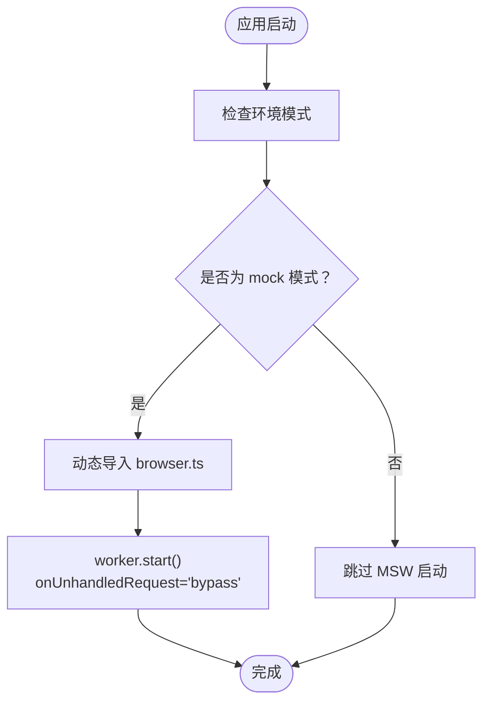
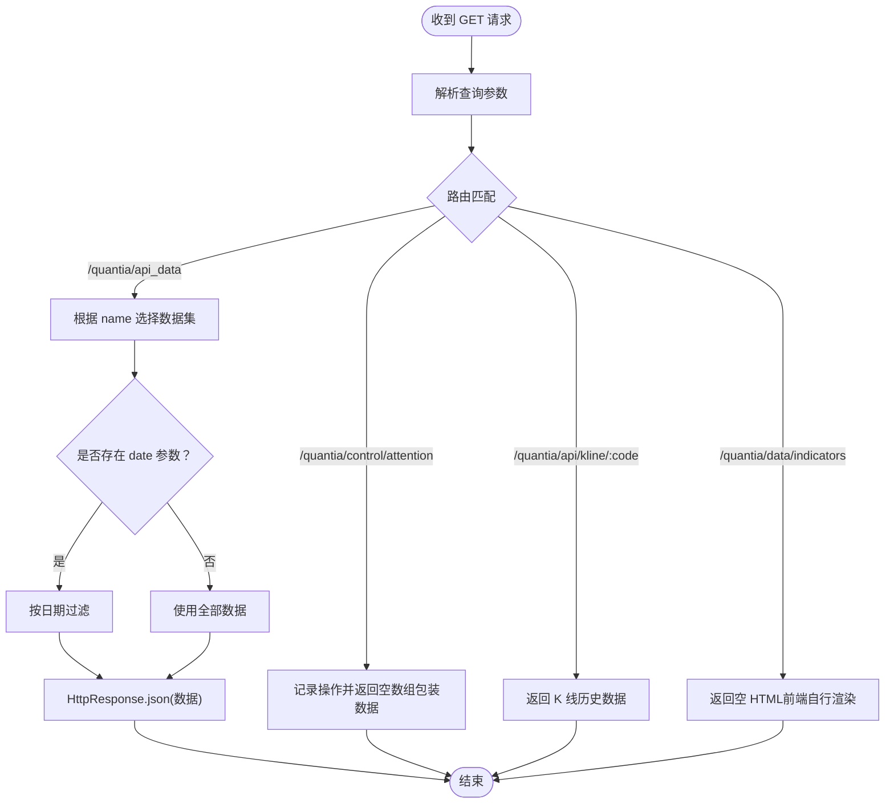
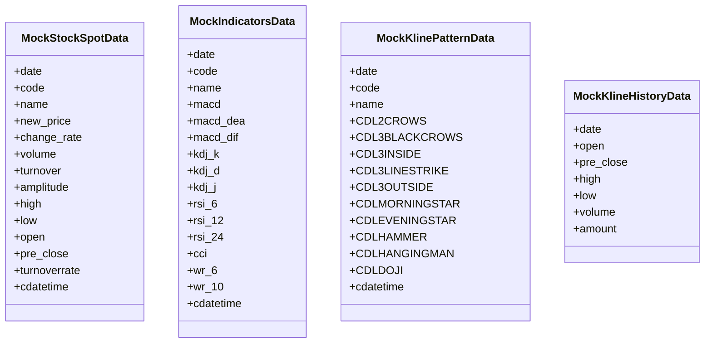
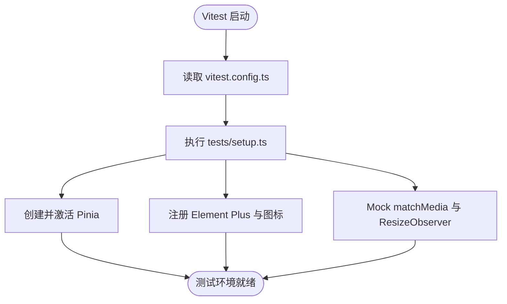
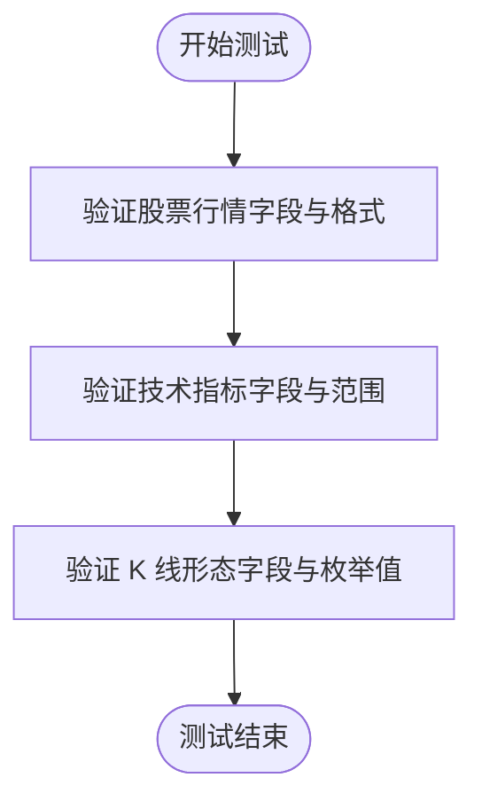
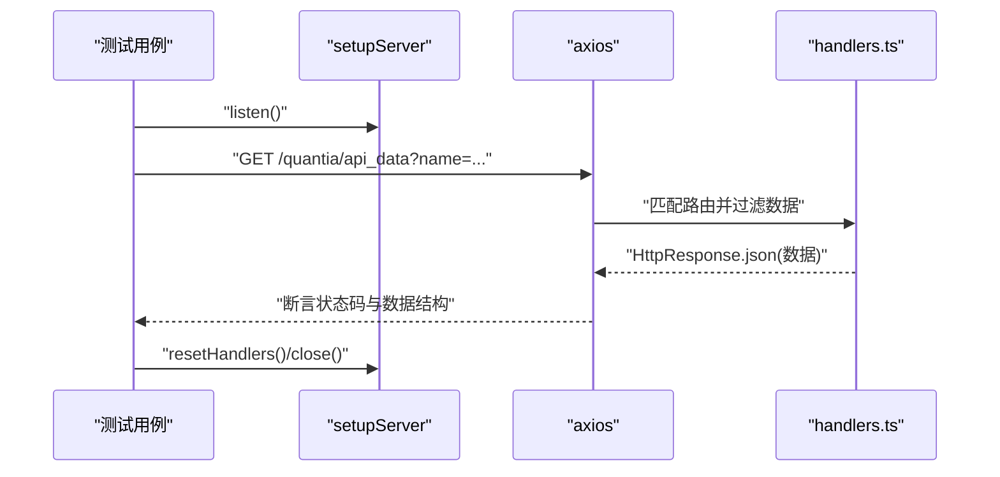
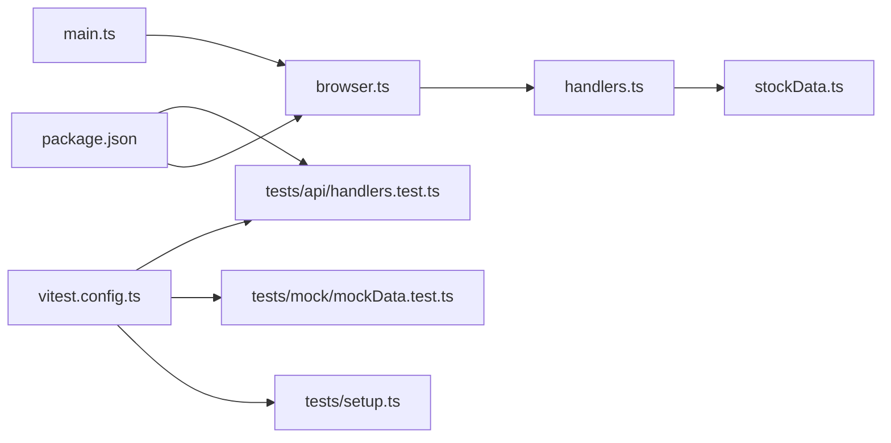

# Mock数据与测试

<cite>
**本文引用的文件**
- [docker/stock/quantia/fontWeb/src/mock/index.ts](file://docker/stock/quantia/fontWeb/src/mock/index.ts)
- [docker/stock/quantia/fontWeb/src/mock/browser.ts](file://docker/stock/quantia/fontWeb/src/mock/browser.ts)
- [docker/stock/quantia/fontWeb/src/mock/handlers.ts](file://docker/stock/quantia/fontWeb/src/mock/handlers.ts)
- [docker/stock/quantia/fontWeb/src/mock/stockData.ts](file://docker/stock/quantia/fontWeb/src/mock/stockData.ts)
- [docker/stock/quantia/fontWeb/src/main.ts](file://docker/stock/quantia/fontWeb/src/main.ts)
- [docker/stock/quantia/fontWeb/tests/setup.ts](file://docker/stock/quantia/fontWeb/tests/setup.ts)
- [docker/stock/quantia/fontWeb/tests/mock/mockData.test.ts](file://docker/stock/quantia/fontWeb/tests/mock/mockData.test.ts)
- [docker/stock/quantia/fontWeb/tests/api/handlers.test.ts](file://docker/stock/quantia/fontWeb/tests/api/handlers.test.ts)
- [docker/stock/quantia/fontWeb/vitest.config.ts](file://docker/stock/quantia/fontWeb/vitest.config.ts)
- [docker/stock/quantia/fontWeb/package.json](file://docker/stock/quantia/fontWeb/package.json)
</cite>

## 目录
1. [简介](#简介)
2. [项目结构](#项目结构)
3. [核心组件](#核心组件)
4. [架构总览](#架构总览)
5. [详细组件分析](#详细组件分析)
6. [依赖关系分析](#依赖关系分析)
7. [性能考量](#性能考量)
8. [故障排查指南](#故障排查指南)
9. [结论](#结论)
10. [附录](#附录)

## 简介
本文件聚焦于 Quantia 项目中基于 MSW（Mock Service Worker）的前端 Mock 数据与测试体系，系统性阐述以下主题：
- MSW 的配置与使用：浏览器 Worker 与 Node 环境下的服务端模拟
- Mock 数据生成：多类股票数据的结构化与规则约束
- API 模拟机制：路由映射、参数解析、响应构造
- 测试数据准备：单元测试策略与断言设计
- Mock 处理器编写：路由处理、参数过滤、日志输出
- 测试环境配置：Vitest、JS DOM、覆盖率与全局设置
- 组件测试、集成测试与端到端测试的实施方法
- 测试工具配置、测试覆盖率、持续集成与自动化测试流程
- 测试开发规范、Mock 数据管理与测试调试技巧

## 项目结构
前端测试与 Mock 相关的核心目录与文件如下：
- Mock 数据与处理器：src/mock
  - index.ts：导出 Mock 数据与处理器
  - browser.ts：浏览器端 MSW Worker 启动
  - handlers.ts：HTTP 路由与响应逻辑
  - stockData.ts：各类股票数据的 Mock 数组
- 应用入口：src/main.ts
  - 在 mock 模式下动态加载并启动 MSW
- 测试配置与脚本：vitest.config.ts、package.json
- 测试套件：tests
  - setup.ts：全局测试环境初始化
  - mock/mockData.test.ts：Mock 数据结构与范围校验
  - api/handlers.test.ts：MSW 处理器行为验证

**图表来源**
- [docker/stock/quantia/fontWeb/src/main.ts](file://docker/stock/quantia/fontWeb/src/main.ts#L12-L24)
- [docker/stock/quantia/fontWeb/src/mock/browser.ts](file://docker/stock/quantia/fontWeb/src/mock/browser.ts#L1-L6)
- [docker/stock/quantia/fontWeb/src/mock/handlers.ts](file://docker/stock/quantia/fontWeb/src/mock/handlers.ts#L1-L80)
- [docker/stock/quantia/fontWeb/src/mock/stockData.ts](file://docker/stock/quantia/fontWeb/src/mock/stockData.ts#L1-L470)
- [docker/stock/quantia/fontWeb/vitest.config.ts](file://docker/stock/quantia/fontWeb/vitest.config.ts#L1-L28)
- [docker/stock/quantia/fontWeb/tests/setup.ts](file://docker/stock/quantia/fontWeb/tests/setup.ts#L1-L41)
- [docker/stock/quantia/fontWeb/tests/mock/mockData.test.ts](file://docker/stock/quantia/fontWeb/tests/mock/mockData.test.ts#L1-L101)
- [docker/stock/quantia/fontWeb/tests/api/handlers.test.ts](file://docker/stock/quantia/fontWeb/tests/api/handlers.test.ts#L1-L87)

**章节来源**
- [docker/stock/quantia/fontWeb/src/mock/index.ts](file://docker/stock/quantia/fontWeb/src/mock/index.ts#L1-L3)
- [docker/stock/quantia/fontWeb/src/mock/browser.ts](file://docker/stock/quantia/fontWeb/src/mock/browser.ts#L1-L6)
- [docker/stock/quantia/fontWeb/src/mock/handlers.ts](file://docker/stock/quantia/fontWeb/src/mock/handlers.ts#L1-L80)
- [docker/stock/quantia/fontWeb/src/mock/stockData.ts](file://docker/stock/quantia/fontWeb/src/mock/stockData.ts#L1-L470)
- [docker/stock/quantia/fontWeb/src/main.ts](file://docker/stock/quantia/fontWeb/src/main.ts#L12-L24)
- [docker/stock/quantia/fontWeb/tests/setup.ts](file://docker/stock/quantia/fontWeb/tests/setup.ts#L1-L41)
- [docker/stock/quantia/fontWeb/tests/mock/mockData.test.ts](file://docker/stock/quantia/fontWeb/tests/mock/mockData.test.ts#L1-L101)
- [docker/stock/quantia/fontWeb/tests/api/handlers.test.ts](file://docker/stock/quantia/fontWeb/tests/api/handlers.test.ts#L1-L87)
- [docker/stock/quantia/fontWeb/vitest.config.ts](file://docker/stock/quantia/fontWeb/vitest.config.ts#L1-L28)
- [docker/stock/quantia/fontWeb/package.json](file://docker/stock/quantia/fontWeb/package.json#L1-L44)

## 核心组件
- MSW 浏览器 Worker：在 mock 模式下启动，拦截浏览器发起的网络请求并返回预设响应。
- MSW 处理器：定义路由到 Mock 数据的映射，支持查询参数解析与数据过滤。
- Mock 数据集：涵盖股票行情、技术指标、K 线形态、策略选股、龙虎榜、ETF、资金流向等。
- 测试环境：Vitest + JS DOM，全局注册 UI 组件与工具库，配置覆盖率与别名。

**章节来源**
- [docker/stock/quantia/fontWeb/src/mock/browser.ts](file://docker/stock/quantia/fontWeb/src/mock/browser.ts#L1-L6)
- [docker/stock/quantia/fontWeb/src/mock/handlers.ts](file://docker/stock/quantia/fontWeb/src/mock/handlers.ts#L1-L80)
- [docker/stock/quantia/fontWeb/src/mock/stockData.ts](file://docker/stock/quantia/fontWeb/src/mock/stockData.ts#L1-L470)
- [docker/stock/quantia/fontWeb/vitest.config.ts](file://docker/stock/quantia/fontWeb/vitest.config.ts#L7-L21)
- [docker/stock/quantia/fontWeb/tests/setup.ts](file://docker/stock/quantia/fontWeb/tests/setup.ts#L1-L41)

## 架构总览
MSW 在浏览器与 Node 两端协同工作：
- 浏览器端：通过 browser.ts 导入 worker 并启动，拦截前端请求。
- 服务端：通过 Vitest 中的 Node 环境模拟服务器，使用 setupServer 运行 handlers。
- 应用入口：仅在 mock 模式下启用 MSW，避免生产环境误触发。

**图表来源**
- [docker/stock/quantia/fontWeb/src/main.ts](file://docker/stock/quantia/fontWeb/src/main.ts#L12-L24)
- [docker/stock/quantia/fontWeb/src/mock/browser.ts](file://docker/stock/quantia/fontWeb/src/mock/browser.ts#L1-L6)
- [docker/stock/quantia/fontWeb/src/mock/handlers.ts](file://docker/stock/quantia/fontWeb/src/mock/handlers.ts#L17-L45)
- [docker/stock/quantia/fontWeb/src/mock/stockData.ts](file://docker/stock/quantia/fontWeb/src/mock/stockData.ts#L1-L470)

## 详细组件分析

### 组件一：MSW 浏览器 Worker（browser.ts）
- 功能：导入 MSW 的浏览器 worker，并以扩展模式启动，未匹配请求直接放行。
- 关键点：与应用入口的模式判断配合，仅在 mock 模式启用。

**图表来源**
- [docker/stock/quantia/fontWeb/src/main.ts](file://docker/stock/quantia/fontWeb/src/main.ts#L12-L24)
- [docker/stock/quantia/fontWeb/src/mock/browser.ts](file://docker/stock/quantia/fontWeb/src/mock/browser.ts#L1-L6)

**章节来源**
- [docker/stock/quantia/fontWeb/src/main.ts](file://docker/stock/quantia/fontWeb/src/main.ts#L12-L24)
- [docker/stock/quantia/fontWeb/src/mock/browser.ts](file://docker/stock/quantia/fontWeb/src/mock/browser.ts#L1-L6)

### 组件二：MSW 处理器（handlers.ts）
- 路由映射：将请求路径映射到对应的 Mock 数据数组。
- 参数解析：支持 name、date、code、otype 等查询参数。
- 过滤逻辑：根据日期参数对数据进行过滤。
- 响应构造：统一返回 JSON 或 HTML 响应。
- 日志输出：记录关注/取消关注与 K 线请求信息，便于调试。

**图表来源**
- [docker/stock/quantia/fontWeb/src/mock/handlers.ts](file://docker/stock/quantia/fontWeb/src/mock/handlers.ts#L17-L78)

**章节来源**
- [docker/stock/quantia/fontWeb/src/mock/handlers.ts](file://docker/stock/quantia/fontWeb/src/mock/handlers.ts#L1-L80)

### 组件三：Mock 数据（stockData.ts）
- 数据类型：股票行情、技术指标、买入/卖出信号、K 线形态、策略选股、龙虎榜、ETF、资金流向、K 线历史。
- 结构约束：字段完整性、数值范围（如涨跌幅、KDJ、RSI）、枚举值（形态值 -100/0/100）、日期一致性。
- 关注标记：cdatetime 字段用于标识“已关注”状态，便于 UI 与交互测试。

**图表来源**
- [docker/stock/quantia/fontWeb/src/mock/stockData.ts](file://docker/stock/quantia/fontWeb/src/mock/stockData.ts#L1-L470)

**章节来源**
- [docker/stock/quantia/fontWeb/src/mock/stockData.ts](file://docker/stock/quantia/fontWeb/src/mock/stockData.ts#L1-L470)

### 组件四：测试环境与配置（vitest.config.ts、tests/setup.ts）
- Vitest 配置：启用全局测试、JS DOM 环境、覆盖率报告、别名与 setup 文件。
- 全局设置：注册 Pinia、Element Plus 及其图标；Mock matchMedia 与 ResizeObserver，保证组件渲染与图表测试稳定。

**图表来源**
- [docker/stock/quantia/fontWeb/vitest.config.ts](file://docker/stock/quantia/fontWeb/vitest.config.ts#L7-L21)
- [docker/stock/quantia/fontWeb/tests/setup.ts](file://docker/stock/quantia/fontWeb/tests/setup.ts#L1-L41)

**章节来源**
- [docker/stock/quantia/fontWeb/vitest.config.ts](file://docker/stock/quantia/fontWeb/vitest.config.ts#L1-L28)
- [docker/stock/quantia/fontWeb/tests/setup.ts](file://docker/stock/quantia/fontWeb/tests/setup.ts#L1-L41)

### 组件五：单元测试（mockData.test.ts）
- 覆盖范围：股票行情、技术指标、K 线形态数据的字段完整性与数值范围校验。
- 断言策略：正则匹配股票代码格式、涨跌幅边界、KDJ/RSI 合法区间、形态值集合。

**图表来源**
- [docker/stock/quantia/fontWeb/tests/mock/mockData.test.ts](file://docker/stock/quantia/fontWeb/tests/mock/mockData.test.ts#L4-L101)

**章节来源**
- [docker/stock/quantia/fontWeb/tests/mock/mockData.test.ts](file://docker/stock/quantia/fontWeb/tests/mock/mockData.test.ts#L1-L101)

### 组件六：集成测试（handlers.test.ts）
- 使用 MSW Node 服务器：setupServer 拦截 axios 发起的请求。
- 路由覆盖：/quantia/api_data（多数据集）、/quantia/control/attention（关注/取消关注）、/quantia/api/kline/:code、/quantia/data/indicators。
- 行为验证：状态码、响应体类型、日期过滤结果、关注操作返回结构。

**图表来源**
- [docker/stock/quantia/fontWeb/tests/api/handlers.test.ts](file://docker/stock/quantia/fontWeb/tests/api/handlers.test.ts#L1-L87)
- [docker/stock/quantia/fontWeb/src/mock/handlers.ts](file://docker/stock/quantia/fontWeb/src/mock/handlers.ts#L32-L78)

**章节来源**
- [docker/stock/quantia/fontWeb/tests/api/handlers.test.ts](file://docker/stock/quantia/fontWeb/tests/api/handlers.test.ts#L1-L87)

## 依赖关系分析
- 应用入口依赖浏览器 Worker 与处理器模块。
- 处理器依赖 Mock 数据集。
- 测试依赖 Vitest、MSW Node 服务器与 axios。
- 包管理配置声明了 MSW 的 worker 目录与脚本命令。

**图表来源**
- [docker/stock/quantia/fontWeb/src/main.ts](file://docker/stock/quantia/fontWeb/src/main.ts#L12-L24)
- [docker/stock/quantia/fontWeb/src/mock/browser.ts](file://docker/stock/quantia/fontWeb/src/mock/browser.ts#L1-L6)
- [docker/stock/quantia/fontWeb/src/mock/handlers.ts](file://docker/stock/quantia/fontWeb/src/mock/handlers.ts#L1-L80)
- [docker/stock/quantia/fontWeb/src/mock/stockData.ts](file://docker/stock/quantia/fontWeb/src/mock/stockData.ts#L1-L470)
- [docker/stock/quantia/fontWeb/vitest.config.ts](file://docker/stock/quantia/fontWeb/vitest.config.ts#L1-L28)
- [docker/stock/quantia/fontWeb/tests/setup.ts](file://docker/stock/quantia/fontWeb/tests/setup.ts#L1-L41)
- [docker/stock/quantia/fontWeb/tests/mock/mockData.test.ts](file://docker/stock/quantia/fontWeb/tests/mock/mockData.test.ts#L1-L101)
- [docker/stock/quantia/fontWeb/tests/api/handlers.test.ts](file://docker/stock/quantia/fontWeb/tests/api/handlers.test.ts#L1-L87)
- [docker/stock/quantia/fontWeb/package.json](file://docker/stock/quantia/fontWeb/package.json#L1-L44)

**章节来源**
- [docker/stock/quantia/fontWeb/package.json](file://docker/stock/quantia/fontWeb/package.json#L1-L44)

## 性能考量
- Mock 数据规模：K 线历史数据采用动态生成，长度固定但计算开销低，适合频繁渲染场景。
- 路由过滤：按日期过滤在内存中进行，建议控制单次请求的数据量，避免大列表全量扫描。
- 覆盖率排除：Mock 目录被排除在覆盖率统计之外，减少噪声，聚焦业务代码质量。
- 浏览器 Worker：仅在 mock 模式启用，避免生产环境额外网络拦截成本。

## 故障排查指南
- 未命中 Mock：确认是否处于 mock 模式，检查浏览器 Worker 是否成功启动。
- 路由不匹配：核对请求路径与查询参数，确保 handlers.ts 中存在对应路由。
- 数据异常：检查 stockData.ts 中字段与取值范围，必要时增加边界断言。
- 测试失败：查看 Vitest 输出与日志，确认 setup.ts 中的全局依赖是否正确注册。
- 覆盖率缺失：确认 vitest.config.ts 的 include 与 exclude 规则，确保业务代码被纳入统计。

## 结论
本项目通过 MSW 实现了前后端解耦的 Mock 体系，结合完善的测试配置与断言策略，有效支撑了组件测试、集成测试与端到端测试的落地。建议在后续迭代中持续完善 Mock 数据的多样性与边界条件，强化跨模块集成测试，并将测试流程纳入 CI/CD 以保障质量稳定性。

## 附录
- 测试脚本与命令
  - 开发模式：npm 脚本 dev、dev:mock
  - 运行测试：npm 脚本 test、test:ui、test:coverage
- MSW 配置
  - workerDirectory：public
- Vitest 配置要点
  - environment: jsdom
  - globals: true
  - setupFiles: ./tests/setup.ts
  - include: src/**/*.{test,spec}.{js,ts,jsx,tsx}, tests/**/*.{test,spec}.{js,ts,jsx,tsx}
  - coverage: v8 报告，排除 node_modules 与 src/mock

**章节来源**
- [docker/stock/quantia/fontWeb/package.json](file://docker/stock/quantia/fontWeb/package.json#L6-L14)
- [docker/stock/quantia/fontWeb/vitest.config.ts](file://docker/stock/quantia/fontWeb/vitest.config.ts#L7-L21)
- [docker/stock/quantia/fontWeb/package.json](file://docker/stock/quantia/fontWeb/package.json#L39-L43)
