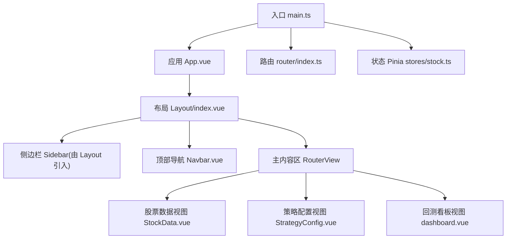
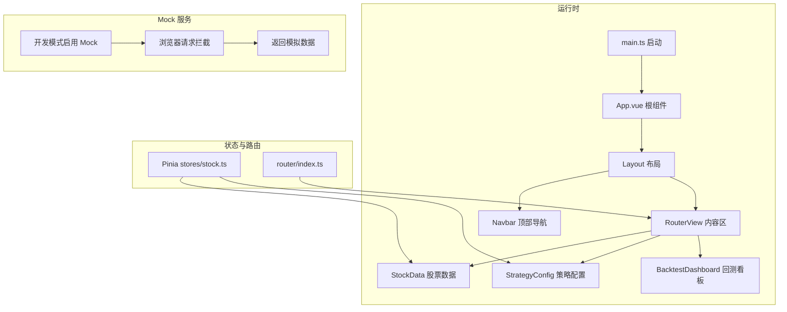
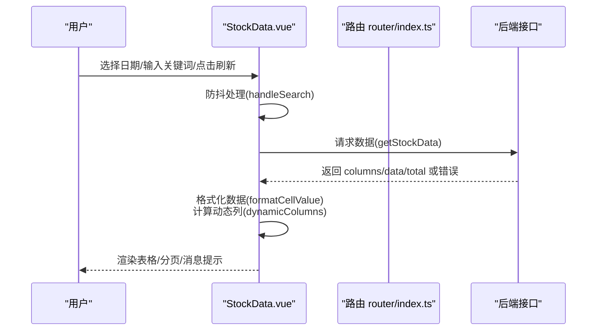
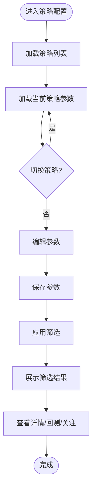
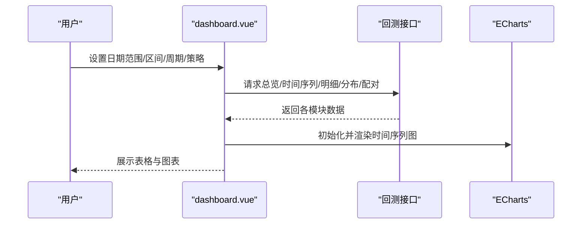
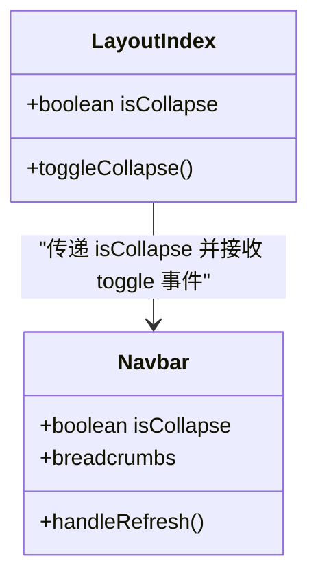
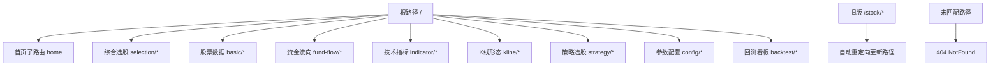
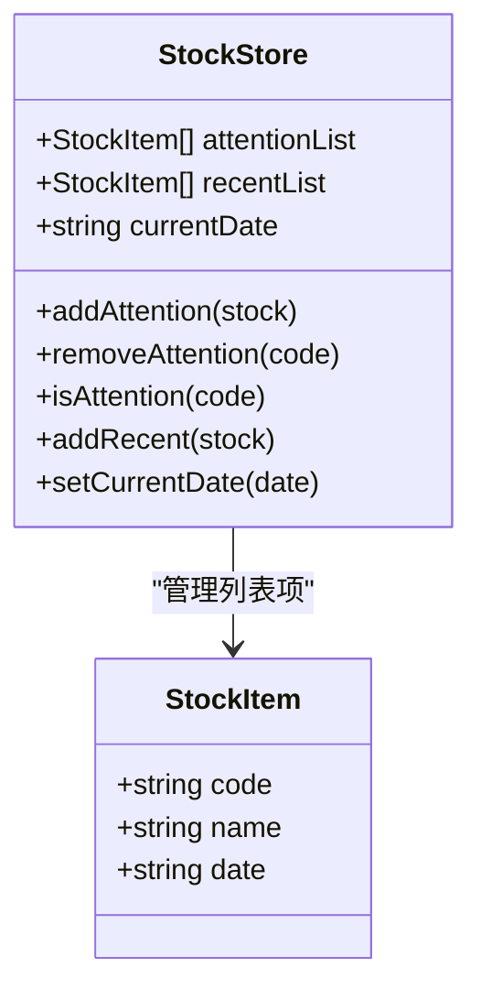
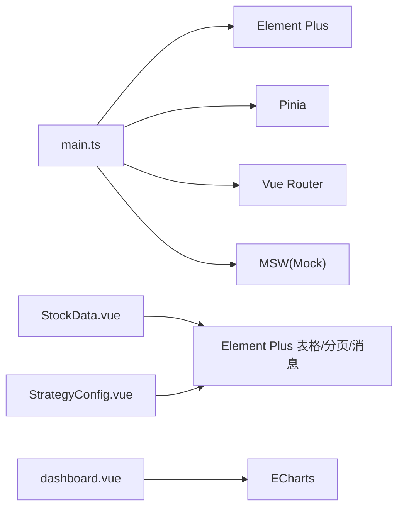

# Web可视化界面

<cite>
**本文档引用的文件**
- [main.ts](file://quantia/fontWeb/src/main.ts)
- [App.vue](file://quantia/fontWeb/src/App.vue)
- [router/index.ts](file://quantia/fontWeb/src/router/index.ts)
- [layout/index.vue](file://quantia/fontWeb/src/layout/index.vue)
- [layout/components/Navbar.vue](file://quantia/fontWeb/src/layout/components/Navbar.vue)
- [stores/stock.ts](file://quantia/fontWeb/src/stores/stock.ts)
- [views/stock/StockData.vue](file://quantia/fontWeb/src/views/stock/StockData.vue)
- [views/strategy/StrategyConfig.vue](file://quantia/fontWeb/src/views/strategy/StrategyConfig.vue)
- [views/backtest/dashboard.vue](file://quantia/fontWeb/src/views/backtest/dashboard.vue)
</cite>

## 目录
1. [简介](#简介)
2. [项目结构](#项目结构)
3. [核心组件](#核心组件)
4. [架构概览](#架构概览)
5. [详细组件分析](#详细组件分析)
6. [依赖分析](#依赖分析)
7. [性能考虑](#性能考虑)
8. [故障排查指南](#故障排查指南)
9. [结论](#结论)
10. [附录](#附录)

## 简介
本项目为 Quantia 的 Web 可视化界面，采用 Vue.js 3 + TypeScript + Element Plus 技术栈构建，结合 ECharts 实现数据可视化，提供股票数据浏览、策略参数配置与回测看板等功能。系统通过 Pinia 进行状态管理，基于路由驱动的页面组织方式，配合 Mock 服务提升开发效率。界面支持响应式布局与移动端适配，具备良好的可维护性与扩展性。

## 项目结构
前端代码位于 quantia/fontWeb/src 目录，主要由入口、布局、路由、状态管理、视图组件与 API 层组成。整体采用“按功能模块划分”的目录组织方式，便于团队协作与功能迭代。

**图表来源**
- [main.ts](file://quantia/fontWeb/src/main.ts#L1-L40)
- [App.vue](file://quantia/fontWeb/src/App.vue#L1-L19)
- [layout/index.vue](file://quantia/fontWeb/src/layout/index.vue#L1-L80)
- [layout/components/Navbar.vue](file://quantia/fontWeb/src/layout/components/Navbar.vue#L1-L110)
- [router/index.ts](file://quantia/fontWeb/src/router/index.ts#L1-L336)
- [stores/stock.ts](file://quantia/fontWeb/src/stores/stock.ts#L1-L70)
- [views/stock/StockData.vue](file://quantia/fontWeb/src/views/stock/StockData.vue#L1-L617)
- [views/strategy/StrategyConfig.vue](file://quantia/fontWeb/src/views/strategy/StrategyConfig.vue#L1-L697)
- [views/backtest/dashboard.vue](file://quantia/fontWeb/src/views/backtest/dashboard.vue#L1-L639)

**章节来源**
- [main.ts](file://quantia/fontWeb/src/main.ts#L1-L40)
- [router/index.ts](file://quantia/fontWeb/src/router/index.ts#L1-L336)

## 核心组件
- 应用入口与初始化：负责注册 Element Plus 组件、国际化、Pinia、路由以及在开发模式下启用 Mock 服务。
- 布局容器：提供侧边栏与顶部导航，支持菜单折叠与面包屑导航。
- 路由系统：集中定义页面级路由与权限元信息，包含多级菜单与重定向规则。
- 状态管理：使用 Pinia 管理关注列表、最近查看、当前日期等全局状态。
- 视图组件：
  - 股票数据视图：通用数据表格组件，支持动态列、搜索、分页、日期选择、关注/取消关注、回测跳转等。
  - 策略配置视图：参数面板与筛选结果展示，支持参数保存、重置、应用筛选与回测跳转。
  - 回测看板：集成多个维度的可视化图表与表格，支持日期范围、策略选择、收益周期等参数联动。

**章节来源**
- [main.ts](file://quantia/fontWeb/src/main.ts#L1-L40)
- [layout/index.vue](file://quantia/fontWeb/src/layout/index.vue#L1-L80)
- [layout/components/Navbar.vue](file://quantia/fontWeb/src/layout/components/Navbar.vue#L1-L110)
- [router/index.ts](file://quantia/fontWeb/src/router/index.ts#L1-L336)
- [stores/stock.ts](file://quantia/fontWeb/src/stores/stock.ts#L1-L70)
- [views/stock/StockData.vue](file://quantia/fontWeb/src/views/stock/StockData.vue#L1-L617)
- [views/strategy/StrategyConfig.vue](file://quantia/fontWeb/src/views/strategy/StrategyConfig.vue#L1-L697)
- [views/backtest/dashboard.vue](file://quantia/fontWeb/src/views/backtest/dashboard.vue#L1-L639)

## 架构概览
系统采用“入口 -> 布局 -> 视图”的三层结构，路由负责页面级导航，视图内部通过 API 层与后端交互，状态管理贯穿于各组件之间。Mock 服务在开发模式下拦截网络请求，提升开发效率与离线调试能力。

**图表来源**
- [main.ts](file://quantia/fontWeb/src/main.ts#L1-L40)
- [App.vue](file://quantia/fontWeb/src/App.vue#L1-L19)
- [layout/index.vue](file://quantia/fontWeb/src/layout/index.vue#L1-L80)
- [router/index.ts](file://quantia/fontWeb/src/router/index.ts#L1-L336)
- [stores/stock.ts](file://quantia/fontWeb/src/stores/stock.ts#L1-L70)
- [views/stock/StockData.vue](file://quantia/fontWeb/src/views/stock/StockData.vue#L1-L617)
- [views/strategy/StrategyConfig.vue](file://quantia/fontWeb/src/views/strategy/StrategyConfig.vue#L1-L697)
- [views/backtest/dashboard.vue](file://quantia/fontWeb/src/views/backtest/dashboard.vue#L1-L639)

## 详细组件分析

### 股票数据视图（StockData.vue）
该组件是数据展示的核心，具备以下特性：
- 动态列渲染：根据后端返回的列定义生成表格列，自动隐藏空值列，支持固定列与自适应宽度。
- 交互能力：日期选择、关键词搜索（带防抖）、分页、关注/取消关注、跳转到指标详情与回测看板。
- 数据格式化：针对不同字段类型进行亿/万、百分比、成交量等格式化处理；涨跌字段使用颜色标识。
- 错误处理：统一的消息提示与异常捕获，保障用户体验。

**图表来源**
- [views/stock/StockData.vue](file://quantia/fontWeb/src/views/stock/StockData.vue#L80-L124)
- [router/index.ts](file://quantia/fontWeb/src/router/index.ts#L1-L336)

**章节来源**
- [views/stock/StockData.vue](file://quantia/fontWeb/src/views/stock/StockData.vue#L1-L617)

### 策略配置视图（StrategyConfig.vue）
该组件提供策略参数配置与筛选结果展示：
- 策略选择：支持在多个策略间切换，自动加载对应参数组。
- 参数面板：支持数字滑块、输入框、密码框、下拉选择等多种控件，参数变更即时生效。
- 筛选执行：保存参数后可立即应用筛选，展示筛选结果与参数使用摘要。
- 结果交互：支持查看指标详情、进入自定义回测、关注/取消关注。

**图表来源**
- [views/strategy/StrategyConfig.vue](file://quantia/fontWeb/src/views/strategy/StrategyConfig.vue#L64-L180)

**章节来源**
- [views/strategy/StrategyConfig.vue](file://quantia/fontWeb/src/views/strategy/StrategyConfig.vue#L1-L697)

### 回测看板（dashboard.vue）
该组件整合多个维度的回测数据与可视化：
- 参数联动：支持日期范围、总览区间、排名指标、收益周期等参数，自动刷新各模块。
- 图表渲染：基于 ECharts 绘制时间序列折线图，支持自适应窗口大小。
- 多模块展示：策略总览、时间序列、策略明细、收益分布、交易配对等模块协同工作。

**图表来源**
- [views/backtest/dashboard.vue](file://quantia/fontWeb/src/views/backtest/dashboard.vue#L193-L302)
- [views/backtest/dashboard.vue](file://quantia/fontWeb/src/views/backtest/dashboard.vue#L224-L247)

**章节来源**
- [views/backtest/dashboard.vue](file://quantia/fontWeb/src/views/backtest/dashboard.vue#L1-L639)

### 布局与导航（Layout + Navbar）
- 布局容器：提供侧边栏与顶部导航，支持菜单折叠与过渡动画；主内容区使用 keep-alive 缓存组件，提升切换性能。
- 顶部导航：包含面包屑导航、刷新按钮与外部链接，帮助用户快速定位与回到首页。

**图表来源**
- [layout/index.vue](file://quantia/fontWeb/src/layout/index.vue#L1-L80)
- [layout/components/Navbar.vue](file://quantia/fontWeb/src/layout/components/Navbar.vue#L1-L110)

**章节来源**
- [layout/index.vue](file://quantia/fontWeb/src/layout/index.vue#L1-L80)
- [layout/components/Navbar.vue](file://quantia/fontWeb/src/layout/components/Navbar.vue#L1-L110)

### 路由配置（router/index.ts）
- 页面级路由：涵盖首页、综合选股、股票数据、资金流向、技术指标、K线形态、策略选股、参数配置、回测看板等模块。
- 元信息：每个路由包含标题、图标、表名、是否实时、是否隐藏等元信息，用于导航与页面渲染。
- 兼容与兜底：提供旧版路径重定向与 404 页面，保证 URL 兼容性与用户体验。

**图表来源**
- [router/index.ts](file://quantia/fontWeb/src/router/index.ts#L4-L327)

**章节来源**
- [router/index.ts](file://quantia/fontWeb/src/router/index.ts#L1-L336)

### 状态管理（stores/stock.ts）
- 关注列表：支持添加、移除、查询是否已关注。
- 最近查看：维护最近访问的股票列表，限制长度并去重。
- 当前日期：统一管理页面使用的日期，避免本地时间偏差。

**图表来源**
- [stores/stock.ts](file://quantia/fontWeb/src/stores/stock.ts#L4-L69)

**章节来源**
- [stores/stock.ts](file://quantia/fontWeb/src/stores/stock.ts#L1-L70)

## 依赖分析
- 运行时依赖：Vue 3、Element Plus、ECharts、Day.js、Pinia。
- 构建与测试：Vite、TypeScript、Vitest（测试框架）。
- Mock 服务：MSW（Mock Service Worker），在开发模式下启用，拦截浏览器请求并返回模拟数据。

**图表来源**
- [main.ts](file://quantia/fontWeb/src/main.ts#L1-L40)
- [views/stock/StockData.vue](file://quantia/fontWeb/src/views/stock/StockData.vue#L1-L617)
- [views/backtest/dashboard.vue](file://quantia/fontWeb/src/views/backtest/dashboard.vue#L1-L639)
- [views/strategy/StrategyConfig.vue](file://quantia/fontWeb/src/views/strategy/StrategyConfig.vue#L1-L697)

**章节来源**
- [main.ts](file://quantia/fontWeb/src/main.ts#L1-L40)

## 性能考虑
- 组件缓存：主内容区使用 keep-alive 缓存，减少重复渲染开销。
- 懒加载路由：页面组件采用动态导入，降低首屏体积。
- 防抖搜索：搜索输入使用防抖机制，避免频繁请求。
- ECharts 优化：图表初始化与销毁分离，窗口 resize 时仅触发图表尺寸调整。
- 状态最小化：Pinia 状态粒度合理，避免不必要的响应式更新。

[本节为通用指导，无需列出具体文件来源]

## 故障排查指南
- Mock 服务未生效：确认开发模式变量与浏览器脚本注入是否正确。
- 路由跳转异常：检查路由元信息与重定向规则，确保路径与命名一致。
- 表格数据为空：核对后端返回格式与列定义，确认日期回退逻辑是否触发。
- 图表不显示：检查 ECharts 容器尺寸与窗口 resize 事件绑定。
- 策略筛选无结果：适当放宽筛选条件或检查参数保存状态。

**章节来源**
- [main.ts](file://quantia/fontWeb/src/main.ts#L13-L24)
- [views/stock/StockData.vue](file://quantia/fontWeb/src/views/stock/StockData.vue#L114-L124)
- [views/backtest/dashboard.vue](file://quantia/fontWeb/src/views/backtest/dashboard.vue#L352-L362)
- [views/strategy/StrategyConfig.vue](file://quantia/fontWeb/src/views/strategy/StrategyConfig.vue#L130-L150)

## 结论
本项目通过清晰的目录结构、模块化的组件设计与完善的路由体系，实现了股票数据浏览、策略配置与回测看板的完整可视化功能。结合 Pinia 状态管理与 ECharts 图表渲染，系统具备良好的可维护性与扩展性。建议后续持续完善 Mock 数据与接口契约，补充单元测试覆盖，进一步提升开发效率与质量保障。

[本节为总结性内容，无需列出具体文件来源]

## 附录
- 开发指南
  - 使用 Vite 启动开发服务器，启用 MSW Mock 服务。
  - 通过路由元信息快速扩展新页面，遵循现有命名与图标规范。
  - 组件内统一使用 Element Plus 组件与样式，保持视觉一致性。
- 组件开发规范
  - 使用 Composition API 与 TypeScript，明确 props/emit 类型。
  - 对外暴露的交互行为通过方法封装，内部逻辑尽量纯函数化。
  - 图表组件独立封装，提供参数校验与生命周期管理。
- 性能优化技巧
  - 合理拆分组件，避免过度嵌套与重复渲染。
  - 使用虚拟滚动与分页处理大数据量表格。
  - 图表按需初始化，避免同时渲染多个重型图表。

[本节为通用指导，无需列出具体文件来源]
