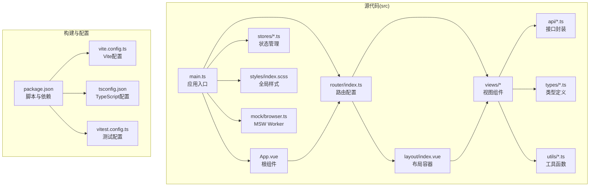
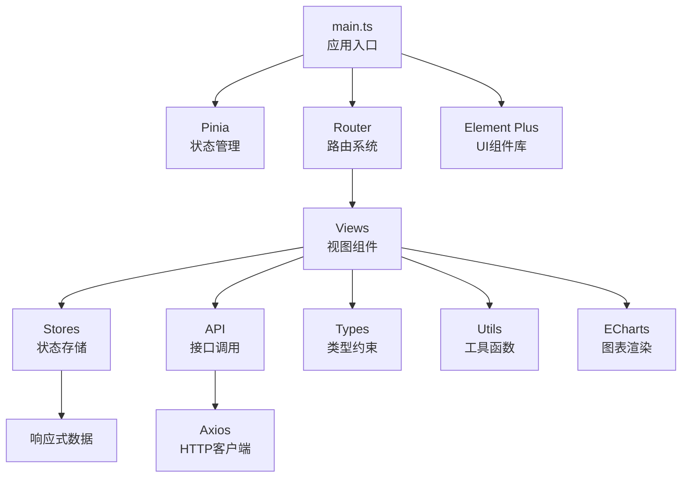
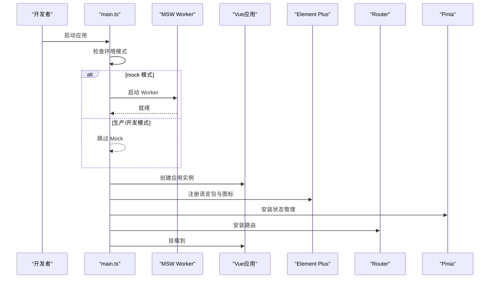
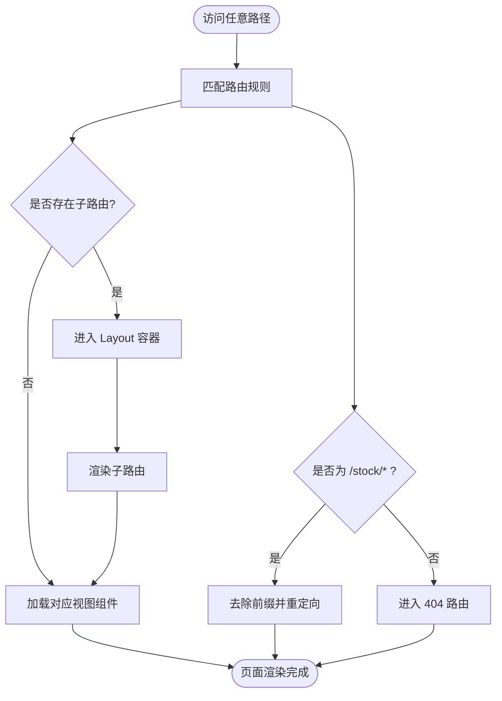
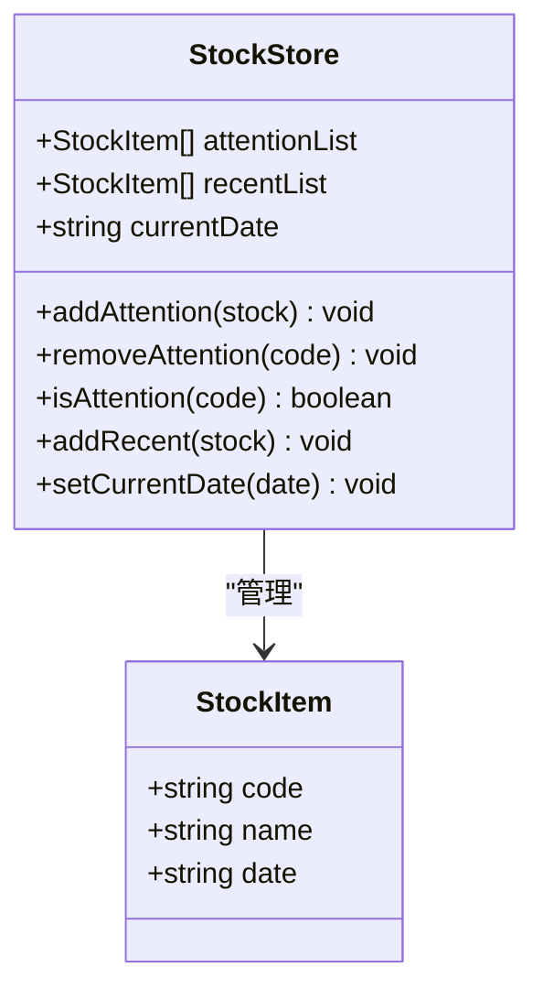
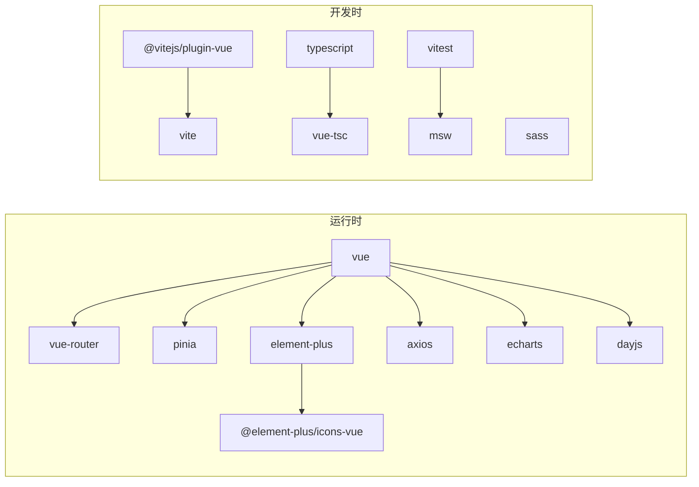

# 前端架构设计

<cite>
**本文引用的文件**
- [main.ts](file://docker/stock/quantia/fontWeb/src/main.ts)
- [App.vue](file://docker/stock/quantia/fontWeb/src/App.vue)
- [vite.config.ts](file://docker/stock/quantia/fontWeb/vite.config.ts)
- [package.json](file://docker/stock/quantia/fontWeb/package.json)
- [tsconfig.json](file://docker/stock/quantia/fontWeb/tsconfig.json)
- [tsconfig.node.json](file://docker/stock/quantia/fontWeb/tsconfig.node.json)
- [router/index.ts](file://docker/stock/quantia/fontWeb/src/router/index.ts)
- [stores/stock.ts](file://docker/stock/quantia/fontWeb/src/stores/stock.ts)
- [stores/index.ts](file://docker/stock/quantia/fontWeb/src/stores/index.ts)
- [styles/index.scss](file://docker/stock/quantia/fontWeb/src/styles/index.scss)
- [mock/browser.ts](file://docker/stock/quantia/fontWeb/src/mock/browser.ts)
- [views/stock/StockData.vue](file://docker/stock/quantia/fontWeb/src/views/stock/StockData.vue)
- [views/strategy/StrategyConfig.vue](file://docker/stock/quantia/fontWeb/src/views/strategy/StrategyConfig.vue)
- [views/backtest/dashboard.vue](file://docker/stock/quantia/fontWeb/src/views/backtest/dashboard.vue)
- [views/backtest/index.vue](file://docker/stock/quantia/fontWeb/src/views/backtest/index.vue)
- [layout/index.vue](file://docker/stock/quantia/fontWeb/src/layout/index.vue)
- [layout/components/Navbar.vue](file://docker/stock/quantia/fontWeb/src/layout/components/Navbar.vue)
- [layout/components/Sidebar.vue](file://docker/stock/quantia/fontWeb/src/layout/components/Sidebar.vue)
- [api/request.ts](file://docker/stock/quantia/fontWeb/src/api/request.ts)
- [api/stock.ts](file://docker/stock/quantia/fontWeb/src/api/stock.ts)
- [api/strategy.ts](file://docker/stock/quantia/fontWeb/src/api/strategy.ts)
- [types/index.ts](file://docker/stock/quantia/fontWeb/src/types/index.ts)
- [types/stock.ts](file://docker/stock/quantia/fontWeb/src/types/stock.ts)
- [utils/index.ts](file://docker/stock/quantia/fontWeb/src/utils/index.ts)
- [utils/backtestDashboardLinks.ts](file://docker/stock/quantia/fontWeb/src/utils/backtestDashboardLinks.ts)
- [vitest.config.ts](file://docker/stock/quantia/fontWeb/vitest.config.ts)
</cite>

## 目录
1. [简介](#简介)
2. [项目结构](#项目结构)
3. [核心组件](#核心组件)
4. [架构总览](#架构总览)
5. [详细组件分析](#详细组件分析)
6. [依赖关系分析](#依赖关系分析)
7. [性能考虑](#性能考虑)
8. [故障排除指南](#故障排除指南)
9. [结论](#结论)
10. [附录](#附录)

## 简介
本文件面向前端开发者，系统性阐述 Quantia 项目的前端架构设计，基于 Vue.js 3 + TypeScript + Element Plus 技术栈，结合 Vite 构建工具与 Pinia 状态管理，提供从项目初始化、依赖管理、构建配置到应用入口、插件注册、国际化与样式系统的完整说明。文档同时覆盖开发服务器、代理配置、热更新机制、模块化组织方式、TypeScript 配置策略，并给出开发环境搭建、工具推荐与调试技巧，帮助开发者高效完成系统界面开发。

## 项目结构
前端工程位于 docker/stock/quantia/fontWeb 目录，采用“按功能域分层 + 路由驱动”的模块化组织方式：
- 应用入口与根组件：src/main.ts、src/App.vue
- 路由与布局：src/router/index.ts、src/layout/
- 视图组件：src/views/（按业务模块划分）
- 状态管理：src/stores/（Pinia Store）
- 样式系统：src/styles/index.scss
- Mock 服务：src/mock/（MSW）
- API 层：src/api/
- 类型定义：src/types/
- 工具函数：src/utils/
- 构建与测试：vite.config.ts、tsconfig.json、vitest.config.ts、package.json

图表来源
- [main.ts](file://docker/stock/quantia/fontWeb/src/main.ts#L1-L40)
- [App.vue](file://docker/stock/quantia/fontWeb/src/App.vue#L1-L19)
- [router/index.ts](file://docker/stock/quantia/fontWeb/src/router/index.ts#L1-L336)
- [layout/index.vue](file://docker/stock/quantia/fontWeb/src/layout/index.vue)
- [stores/stock.ts](file://docker/stock/quantia/fontWeb/src/stores/stock.ts#L1-L70)
- [styles/index.scss](file://docker/stock/quantia/fontWeb/src/styles/index.scss#L1-L95)
- [mock/browser.ts](file://docker/stock/quantia/fontWeb/src/mock/browser.ts#L1-L6)
- [package.json](file://docker/stock/quantia/fontWeb/package.json#L1-L44)
- [vite.config.ts](file://docker/stock/quantia/fontWeb/vite.config.ts#L1-L32)
- [tsconfig.json](file://docker/stock/quantia/fontWeb/tsconfig.json#L1-L26)
- [vitest.config.ts](file://docker/stock/quantia/fontWeb/vitest.config.ts)

章节来源
- [main.ts](file://docker/stock/quantia/fontWeb/src/main.ts#L1-L40)
- [router/index.ts](file://docker/stock/quantia/fontWeb/src/router/index.ts#L1-L336)
- [package.json](file://docker/stock/quantia/fontWeb/package.json#L1-L44)

## 核心组件
- 应用入口与插件注册：在应用入口中完成 Pinia、Router、Element Plus 的注册，并按需启用 Mock 服务；同时注册 Element Plus 所有图标组件以简化模板使用。
- 国际化设置：通过 Element Plus 提供的 zh-cn 语言包实现界面本地化；根组件通过 ConfigProvider 统一注入语言配置。
- 样式系统：引入全局 SCSS 文件，定义滚动条、主题色变量与常用工具类，确保一致的视觉与交互体验。
- 路由体系：采用嵌套路由与动态导入，支持菜单标题、图标、表格名等元信息，便于统一渲染侧边栏与面包屑。
- 状态管理：使用 Pinia 定义股票关注、最近浏览、当前日期等状态，提供增删查改与边界控制逻辑。
- Mock 服务：在 mock 模式下启动 MSW Worker，拦截并模拟 API 请求，提升开发效率与离线可用性。

章节来源
- [main.ts](file://docker/stock/quantia/fontWeb/src/main.ts#L1-L40)
- [App.vue](file://docker/stock/quantia/fontWeb/src/App.vue#L1-L19)
- [router/index.ts](file://docker/stock/quantia/fontWeb/src/router/index.ts#L1-L336)
- [stores/stock.ts](file://docker/stock/quantia/fontWeb/src/stores/stock.ts#L1-L70)
- [styles/index.scss](file://docker/stock/quantia/fontWeb/src/styles/index.scss#L1-L95)
- [mock/browser.ts](file://docker/stock/quantia/fontWeb/src/mock/browser.ts#L1-L6)

## 架构总览
前端采用“入口 -> 插件注册 -> 路由 -> 视图 -> API -> 状态管理”的单向数据流，配合 Element Plus 组件库与 ECharts 图表库，形成可扩展的数据展示与交互界面。

图表来源
- [main.ts](file://docker/stock/quantia/fontWeb/src/main.ts#L1-L40)
- [router/index.ts](file://docker/stock/quantia/fontWeb/src/router/index.ts#L1-L336)
- [stores/stock.ts](file://docker/stock/quantia/fontWeb/src/stores/stock.ts#L1-L70)
- [api/request.ts](file://docker/stock/quantia/fontWeb/src/api/request.ts)
- [views/stock/StockData.vue](file://docker/stock/quantia/fontWeb/src/views/stock/StockData.vue)
- [views/strategy/StrategyConfig.vue](file://docker/stock/quantia/fontWeb/src/views/strategy/StrategyConfig.vue)
- [views/backtest/dashboard.vue](file://docker/stock/quantia/fontWeb/src/views/backtest/dashboard.vue)

## 详细组件分析

### 应用入口与插件注册
- 功能要点
  - 异步启用 Mock 服务：仅在 mock 模式下启动 MSW Worker，并对未处理请求进行旁路放行。
  - 注册 Element Plus 图标：遍历图标集合并全局注册，减少模板中重复引入。
  - 初始化插件：创建应用实例后依次挂载 Pinia、Router、Element Plus（含 zh-cn 语言）。
  - 挂载根节点：将应用挂载至 #app。
- 设计优势
  - 将 Mock 与生产环境解耦，提升开发灵活性。
  - 统一 UI 语言包，保证组件文案一致性。
  - 插件注册顺序明确，避免运行时错误。

图表来源
- [main.ts](file://docker/stock/quantia/fontWeb/src/main.ts#L13-L39)

章节来源
- [main.ts](file://docker/stock/quantia/fontWeb/src/main.ts#L1-L40)
- [mock/browser.ts](file://docker/stock/quantia/fontWeb/src/mock/browser.ts#L1-L6)

### 路由与布局系统
- 功能要点
  - 嵌套路由：Layout 作为父级容器，children 定义子路由，支持多级菜单。
  - 动态导入：视图组件按需加载，优化首屏性能。
  - 元信息：title、icon、tableName、isRealtime 等用于菜单渲染与页面行为控制。
  - 兼容旧路径：对 /stock/* 前缀进行自动重定向，保证历史链接可用。
  - 404 捕获：兜底路由放置于末位，统一处理未匹配路径。
- 设计优势
  - 路由即菜单，元信息驱动 UI 渲染，降低重复配置。
  - 动态导入与嵌套路由兼顾性能与可维护性。

图表来源
- [router/index.ts](file://docker/stock/quantia/fontWeb/src/router/index.ts#L304-L336)

章节来源
- [router/index.ts](file://docker/stock/quantia/fontWeb/src/router/index.ts#L1-L336)
- [layout/index.vue](file://docker/stock/quantia/fontWeb/src/layout/index.vue)

### 状态管理（Pinia）
- 功能要点
  - 数据模型：StockItem 接口定义股票基础字段。
  - 状态项：关注列表、最近浏览列表、当前日期。
  - 行为方法：添加关注、移除关注、检查关注、添加最近浏览、设置当前日期。
  - 边界控制：最近浏览列表长度限制，避免无限增长。
- 设计优势
  - 使用组合式 Store，API 简洁直观，易于单元测试。
  - 明确的状态边界与操作方法，降低副作用风险。

图表来源
- [stores/stock.ts](file://docker/stock/quantia/fontWeb/src/stores/stock.ts#L4-L69)

章节来源
- [stores/stock.ts](file://docker/stock/quantia/fontWeb/src/stores/stock.ts#L1-L70)
- [stores/index.ts](file://docker/stock/quantia/fontWeb/src/stores/index.ts#L1-L2)

### 样式系统与主题
- 功能要点
  - 全局重置与盒模型：统一 margin/padding 与 box-sizing。
  - 字体与高度：设置默认字体族与 html/body 高度。
  - 滚动条美化：自定义宽度、圆角与颜色。
  - 主题色变量：定义主色、成功、警告、危险、信息等变量。
  - 股价涨跌颜色：区分上涨与下跌文本颜色。
  - 工具类：flex 布局、对齐、间距等常用样式类。
- 设计优势
  - 通过 SCSS 变量集中管理主题，便于统一修改与扩展。
  - 工具类提升开发效率，减少重复样式编写。

章节来源
- [styles/index.scss](file://docker/stock/quantia/fontWeb/src/styles/index.scss#L1-L95)

### Mock 服务（MSW）
- 功能要点
  - Worker 配置：在浏览器环境中初始化 MSW Worker。
  - 处理器集合：集中定义请求拦截与响应模拟。
  - 环境模式：通过 Vite 模式切换 mock/dev/build。
- 设计优势
  - 在开发阶段隔离真实后端，提升联调效率与稳定性。
  - 未匹配请求旁路放行，避免阻断真实网络请求。

章节来源
- [mock/browser.ts](file://docker/stock/quantia/fontWeb/src/mock/browser.ts#L1-L6)
- [package.json](file://docker/stock/quantia/fontWeb/package.json#L39-L43)

### 视图组件与页面职责
- 股票数据页：StockData.vue 负责展示各类股票数据表格与筛选器，支持实时/非实时数据切换。
- 策略配置页：StrategyConfig.vue 负责策略参数与 AI 模型设置。
- 回测看板与自定义回测：dashboard.vue 与 index.vue 提供回测结果可视化与交互。
- 错误页：NotFound.vue 作为 404 页面统一展示。

章节来源
- [views/stock/StockData.vue](file://docker/stock/quantia/fontWeb/src/views/stock/StockData.vue)
- [views/strategy/StrategyConfig.vue](file://docker/stock/quantia/fontWeb/src/views/strategy/StrategyConfig.vue)
- [views/backtest/dashboard.vue](file://docker/stock/quantia/fontWeb/src/views/backtest/dashboard.vue)
- [views/backtest/index.vue](file://docker/stock/quantia/fontWeb/src/views/backtest/index.vue)

## 依赖关系分析
- 运行时依赖
  - Vue 3、Vue Router、Pinia：提供响应式与状态管理能力。
  - Element Plus、图标库：提供 UI 组件与图标资源。
  - Axios：封装 HTTP 请求。
  - ECharts、Day.js：图表与时间处理。
- 开发依赖
  - Vite、@vitejs/plugin-vue：快速构建与热更新。
  - TypeScript、vue-tsc：类型检查与编译。
  - Vitest、MSW：测试与 Mock。
  - Sass：SCSS 编译。
- 依赖关系图

图表来源
- [package.json](file://docker/stock/quantia/fontWeb/package.json#L15-L38)

章节来源
- [package.json](file://docker/stock/quantia/fontWeb/package.json#L1-L44)

## 性能考虑
- 代码分割与懒加载：路由级动态导入减少首屏体积。
- 组件级懒加载：视图组件按需加载，提升初始渲染速度。
- 样式按需：全局样式集中管理，避免重复定义。
- 构建优化：Vite 默认启用预构建与打包优化，建议在生产构建时开启压缩与资源内联策略。
- 状态管理：Pinia Store 使用组合式 API，减少样板代码与内存占用。

## 故障排除指南
- Mock 未生效
  - 确认当前运行模式为 mock（通过 dev:mock 脚本或环境变量）。
  - 检查 MSW Worker 是否成功启动，未匹配请求是否被旁路放行。
- 路由跳转异常
  - 检查路由元信息（title、icon、tableName）是否正确配置。
  - 确认 /stock/* 重定向逻辑是否符合预期。
- 国际化显示异常
  - 确认 Element Plus 语言包已正确注册，且根组件 ConfigProvider 已注入 zh-cn。
- 样式不生效
  - 检查 SCSS 变量与工具类是否正确引入，确认路径别名 @/* 配置有效。
- 构建失败
  - 确保 TypeScript 类型检查通过（vue-tsc），并检查 tsconfig.json 与 tsconfig.node.json 的配置一致性。

章节来源
- [main.ts](file://docker/stock/quantia/fontWeb/src/main.ts#L13-L39)
- [router/index.ts](file://docker/stock/quantia/fontWeb/src/router/index.ts#L304-L336)
- [App.vue](file://docker/stock/quantia/fontWeb/src/App.vue#L7-L9)
- [styles/index.scss](file://docker/stock/quantia/fontWeb/src/styles/index.scss#L1-L95)
- [tsconfig.json](file://docker/stock/quantia/fontWeb/tsconfig.json#L1-L26)

## 结论
该前端架构以 Vue 3 + TypeScript + Element Plus 为核心，结合 Vite 的高性能构建与开发体验，配合 Pinia 实现清晰的状态管理，通过路由与布局系统实现模块化组织，辅以 Mock 服务与全局样式体系，形成一套可扩展、易维护、开发友好的前端解决方案。开发者可在此基础上快速迭代界面功能，保障交付质量与开发效率。

## 附录

### 开发环境搭建指南
- 安装依赖
  - 使用包管理器安装项目依赖。
- 启动开发服务器
  - 普通开发：执行开发脚本。
  - Mock 模式：执行 mock 脚本以启用 MSW。
- 构建与预览
  - 生产构建：执行构建脚本生成 dist。
  - 预览：执行预览脚本在本地查看产物。
- 测试
  - 单元测试：执行测试脚本，支持 UI 与覆盖率报告。

章节来源
- [package.json](file://docker/stock/quantia/fontWeb/package.json#L6-L14)

### Vite 配置要点
- 插件与解析
  - 启用 Vue 插件与路径别名 @ 指向 src。
- 开发服务器
  - 端口：3000；代理：将 /api 与 /quantia 代理至后端地址，支持跨域。
- 构建输出
  - 输出目录：dist；静态资源目录：assets。

章节来源
- [vite.config.ts](file://docker/stock/quantia/fontWeb/vite.config.ts#L1-L32)

### TypeScript 配置策略
- 编译目标与模块解析
  - 目标 ES2020，模块解析使用 bundler，支持 TS 扩展与 JSON 模块。
- 路径映射
  - 通过 baseUrl 与 paths 配置 @/* 到 src/*，提升导入可读性。
- 严格模式
  - 启用严格模式与未使用检测，减少潜在问题。

章节来源
- [tsconfig.json](file://docker/stock/quantia/fontWeb/tsconfig.json#L1-L26)
- [tsconfig.node.json](file://docker/stock/quantia/fontWeb/tsconfig.node.json)

### 开发工具与调试技巧
- 推荐工具
  - VS Code（Vue/TypeScript 扩展）、浏览器开发者工具、MSW 控制台。
- 调试技巧
  - 使用 Vue DevTools 观察组件树与状态变化。
  - 在 Mock 模式下结合 MSW 控制台定位请求拦截问题。
  - 利用 Vitest 的 UI 模式与覆盖率报告优化测试质量。
