# 前端可视化系统升级

<cite>
**本文档引用的文件**
- [package.json](file://quantia/fontWeb/package.json)
- [main.ts](file://quantia/fontWeb/src/main.ts)
- [App.vue](file://quantia/fontWeb/src/App.vue)
- [vite.config.ts](file://quantia/fontWeb/vite.config.ts)
- [router/index.ts](file://quantia/fontWeb/src/router/index.ts)
- [layout/index.vue](file://quantia/fontWeb/src/layout/index.vue)
- [views/stock/StockData.vue](file://quantia/fontWeb/src/views/stock/StockData.vue)
- [stores/stock.ts](file://quantia/fontWeb/src/stores/stock.ts)
- [api/stock.ts](file://quantia/fontWeb/src/api/stock.ts)
- [mock/handlers.ts](file://quantia/fontWeb/src/mock/handlers.ts)
</cite>

## 目录
1. [项目概述](#项目概述)
2. [项目结构](#项目结构)
3. [核心组件](#核心组件)
4. [架构概览](#架构概览)
5. [详细组件分析](#详细组件分析)
6. [依赖关系分析](#依赖关系分析)
7. [性能考虑](#性能考虑)
8. [故障排除指南](#故障排除指南)
9. [结论](#结论)

## 项目概述

前端可视化系统是一个基于Vue 3的股票数据展示和分析平台，主要功能包括：

- **实时股票数据展示**：支持多种股票数据类型的实时查看和筛选
- **技术指标分析**：提供K线图和技术指标可视化
- **策略选股功能**：支持多种技术分析策略的选股结果展示
- **回测系统**：提供股票回测验证和分析功能
- **数据导出**：支持数据表格的导出功能

该系统采用现代化的前端技术栈，具备良好的用户体验和扩展性。

## 项目结构

前端项目采用模块化的组织方式，主要目录结构如下：

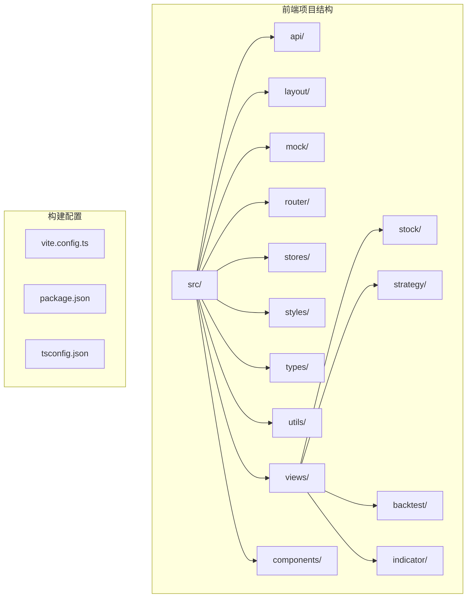

**图表来源**
- [main.ts](file://quantia/fontWeb/src/main.ts#L1-L40)
- [router/index.ts](file://quantia/fontWeb/src/router/index.ts#L1-L336)

**章节来源**
- [package.json](file://quantia/fontWeb/package.json#L1-L44)
- [vite.config.ts](file://quantia/fontWeb/vite.config.ts#L1-L32)

## 核心组件

### 应用入口组件

应用入口负责初始化Vue应用、注册全局组件和服务，以及配置国际化支持。

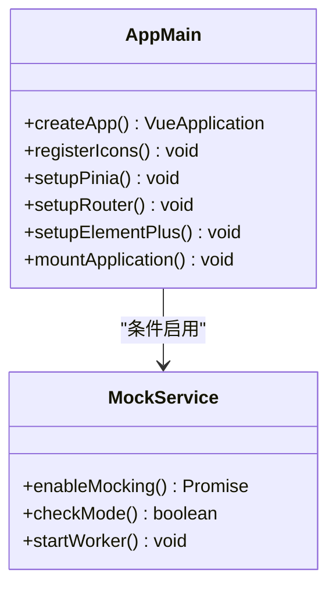

**图表来源**
- [main.ts](file://quantia/fontWeb/src/main.ts#L1-L40)

### 布局系统

采用Element Plus的容器布局，提供响应式的侧边栏和主内容区域。

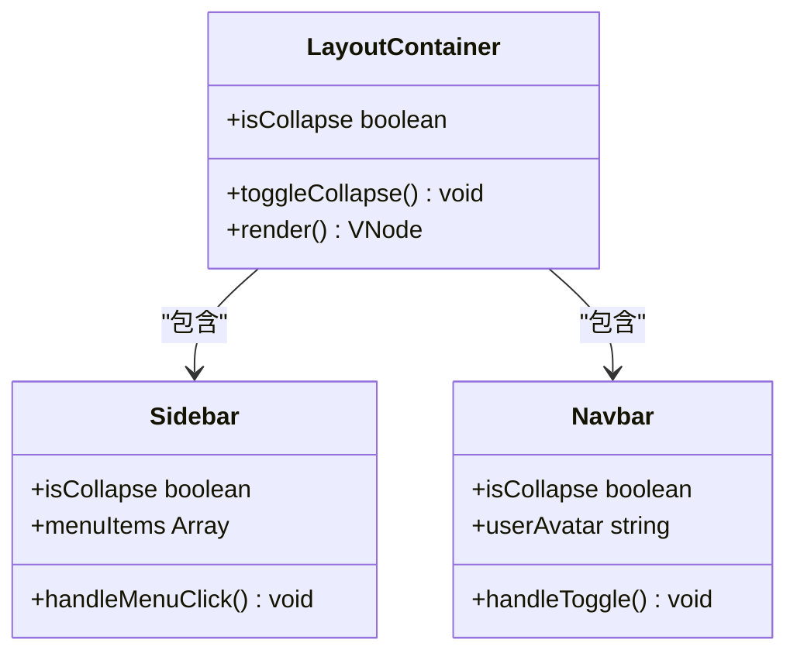

**图表来源**
- [layout/index.vue](file://quantia/fontWeb/src/layout/index.vue#L1-L80)

### 数据展示组件

StockData.vue是核心的数据展示组件，支持动态列生成、数据格式化和交互功能。

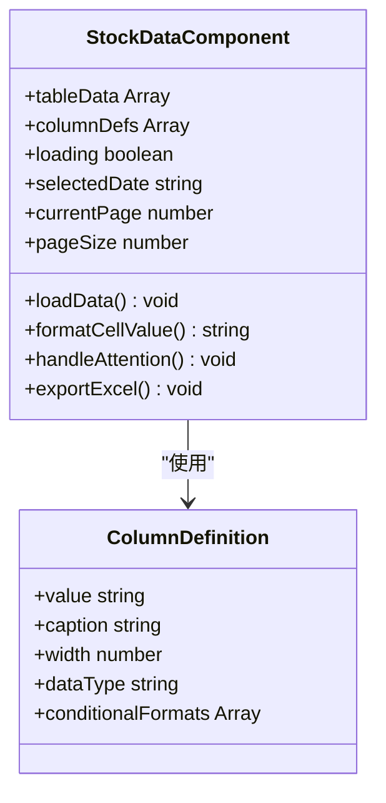

**图表来源**
- [views/stock/StockData.vue](file://quantia/fontWeb/src/views/stock/StockData.vue#L1-L617)

**章节来源**
- [App.vue](file://quantia/fontWeb/src/App.vue#L1-L19)
- [layout/index.vue](file://quantia/fontWeb/src/layout/index.vue#L1-L80)
- [views/stock/StockData.vue](file://quantia/fontWeb/src/views/stock/StockData.vue#L1-L617)

## 架构概览

系统采用前后端分离架构，前端通过API与后端进行数据交互。

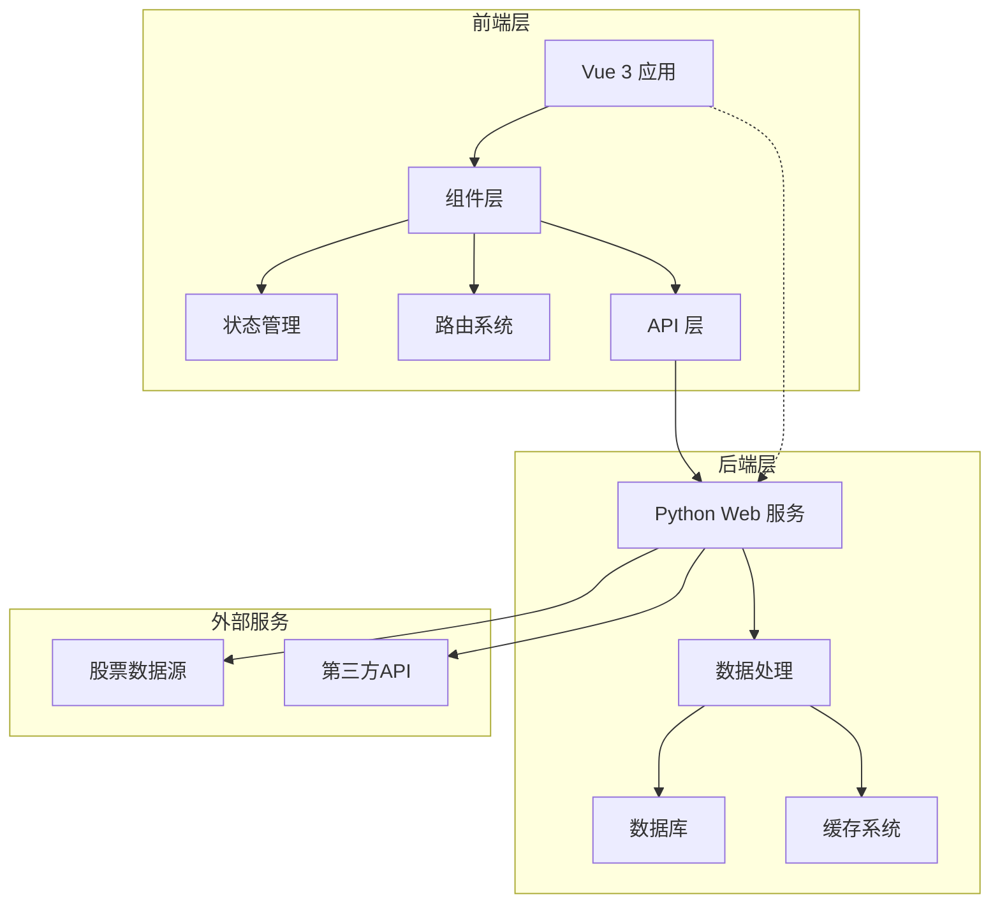

**图表来源**
- [main.ts](file://quantia/fontWeb/src/main.ts#L1-L40)
- [api/stock.ts](file://quantia/fontWeb/src/api/stock.ts#L1-L189)

### 数据流流程

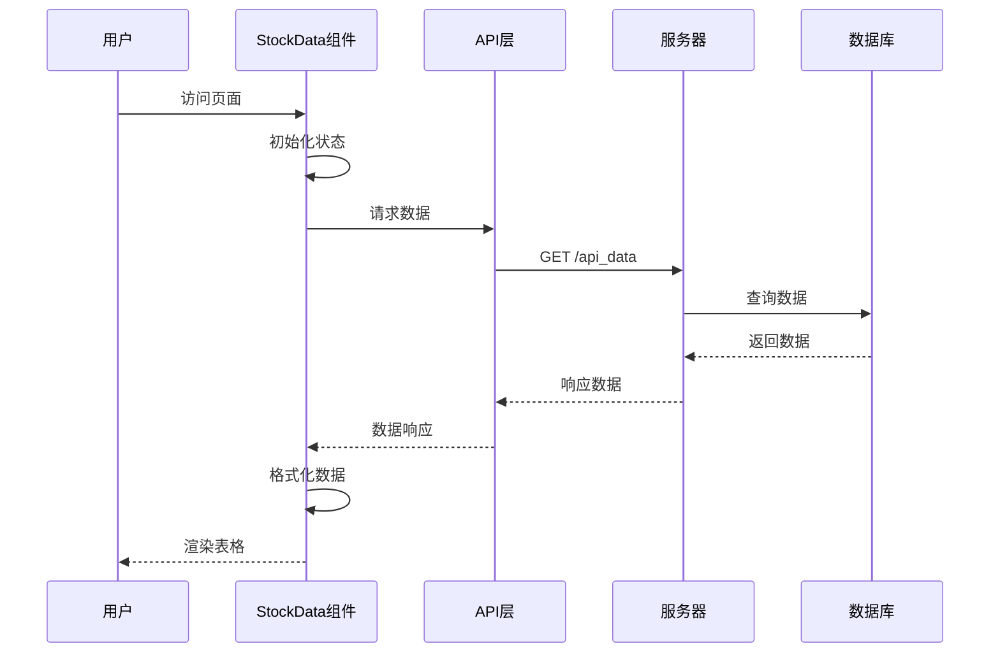

**图表来源**
- [views/stock/StockData.vue](file://quantia/fontWeb/src/views/stock/StockData.vue#L80-L124)
- [api/stock.ts](file://quantia/fontWeb/src/api/stock.ts#L26-L32)

## 详细组件分析

### 路由系统

系统采用Vue Router实现多级路由结构，支持嵌套路由和动态路由参数。

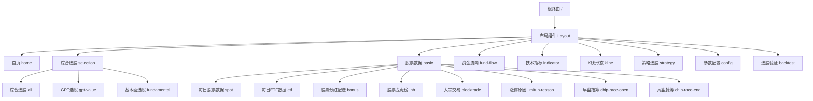

**图表来源**
- [router/index.ts](file://quantia/fontWeb/src/router/index.ts#L4-L328)

### 状态管理系统

使用Pinia作为状态管理解决方案，提供响应式的状态存储。

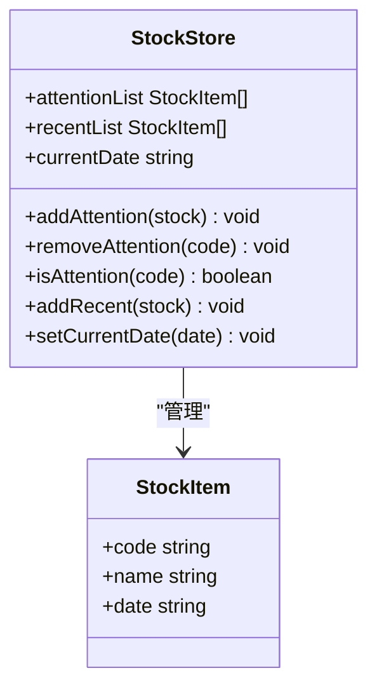

**图表来源**
- [stores/stock.ts](file://quantia/fontWeb/src/stores/stock.ts#L1-L70)

### API通信层

统一的API封装层，提供类型安全的HTTP请求方法。

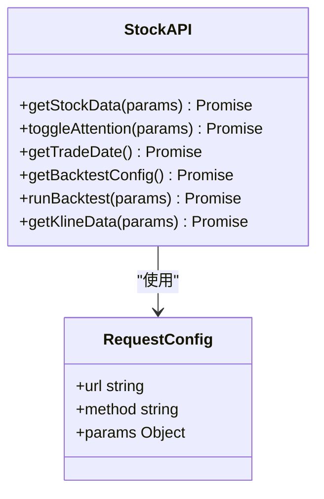

**图表来源**
- [api/stock.ts](file://quantia/fontWeb/src/api/stock.ts#L1-L189)

### Mock数据系统

开发环境下的数据模拟系统，支持多种数据类型的模拟。

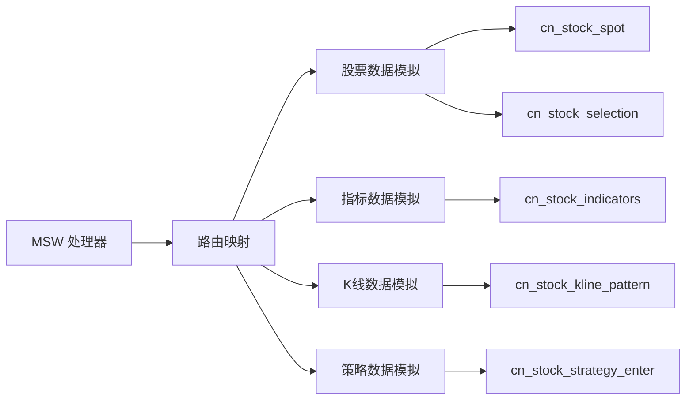

**图表来源**
- [mock/handlers.ts](file://quantia/fontWeb/src/mock/handlers.ts#L16-L80)

**章节来源**
- [router/index.ts](file://quantia/fontWeb/src/router/index.ts#L1-L336)
- [stores/stock.ts](file://quantia/fontWeb/src/stores/stock.ts#L1-L70)
- [api/stock.ts](file://quantia/fontWeb/src/api/stock.ts#L1-L189)
- [mock/handlers.ts](file://quantia/fontWeb/src/mock/handlers.ts#L1-L81)

## 依赖关系分析

### 技术栈依赖

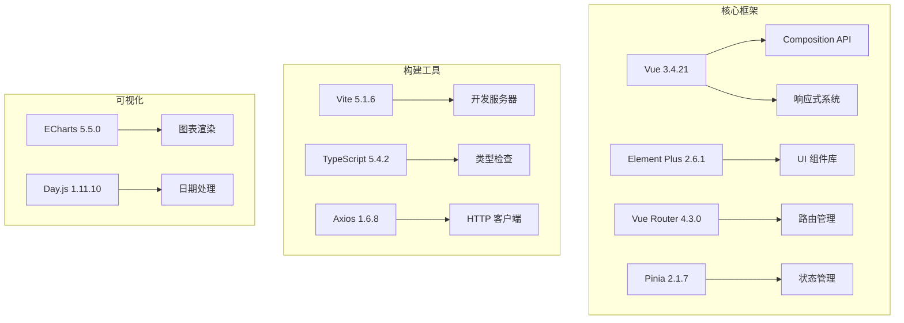

**图表来源**
- [package.json](file://quantia/fontWeb/package.json#L15-L38)

### 组件依赖关系

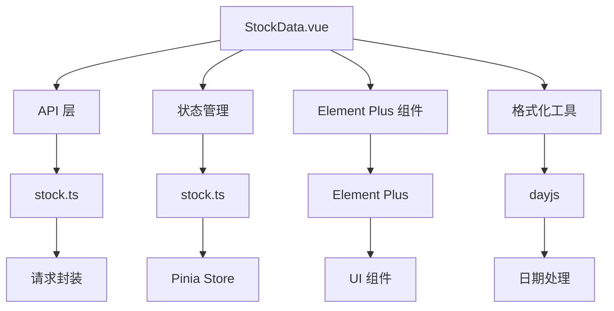

**图表来源**
- [views/stock/StockData.vue](file://quantia/fontWeb/src/views/stock/StockData.vue#L1-L617)
- [api/stock.ts](file://quantia/fontWeb/src/api/stock.ts#L1-L189)
- [stores/stock.ts](file://quantia/fontWeb/src/stores/stock.ts#L1-L70)

**章节来源**
- [package.json](file://quantia/fontWeb/package.json#L1-L44)

## 性能考虑

### 数据加载优化

系统实现了多项性能优化措施：

1. **虚拟滚动**：对于大量数据的表格，可以考虑实现虚拟滚动以提升渲染性能
2. **数据缓存**：利用浏览器缓存机制减少重复请求
3. **懒加载**：路由级别的代码分割，按需加载组件
4. **防抖处理**：搜索功能实现防抖，避免频繁请求

### 内存管理

- 使用`keep-alive`组件缓存页面状态
- 合理的组件销毁和事件清理
- 避免内存泄漏的监听器管理

### 网络优化

- 代理配置优化开发环境的网络请求
- 错误重试机制
- 空闲时间自动刷新策略

## 故障排除指南

### 常见问题及解决方案

#### 1. 数据加载失败

**症状**：页面显示加载错误或空白

**排查步骤**：
1. 检查网络连接和代理配置
2. 验证后端API是否正常运行
3. 查看浏览器开发者工具的网络面板

**解决方案**：
- 检查Vite配置中的代理设置
- 验证API端点的可用性
- 实现重试机制和错误边界

#### 2. 组件渲染异常

**症状**：表格列显示异常或数据格式错误

**排查步骤**：
1. 检查列定义数据结构
2. 验证数据格式化逻辑
3. 确认Element Plus版本兼容性

**解决方案**：
- 实现更健壮的数据验证
- 添加默认值处理
- 优化条件渲染逻辑

#### 3. Mock数据不生效

**症状**：开发环境下无法使用模拟数据

**排查步骤**：
1. 检查MSW worker是否正确启动
2. 验证路由映射配置
3. 确认请求URL格式

**解决方案**：
- 检查环境变量配置
- 验证Mock处理器的URL匹配
- 确保worker的生命周期管理

**章节来源**
- [views/stock/StockData.vue](file://quantia/fontWeb/src/views/stock/StockData.vue#L114-L124)
- [main.ts](file://quantia/fontWeb/src/main.ts#L13-L24)
- [mock/handlers.ts](file://quantia/fontWeb/src/mock/handlers.ts#L30-L80)

## 结论

前端可视化系统经过升级后，具备了以下特点：

### 技术优势
- **现代化技术栈**：Vue 3 Composition API + TypeScript + Vite
- **组件化设计**：清晰的组件层次和职责分离
- **状态管理**：Pinia提供简洁高效的状态管理
- **开发体验**：完善的Mock系统和热重载支持

### 功能特性
- **丰富的数据展示**：支持多种股票数据类型和可视化形式
- **灵活的配置**：可配置的列定义和数据格式化
- **用户友好**：直观的操作界面和交互反馈
- **扩展性强**：模块化的架构便于功能扩展

### 改进建议
1. **性能优化**：实现虚拟滚动和数据分页
2. **测试覆盖**：增加单元测试和集成测试
3. **监控告警**：添加应用性能监控
4. **文档完善**：补充API文档和开发指南

该系统为股票数据分析提供了强大的前端支撑，具备良好的可维护性和扩展性，能够满足复杂的金融数据可视化需求。
