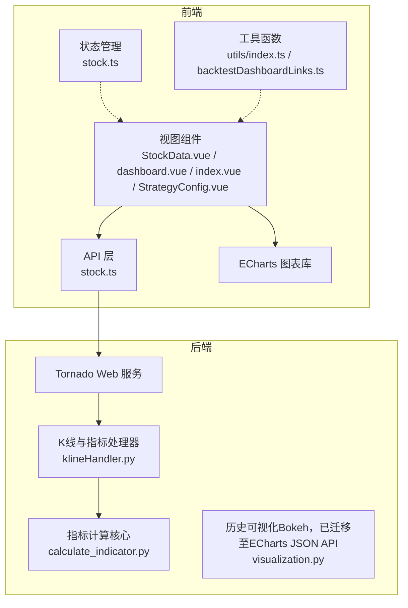
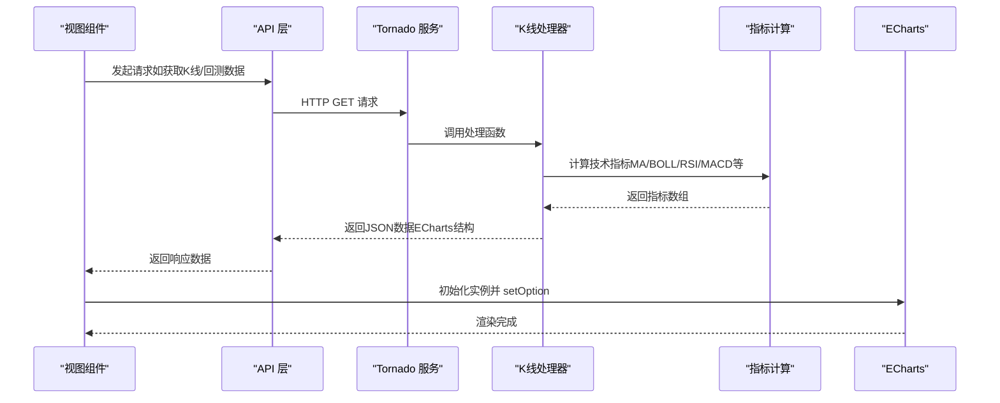
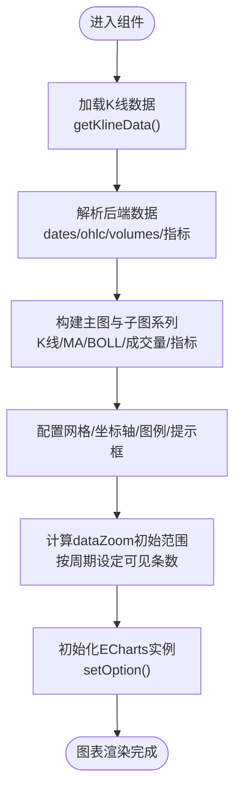
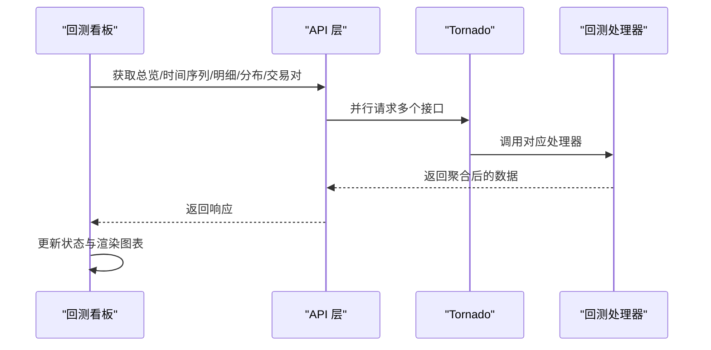
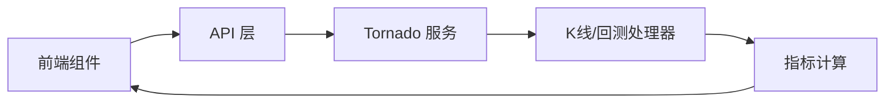

# 数据可视化

<cite>
**本文引用的文件**
- [StockData.vue](file://quantia/fontWeb/src/views/stock/StockData.vue)
- [dashboard.vue](file://quantia/fontWeb/src/views/backtest/dashboard.vue)
- [index.vue](file://quantia/fontWeb/src/views/indicator/index.vue)
- [StrategyConfig.vue](file://quantia/fontWeb/src/views/strategy/StrategyConfig.vue)
- [stock.ts](file://quantia/fontWeb/src/stores/stock.ts)
- [stock.ts](file://quantia/fontWeb/src/api/stock.ts)
- [index.ts](file://quantia/fontWeb/src/utils/index.ts)
- [backtestDashboardLinks.ts](file://quantia/fontWeb/src/utils/backtestDashboardLinks.ts)
- [klineHandler.py](file://docker/stock/quantia/web/klineHandler.py)
- [visualization.py](file://docker/stock/quantia/core/kline/visualization.py)
- [calculate_indicator.py](file://docker/stock/quantia/core/indicator/calculate_indicator.py)
- [index.html](file://docker/stock/quantia/web/static/index.html)
</cite>

## 目录
1. [简介](#简介)
2. [项目结构](#项目结构)
3. [核心组件](#核心组件)
4. [架构总览](#架构总览)
5. [详细组件分析](#详细组件分析)
6. [依赖分析](#依赖分析)
7. [性能考量](#性能考量)
8. [故障排查指南](#故障排查指南)
9. [结论](#结论)
10. [附录](#附录)

## 简介
本文件面向Quantia项目中的数据可视化模块，聚焦于ECharts图表库的集成与应用，系统性阐述K线图、技术指标图、回测收益图与策略对比图的实现原理、配置方法与交互设计。文档同时覆盖数据绑定机制、缩放控制、数据更新、动画效果、主题配置、响应式与移动端适配、性能优化以及开发最佳实践，帮助开发者快速构建高质量的股票数据可视化界面。

## 项目结构
前端采用Vue 3 + TypeScript + Element Plus + ECharts，后端提供Python Tornado接口，负责K线与技术指标的计算与返回。整体采用前后端分离架构，前端通过API层获取数据并渲染图表。

**图表来源**
- [stock.ts](file://quantia/fontWeb/src/api/stock.ts#L1-L189)
- [klineHandler.py](file://docker/stock/quantia/web/klineHandler.py#L212-L360)
- [calculate_indicator.py](file://docker/stock/quantia/core/indicator/calculate_indicator.py#L23-L407)
- [visualization.py](file://docker/stock/quantia/core/kline/visualization.py#L29-L275)

**章节来源**
- [index.html](file://docker/stock/quantia/web/static/index.html#L1-L15)

## 核心组件
- 股票数据表格组件：负责动态列生成、搜索过滤、分页与日期选择，支持关注/取消关注与回测跳转。
- 回测看板组件：多卡片布局，包含策略总览、时间序列、明细、收益分布与交易对，统一通过ECharts渲染收益曲线。
- K线与技术指标组件：单股票K线图，支持日/周/月/季/年周期切换、主图叠加（MA/BOLL）、底部子指标（MACD/KDJ/RSI/WR/BOLL）切换与dataZoom缩放。
- 策略参数配置组件：参数面板、筛选执行、结果表格与分页，支持关注与回测跳转。

**章节来源**
- [StockData.vue](file://quantia/fontWeb/src/views/stock/StockData.vue#L1-L617)
- [dashboard.vue](file://quantia/fontWeb/src/views/backtest/dashboard.vue#L1-L639)
- [index.vue](file://quantia/fontWeb/src/views/indicator/index.vue#L1-L510)
- [StrategyConfig.vue](file://quantia/fontWeb/src/views/strategy/StrategyConfig.vue#L1-L697)

## 架构总览
前端通过API层发起HTTP请求，后端Tornado路由到K线处理器，处理器读取历史数据并计算技术指标，返回ECharts所需的数据结构；前端初始化ECharts实例并设置option完成渲染。回测看板组件同样通过API获取多维度数据，分别渲染策略总览与时间序列收益曲线。

**图表来源**
- [stock.ts](file://quantia/fontWeb/src/api/stock.ts#L176-L189)
- [klineHandler.py](file://docker/stock/quantia/web/klineHandler.py#L212-L360)
- [calculate_indicator.py](file://docker/stock/quantia/core/indicator/calculate_indicator.py#L23-L407)

## 详细组件分析

### K线与技术指标图（index.vue）
- 数据结构与绑定
  - 后端返回字段包括日期数组、OHLC蜡烛数据、成交量与各技术指标序列，前端直接映射到series与axes。
  - 主图叠加：MA（5/10/20/60）与BOLL（上/中/下轨）可按需开启。
  - 子图指标：MACD（DIF/DEA/柱）、KDJ（K/D/J）、RSI（14）、WR（10/6）、BOLL（上/中/下）。
- 缩放与交互
  - dataZoom：内置缩放与滑块缩放联动，按周期预设可见条数，保证首次展示最近N根K线。
  - tooltip：交叉指针、背景色与边框样式，提升阅读体验。
  - legend：动态拼接主图与子图系列名称，支持点击隐藏。
- 主题与样式
  - 采用“涨红跌绿”颜色方案，均线与BOLL轨道使用统一色板，子图柱状采用正负颜色区分。
  - Y轴网格与分割区域交替显示，提升视觉层次。
- 响应式与移动端
  - 容器高度固定，配合dataZoom与legend紧凑布局，移动端可滚动查看完整图表。

**图表来源**
- [index.vue](file://quantia/fontWeb/src/views/indicator/index.vue#L108-L341)
- [stock.ts](file://quantia/fontWeb/src/api/stock.ts#L175-L189)
- [klineHandler.py](file://docker/stock/quantia/web/klineHandler.py#L212-L360)

**章节来源**
- [index.vue](file://quantia/fontWeb/src/views/indicator/index.vue#L1-L510)
- [stock.ts](file://quantia/fontWeb/src/api/stock.ts#L175-L189)
- [klineHandler.py](file://docker/stock/quantia/web/klineHandler.py#L212-L360)

### 回测收益图与策略对比（dashboard.vue）
- 数据获取与聚合
  - 总览：按指标天数聚合策略收益，形成策略列表与多周期均值。
  - 时间序列：按策略集合与持有周期聚合日度收益序列，形成多条折线。
  - 明细/分布/交易对：按策略与周期查询明细、收益分布与买卖配对。
- 图表实现
  - 时间序列收益图：折线图，平滑曲线、无符号点，legend位于上方，Y轴百分比格式。
  - dataZoom：支持按日期区间与天数切换，支持滚动缩放。
  - 交互：点击卡片定位、滚动聚焦、参数联动刷新。
- 参数与查询
  - 日期区间优先于天数参数；支持通过URL参数预设天数、周期与策略集合。

**图表来源**
- [dashboard.vue](file://quantia/fontWeb/src/views/backtest/dashboard.vue#L193-L318)
- [stock.ts](file://quantia/fontWeb/src/api/stock.ts#L111-L173)

**章节来源**
- [dashboard.vue](file://quantia/fontWeb/src/views/backtest/dashboard.vue#L1-L639)
- [backtestDashboardLinks.ts](file://quantia/fontWeb/src/utils/backtestDashboardLinks.ts#L1-L31)

### 股票数据表格（StockData.vue）
- 动态列与列宽
  - 根据后端返回的列定义动态生成表格，隐藏固定列与全空列，列宽自适应。
- 数据格式化
  - 大数单位（亿/万）、百分比、成交量（万手）、涨跌颜色类名等。
- 交互与导航
  - 关注/取消关注、跳转指标详情、跳转回测看板、分页与搜索防抖。
- 日期与实时性
  - 优先使用后端提供的交易日期，避免客户端日期偏差。

**章节来源**
- [StockData.vue](file://quantia/fontWeb/src/views/stock/StockData.vue#L1-L617)
- [index.ts](file://quantia/fontWeb/src/utils/index.ts#L1-L116)

### 策略参数配置（StrategyConfig.vue）
- 参数面板
  - 分组参数、滑块与输入框、选择器、密码输入等控件，支持数值精度与步长。
- 筛选执行
  - 保存参数后执行筛选，返回结果表格与分页，支持搜索关键词与日期选择。
- 关注与回测
  - 结果行支持关注与回测跳转。

**章节来源**
- [StrategyConfig.vue](file://quantia/fontWeb/src/views/strategy/StrategyConfig.vue#L1-L697)

## 依赖分析
- 前端依赖
  - Vue 3 Composition API、Element Plus UI、ECharts、Pinia状态管理、dayjs日期处理。
- 后端依赖
  - Tornado Web框架、NumPy/Pandas数据处理、TA-Lib技术指标库、数据库访问。
- 数据流
  - 前端组件通过API层调用后端接口，后端计算指标并返回ECharts友好的JSON结构。

**图表来源**
- [stock.ts](file://quantia/fontWeb/src/api/stock.ts#L1-L189)
- [klineHandler.py](file://docker/stock/quantia/web/klineHandler.py#L212-L360)
- [calculate_indicator.py](file://docker/stock/quantia/core/indicator/calculate_indicator.py#L23-L407)

**章节来源**
- [stock.ts](file://quantia/fontWeb/src/api/stock.ts#L1-L189)
- [klineHandler.py](file://docker/stock/quantia/web/klineHandler.py#L212-L360)
- [calculate_indicator.py](file://docker/stock/quantia/core/indicator/calculate_indicator.py#L23-L407)

## 性能考量
- 数据量与渲染
  - 后端返回全量历史数据，前端通过dataZoom进行视图裁剪，避免一次性渲染过多数据。
  - 关闭动画（animation: false）降低渲染开销，适合大量数据场景。
- 计算复杂度
  - 指标计算基于NumPy向量化与TA-Lib，时间复杂度线性于样本长度；建议限制默认返回天数。
- 交互与事件
  - resize监听与dispose释放实例，防止内存泄漏；滚动与缩放事件节流/防抖。
- 响应式与移动端
  - 固定容器高度与紧凑legend布局，减少重排；移动端建议使用触摸缩放与滑动查看。

[本节为通用指导，无需特定文件引用]

## 故障排查指南
- K线数据为空
  - 检查后端缓存是否命中与参数（code/date/period/days）是否正确；确认数据采集任务运行状态。
- 图表不显示或空白
  - 确认容器DOM已就绪后再初始化ECharts；检查setOption前是否已有实例并正确dispose。
- 缩放异常
  - dataZoom的start/end需基于总数据长度计算，注意周期切换时的可见条数阈值。
- 回测看板加载失败
  - 检查日期区间与天数参数合法性；确认并行请求是否全部成功返回。

**章节来源**
- [klineHandler.py](file://docker/stock/quantia/web/klineHandler.py#L237-L360)
- [dashboard.vue](file://quantia/fontWeb/src/views/backtest/dashboard.vue#L350-L362)
- [index.vue](file://quantia/fontWeb/src/views/indicator/index.vue#L360-L391)

## 结论
Quantia项目通过ECharts实现了从K线到回测收益的全链路可视化，结合后端高效指标计算与前端灵活交互，提供了良好的用户体验。遵循本文的配置方法、交互设计与性能优化建议，开发者可以快速扩展更多图表类型与业务场景。

[本节为总结性内容，无需特定文件引用]

## 附录

### 图表主题与样式配置要点
- 颜色体系：涨红跌绿、均线与BOLL轨道色板、子图正负色区分。
- 网格与坐标轴：主图与成交量分屏，子指标独立Y轴，紧凑布局。
- 提示框：交叉指针、背景与边框样式，提升可读性。
- 图例：动态拼接系列名称，支持点击隐藏。

**章节来源**
- [index.vue](file://quantia/fontWeb/src/views/indicator/index.vue#L94-L105)
- [index.vue](file://quantia/fontWeb/src/views/indicator/index.vue#L139-L187)
- [index.vue](file://quantia/fontWeb/src/views/indicator/index.vue#L310-L341)

### 响应式与移动端适配
- 容器高度固定，配合dataZoom与紧凑legend布局。
- 移动端建议使用触摸缩放与滑动查看，避免过小字体与密集图例。

**章节来源**
- [index.vue](file://quantia/fontWeb/src/views/indicator/index.vue#L490-L510)
- [dashboard.vue](file://quantia/fontWeb/src/views/backtest/dashboard.vue#L618-L621)

### 开发最佳实践
- 数据格式转换：后端统一返回ECharts友好结构（dates/ohlc/volumes/指标），前端直接映射。
- 实时数据更新：建议采用轮询或WebSocket推送，前端在setOption前dispose旧实例。
- 参数化配置：通过URL参数与组件状态联动，支持用户自定义天数、周期与策略集合。
- 错误处理：统一捕获API错误与图表渲染异常，提供用户提示与降级方案。

**章节来源**
- [stock.ts](file://quantia/fontWeb/src/api/stock.ts#L1-L189)
- [backtestDashboardLinks.ts](file://quantia/fontWeb/src/utils/backtestDashboardLinks.ts#L1-L31)
- [dashboard.vue](file://quantia/fontWeb/src/views/backtest/dashboard.vue#L304-L318)
