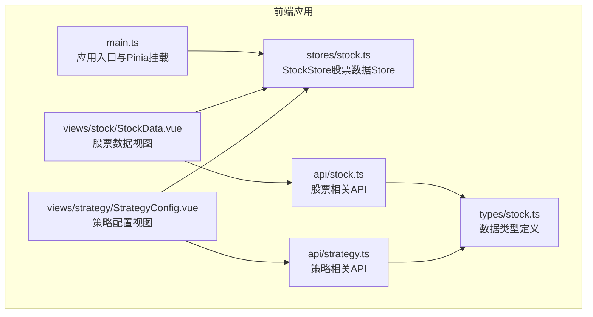
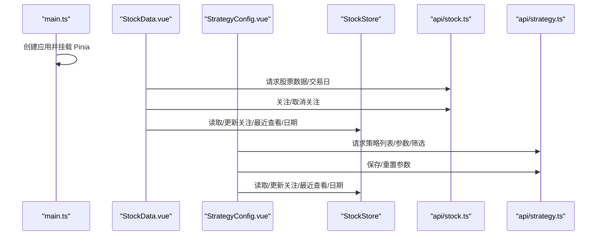
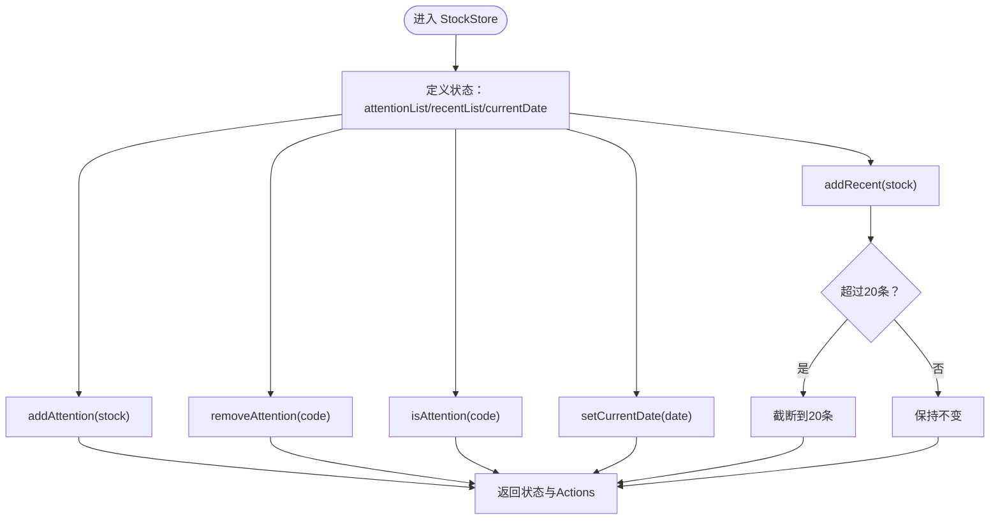
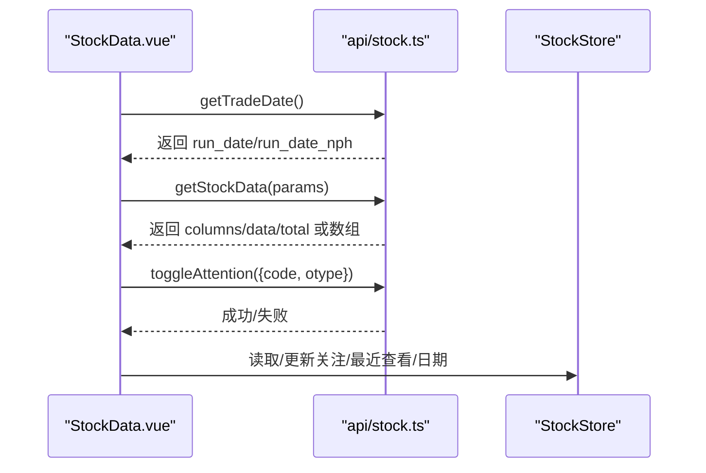
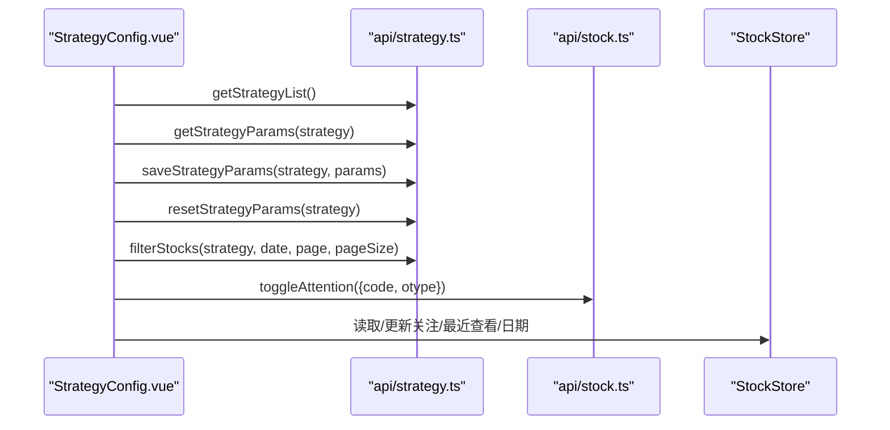
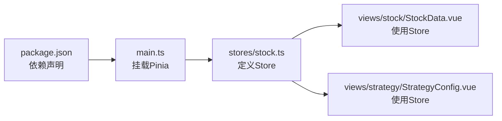

# 状态管理

<cite>
**本文引用的文件**
- [quantia/fontWeb/src/stores/stock.ts](file://quantia/fontWeb/src/stores/stock.ts)
- [quantia/fontWeb/src/main.ts](file://quantia/fontWeb/src/main.ts)
- [quantia/fontWeb/src/types/stock.ts](file://quantia/fontWeb/src/types/stock.ts)
- [quantia/fontWeb/src/views/stock/StockData.vue](file://quantia/fontWeb/src/views/stock/StockData.vue)
- [quantia/fontWeb/src/views/strategy/StrategyConfig.vue](file://quantia/fontWeb/src/views/strategy/StrategyConfig.vue)
- [quantia/fontWeb/src/api/stock.ts](file://quantia/fontWeb/src/api/stock.ts)
- [quantia/fontWeb/src/api/strategy.ts](file://quantia/fontWeb/src/api/strategy.ts)
- [quantia/fontWeb/package.json](file://quantia/fontWeb/package.json)
- [quantia/fontWeb/tests/stores/stock.test.ts](file://quantia/fontWeb/tests/stores/stock.test.ts)
</cite>

## 目录
1. [简介](#简介)
2. [项目结构](#项目结构)
3. [核心组件](#核心组件)
4. [架构总览](#架构总览)
5. [详细组件分析](#详细组件分析)
6. [依赖关系分析](#依赖关系分析)
7. [性能考量](#性能考量)
8. [故障排查指南](#故障排查指南)
9. [结论](#结论)
10. [附录](#附录)

## 简介
本文件系统性梳理 Quantia 前端（Vue + Pinia）的状态管理方案，聚焦于以下目标：
- 解释 Pinia 在本项目中的使用方式与 Store 设计模式
- 说明状态定义、Actions 方法、Getters 计算属性、状态订阅机制
- 展示模块化设计、跨组件状态共享、异步状态处理与状态调试工具
- 提供最佳实践、性能优化策略与数据流设计原则，帮助开发者高效管理应用状态

当前仓库中存在一个基础的股票数据 Store（stock），用于管理“关注列表”、“最近查看列表”和“当前日期”等状态；同时，页面组件通过 API 层与后端交互，完成数据加载、筛选与关注状态切换。

## 项目结构
本项目采用 Vue 3 + Vite + TypeScript 技术栈，状态管理由 Pinia 提供。核心状态位于 stores 目录，页面组件位于 views 目录，API 封装位于 api 目录，类型定义位于 types 目录。

图表来源
- [quantia/fontWeb/src/main.ts](file://quantia/fontWeb/src/main.ts#L1-L40)
- [quantia/fontWeb/src/stores/stock.ts](file://quantia/fontWeb/src/stores/stock.ts#L1-L70)
- [quantia/fontWeb/src/views/stock/StockData.vue](file://quantia/fontWeb/src/views/stock/StockData.vue#L1-L617)
- [quantia/fontWeb/src/views/strategy/StrategyConfig.vue](file://quantia/fontWeb/src/views/strategy/StrategyConfig.vue#L1-L697)
- [quantia/fontWeb/src/api/stock.ts](file://quantia/fontWeb/src/api/stock.ts#L1-L189)
- [quantia/fontWeb/src/api/strategy.ts](file://quantia/fontWeb/src/api/strategy.ts#L1-L93)
- [quantia/fontWeb/src/types/stock.ts](file://quantia/fontWeb/src/types/stock.ts#L1-L80)

章节来源
- [quantia/fontWeb/src/main.ts](file://quantia/fontWeb/src/main.ts#L1-L40)
- [quantia/fontWeb/package.json](file://quantia/fontWeb/package.json#L1-L44)

## 核心组件
- StockStore（股票数据 Store）
  - 状态：关注列表、最近查看列表、当前日期
  - Actions：添加关注、取消关注、判断是否已关注、添加最近查看、设置当前日期
  - 用途：在多个视图中共享用户关注与浏览行为，减少重复请求与跨组件通信成本
- 页面组件
  - 股票数据视图：负责加载数据、日期选择、搜索、分页、关注/取消关注、格式化展示
  - 策略配置视图：负责加载策略列表与参数、保存/重置参数、执行筛选、展示结果
- API 层
  - 股票相关：获取数据、获取交易日、关注/取消关注
  - 策略相关：获取策略列表、参数、保存/重置参数、按参数筛选股票
- 类型定义
  - 股票快照、指标、K线、形态、策略结果、回测结果等接口，保证前后端数据契约一致

章节来源
- [quantia/fontWeb/src/stores/stock.ts](file://quantia/fontWeb/src/stores/stock.ts#L1-L70)
- [quantia/fontWeb/src/views/stock/StockData.vue](file://quantia/fontWeb/src/views/stock/StockData.vue#L1-L617)
- [quantia/fontWeb/src/views/strategy/StrategyConfig.vue](file://quantia/fontWeb/src/views/strategy/StrategyConfig.vue#L1-L697)
- [quantia/fontWeb/src/api/stock.ts](file://quantia/fontWeb/src/api/stock.ts#L1-L189)
- [quantia/fontWeb/src/api/strategy.ts](file://quantia/fontWeb/src/api/strategy.ts#L1-L93)
- [quantia/fontWeb/src/types/stock.ts](file://quantia/fontWeb/src/types/stock.ts#L1-L80)

## 架构总览
下图展示了从前端入口到 Store、页面组件与 API 的整体调用链路与数据流向。

图表来源
- [quantia/fontWeb/src/main.ts](file://quantia/fontWeb/src/main.ts#L26-L39)
- [quantia/fontWeb/src/views/stock/StockData.vue](file://quantia/fontWeb/src/views/stock/StockData.vue#L80-L124)
- [quantia/fontWeb/src/views/strategy/StrategyConfig.vue](file://quantia/fontWeb/src/views/strategy/StrategyConfig.vue#L64-L87)
- [quantia/fontWeb/src/api/stock.ts](file://quantia/fontWeb/src/api/stock.ts#L26-L71)
- [quantia/fontWeb/src/api/strategy.ts](file://quantia/fontWeb/src/api/strategy.ts#L43-L92)
- [quantia/fontWeb/src/stores/stock.ts](file://quantia/fontWeb/src/stores/stock.ts#L10-L69)

## 详细组件分析

### StockStore 组件分析
- 设计模式
  - 使用组合式 Store（defineStore 返回一个 setup 函数风格的 Store），内部通过 ref 定义响应式状态，通过返回对象暴露状态与 Actions
  - 无 Getters 计算属性示例，若需派生状态可在 Store 内部以 computed 或基于 ref 的逻辑扩展
- 状态定义
  - 关注列表：StockItem[]
  - 最近查看列表：StockItem[]（最多 20 条）
  - 当前日期：string
- Actions 方法
  - addAttention：去重插入至关注列表头部
  - removeAttention：按 code 删除关注项
  - isAttention：判断是否已关注
  - addRecent：重复查看则移动至顶部，超出上限自动截断
  - setCurrentDate：设置当前日期
- 订阅机制
  - 页面组件通过 useStockStore() 获取实例，在组件生命周期内读取/更新状态，实现跨组件共享
- 测试覆盖
  - 单元测试覆盖关注、最近查看、当前日期等关键行为

图表来源
- [quantia/fontWeb/src/stores/stock.ts](file://quantia/fontWeb/src/stores/stock.ts#L10-L69)

章节来源
- [quantia/fontWeb/src/stores/stock.ts](file://quantia/fontWeb/src/stores/stock.ts#L1-L70)
- [quantia/fontWeb/tests/stores/stock.test.ts](file://quantia/fontWeb/tests/stores/stock.test.ts#L1-L95)

### 股票数据视图（StockData.vue）分析
- 数据加载流程
  - 初始化时获取交易日，避免使用客户端本地日期导致不一致
  - 支持日期选择、关键词搜索（防抖）、分页加载
  - 后端返回 columns/data/total，或兼容旧数组格式
- 关注/取消关注
  - 调用 toggleAttention API，成功后更新行内 cdatetime 字段，触发 UI 高亮
- 格式化与展示
  - 根据列定义的 dataType 与字段名进行数值/百分比/金额/成交量等格式化
  - 支持动态列过滤与最小宽度自适应
- 异步处理
  - 使用 loading/分页/错误消息统一处理异步状态

图表来源
- [quantia/fontWeb/src/views/stock/StockData.vue](file://quantia/fontWeb/src/views/stock/StockData.vue#L80-L124)
- [quantia/fontWeb/src/api/stock.ts](file://quantia/fontWeb/src/api/stock.ts#L26-L71)
- [quantia/fontWeb/src/stores/stock.ts](file://quantia/fontWeb/src/stores/stock.ts#L10-L69)

章节来源
- [quantia/fontWeb/src/views/stock/StockData.vue](file://quantia/fontWeb/src/views/stock/StockData.vue#L1-L617)
- [quantia/fontWeb/src/api/stock.ts](file://quantia/fontWeb/src/api/stock.ts#L1-L189)
- [quantia/fontWeb/src/stores/stock.ts](file://quantia/fontWeb/src/stores/stock.ts#L1-L70)

### 策略配置视图（StrategyConfig.vue）分析
- 策略参数管理
  - 加载策略列表与参数组，支持数字/文本/密码/选择等控件
  - 保存参数与重置默认值，均通过 API 完成
- 筛选执行
  - 先保存当前参数，再调用筛选接口，支持日期选择与分页
  - 展示筛选结果与参数使用摘要
- 关注/取消关注
  - 与股票数据视图一致，调用同一 API 更新关注状态
- 异步处理
  - loading/saving/filtering 控制各阶段 UI 状态

图表来源
- [quantia/fontWeb/src/views/strategy/StrategyConfig.vue](file://quantia/fontWeb/src/views/strategy/StrategyConfig.vue#L64-L180)
- [quantia/fontWeb/src/api/strategy.ts](file://quantia/fontWeb/src/api/strategy.ts#L43-L92)
- [quantia/fontWeb/src/api/stock.ts](file://quantia/fontWeb/src/api/stock.ts#L52-L58)
- [quantia/fontWeb/src/stores/stock.ts](file://quantia/fontWeb/src/stores/stock.ts#L10-L69)

章节来源
- [quantia/fontWeb/src/views/strategy/StrategyConfig.vue](file://quantia/fontWeb/src/views/strategy/StrategyConfig.vue#L1-L697)
- [quantia/fontWeb/src/api/strategy.ts](file://quantia/fontWeb/src/api/strategy.ts#L1-L93)
- [quantia/fontWeb/src/api/stock.ts](file://quantia/fontWeb/src/api/stock.ts#L1-L189)
- [quantia/fontWeb/src/stores/stock.ts](file://quantia/fontWeb/src/stores/stock.ts#L1-L70)

### API 层与类型定义
- API 层
  - 股票：getStockData、toggleAttention、getTradeDate、回测与 K 线相关接口
  - 策略：getStrategyList、getStrategyParams、saveStrategyParams、resetStrategyParams、filterStocks
- 类型定义
  - StockSpot、StockIndicator、KlineData、KlinePattern、StrategyResult、BacktestResult 等接口，确保前后端字段一致性

章节来源
- [quantia/fontWeb/src/api/stock.ts](file://quantia/fontWeb/src/api/stock.ts#L1-L189)
- [quantia/fontWeb/src/api/strategy.ts](file://quantia/fontWeb/src/api/strategy.ts#L1-L93)
- [quantia/fontWeb/src/types/stock.ts](file://quantia/fontWeb/src/types/stock.ts#L1-L80)

## 依赖关系分析
- Pinia 版本与依赖
  - package.json 显示 pinia 依赖版本，配合 Vue 3 使用
- 入口挂载
  - main.ts 中 createPinia() 被 app.use() 注入，全局可用
- 组件使用
  - 页面组件通过 useStockStore() 获取 Store 实例，实现跨组件状态共享

图表来源
- [quantia/fontWeb/package.json](file://quantia/fontWeb/package.json#L15-L24)
- [quantia/fontWeb/src/main.ts](file://quantia/fontWeb/src/main.ts#L34-L34)
- [quantia/fontWeb/src/stores/stock.ts](file://quantia/fontWeb/src/stores/stock.ts#L10-L69)
- [quantia/fontWeb/src/views/stock/StockData.vue](file://quantia/fontWeb/src/views/stock/StockData.vue#L1-L617)
- [quantia/fontWeb/src/views/strategy/StrategyConfig.vue](file://quantia/fontWeb/src/views/strategy/StrategyConfig.vue#L1-L697)

章节来源
- [quantia/fontWeb/package.json](file://quantia/fontWeb/package.json#L1-L44)
- [quantia/fontWeb/src/main.ts](file://quantia/fontWeb/src/main.ts#L1-L40)

## 性能考量
- 状态粒度与更新范围
  - 将关注/最近查看/日期等用户行为状态集中在一个 Store，避免分散在多个组件中造成重复请求与状态不同步
- 列表上限控制
  - 最近查看列表限制为 20 条，避免内存膨胀与渲染压力
- 防抖与节流
  - 视图层对搜索与日期变更使用防抖，降低请求频率
- 分页与懒加载
  - 数据表格支持分页，结合后端分页接口，避免一次性加载大量数据
- 格式化开销
  - 对大数值/百分比/金额进行统一格式化，建议在组件内缓存列定义与格式规则，减少重复计算

## 故障排查指南
- 状态未更新或未生效
  - 确认组件中使用了正确的 Store 实例（useStockStore），并在响应式上下文中访问状态
  - 检查 Actions 是否被正确调用（例如 addAttention/removeAttention/isAttention/addRecent/setCurrentDate）
- 数据加载异常
  - 检查 API 返回格式（columns/data/total 或数组），视图层已兼容旧格式
  - 关注错误消息提示与 loading 状态，定位网络或权限问题
- 关注状态不同步
  - 确保调用 toggleAttention 后更新行内 cdatetime 字段，触发 UI 高亮
- 测试验证
  - 使用现有测试用例验证关注、最近查看、当前日期等行为是否符合预期

章节来源
- [quantia/fontWeb/tests/stores/stock.test.ts](file://quantia/fontWeb/tests/stores/stock.test.ts#L1-L95)
- [quantia/fontWeb/src/views/stock/StockData.vue](file://quantia/fontWeb/src/views/stock/StockData.vue#L160-L178)
- [quantia/fontWeb/src/views/strategy/StrategyConfig.vue](file://quantia/fontWeb/src/views/strategy/StrategyConfig.vue#L215-L233)

## 结论
本项目采用 Pinia 组合式 Store 管理用户关注与浏览行为等轻量状态，结合页面组件的异步数据加载与格式化逻辑，实现了清晰、可维护的状态管理方案。建议后续扩展：
- 在 StockStore 中增加必要的 Getters 计算属性，提升派生状态的可读性
- 对高频格式化逻辑进行缓存与优化
- 引入状态持久化（如 localStorage 或浏览器存储）以增强用户体验
- 完善状态调试工具（如 Vue DevTools）的使用与监控

## 附录
- 状态管理最佳实践
  - 将用户行为状态集中在单一 Store，避免跨组件分散
  - 使用 Actions 封装副作用，保持状态更新的可追踪性
  - 通过类型定义约束前后端数据契约，减少联调成本
- 性能优化策略
  - 列表上限控制、防抖/节流、分页与懒加载
  - 组件内缓存格式化规则与列定义，减少重复计算
- 数据流设计原则
  - 单向数据流：视图发起请求 -> API 返回 -> 更新 Store -> 组件响应
  - 统一错误处理与加载状态，提升用户体验
