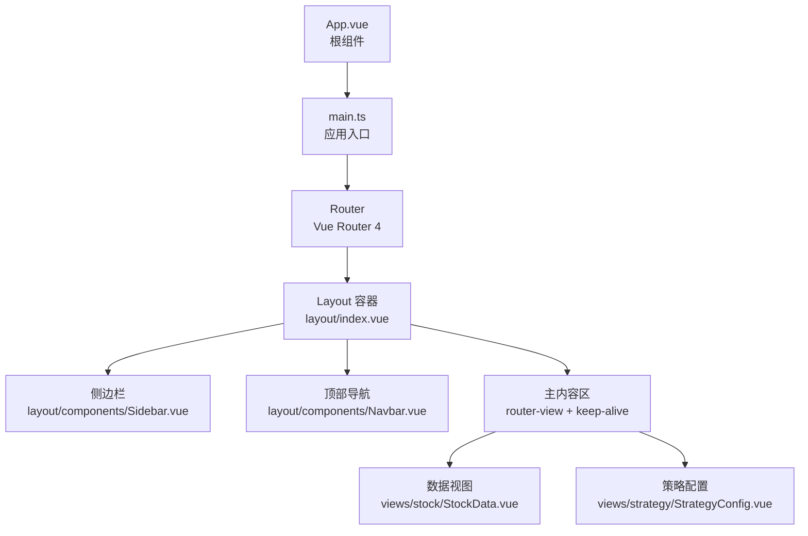
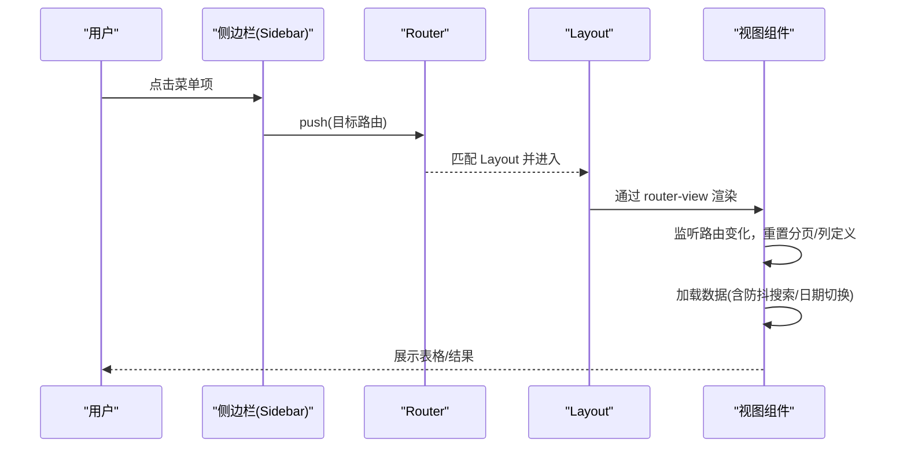
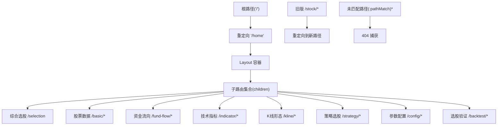
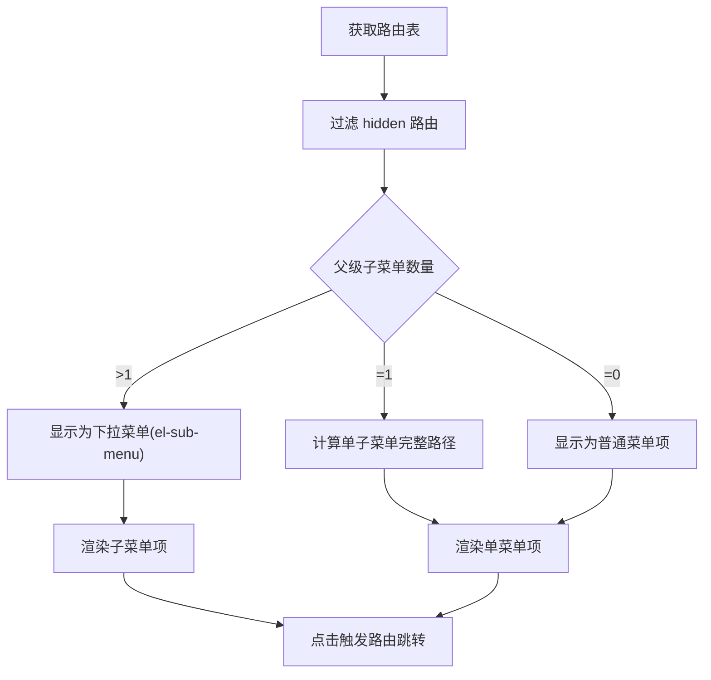
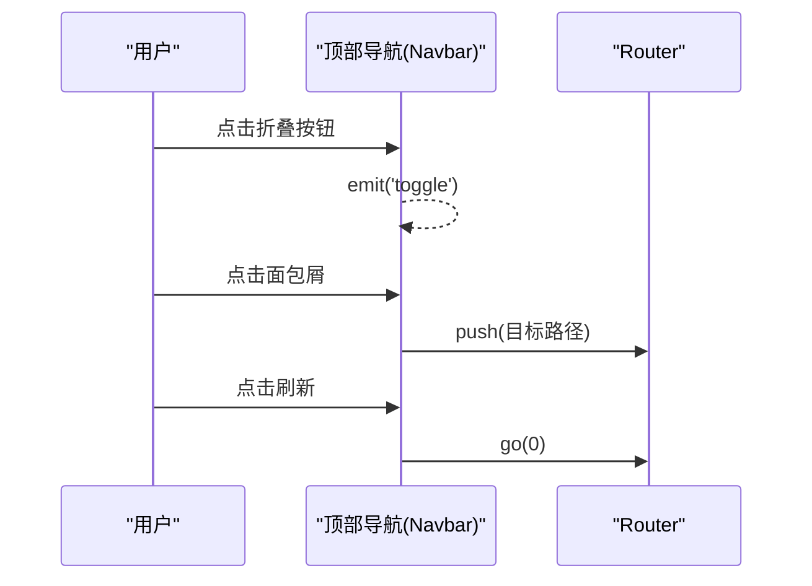
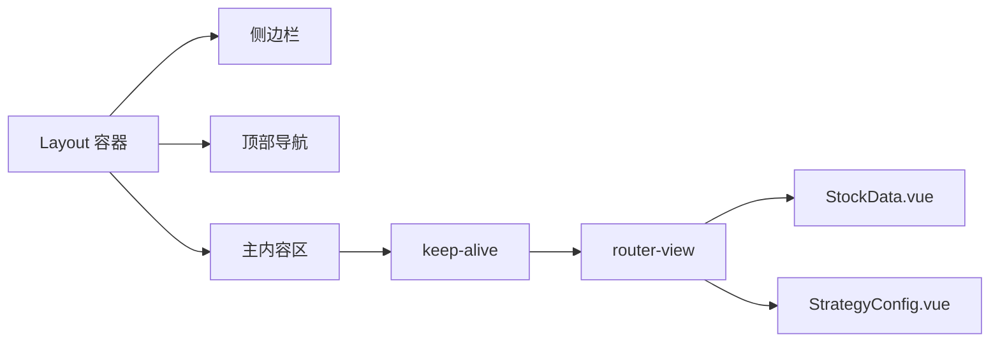
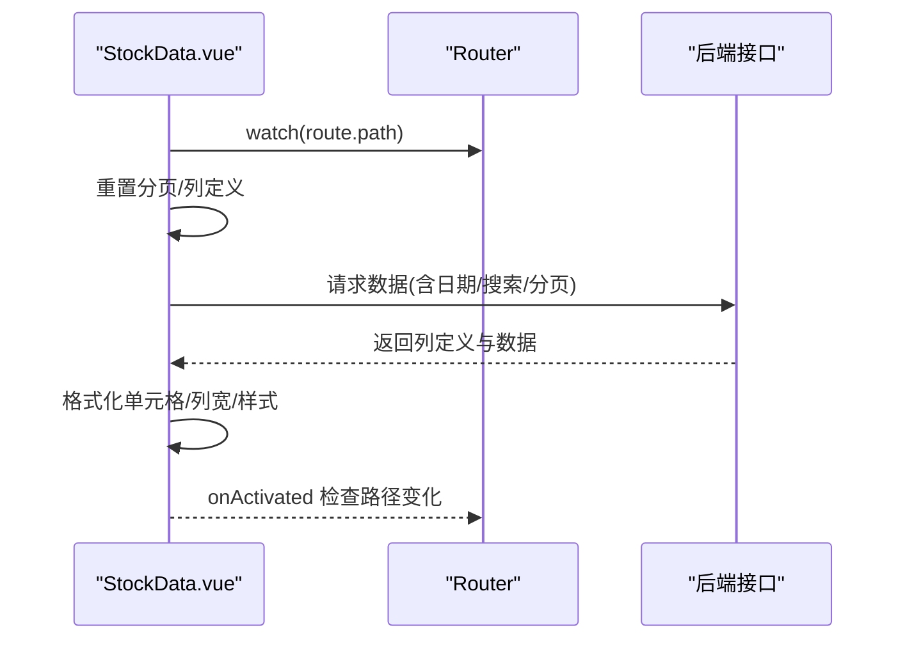
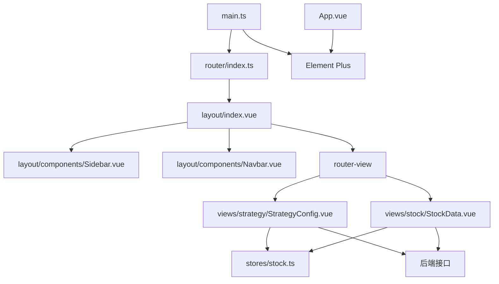

# 路由与导航系统

<cite>
**本文档引用的文件**
- [router/index.ts](file://quantia/fontWeb/src/router/index.ts)
- [layout/index.vue](file://quantia/fontWeb/src/layout/index.vue)
- [layout/components/Sidebar.vue](file://quantia/fontWeb/src/layout/components/Sidebar.vue)
- [layout/components/Navbar.vue](file://quantia/fontWeb/src/layout/components/Navbar.vue)
- [views/stock/StockData.vue](file://quantia/fontWeb/src/views/stock/StockData.vue)
- [views/strategy/StrategyConfig.vue](file://quantia/fontWeb/src/views/strategy/StrategyConfig.vue)
- [stores/stock.ts](file://quantia/fontWeb/src/stores/stock.ts)
- [main.ts](file://quantia/fontWeb/src/main.ts)
- [App.vue](file://quantia/fontWeb/src/App.vue)
- [mock/handlers.ts](file://quantia/fontWeb/src/mock/handlers.ts)
- [tests/router/index.test.ts](file://quantia/fontWeb/tests/router/index.test.ts)
</cite>

## 目录
1. [简介](#简介)
2. [项目结构](#项目结构)
3. [核心组件](#核心组件)
4. [架构总览](#架构总览)
5. [详细组件分析](#详细组件分析)
6. [依赖关系分析](#依赖关系分析)
7. [性能考虑](#性能考虑)
8. [故障排查指南](#故障排查指南)
9. [结论](#结论)
10. [附录](#附录)

## 简介
本文件系统性梳理 Quantia 项目的 Vue Router 4 路由与导航体系，涵盖：
- 路由配置与嵌套路由设计
- 侧边栏与顶部导航组件的实现原理与菜单配置
- 权限控制与隐藏路由策略
- 路由懒加载与组件按需加载
- 路由缓存与 keep-alive 机制
- 导航状态管理与面包屑导航
- 页面标题管理与 SEO 优化建议
- 路由开发最佳实践与性能优化技巧

## 项目结构
该导航系统围绕布局容器 Layout 与多级嵌套路由组织，采用“Layout + 子路由”的模式，配合 Element Plus 的菜单组件实现侧边栏与面包屑导航。

图表来源
- [App.vue](file://quantia/fontWeb/src/App.vue#L1-L19)
- [main.ts](file://quantia/fontWeb/src/main.ts#L1-L40)
- [router/index.ts](file://quantia/fontWeb/src/router/index.ts#L1-L336)
- [layout/index.vue](file://quantia/fontWeb/src/layout/index.vue#L1-L80)

章节来源
- [router/index.ts](file://quantia/fontWeb/src/router/index.ts#L1-L336)
- [layout/index.vue](file://quantia/fontWeb/src/layout/index.vue#L1-L80)

## 核心组件
- 路由配置：集中于路由表，定义首页重定向、嵌套路由、动态路由与 404 捕获。
- 布局容器：统一承载侧边栏、顶部导航与主内容区，内置折叠状态与过渡动画。
- 侧边栏：基于路由表动态生成菜单，支持图标、标题、下拉子菜单与单子菜单直显。
- 顶部导航：面包屑导航、折叠按钮、刷新与外部链接。
- 视图组件：数据视图与策略配置视图通过路由 meta 控制页面标题、表名与实时性。
- 状态管理：Pinia Store 提供关注列表、最近查看与当前日期等状态。

章节来源
- [router/index.ts](file://quantia/fontWeb/src/router/index.ts#L1-L336)
- [layout/index.vue](file://quantia/fontWeb/src/layout/index.vue#L1-L80)
- [layout/components/Sidebar.vue](file://quantia/fontWeb/src/layout/components/Sidebar.vue#L1-L155)
- [layout/components/Navbar.vue](file://quantia/fontWeb/src/layout/components/Navbar.vue#L1-L110)
- [views/stock/StockData.vue](file://quantia/fontWeb/src/views/stock/StockData.vue#L1-L617)
- [views/strategy/StrategyConfig.vue](file://quantia/fontWeb/src/views/strategy/StrategyConfig.vue#L1-L697)
- [stores/stock.ts](file://quantia/fontWeb/src/stores/stock.ts#L1-L70)

## 架构总览
路由系统采用 Vue Router 4 的 History 模式，结合 Element Plus 的菜单组件实现导航。侧边栏与顶部导航均通过路由元信息驱动 UI 渲染，视图组件通过 watch 路由变化实现数据刷新与 keep-alive 缓存。

图表来源
- [layout/components/Sidebar.vue](file://quantia/fontWeb/src/layout/components/Sidebar.vue#L1-L155)
- [layout/index.vue](file://quantia/fontWeb/src/layout/index.vue#L1-L80)
- [views/stock/StockData.vue](file://quantia/fontWeb/src/views/stock/StockData.vue#L314-L357)

## 详细组件分析

### 路由配置与嵌套路由
- 首页重定向：根路径重定向至 home 子路由，保证初始访问体验一致。
- 嵌套路由：每个模块（综合选股、股票数据、资金流向、技术指标、K线形态、策略选股、参数配置、选股验证）均以 Layout 为父级，children 定义具体页面。
- 动态路由：通过路由 meta 传递页面标题、图标、表名、是否实时、是否隐藏等元信息，供视图组件读取。
- 旧版兼容：提供 /stock 前缀重定向规则，自动去除前缀并跳转到新路径。
- 404 捕获：兜底路由位于路由表末尾，children 内部渲染 NotFound 组件。

图表来源
- [router/index.ts](file://quantia/fontWeb/src/router/index.ts#L4-L328)

章节来源
- [router/index.ts](file://quantia/fontWeb/src/router/index.ts#L1-L336)

### 侧边栏导航组件
- 菜单生成：从全局路由表过滤 hidden 路由，排除首页占位；支持多子菜单下拉与单子菜单直显。
- 激活状态：根据当前路由路径设置默认激活菜单。
- 图标与标题：通过 meta.icon 与 meta.title 渲染菜单项。
- 下拉逻辑：当父级存在多个可见子菜单时显示 el-sub-menu，否则直接渲染 el-menu-item。
- 单子菜单路径：若仅一个子菜单，计算完整路径（处理根路径场景）。

图表来源
- [layout/components/Sidebar.vue](file://quantia/fontWeb/src/layout/components/Sidebar.vue#L14-L60)

章节来源
- [layout/components/Sidebar.vue](file://quantia/fontWeb/src/layout/components/Sidebar.vue#L1-L155)

### 顶部导航栏组件
- 面包屑：基于 matched 过滤 meta.title，避免重复显示“首页”。
- 折叠按钮：向父组件传递 toggle 事件，控制侧边栏宽度。
- 刷新：调用 router.go(0) 实现硬刷新。
- 外部链接：提供 GitHub 链接入口。

图表来源
- [layout/components/Navbar.vue](file://quantia/fontWeb/src/layout/components/Navbar.vue#L15-L27)

章节来源
- [layout/components/Navbar.vue](file://quantia/fontWeb/src/layout/components/Navbar.vue#L1-L110)

### 布局容器与路由缓存
- 布局容器：统一管理侧边栏折叠状态与主内容区渲染。
- 路由缓存：在 router-view 外层包裹 keep-alive，实现跨路由切换时组件状态保持。
- 过渡动画：使用 fade 过渡，提升页面切换体验。

图表来源
- [layout/index.vue](file://quantia/fontWeb/src/layout/index.vue#L27-L35)

章节来源
- [layout/index.vue](file://quantia/fontWeb/src/layout/index.vue#L1-L80)

### 视图组件：数据视图与策略配置
- 数据视图（StockData.vue）
  - 路由元信息读取：通过 route.meta 读取 tableName、title、isRealtime、noDateFilter 等。
  - 数据加载：根据表名与日期参数请求后端接口，支持搜索防抖与分页。
  - 交互能力：关注/取消关注、查看指标详情、跳转回测看板/时间序列/明细。
  - keep-alive：监听路由变化与 onActivated 生命周期，避免重复加载。
  - 日期回退：后端返回实际日期，自动提示并切换日期。
- 策略配置（StrategyConfig.vue）
  - 策略列表与参数：加载策略列表与参数组，支持保存、重置与筛选。
  - 结果展示：分页展示筛选结果，支持查看指标详情与执行回测。
  - 路由联动：根据路由 meta.defaultStrategy 初始化活动策略。

图表来源
- [views/stock/StockData.vue](file://quantia/fontWeb/src/views/stock/StockData.vue#L314-L357)

章节来源
- [views/stock/StockData.vue](file://quantia/fontWeb/src/views/stock/StockData.vue#L1-L617)
- [views/strategy/StrategyConfig.vue](file://quantia/fontWeb/src/views/strategy/StrategyConfig.vue#L1-L697)

### 状态管理与导航联动
- Pinia Store：提供关注列表、最近查看、当前日期等状态，供视图组件读写。
- 导航联动：关注状态变化影响行样式与按钮文案，提升用户体验。

章节来源
- [stores/stock.ts](file://quantia/fontWeb/src/stores/stock.ts#L1-L70)

### Mock 与测试
- Mock：MSW 处理器映射不同表名到模拟数据，支持日期过滤、关注切换与 K 线历史。
- 测试：路由配置测试覆盖重定向、页面标题、隐藏路由与查询参数传递。

章节来源
- [mock/handlers.ts](file://quantia/fontWeb/src/mock/handlers.ts#L1-L81)
- [tests/router/index.test.ts](file://quantia/fontWeb/tests/router/index.test.ts#L1-L61)

## 依赖关系分析
- 组件耦合：Sidebar 依赖路由表与 meta 信息；Navbar 依赖 matched 元信息；Layout 统一调度两者。
- 视图耦合：StockData 与 StrategyConfig 依赖路由 meta 与 Pinia 状态；二者通过路由跳转相互协作。
- 外部依赖：Element Plus 提供图标、菜单、面包屑、卡片、表格、分页等 UI 组件；MSW 提供 Mock 能力。

图表来源
- [router/index.ts](file://quantia/fontWeb/src/router/index.ts#L1-L336)
- [layout/index.vue](file://quantia/fontWeb/src/layout/index.vue#L1-L80)
- [layout/components/Sidebar.vue](file://quantia/fontWeb/src/layout/components/Sidebar.vue#L1-L155)
- [layout/components/Navbar.vue](file://quantia/fontWeb/src/layout/components/Navbar.vue#L1-L110)
- [views/stock/StockData.vue](file://quantia/fontWeb/src/views/stock/StockData.vue#L1-L617)
- [views/strategy/StrategyConfig.vue](file://quantia/fontWeb/src/views/strategy/StrategyConfig.vue#L1-L697)
- [stores/stock.ts](file://quantia/fontWeb/src/stores/stock.ts#L1-L70)
- [App.vue](file://quantia/fontWeb/src/App.vue#L1-L19)
- [main.ts](file://quantia/fontWeb/src/main.ts#L1-L40)

## 性能考虑
- 路由懒加载：所有视图组件均采用动态导入，实现按需加载，减少首屏体积。
- keep-alive 缓存：在 Layout 中对 router-view 使用 keep-alive，避免频繁销毁重建，提升切换性能。
- 数据加载优化：搜索采用防抖（500ms），分页与日期切换触发局部刷新，降低请求频率。
- 列动态生成：根据后端返回列定义动态渲染，隐藏空值列，减少表格渲染开销。
- 过渡动画：轻量 fade 过渡，避免复杂动画带来的性能损耗。

章节来源
- [router/index.ts](file://quantia/fontWeb/src/router/index.ts#L13-L327)
- [layout/index.vue](file://quantia/fontWeb/src/layout/index.vue#L28-L34)
- [views/stock/StockData.vue](file://quantia/fontWeb/src/views/stock/StockData.vue#L71-L78)

## 故障排查指南
- 路由重定向异常
  - 确认根路径是否正确重定向至 home。
  - 检查 /stock 前缀重定向逻辑是否生效。
- 面包屑缺失或重复
  - 确保 matched 中存在 meta.title 且不为“首页”。
- 侧边栏菜单不显示
  - 检查 meta.hidden 是否被错误设置。
  - 确认 children 是否存在且未被过滤。
- 视图数据不刷新
  - 检查 watch(route.path) 与 onActivated 是否触发。
  - 确认 noDateFilter 与 isRealtime 对日期加载的影响。
- Mock 数据不生效
  - 确认环境变量 MODE 为 mock 且 MSW worker 启动。
  - 检查 /quantia/* 接口映射与参数传递。

章节来源
- [router/index.ts](file://quantia/fontWeb/src/router/index.ts#L304-L328)
- [layout/components/Navbar.vue](file://quantia/fontWeb/src/layout/components/Navbar.vue#L15-L22)
- [layout/components/Sidebar.vue](file://quantia/fontWeb/src/layout/components/Sidebar.vue#L14-L20)
- [views/stock/StockData.vue](file://quantia/fontWeb/src/views/stock/StockData.vue#L314-L357)
- [mock/handlers.ts](file://quantia/fontWeb/src/mock/handlers.ts#L30-L80)

## 结论
该导航系统以 Vue Router 4 为核心，结合 Element Plus 的 UI 组件与 Pinia 状态管理，构建了清晰的嵌套路由结构与可扩展的导航组件。通过路由 meta 驱动页面标题、图标与行为，配合 keep-alive 与懒加载策略，在保证良好用户体验的同时兼顾性能与可维护性。建议后续在权限控制、SEO 优化与国际化方面进一步完善。

## 附录

### 路由开发最佳实践
- 使用 meta 管理页面元信息，避免在组件内硬编码。
- 将通用导航逻辑抽象到布局组件，减少重复代码。
- 为复杂视图启用 keep-alive，结合生命周期钩子避免重复请求。
- 为高频交互（搜索、日期切换）增加防抖与节流。
- 为路由表编写单元测试，覆盖重定向、参数传递与隐藏路由。

### SEO 优化策略
- 页面标题：在视图组件中根据 route.meta.title 动态设置页面标题。
- 面包屑：利用 matched 生成结构化面包屑，提升可读性。
- 结构化数据：在关键页面输出 JSON-LD 结构化数据（可选）。
- 静态预渲染：对重要页面考虑静态生成（SSG）或预渲染（PRERENDER）。
