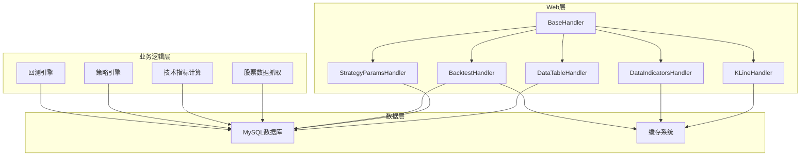
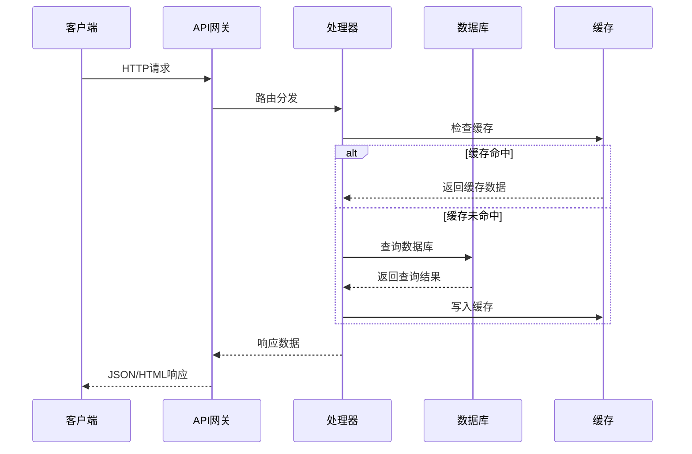
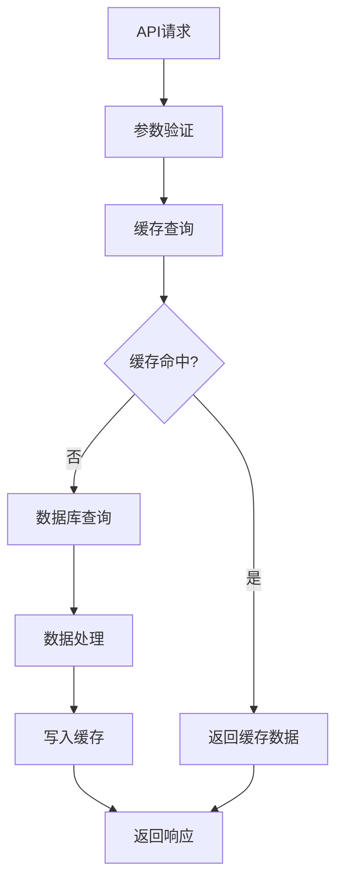
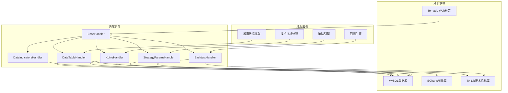

# API端点概览

<cite>
**本文档引用的文件**
- [README.md](file://README.md)
- [API_REFERENCE.md](file://document/API_REFERENCE.md)
- [base.py](file://quantia/web/base.py)
- [dataTableHandler.py](file://quantia/web/dataTableHandler.py)
- [dataIndicatorsHandler.py](file://quantia/web/dataIndicatorsHandler.py)
- [klineHandler.py](file://quantia/web/klineHandler.py)
- [strategyParamsHandler.py](file://quantia/web/strategyParamsHandler.py)
- [backtestHandler.py](file://quantia/web/backtestHandler.py)
- [docker dataTableHandler.py](file://docker/stock/quantia/web/dataTableHandler.py)
- [docker strategyParamsHandler.py](file://docker/stock/quantia/web/strategyParamsHandler.py)
- [docker backtestHandler.py](file://docker/stock/quantia/web/backtestHandler.py)
</cite>

## 目录
1. [简介](#简介)
2. [项目结构](#项目结构)
3. [核心组件](#核心组件)
4. [架构概览](#架构概览)
5. [详细组件分析](#详细组件分析)
6. [依赖关系分析](#依赖关系分析)
7. [性能考虑](#性能考虑)
8. [故障排除指南](#故障排除指南)
9. [结论](#结论)

## 简介

Quantia（Quantia）是一个功能强大的股票数据和分析系统，提供全面的API端点用于获取股票数据、技术指标、K线数据和回测验证等功能。该系统支持多种数据源，包括东方财富、腾讯财经和新浪财经，具备自动数据抓取、技术指标计算、K线形态识别、策略选股和回测验证等核心功能。

系统采用Tornado Web框架构建，提供RESTful API接口，支持JSON和HTML响应格式，端口为9988。所有API请求均支持CORS跨域访问，便于前后端分离应用集成。

## 项目结构

系统采用模块化架构设计，主要包含以下核心模块：



**图表来源**
- [base.py](file://quantia/web/base.py#L14-L36)
- [dataTableHandler.py](file://quantia/web/dataTableHandler.py#L35-L51)
- [klineHandler.py](file://quantia/web/klineHandler.py#L212-L235)

**章节来源**
- [README.md](file://README.md#L1-L700)

## 核心组件

### Web基础组件

系统的基础Web组件提供了统一的请求处理机制和数据库连接管理：

- **BaseHandler**: 基础处理器，负责CORS跨域设置和数据库连接检查
- **CORS支持**: 允许所有域名访问，支持所有HTTP方法
- **数据库连接管理**: 自动检测和重连机制

### 数据表API组件

专门用于处理数据表查询和展示的组件：

- **GetStockDataHandler**: 处理数据表查询请求
- **GetStockHtmlHandler**: 提供HTML页面展示
- **查询优化**: 支持缓存、分页和条件过滤

### K线数据组件

提供K线数据和图表展示功能：

- **GetKlineDataHandler**: 返回完整的K线数据和技术指标
- **指标计算**: 支持MA、MACD、KDJ、RSI、布林带等指标
- **数据格式**: 适配ECharts图表库

**章节来源**
- [base.py](file://quantia/web/base.py#L14-L36)
- [dataTableHandler.py](file://quantia/web/dataTableHandler.py#L54-L214)
- [klineHandler.py](file://quantia/web/klineHandler.py#L212-L359)

## 架构概览

系统采用分层架构设计，确保各组件职责清晰、耦合度低：



**图表来源**
- [base.py](file://quantia/web/base.py#L28-L36)
- [dataTableHandler.py](file://quantia/web/dataTableHandler.py#L127-L150)

### 数据流架构



**图表来源**
- [dataTableHandler.py](file://quantia/web/dataTableHandler.py#L127-L150)

## 详细组件分析

### 数据表API端点

#### 基础数据查询接口

**端点**: `/quantia/api_data`

**功能**: 获取各类股票数据表的JSON数据

**参数说明**:
- `table_name` (必需): 数据表名称
- `date` (可选): 查询日期 (YYYY-MM-DD)
- `columns` (可选): 指定返回列
- `order` (可选): 排序字段
- `search` (可选): 搜索关键字
- `start` (可选): 分页起始位置
- `length` (可选): 每页数量

**支持的数据表**:
- `cn_stock_spot`: 每日股票数据
- `cn_etf_spot`: 每日ETF数据
- `cn_stock_fund_flow`: 股票资金流向
- `cn_stock_indicators`: 股票指标数据
- `cn_stock_strategy_*`: 各种选股策略结果
- `cn_stock_kline_pattern_*`: K线形态识别结果

**响应格式**:
```json
{
    "draw": 1,
    "recordsTotal": 5000,
    "recordsFiltered": 5000,
    "data": [
        {
            "date": "2024-01-15",
            "code": "000001",
            "name": "平安银行",
            "new_price": 10.50,
            "change_rate": 1.25
        }
    ]
}
```

**章节来源**
- [API_REFERENCE.md](file://document/API_REFERENCE.md#L31-L107)
- [dataTableHandler.py](file://quantia/web/dataTableHandler.py#L54-L214)

#### HTML页面展示接口

**端点**: `/quantia/data`

**功能**: 返回带有DataTables的HTML页面

**参数说明**:
- `table_name` (必需): 数据表名称
- `date` (可选): 日期 (YYYY-MM-DD)

**响应**: 包含交互式数据表格的HTML页面

**章节来源**
- [API_REFERENCE.md](file://document/API_REFERENCE.md#L110-L128)

### 技术指标API端点

#### 指标图表接口

**端点**: `/quantia/data/indicators`

**功能**: 获取股票技术指标图表页面

**参数说明**:
- `code` (必需): 股票代码 (如: 000001)
- `date` (可选): 日期 (YYYY-MM-DD)
- `type` (可选): 图表类型

**图表内容**:
- K线图（日K线）
- 成交量图
- MACD 指标
- KDJ 指标
- RSI 指标
- BOLL 指标
- 筹码分布图

**章节来源**
- [API_REFERENCE.md](file://document/API_REFERENCE.md#L131-L161)
- [dataIndicatorsHandler.py](file://quantia/web/dataIndicatorsHandler.py#L16-L41)

### K线数据API端点

#### K线数据接口

**端点**: `/quantia/api/kline`

**功能**: 获取完整的K线数据和技术指标

**参数说明**:
- `code` (必需): 股票代码
- `date` (可选): 日期 (默认今天)
- `period` (可选): 周期 (daily/weekly/monthly/quarterly/yearly)
- `days` (可选): 返回天数
- `name` (可选): 股票名称

**响应数据结构**:
```json
{
    "code": "000001",
    "name": "平安银行",
    "period": "daily",
    "total": 1000,
    "dates": ["2024-01-01", "2024-01-02"],
    "ohlc": [[10.5, 10.8, 10.3, 10.9]],
    "volumes": [1000000],
    "ma": {
        "ma5": [10.6, 10.7],
        "ma10": [10.5, 10.6]
    },
    "rsi": [45.2, 47.8],
    "macd": {
        "dif": [0.01, 0.02],
        "dea": [0.005, 0.01],
        "histogram": [0.005, 0.01]
    }
}
```

**支持的技术指标**:
- 移动平均线 (MA5, MA10, MA20, MA60)
- 成交量均线 (VOL_MA5, VOL_MA10)
- 布林带 (BOLL)
- RSI (相对强弱指数)
- MACD (指数平滑异同移动平均线)
- KDJ (随机指标)
- 威廉指标 (WR)

**章节来源**
- [API_REFERENCE.md](file://document/API_REFERENCE.md#L1-L746)
- [klineHandler.py](file://quantia/web/klineHandler.py#L212-L359)

### 策略参数管理API端点

#### 策略参数查询接口

**端点**: `/quantia/api/strategy/params`

**功能**: 获取策略参数配置

**参数说明**:
- `strategy` (必需): 策略类型 (gpt_value/moat_scoring/ai_model)

**响应示例**:
```json
{
    "status": "success",
    "data": {
        "strategy": "gpt_value",
        "params": {
            "debt_asset_ratio": {"value": 60, "label": "资产负债率上限(%)"},
            "roe_weight": {"value": 15, "label": "ROE下限(%)"},
            "sale_gpr": {"value": 30, "label": "毛利率下限(%)"}
        }
    }
}
```

#### 策略参数保存接口

**端点**: `/quantia/api/strategy/params/save`

**功能**: 保存策略参数配置

**请求体**:
```json
{
    "strategy": "gpt_value",
    "params": {
        "debt_asset_ratio": 60,
        "roe_weight": 15,
        "sale_gpr": 30
    }
}
```

#### 策略参数重置接口

**端点**: `/quantia/api/strategy/params/reset`

**功能**: 将策略参数重置为默认值

**请求体**:
```json
{
    "strategy": "gpt_value"
}
```

**章节来源**
- [API_REFERENCE.md](file://document/API_REFERENCE.md#L198-L268)
- [strategyParamsHandler.py](file://quantia/web/strategyParamsHandler.py#L563-L661)

### 回测验证API端点

#### 回测配置查询接口

**端点**: `/quantia/api/backtest/config`

**功能**: 获取回测配置信息

**响应内容**:
- 可用的回测周期列表
- 支持的策略列表
- 默认收益周期
- 最大表格周期

#### 单股回测接口

**端点**: `/quantia/api/backtest/run`

**功能**: 对单只股票执行回测

**参数说明**:
- `code` (必需): 股票代码
- `strategy` (可选): 策略名称
- `period` (可选): 回测周期 (1w/2w/1m/3m/6m/1y)
- `start_date` (可选): 开始日期 (YYYY-MM-DD)
- `end_date` (可选): 结束日期 (YYYY-MM-DD)
- `checkpoints` (可选): 回测输出点 (逗号分隔)

**响应内容**:
- 买入日期和价格
- 各周期收益率
- 最大涨幅/回撤
- 策略命中情况
- 关键指标值

#### 批量回测接口

**端点**: `/quantia/api/backtest/batch`

**功能**: 对某策略在指定时间段内的所有选股记录进行批量回测

**参数说明**:
- `strategy` (必需): 策略名称
- `period` (可选): 回测周期
- `limit` (可选): 统计天数
- `horizons` (可选): 汇总使用的持有天数列表
- `success_days` (可选): 成功定义使用的持有天数

**响应内容**:
- 策略按日汇总的选股数量
- 成功率
- 平均收益

**章节来源**
- [API_REFERENCE.md](file://document/API_REFERENCE.md#L437-L489)
- [backtestHandler.py](file://quantia/web/backtestHandler.py#L69-L126)

### 交易日期API端点

#### 最近交易日期接口

**端点**: `/quantia/api/trade_date`

**功能**: 获取最近的交易日期信息

**响应内容**:
- `run_date`: 最近已收盘的交易日（用于非实时数据表）
- `run_date_nph`: 当前交易日（含未收盘，用于实时数据表）

**章节来源**
- [API_REFERENCE.md](file://document/API_REFERENCE.md#L727-L746)

## 依赖关系分析

系统各组件之间的依赖关系如下：



**图表来源**
- [base.py](file://quantia/web/base.py#L1-L48)
- [dataTableHandler.py](file://quantia/web/dataTableHandler.py#L1-L232)

### 组件耦合度分析

系统采用松耦合设计，各组件通过明确的接口进行交互：

- **低耦合**: 处理器组件与数据库层通过统一的数据库连接管理
- **高内聚**: 每个处理器专注于特定的功能领域
- **可扩展**: 新增功能通过继承BaseHandler实现

**章节来源**
- [base.py](file://quantia/web/base.py#L14-L36)

## 性能考虑

### 缓存策略

系统实现了多层次的缓存机制：

1. **查询缓存**: 对常用查询结果进行缓存
2. **数据缓存**: 对历史K线数据进行缓存
3. **结果缓存**: 对复杂计算结果进行缓存

### 数据库优化

- **索引优化**: 关键查询字段建立适当索引
- **连接池**: 使用连接池管理数据库连接
- **查询优化**: 避免N+1查询问题

### 并发处理

- **异步处理**: 使用Tornado的异步特性
- **线程池**: 对CPU密集型任务使用线程池
- **限流机制**: 防止过度并发导致系统过载

## 故障排除指南

### 常见错误处理

系统提供统一的错误处理机制：

**错误响应格式**:
```json
{
    "error": true,
    "message": "错误描述信息"
}
```

**常见错误码**:
- `400`: 参数错误
- `404`: 资源不存在  
- `500`: 服务器内部错误

### 数据库连接问题

**症状**: 请求超时或数据库连接失败

**解决方案**:
1. 检查数据库连接配置
2. 验证数据库服务状态
3. 查看连接池使用情况

### 缓存失效问题

**症状**: 数据显示异常或查询缓慢

**解决方案**:
1. 清理相关缓存
2. 检查缓存配置
3. 重启缓存服务

**章节来源**
- [API_REFERENCE.md](file://document/API_REFERENCE.md#L346-L365)
- [base.py](file://quantia/web/base.py#L28-L36)

## 结论

Quantia API系统提供了完整、高效的股票数据服务接口，具有以下特点：

1. **功能完整**: 涵盖股票数据、技术指标、K线图表、策略参数和回测验证等核心功能
2. **性能优异**: 采用多层缓存和优化的数据库查询机制
3. **易于使用**: 提供清晰的API文档和错误处理机制
4. **可扩展性强**: 模块化设计便于功能扩展和维护

开发者可以基于这些API端点快速构建股票分析和投资决策系统，支持从基础数据查询到高级策略回测的完整需求。
