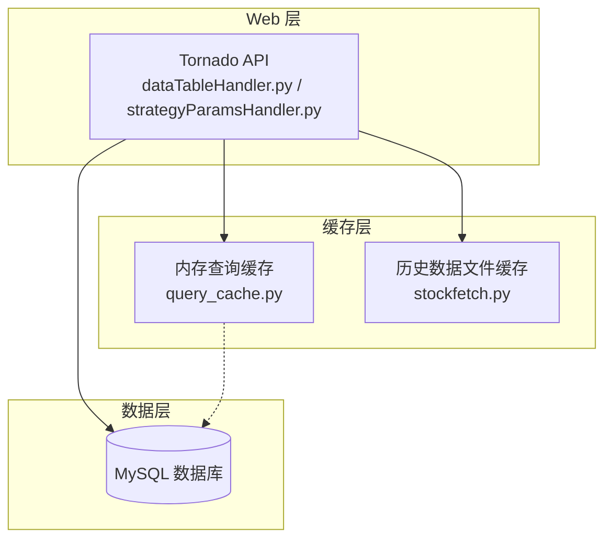
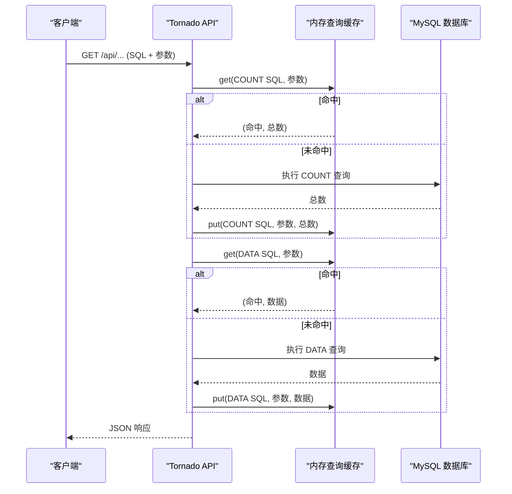
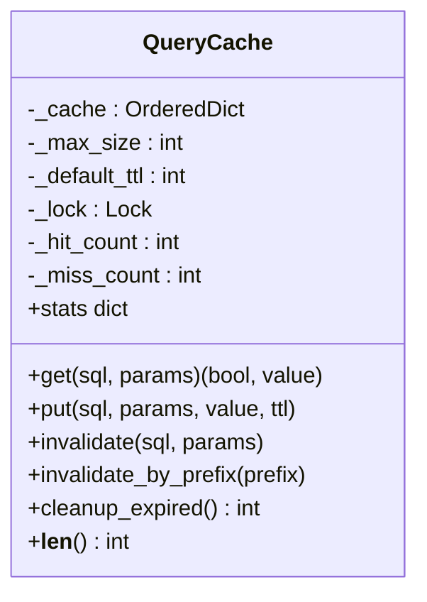
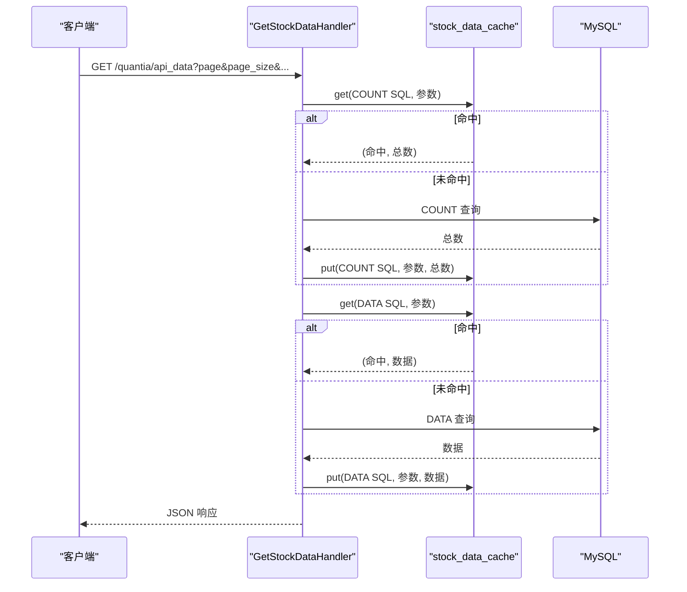
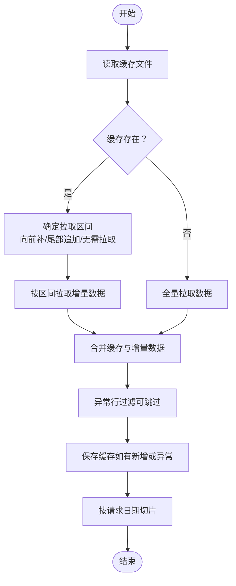
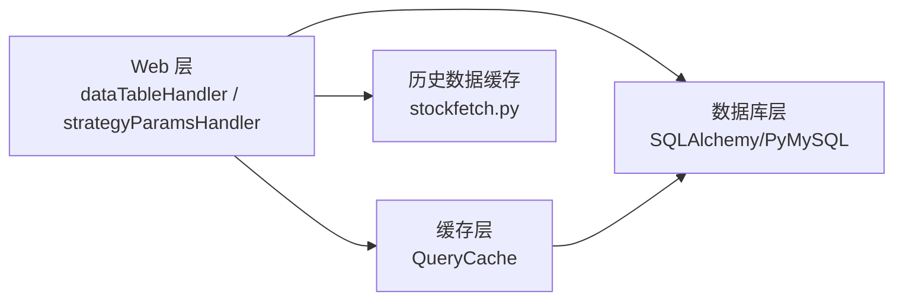

# API缓存策略

<cite>
**本文档引用的文件**
- [query_cache.py](file://docker/stock/quantia/lib/query_cache.py)
- [stockfetch.py](file://docker/stock/quantia/core/stockfetch.py)
- [dataTableHandler.py](file://docker/stock/quantia/web/dataTableHandler.py)
- [strategyParamsHandler.py](file://docker/stock/quantia/web/strategyParamsHandler.py)
- [database.py](file://docker/stock/quantia/lib/database.py)
- [test_pagination.py](file://tests/test_pagination.py)
</cite>

## 目录
1. [简介](#简介)
2. [项目结构](#项目结构)
3. [核心组件](#核心组件)
4. [架构概览](#架构概览)
5. [详细组件分析](#详细组件分析)
6. [依赖关系分析](#依赖关系分析)
7. [性能考量](#性能考量)
8. [故障排查指南](#故障排查指南)
9. [结论](#结论)

## 简介
本文件系统性阐述 Quantia 项目的 API 缓存策略，重点覆盖以下方面：
- 查询缓存的实现机制与缓存键生成规则
- 缓存失效策略与清理机制
- 不同类型查询的缓存配置与 TTL 设置
- 内存管理与容量控制
- 缓存命中率优化、缓存穿透防护与缓存雪崩预防
- 缓存配置参数、性能监控指标与清理策略
- 高并发场景下的性能提升效果与资源消耗控制

## 项目结构
Quantia 项目采用前后端分离架构，Web 层通过 Tornado 提供 REST API，数据访问层通过 SQLAlchemy/PyMySQL 连接 MySQL 数据库。缓存策略分为两类：
- 内存查询缓存：针对 Web API 的 SQL 查询结果缓存，减少数据库重复查询
- 历史数据文件缓存：针对股票历史数据的增量缓存，减少外部数据源拉取

**图表来源**
- [dataTableHandler.py](file://docker/stock/quantia/web/dataTableHandler.py#L123-L150)
- [strategyParamsHandler.py](file://docker/stock/quantia/web/strategyParamsHandler.py#L792-L810)
- [query_cache.py](file://docker/stock/quantia/lib/query_cache.py#L27-L156)
- [stockfetch.py](file://docker/stock/quantia/core/stockfetch.py#L921-L1067)

**章节来源**
- [dataTableHandler.py](file://docker/stock/quantia/web/dataTableHandler.py#L1-L232)
- [strategyParamsHandler.py](file://docker/stock/quantia/web/strategyParamsHandler.py#L1-L1022)
- [query_cache.py](file://docker/stock/quantia/lib/query_cache.py#L1-L156)
- [stockfetch.py](file://docker/stock/quantia/core/stockfetch.py#L1-L1584)

## 核心组件
- 内存查询缓存（QueryCache）：线程安全的 LRU + TTL 缓存，支持 COUNT 与 DATA 查询分别缓存，键由 SQL + 参数生成，确保唯一性
- Web API 缓存集成：StockData 页面使用 stock_data_cache，策略筛选使用 filter_result_cache，分别配置不同的 TTL 与容量
- 历史数据缓存：基于文件系统的增量缓存，支持前复权/后复权等多维度缓存，带元数据版本控制与异常行过滤
- 数据库连接池：轻量连接池配置，避免频繁创建连接带来的资源消耗

**章节来源**
- [query_cache.py](file://docker/stock/quantia/lib/query_cache.py#L27-L156)
- [dataTableHandler.py](file://docker/stock/quantia/web/dataTableHandler.py#L123-L150)
- [strategyParamsHandler.py](file://docker/stock/quantia/web/strategyParamsHandler.py#L792-L810)
- [stockfetch.py](file://docker/stock/quantia/core/stockfetch.py#L921-L1067)
- [database.py](file://docker/stock/quantia/lib/database.py#L58-L69)

## 架构概览
Web API 的查询流程如下：
1. API 接收请求，构造 SQL 与参数
2. 先尝试从内存查询缓存获取 COUNT 总数与 DATA 数据
3. 若未命中，访问数据库执行查询并将结果写入缓存
4. 返回 JSON 响应

**图表来源**
- [dataTableHandler.py](file://docker/stock/quantia/web/dataTableHandler.py#L123-L150)
- [strategyParamsHandler.py](file://docker/stock/quantia/web/strategyParamsHandler.py#L792-L810)
- [query_cache.py](file://docker/stock/quantia/lib/query_cache.py#L51-L89)

## 详细组件分析

### 内存查询缓存（QueryCache）
- 实现机制
  - LRU 淘汰：使用有序字典维护访问顺序，命中后移动到末尾，超出容量时淘汰最前元素
  - TTL 过期：每条缓存记录包含过期时间，访问时判断是否过期，过期则删除
  - 线程安全：使用锁保护缓存读写与统计信息
- 缓存键生成
  - 基于 SQL 与参数拼接后进行 MD5 哈希，确保相同 SQL + 参数组合得到相同键
- 缓存配置
  - stock_data_cache：容量 512，TTL 300 秒（5 分钟），适用于 StockData 页面的分页查询
  - filter_result_cache：容量 128，TTL 600 秒（10 分钟），适用于策略筛选结果
- 失效策略
  - 指定 SQL + 参数失效
  - 清空全部缓存
  - 按前缀失效（当前实现为清空全部，便于简化）
- 统计与监控
  - 命中计数、未命中计数、当前大小、最大容量、命中率、默认 TTL

**图表来源**
- [query_cache.py](file://docker/stock/quantia/lib/query_cache.py#L27-L141)

**章节来源**
- [query_cache.py](file://docker/stock/quantia/lib/query_cache.py#L27-L156)
- [test_pagination.py](file://tests/test_pagination.py#L838-L980)

### Web API 缓存集成
- StockData 页面（dataTableHandler）
  - COUNT 查询与 DATA 查询分别缓存，COUNT 在翻页时共享，DATA 按页码独立缓存
  - 参数变化导致缓存键变化，避免不同条件混淆
- 策略筛选（strategyParamsHandler）
  - 筛选结果缓存同样区分 COUNT 与 DATA，参数保存/重置后清空筛选缓存，确保一致性

**图表来源**
- [dataTableHandler.py](file://docker/stock/quantia/web/dataTableHandler.py#L123-L150)
- [query_cache.py](file://docker/stock/quantia/lib/query_cache.py#L51-L89)

**章节来源**
- [dataTableHandler.py](file://docker/stock/quantia/web/dataTableHandler.py#L123-L215)
- [strategyParamsHandler.py](file://docker/stock/quantia/web/strategyParamsHandler.py#L792-L852)

### 历史数据文件缓存（增量缓存）
- 增量更新策略
  - 尾部追加：缓存最后日期 < 请求结束日期，从缓存末尾向后拉取
  - 向前补数据：请求起始日期 < 缓存最早日期，从请求起始日期向前拉取
  - 无缓存：全量拉取
- 数据源优先级：东方财富 → 腾讯财经 → 新浪财经，支持健康度跟踪与降级
- 元数据版本控制：记录最后日期与过滤版本，避免重复过滤
- 异常行过滤：向量化检测并移除异常 OHLC 数据，安全阀限制异常比例
- 缓存清理：定期清理退市股票、除权除息刷新、损坏文件

**图表来源**
- [stockfetch.py](file://docker/stock/quantia/core/stockfetch.py#L921-L1067)
- [stockfetch.py](file://docker/stock/quantia/core/stockfetch.py#L1070-L1178)

**章节来源**
- [stockfetch.py](file://docker/stock/quantia/core/stockfetch.py#L921-L1067)
- [stockfetch.py](file://docker/stock/quantia/core/stockfetch.py#L1070-L1178)

## 依赖关系分析
- Web 层依赖缓存层与数据库层
- 缓存层依赖线程安全与哈希算法
- 历史数据缓存依赖文件系统与 pandas
- 数据库层依赖连接池配置

**图表来源**
- [dataTableHandler.py](file://docker/stock/quantia/web/dataTableHandler.py#L13-L13)
- [strategyParamsHandler.py](file://docker/stock/quantia/web/strategyParamsHandler.py#L15-L15)
- [query_cache.py](file://docker/stock/quantia/lib/query_cache.py#L15-L19)
- [stockfetch.py](file://docker/stock/quantia/core/stockfetch.py#L1-L35)
- [database.py](file://docker/stock/quantia/lib/database.py#L58-L69)

**章节来源**
- [dataTableHandler.py](file://docker/stock/quantia/web/dataTableHandler.py#L1-L143)
- [strategyParamsHandler.py](file://docker/stock/quantia/web/strategyParamsHandler.py#L1-L1022)
- [query_cache.py](file://docker/stock/quantia/lib/query_cache.py#L1-L156)
- [stockfetch.py](file://docker/stock/quantia/core/stockfetch.py#L1-L1584)
- [database.py](file://docker/stock/quantia/lib/database.py#L1-L232)

## 性能考量
- 缓存命中率优化
  - COUNT 与 DATA 分别缓存，COUNT 在翻页时共享，DATA 按页码独立缓存，避免 COUNT 重复计算
  - 参数变化导致缓存键变化，确保不同条件隔离
- 缓存穿透防护
  - 表不存在或列不存在时返回空数据而非 500，避免缓存污染
- 缓存雪崩预防
  - 不同缓存实例设置不同 TTL，避免同时过期
  - 历史数据缓存通过增量更新与健康度跟踪，降低外部依赖失效影响
- 资源消耗控制
  - 内存查询缓存容量有限，LRU 淘汰避免无限增长
  - 数据库连接池小规模配置，避免过多连接占用资源
  - 历史数据缓存文件按代码前缀分目录，便于管理与清理

**章节来源**
- [dataTableHandler.py](file://docker/stock/quantia/web/dataTableHandler.py#L154-L179)
- [strategyParamsHandler.py](file://docker/stock/quantia/web/strategyParamsHandler.py#L619-L626)
- [query_cache.py](file://docker/stock/quantia/lib/query_cache.py#L36-L39)
- [database.py](file://docker/stock/quantia/lib/database.py#L61-L69)
- [stockfetch.py](file://docker/stock/quantia/core/stockfetch.py#L48-L62)

## 故障排查指南
- 缓存未命中
  - 检查 SQL 与参数是否一致，确认缓存键生成规则
  - 查看缓存统计信息，确认命中率与容量
- 缓存过期
  - 检查默认 TTL 与手动设置的 TTL
  - 使用清理过期条目功能，确认过期条目数量
- 缓存污染
  - 参数保存/重置后应清空筛选缓存，避免脏数据
  - 历史数据缓存异常行过滤后需回写缓存与元数据
- 数据库连接问题
  - 检查连接池配置与超时设置
  - 关注健康度跟踪日志，识别数据源降级

**章节来源**
- [test_pagination.py](file://tests/test_pagination.py#L855-L941)
- [strategyParamsHandler.py](file://docker/stock/quantia/web/strategyParamsHandler.py#L619-L626)
- [stockfetch.py](file://docker/stock/quantia/core/stockfetch.py#L1415-L1503)
- [database.py](file://docker/stock/quantia/lib/database.py#L58-L69)

## 结论
Quantia 项目的缓存策略通过“内存查询缓存 + 历史数据文件缓存”的双轨设计，在保证数据一致性的同时显著降低了数据库与外部数据源的压力。内存查询缓存针对高频查询场景，采用 LRU + TTL 机制与精细的键生成规则，有效提升命中率并控制内存占用；历史数据缓存通过增量更新与健康度跟踪，提升了系统的鲁棒性与可维护性。结合参数化配置与清理策略，系统在高并发场景下实现了良好的性能表现与资源消耗控制。
