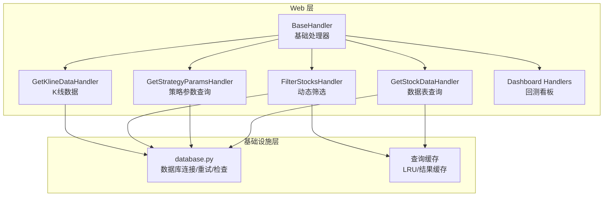
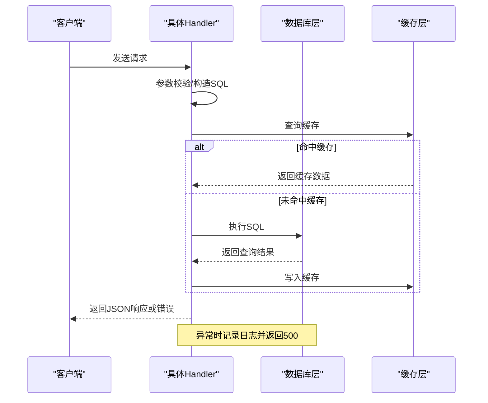
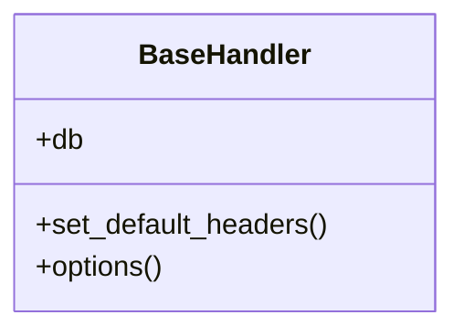
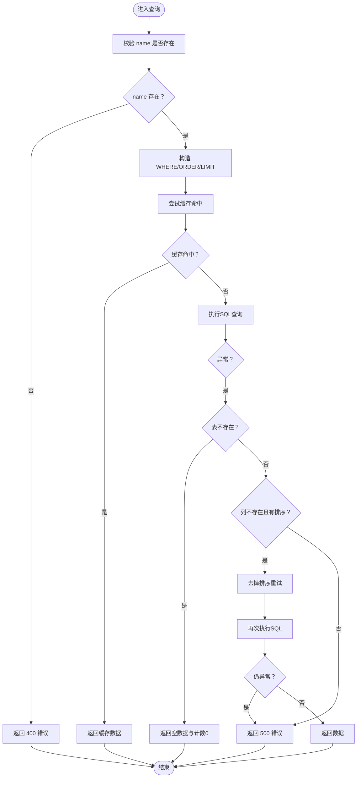
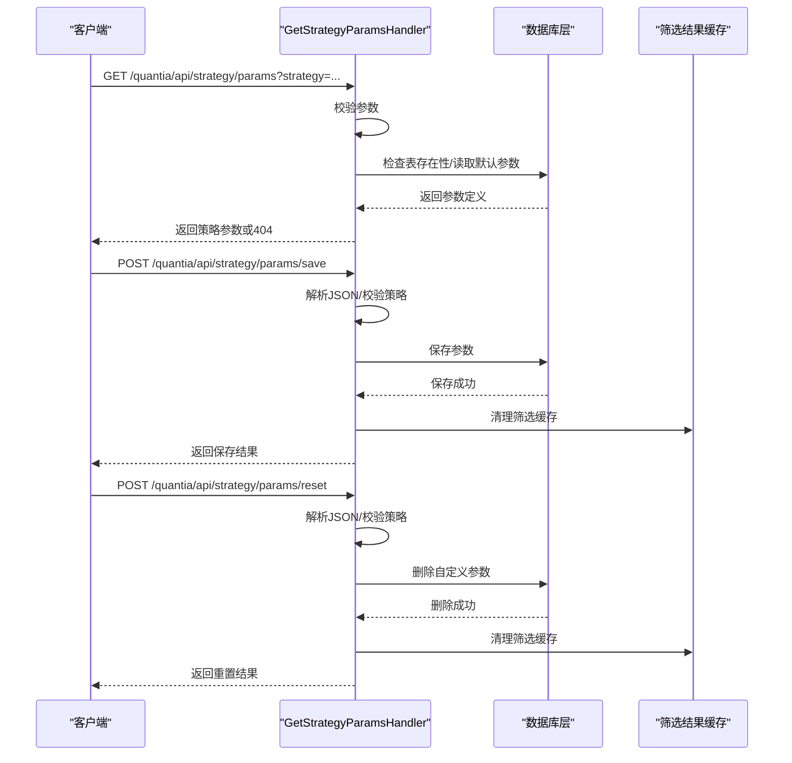
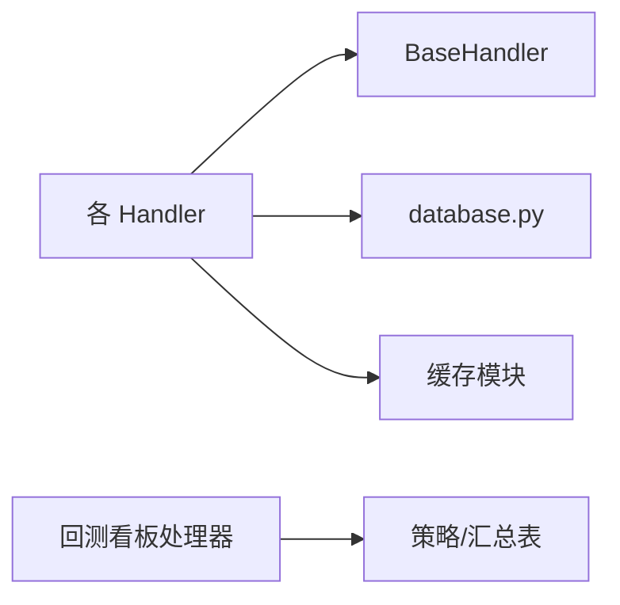

# API错误处理

<cite>
**本文档引用的文件**
- [API_REFERENCE.md](file://document/API_REFERENCE.md)
- [base.py](file://quantia/web/base.py)
- [dataTableHandler.py](file://quantia/web/dataTableHandler.py)
- [backtestDashboardHandler.py](file://quantia/web/backtestDashboardHandler.py)
- [strategyParamsHandler.py](file://quantia/web/strategyParamsHandler.py)
- [klineHandler.py](file://quantia/web/klineHandler.py)
- [database.py](file://quantia/lib/database.py)
</cite>

## 目录
1. [简介](#简介)
2. [项目结构](#项目结构)
3. [核心组件](#核心组件)
4. [架构概览](#架构概览)
5. [详细组件分析](#详细组件分析)
6. [依赖关系分析](#依赖关系分析)
7. [性能考虑](#性能考虑)
8. [故障排查指南](#故障排查指南)
9. [结论](#结论)

## 简介
本文件针对 Quantia 项目的 API 错误处理机制进行全面梳理与说明，涵盖 HTTP 状态码使用规范、错误响应格式、异常处理策略、常见错误类型（400、404、500）的触发条件与处理方式，以及参数验证失败、数据库连接异常、缓存失效等场景下的错误处理流程。同时提供错误响应的标准格式、错误码定义与调试信息，解释系统的健壮性设计、容错机制与故障恢复策略。

## 项目结构
Quantia 采用 Tornado Web 框架实现后端 API，错误处理贯穿于 Handler 层、数据库层与缓存层。核心目录与文件如下：
- quantia/web：Web 层 Handler，负责参数校验、业务逻辑与错误响应
- quantia/lib：基础设施层，包括数据库连接、缓存与工具函数
- document：API 文档与参考说明

**图表来源**
- [base.py](file://quantia/web/base.py#L14-L36)
- [dataTableHandler.py](file://quantia/web/dataTableHandler.py#L54-L214)
- [strategyParamsHandler.py](file://quantia/web/strategyParamsHandler.py#L563-L1022)
- [klineHandler.py](file://quantia/web/klineHandler.py#L212-L360)
- [database.py](file://quantia/lib/database.py#L80-L304)

**章节来源**
- [base.py](file://quantia/web/base.py#L14-L36)
- [database.py](file://quantia/lib/database.py#L80-L304)

## 核心组件
- 基础处理器 BaseHandler：统一设置 CORS、数据库连接检查与自动重连
- 数据表查询处理器 GetStockDataHandler：参数校验、SQL 查询、缓存命中、异常兜底与日期回退
- 策略参数处理器 GetStrategyParamsHandler/SaveStrategyParamsHandler/ResetStrategyParamsHandler：参数校验、数据库持久化、缓存失效
- 动态筛选处理器 FilterStocksHandler：参数组合查询、缓存命中、异常兜底
- K线数据处理器 GetKlineDataHandler：参数校验、缓存命中、异常兜底
- 回测看板处理器 Dashboard Handlers：日期范围解析、表存在性检查、异常兜底

**章节来源**
- [base.py](file://quantia/web/base.py#L14-L36)
- [dataTableHandler.py](file://quantia/web/dataTableHandler.py#L54-L214)
- [strategyParamsHandler.py](file://quantia/web/strategyParamsHandler.py#L563-L1022)
- [klineHandler.py](file://quantia/web/klineHandler.py#L212-L360)
- [backtestDashboardHandler.py](file://quantia/web/backtestDashboardHandler.py#L360-L467)

## 架构概览
API 错误处理遵循“参数校验前置、异常捕获兜底、状态码明确、响应格式统一”的原则。数据库层提供连接重试与瞬态错误识别，缓存层提供 LRU 缓存与结果缓存以提升稳定性与性能。

**图表来源**
- [dataTableHandler.py](file://quantia/web/dataTableHandler.py#L127-L179)
- [strategyParamsHandler.py](file://quantia/web/strategyParamsHandler.py#L984-L1022)
- [database.py](file://quantia/lib/database.py#L261-L276)

## 详细组件分析

### 参数校验与状态码规范
- 400（参数错误）：请求参数缺失或格式不合法时返回
  - 示例：缺少必要参数、分页参数解析失败、JSON 解析失败
- 404（资源不存在）：请求的资源不存在或未找到
  - 示例：数据模块不存在、策略标识未知、表不存在
- 500（服务器内部错误）：数据库异常、缓存异常、算法异常等
  - 示例：SQL 执行异常、缓存写入失败、未知异常

**章节来源**
- [dataTableHandler.py](file://quantia/web/dataTableHandler.py#L64-L73)
- [strategyParamsHandler.py](file://quantia/web/strategyParamsHandler.py#L598-L610)
- [klineHandler.py](file://quantia/web/klineHandler.py#L245-L248)

### 基础处理器 BaseHandler
- 设置 CORS 头与 OPTIONS 预检
- 每次请求检查数据库连接，失败时自动重连
- 为所有 Handler 提供统一的 db 连接属性

**图表来源**
- [base.py](file://quantia/web/base.py#L14-L36)

**章节来源**
- [base.py](file://quantia/web/base.py#L14-L36)

### 数据表查询处理器 GetStockDataHandler
- 参数校验：name 必填；分页参数容错与边界处理
- SQL 构造：WHERE/ORDER BY/LIMIT 动态拼接
- 缓存策略：COUNT 与 DATA 分别缓存，命中直接返回
- 异常处理：
  - 表不存在：返回空数据与计数为 0，不抛 500
  - 列不存在（ORDER BY 引用不存在列）：去掉排序重试
  - 其他异常：记录日志并返回 500
- 日期回退：当按指定日期查询无数据且未启用关键词搜索时，自动回退到最近有数据的日期

**图表来源**
- [dataTableHandler.py](file://quantia/web/dataTableHandler.py#L54-L214)

**章节来源**
- [dataTableHandler.py](file://quantia/web/dataTableHandler.py#L54-L214)

### 策略参数处理器
- GetStrategyParamsHandler：参数校验与策略标识检查，未知策略返回 404
- SaveStrategyParamsHandler：请求体 JSON 解析失败返回 400；保存成功后清理筛选结果缓存
- ResetStrategyParamsHandler：请求体 JSON 解析失败返回 400；重置失败返回 500
- FilterStocksHandler：动态筛选时，表不存在返回警告信息；其他异常返回 500

**图表来源**
- [strategyParamsHandler.py](file://quantia/web/strategyParamsHandler.py#L563-L661)

**章节来源**
- [strategyParamsHandler.py](file://quantia/web/strategyParamsHandler.py#L563-L661)

### 动态筛选处理器 FilterStocksHandler
- 参数校验：strategy、date、分页参数
- SQL 构建：根据策略类型动态拼接 WHERE 条件
- 缓存策略：COUNT 与 DATA 分别缓存
- 异常处理：表不存在返回警告；其他异常记录日志并返回 500

**章节来源**
- [strategyParamsHandler.py](file://quantia/web/strategyParamsHandler.py#L663-L1022)

### K线数据处理器 GetKlineDataHandler
- 参数校验：code 必填
- 缓存策略：历史数据缓存命中则直接返回
- 异常处理：无数据返回错误提示；其他异常记录日志并返回 500

**章节来源**
- [klineHandler.py](file://quantia/web/klineHandler.py#L212-L360)

### 回测看板处理器
- 日期范围解析：支持 start_date/end_date 与 days 两种方式，严格校验格式与区间大小
- 表存在性检查：汇总表与策略表不存在时返回错误
- 异常兜底：顶层 try/except 捕获异常并返回统一错误响应

**章节来源**
- [backtestDashboardHandler.py](file://quantia/web/backtestDashboardHandler.py#L227-L284)
- [backtestDashboardHandler.py](file://quantia/web/backtestDashboardHandler.py#L360-L467)

## 依赖关系分析
- Handler 依赖 BaseHandler 提供的 db 连接与 CORS
- Handler 依赖 database.py 提供的连接池、重试与瞬态错误识别
- Handler 依赖缓存模块（查询缓存/筛选结果缓存）提升性能与稳定性
- 回测看板处理器依赖策略表与汇总表的存在性检查

**图表来源**
- [base.py](file://quantia/web/base.py#L14-L36)
- [database.py](file://quantia/lib/database.py#L80-L304)
- [backtestDashboardHandler.py](file://quantia/web/backtestDashboardHandler.py#L387-L389)

**章节来源**
- [base.py](file://quantia/web/base.py#L14-L36)
- [database.py](file://quantia/lib/database.py#L80-L304)
- [backtestDashboardHandler.py](file://quantia/web/backtestDashboardHandler.py#L387-L389)

## 性能考虑
- 连接池与预热：数据库连接池配置与 pool_pre_ping，减少连接失效带来的抖动
- 缓存策略：查询缓存与筛选结果缓存降低数据库压力，提升响应速度
- 重试机制：瞬态错误自动重试与指数退避，提高吞吐稳定性
- 分页与边界：对分页参数进行边界校验，防止超大查询

[本节为通用指导，无需列出具体文件来源]

## 故障排查指南
- 参数错误（400）
  - 检查必填参数是否缺失或格式不合法
  - 分页参数是否超出允许范围
  - JSON 请求体是否可被正确解析
- 资源不存在（404）
  - 策略标识是否在支持列表内
  - 数据表是否存在
  - 数据模块名称是否正确
- 服务器内部错误（500）
  - 查看服务端日志定位异常堆栈
  - 检查数据库连接状态与瞬态错误
  - 确认缓存模块可用性
- 数据库连接异常
  - 观察连接重试日志与瞬态错误代码
  - 检查数据库实例状态与网络连通性
- 缓存失效
  - 确认缓存键与参数一致
  - 清理相关缓存后重试

**章节来源**
- [database.py](file://quantia/lib/database.py#L110-L116)
- [database.py](file://quantia/lib/database.py#L261-L276)
- [dataTableHandler.py](file://quantia/web/dataTableHandler.py#L151-L179)
- [strategyParamsHandler.py](file://quantia/web/strategyParamsHandler.py#L1014-L1022)

## 结论
Quantia 的 API 错误处理机制以“明确的状态码、统一的响应格式、严格的参数校验、完善的异常兜底”为核心设计原则。通过数据库层的连接重试与瞬态错误识别、缓存层的 LRU 与结果缓存、以及 Handler 层的参数校验与异常捕获，系统在面对参数错误、资源不存在与服务器内部错误等常见场景时，能够稳定地返回一致的错误响应并提供必要的调试信息，从而提升整体健壮性与可维护性。
