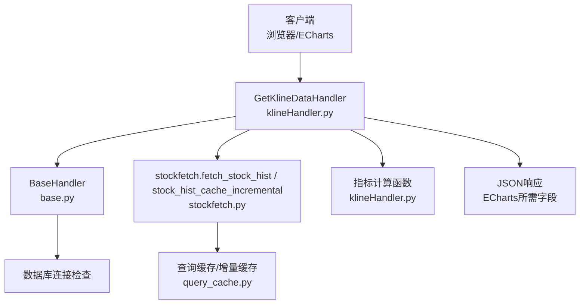
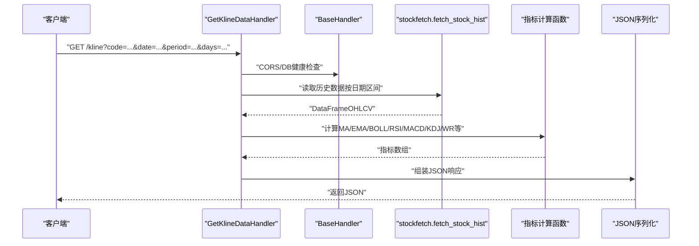
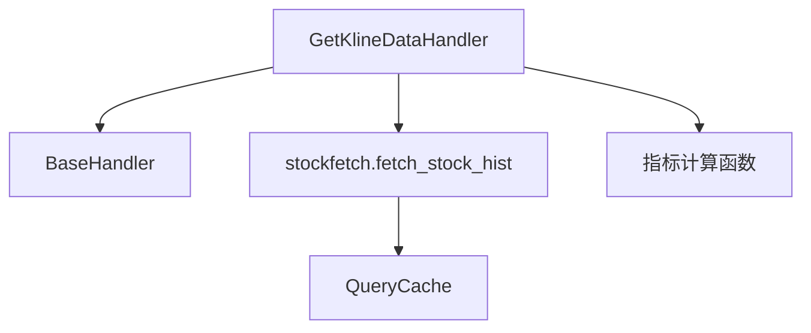

# K线数据API

<cite>
**本文引用的文件**
- [quantia/web/klineHandler.py](file://quantia/web/klineHandler.py)
- [quantia/core/stockfetch.py](file://quantia/core/stockfetch.py)
- [quantia/lib/query_cache.py](file://quantia/lib/query_cache.py)
- [quantia/web/base.py](file://quantia/web/base.py)
- [quantia/core/kline/visualization.py](file://quantia/core/kline/visualization.py)
</cite>

## 目录
1. [简介](#简介)
2. [项目结构](#项目结构)
3. [核心组件](#核心组件)
4. [架构总览](#架构总览)
5. [详细组件分析](#详细组件分析)
6. [依赖分析](#依赖分析)
7. [性能考量](#性能考量)
8. [故障排查指南](#故障排查指南)
9. [结论](#结论)
10. [附录](#附录)

## 简介
本文件为 Quantia 项目的 K线数据API 文档，聚焦于提供前端 ECharts 所需的K线数据（OHLCV + 技术指标）的 JSON 接口。内容涵盖：
- API 端点功能与参数
- 时间周期与数据范围设置
- 不同时序周期（日线、周线、月线、季线、年线）的数据获取方式
- 响应数据格式规范、技术分析参数与可视化支持
- JSON 响应结构、字段定义与数据压缩策略
- 实时更新机制、历史数据备份与数据完整性保障

## 项目结构
与 K线数据API 相关的关键文件与职责如下：
- quantia/web/klineHandler.py：K线数据API处理器，负责接收参数、调用历史数据读取、计算技术指标、返回JSON
- quantia/core/stockfetch.py：历史数据抓取与缓存增量更新逻辑，提供按日期区间的股票/ETF历史数据
- quantia/lib/query_cache.py：查询缓存模块，为Web API提供内存LRU+TTL缓存
- quantia/web/base.py：基础Handler，提供CORS与数据库连接检查
- quantia/core/kline/visualization.py：Bokeh可视化（历史页面）相关，展示K线、均线、成交量与技术指标

图表来源
- [quantia/web/klineHandler.py](file://quantia/web/klineHandler.py#L212-L360)
- [quantia/web/base.py](file://quantia/web/base.py#L14-L37)
- [quantia/core/stockfetch.py](file://quantia/core/stockfetch.py#L744-L782)
- [quantia/lib/query_cache.py](file://quantia/lib/query_cache.py#L27-L156)

章节来源
- [quantia/web/klineHandler.py](file://quantia/web/klineHandler.py#L1-L360)
- [quantia/core/stockfetch.py](file://quantia/core/stockfetch.py#L1-L800)
- [quantia/lib/query_cache.py](file://quantia/lib/query_cache.py#L1-L156)
- [quantia/web/base.py](file://quantia/web/base.py#L1-L48)
- [quantia/core/kline/visualization.py](file://quantia/core/kline/visualization.py#L1-L275)

## 核心组件
- K线数据处理器：解析参数、读取历史数据、按周期重采样、计算技术指标、序列化为JSON
- 历史数据抓取与缓存：支持增量缓存、多数据源回退、单位转换与ROCR计算
- 查询缓存：LRU+TTL，减少重复查询，提升响应速度
- 基础Handler：CORS支持与数据库连接健康检查
- 可视化支持：历史页面的Bokeh可视化（非实时API，但与指标体系一致）

章节来源
- [quantia/web/klineHandler.py](file://quantia/web/klineHandler.py#L212-L360)
- [quantia/core/stockfetch.py](file://quantia/core/stockfetch.py#L744-L782)
- [quantia/lib/query_cache.py](file://quantia/lib/query_cache.py#L27-L156)
- [quantia/web/base.py](file://quantia/web/base.py#L14-L37)
- [quantia/core/kline/visualization.py](file://quantia/core/kline/visualization.py#L29-L275)

## 架构总览
K线数据API的调用链路如下：

图表来源
- [quantia/web/klineHandler.py](file://quantia/web/klineHandler.py#L237-L354)
- [quantia/web/base.py](file://quantia/web/base.py#L16-L36)
- [quantia/core/stockfetch.py](file://quantia/core/stockfetch.py#L755-L782)

## 详细组件分析

### API端点与参数
- 端点：GET /kline
- 请求参数
  - code：股票代码（必填）
  - date：日期（可选，默认今日）
  - period：周期（可选，默认 daily；可选 weekly/monthly/quarterly/yearly）
  - days：返回天数（可选，不设置则返回全部可用数据）
  - name：股票名称（可选）
- 响应：JSON对象，包含基础信息与K线及技术指标数组

章节来源
- [quantia/web/klineHandler.py](file://quantia/web/klineHandler.py#L212-L243)
- [quantia/web/klineHandler.py](file://quantia/web/klineHandler.py#L237-L354)

### 时间周期与数据范围
- 周期映射
  - daily：原样返回日线
  - weekly：按周重采样（周五结算）
  - monthly：按月重采样
  - quarterly：按季度重采样
  - yearly：按年重采样
- 数据范围
  - 默认读取最大历史窗口（years=50）以确保覆盖全部可用数据
  - 可通过 days 参数限制返回长度（尾部截取）

章节来源
- [quantia/web/klineHandler.py](file://quantia/web/klineHandler.py#L262-L280)
- [quantia/web/klineHandler.py](file://quantia/web/klineHandler.py#L172-L209)

### 技术分析参数与指标
- 移动平均线（MA）：ma5/ma10/ma20/ma60
- 成交量均值（VOL MA）：vol_ma5/vol_ma10
- 布林带（BOLL）：upper/middle/lower
- RSI（相对强弱指数）：rsi（周期14）
- MACD：dif/dea/histogram（fast=12/slow=26/signal=9）
- KDJ：k/d/j（n=9,m1=3,m2=3）
- 威廉指标（WR）：wr6/wr10

章节来源
- [quantia/web/klineHandler.py](file://quantia/web/klineHandler.py#L36-L170)
- [quantia/web/klineHandler.py](file://quantia/web/klineHandler.py#L300-L313)

### JSON响应结构与字段定义
- 基础字段
  - code：股票代码
  - name：股票名称
  - period：周期
  - total：数据总条数
- 时间与价格
  - dates：日期数组（字符串）
  - ohlc：K线数组，每项为[开盘, 收盘, 最低, 最高]
  - volumes：成交量数组（整型）
- 技术指标
  - ma：{ma5, ma10, ma20, ma60}
  - vol_ma：{ma5, ma10}
  - boll：{upper, middle, lower}
  - rsi：数组
  - macd：{dif, dea, histogram}
  - kdj：{k, d, j}
  - wr：{wr6, wr10}

章节来源
- [quantia/web/klineHandler.py](file://quantia/web/klineHandler.py#L314-L352)

### 数据压缩策略
- 响应采用标准JSON序列化，未见专用压缩算法
- 指标数值在计算时进行精度控制（如保留小数位），有助于减小体积
- 前端可通过ECharts的dataZoom进行交互式缩放，减少一次性传输的数据量

章节来源
- [quantia/web/klineHandler.py](file://quantia/web/klineHandler.py#L23-L33)
- [quantia/web/klineHandler.py](file://quantia/web/klineHandler.py#L290-L298)

### 实时更新机制
- 历史数据接口默认读取最大历史窗口（years=50），以保证返回全量数据
- 实时性取决于历史数据采集任务与缓存策略
- 查询缓存提供短期命中能力，减少数据库压力

章节来源
- [quantia/web/klineHandler.py](file://quantia/web/klineHandler.py#L254-L259)
- [quantia/lib/query_cache.py](file://quantia/lib/query_cache.py#L27-L156)

### 历史数据备份与完整性
- 历史数据通过增量缓存与多数据源回退机制保障可用性
- 单次请求默认使用最大历史窗口，确保覆盖全部可用数据
- 指标计算基于清洗后的OHLCV数组，缺失值统一处理为None/0

章节来源
- [quantia/core/stockfetch.py](file://quantia/core/stockfetch.py#L755-L782)
- [quantia/web/klineHandler.py](file://quantia/web/klineHandler.py#L295-L298)

### 可视化支持
- 历史页面使用Bokeh进行可视化，包含K线、均线、成交量与技术指标面板
- 与API一致的技术指标体系，便于前后端一致性验证

章节来源
- [quantia/core/kline/visualization.py](file://quantia/core/kline/visualization.py#L29-L275)

## 依赖分析
- 处理器依赖
  - BaseHandler：CORS与数据库连接检查
  - stockfetch：历史数据读取与缓存
  - 指标计算函数：内置在klineHandler.py中
- 缓存依赖
  - QueryCache：LRU+TTL，减少重复查询

图表来源
- [quantia/web/klineHandler.py](file://quantia/web/klineHandler.py#L16-L18)
- [quantia/web/base.py](file://quantia/web/base.py#L14-L37)
- [quantia/core/stockfetch.py](file://quantia/core/stockfetch.py#L755-L782)
- [quantia/lib/query_cache.py](file://quantia/lib/query_cache.py#L27-L156)

章节来源
- [quantia/web/klineHandler.py](file://quantia/web/klineHandler.py#L1-L360)
- [quantia/web/base.py](file://quantia/web/base.py#L1-L48)
- [quantia/core/stockfetch.py](file://quantia/core/stockfetch.py#L1-L800)
- [quantia/lib/query_cache.py](file://quantia/lib/query_cache.py#L1-L156)

## 性能考量
- 指标计算为纯Python循环，适合中小规模数据；大规模数据建议前端分页或后端分段
- 响应JSON未启用压缩，建议在部署层启用Gzip/Deflate
- 查询缓存命中率与TTL设置影响延迟，可根据业务调整
- 多数据源回退与健康度追踪减少失败重试带来的抖动

## 故障排查指南
- 缺少参数 code：返回400与错误信息
- 缓存未命中：提示“无K线数据（缓存未命中，请确认数据采集任务已运行）”
- 异常处理：捕获异常并返回500与错误信息
- CORS问题：确认响应头已设置允许跨域
- 数据源失败：查看日志中的聚合失败信息与健康度降级记录

章节来源
- [quantia/web/klineHandler.py](file://quantia/web/klineHandler.py#L245-L248)
- [quantia/web/klineHandler.py](file://quantia/web/klineHandler.py#L257-L259)
- [quantia/web/klineHandler.py](file://quantia/web/klineHandler.py#L356-L359)
- [quantia/web/base.py](file://quantia/web/base.py#L16-L21)

## 结论
本API以简洁的参数与标准JSON响应满足前端ECharts的K线与技术指标需求。通过历史数据的最大窗口读取、周期重采样与内置指标计算，能够快速返回全量数据供视图缩放。结合查询缓存与多数据源回退机制，具备较好的稳定性与可维护性。

## 附录

### API定义（端点与参数）
- 方法：GET
- 路径：/kline
- 查询参数：
  - code（必填）
  - date（可选，默认今日）
  - period（可选，默认daily；可选weekly/monthly/quarterly/yearly）
  - days（可选）
  - name（可选）

章节来源
- [quantia/web/klineHandler.py](file://quantia/web/klineHandler.py#L212-L243)

### 响应字段说明
- 基础：code, name, period, total
- 时间与价格：dates, ohlc, volumes
- 技术指标：ma, vol_ma, boll, rsi, macd, kdj, wr

章节来源
- [quantia/web/klineHandler.py](file://quantia/web/klineHandler.py#L314-L352)
