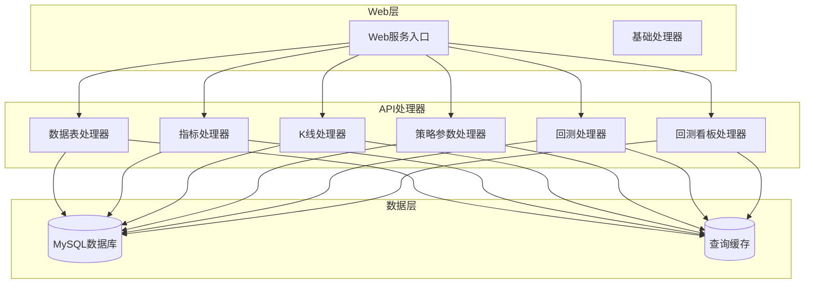
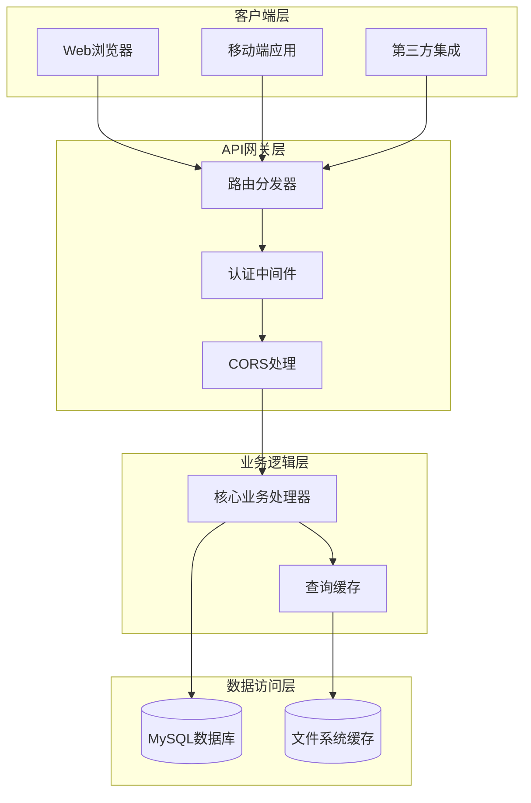
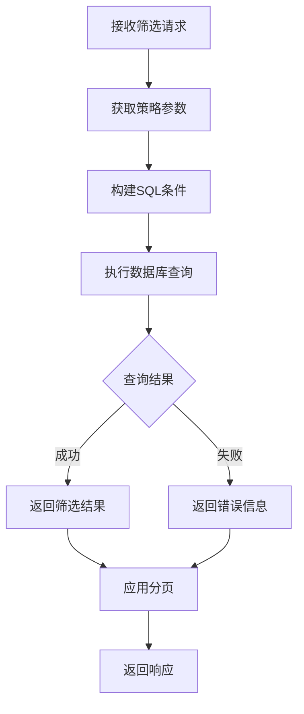
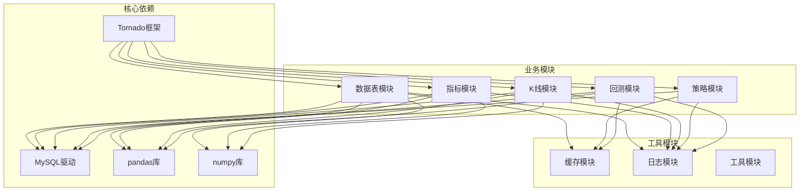
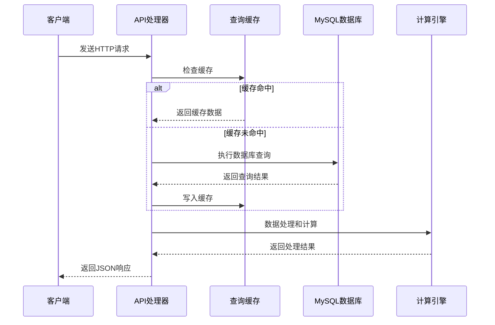
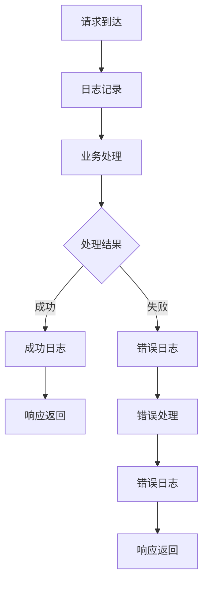

# RESTful API设计

<cite>
**本文档引用的文件**
- [API参考文档](file://document/API_REFERENCE.md)
- [Web服务入口](file://docker/stock/quantia/web/web_service.py)
- [基础处理器](file://docker/stock/quantia/web/base.py)
- [数据表处理器](file://docker/stock/quantia/web/dataTableHandler.py)
- [指标处理器](file://docker/stock/quantia/web/dataIndicatorsHandler.py)
- [K线处理器](file://docker/stock/quantia/web/klineHandler.py)
- [策略参数处理器](file://docker/stock/quantia/web/strategyParamsHandler.py)
- [回测处理器](file://docker/stock/quantia/web/backtestHandler.py)
- [回测看板处理器](file://docker/stock/quantia/web/backtestDashboardHandler.py)
</cite>

## 目录
1. [引言](#引言)
2. [项目结构](#项目结构)
3. [核心组件](#核心组件)
4. [架构概览](#架构概览)
5. [详细组件分析](#详细组件分析)
6. [依赖关系分析](#依赖关系分析)
7. [性能考虑](#性能考虑)
8. [故障排除指南](#故障排除指南)
9. [结论](#结论)

## 引言

Quantia RESTful API设计旨在为量化投资系统提供标准化的Web API接口，支持股票数据查询、技术指标分析、K线数据可视化和策略回测等功能。该API设计遵循RESTful原则，采用统一的URL命名规范和HTTP状态码标准，确保接口的一致性和可维护性。

## 项目结构

系统采用模块化架构设计，主要包含以下核心模块：



**图表来源**
- [Web服务入口](file://docker/stock/quantia/web/web_service.py#L53-L97)
- [基础处理器](file://docker/stock/quantia/web/base.py#L14-L36)

**章节来源**
- [Web服务入口](file://docker/stock/quantia/web/web_service.py#L53-L97)
- [基础处理器](file://docker/stock/quantia/web/base.py#L14-L36)

## 核心组件

### API路由管理

系统采用Tornado框架的路由机制，统一管理所有API端点：

| API类别 | 路由模式 | 处理器 |
|---------|----------|--------|
| 数据表API | `/quantia/api_data` | GetStockDataHandler |
| 交易日期API | `/quantia/api/trade_date` | GetTradeDateHandler |
| 指标图表API | `/quantia/data/indicators` | GetDataIndicatorsHandler |
| 关注管理API | `/quantia/control/attention` | SaveCollectHandler |
| 策略参数API | `/quantia/api/strategy/*` | StrategyParamsHandler系列 |
| K线数据API | `/quantia/api/kline` | GetKlineDataHandler |
| 回测API | `/quantia/api/backtest/*` | BacktestHandler系列 |
| 回测看板API | `/quantia/api/backtest/dashboard/*` | BacktestDashboardHandler系列 |

**章节来源**
- [Web服务入口](file://docker/stock/quantia/web/web_service.py#L56-L87)

### CORS跨域支持

基础处理器实现了完整的CORS支持，确保API可以从任何域名访问：

- 允许的源：`*`（所有域名）
- 允许的方法：`POST, GET, OPTIONS, DELETE, PUT`
- 允许的头部：`x-requested-with, content-type`
- 预检请求缓存：3600秒

**章节来源**
- [基础处理器](file://docker/stock/quantia/web/base.py#L16-L26)

## 架构概览

系统采用分层架构设计，确保关注点分离和代码可维护性：



**图表来源**
- [Web服务入口](file://docker/stock/quantia/web/web_service.py#L53-L97)
- [基础处理器](file://docker/stock/quantia/web/base.py#L14-L36)

## 详细组件分析

### 数据表API设计

#### 核心功能
数据表API提供统一的数据查询接口，支持多种数据表的查询、过滤和分页功能。

#### URL规范
```
GET /quantia/api_data
```

#### 请求参数

| 参数名 | 类型 | 必填 | 默认值 | 说明 |
|--------|------|------|--------|------|
| name | string | 是 | - | 数据表名称 |
| date | string | 否 | - | 日期 (YYYY-MM-DD) |
| page | string | 否 | - | 页码 |
| page_size | string | 否 | - | 每页大小 |
| keyword | string | 否 | - | 搜索关键词 |

#### 支持的数据表

| 表名 | 描述 | 主要字段 |
|------|------|----------|
| cn_stock_spot | 每日股票数据 | date, code, name, new_price, change_rate |
| cn_stock_indicators | 技术指标数据 | date, code, macd, kdjk, rsi |
| cn_stock_strategy_* | 策略选股数据 | date, code, name, 各策略特定字段 |
| cn_stock_backtest | 回测汇总数据 | date, strategy_name, stock_count, success_rate |
| cn_stock_selection | 综合选股数据 | date, code, name, 各筛选条件字段 |

#### 响应格式

```json
{
    "columns": ["date", "code", "name", "new_price"],
    "data": [
        {
            "date": "2024-01-15",
            "code": "000001",
            "name": "平安银行",
            "new_price": 10.50
        }
    ],
    "total": 5000,
    "actual_date": "2024-01-15"
}
```

#### 错误处理

| HTTP状态码 | 错误类型 | 描述 |
|------------|----------|------|
| 400 | 参数错误 | 缺少必要参数或参数格式不正确 |
| 404 | 资源不存在 | 数据表不存在或查询不到数据 |
| 500 | 服务器内部错误 | 数据库查询异常或系统错误 |

**章节来源**
- [数据表处理器](file://docker/stock/quantia/web/dataTableHandler.py#L54-L214)

### 指标数据API设计

#### 核心功能
提供股票技术指标的可视化展示，支持多种图表类型的组合显示。

#### URL规范
```
GET /quantia/data/indicators
```

#### 请求参数

| 参数名 | 类型 | 必填 | 默认值 | 说明 |
|--------|------|------|--------|------|
| code | string | 是 | - | 股票代码 (如: 000001) |
| date | string | 否 | - | 日期 (YYYY-MM-DD) |
| name | string | 否 | - | 股票名称 |

#### 支持的图表类型

| 图表类型 | 描述 | 包含指标 |
|----------|------|----------|
| K线图 | 日K线数据 | 开盘价、收盘价、最高价、最低价 |
| 成交量图 | 成交量数据 | 成交量、成交量均线 |
| 技术指标图 | MACD、KDJ、RSI等 | 各种技术分析指标 |
| 筹码分布图 | 筹码成本分布 | 成本分布、持仓比例 |

#### 响应格式
返回包含HTML片段的响应，用于前端动态渲染图表组件。

**章节来源**
- [指标处理器](file://docker/stock/quantia/web/dataIndicatorsHandler.py#L16-L41)

### K线数据API设计

#### 核心功能
提供标准化的K线数据接口，支持多种时间周期和技术指标计算。

#### URL规范
```
GET /quantia/api/kline
```

#### 请求参数

| 参数名 | 类型 | 必填 | 默认值 | 说明 |
|--------|------|------|--------|------|
| code | string | 是 | - | 股票代码 |
| date | string | 否 | 当前日期 | 日期 (YYYY-MM-DD) |
| period | string | 否 | daily | 时间周期 (daily/weekly/monthly) |
| days | string | 否 | - | 返回天数 |
| name | string | 否 | - | 股票名称 |

#### 支持的时间周期

| 周期代码 | 描述 | pandas重采样规则 |
|----------|------|------------------|
| daily | 日线 | None (保持原始日线) |
| weekly | 周线 | 'W-FRI' |
| monthly | 月线 | 'ME' |
| quarterly | 季线 | 'QE' |
| yearly | 年线 | 'YE' |

#### 返回的指标数据

| 指标类别 | 字段名称 | 描述 |
|----------|----------|------|
| 价格数据 | dates, ohlc, volumes | 日期、开盘收盘高低、成交量 |
| 移动平均线 | ma5, ma10, ma20, ma60 | 不同周期的移动平均线 |
| 成交量均线 | vol_ma5, vol_ma10 | 成交量移动平均线 |
| 布林带 | boll.upper, boll.middle, boll.lower | 布林带上下轨和中轨 |
| RSI指标 | rsi | 相对强弱指数 |
| MACD指标 | macd.dif, macd.dea, macd.histogram | MACD快慢线和柱状图 |
| KDJ指标 | kdj.k, kdj.d, kdj.j | 随机指标KDJ |
| 威廉指标 | wr.wr10, wr.wr6 | 威廉指标 |

#### 响应格式

```json
{
    "code": "000001",
    "name": "平安银行",
    "period": "daily",
    "total": 1000,
    "dates": ["2024-01-01", "2024-01-02", ...],
    "ohlc": [[10.5, 10.8, 10.3, 10.9], ...],
    "volumes": [1000000, 1200000, ...],
    "ma": {
        "ma5": [null, null, 10.6, 10.7, ...],
        "ma10": [null, null, null, 10.5, ...]
    },
    "boll": {
        "upper": [null, null, 11.0, 11.2, ...],
        "middle": [null, null, 10.6, 10.7, ...],
        "lower": [null, null, 10.2, 10.3, ...]
    }
}
```

**章节来源**
- [K线处理器](file://docker/stock/quantia/web/klineHandler.py#L212-L354)

### 策略参数API设计

#### 核心功能
提供策略参数的查询、保存、重置和动态筛选功能。

#### URL规范
```
GET /quantia/api/strategy/params
POST /quantia/api/strategy/params/save
POST /quantia/api/strategy/params/reset
GET /quantia/api/strategy/filter
```

#### 策略类型

| 策略名称 | 描述 | 参数组 |
|----------|------|--------|
| gpt_value | GPT综合选股 | 财务安全过滤、盈利能力筛选、成长质量筛选、估值约束 |
| moat_scoring | 护城河评分模型 | 盈利能力权重、成长能力权重、评级阈值、综合评分权重 |
| ai_model | AI模型配置 | API接口配置、模型参数 |

#### 参数配置结构

```json
{
    "strategy": "gpt_value",
    "params": {
        "debt_asset_ratio_max": 60,
        "roe_weight_min": 15,
        "sale_gpr_min": 25,
        "pe_min": 0,
        "pe_max": 50,
        "pbnewmrq_max": 10
    }
}
```

#### 动态筛选流程



**图表来源**
- [策略参数处理器](file://docker/stock/quantia/web/strategyParamsHandler.py#L663-L800)

**章节来源**
- [策略参数处理器](file://docker/stock/quantia/web/strategyParamsHandler.py#L563-L800)

### 回测API设计

#### 核心功能
提供灵活的回测执行和结果查询功能，支持单股回测和批量回测。

#### URL规范
```
GET /quantia/api/backtest/config
GET /quantia/api/backtest/run
GET /quantia/api/backtest/batch
```

#### 回测配置

| 配置项 | 值 | 描述 |
|--------|----|------|
| 回测周期 | 1w, 2w, 1m, 3m, 6m, 1y | 不同时间长度的回测窗口 |
| 默认持有期 | [1, 3, 5, 10, 20] | 支持的收益计算周期 |
| 最大持有期 | 100 | 表格模式下的最大持有天数 |

#### 单股回测参数

| 参数名 | 类型 | 必填 | 默认值 | 说明 |
|--------|------|------|--------|------|
| code | string | 是 | - | 股票代码 |
| strategy | string | 否 | - | 策略名称 |
| period | string | 否 | 1m | 回测周期 |
| start_date | string | 否 | - | 开始日期 |
| end_date | string | 否 | - | 结束日期 |
| checkpoints | string | 否 | 默认持有期 | 收益计算点 |

#### 批量回测参数

| 参数名 | 类型 | 必填 | 默认值 | 说明 |
|--------|------|------|--------|------|
| strategy | string | 是 | - | 策略名称 |
| period | string | 否 | 1m | 回测周期 |
| limit | string | 否 | 30 | 统计天数 |
| horizons | string | 否 | 默认持有期 | 汇总使用的持有天数列表 |
| success_days | string | 否 | - | 成功定义使用的持有天数 |

#### 回测结果格式

```json
{
    "code": "000001",
    "name": "平安银行",
    "period": "1个月",
    "buy_date": "2024-01-15",
    "buy_price": 10.50,
    "returns": [
        {"days": 1, "rate": 1.20, "price": 10.63},
        {"days": 5, "rate": 5.80, "price": 11.12}
    ],
    "max_return": 6.20,
    "max_drawdown": -2.10,
    "strategy_result": true,
    "indicators": {
        "kdjk": 65.2,
        "rsi_6": 68.5,
        "macd": 0.15
    }
}
```

**章节来源**
- [回测处理器](file://docker/stock/quantia/web/backtestHandler.py#L82-L289)

### 回测看板API设计

#### 核心功能
提供回测结果的可视化展示，支持跨策略对比、时间序列分析和收益分布统计。

#### URL规范
```
GET /quantia/api/backtest/dashboard/overview
GET /quantia/api/backtest/dashboard/timeline
GET /quantia/api/backtest/dashboard/strategy_detail
GET /quantia/api/backtest/dashboard/distribution
GET /quantia/api/backtest/dashboard/trade_pairs
```

#### 日期范围处理

系统支持灵活的日期范围查询，优先级如下：

1. 显式日期范围：`start_date` 和 `end_date`
2. 最近N个交易日：`days` 参数
3. 默认范围：根据具体接口的默认值

#### 跨策略总览

返回多个策略在指定时间范围内的表现对比：

```json
{
    "date_range": {"start": "2024-01-01", "end": "2024-01-31", "count": 20},
    "horizons": [1, 3, 5, 10, 20],
    "metric_horizon": 5,
    "items": [
        {
            "strategy_name": "cn_stock_strategy_enter",
            "strategy_cn": "放量上涨",
            "type": "strategy",
            "total_signals": 123,
            "avg_success_rate": 56.78,
            "avg_returns": {"1d": 0.12, "3d": 0.56, "5d": 1.23, "10d": 2.34, "20d": 3.21},
            "best_day": "2024-01-15",
            "worst_day": "2024-01-20"
        }
    ]
}
```

#### 时间序列分析

返回单个或多个策略在时间维度上的表现：

```json
{
    "date_range": {"start": "2024-01-01", "end": "2024-01-31", "count": 20},
    "horizon": 5,
    "series": [
        {
            "strategy_name": "cn_stock_strategy_enter",
            "strategy_cn": "放量上涨",
            "data": [
                {"date": "2024-01-15", "value": 1.23},
                {"date": "2024-01-16", "value": 0.56}
            ]
        }
    ]
}
```

#### 收益分布统计

提供收益的直方图分布：

```json
{
    "strategy_name": "cn_stock_strategy_enter",
    "strategy_cn": "放量上涨",
    "date_range": {"start": "2024-01-01", "end": "2024-01-31", "count": 150},
    "horizon": 5,
    "bins": [
        {"range": "<-10%", "count": 3, "percentage": 2.0},
        {"range": "0%~5%", "count": 88, "percentage": 58.67}
    ],
    "total": 150
}
```

**章节来源**
- [回测看板处理器](file://docker/stock/quantia/web/backtestDashboardHandler.py#L360-L466)

## 依赖关系分析

### 组件耦合度分析



**图表来源**
- [Web服务入口](file://docker/stock/quantia/web/web_service.py#L34-L40)

### 数据流分析

系统采用事件驱动的数据流架构：



**图表来源**
- [数据表处理器](file://docker/stock/quantia/web/dataTableHandler.py#L123-L150)

**章节来源**
- [Web服务入口](file://docker/stock/quantia/web/web_service.py#L34-L40)

## 性能考虑

### 缓存策略

系统实现了多层次的缓存机制：

1. **查询缓存**：针对频繁查询的数据表结果进行缓存
2. **计算缓存**：对计算密集型指标进行缓存
3. **静态资源缓存**：前端静态资源的浏览器缓存

### 性能优化措施

| 优化方向 | 实现方式 | 性能提升 |
|----------|----------|----------|
| 数据库查询 | 分页查询、索引优化 | 减少查询时间 |
| 缓存命中 | LRU缓存、缓存失效策略 | 提高响应速度 |
| 并行处理 | 多线程并发执行 | 提升吞吐量 |
| 数据压缩 | Gzip压缩响应 | 减少网络传输 |

### 监控指标

系统监控关键性能指标：

- **响应时间**：API请求的平均响应时间
- **吞吐量**：每秒处理的请求数
- **缓存命中率**：缓存命中的比例
- **数据库连接数**：活跃的数据库连接数

## 故障排除指南

### 常见错误处理

#### 数据库连接问题
- **症状**：API返回500错误，数据库连接异常
- **解决方案**：检查数据库连接配置，重启数据库服务

#### 缓存失效问题
- **症状**：查询响应缓慢，缓存未生效
- **解决方案**：检查缓存配置，清理过期缓存

#### 参数验证错误
- **症状**：API返回400错误，参数格式不正确
- **解决方案**：检查请求参数格式，参考API文档

### 日志分析

系统提供详细的日志记录：



**图表来源**
- [基础处理器](file://docker/stock/quantia/web/base.py#L34-L36)

**章节来源**
- [基础处理器](file://docker/stock/quantia/web/base.py#L34-L36)

## 结论

Quantia RESTful API设计遵循了现代Web API的最佳实践，具有以下特点：

1. **一致性**：统一的URL命名规范和响应格式
2. **可扩展性**：模块化的架构设计，易于功能扩展
3. **性能优化**：多层次缓存和查询优化
4. **错误处理**：完善的错误处理和日志记录机制
5. **安全性**：CORS跨域支持和参数验证

该API设计为量化投资系统提供了完整的技术支持，能够满足不同规模和复杂度的应用需求。通过合理的架构设计和性能优化，系统能够在保证功能完整性的同时，提供高效的API服务。
