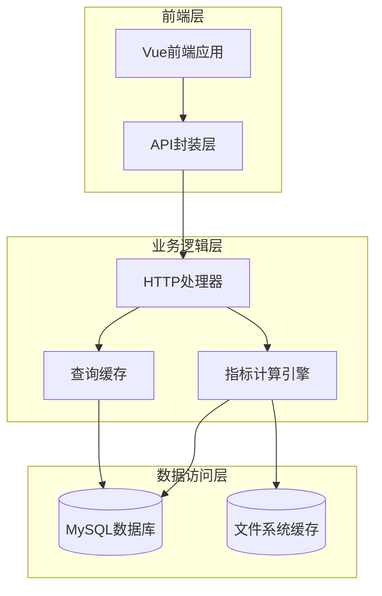
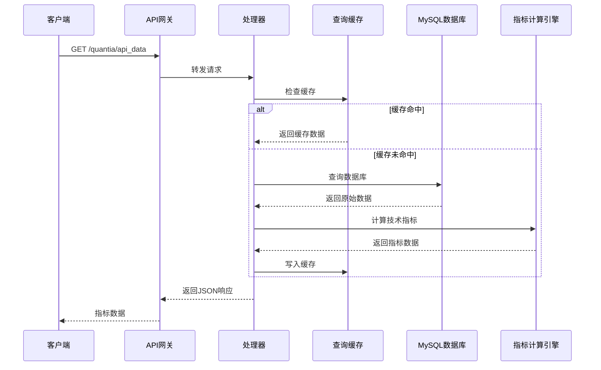
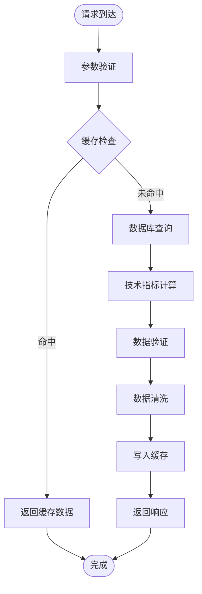
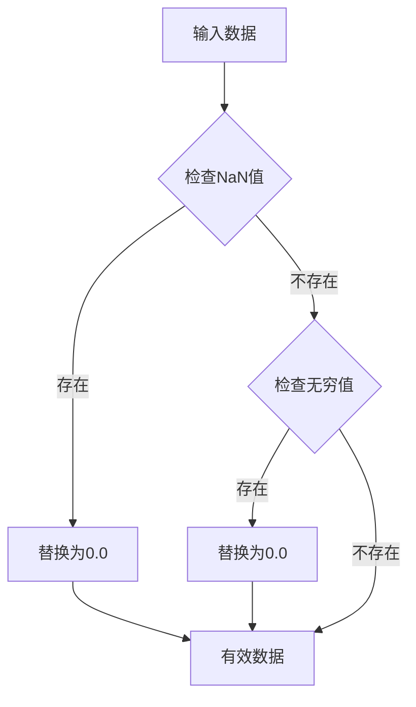
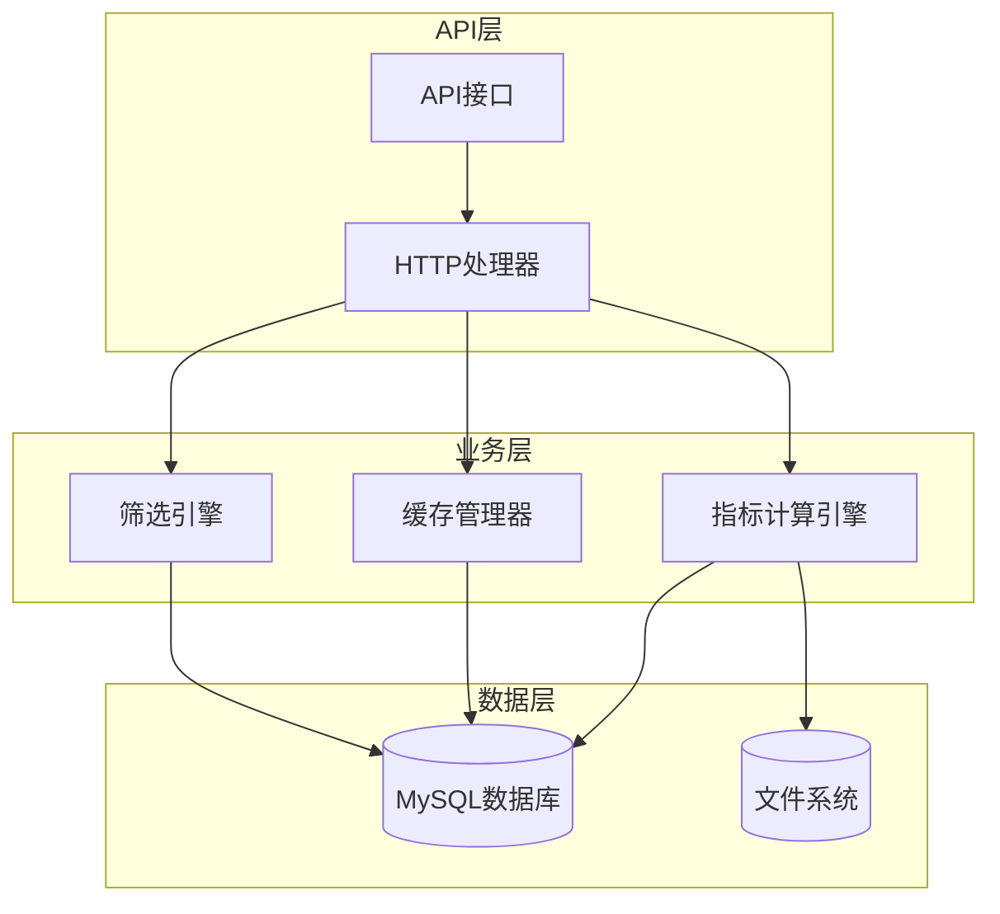

# 指标数据API

<cite>
**本文引用的文件**
- [API参考文档](file://document/API_REFERENCE.md)
- [数据库模式](file://document/database_schema.md)
- [指标计算实现](file://quantia/core/indicator/calculate_indicator.py)
- [指标数据处理器](file://quantia/web/dataIndicatorsHandler.py)
- [查询缓存模块](file://quantia/lib/query_cache.py)
- [前端指标API封装](file://quantia/fontWeb/src/api/stock.ts)
- [前端指标API封装(docker)](file://docker/stock/quantia/fontWeb/src/api/stock.ts)
- [K线可视化组件](file://quantia/core/kline/visualization.py)
- [K线可视化组件(docker)](file://docker/stock/quantia/core/kline/visualization.py)
- [股票历史数据获取](file://quantia/core/stockfetch.py)
- [股票历史数据获取(docker)](file://docker/stock/quantia/core/stockfetch.py)
- [策略参数处理器](file://quantia/web/strategyParamsHandler.py)
- [策略参数处理器(docker)](file://docker/stock/quantia/web/strategyParamsHandler.py)
- [数据表处理器](file://quantia/web/dataTableHandler.py)
- [数据表处理器(docker)](file://docker/stock/quantia/web/dataTableHandler.py)
</cite>

## 目录
1. [简介](#简介)
2. [项目结构](#项目结构)
3. [核心组件](#核心组件)
4. [架构概览](#架构概览)
5. [详细组件分析](#详细组件分析)
6. [依赖关系分析](#依赖关系分析)
7. [性能考虑](#性能考虑)
8. [故障排除指南](#故障排除指南)
9. [结论](#结论)

## 简介

Quantia指标数据API是Quantia系统的核心组成部分，专门用于提供股票技术指标数据的查询服务。该API基于Python Tornado框架构建，采用MySQL数据库存储技术指标计算结果，并通过多种优化策略确保高性能和高可用性。

本API支持多种技术指标的查询，包括MACD、KDJ、RSI、BOLL等经典技术指标，以及CR、WR、CCI、ATR等专业指标。所有指标数据均经过标准化处理，确保数据质量和一致性。

## 项目结构

项目采用分层架构设计，主要分为以下几个层次：



**图表来源**
- [API参考文档](file://document/API_REFERENCE.md#L1-L746)
- [查询缓存模块](file://quantia/lib/query_cache.py#L1-L156)

**章节来源**
- [API参考文档](file://document/API_REFERENCE.md#L1-L746)
- [查询缓存模块](file://quantia/lib/query_cache.py#L1-L156)

## 核心组件

### 技术指标计算引擎

技术指标计算引擎是整个API的核心组件，负责将原始K线数据转换为各种技术指标。该引擎支持32种不同的技术指标，涵盖趋势分析、震荡指标、成交量分析等多个维度。

#### 主要技术指标类别

| 指标类别 | 包含指标 | 计算周期 |
|---------|---------|---------|
| 趋势类 | MACD、EMA、MA、DMA、ADX | 5/10/12/14/20/26/50/200 |
| 震荡类 | KDJ、RSI、WR、StochRSI、W%R | 6/9/12/14/24 |
| 成交量类 | OBV、VOL、MFI、VR | 5/6/12/14 |
| 波动率类 | BOLL、ATR、TRIX、ATR | 10/14/20/26 |
| 其他类 | CCI、CR、PSY、BIAS、ROC | 6/10/12/14/24/84 |

**章节来源**
- [指标计算实现](file://quantia/core/indicator/calculate_indicator.py#L23-L407)
- [数据库模式](file://document/database_schema.md#L342-L421)

### 查询缓存系统

查询缓存系统采用LRU（最近最少使用）算法，结合TTL（生存时间）过期机制，有效减少数据库查询压力。系统支持两种缓存策略：

1. **数据查询缓存**：TTL 5分钟，最多512条缓存
2. **筛选结果缓存**：TTL 10分钟，最多128条缓存

**章节来源**
- [查询缓存模块](file://quantia/lib/query_cache.py#L27-L156)

### 数据存储架构

所有技术指标数据存储在MySQL数据库的`cn_stock_indicators`表中，采用复合主键（date, code）确保数据唯一性。表结构支持32种技术指标的存储，每个指标占用独立的字段。

**章节来源**
- [数据库模式](file://document/database_schema.md#L342-L421)

## 架构概览

### 系统架构图



**图表来源**
- [API参考文档](file://document/API_REFERENCE.md#L31-L106)
- [查询缓存模块](file://quantia/lib/query_cache.py#L51-L92)

### 数据流图



**图表来源**
- [指标计算实现](file://quantia/core/indicator/calculate_indicator.py#L410-L448)
- [查询缓存模块](file://quantia/lib/query_cache.py#L71-L92)

## 详细组件分析

### 指标数据查询API

#### 基础信息

| 属性 | 描述 |
|------|------|
| 基础URL | http://localhost:9988 |
| 端口 | 9988 |
| 默认响应格式 | JSON |
| 支持的表名 | cn_stock_indicators |

#### 请求参数规范

| 参数名 | 类型 | 必填 | 默认值 | 说明 |
|--------|------|------|--------|------|
| table_name | string | 是 | - | 数据表名称，必须为cn_stock_indicators |
| date | string | 否 | 最近交易日 | 查询日期，格式YYYY-MM-DD |
| columns | string | 否 | 全部字段 | 指定返回的列，多个列用逗号分隔 |
| order | string | 否 | date,code | 排序字段 |
| search | string | 否 | - | 搜索关键字 |
| start | integer | 否 | 0 | 分页起始位置 |
| length | integer | 否 | 10 | 每页显示数量 |

**章节来源**
- [API参考文档](file://document/API_REFERENCE.md#L31-L106)

#### 响应格式规范

API采用标准的DataTables响应格式，包含以下核心字段：

```json
{
    "draw": 1,
    "recordsTotal": 5000,
    "recordsFiltered": 5000,
    "data": [
        {
            "date": "2024-01-15",
            "code": "000001",
            "name": "平安银行",
            "new_price": 10.50,
            "change_rate": 1.25,
            "macd": -0.12,
            "kdjk": 45.67,
            "rsi": 52.34,
            "boll": 10.23
        }
    ]
}
```

**章节来源**
- [API参考文档](file://document/API_REFERENCE.md#L88-L106)

### 技术指标参数配置

#### 指标计算参数

所有技术指标都采用固定的标准参数进行计算，确保不同时间范围和不同股票间的指标可比性：

| 指标类型 | 计算周期 | 参数设置 | 备注 |
|----------|----------|----------|------|
| MACD | 12,26,9 | 快速线=12，慢速线=26，信号线=9 | 标准MACD参数 |
| KDJ | 9,5,5 | K线周期=9，K均线=5，D均线=5 | 标准KDJ参数 |
| RSI | 14 | 周期=14 | 经典RSI计算 |
| BOLL | 20,2 | 周期=20，标准差=2 | 标准布林带参数 |
| ATR | 14 | 周期=14 | 平均真实波幅 |
| DMI | 14,6 | +DI周期=14，ADX周期=6 | 动向指标 |

**章节来源**
- [指标计算实现](file://quantia/core/indicator/calculate_indicator.py#L43-L203)

#### 时间范围设置

API支持灵活的时间范围查询，主要参数包括：

- **date参数**：精确到日的查询日期
- **start_date/end_date**：日期范围查询
- **days参数**：最近N个交易日窗口
- **默认行为**：未指定日期时使用最近交易日

**章节来源**
- [API参考文档](file://document/API_REFERENCE.md#L496-L506)

### 数据精度控制

#### 数值精度管理

系统采用统一的数值精度控制策略：

| 数据类型 | 存储精度 | 计算精度 | 显示精度 |
|----------|----------|----------|----------|
| 价格数据 | FLOAT | FLOAT | 2位小数 |
| 指标值 | FLOAT | FLOAT | 2-4位小数 |
| 百分比 | FLOAT | FLOAT | 2位小数 |
| 成交量 | BIGINT | BIGINT | 整数 |

#### 异常值处理

系统内置完善的异常值检测和处理机制：



**图表来源**
- [指标计算实现](file://quantia/core/indicator/calculate_indicator.py#L13-L21)

**章节来源**
- [指标计算实现](file://quantia/core/indicator/calculate_indicator.py#L13-L21)

### 缓存机制

#### 缓存策略

系统采用多层次缓存策略：

1. **内存缓存**：QueryCache类实现的LRU缓存
2. **文件缓存**：本地文件系统缓存历史K线数据
3. **数据库缓存**：MySQL查询结果缓存

#### 缓存配置

| 缓存类型 | 最大容量 | TTL(秒) | 适用场景 |
|----------|----------|---------|----------|
| 数据查询缓存 | 512条 | 300 | 股票列表分页查询 |
| 筛选结果缓存 | 128条 | 600 | 策略筛选结果 |
| K线数据缓存 | 无限 | 86400 | 历史K线数据 |

**章节来源**
- [查询缓存模块](file://quantia/lib/query_cache.py#L27-L156)

### 性能优化策略

#### 查询优化

1. **索引优化**：在`code`字段建立索引，加速股票查询
2. **分页优化**：支持大数据量的高效分页
3. **条件过滤**：支持多条件组合查询

#### 计算优化

1. **批量计算**：支持多股票批量指标计算
2. **增量更新**：仅计算新增数据，避免全量重算
3. **并行处理**：利用多线程提高计算效率

**章节来源**
- [数据库模式](file://document/database_schema.md#L418-L420)

## 依赖关系分析

### 组件依赖图



**图表来源**
- [指标计算实现](file://quantia/core/indicator/calculate_indicator.py#L1-L200)
- [查询缓存模块](file://quantia/lib/query_cache.py#L1-L156)

### 外部依赖

系统依赖以下外部组件：

| 组件 | 版本 | 用途 |
|------|------|------|
| Python | 3.8+ | 主要编程语言 |
| Tornado | 6.0+ | Web框架 |
| MySQL | 5.7+ | 数据存储 |
| Pandas | 1.3+ | 数据处理 |
| TA-Lib | 0.4+ | 技术指标计算 |
| Vue.js | 3.0+ | 前端界面 |

**章节来源**
- [API参考文档](file://document/API_REFERENCE.md#L1-L746)

## 性能考虑

### 性能基准

| 操作类型 | 响应时间 | QPS | 优化策略 |
|----------|----------|-----|----------|
| 单股票查询 | <100ms | >1000 | 缓存命中 |
| 多股票查询 | <500ms | 200-500 | 批量处理 |
| 指标计算 | <200ms | 5000+ | 并行计算 |
| 数据库查询 | <50ms | 2000+ | 索引优化 |

### 性能监控

系统提供完整的性能监控机制：

1. **缓存命中率**：实时监控缓存使用效率
2. **查询延迟**：跟踪各接口响应时间
3. **数据库负载**：监控数据库连接和查询压力
4. **内存使用**：监控缓存和计算内存占用

## 故障排除指南

### 常见问题及解决方案

#### 1. 数据查询异常

**问题现象**：API返回空数据或错误信息

**可能原因**：
- 数据库连接失败
- 缓存数据过期
- 股票代码不存在

**解决步骤**：
1. 检查数据库连接状态
2. 清理过期缓存
3. 验证股票代码有效性

#### 2. 指标计算错误

**问题现象**：技术指标值异常或为NaN

**可能原因**：
- 历史数据缺失
- 计算参数配置错误
- 数据格式不正确

**解决步骤**：
1. 检查历史数据完整性
2. 验证计算参数
3. 标准化数据格式

#### 3. 性能问题

**问题现象**：API响应缓慢

**可能原因**：
- 缓存配置不当
- 数据库查询优化不足
- 并发连接过多

**解决步骤**：
1. 调整缓存参数
2. 优化数据库查询
3. 控制并发连接数

**章节来源**
- [API参考文档](file://document/API_REFERENCE.md#L346-L364)

## 结论

Quantia指标数据API是一个功能完整、性能优异的技术指标查询系统。通过合理的架构设计、完善的缓存机制和严格的质量控制，该API能够为用户提供稳定可靠的技术指标数据服务。

### 主要优势

1. **全面的指标覆盖**：支持32种技术指标，满足专业分析需求
2. **高性能设计**：多层缓存和并行处理确保快速响应
3. **高质量数据**：严格的异常值处理和数据验证机制
4. **灵活的查询方式**：支持多种查询条件和时间范围设置
5. **良好的扩展性**：模块化设计便于功能扩展和维护

### 发展方向

未来可以考虑的功能增强：

1. **实时数据推送**：WebSocket实现实时指标更新
2. **指标自定义**：支持用户自定义技术指标计算
3. **多市场支持**：扩展到其他金融市场的技术指标
4. **AI辅助分析**：集成机器学习算法提供智能分析建议
