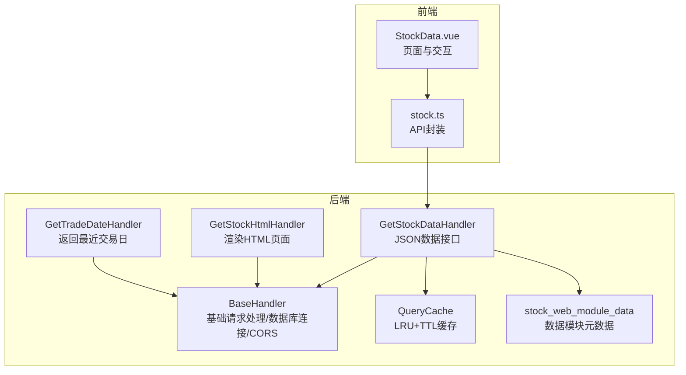
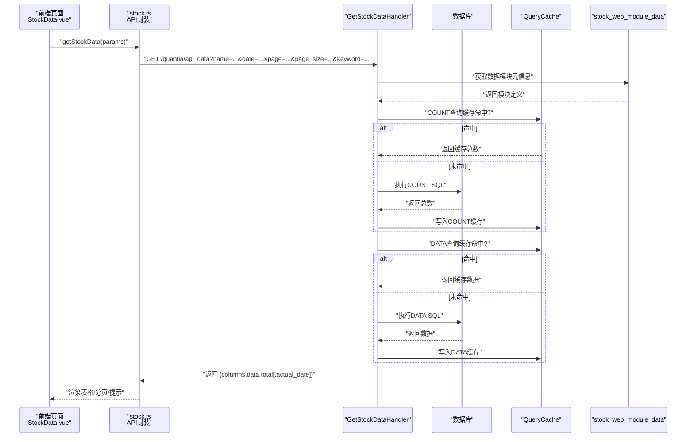
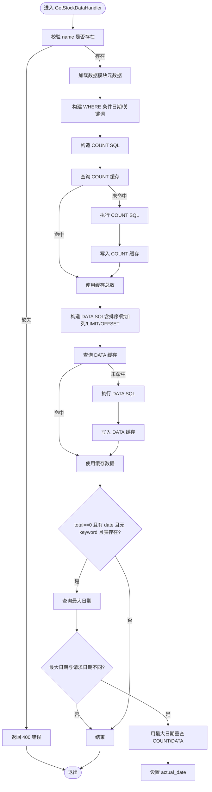
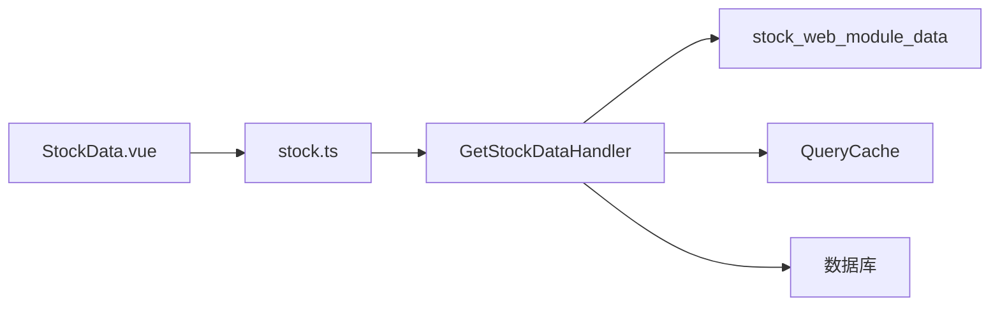

# 数据表格API

<cite>
**本文引用的文件**
- [quantia/web/dataTableHandler.py](file://quantia/web/dataTableHandler.py)
- [quantia/lib/query_cache.py](file://quantia/lib/query_cache.py)
- [quantia/core/singleton_stock_web_module_data.py](file://quantia/core/singleton_stock_web_module_data.py)
- [quantia/web/base.py](file://quantia/web/base.py)
- [document/API_REFERENCE.md](file://document/API_REFERENCE.md)
- [document/database_schema.md](file://document/database_schema.md)
- [quantia/fontWeb/src/views/stock/StockData.vue](file://quantia/fontWeb/src/views/stock/StockData.vue)
- [quantia/fontWeb/src/api/stock.ts](file://quantia/fontWeb/src/api/stock.ts)
</cite>

## 目录
1. [简介](#简介)
2. [项目结构](#项目结构)
3. [核心组件](#核心组件)
4. [架构概览](#架构概览)
5. [详细组件分析](#详细组件分析)
6. [依赖分析](#依赖分析)
7. [性能考虑](#性能考虑)
8. [故障排查指南](#故障排查指南)
9. [结论](#结论)
10. [附录](#附录)

## 简介
本文件面向 Quantia 项目的“数据表格API”，聚焦以下目标：
- 深入解释 GetStockDataHandler 与 GetStockHtmlHandler 的功能实现、请求参数规范与响应数据格式
- 详述表格数据查询的过滤条件、分页机制、排序规则与关键词搜索
- 说明日期参数处理、缓存策略、错误处理与数据回退机制
- 提供具体 API 调用示例、参数组合与响应格式说明
- 解释数据模块配置、列定义与权限控制机制

## 项目结构
围绕数据表格API的关键文件与职责如下：
- 后端 Handler 层：GetStockDataHandler、GetStockHtmlHandler、GetTradeDateHandler
- 基类与数据库连接：BaseHandler
- 查询缓存：QueryCache
- 数据模块元数据：stock_web_module_data（单例）
- 前端调用与展示：StockData.vue、stock.ts

**图表来源**
- [quantia/web/dataTableHandler.py](file://quantia/web/dataTableHandler.py#L35-L231)
- [quantia/web/base.py](file://quantia/web/base.py#L14-L36)
- [quantia/lib/query_cache.py](file://quantia/lib/query_cache.py#L27-L156)
- [quantia/core/singleton_stock_web_module_data.py](file://quantia/core/singleton_stock_web_module_data.py#L12-L279)
- [quantia/fontWeb/src/views/stock/StockData.vue](file://quantia/fontWeb/src/views/stock/StockData.vue#L75-L116)
- [quantia/fontWeb/src/api/stock.ts](file://quantia/fontWeb/src/api/stock.ts#L26-L69)

**章节来源**
- [quantia/web/dataTableHandler.py](file://quantia/web/dataTableHandler.py#L35-L231)
- [quantia/web/base.py](file://quantia/web/base.py#L14-L36)
- [quantia/lib/query_cache.py](file://quantia/lib/query_cache.py#L27-L156)
- [quantia/core/singleton_stock_web_module_data.py](file://quantia/core/singleton_stock_web_module_data.py#L12-L279)
- [quantia/fontWeb/src/views/stock/StockData.vue](file://quantia/fontWeb/src/views/stock/StockData.vue#L75-L116)
- [quantia/fontWeb/src/api/stock.ts](file://quantia/fontWeb/src/api/stock.ts#L26-L69)

## 核心组件
- GetStockHtmlHandler：根据数据模块名称渲染带 DataTables 的 HTML 页面，支持日期参数与实时/非实时日期选择。
- GetStockDataHandler：提供 JSON 数据接口，支持日期过滤、关键词搜索、分页、排序与缓存；具备“日期回退”与“ORDER BY 列不存在”的回退逻辑。
- GetTradeDateHandler：返回最近交易日与当前交易日（含未收盘），供前端初始化日期。
- BaseHandler：统一设置 CORS 头、检查并重连数据库连接。
- QueryCache：基于 MD5(SQL+参数) 的 LRU+TTL 内存缓存，支持命中统计与清理。
- stock_web_module_data：单例管理所有可用数据模块，包含表名、列定义、排序规则、是否实时等元信息。

**章节来源**
- [quantia/web/dataTableHandler.py](file://quantia/web/dataTableHandler.py#L35-L231)
- [quantia/web/base.py](file://quantia/web/base.py#L14-L36)
- [quantia/lib/query_cache.py](file://quantia/lib/query_cache.py#L27-L156)
- [quantia/core/singleton_stock_web_module_data.py](file://quantia/core/singleton_stock_web_module_data.py#L12-L279)

## 架构概览
数据表格API的典型调用链路如下：

**图表来源**
- [quantia/web/dataTableHandler.py](file://quantia/web/dataTableHandler.py#L54-L214)
- [quantia/lib/query_cache.py](file://quantia/lib/query_cache.py#L51-L92)
- [quantia/core/singleton_stock_web_module_data.py](file://quantia/core/singleton_stock_web_module_data.py#L275-L279)
- [quantia/fontWeb/src/api/stock.ts](file://quantia/fontWeb/src/api/stock.ts#L26-L32)
- [quantia/fontWeb/src/views/stock/StockData.vue](file://quantia/fontWeb/src/views/stock/StockData.vue#L75-L116)

## 详细组件分析

### GetStockDataHandler（数据接口）
- 功能概述
  - 接收 name、date、page、page_size、keyword 等参数
  - 校验必填参数与数据模块存在性
  - 构造 WHERE 条件（日期精确匹配）、LIKE 模糊匹配（代码/名称）
  - 应用模块定义的排序规则与附加列
  - 分页参数校验与 LIMIT/OFFSET 生成
  - 先 COUNT 后 DATA 的双查询策略，均走缓存
  - 异常处理：表不存在返回空数据、ORDER BY 列不存在时去排序重试
  - 日期回退：当按指定日期查不到且无关键词/表不存在时，自动回退到最大日期并重查
  - 响应包含 columns、data、total，若发生回退会额外返回 actual_date

- 请求参数规范
  - name：必须，对应数据模块标识（即表名）
  - date：可选，YYYY-MM-DD
  - page/page_size：可选，分页参数；非法时禁用分页
  - keyword：可选，模糊搜索代码或名称

- 响应数据格式
  - columns：列定义数组（来自模块元数据）
  - data：数据行数组
  - total：满足条件的总记录数
  - actual_date：当发生日期回退时返回实际使用的日期

- 关键流程图（日期回退与缓存）

**图表来源**
- [quantia/web/dataTableHandler.py](file://quantia/web/dataTableHandler.py#L54-L214)

**章节来源**
- [quantia/web/dataTableHandler.py](file://quantia/web/dataTableHandler.py#L54-L214)

### GetStockHtmlHandler（HTML页面）
- 功能概述
  - 根据 table_name 渲染带 DataTables 的 HTML 页面
  - 自动选择日期：实时模块使用当前交易日（含未收盘），非实时模块使用最近已收盘交易日
  - 生成左侧菜单（来自数据模块元数据）

- 请求参数
  - table_name：必须，对应数据模块标识
  - date：可选，影响页面默认日期显示

- 响应
  - HTML 页面（stock_web.html）

**章节来源**
- [quantia/web/dataTableHandler.py](file://quantia/web/dataTableHandler.py#L35-L51)
- [quantia/web/base.py](file://quantia/web/base.py#L46-L47)

### GetTradeDateHandler（最近交易日）
- 功能概述
  - 返回 run_date（最近已收盘交易日）与 run_date_nph（当前交易日，含未收盘）
  - 异常时回退到当天

- 响应
  - JSON：{"run_date":"YYYY-MM-DD","run_date_nph":"YYYY-MM-DD"}

**章节来源**
- [quantia/web/dataTableHandler.py](file://quantia/web/dataTableHandler.py#L218-L231)

### 查询缓存（QueryCache）
- 特性
  - LRU 淘汰、TTL 过期、线程安全
  - 缓存键：SQL 文本 + 参数序列化后的 MD5
  - 提供命中统计、清理过期、清空缓存等能力
  - stock_data_cache：数据查询缓存，TTL 5分钟，最大512条

- 使用场景
  - COUNT 查询与 DATA 查询分别缓存
  - 避免同一 SQL+参数在 TTL 内重复访问数据库

**章节来源**
- [quantia/lib/query_cache.py](file://quantia/lib/query_cache.py#L27-L156)

### 数据模块配置与列定义（stock_web_module_data）
- 单例管理多个数据模块，每个模块包含：
  - mode/type/icon/name/table_name/columns/column_names/primary_key/is_realtime/order_columns/order_by
- 通过 name 映射到具体表，前端据此渲染列与排序
- 前端页面根据 is_realtime 决定初始日期选择

**章节来源**
- [quantia/core/singleton_stock_web_module_data.py](file://quantia/core/singleton_stock_web_module_data.py#L12-L279)
- [quantia/fontWeb/src/views/stock/StockData.vue](file://quantia/fontWeb/src/views/stock/StockData.vue#L331-L333)

### 前端调用与展示（StockData.vue 与 stock.ts）
- 调用方式
  - getStockData({name, date?, page?, page_size?, keyword?})
  - getTradeDate() 返回最近交易日
- 展示逻辑
  - 解析 columns、data、total
  - 若返回 actual_date 且与当前选择不同，提示并更新日期
  - 支持分页、搜索、日期选择

**章节来源**
- [quantia/fontWeb/src/api/stock.ts](file://quantia/fontWeb/src/api/stock.ts#L26-L69)
- [quantia/fontWeb/src/views/stock/StockData.vue](file://quantia/fontWeb/src/views/stock/StockData.vue#L75-L116)

## 依赖分析
- Handler 依赖
  - BaseHandler：统一 CORS 与数据库连接检查
  - stock_web_module_data：模块元数据（表名、列、排序、是否实时）
  - QueryCache：COUNT/DATA 缓存
  - 数据库连接：self.db（经 BaseHandler 注入）

- 前后端交互
  - 前端通过 stock.ts 调用 /quantia/api_data
  - 响应格式包含 columns、data、total，兼容旧格式数组

**图表来源**
- [quantia/web/dataTableHandler.py](file://quantia/web/dataTableHandler.py#L54-L214)
- [quantia/lib/query_cache.py](file://quantia/lib/query_cache.py#L27-L156)
- [quantia/core/singleton_stock_web_module_data.py](file://quantia/core/singleton_stock_web_module_data.py#L12-L279)
- [quantia/fontWeb/src/api/stock.ts](file://quantia/fontWeb/src/api/stock.ts#L26-L32)

**章节来源**
- [quantia/web/dataTableHandler.py](file://quantia/web/dataTableHandler.py#L54-L214)
- [quantia/lib/query_cache.py](file://quantia/lib/query_cache.py#L27-L156)
- [quantia/core/singleton_stock_web_module_data.py](file://quantia/core/singleton_stock_web_module_data.py#L12-L279)
- [quantia/fontWeb/src/api/stock.ts](file://quantia/fontWeb/src/api/stock.ts#L26-L32)

## 性能考虑
- 缓存策略
  - COUNT 与 DATA 分别缓存，避免重复扫描
  - TTL 5 分钟，适合短时内翻页场景
  - LRU 淘汰，防止内存膨胀
- 分页限制
  - page/page_size 非法时禁用分页，避免无效请求
  - page_size 上限 500，防止超大结果集
- 排序健壮性
  - ORDER BY 列不存在时自动去除排序重试，提升稳定性
- 数据回退
  - 日期回退仅在无关键词且表存在时触发，避免重复错误

[本节为通用建议，无需特定文件来源]

## 故障排查指南
- 常见错误与处理
  - 400 缺少 name：检查请求参数 name
  - 404 未找到数据模块：确认 name 是否存在于模块清单
  - 500 查询异常：查看后端日志；若为“列不存在”，系统会自动去除排序重试
  - 表不存在：返回空数据与 total=0，不抛 500
- 日期相关
  - 指定日期无数据：若满足条件，系统自动回退到最大日期并返回 actual_date
  - 前端日期初始化：根据 is_realtime 选择 run_date 或 run_date_nph
- 缓存问题
  - 缓存命中率低：确认 SQL+参数完全一致；检查 TTL 是否过短
  - 需要清空缓存：可通过缓存接口或重启服务

**章节来源**
- [quantia/web/dataTableHandler.py](file://quantia/web/dataTableHandler.py#L64-L73)
- [quantia/web/dataTableHandler.py](file://quantia/web/dataTableHandler.py#L151-L179)
- [quantia/web/dataTableHandler.py](file://quantia/web/dataTableHandler.py#L184-L206)
- [quantia/web/dataTableHandler.py](file://quantia/web/dataTableHandler.py#L218-L231)
- [quantia/lib/query_cache.py](file://quantia/lib/query_cache.py#L123-L136)

## 结论
GetStockDataHandler 与 GetStockHtmlHandler 提供了稳定、可扩展的数据表格API：
- 以模块化元数据驱动列定义与排序
- 通过缓存显著降低数据库压力
- 具备健壮的错误处理与日期回退机制
- 前后端协作清晰，响应格式明确

[本节为总结，无需特定文件来源]

## 附录

### API 定义与示例

- 获取数据表格 JSON（推荐）
  - 方法：GET
  - 路径：/quantia/api_data
  - 参数：
    - name：必须，数据模块标识（即表名）
    - date：可选，YYYY-MM-DD
    - page：可选，页码（≥1）
    - page_size：可选，每页条数（1~500）
    - keyword：可选，代码/名称模糊匹配
  - 响应：
    - columns：列定义数组
    - data：数据行数组
    - total：总数
    - actual_date：当发生日期回退时返回实际日期

- 获取数据表格 HTML
  - 方法：GET
  - 路径：/quantia/data
  - 参数：
    - table_name：必须，数据模块标识
    - date：可选，YYYY-MM-DD
  - 响应：HTML 页面（stock_web.html）

- 获取最近交易日
  - 方法：GET
  - 路径：/quantia/api/trade_date
  - 响应：
    - run_date：最近已收盘交易日
    - run_date_nph：当前交易日（含未收盘）

- 示例调用（路径与参数）
  - GET /quantia/api_data?name=cn_stock_spot&date=2026-02-13&page=1&page_size=50&keyword=平安
  - GET /quantia/data?table_name=cn_stock_spot&date=2026-02-13
  - GET /quantia/api/trade_date

- 响应格式要点
  - columns、data、total 三要素
  - 若发生日期回退，额外返回 actual_date
  - 前端兼容旧格式数组（仍可正常渲染）

**章节来源**
- [document/API_REFERENCE.md](file://document/API_REFERENCE.md#L31-L106)
- [document/API_REFERENCE.md](file://document/API_REFERENCE.md#L110-L127)
- [document/API_REFERENCE.md](file://document/API_REFERENCE.md#L735-L746)
- [quantia/web/dataTableHandler.py](file://quantia/web/dataTableHandler.py#L54-L214)
- [quantia/fontWeb/src/api/stock.ts](file://quantia/fontWeb/src/api/stock.ts#L26-L69)

### 数据模块与列定义
- 模块清单与默认排序
  - 综合选股、每日股票数据、指标数据、K线形态、策略数据、回测汇总等
  - 每个模块包含：表名、列集合、中文列名、排序字段、是否实时等
- 前端渲染依据
  - columns：决定表格列
  - order_by/order_columns：决定排序与附加列
  - is_realtime：决定页面初始化日期

**章节来源**
- [quantia/core/singleton_stock_web_module_data.py](file://quantia/core/singleton_stock_web_module_data.py#L12-L279)
- [quantia/fontWeb/src/views/stock/StockData.vue](file://quantia/fontWeb/src/views/stock/StockData.vue#L331-L333)

### 数据库表结构参考
- 每日股票数据表（cn_stock_spot）
  - 主键：(date, code)，索引：code、name
  - 包含价格、成交量、财务指标等字段
- 股票指标数据表（cn_stock_indicators）
  - 主键：(date, code)，索引：code
  - 包含多种技术指标字段

**章节来源**
- [document/database_schema.md](file://document/database_schema.md#L66-L116)
- [document/database_schema.md](file://document/database_schema.md#L342-L421)
