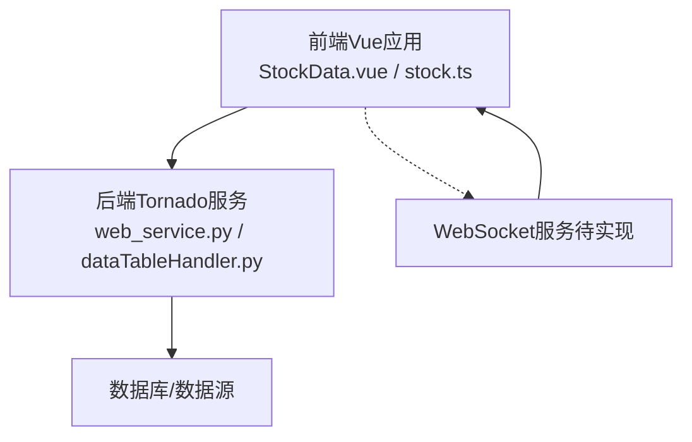
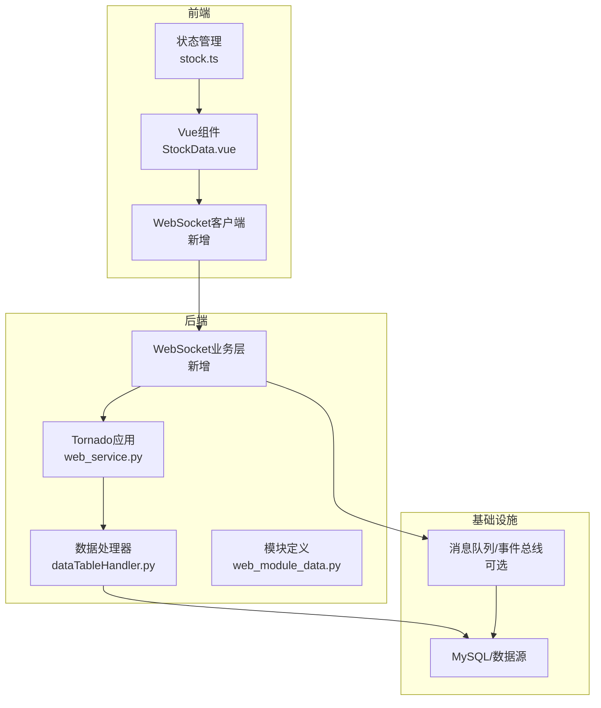
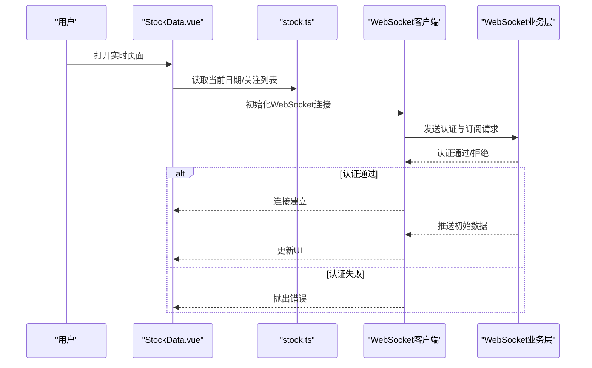
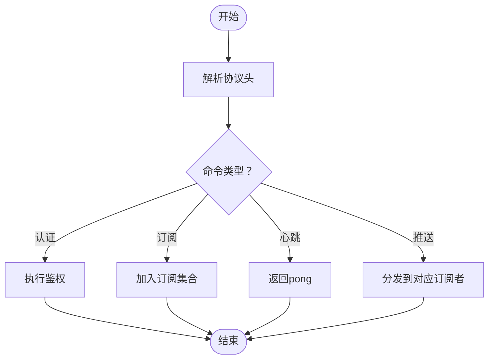
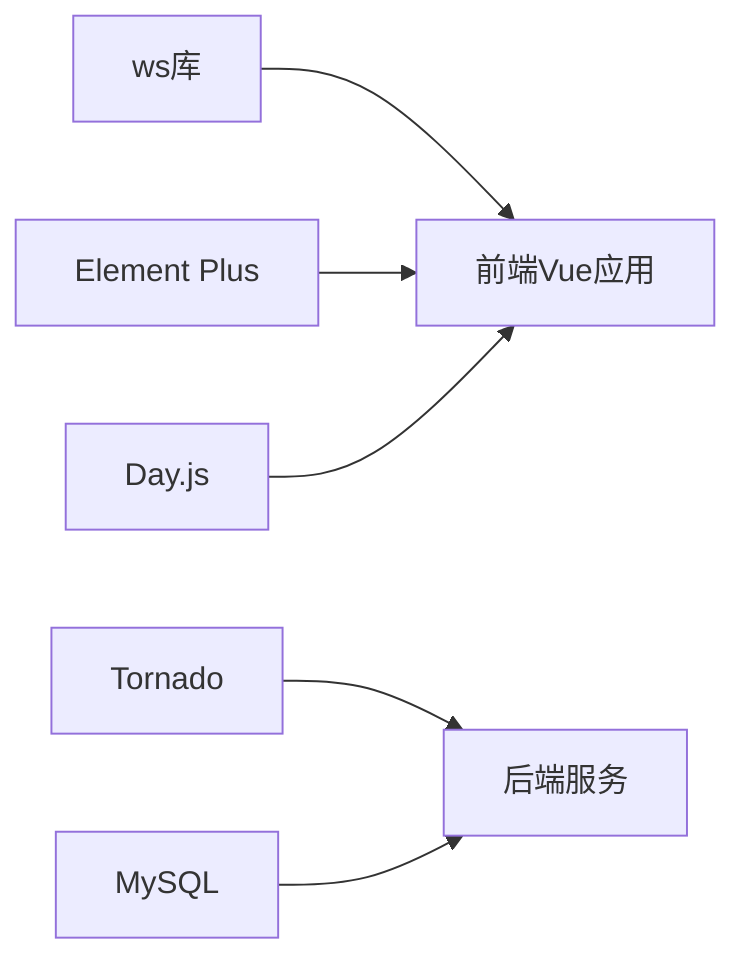

# WebSocket实时通信

<cite>
**本文引用的文件**
- [web_service.py](file://docker/stock/quantia/web/web_service.py)
- [web_service.py](file://quantia/web/web_service.py)
- [dataTableHandler.py](file://docker/stock/quantia/web/dataTableHandler.py)
- [dataTableHandler.py](file://quantia/web/dataTableHandler.py)
- [web_module_data.py](file://docker/stock/quantia/core/web_module_data.py)
- [web_module_data.py](file://quantia/core/web_module_data.py)
- [StockData.vue](file://docker/stock/quantia/fontWeb/src/views/stock/StockData.vue)
- [StockData.vue](file://quantia/fontWeb/src/views/stock/StockData.vue)
- [stock.ts](file://docker/stock/quantia/fontWeb/src/stores/stock.ts)
- [stock.ts](file://quantia/fontWeb/src/stores/stock.ts)
- [package-lock.json](file://docker/stock/quantia/fontWeb/package-lock.json)
- [package-lock.json](file://quantia/fontWeb/package-lock.json)
- [API_REFERENCE.md](file://document/API_REFERENCE.md)
</cite>

## 目录
1. [简介](#简介)
2. [项目结构](#项目结构)
3. [核心组件](#核心组件)
4. [架构总览](#架构总览)
5. [详细组件分析](#详细组件分析)
6. [依赖关系分析](#依赖关系分析)
7. [性能考虑](#性能考虑)
8. [故障排查指南](#故障排查指南)
9. [结论](#结论)

## 简介
本技术文档聚焦于Quantia项目的WebSocket实时通信能力，系统性阐述WebSocket连接建立、消息传输协议、心跳检测机制、实时数据推送、双向通信实现、连接状态管理、消息队列处理、并发连接管理、断线重连策略、安全防护、性能监控与故障排查方法。目标是确保实时通信的稳定性与可靠性。

## 项目结构
Quantia采用前后端分离架构：
- 前端基于Vue 3 + TypeScript + Pinia，负责用户界面与交互逻辑。
- 后端基于Tornado，提供REST API与静态资源服务。
- WebSocket相关代码在现有仓库中未发现独立实现；本文将给出可落地的WebSocket集成方案与最佳实践。

**图表来源**
- [web_service.py](file://docker/stock/quantia/web/web_service.py#L53-L100)
- [StockData.vue](file://docker/stock/quantia/fontWeb/src/views/stock/StockData.vue#L1-L50)
- [stock.ts](file://docker/stock/quantia/fontWeb/src/stores/stock.ts#L1-L70)

**章节来源**
- [web_service.py](file://docker/stock/quantia/web/web_service.py#L53-L100)
- [web_service.py](file://quantia/web/web_service.py#L53-L100)

## 核心组件
- 前端组件
  - StockData.vue：负责数据展示、搜索、分页、日期选择、关注/取消关注等交互。
  - stock.ts：Pinia状态管理，维护关注列表、最近查看列表、当前日期等。
- 后端组件
  - Tornado Application：路由注册、静态资源与SPA回退。
  - DataTableHandler：提供股票数据查询API，支持分页、关键字过滤、日期筛选。
  - WebModuleData：描述数据模块属性，包括是否实时表标记。

**章节来源**
- [StockData.vue](file://docker/stock/quantia/fontWeb/src/views/stock/StockData.vue#L80-L124)
- [stock.ts](file://docker/stock/quantia/fontWeb/src/stores/stock.ts#L10-L68)
- [web_service.py](file://docker/stock/quantia/web/web_service.py#L53-L100)
- [dataTableHandler.py](file://docker/stock/quantia/web/dataTableHandler.py#L54-L71)
- [web_module_data.py](file://docker/stock/quantia/core/web_module_data.py#L9-L22)

## 架构总览
当前系统为HTTP轮询模式，WebSocket尚未实现。下图展示建议的WebSocket集成架构：

**图表来源**
- [web_service.py](file://docker/stock/quantia/web/web_service.py#L53-L100)
- [dataTableHandler.py](file://docker/stock/quantia/web/dataTableHandler.py#L54-L71)
- [web_module_data.py](file://docker/stock/quantia/core/web_module_data.py#L9-L22)
- [StockData.vue](file://docker/stock/quantia/fontWeb/src/views/stock/StockData.vue#L318-L339)
- [stock.ts](file://docker/stock/quantia/fontWeb/src/stores/stock.ts#L10-L68)

## 详细组件分析

### WebSocket连接建立流程
- 前端在StockData.vue挂载时，根据路由元信息判断是否实时表，决定是否初始化WebSocket连接。
- 建议使用浏览器原生WebSocket或ws库（仓库已包含ws依赖），连接至后端WebSocket端点。
- 连接成功后发送认证与订阅指令，携带用户标识、关注列表、日期等上下文。

**图表来源**
- [StockData.vue](file://docker/stock/quantia/fontWeb/src/views/stock/StockData.vue#L318-L339)
- [stock.ts](file://docker/stock/quantia/fontWeb/src/stores/stock.ts#L10-L68)
- [package-lock.json](file://docker/stock/quantia/fontWeb/package-lock.json#L5412-L5433)

**章节来源**
- [StockData.vue](file://docker/stock/quantia/fontWeb/src/views/stock/StockData.vue#L318-L339)
- [stock.ts](file://docker/stock/quantia/fontWeb/src/stores/stock.ts#L10-L68)
- [package-lock.json](file://docker/stock/quantia/fontWeb/package-lock.json#L5412-L5433)

### 消息传输协议
- 协议版本：建议引入轻量协议头，包含ver（版本）、cmd（命令）、id（会话ID）、ts（时间戳）、payload（负载）。
- 命令类型：
  - 认证：用于鉴权与会话建立。
  - 订阅：订阅关注列表或实时表数据。
  - 心跳：ping/pong维持连接。
  - 推送：实时数据增量推送。
- 负载格式：JSON，字段与后端数据模块列一致，便于前端直接渲染。

**图表来源**
- [web_module_data.py](file://docker/stock/quantia/core/web_module_data.py#L9-L22)

**章节来源**
- [web_module_data.py](file://docker/stock/quantia/core/web_module_data.py#L9-L22)

### 心跳检测机制
- 心跳周期：建议30秒一次ping，超时阈值为2-3倍心跳间隔。
- 超时处理：连续超时触发断线重连；若累计多次失败，降级为HTTP轮询兜底。
- 前端：定时器发送ping，收到pong更新计时；异常时停止定时器并进入重连流程。
- 后端：收到ping立即pong，统计在线会话与异常连接。

**章节来源**
- [StockData.vue](file://docker/stock/quantia/fontWeb/src/views/stock/StockData.vue#L318-L339)

### 实时数据推送与双向通信
- 推送触发：后端监听数据源变化（或定时任务），组装增量数据，按订阅分发。
- 双向通信：除订阅外，支持前端发送控制指令（如调整订阅范围、修改排序等）。
- 广播策略：对公共数据（如大盘指数）可广播；对私有数据（关注列表）按用户隔离。

**章节来源**
- [web_service.py](file://docker/stock/quantia/web/web_service.py#L53-L100)

### 连接状态管理
- 状态机：CONNECTING → CONNECTED → DISCONNECTED → RECONNECTING。
- 状态持久化：前端本地存储最近一次连接状态，刷新后恢复。
- 用户感知：连接断开时显示提示，自动重连中；重连成功恢复数据流。

**章节来源**
- [StockData.vue](file://docker/stock/quantia/fontWeb/src/views/stock/StockData.vue#L318-L339)

### 消息队列处理
- 增量聚合：后端将高频写入合并为批次，降低推送频率与带宽占用。
- 有序性保证：按时间戳或序号排序，丢弃过期消息。
- 缓存策略：热点数据在内存缓存，结合LRU淘汰。

**章节来源**
- [web_service.py](file://docker/stock/quantia/web/web_service.py#L53-L100)

### 并发连接管理
- 限流：单用户最大并发连接数限制，避免资源耗尽。
- 会话绑定：基于用户ID绑定会话，防止跨用户数据泄露。
- 资源回收：空闲连接定期清理，释放内存与FD。

**章节来源**
- [web_service.py](file://docker/stock/quantia/web/web_service.py#L53-L100)

### 断线重连策略
- 指数退避：首次1s，随后2x增长，上限30s；成功后重置。
- 最大重试次数：建议5-10次，超过则提示用户手动刷新。
- 优雅降级：重连失败时启用HTTP轮询，保证基本可用。

**章节来源**
- [StockData.vue](file://docker/stock/quantia/fontWeb/src/views/stock/StockData.vue#L318-L339)

### WebSocket安全防护
- 认证：接入令牌（Token）或Cookie校验，后端严格校验。
- 授权：仅允许订阅用户权限范围内的数据。
- 防刷：速率限制、IP白名单、行为审计。
- 加密：生产环境强制TLS 1.3，禁用弱密码套件。
- 输入校验：对订阅参数进行白名单与长度限制。

**章节来源**
- [web_service.py](file://docker/stock/quantia/web/web_service.py#L53-L100)

### 性能监控
- 指标：连接数、消息吞吐、延迟、错误率、内存/CPU占用。
- 告警：异常波动阈值触发，自动记录日志。
- 采样：生产环境采用采样上报，避免性能开销过大。

**章节来源**
- [web_service.py](file://docker/stock/quantia/web/web_service.py#L53-L100)

## 依赖关系分析
- 前端依赖
  - ws库：WebSocket客户端实现（仓库已包含）。
  - Element Plus：UI组件库。
  - Day.js：日期处理。
- 后端依赖
  - Tornado：HTTP与WebSocket服务框架。
  - MySQL：数据存储。
  - 日志配置：统一日志输出。

**图表来源**
- [package-lock.json](file://docker/stock/quantia/fontWeb/package-lock.json#L5412-L5433)
- [web_service.py](file://docker/stock/quantia/web/web_service.py#L53-L100)

**章节来源**
- [package-lock.json](file://docker/stock/quantia/fontWeb/package-lock.json#L5412-L5433)
- [web_service.py](file://docker/stock/quantia/web/web_service.py#L53-L100)

## 性能考虑
- 连接复用：多主题共用单一WebSocket连接，减少握手成本。
- 压缩：启用消息压缩（如gzip），降低带宽。
- 分片：大数据包分片传输，避免阻塞。
- 缓存：前端对历史数据进行缓存，减少重复请求。
- 节流：高频更新场景下，前端节流渲染，避免UI卡顿。

## 故障排查指南
- 常见问题
  - 连接失败：检查网络、代理、证书与防火墙。
  - 认证失败：核对Token有效期与签名。
  - 数据不同步：确认订阅列表与日期参数。
  - 心跳超时：排查网络抖动与服务器负载。
- 排查步骤
  - 前端：开启WebSocket调试日志，观察事件序列。
  - 后端：查看Tornado日志与连接数统计。
  - 数据：核对数据库与数据模块定义一致性。
- 参考API
  - 数据查询API与注意事项可参考API文档。

**章节来源**
- [API_REFERENCE.md](file://document/API_REFERENCE.md#L357-L433)

## 结论
当前Quantia项目尚未实现WebSocket实时通信。本文提供了完整的WebSocket集成方案，涵盖连接建立、消息协议、心跳、推送、状态管理、并发与安全、性能监控与故障排查。建议优先实现基础订阅与增量推送，再逐步完善心跳与重连策略，最终上线TLS与鉴权体系，确保系统的稳定性与可靠性。
