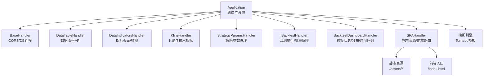
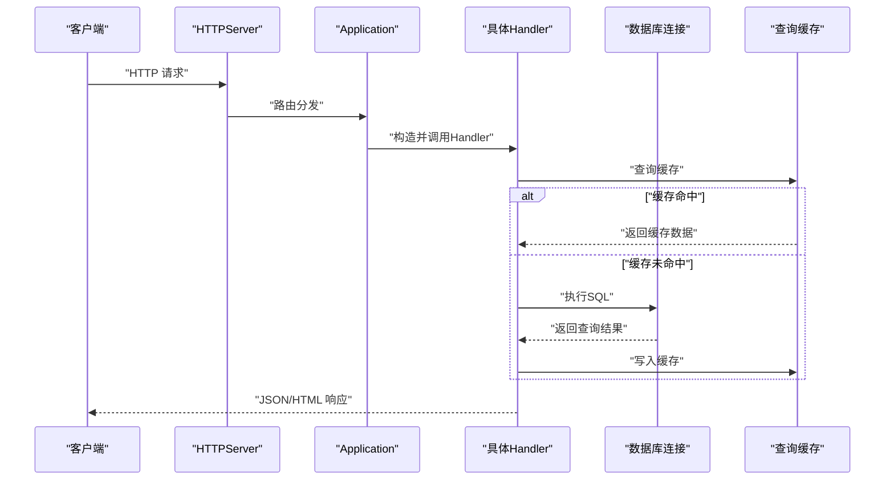
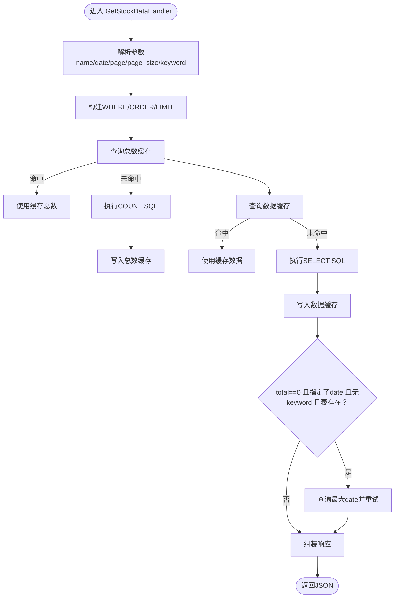
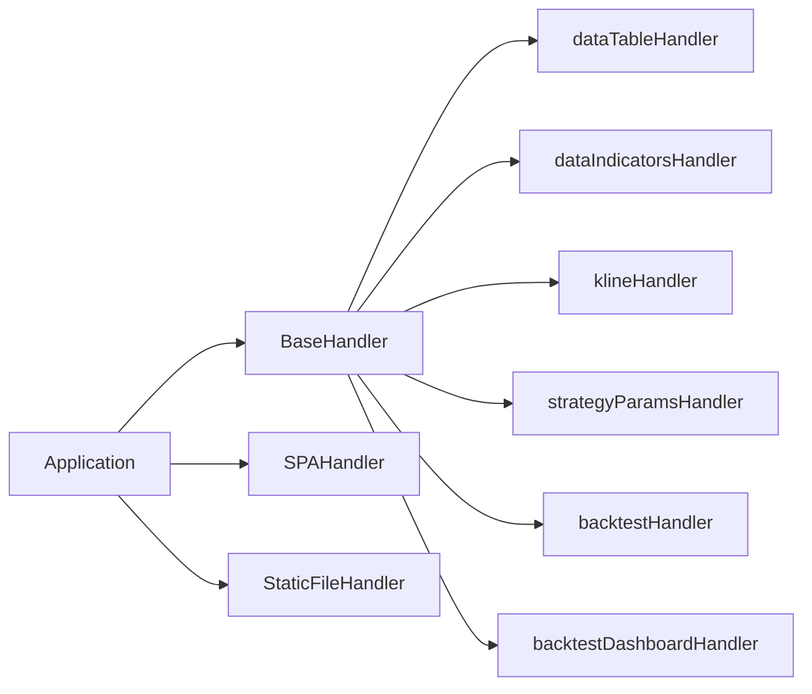

# Web服务架构

<cite>
**本文引用的文件**
- [web_service.py](file://docker/stock/quantia/web/web_service.py)
- [base.py](file://docker/stock/quantia/web/base.py)
- [dataTableHandler.py](file://docker/stock/quantia/web/dataTableHandler.py)
- [dataIndicatorsHandler.py](file://docker/stock/quantia/web/dataIndicatorsHandler.py)
- [klineHandler.py](file://docker/stock/quantia/web/klineHandler.py)
- [strategyParamsHandler.py](file://docker/stock/quantia/web/strategyParamsHandler.py)
- [backtestHandler.py](file://docker/stock/quantia/web/backtestHandler.py)
- [backtestDashboardHandler.py](file://docker/stock/quantia/web/backtestDashboardHandler.py)
- [index.html（静态入口）](file://docker/stock/quantia/web/static/index.html)
- [index.html（模板入口）](file://docker/stock/quantia/web/templates/index.html)
</cite>

## 目录
1. [简介](#简介)
2. [项目结构](#项目结构)
3. [核心组件](#核心组件)
4. [架构总览](#架构总览)
5. [详细组件分析](#详细组件分析)
6. [依赖分析](#依赖分析)
7. [性能考虑](#性能考虑)
8. [故障排查指南](#故障排查指南)
9. [结论](#结论)
10. [附录](#附录)

## 简介
本文件面向Quantia Web服务的后端开发者，系统性梳理基于Tornado的Web服务架构与实现细节，涵盖RESTful API设计、路由配置、中间件与CORS机制、请求处理流程、静态资源与模板渲染、WebSocket实时通信现状、认证授权策略、错误处理与性能优化、部署与监控方案，以及扩展开发方法。读者无需深入Python即可理解整体设计与实现要点。

## 项目结构
Web服务位于docker/stock/quantia/web目录，采用“模块化Handler + Application路由 + 基础基类”的分层组织方式：
- 应用入口与路由：web_service.py
- 基础Handler与CORS：base.py
- 数据表格API：dataTableHandler.py
- 指标图表API与模板渲染：dataIndicatorsHandler.py
- K线与技术指标API：klineHandler.py
- 策略参数管理API：strategyParamsHandler.py
- 回测API与看板API：backtestHandler.py、backtestDashboardHandler.py
- 静态资源与模板：web/static、web/templates

图表来源
- [web_service.py](file://docker/stock/quantia/web/web_service.py#L53-L97)
- [base.py](file://docker/stock/quantia/web/base.py#L14-L36)
- [dataTableHandler.py](file://docker/stock/quantia/web/dataTableHandler.py#L54-L232)
- [dataIndicatorsHandler.py](file://docker/stock/quantia/web/dataIndicatorsHandler.py#L16-L62)
- [klineHandler.py](file://docker/stock/quantia/web/klineHandler.py#L212-L360)
- [strategyParamsHandler.py](file://docker/stock/quantia/web/strategyParamsHandler.py#L563-L800)
- [backtestHandler.py](file://docker/stock/quantia/web/backtestHandler.py#L69-L673)
- [backtestDashboardHandler.py](file://docker/stock/quantia/web/backtestDashboardHandler.py#L360-L800)

章节来源
- [web_service.py](file://docker/stock/quantia/web/web_service.py#L53-L97)
- [index.html（静态入口）](file://docker/stock/quantia/web/static/index.html#L1-L15)
- [index.html（模板入口）](file://docker/stock/quantia/web/templates/index.html#L1-L405)

## 核心组件
- Application与路由
  - 定义静态资源、API路由、SPA回退路由与模板/静态目录设置。
  - 统一注入全局数据库连接，供所有Handler使用。
- BaseHandler
  - 统一设置CORS头，处理OPTIONS预检，提供db属性自动校验与重连。
- SPAHandler
  - 静态资源直返与前端路由回退，保证Vue SPA的history模式可用。
- 各类Handler
  - 数据表格API、指标页面API、K线API、策略参数API、回测API、看板API，均继承BaseHandler，统一跨域与数据库访问。

章节来源
- [web_service.py](file://docker/stock/quantia/web/web_service.py#L53-L100)
- [base.py](file://docker/stock/quantia/web/base.py#L14-L36)
- [web_service.py](file://docker/stock/quantia/web/web_service.py#L102-L125)

## 架构总览
Tornado应用启动后，HTTPServer监听固定端口，Application根据URL匹配到具体Handler，Handler完成参数解析、数据查询、缓存命中、结果组装与返回。静态资源由StaticFileHandler直接返回，模板由Tornado模板引擎渲染。

图表来源
- [web_service.py](file://docker/stock/quantia/web/web_service.py#L127-L143)
- [dataTableHandler.py](file://docker/stock/quantia/web/dataTableHandler.py#L127-L180)
- [strategyParamsHandler.py](file://docker/stock/quantia/web/strategyParamsHandler.py#L792-L800)

## 详细组件分析

### Application与路由
- 路由规则
  - robots.txt：避免搜索引擎爬虫产生大量404日志。
  - JSON API：数据表格、交易日、指标、收藏、K线、回测、看板等。
  - SPA回退：/assets/*静态资源与前端入口index.html。
- 设置项
  - 模板目录、静态目录、cookie密钥、XSRF关闭、调试关闭。
- 全局DB连接
  - 在Application初始化时建立全局torndb连接，所有Handler共享。

章节来源
- [web_service.py](file://docker/stock/quantia/web/web_service.py#L56-L97)

### BaseHandler（CORS与DB）
- CORS
  - 允许任意Origin，支持常用方法与头部，设置预检缓存。
- 预检处理
  - options方法返回204，避免前端重复OPTIONS请求。
- 数据库连接
  - db属性每次访问时检查并自动重连，提升稳定性。

章节来源
- [base.py](file://docker/stock/quantia/web/base.py#L14-L36)

### SPAHandler（静态资源与前端路由）
- 静态资源直返
  - 对/assets/*请求，根据扩展名设置Content-Type并直接返回文件内容。
- 前端路由回退
  - 非API路径统一返回index.html，配合Vue history模式。

章节来源
- [web_service.py](file://docker/stock/quantia/web/web_service.py#L102-L125)

### 数据表格API（dataTableHandler）
- 功能
  - 获取页面数据（渲染模板）、获取股票数据（JSON）、获取最近交易日。
- 特性
  - 支持分页、关键词模糊匹配、动态ORDER BY容错、日期回退。
  - 查询总数与数据分别缓存，减少数据库压力。
- 错误处理
  - 表不存在返回空数据而非500；排序列不存在时自动去除排序重试。

图表来源
- [dataTableHandler.py](file://docker/stock/quantia/web/dataTableHandler.py#L54-L232)

章节来源
- [dataTableHandler.py](file://docker/stock/quantia/web/dataTableHandler.py#L54-L232)

### 指标页面API与收藏（dataIndicatorsHandler）
- 指标页面
  - 从缓存读取历史K线，调用可视化模块生成图表片段，渲染模板。
- 收藏管理
  - 支持加入/取消关注，写入关注表。

章节来源
- [dataIndicatorsHandler.py](file://docker/stock/quantia/web/dataIndicatorsHandler.py#L16-L62)

### K线与技术指标API（klineHandler）
- 功能
  - 提供K线与多指标（MA、BOLL、RSI、MACD、KDJ、WR等）的JSON数据。
- 特性
  - 支持日线/周线/月线/季线/年线重采样。
  - 支持返回指定天数或全量数据。
- 性能
  - 指标计算纯Python实现，适合中小规模数据；大规模场景建议缓存或离线计算。

章节来源
- [klineHandler.py](file://docker/stock/quantia/web/klineHandler.py#L212-L360)

### 策略参数管理API（strategyParamsHandler）
- 功能
  - 获取策略参数配置、保存参数、重置参数、基于参数动态筛选股票。
- 存储
  - 参数持久化到MySQL表cn_strategy_params，支持默认值与用户自定义值合并。
- 缓存
  - 参数变更与重置后清理筛选结果缓存，保证一致性。

章节来源
- [strategyParamsHandler.py](file://docker/stock/quantia/web/strategyParamsHandler.py#L563-L800)

### 回测API（backtestHandler）
- 功能
  - 获取回测配置（周期、策略列表）、执行单只股票回测、批量回测。
- 特性
  - 支持动态计算与数据库表回测两种模式，自动降级。
  - 并行处理多只股票，提升批量回测效率。
  - 交易成本扣除、涨停检测、区间最高/最低收益计算。

章节来源
- [backtestHandler.py](file://docker/stock/quantia/web/backtestHandler.py#L69-L673)

### 回测看板API（backtestDashboardHandler）
- 功能
  - 跨策略总览、时间序列、策略明细、收益分布、买卖配对明细。
- 特性
  - 支持日期范围解析、策略映射、分页与聚合统计。
  - 对缺失数据返回空分布而非错误，提升健壮性。

章节来源
- [backtestDashboardHandler.py](file://docker/stock/quantia/web/backtestDashboardHandler.py#L360-L800)

## 依赖分析
- 组件耦合
  - 所有Handler继承BaseHandler，共享CORS与DB连接，降低重复代码。
  - Application集中管理路由与静态/模板目录，便于统一配置。
- 外部依赖
  - torndb：MySQL连接池封装。
  - pandas/numpy：数据处理与指标计算。
  - trade_time：交易日工具。
  - query_cache：查询与筛选结果缓存。

图表来源
- [web_service.py](file://docker/stock/quantia/web/web_service.py#L53-L97)
- [base.py](file://docker/stock/quantia/web/base.py#L14-L36)

章节来源
- [web_service.py](file://docker/stock/quantia/web/web_service.py#L53-L100)

## 性能考虑
- 缓存策略
  - 数据表格API对COUNT与数据分别缓存，显著降低数据库压力。
  - 策略筛选结果缓存，参数变更后主动失效。
- 并发与批处理
  - 批量回测使用线程池并发处理，缩短等待时间。
- I/O与计算
  - K线指标计算为CPU密集型，建议结合缓存与离线计算。
- 连接管理
  - BaseHandler的DB连接自动校验与重连，避免长时间空闲导致的连接失效。

章节来源
- [dataTableHandler.py](file://docker/stock/quantia/web/dataTableHandler.py#L127-L180)
- [strategyParamsHandler.py](file://docker/stock/quantia/web/strategyParamsHandler.py#L619-L626)
- [backtestHandler.py](file://docker/stock/quantia/web/backtestHandler.py#L540-L560)

## 故障排查指南
- CORS相关
  - 现象：跨域请求被浏览器拦截。
  - 排查：确认BaseHandler的CORS头设置与options预检处理。
- 数据库连接
  - 现象：偶发连接异常或超时。
  - 排查：检查BaseHandler的db属性自动重连逻辑；确认MySQL服务状态与连接池配置。
- 表结构变更
  - 现象：ORDER BY列不存在导致查询失败。
  - 排查：dataTableHandler已支持自动去除排序重试，确认fallback逻辑生效。
- 缓存一致性
  - 现象：参数更新后筛选结果未变化。
  - 排查：确认策略参数变更后清理筛选结果缓存。
- 静态资源404
  - 现象：/assets/*或index.html返回404。
  - 排查：确认Application的static_path与SPAHandler的静态路径配置。

章节来源
- [base.py](file://docker/stock/quantia/web/base.py#L14-L36)
- [dataTableHandler.py](file://docker/stock/quantia/web/dataTableHandler.py#L158-L179)
- [strategyParamsHandler.py](file://docker/stock/quantia/web/strategyParamsHandler.py#L619-L626)
- [web_service.py](file://docker/stock/quantia/web/web_service.py#L102-L125)

## 结论
Quantia Web服务以Tornado为核心，采用清晰的分层与模块化设计，统一的CORS与数据库连接管理，配合缓存与批处理策略，满足数据表格、指标、K线、策略参数、回测与看板等多场景需求。建议在生产环境中进一步完善认证授权、WebSocket实时通信、监控与日志体系，并对CPU密集型计算引入异步或离线任务队列。

## 附录

### RESTful API一览（按模块）
- 数据表格
  - GET /quantia/api_data：获取数据表格JSON（支持分页、关键词、日期回退）
  - GET /quantia/api/trade_date：获取最近交易日
- 指标与收藏
  - GET /quantia/data/indicators：指标页面（返回HTML片段）
  - GET /quantia/control/attention：加入/取消关注
- K线与指标
  - GET /quantia/api/kline：K线与技术指标JSON（支持日/周/月/季/年重采样）
- 策略参数
  - GET /quantia/api/strategy/params：获取策略参数配置
  - POST /quantia/api/strategy/params/save：保存策略参数
  - POST /quantia/api/strategy/params/reset：重置策略参数
  - GET /quantia/api/strategy/filter：基于参数动态筛选股票
- 回测
  - GET /quantia/api/backtest/config：获取回测配置（周期/策略列表）
  - GET /quantia/api/backtest/run：执行单只股票回测
  - GET /quantia/api/backtest/batch：批量回测
- 回测看板
  - GET /quantia/api/backtest/dashboard/overview：跨策略总览
  - GET /quantia/api/backtest/dashboard/strategy_detail：策略明细
  - GET /quantia/api/backtest/dashboard/distribution：收益分布
  - GET /quantia/api/backtest/dashboard/timeline：时间序列
  - GET /quantia/api/backtest/dashboard/trade_pairs：买卖配对明细

章节来源
- [web_service.py](file://docker/stock/quantia/web/web_service.py#L56-L88)
- [dataTableHandler.py](file://docker/stock/quantia/web/dataTableHandler.py#L54-L232)
- [dataIndicatorsHandler.py](file://docker/stock/quantia/web/dataIndicatorsHandler.py#L16-L62)
- [klineHandler.py](file://docker/stock/quantia/web/klineHandler.py#L212-L360)
- [strategyParamsHandler.py](file://docker/stock/quantia/web/strategyParamsHandler.py#L563-L800)
- [backtestHandler.py](file://docker/stock/quantia/web/backtestHandler.py#L69-L673)
- [backtestDashboardHandler.py](file://docker/stock/quantia/web/backtestDashboardHandler.py#L360-L800)

### WebSocket实时通信现状
- 当前实现未发现WebSocket相关代码，前端通过AJAX轮询与定时刷新获取数据。
- 如需引入WebSocket，可在Application中注册WebSocketHandler并接入事件引擎或消息队列。

章节来源
- [web_service.py](file://docker/stock/quantia/web/web_service.py#L53-L97)

### 认证授权机制
- 当前未发现显式的登录/鉴权中间件或Cookie校验逻辑，CORS允许任意Origin。
- 建议在BaseHandler或中间件中增加登录态校验、权限控制与CSRF防护。

章节来源
- [base.py](file://docker/stock/quantia/web/base.py#L14-L36)

### 部署与监控
- 部署
  - 使用Tornado HTTPServer监听端口，建议配合Supervisor或Docker编排。
  - 静态资源由Tornado直接提供，模板渲染由Tornado模板引擎完成。
- 监控
  - 建议接入日志系统（如ELK）与APM（如Prometheus+Grafana）监控请求延迟、错误率与数据库连接池状态。

章节来源
- [web_service.py](file://docker/stock/quantia/web/web_service.py#L127-L143)
- [index.html（静态入口）](file://docker/stock/quantia/web/static/index.html#L1-L15)
- [index.html（模板入口）](file://docker/stock/quantia/web/templates/index.html#L1-L405)
