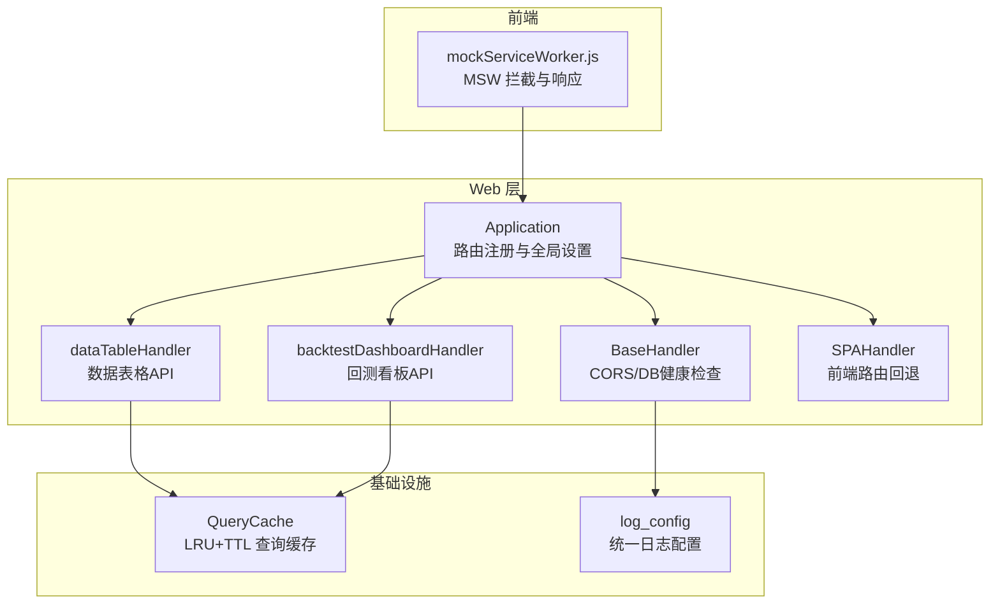
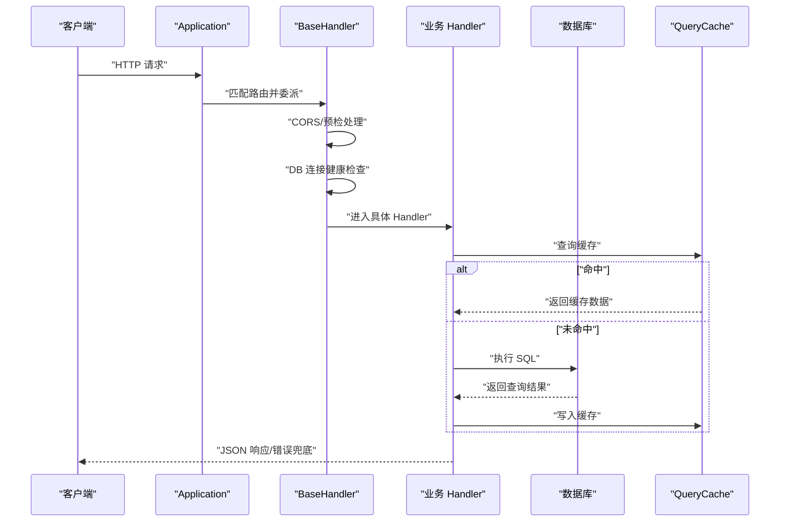
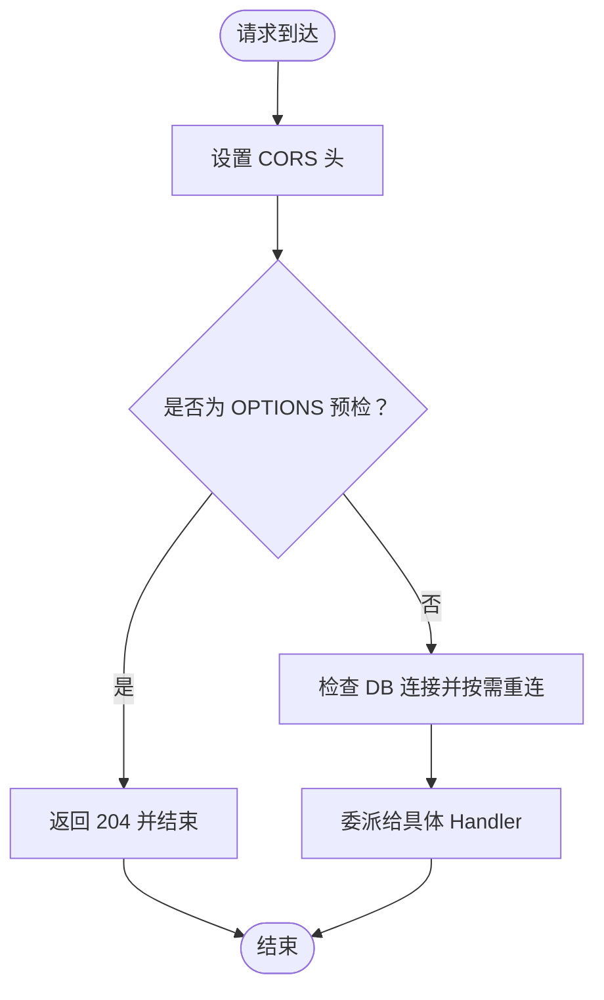
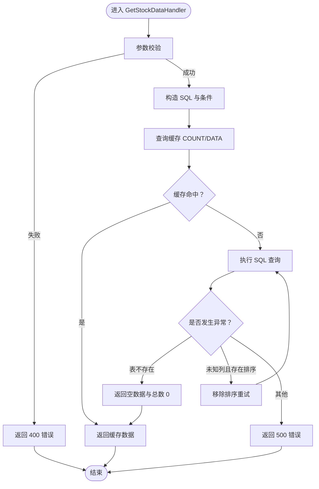
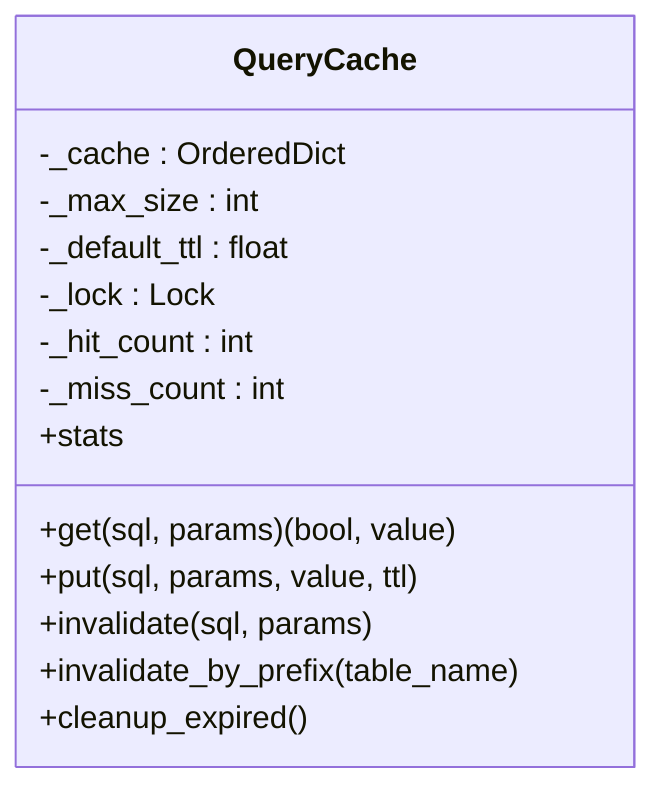
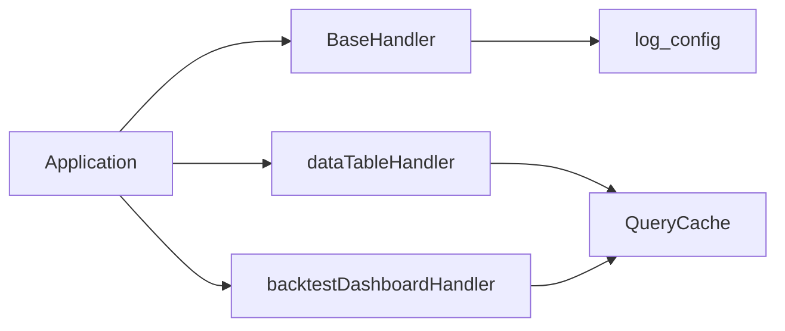

# 中间件机制

<cite>
**本文引用的文件**
- [quantia/web/base.py](file://quantia/web/base.py)
- [quantia/web/web_service.py](file://quantia/web/web_service.py)
- [quantia/web/dataTableHandler.py](file://quantia/web/dataTableHandler.py)
- [quantia/lib/query_cache.py](file://quantia/lib/query_cache.py)
- [quantia/lib/log_config.py](file://quantia/lib/log_config.py)
- [quantia/web/backtestDashboardHandler.py](file://quantia/web/backtestDashboardHandler.py)
- [quantia/fontWeb/public/mockServiceWorker.js](file://quantia/fontWeb/public/mockServiceWorker.js)
- [docker/stock/quantia/fontWeb/public/mockServiceWorker.js](file://docker/stock/quantia/fontWeb/public/mockServiceWorker.js)
</cite>

## 目录
1. [引言](#引言)
2. [项目结构](#项目结构)
3. [核心组件](#核心组件)
4. [架构总览](#架构总览)
5. [详细组件分析](#详细组件分析)
6. [依赖分析](#依赖分析)
7. [性能考虑](#性能考虑)
8. [故障排查指南](#故障排查指南)
9. [结论](#结论)
10. [附录](#附录)

## 引言
本文件围绕 Quantia 的中间件机制进行系统化技术文档编写，重点覆盖以下方面：
- 中间件的定义、注册方式与执行顺序
- 生命周期与链式调用模型
- 请求预处理、响应后处理、异常拦截、权限校验等能力
- 自定义中间件开发指南与最佳实践
- 性能影响分析与优化建议
- 常见使用场景、调试与监控方法

需要特别说明：当前仓库中的 Web 层采用 Tornado 框架，未发现显式的“中间件注册器”或“装饰器式中间件”实现。因此本文将“中间件”理解为以 Handler 为基础的“横切能力”，并通过 BaseHandler、Application、各业务 Handler 以及缓存/日志等基础设施共同构成“中间件式”的横切体系。

## 项目结构
Quantia 的 Web 层位于 quantia/web 目录，核心包括：
- 应用入口与路由注册：Application、路由表、SPA 回退
- 基础能力：BaseHandler（CORS、DB 连接检查）、日志配置
- 业务 Handler：数据表格、指标、策略参数、回测看板等
- 基础设施：查询缓存、日志配置
- 前端 Mock Worker（MSW）：用于本地开发与测试的请求拦截与响应模拟

图表来源
- [quantia/web/web_service.py](file://quantia/web/web_service.py#L53-L100)
- [quantia/web/base.py](file://quantia/web/base.py#L14-L37)
- [quantia/web/dataTableHandler.py](file://quantia/web/dataTableHandler.py#L54-L179)
- [quantia/web/backtestDashboardHandler.py](file://quantia/web/backtestDashboardHandler.py#L1-L120)
- [quantia/lib/query_cache.py](file://quantia/lib/query_cache.py#L27-L156)
- [quantia/lib/log_config.py](file://quantia/lib/log_config.py#L47-L104)
- [quantia/fontWeb/public/mockServiceWorker.js](file://quantia/fontWeb/public/mockServiceWorker.js#L109-L227)

章节来源
- [quantia/web/web_service.py](file://quantia/web/web_service.py#L53-L100)
- [quantia/web/base.py](file://quantia/web/base.py#L14-L37)

## 核心组件
- Application：集中注册路由、设置模板/静态资源、全局 DB 连接，作为请求进入点。
- BaseHandler：提供 CORS 支持、预检请求处理、每次请求前的 DB 连接健康检查。
- 各业务 Handler：如 GetStockDataHandler、Dashboard 系列 Handler，承担具体业务逻辑与异常兜底。
- QueryCache：为数据查询提供 LRU+TTL 缓存，降低数据库压力。
- log_config：统一日志输出，便于中间件式能力的日志观测。
- SPAHandler：非 API 路由回退至前端 SPA，保障前端路由体验。
- mockServiceWorker.js：前端侧 MSW，拦截浏览器请求并可返回模拟响应或透传。

章节来源
- [quantia/web/web_service.py](file://quantia/web/web_service.py#L53-L100)
- [quantia/web/base.py](file://quantia/web/base.py#L14-L37)
- [quantia/web/dataTableHandler.py](file://quantia/web/dataTableHandler.py#L54-L179)
- [quantia/lib/query_cache.py](file://quantia/lib/query_cache.py#L27-L156)
- [quantia/lib/log_config.py](file://quantia/lib/log_config.py#L47-L104)
- [quantia/web/web_service.py](file://quantia/web/web_service.py#L102-L125)
- [quantia/fontWeb/public/mockServiceWorker.js](file://quantia/fontWeb/public/mockServiceWorker.js#L109-L227)

## 架构总览
Quantia 的“中间件式”能力通过以下方式实现：
- 路由层：Application 统一注册路由，决定请求进入哪个 Handler。
- 基础层：BaseHandler 提供横切能力（CORS、DB 健康检查），所有业务 Handler 继承自它，天然具备这些能力。
- 业务层：各 Handler 执行业务逻辑，内置异常捕获与错误响应。
- 缓存层：QueryCache 在 Handler 内部使用，提升查询性能。
- 日志层：log_config 提供统一日志输出，便于追踪中间件式行为。
- 前端拦截：MSW 在前端侧拦截请求，支持 Mock 与 Passthrough，便于本地联调与测试。

图表来源
- [quantia/web/web_service.py](file://quantia/web/web_service.py#L53-L100)
- [quantia/web/base.py](file://quantia/web/base.py#L14-L37)
- [quantia/web/dataTableHandler.py](file://quantia/web/dataTableHandler.py#L123-L179)
- [quantia/lib/query_cache.py](file://quantia/lib/query_cache.py#L51-L92)

## 详细组件分析

### Application 与路由注册
- 负责注册所有 API 路由与前端 SPA 回退。
- 设置模板路径、静态资源路径、Cookie 密钥等全局配置。
- 维护全局 DB 连接，供所有 Handler 使用。

章节来源
- [quantia/web/web_service.py](file://quantia/web/web_service.py#L53-L100)

### BaseHandler：基础中间件能力
- CORS：允许跨域访问，支持常用方法与头部。
- 预检请求：options 方法直接返回 204，满足浏览器预检流程。
- DB 健康检查：每次请求前检查连接可用性，失败时自动重连，保证稳定性。

图表来源
- [quantia/web/base.py](file://quantia/web/base.py#L14-L37)

章节来源
- [quantia/web/base.py](file://quantia/web/base.py#L14-L37)

### 数据表格 Handler：请求预处理与异常拦截
- 参数校验：缺失必要参数时返回 400 错误。
- 动态 SQL 构造：支持关键词模糊匹配、分页、排序、列裁剪。
- 缓存策略：COUNT 与 DATA 查询分别缓存，命中则直接返回，未命中再访问数据库。
- 异常兜底：针对“表不存在”“未知列”等特定错误进行降级与回退（如按最大日期回退），其余错误统一返回 500 与错误信息。
- 响应格式：统一 JSON，包含列定义、数据与总数。

图表来源
- [quantia/web/dataTableHandler.py](file://quantia/web/dataTableHandler.py#L54-L179)

章节来源
- [quantia/web/dataTableHandler.py](file://quantia/web/dataTableHandler.py#L54-L179)

### 查询缓存：中间件式性能增强
- LRU 淘汰 + TTL 过期，线程安全。
- 缓存键由 SQL + 参数组合生成，确保唯一性。
- 提供统计接口，便于观测命中率与容量使用情况。

图表来源
- [quantia/lib/query_cache.py](file://quantia/lib/query_cache.py#L27-L156)

章节来源
- [quantia/lib/query_cache.py](file://quantia/lib/query_cache.py#L27-L156)

### 日志配置：中间件式可观测性
- 统一日志格式与输出目标（文件轮转、错误汇总、控制台）。
- 首次调用时清理已有 handler，避免重复配置。
- 通过模块级 logger 记录中间件式行为，便于定位问题。

章节来源
- [quantia/lib/log_config.py](file://quantia/lib/log_config.py#L47-L104)

### SPA 回退：前端路由支持
- 静态资源直出，非 API 路由统一返回 index.html，交由前端路由接管。
- 与 BaseHandler 的 CORS 配合，保证前后端联调顺畅。

章节来源
- [quantia/web/web_service.py](file://quantia/web/web_service.py#L102-L125)

### 前端 Mock Worker：请求拦截与响应模拟
- 拦截浏览器 Fetch 请求，支持 Mock 响应与 Passthrough。
- 通过消息通道与主页面通信，支持可见客户端识别与响应事件。
- 用于本地开发与测试，减少对后端依赖。

章节来源
- [quantia/fontWeb/public/mockServiceWorker.js](file://quantia/fontWeb/public/mockServiceWorker.js#L109-L227)
- [docker/stock/quantia/fontWeb/public/mockServiceWorker.js](file://docker/stock/quantia/fontWeb/public/mockServiceWorker.js#L109-L227)

## 依赖分析
- Application 依赖路由表与全局设置，间接依赖 BaseHandler 与各业务 Handler。
- BaseHandler 依赖日志配置与数据库连接。
- 业务 Handler 依赖 QueryCache 与数据库，部分 Handler 依赖工具模块（如交易日、数据结构）。
- 前端 MSW 与后端无直接耦合，但通过 API 接口交互。

图表来源
- [quantia/web/web_service.py](file://quantia/web/web_service.py#L53-L100)
- [quantia/web/base.py](file://quantia/web/base.py#L14-L37)
- [quantia/web/dataTableHandler.py](file://quantia/web/dataTableHandler.py#L54-L179)
- [quantia/web/backtestDashboardHandler.py](file://quantia/web/backtestDashboardHandler.py#L1-L120)
- [quantia/lib/query_cache.py](file://quantia/lib/query_cache.py#L27-L156)
- [quantia/lib/log_config.py](file://quantia/lib/log_config.py#L47-L104)

章节来源
- [quantia/web/web_service.py](file://quantia/web/web_service.py#L53-L100)
- [quantia/web/base.py](file://quantia/web/base.py#L14-L37)
- [quantia/web/dataTableHandler.py](file://quantia/web/dataTableHandler.py#L54-L179)
- [quantia/web/backtestDashboardHandler.py](file://quantia/web/backtestDashboardHandler.py#L1-L120)
- [quantia/lib/query_cache.py](file://quantia/lib/query_cache.py#L27-L156)
- [quantia/lib/log_config.py](file://quantia/lib/log_config.py#L47-L104)

## 性能考虑
- 缓存命中率：通过 QueryCache 的统计接口观察命中率，结合业务热点调整 TTL 与容量。
- 数据库压力：利用 QueryCache 减少重复 COUNT 与 DATA 查询；对高频分页场景尤为有效。
- DB 连接健康检查：BaseHandler 每次请求均检查连接，避免长连接异常导致的失败风暴。
- 前端拦截：MSW 在本地开发阶段减少真实网络请求，提高联调效率。

[本节为通用性能讨论，无需列出章节来源]

## 故障排查指南
- CORS 问题：确认 BaseHandler 的 CORS 头设置与预检处理是否生效。
- DB 连接异常：查看 BaseHandler 的连接检查与重连逻辑，结合日志定位。
- 数据查询异常：关注 DataTableHandler 的异常分支与回退逻辑（表不存在、未知列、日期回退）。
- 缓存异常：通过 QueryCache 的统计接口判断命中率与过期情况，必要时清理缓存。
- 日志定位：统一使用 log_config 输出，结合 Handler 内部日志快速定位问题。

章节来源
- [quantia/web/base.py](file://quantia/web/base.py#L14-L37)
- [quantia/web/dataTableHandler.py](file://quantia/web/dataTableHandler.py#L123-L179)
- [quantia/lib/query_cache.py](file://quantia/lib/query_cache.py#L124-L136)
- [quantia/lib/log_config.py](file://quantia/lib/log_config.py#L47-L104)

## 结论
Quantia 的中间件机制并非传统意义上的“中间件注册器”，而是通过 BaseHandler 的横切能力、Application 的路由编排、QueryCache 的性能增强与 log_config 的可观测性，形成一套简洁而高效的“中间件式”体系。该体系在不引入额外框架依赖的前提下，实现了 CORS、DB 健康检查、缓存、异常兜底与统一日志等关键中间件能力，并通过前端 MSW 提升了本地联调效率。

[本节为总结性内容，无需列出章节来源]

## 附录

### 自定义中间件开发指南（基于现有模式）
- 在 BaseHandler 中增加横切逻辑（如鉴权、审计、速率限制），所有 Handler 自动继承。
- 在业务 Handler 内部使用 QueryCache 缓存热点查询，注意合理设置 TTL 与容量。
- 使用 log_config 输出统一格式日志，便于追踪中间件行为。
- 如需前端拦截，请参考现有 MSW 配置，确保与后端 API 协同。

章节来源
- [quantia/web/base.py](file://quantia/web/base.py#L14-L37)
- [quantia/lib/query_cache.py](file://quantia/lib/query_cache.py#L27-L156)
- [quantia/lib/log_config.py](file://quantia/lib/log_config.py#L47-L104)
- [quantia/fontWeb/public/mockServiceWorker.js](file://quantia/fontWeb/public/mockServiceWorker.js#L109-L227)
