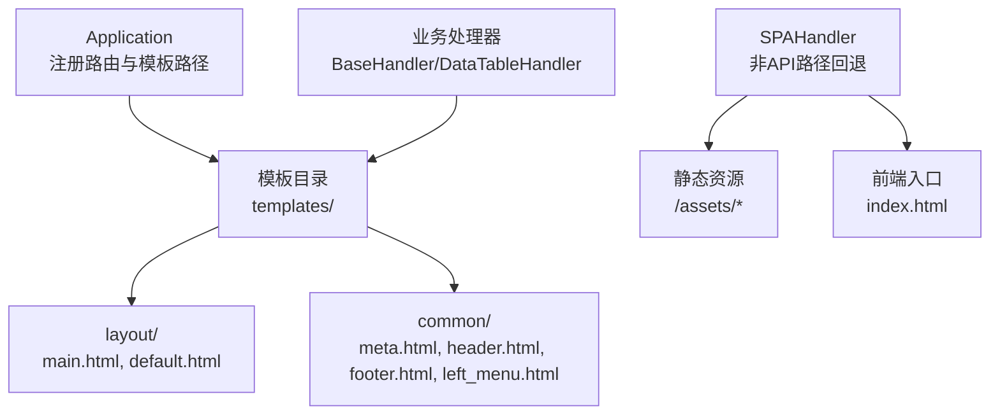
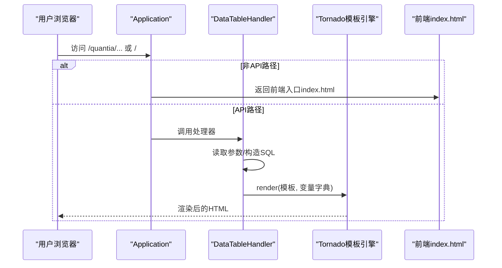
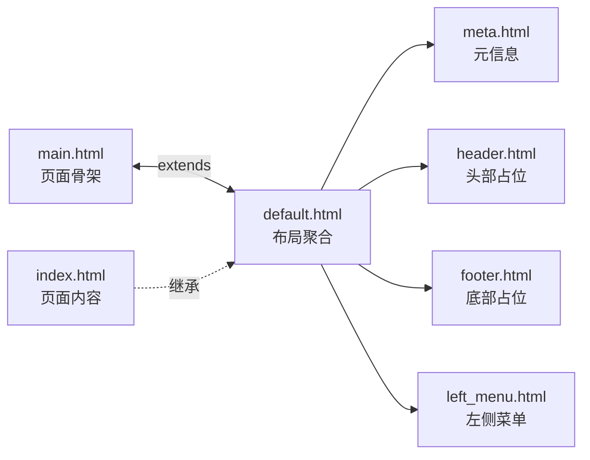
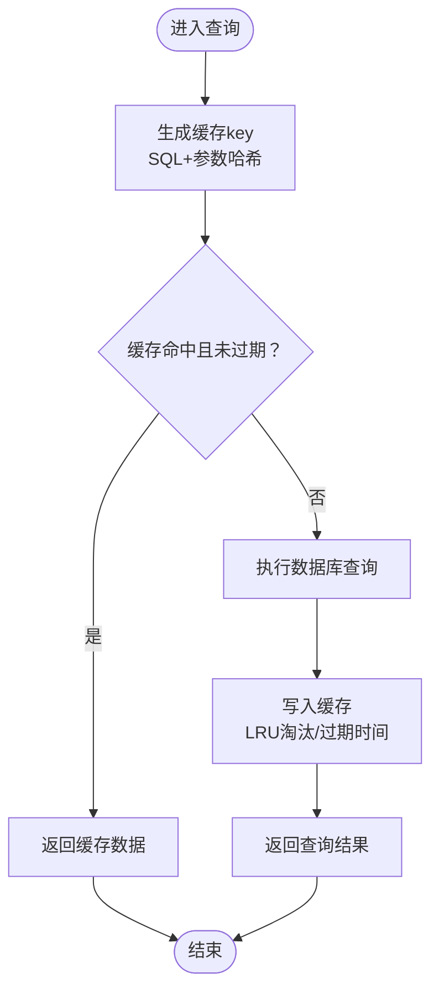
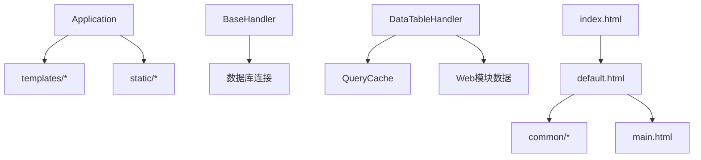

# 模板渲染机制

<cite>
**本文引用的文件**
- [web_service.py](file://docker/stock/quantia/web/web_service.py)
- [base.py](file://docker/stock/quantia/web/base.py)
- [dataTableHandler.py](file://docker/stock/quantia/web/dataTableHandler.py)
- [query_cache.py](file://docker/stock/quantia/lib/query_cache.py)
- [default.html](file://docker/stock/quantia/web/templates/layout/default.html)
- [main.html](file://docker/stock/quantia/web/templates/layout/main.html)
- [meta.html](file://docker/stock/quantia/web/templates/common/meta.html)
- [header.html](file://docker/stock/quantia/web/templates/common/header.html)
- [footer.html](file://docker/stock/quantia/web/templates/common/footer.html)
- [left_menu.html](file://docker/stock/quantia/web/templates/common/left_menu.html)
- [index.html](file://docker/stock/quantia/web/templates/index.html)
</cite>

## 目录
1. [简介](#简介)
2. [项目结构](#项目结构)
3. [核心组件](#核心组件)
4. [架构总览](#架构总览)
5. [详细组件分析](#详细组件分析)
6. [依赖分析](#依赖分析)
7. [性能考虑](#性能考虑)
8. [故障排查指南](#故障排查指南)
9. [结论](#结论)

## 简介
本文件面向Quantia项目的模板渲染机制，聚焦Tornado模板引擎的使用方式、模板继承与块（block）机制、变量传递与过滤器应用、布局与组件化模板设计、条件渲染与循环处理、模板缓存与性能优化、安全模板编写规范、模板调试与错误处理、国际化支持方案，以及模板系统的可维护性与用户体验保障。

## 项目结构
Quantia采用Tornado作为Web框架，模板位于web/templates目录，按功能划分为layout与common两大类：
- layout：布局模板，负责页面骨架与区块占位
- common：通用组件，如meta、header、footer、left_menu等

路由层通过Application注册URL映射与模板路径，SPA回退逻辑由SPAHandler统一处理，非API路径返回前端index.html以支持前端路由。

图表来源
- [web_service.py](file://docker/stock/quantia/web/web_service.py#L89-L96)
- [web_service.py](file://docker/stock/quantia/web/web_service.py#L102-L125)
- [default.html](file://docker/stock/quantia/web/templates/layout/default.html#L1-L6)
- [main.html](file://docker/stock/quantia/web/templates/layout/main.html#L1-L26)
- [meta.html](file://docker/stock/quantia/web/templates/common/meta.html#L1-L20)
- [header.html](file://docker/stock/quantia/web/templates/common/header.html#L1-L2)
- [footer.html](file://docker/stock/quantia/web/templates/common/footer.html#L1-L2)
- [left_menu.html](file://docker/stock/quantia/web/templates/common/left_menu.html#L1-L118)
- [index.html](file://docker/stock/quantia/web/templates/index.html#L1-L405)

章节来源
- [web_service.py](file://docker/stock/quantia/web/web_service.py#L53-L99)
- [web_service.py](file://docker/stock/quantia/web/web_service.py#L102-L125)

## 核心组件
- Application：配置模板路径、静态资源路径、Cookie与调试开关，初始化全局数据库连接
- SPAHandler：非API路径回退到前端index.html，支持静态资源直出
- BaseHandler：统一CORS头设置、数据库连接健康检查与自动重连
- DataTableHandler：页面渲染与数据接口，render调用模板并传入变量
- QueryCache：LRU+TTL内存缓存，用于减少重复数据库查询

章节来源
- [web_service.py](file://docker/stock/quantia/web/web_service.py#L53-L99)
- [web_service.py](file://docker/stock/quantia/web/web_service.py#L102-L125)
- [base.py](file://docker/stock/quantia/web/base.py#L14-L36)
- [dataTableHandler.py](file://docker/stock/quantia/web/dataTableHandler.py#L35-L51)
- [query_cache.py](file://docker/stock/quantia/lib/query_cache.py#L27-L156)

## 架构总览
Tornado模板渲染流程概览：
- 请求进入Application路由
- 非API路径由SPAHandler回退到前端index.html
- API路径由具体Handler处理，部分页面通过render调用模板
- 模板继承自layout/main.html，通过与组织页面结构
- 变量通过render传入，如web_module_data、date_now、leftMenu等

图表来源
- [web_service.py](file://docker/stock/quantia/web/web_service.py#L89-L96)
- [web_service.py](file://docker/stock/quantia/web/web_service.py#L102-L125)
- [dataTableHandler.py](file://docker/stock/quantia/web/dataTableHandler.py#L35-L51)

## 详细组件分析

### 模板继承与布局设计
- 布局骨架：main.html定义HTML结构与区块占位，包括meta、header、left_menu、main_content、footer
- 默认布局：default.html通过多次叠加通用组件与主布局
- 页面模板：index.html继承layout/default.html，仅定义main_content区块内容

图表来源
- [main.html](file://docker/stock/quantia/web/templates/layout/main.html#L1-L26)
- [default.html](file://docker/stock/quantia/web/templates/layout/default.html#L1-L6)
- [meta.html](file://docker/stock/quantia/web/templates/common/meta.html#L1-L20)
- [header.html](file://docker/stock/quantia/web/templates/common/header.html#L1-L2)
- [footer.html](file://docker/stock/quantia/web/templates/common/footer.html#L1-L2)
- [left_menu.html](file://docker/stock/quantia/web/templates/common/left_menu.html#L1-L118)
- [index.html](file://docker/stock/quantia/web/templates/index.html#L1-L405)

章节来源
- [default.html](file://docker/stock/quantia/web/templates/layout/default.html#L1-L6)
- [main.html](file://docker/stock/quantia/web/templates/layout/main.html#L1-L26)
- [index.html](file://docker/stock/quantia/web/templates/index.html#L1-L405)

### 变量传递与过滤器应用
- 变量传递：DataTableHandler在render时传入web_module_data、date_now、leftMenu等
- 过滤器应用：MyEncoder对bytes、datetime/date类型进行序列化，用于JSON API响应
- 模板内变量：left_menu.html使用leftMenu.leftMenuList与request.uri实现菜单高亮与分组

章节来源
- [dataTableHandler.py](file://docker/stock/quantia/web/dataTableHandler.py#L35-L51)
- [dataTableHandler.py](file://docker/stock/quantia/web/dataTableHandler.py#L19-L32)
- [left_menu.html](file://docker/stock/quantia/web/templates/common/left_menu.html#L72-L110)

### 条件渲染与循环处理
- 条件渲染：left_menu.html中对当前URL与菜单项进行比较，动态设置open/active类
- 循环处理：遍历leftMenu.leftMenuList，按type分组生成菜单层级结构

章节来源
- [left_menu.html](file://docker/stock/quantia/web/templates/common/left_menu.html#L72-L110)

### 模板缓存策略与性能优化
- 查询缓存：QueryCache提供LRU+TTL内存缓存，COUNT与DATA查询分别缓存，key由SQL+参数生成
- 缓存粒度：stock_data_cache针对股票列表分页查询，filter_result_cache针对策略筛选结果
- 性能收益：同一用户短时间内翻页避免重复查询数据库，降低延迟与数据库压力

图表来源
- [query_cache.py](file://docker/stock/quantia/lib/query_cache.py#L44-L92)

章节来源
- [query_cache.py](file://docker/stock/quantia/lib/query_cache.py#L27-L156)
- [dataTableHandler.py](file://docker/stock/quantia/web/dataTableHandler.py#L123-L206)

### 安全模板编写规范
- 输入校验：API处理器对必要参数进行校验，缺失时返回400错误
- 异常处理：数据库异常分类处理，表不存在返回空数据而非500，ORDER BY列不存在时降级重试
- CORS设置：BaseHandler统一设置跨域头，OPTIONS预检处理
- 模板变量：严格限制模板中可访问的变量，避免注入

章节来源
- [dataTableHandler.py](file://docker/stock/quantia/web/dataTableHandler.py#L64-L73)
- [dataTableHandler.py](file://docker/stock/quantia/web/dataTableHandler.py#L154-L179)
- [base.py](file://docker/stock/quantia/web/base.py#L16-L26)

### 国际化支持方案
- 字符集：模板meta中设置UTF-8字符集，确保多语言显示
- 文本本地化：建议在模板中使用翻译函数或变量，结合后端语言环境切换
- 前端国际化：前端Vue组件可配合i18n库实现界面文本切换

章节来源
- [meta.html](file://docker/stock/quantia/web/templates/common/meta.html#L5-L6)

### 模板调试技巧
- 模板路径：Application中template_path指向templates目录，确保模板文件路径正确
- 块占位：通过main.html中的占位快速定位内容插入点
- 变量检查：在模板中打印变量或使用调试块，确认传入数据结构
- 缓存调试：QueryCache提供stats统计，便于观察命中率与缓存状态

章节来源
- [web_service.py](file://docker/stock/quantia/web/web_service.py#L89-L96)
- [main.html](file://docker/stock/quantia/web/templates/layout/main.html#L8-L23)
- [query_cache.py](file://docker/stock/quantia/lib/query_cache.py#L124-L136)

## 依赖分析
- 应用层依赖：Application依赖模板目录与静态资源目录，依赖数据库连接
- 处理器依赖：BaseHandler依赖数据库连接与CORS配置；DataTableHandler依赖查询缓存与Web模块数据
- 模板依赖：default.html依赖common各组件与main.html；index.html依赖default.html

图表来源
- [web_service.py](file://docker/stock/quantia/web/web_service.py#L89-L96)
- [base.py](file://docker/stock/quantia/web/base.py#L28-L36)
- [dataTableHandler.py](file://docker/stock/quantia/web/dataTableHandler.py#L13-L13)
- [default.html](file://docker/stock/quantia/web/templates/layout/default.html#L1-L6)
- [main.html](file://docker/stock/quantia/web/templates/layout/main.html#L1-L26)
- [index.html](file://docker/stock/quantia/web/templates/index.html#L1-L405)

章节来源
- [web_service.py](file://docker/stock/quantia/web/web_service.py#L53-L99)
- [base.py](file://docker/stock/quantia/web/base.py#L14-L36)
- [dataTableHandler.py](file://docker/stock/quantia/web/dataTableHandler.py#L13-L13)

## 性能考虑
- 模板渲染：尽量减少模板中的复杂逻辑，将计算移至处理器或缓存
- 缓存策略：合理设置TTL与最大容量，区分高频与低频查询
- 数据库访问：优先使用QueryCache，避免重复COUNT与DATA查询
- 静态资源：通过StaticFileHandler直出，减少模板处理开销

## 故障排查指南
- 模板路径错误：检查Application.template_path是否指向正确目录
- 变量未定义：在render调用处核对传入变量，模板中使用try/except保护
- 数据库异常：查看DataTableHandler的异常分支，确认表是否存在与列是否有效
- CORS问题：确认BaseHandler的CORS头设置与OPTIONS预检处理

章节来源
- [web_service.py](file://docker/stock/quantia/web/web_service.py#L89-L96)
- [base.py](file://docker/stock/quantia/web/base.py#L16-L26)
- [dataTableHandler.py](file://docker/stock/quantia/web/dataTableHandler.py#L154-L179)

## 结论
Quantia的模板渲染机制基于Tornado模板引擎，采用清晰的布局与组件化设计，结合QueryCache实现高效的查询缓存。通过严格的参数校验、异常处理与CORS配置，保障了系统的安全性与稳定性。建议在模板中进一步引入国际化与调试工具，持续优化缓存策略与模板复杂度，提升用户体验与可维护性。
