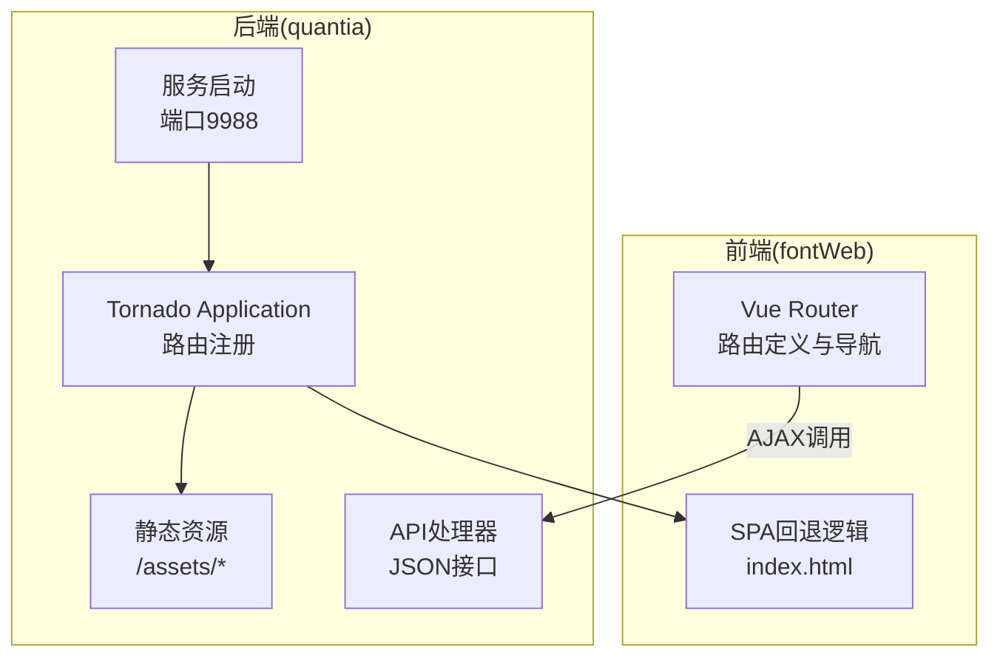
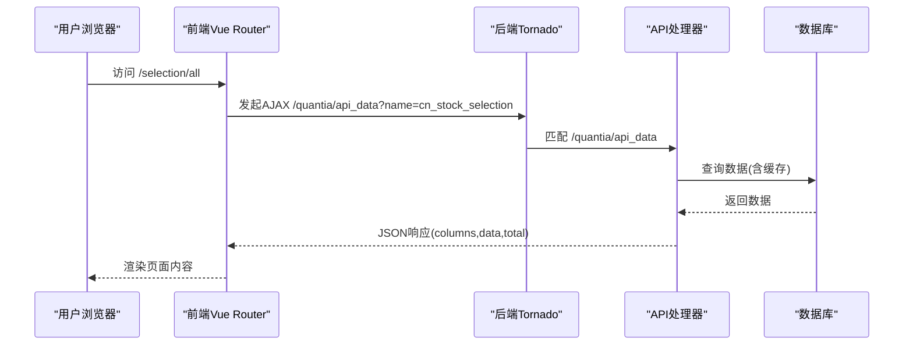
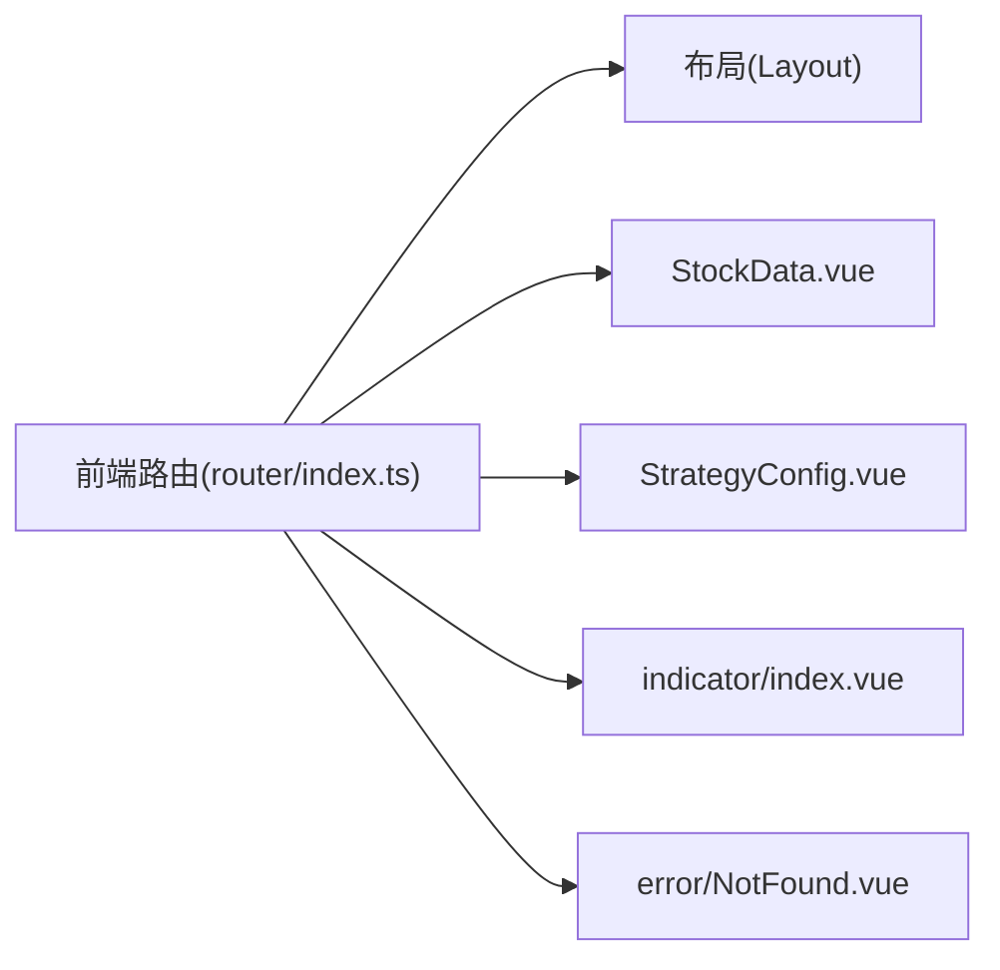
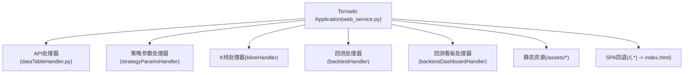

# 路由配置管理

<cite>
**本文引用的文件**
- [路由配置](file://quantia/fontWeb/src/router/index.ts)
- [后端路由与SPA处理](file://quantia/web/web_service.py)
- [基础HTTP处理器](file://quantia/web/base.py)
- [数据表格API处理器](file://quantia/web/dataTableHandler.py)
- [查询缓存模块](file://quantia/lib/query_cache.py)
- [前端路由单元测试](file://quantia/fontWeb/tests/router/index.test.ts)
- [后端路由单元测试](file://quantia/web/tests/router/index.test.ts)
</cite>

## 目录
1. [简介](#简介)
2. [项目结构](#项目结构)
3. [核心组件](#核心组件)
4. [架构总览](#架构总览)
5. [详细组件分析](#详细组件分析)
6. [依赖关系分析](#依赖关系分析)
7. [性能考虑](#性能考虑)
8. [故障排查指南](#故障排查指南)
9. [结论](#结论)

## 简介
本文件面向Quantia项目的路由配置管理，系统化阐述前端Vue Router的URL路由规则、正则表达式匹配、参数提取机制；后端Tornado的静态资源路由、API路由与SPA路由的差异化处理；路由优先级、通配符匹配与动态参数处理；以及路由调试方法、性能优化策略与安全防护措施，旨在确保路由系统的稳定性与可扩展性。

## 项目结构
前端路由位于fontWeb工程内，采用Vue Router进行单页应用(SPA)路由管理；后端基于Tornado提供API接口与SPA回退处理。两者共同构成完整的前后端路由体系。

图表来源
- [路由配置](file://quantia/fontWeb/src/router/index.ts#L1-L336)
- [后端路由与SPA处理](file://quantia/web/web_service.py#L53-L100)

章节来源
- [路由配置](file://quantia/fontWeb/src/router/index.ts#L1-L336)
- [后端路由与SPA处理](file://quantia/web/web_service.py#L53-L100)

## 核心组件
- 前端路由配置：集中定义在router/index.ts，包含布局嵌套、子路由、重定向、通配符与404处理。
- 后端路由配置：在Application中注册API路由、静态资源路由与SPA回退路由。
- 基础HTTP处理器：统一设置CORS、数据库连接检查与预检请求处理。
- 数据表格API处理器：提供分页、条件过滤、日期回退等数据查询能力。
- 查询缓存模块：为API提供LRU+TTL缓存，降低数据库压力。

章节来源
- [路由配置](file://quantia/fontWeb/src/router/index.ts#L1-L336)
- [后端路由与SPA处理](file://quantia/web/web_service.py#L53-L100)
- [基础HTTP处理器](file://quantia/web/base.py#L14-L36)
- [数据表格API处理器](file://quantia/web/dataTableHandler.py#L54-L214)
- [查询缓存模块](file://quantia/lib/query_cache.py#L27-L156)

## 架构总览
前端路由负责UI页面与功能模块的导航；后端路由负责API数据接口与SPA静态资源回退。二者通过AJAX请求实现数据交互。

图表来源
- [路由配置](file://quantia/fontWeb/src/router/index.ts#L24-L28)
- [后端路由与SPA处理](file://quantia/web/web_service.py#L60-L61)
- [数据表格API处理器](file://quantia/web/dataTableHandler.py#L54-L214)

## 详细组件分析

### URL路由规则与正则匹配
- 前端路由采用路径前缀与子路由组合，如 /selection、/basic、/indicator 等，均以Layout作为父容器，内部children定义具体视图。
- 动态参数与通配符：
  - 旧版路径兼容：/stock/:pathMatch(.*)*，通过redirect函数去除前缀并重定向至正确路径。
  - 404通配：/:pathMatch(.*)*，置于路由表末尾，确保所有未匹配路径进入404页面。
- 正则表达式说明：
  - :pathMatch(.*)* 表示捕获任意剩余路径片段，用于旧路径迁移与通用回退。

章节来源
- [路由配置](file://quantia/fontWeb/src/router/index.ts#L304-L327)

### 路由参数提取机制
- 前端通过meta字段传递页面元信息（如标题、表格名、是否实时、默认策略等），便于组件按需渲染与数据源选择。
- 查询参数(query)可用于向后端传递过滤条件（如指标详情页的code、date、name）。
- 后端通过self.get_argument读取查询参数，结合模块配置生成SQL条件。

章节来源
- [路由配置](file://quantia/fontWeb/src/router/index.ts#L28-L34)
- [前端路由单元测试](file://quantia/fontWeb/tests/router/index.test.ts#L40-L48)
- [数据表格API处理器](file://quantia/web/dataTableHandler.py#L55-L61)

### 静态资源路由
- 后端静态资源路由：/assets/(.*)，映射到static/assets目录，直接返回文件内容并设置Content-Type。
- SPA回退：/(.*)，当请求非API且非静态文件时，返回index.html，交由前端路由接管。

章节来源
- [后端路由与SPA处理](file://quantia/web/web_service.py#L84-L87)
- [后端路由与SPA处理](file://quantia/web/web_service.py#L108-L124)

### API路由
- API前缀：/quantia/api_*，覆盖数据查询、策略参数、K线、回测等接口。
- 数据查询API：/quantia/api_data，支持分页、关键词模糊匹配、日期回退、缓存命中与降级。
- 策略参数API：/quantia/api/strategy/*，提供参数获取、保存、重置与筛选。
- K线API：/quantia/api/kline，提供K线数据。
- 回测API：/quantia/api/backtest/*，提供配置、执行、看板等接口。

章节来源
- [后端路由与SPA处理](file://quantia/web/web_service.py#L59-L82)
- [数据表格API处理器](file://quantia/web/dataTableHandler.py#L54-L214)

### SPA路由
- SPA回退处理器：当请求路径既非API也非静态文件时，返回index.html，使前端路由接管。
- robots.txt：/robots\.txt，限制搜索引擎对/quantia/与/api/的抓取，减少404日志。

章节来源
- [后端路由与SPA处理](file://quantia/web/web_service.py#L46-L51)
- [后端路由与SPA处理](file://quantia/web/web_service.py#L102-L124)

### 路由优先级与通配符
- 路由优先级：
  1) 明确路径优先于通配符。
  2) 子路由优先于父容器重定向。
  3) 旧版兼容路由(/stock/:pathMatch(.*)*)位于明确路由之后，但通过redirect逻辑保证正确性。
  4) 404通配路由(:pathMatch(.*)*)必须置于最后。
- 通配符匹配：
  - 旧版兼容：/stock/:pathMatch(.*)* → redirect去除前缀后重定向。
  - 404：/:pathMatch(.*)* → 返回404页面。

章节来源
- [路由配置](file://quantia/fontWeb/src/router/index.ts#L304-L327)

### 动态路由参数处理
- 前端：通过meta字段携带页面所需的数据表名、是否实时、默认策略等，组件按需读取。
- 后端：根据name参数定位模块配置，拼接SQL条件，支持分页与排序。
- 日期回退：当按指定日期查询无数据时，自动回退到表中最大日期，提升健壮性。

章节来源
- [路由配置](file://quantia/fontWeb/src/router/index.ts#L28-L34)
- [数据表格API处理器](file://quantia/web/dataTableHandler.py#L184-L206)

### 路由调试方法
- 前端测试：通过vitest断言路由重定向、命名路由与meta信息，验证导航行为。
- 后端测试：通过vitest断言路由表注册与重定向逻辑。
- 日志与状态码：后端API在参数缺失、模块不存在、查询异常时返回相应状态码与错误信息，便于定位问题。
- CORS与预检：基础处理器统一设置CORS头并处理OPTIONS预检，避免跨域问题。

章节来源
- [前端路由单元测试](file://quantia/fontWeb/tests/router/index.test.ts#L23-L60)
- [后端路由与SPA处理](file://quantia/web/web_service.py#L58-L58)
- [基础HTTP处理器](file://quantia/web/base.py#L16-L26)
- [数据表格API处理器](file://quantia/web/dataTableHandler.py#L64-L73)

## 依赖关系分析

图表来源
- [路由配置](file://quantia/fontWeb/src/router/index.ts#L4-L327)

图表来源
- [后端路由与SPA处理](file://quantia/web/web_service.py#L53-L100)
- [数据表格API处理器](file://quantia/web/dataTableHandler.py#L54-L214)

## 性能考虑
- 查询缓存：
  - LRU+TTL策略，线程安全，命中率统计，支持按SQL+参数生成唯一key。
  - 股票数据缓存(stock_data_cache)：TTL 5分钟，最多512条；筛选结果缓存(filter_result_cache)：TTL 10分钟，最多128条。
  - 在GetStockDataHandler中先查COUNT缓存再查DATA缓存，减少数据库压力。
- 分页与参数校验：
  - page/page_size参数范围约束与异常处理，避免无效请求导致数据库压力。
- 静态资源直出：
  - /assets/*直接返回文件，减少不必要的路由处理开销。
- 日期回退：
  - 当指定日期无数据时自动回退到最近日期，避免重复查询与错误响应。

章节来源
- [查询缓存模块](file://quantia/lib/query_cache.py#L27-L156)
- [数据表格API处理器](file://quantia/web/dataTableHandler.py#L112-L122)
- [后端路由与SPA处理](file://quantia/web/web_service.py#L84-L87)

## 故障排查指南
- 404页面不显示：
  - 检查/:pathMatch(.*)*是否位于路由表末尾。
  - 确认SPA回退逻辑(/(.*) -> index.html)是否生效。
- 旧路径无法访问：
  - 确认/stock/:pathMatch(.*)*重定向逻辑是否正确移除前缀。
- API返回400/404：
  - 参数缺失或模块不存在时会返回相应状态码与错误信息，检查name参数与模块配置。
- 跨域问题：
  - 基础处理器已设置CORS头并处理OPTIONS预检，若仍异常，检查客户端请求头与后端日志。
- 数据为空或延迟：
  - 检查日期回退逻辑与缓存命中情况；必要时清理相关缓存或调整TTL。

章节来源
- [路由配置](file://quantia/fontWeb/src/router/index.ts#L304-L327)
- [后端路由与SPA处理](file://quantia/web/web_service.py#L102-L124)
- [基础HTTP处理器](file://quantia/web/base.py#L16-L26)
- [数据表格API处理器](file://quantia/web/dataTableHandler.py#L64-L73)

## 结论
该路由配置管理方案通过“前端路由+后端API+SPA回退”的组合，实现了清晰的URL组织、灵活的参数传递与强大的兼容性。配合查询缓存与CORS处理，兼顾了性能与易用性。建议在扩展新路由时遵循现有优先级与命名规范，确保路由系统的稳定与可维护性。
