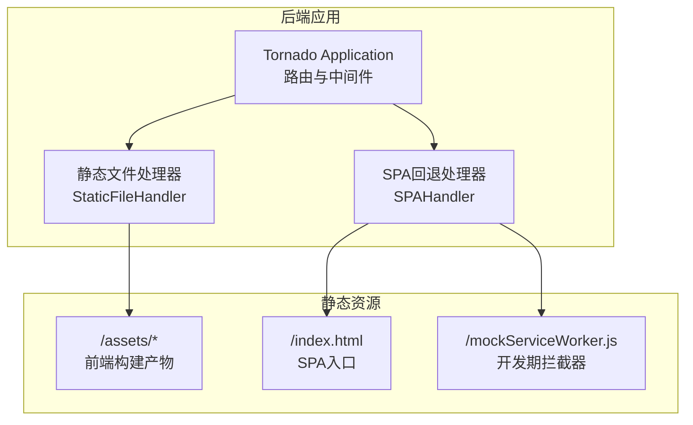
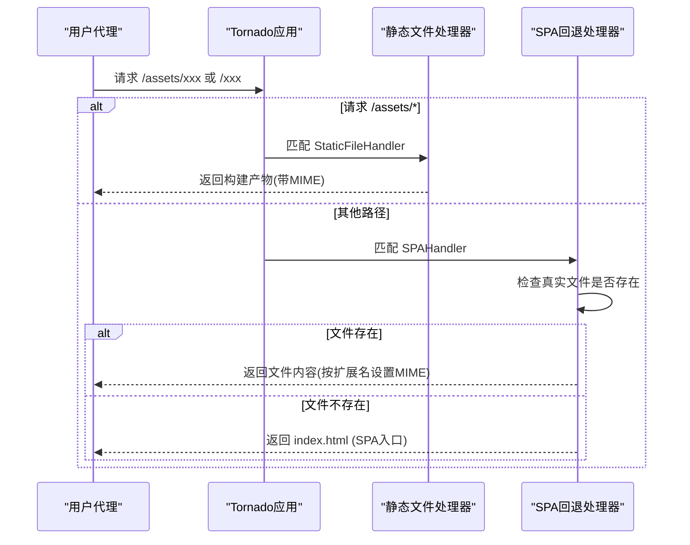
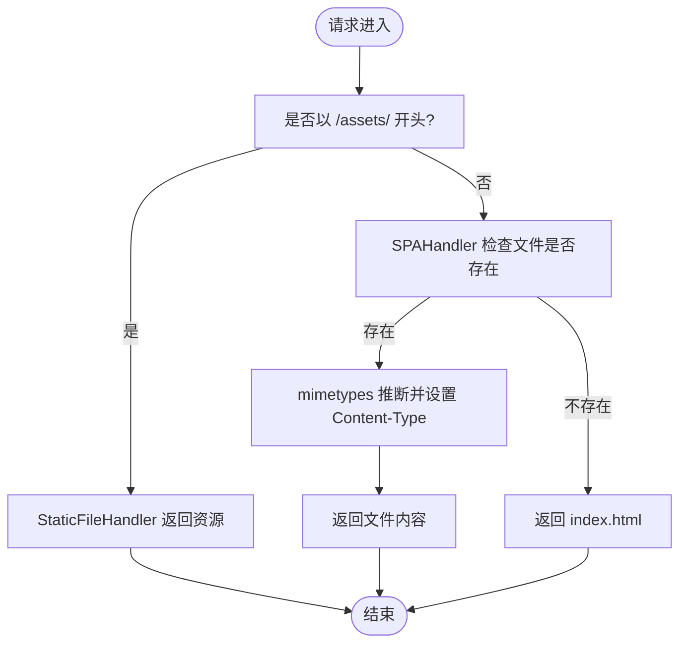
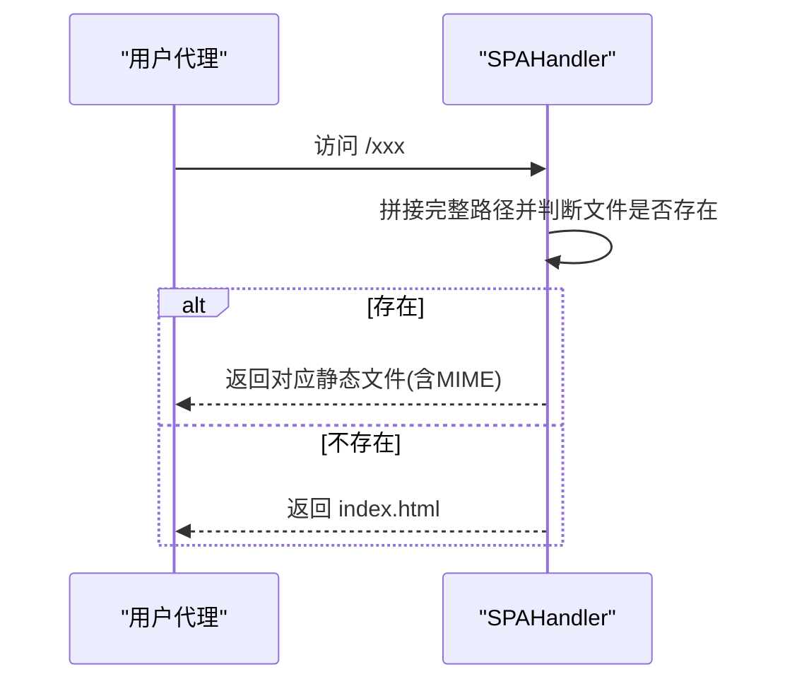
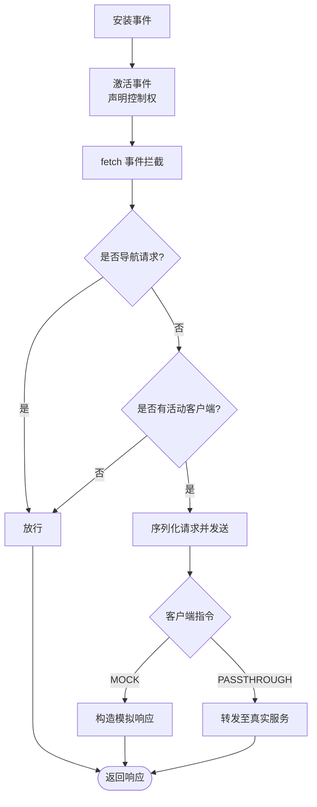
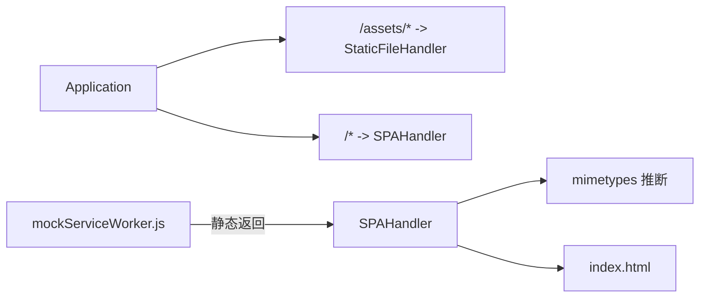

# 静态资源服务

<cite>
**本文引用的文件**
- [web_service.py](file://docker/stock/quantia/web/web_service.py)
- [index.html](file://docker/stock/quantia/web/static/index.html)
- [mockServiceWorker.js](file://docker/stock/quantia/web/static/mockServiceWorker.js)
- [base.py](file://docker/stock/quantia/web/base.py)
</cite>

## 目录
1. [简介](#简介)
2. [项目结构](#项目结构)
3. [核心组件](#核心组件)
4. [架构总览](#架构总览)
5. [组件详解](#组件详解)
6. [依赖关系分析](#依赖关系分析)
7. [性能与缓存策略](#性能与缓存策略)
8. [故障排查指南](#故障排查指南)
9. [结论](#结论)
10. [附录](#附录)

## 简介
本文件面向Quantia项目的静态资源服务，聚焦于Tornado后端如何提供前端构建产物（assets）、MIME类型识别、SPA回退机制、以及开发期的Mock Service Worker支持。文档同时给出性能优化建议、浏览器缓存策略与安全注意事项，帮助在保证高效性的同时提升可靠性。

## 项目结构
静态资源服务位于后端应用的web包中，核心包括：
- 静态文件根目录：/web/static
- 资源分发路由：/assets/*
- SPA回退：除API外的所有路径均回退到index.html
- 开发辅助：mockServiceWorker.js用于MSW拦截与模拟响应

**图表来源**
- [web_service.py](file://docker/stock/quantia/web/web_service.py#L53-L100)
- [index.html](file://docker/stock/quantia/web/static/index.html#L1-L15)
- [mockServiceWorker.js](file://docker/stock/quantia/web/static/mockServiceWorker.js#L1-L350)

**章节来源**
- [web_service.py](file://docker/stock/quantia/web/web_service.py#L53-L100)
- [index.html](file://docker/stock/quantia/web/static/index.html#L1-L15)

## 核心组件
- 应用与路由
  - 定义了静态资源路由与SPA回退逻辑，统一模板与静态目录配置。
- 静态文件处理器
  - 使用Tornado内置的StaticFileHandler分发assets目录下的构建产物。
- SPA回退处理器
  - 对非API路径进行存在性判断，若不存在则回退到index.html，支持前端路由。
- MIME类型识别
  - 在SPA回退处理器中对真实存在的静态文件进行MIME类型推断并设置响应头。
- CORS基础能力
  - 基类提供通用CORS头设置与预检处理，便于API接口跨域访问。

**章节来源**
- [web_service.py](file://docker/stock/quantia/web/web_service.py#L53-L100)
- [web_service.py](file://docker/stock/quantia/web/web_service.py#L102-L125)
- [base.py](file://docker/stock/quantia/web/base.py#L14-L26)

## 架构总览
下图展示从客户端请求到静态资源返回的关键流程，包括API与SPA回退两条路径。

**图表来源**
- [web_service.py](file://docker/stock/quantia/web/web_service.py#L84-L87)
- [web_service.py](file://docker/stock/quantia/web/web_service.py#L102-L125)

## 组件详解

### 静态文件分发与MIME识别
- 分发规则
  - /assets/* 由StaticFileHandler直接映射至静态目录中的assets子目录。
- MIME识别
  - 当请求的路径指向真实存在的静态文件时，使用mimetypes库推断Content-Type并设置响应头。
- 入口页与资源引用
  - index.html中通过相对路径引用构建产物，框架会根据路径交由静态处理器返回。

**图表来源**
- [web_service.py](file://docker/stock/quantia/web/web_service.py#L84-L87)
- [web_service.py](file://docker/stock/quantia/web/web_service.py#L110-L124)

**章节来源**
- [web_service.py](file://docker/stock/quantia/web/web_service.py#L84-L87)
- [web_service.py](file://docker/stock/quantia/web/web_service.py#L110-L124)
- [index.html](file://docker/stock/quantia/web/static/index.html#L8-L9)

### SPA回退与前端路由支持
- 回退策略
  - 除API路由外，所有其他路径均回退到index.html，使前端单页应用可接管路由。
- 实现要点
  - 先尝试定位真实文件；若不存在再返回index.html，既保证静态资源命中，又支持前端路由。

**图表来源**
- [web_service.py](file://docker/stock/quantia/web/web_service.py#L102-L125)

**章节来源**
- [web_service.py](file://docker/stock/quantia/web/web_service.py#L84-L87)
- [web_service.py](file://docker/stock/quantia/web/web_service.py#L102-L125)

### 开发期Mock Service Worker
- 作用
  - 在开发环境中拦截网络请求，支持模拟响应与“直通”请求，便于离线与测试。
- 关键行为
  - 安装与激活阶段的生命周期处理。
  - fetch事件拦截，区分导航请求与资源请求，维护活动客户端集合。
  - 将请求序列化并发送给主页面客户端，依据客户端指令决定mock或passthrough。
- 生效范围
  - 默认仅在开发环境启用，生产部署通常不包含该脚本。

**图表来源**
- [mockServiceWorker.js](file://docker/stock/quantia/web/static/mockServiceWorker.js#L15-L89)
- [mockServiceWorker.js](file://docker/stock/quantia/web/static/mockServiceWorker.js#L91-L280)

**章节来源**
- [mockServiceWorker.js](file://docker/stock/quantia/web/static/mockServiceWorker.js#L1-L350)

### CORS与安全基线
- CORS设置
  - 基类提供通用跨域头与预检处理，便于API接口跨域访问。
- 安全建议
  - 生产环境建议限制Access-Control-Allow-Origin为可信域名。
  - 对静态资源可考虑开启缓存控制与安全响应头（如X-Content-Type-Options）。

**章节来源**
- [base.py](file://docker/stock/quantia/web/base.py#L14-L26)

## 依赖关系分析
- 路由与处理器
  - Application集中定义路由、静态目录与模板目录。
  - SPAHandler依赖静态目录路径与index.html的存在。
- MIME识别
  - SPAHandler在返回真实文件时依赖mimetypes模块进行类型推断。
- Mock Service Worker
  - 作为静态资源被SPAHandler返回，但其拦截逻辑在浏览器侧执行。

**图表来源**
- [web_service.py](file://docker/stock/quantia/web/web_service.py#L53-L100)
- [web_service.py](file://docker/stock/quantia/web/web_service.py#L102-L125)

**章节来源**
- [web_service.py](file://docker/stock/quantia/web/web_service.py#L53-L100)
- [web_service.py](file://docker/stock/quantia/web/web_service.py#L102-L125)

## 性能与缓存策略
- 浏览器缓存
  - 对静态构建产物（JS/CSS）采用长缓存策略，文件名包含哈希值，实现强缓存与版本隔离。
- 服务器端缓存
  - Tornado默认对静态文件具备较好的I/O效率；可结合反向代理（如Nginx）进一步优化并发与压缩。
- 压缩与传输
  - 建议在反向代理层启用Gzip/Brotli压缩，减少首屏加载时间。
- 资源加载优化
  - 将关键CSS内联，异步加载非关键资源；合理拆分代码块，降低初始包体积。
- CDN集成
  - 将assets目录托管至CDN，利用边缘节点就近分发；配合缓存头与失效策略，平衡新鲜度与性能。
- 版本管理
  - 通过文件名哈希实现不可变缓存；发布新版本时仅变更哈希文件，旧缓存自然淘汰。
- 热更新机制
  - 前端SPA通过路由回退实现“热更新”体验；静态资源层面依赖版本化文件名与缓存失效策略。

[本节为通用性能建议，无需特定文件引用]

## 故障排查指南
- 404错误
  - 若访问/index.html或静态资源返回404，检查静态目录配置与文件是否存在。
- MIME类型错误
  - 若CSS/JS无法正确解析，确认mimetypes推断结果与浏览器兼容性。
- SPA回退异常
  - 若前端路由无法正常工作，确认非API路径是否正确回退到index.html。
- Mock Service Worker问题
  - 若开发环境请求未被拦截，检查脚本是否被正确返回且未被缓存；确认浏览器已启用Service Worker。

**章节来源**
- [web_service.py](file://docker/stock/quantia/web/web_service.py#L110-L124)
- [mockServiceWorker.js](file://docker/stock/quantia/web/static/mockServiceWorker.js#L91-L117)

## 结论
Quantia的静态资源服务以Tornado为核心，通过明确的路由分发与SPA回退机制，实现了对前端构建产物的高效分发与前端路由的无缝支持。配合MIME类型识别与开发期的Mock Service Worker，系统在开发与生产场景下均具备良好的可用性与可维护性。建议在生产环境中引入CDN、压缩与合理的缓存策略，以进一步提升性能与用户体验。

## 附录
- 配置要点
  - 静态目录与模板目录需保持一致，避免路径错配。
  - /assets/*路由必须指向构建产物所在目录。
- 最佳实践
  - 使用文件名哈希实现版本化；在反向代理层统一开启压缩与缓存。
  - 生产环境关闭开发期的Mock Service Worker脚本。
