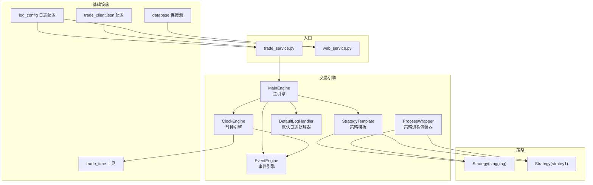
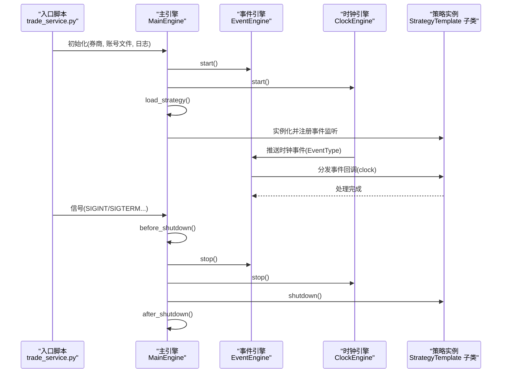
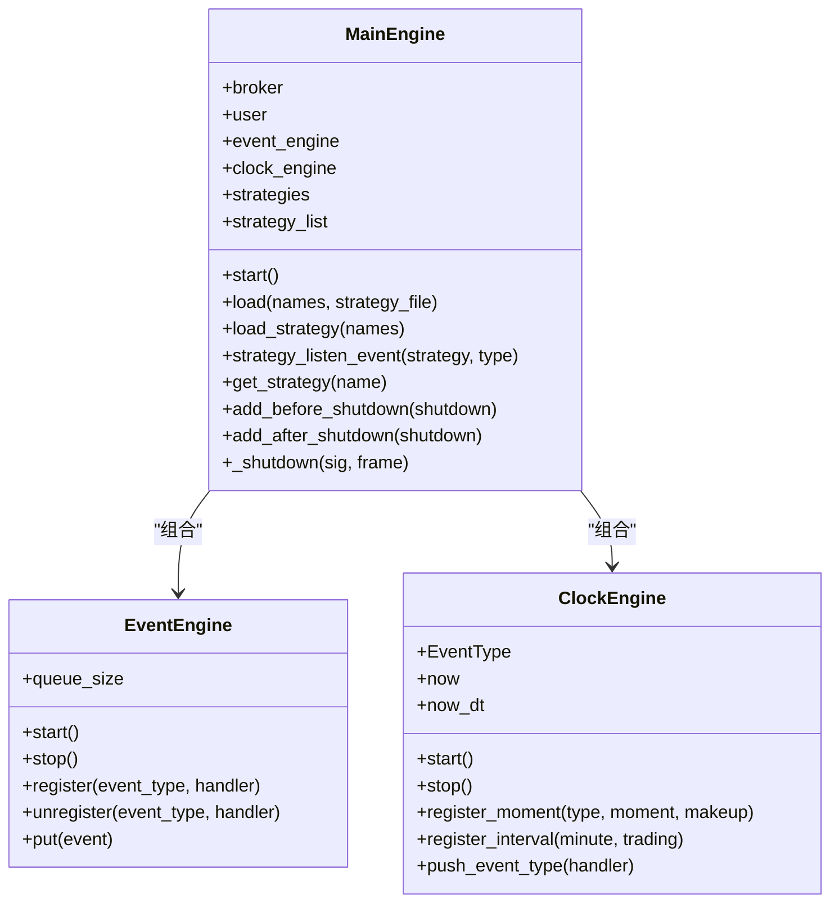
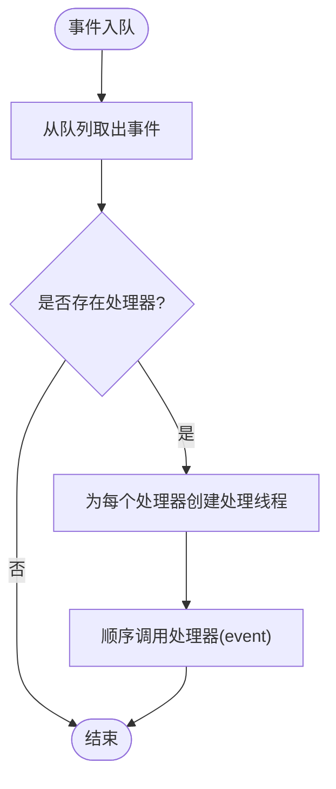
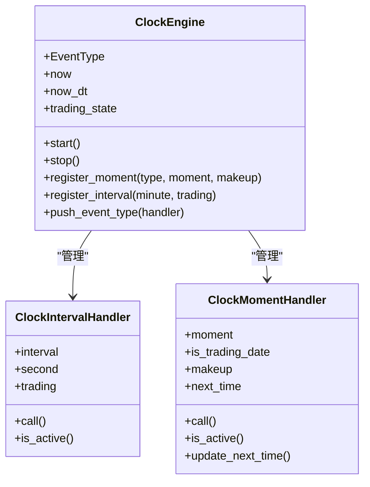
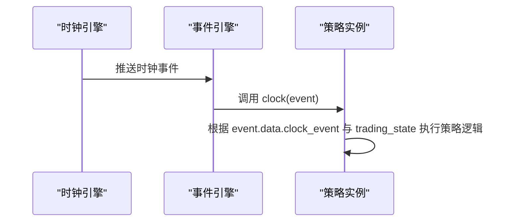
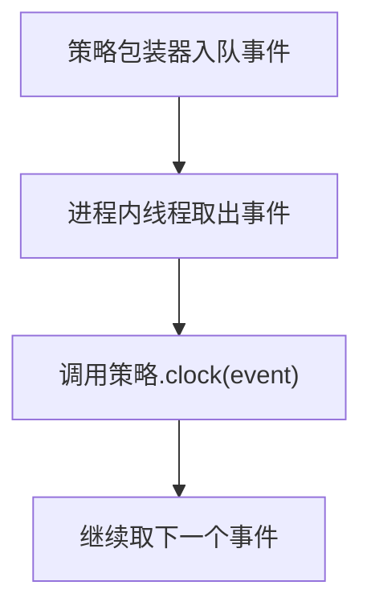
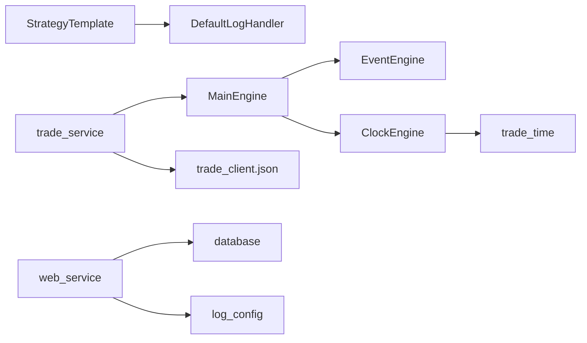

# 交易引擎架构

<cite>
**本文引用的文件**   
- [main_engine.py](file://quantia/trade/robot/engine/main_engine.py)
- [event_engine.py](file://quantia/trade/robot/engine/event_engine.py)
- [clock_engine.py](file://quantia/trade/robot/engine/clock_engine.py)
- [default_handler.py](file://quantia/trade/robot/infrastructure/default_handler.py)
- [strategy_template.py](file://quantia/trade/robot/infrastructure/strategy_template.py)
- [strategy_wrapper.py](file://quantia/trade/robot/infrastructure/strategy_wrapper.py)
- [trade_time.py](file://quantia/lib/trade_time.py)
- [trade_service.py](file://quantia/trade/trade_service.py)
- [web_service.py](file://quantia/web/web_service.py)
- [stagging.py](file://docker/stock/quantia/trade/strategies/stagging.py)
- [stratey1.py](file://docker/stock/quantia/trade/strategies/stratey1.py)
- [trade_client.json](file://docker/stock/quantia/config/trade_client.json)
- [database.py](file://docker/stock/quantia/lib/database.py)
- [log_config.py](file://docker/stock/quantia/lib/log_config.py)
</cite>

## 目录
1. [简介](#简介)
2. [项目结构](#项目结构)
3. [核心组件](#核心组件)
4. [架构总览](#架构总览)
5. [详细组件分析](#详细组件分析)
6. [依赖分析](#依赖分析)
7. [性能考虑](#性能考虑)
8. [故障排查指南](#故障排查指南)
9. [结论](#结论)
10. [附录](#附录)

## 简介
本技术文档面向交易引擎的架构与实现，围绕主引擎 MainEngine 的设计原理、事件驱动架构、时钟引擎机制展开，系统阐述引擎的启动流程、组件初始化、事件循环机制与消息传递模式。文档同时覆盖扩展性设计、性能优化策略、错误处理机制、配置参数说明、监控指标与调试方法，帮助开发者快速理解并高效扩展交易引擎。

## 项目结构
交易引擎位于 quantia/trade/robot 目录下，采用“引擎 + 基础设施 + 策略”的分层组织方式：
- engine：事件引擎与时钟引擎等核心运行时组件
- infrastructure：策略模板、日志处理器、策略包装器等基础设施
- strategies：策略实现目录（示例策略）
- lib：交易时间工具、数据库连接与日志配置等通用库
- trade_service.py：交易服务入口，负责实例化主引擎并启动
- web_service.py：Web 服务入口，提供前端交互与回测接口

图表来源
- [main_engine.py](file://quantia/trade/robot/engine/main_engine.py#L22-L232)
- [event_engine.py](file://quantia/trade/robot/engine/event_engine.py#L19-L85)
- [clock_engine.py](file://quantia/trade/robot/engine/clock_engine.py#L99-L231)
- [strategy_template.py](file://quantia/trade/robot/infrastructure/strategy_template.py#L9-L43)
- [default_handler.py](file://quantia/trade/robot/infrastructure/default_handler.py#L15-L37)
- [strategy_wrapper.py](file://quantia/trade/robot/infrastructure/strategy_wrapper.py#L12-L45)
- [trade_time.py](file://quantia/lib/trade_time.py#L12-L224)
- [trade_service.py](file://quantia/trade/trade_service.py#L19-L31)
- [web_service.py](file://quantia/web/web_service.py#L53-L143)
- [database.py](file://docker/stock/quantia/lib/database.py#L58-L84)
- [log_config.py](file://docker/stock/quantia/lib/log_config.py#L47-L104)
- [trade_client.json](file://docker/stock/quantia/config/trade_client.json#L1-L5)

章节来源
- [trade_service.py](file://quantia/trade/trade_service.py#L19-L31)
- [web_service.py](file://quantia/web/web_service.py#L53-L143)

## 核心组件
- 主引擎 MainEngine：负责初始化事件引擎、时钟引擎、交易账户接入、策略加载与动态重载、生命周期钩子注册与优雅停机。
- 事件引擎 EventEngine：基于队列与线程的事件分发器，支持注册/注销事件处理器，异步处理事件。
- 时钟引擎 ClockEngine：提供统一时间源与交易状态，按固定间隔或特定时刻推送时钟事件，驱动策略执行。
- 策略模板 StrategyTemplate：策略基类，提供统一的初始化、时钟回调、日志句柄与关闭钩子。
- 默认日志处理器 DefaultLogHandler：统一日志输出到控制台或文件，支持级别与格式配置。
- 策略包装器 ProcessWrapper：将策略时钟事件投递到独立进程，隔离策略执行风险。
- 交易时间工具 trade_time：提供交易日/交易时段判断与历史区间计算。
- Web 服务入口 web_service：提供前端交互、回测与数据接口。
- 数据库连接 database：提供 SQLAlchemy 连接池与常用增删改查封装。
- 日志配置 log_config：统一日志格式与轮转策略。

章节来源
- [main_engine.py](file://quantia/trade/robot/engine/main_engine.py#L22-L232)
- [event_engine.py](file://quantia/trade/robot/engine/event_engine.py#L19-L85)
- [clock_engine.py](file://quantia/trade/robot/engine/clock_engine.py#L99-L231)
- [strategy_template.py](file://quantia/trade/robot/infrastructure/strategy_template.py#L9-L43)
- [default_handler.py](file://quantia/trade/robot/infrastructure/default_handler.py#L15-L37)
- [strategy_wrapper.py](file://quantia/trade/robot/infrastructure/strategy_wrapper.py#L12-L45)
- [trade_time.py](file://quantia/lib/trade_time.py#L12-L224)
- [web_service.py](file://quantia/web/web_service.py#L53-L143)
- [database.py](file://docker/stock/quantia/lib/database.py#L58-L84)
- [log_config.py](file://docker/stock/quantia/lib/log_config.py#L47-L104)

## 架构总览
交易引擎采用“事件驱动 + 时钟驱动”的双驱动模型：
- 事件驱动：策略通过事件引擎注册回调，接收时钟事件驱动策略逻辑。
- 时钟驱动：时钟引擎周期性推送“开盘/休市/继续/收盘”及固定间隔事件，策略据此执行买卖、风控、统计等动作。
- 生命周期：主引擎负责启动事件与时钟引擎、加载策略、注册信号处理与优雅停机。

图表来源
- [trade_service.py](file://quantia/trade/trade_service.py#L19-L31)
- [main_engine.py](file://quantia/trade/robot/engine/main_engine.py#L81-L232)
- [event_engine.py](file://quantia/trade/robot/engine/event_engine.py#L54-L85)
- [clock_engine.py](file://quantia/trade/robot/engine/clock_engine.py#L169-L204)
- [strategy_template.py](file://quantia/trade/robot/infrastructure/strategy_template.py#L27-L43)

## 详细组件分析

### 主引擎 MainEngine
- 职责
  - 初始化事件引擎与时钟引擎
  - 加载并动态重载策略，维护策略实例列表与事件监听
  - 注册系统信号，执行优雅停机流程（before_shutdown → main_shutdown → 策略 shutdown → after_shutdown）
  - 可选接入交易账户（easytrader），支持无交易模式
- 关键流程
  - 启动：先启动事件引擎，再启动时钟引擎
  - 策略加载：扫描策略目录，导入模块，实例化策略，注册事件监听
  - 动态重载：基于文件修改时间判断，必要时重载模块并更新监听
  - 停机：依次调用各阶段钩子，等待线程回收，逐个调用策略 shutdown

图表来源
- [main_engine.py](file://quantia/trade/robot/engine/main_engine.py#L22-L232)
- [event_engine.py](file://quantia/trade/robot/engine/event_engine.py#L19-L85)
- [clock_engine.py](file://quantia/trade/robot/engine/clock_engine.py#L99-L231)

章节来源
- [main_engine.py](file://quantia/trade/robot/engine/main_engine.py#L25-L232)

### 事件引擎 EventEngine
- 设计要点
  - 基于线程安全队列存储事件，单线程消费，每事件派生处理线程，避免阻塞事件队列
  - 事件类型到处理器列表的映射，支持多处理器链式处理
  - 提供注册/注销与入队接口，暴露队列长度用于监控
- 性能特征
  - 入队/出队为 O(1)，处理器执行在独立线程，吞吐高但需注意线程数量与上下文切换成本

图表来源
- [event_engine.py](file://quantia/trade/robot/engine/event_engine.py#L36-L53)

章节来源
- [event_engine.py](file://quantia/trade/robot/engine/event_engine.py#L19-L85)

### 时钟引擎 ClockEngine
- 设计要点
  - 统一时间源：提供秒级时间戳与带时区的 datetime
  - 交易状态：根据交易时间与交易日维护 trading_state
  - 两类触发器
    - 时刻触发：在指定时刻（可选仅交易日）触发，支持补发（makeup）
    - 间隔触发：按分钟粒度（0.5/1/5/15/30/60）触发，可选择仅交易阶段
  - 默认事件：开盘、休市、继续、收盘四个时刻事件
- 事件推送
  - 触发时构造事件对象，携带交易状态与触发类型，投递至事件引擎

图表来源
- [clock_engine.py](file://quantia/trade/robot/engine/clock_engine.py#L99-L231)

章节来源
- [clock_engine.py](file://quantia/trade/robot/engine/clock_engine.py#L99-L231)
- [trade_time.py](file://quantia/lib/trade_time.py#L12-L118)

### 策略模板 StrategyTemplate 与示例策略
- StrategyTemplate
  - 提供统一的初始化、时钟回调、日志句柄与关闭钩子
  - 策略可通过重写 clock 回调响应时钟事件
- 示例策略
  - stagging：在指定时刻触发打新逻辑
  - stratey1：演示买入/卖出与账户信息打印

图表来源
- [strategy_template.py](file://quantia/trade/robot/infrastructure/strategy_template.py#L27-L43)
- [stagging.py](file://docker/stock/quantia/trade/strategies/stagging.py#L36-L43)
- [stratey1.py](file://docker/stock/quantia/trade/strategies/stratey1.py#L47-L54)

章节来源
- [strategy_template.py](file://quantia/trade/robot/infrastructure/strategy_template.py#L9-L43)
- [stagging.py](file://docker/stock/quantia/trade/strategies/stagging.py#L14-L57)
- [stratey1.py](file://docker/stock/quantia/trade/strategies/stratey1.py#L14-L68)

### 策略包装器 ProcessWrapper
- 设计目的：将策略时钟事件投递到独立进程，隔离策略执行对主引擎的影响
- 机制：内部维护进程与队列，接收事件后在进程内调用策略 clock

图表来源
- [strategy_wrapper.py](file://quantia/trade/robot/infrastructure/strategy_wrapper.py#L25-L45)

章节来源
- [strategy_wrapper.py](file://quantia/trade/robot/infrastructure/strategy_wrapper.py#L12-L45)

### 日志与配置
- 默认日志处理器 DefaultLogHandler：支持 stdout/file 输出与级别配置
- 日志统一配置 log_config：提供三路输出（全量文件、错误汇总、控制台），统一格式与轮转
- 交易客户端配置 trade_client.json：包含账户、密码与下单程序路径

章节来源
- [default_handler.py](file://quantia/trade/robot/infrastructure/default_handler.py#L15-L37)
- [log_config.py](file://docker/stock/quantia/lib/log_config.py#L47-L104)
- [trade_client.json](file://docker/stock/quantia/config/trade_client.json#L1-L5)

## 依赖分析
- 组件耦合
  - MainEngine 组合 EventEngine 与 ClockEngine，策略通过事件引擎注册回调
  - ClockEngine 依赖 trade_time 工具判断交易日与交易时段
  - 策略模板与示例策略依赖默认日志处理器
  - Web 服务依赖数据库连接与日志配置
- 外部依赖
  - easytrader：交易账户接入（可选）
  - arrow/dateutil：时区与时钟时间处理
  - logbook：日志框架
  - tornado：Web 服务
  - sqlalchemy/pymysql：数据库访问

图表来源
- [main_engine.py](file://quantia/trade/robot/engine/main_engine.py#L43-L44)
- [clock_engine.py](file://quantia/trade/robot/engine/clock_engine.py#L106-L113)
- [web_service.py](file://quantia/web/web_service.py#L99-L100)
- [database.py](file://docker/stock/quantia/lib/database.py#L58-L84)
- [log_config.py](file://docker/stock/quantia/lib/log_config.py#L66-L103)
- [trade_client.json](file://docker/stock/quantia/config/trade_client.json#L1-L5)

章节来源
- [main_engine.py](file://quantia/trade/robot/engine/main_engine.py#L43-L44)
- [clock_engine.py](file://quantia/trade/robot/engine/clock_engine.py#L106-L113)
- [web_service.py](file://quantia/web/web_service.py#L99-L100)
- [database.py](file://docker/stock/quantia/lib/database.py#L58-L84)
- [log_config.py](file://docker/stock/quantia/lib/log_config.py#L66-L103)
- [trade_client.json](file://docker/stock/quantia/config/trade_client.json#L1-L5)

## 性能考虑
- 事件引擎
  - 事件处理线程化，避免阻塞事件队列；建议限制并发处理器数量，避免过度线程化导致上下文切换开销
  - 监控队列长度，及时发现积压
- 时钟引擎
  - 间隔事件粒度覆盖 0.5/1/5/15/30/60 分钟，策略应按需注册，避免过多高频事件
  - 仅交易阶段触发开关可减少非交易时段处理
- 数据库
  - 使用连接池（pool_size/max_overflow/pool_recycle/pool_pre_ping），避免频繁创建连接
  - 批量写入与主键/索引管理，降低重复写入与查询成本
- 日志
  - 控制台输出仅 WARNING+，避免 INFO 刷屏影响性能
  - 文件轮转，避免单文件过大

章节来源
- [event_engine.py](file://quantia/trade/robot/engine/event_engine.py#L36-L53)
- [clock_engine.py](file://quantia/trade/robot/engine/clock_engine.py#L150-L153)
- [database.py](file://docker/stock/quantia/lib/database.py#L58-L84)
- [log_config.py](file://docker/stock/quantia/lib/log_config.py#L96-L103)

## 故障排查指南
- 启动与停机
  - 确认信号处理：SIGINT/SIGTERM/SIGHUP/SIGQUIT 是否正确注册
  - 停机顺序：before_shutdown → main_shutdown → 等待线程回收 → 策略 shutdown → after_shutdown
- 策略加载与重载
  - 检查策略目录与文件命名规范，确保以 .py 结尾且非 __init__.py
  - 动态重载异常会记录日志，确认文件修改时间与缓存一致性
- 交易账户
  - 账号文件不存在时，引擎进入无交易模式；检查 trade_client.json 路径与权限
- 事件积压
  - 查看事件引擎队列长度，定位慢处理器或过载事件
- 交易时间
  - 使用 trade_time 工具确认当前日期是否为交易日、当前时间是否处于交易时段

章节来源
- [main_engine.py](file://quantia/trade/robot/engine/main_engine.py#L165-L172)
- [main_engine.py](file://quantia/trade/robot/engine/main_engine.py#L201-L232)
- [trade_service.py](file://quantia/trade/trade_service.py#L20-L25)
- [trade_client.json](file://docker/stock/quantia/config/trade_client.json#L1-L5)
- [event_engine.py](file://quantia/trade/robot/engine/event_engine.py#L82-L85)
- [trade_time.py](file://quantia/lib/trade_time.py#L12-L118)

## 结论
交易引擎通过事件驱动与时间驱动相结合的方式，实现了策略的解耦与可扩展。主引擎负责生命周期与组件编排，事件引擎提供高吞吐的消息分发，时钟引擎提供统一的时间与交易状态感知。配合完善的日志与数据库基础设施，开发者可在保证性能与稳定性的同时快速迭代策略与功能。

## 附录

### 配置参数说明
- trade_client.json
  - user：账户编号
  - password：账户密码
  - exe_path：券商客户端执行路径
- 数据库连接
  - 通过环境变量覆盖 host/user/password/database/port
  - 连接池参数：pool_size、max_overflow、pool_recycle、pool_pre_ping、pool_timeout
- 日志
  - log_config：统一日志格式、轮转策略与输出目标
  - DefaultLogHandler：日志级别与输出类型（stdout/file）

章节来源
- [trade_client.json](file://docker/stock/quantia/config/trade_client.json#L1-L5)
- [database.py](file://docker/stock/quantia/lib/database.py#L22-L84)
- [log_config.py](file://docker/stock/quantia/lib/log_config.py#L47-L104)
- [default_handler.py](file://quantia/trade/robot/infrastructure/default_handler.py#L18-L36)

### 监控指标建议
- 事件引擎
  - 事件队列长度
  - 处理耗时分布（可结合日志时间戳）
- 时钟引擎
  - 交易状态切换次数与持续时间
  - 间隔事件触发计数
- 数据库
  - 连接池活跃连接数、等待超时次数
- 日志
  - ERROR/WARNING 级别计数

章节来源
- [event_engine.py](file://quantia/trade/robot/engine/event_engine.py#L82-L85)
- [clock_engine.py](file://quantia/trade/robot/engine/clock_engine.py#L169-L204)
- [database.py](file://docker/stock/quantia/lib/database.py#L58-L84)
- [log_config.py](file://docker/stock/quantia/lib/log_config.py#L74-L103)

### 调试方法
- 启用动态策略重载：在开发阶段启用策略文件变更自动重载，便于快速迭代
- 自定义日志：策略可提供自定义日志处理器，分离策略日志与系统日志
- Web 调试：通过 web_service 提供的接口查看数据与回测结果，辅助策略验证

章节来源
- [trade_service.py](file://quantia/trade/trade_service.py#L23-L25)
- [stagging.py](file://docker/stock/quantia/trade/strategies/stagging.py#L44-L49)
- [stratey1.py](file://docker/stock/quantia/trade/strategies/stratey1.py#L55-L60)
- [web_service.py](file://quantia/web/web_service.py#L53-L143)
