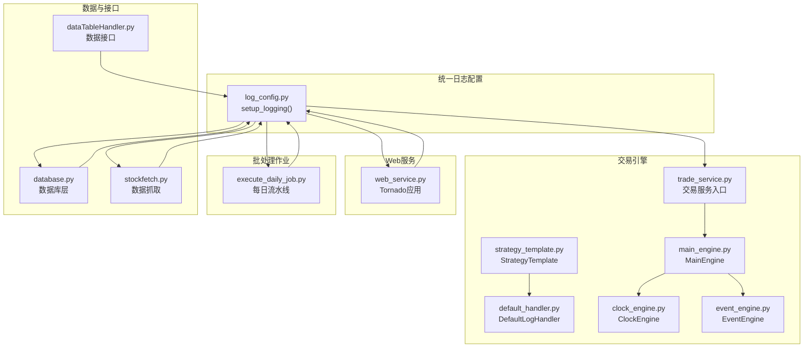
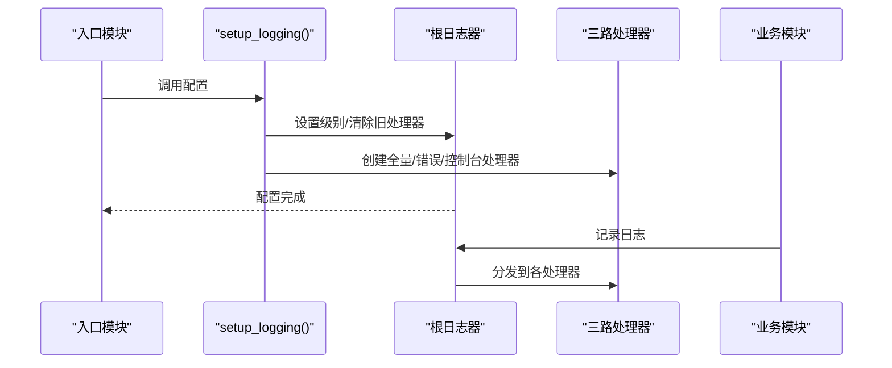
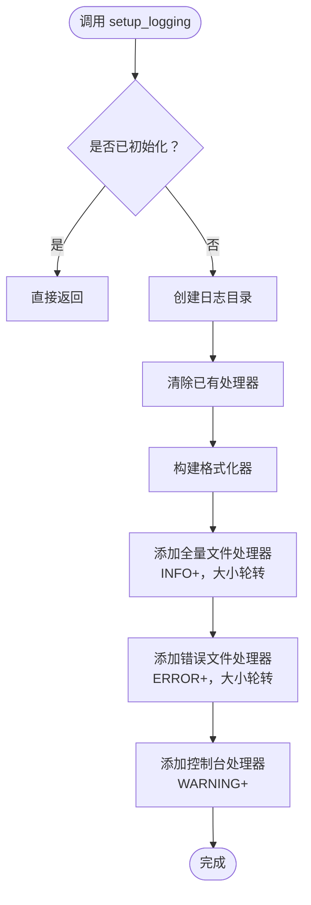
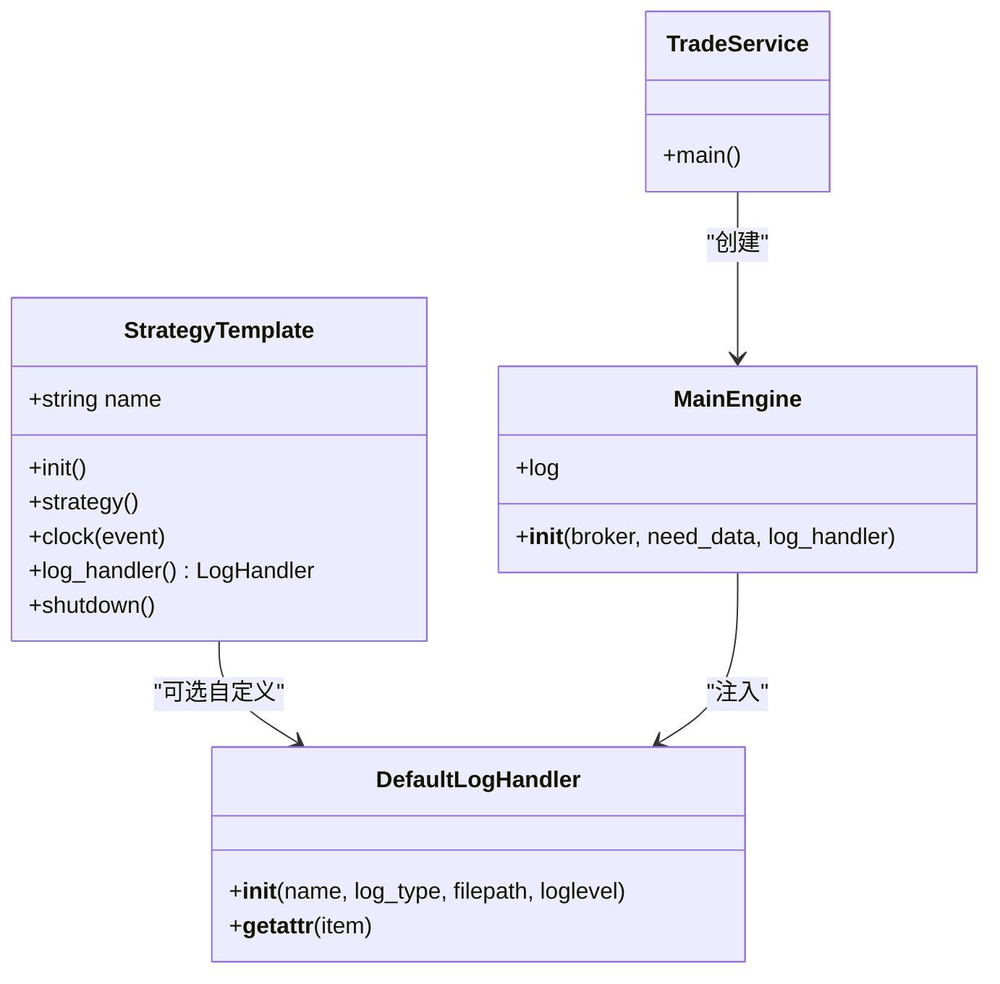
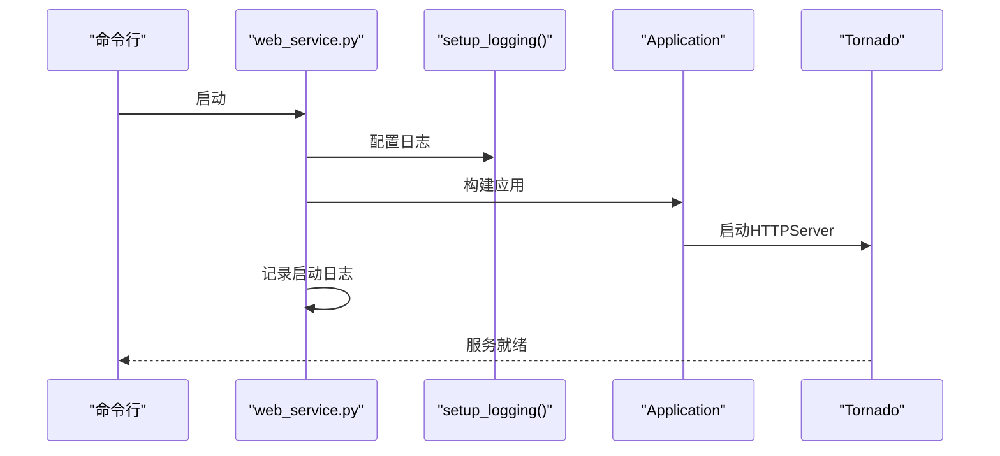
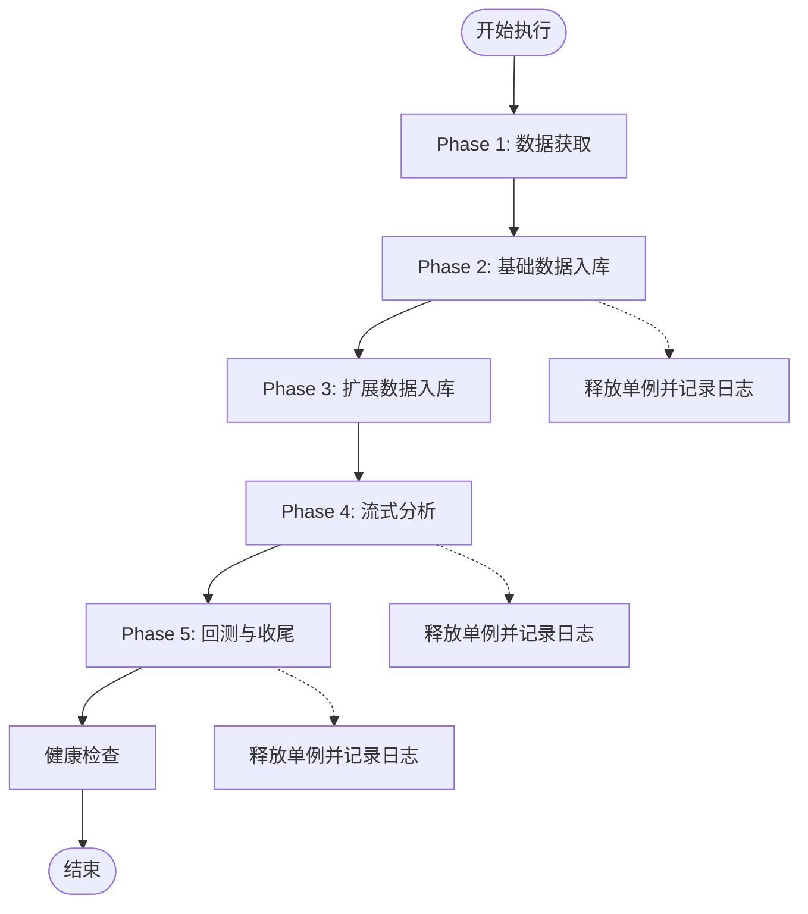
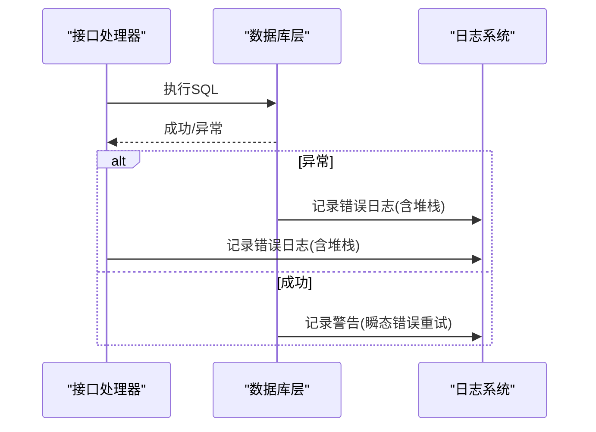
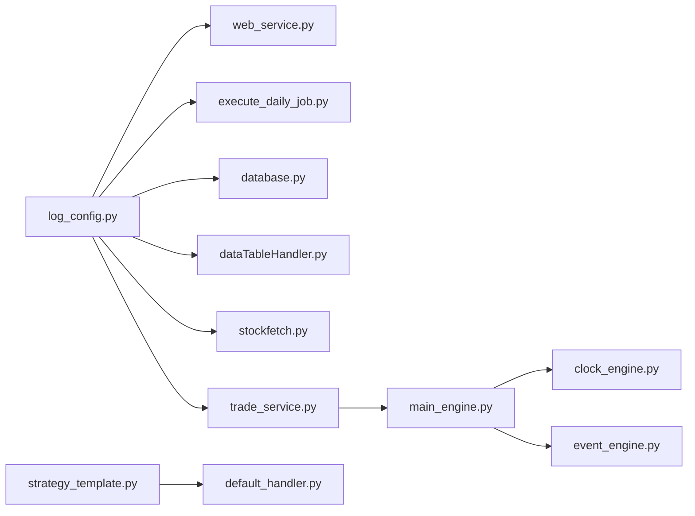

# 交易日志管理

<cite>
**本文引用的文件**
- [log_config.py](file://quantia/lib/log_config.py)
- [default_handler.py](file://quantia/trade/robot/infrastructure/default_handler.py)
- [strategy_template.py](file://quantia/trade/robot/infrastructure/strategy_template.py)
- [clock_engine.py](file://quantia/trade/robot/engine/clock_engine.py)
- [event_engine.py](file://quantia/trade/robot/engine/event_engine.py)
- [main_engine.py](file://quantia/trade/robot/engine/main_engine.py)
- [trade_service.py](file://quantia/trade/trade_service.py)
- [execute_daily_job.py](file://quantia/job/execute_daily_job.py)
- [web_service.py](file://quantia/web/web_service.py)
- [database.py](file://quantia/lib/database.py)
- [dataTableHandler.py](file://quantia/web/dataTableHandler.py)
- [stockfetch.py](file://quantia/core/stockfetch.py)
</cite>

## 目录
1. [简介](#简介)
2. [项目结构](#项目结构)
3. [核心组件](#核心组件)
4. [架构总览](#架构总览)
5. [详细组件分析](#详细组件分析)
6. [依赖分析](#依赖分析)
7. [性能考虑](#性能考虑)
8. [故障排查指南](#故障排查指南)
9. [结论](#结论)
10. [附录](#附录)

## 简介
本文件面向交易系统的日志管理，系统性阐述日志记录策略、日志级别、日志格式规范、分类管理、存储策略、轮转机制、归档规则、日志分析方法、性能监控、故障排查与审计追踪，并提供日志配置选项、查询工具与可视化方案，确保交易过程的可追溯性与合规性。

## 项目结构
交易日志管理涉及多个子系统：
- 统一日志配置：提供统一的根日志器配置，三路输出（全量日志、错误日志、控制台），并采用大小轮转。
- 交易引擎日志：策略模板与主引擎通过默认日志处理器记录交易生命周期事件。
- Web服务日志：Tornado应用启动与路由访问日志，统一接入统一日志配置。
- 批处理作业日志：每日执行流水线各阶段日志，包含健康检查与异常兜底。
- 数据库与接口层日志：SQL执行、异常重试、参数化查询与敏感信息脱敏。

**图表来源**
- [log_config.py](file://quantia/lib/log_config.py#L47-L103)
- [trade_service.py](file://quantia/trade/trade_service.py#L19-L31)
- [main_engine.py](file://quantia/trade/robot/engine/main_engine.py#L22-L43)
- [clock_engine.py](file://quantia/trade/robot/engine/clock_engine.py#L99-L230)
- [event_engine.py](file://quantia/trade/robot/engine/event_engine.py#L19-L49)
- [web_service.py](file://quantia/web/web_service.py#L20-L30)
- [execute_daily_job.py](file://quantia/job/execute_daily_job.py#L17-L28)
- [database.py](file://quantia/lib/database.py#L43-L83)
- [dataTableHandler.py](file://quantia/web/dataTableHandler.py#L157-L177)
- [stockfetch.py](file://quantia/core/stockfetch.py#L150-L181)

**章节来源**
- [log_config.py](file://quantia/lib/log_config.py#L1-L104)
- [web_service.py](file://quantia/web/web_service.py#L1-L143)
- [execute_daily_job.py](file://quantia/job/execute_daily_job.py#L1-L200)
- [database.py](file://quantia/lib/database.py#L1-L200)
- [trade_service.py](file://quantia/trade/trade_service.py#L1-L31)

## 核心组件
- 统一日志配置：提供统一的根日志器配置，确保格式一致、输出路径统一、轮转策略一致。
- 交易引擎日志：策略模板与主引擎通过默认日志处理器记录交易生命周期事件，支持策略自定义日志句柄。
- Web服务日志：Tornado应用启动与路由访问日志，统一接入统一日志配置。
- 批处理作业日志：每日流水线阶段日志，包含健康检查与异常兜底。
- 数据库与接口层日志：SQL执行、异常重试、参数化查询与敏感信息脱敏。

**章节来源**
- [log_config.py](file://quantia/lib/log_config.py#L47-L103)
- [strategy_template.py](file://quantia/trade/robot/infrastructure/strategy_template.py#L9-L42)
- [default_handler.py](file://quantia/trade/robot/infrastructure/default_handler.py#L15-L36)
- [main_engine.py](file://quantia/trade/robot/engine/main_engine.py#L22-L43)
- [web_service.py](file://quantia/web/web_service.py#L20-L30)
- [execute_daily_job.py](file://quantia/job/execute_daily_job.py#L17-L28)
- [database.py](file://quantia/lib/database.py#L43-L83)

## 架构总览
统一日志配置作为根配置，被Web服务、批处理作业、数据库与接口层、交易引擎等模块统一调用。交易引擎通过策略模板与默认日志处理器实现策略级日志隔离与统一管理。

**图表来源**
- [log_config.py](file://quantia/lib/log_config.py#L47-L103)

**章节来源**
- [log_config.py](file://quantia/lib/log_config.py#L47-L103)

## 详细组件分析

### 统一日志配置（log_config.py）
- 功能要点
  - 三路输出：全量日志文件（INFO+）、错误日志文件（ERROR+）、控制台（WARNING+）。
  - 轮转策略：按大小轮转，单文件上限与备份数量固定。
  - 格式规范：包含时间、级别、名称与消息。
  - 防重复配置：进程内仅首次生效，避免重复配置导致格式不一致。
- 日志文件
  - 全量日志：stock_{name}.log，按名称区分不同模块。
  - 错误日志：stock_error.log，所有模块共享，便于集中审计。
  - 控制台：WARNING+，避免INFO刷屏。
- 使用方式
  - 入口脚本顶部调用一次，推荐通过 logging.getLogger(__name__) 获取模块级logger。

**图表来源**
- [log_config.py](file://quantia/lib/log_config.py#L47-L103)

**章节来源**
- [log_config.py](file://quantia/lib/log_config.py#L1-L104)

### 交易引擎日志（strategy_template.py、default_handler.py、main_engine.py、trade_service.py）
- 策略模板
  - 支持策略自定义日志句柄，若未提供则使用主引擎日志句柄。
- 默认日志处理器
  - 支持stdout与file两种输出类型，按级别过滤。
- 主引擎
  - 初始化时注入日志句柄，交易服务入口创建策略日志文件。
- 交易服务
  - 通过默认日志处理器创建交易服务专用日志文件。

**图表来源**
- [strategy_template.py](file://quantia/trade/robot/infrastructure/strategy_template.py#L9-L42)
- [default_handler.py](file://quantia/trade/robot/infrastructure/default_handler.py#L15-L36)
- [main_engine.py](file://quantia/trade/robot/engine/main_engine.py#L22-L43)
- [trade_service.py](file://quantia/trade/trade_service.py#L19-L31)

**章节来源**
- [strategy_template.py](file://quantia/trade/robot/infrastructure/strategy_template.py#L9-L42)
- [default_handler.py](file://quantia/trade/robot/infrastructure/default_handler.py#L15-L36)
- [main_engine.py](file://quantia/trade/robot/engine/main_engine.py#L22-L43)
- [trade_service.py](file://quantia/trade/trade_service.py#L19-L31)

### Web服务日志（web_service.py）
- 启动日志：服务启动成功后记录启动信息与访问地址。
- 日志级别：统一接入统一日志配置，控制台WARNING+，避免刷屏。
- 路由访问：通过Tornado路由处理请求，异常通过顶层错误兜底并记录日志。

**图表来源**
- [web_service.py](file://quantia/web/web_service.py#L20-L30)
- [web_service.py](file://quantia/web/web_service.py#L127-L143)

**章节来源**
- [web_service.py](file://quantia/web/web_service.py#L1-L143)

### 批处理作业日志（execute_daily_job.py）
- 流水线阶段：数据获取、基础数据入库、扩展数据入库、流式分析、回测与收尾。
- 健康检查：流水线结束后检查核心表当日数据，便于排查“页面无数据”问题。
- 异常兜底：每个阶段均捕获异常并记录日志，包含堆栈信息。
- 单例释放：在关键节点释放单例并记录日志，避免资源泄漏。

**图表来源**
- [execute_daily_job.py](file://quantia/job/execute_daily_job.py#L80-L180)

**章节来源**
- [execute_daily_job.py](file://quantia/job/execute_daily_job.py#L1-L200)

### 数据库与接口层日志（database.py、dataTableHandler.py、stockfetch.py）
- 数据库层
  - 连接信息日志：使用脱敏后的连接信息记录，避免明文密码泄露。
  - SQL执行：对异常进行记录并保留堆栈，支持重试与参数化查询。
- 接口层
  - 查询异常：对未知列或表缺失等场景进行降级与重试，并记录警告或错误日志。
- 数据抓取
  - 失败聚合：对同一来源的多次失败进行聚合统计与周期性输出，避免日志风暴。

**图表来源**
- [database.py](file://quantia/lib/database.py#L267-L303)
- [dataTableHandler.py](file://quantia/web/dataTableHandler.py#L157-L177)
- [stockfetch.py](file://quantia/core/stockfetch.py#L150-L181)

**章节来源**
- [database.py](file://quantia/lib/database.py#L43-L83)
- [database.py](file://quantia/lib/database.py#L267-L303)
- [dataTableHandler.py](file://quantia/web/dataTableHandler.py#L157-L177)
- [stockfetch.py](file://quantia/core/stockfetch.py#L150-L181)

## 依赖分析
- 统一日志配置被Web服务、批处理作业、数据库与接口层、交易引擎广泛依赖。
- 交易引擎通过策略模板与默认日志处理器实现策略级日志隔离。
- 事件与时钟引擎为交易流程提供统一的时间与事件分发，日志贯穿其中。

**图表来源**
- [log_config.py](file://quantia/lib/log_config.py#L47-L103)
- [web_service.py](file://quantia/web/web_service.py#L20-L30)
- [execute_daily_job.py](file://quantia/job/execute_daily_job.py#L17-L28)
- [database.py](file://quantia/lib/database.py#L43-L83)
- [dataTableHandler.py](file://quantia/web/dataTableHandler.py#L157-L177)
- [stockfetch.py](file://quantia/core/stockfetch.py#L150-L181)
- [trade_service.py](file://quantia/trade/trade_service.py#L19-L31)
- [main_engine.py](file://quantia/trade/robot/engine/main_engine.py#L22-L43)
- [clock_engine.py](file://quantia/trade/robot/engine/clock_engine.py#L99-L230)
- [event_engine.py](file://quantia/trade/robot/engine/event_engine.py#L19-L49)
- [strategy_template.py](file://quantia/trade/robot/infrastructure/strategy_template.py#L9-L42)
- [default_handler.py](file://quantia/trade/robot/infrastructure/default_handler.py#L15-L36)

**章节来源**
- [log_config.py](file://quantia/lib/log_config.py#L47-L103)
- [web_service.py](file://quantia/web/web_service.py#L20-L30)
- [execute_daily_job.py](file://quantia/job/execute_daily_job.py#L17-L28)
- [database.py](file://quantia/lib/database.py#L43-L83)
- [dataTableHandler.py](file://quantia/web/dataTableHandler.py#L157-L177)
- [stockfetch.py](file://quantia/core/stockfetch.py#L150-L181)
- [trade_service.py](file://quantia/trade/trade_service.py#L19-L31)
- [main_engine.py](file://quantia/trade/robot/engine/main_engine.py#L22-L43)
- [clock_engine.py](file://quantia/trade/robot/engine/clock_engine.py#L99-L230)
- [event_engine.py](file://quantia/trade/robot/engine/event_engine.py#L19-L49)
- [strategy_template.py](file://quantia/trade/robot/infrastructure/strategy_template.py#L9-L42)
- [default_handler.py](file://quantia/trade/robot/infrastructure/default_handler.py#L15-L36)

## 性能考虑
- 日志级别与输出
  - 控制台WARNING+避免INFO刷屏，降低I/O压力。
  - 全量日志INFO+，错误日志ERROR+，兼顾可观测性与性能。
- 轮转策略
  - 单文件大小与备份数量固定，避免无限增长。
- 异常聚合
  - 数据抓取失败聚合输出，减少高频告警噪声。
- 连接与超时
  - 数据库连接超时与池化配置，减少阻塞与资源浪费。

[本节为通用指导，无需具体文件分析]

## 故障排查指南
- 启动与访问
  - Web服务启动后应查看统一日志配置输出，确认启动信息与端口。
- 数据库连接
  - 检查数据库连接日志，确认脱敏后的连接信息与异常堆栈。
  - 对瞬态错误进行重试记录，定位网络波动或服务不稳定。
- 接口查询
  - 对未知列或表缺失的异常进行降级处理并记录日志，必要时移除排序字段重试。
- 批处理流水线
  - 每个阶段均记录异常与堆栈，结合健康检查结果定位问题模块。
- 单例释放
  - 在关键节点释放单例并记录日志，避免资源泄漏与后续重试失败。

**章节来源**
- [web_service.py](file://quantia/web/web_service.py#L127-L143)
- [database.py](file://quantia/lib/database.py#L267-L303)
- [dataTableHandler.py](file://quantia/web/dataTableHandler.py#L157-L177)
- [execute_daily_job.py](file://quantia/job/execute_daily_job.py#L122-L130)
- [execute_daily_job.py](file://quantia/job/execute_daily_job.py#L151-L159)

## 结论
通过统一日志配置与多模块协同，交易系统实现了统一格式、分级输出、大小轮转与集中审计的能力。结合策略级日志隔离、Web服务与批处理作业的异常兜底、数据库层的参数化查询与脱敏记录，以及接口层的降级与聚合策略，系统在可追溯性与合规性方面具备坚实基础。

[本节为总结，无需具体文件分析]

## 附录

### 日志级别与记录策略
- CRITICAL：严重错误，影响系统可用性。
- ERROR：一般错误，需人工干预。
- WARNING：潜在问题或异常情况，需关注。
- INFO：常规运行信息，用于审计与追踪。
- DEBUG：开发调试信息，生产环境谨慎开启。

[本节为通用指导，无需具体文件分析]

### 日志格式规范
- 统一格式：包含时间、级别、名称与消息。
- 时间格式：统一为本地时间格式。
- 控制台格式：简化时间格式，突出级别与消息。

**章节来源**
- [log_config.py](file://quantia/lib/log_config.py#L38-L41)
- [log_config.py](file://quantia/lib/log_config.py#L99-L102)

### 存储策略与轮转机制
- 全量日志：按模块名称生成文件，INFO+，大小轮转。
- 错误日志：所有模块共享，ERROR+，大小轮转。
- 控制台：WARNING+，避免刷屏。
- 轮转参数：单文件大小与备份数量固定。

**章节来源**
- [log_config.py](file://quantia/lib/log_config.py#L40-L41)
- [log_config.py](file://quantia/lib/log_config.py#L74-L94)

### 归档规则与合规性
- 归档建议：基于时间维度（日/周/月）对日志文件进行归档压缩。
- 合规性：错误日志包含完整堆栈，便于审计与取证。
- 脱敏：数据库连接信息日志使用脱敏格式，避免敏感信息泄露。

**章节来源**
- [database.py](file://quantia/lib/database.py#L43-L43)
- [log_config.py](file://quantia/lib/log_config.py#L85-L94)

### 日志分析方法与查询工具
- 分析方法：基于关键字检索、正则匹配、聚合统计（如失败次数、耗时分布）。
- 查询工具：文本编辑器/终端工具（grep/awk/sed）、日志分析平台（ELK/Fluentd）。
- 可视化：基于日志统计生成趋势图、错误分布图、响应时间直方图。

[本节为通用指导，无需具体文件分析]

### 性能监控与告警
- 监控指标：日志写入速率、错误率、异常堆栈频率、接口超时与重试次数。
- 告警策略：针对ERROR及以上级别日志设置即时告警，对聚合异常设置周期性报告。

[本节为通用指导，无需具体文件分析]

### 审计追踪
- 交易生命周期：从策略初始化、时钟触发、事件处理到策略关闭的全流程日志。
- 数据变更：数据库增删改操作记录与参数化查询，便于审计。
- 用户行为：Web服务路由访问与关键操作记录，配合权限与审计日志。

**章节来源**
- [strategy_template.py](file://quantia/trade/robot/infrastructure/strategy_template.py#L20-L42)
- [clock_engine.py](file://quantia/trade/robot/engine/clock_engine.py#L172-L204)
- [database.py](file://quantia/lib/database.py#L140-L177)
