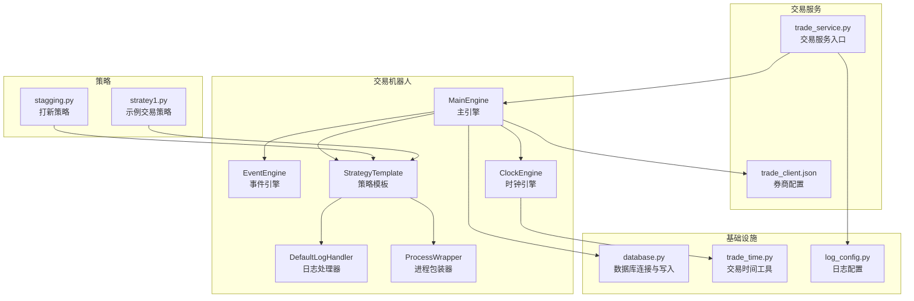
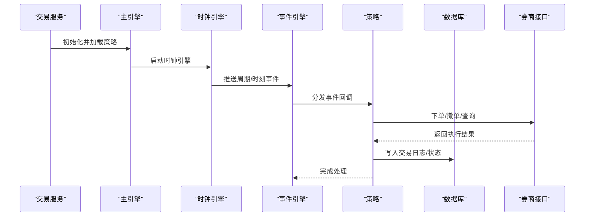
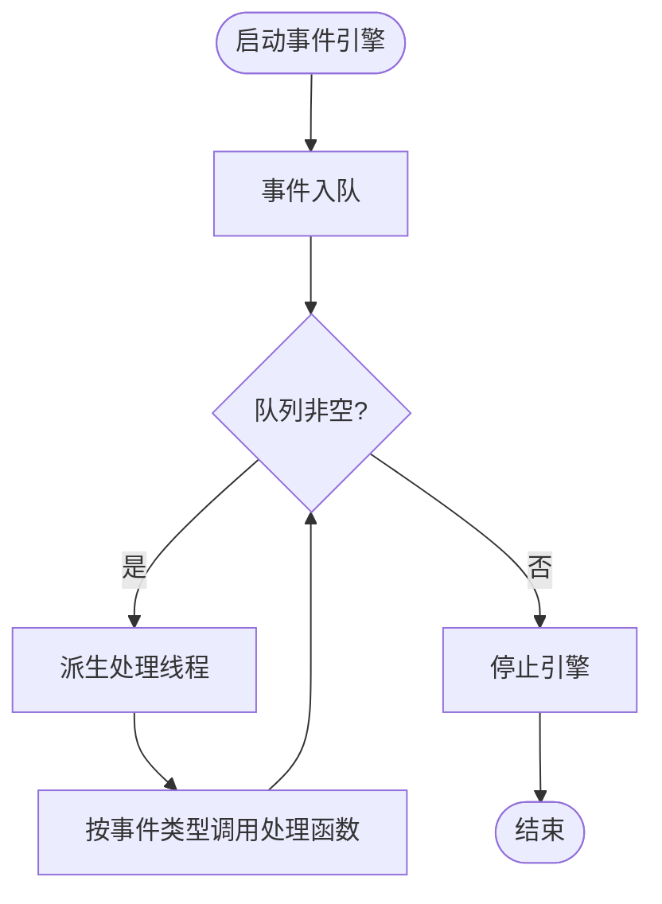
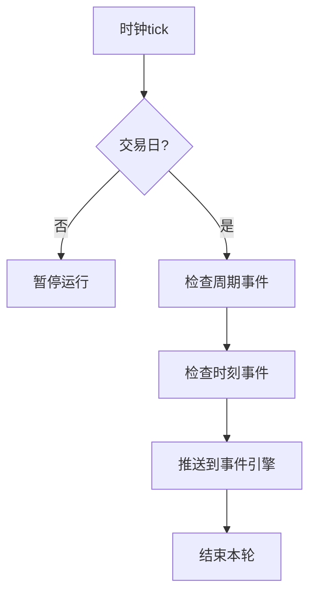
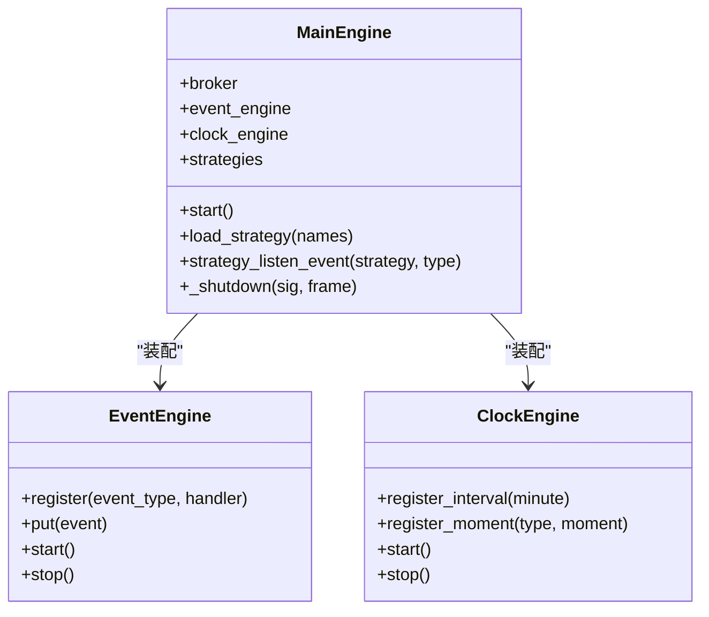
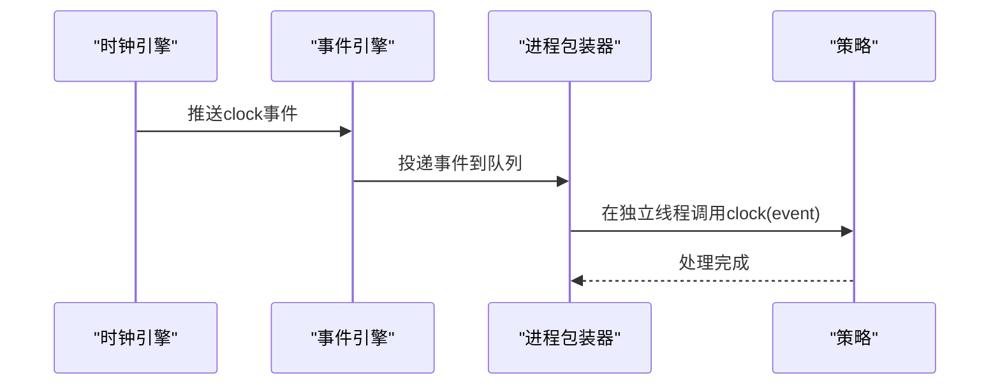
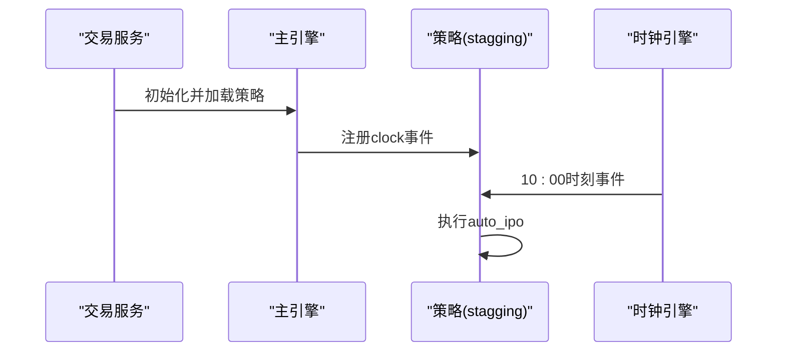
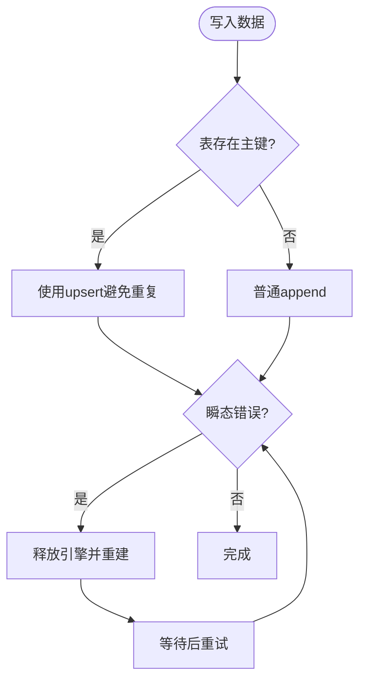
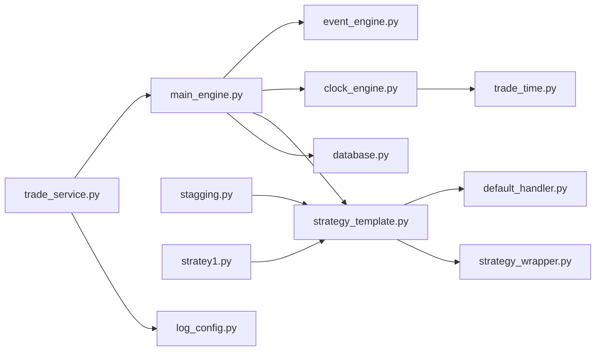

# 交易系统集成

<cite>
**本文引用的文件**
- [README.md](file://README.md)
- [QUICKSTART.md](file://QUICKSTART.md)
- [main_engine.py](file://quantia/trade/robot/engine/main_engine.py)
- [event_engine.py](file://quantia/trade/robot/engine/event_engine.py)
- [clock_engine.py](file://quantia/trade/robot/engine/clock_engine.py)
- [default_handler.py](file://quantia/trade/robot/infrastructure/default_handler.py)
- [strategy_template.py](file://quantia/trade/robot/infrastructure/strategy_template.py)
- [strategy_wrapper.py](file://quantia/trade/robot/infrastructure/strategy_wrapper.py)
- [trade_service.py](file://quantia/trade/trade_service.py)
- [log_config.py](file://quantia/lib/log_config.py)
- [database.py](file://quantia/lib/database.py)
- [trade_time.py](file://quantia/lib/trade_time.py)
- [base.py](file://quantia/core/strategy/base.py)
- [stagging.py](file://quantia/trade/strategies/stagging.py)
- [stratey1.py](file://quantia/trade/strategies/stratey1.py)
- [trade_client.json](file://quantia/config/trade_client.json)
</cite>

## 目录
1. [简介](#简介)
2. [项目结构](#项目结构)
3. [核心组件](#核心组件)
4. [架构总览](#架构总览)
5. [详细组件分析](#详细组件分析)
6. [依赖关系分析](#依赖关系分析)
7. [性能考量](#性能考量)
8. [故障排查指南](#故障排查指南)
9. [结论](#结论)
10. [附录](#附录)

## 简介
本文件面向Quantia交易系统的集成与运维，聚焦自动交易架构设计、券商接口适配、风控机制、交易日志管理，深入解析交易机器人引擎、策略执行框架、订单管理与资金管理策略，涵盖交易安全、合规要求、性能优化与故障处理，并提供配置指南、策略开发模板与集成最佳实践，确保交易功能的安全性与可靠性。

## 项目结构
Quantia采用模块化分层组织，交易相关核心位于quantia/trade目录，包含机器人引擎、基础设施、策略与交易服务；数据与日志位于quantia/lib；前端可视化位于quantia/fontWeb；任务调度与作业位于quantia/job；数据库配置与工具位于quantia/lib。

图表来源
- [main_engine.py](file://quantia/trade/robot/engine/main_engine.py#L22-L232)
- [event_engine.py](file://quantia/trade/robot/engine/event_engine.py#L19-L85)
- [clock_engine.py](file://quantia/trade/robot/engine/clock_engine.py#L99-L231)
- [strategy_template.py](file://quantia/trade/robot/infrastructure/strategy_template.py#L9-L43)
- [default_handler.py](file://quantia/trade/robot/infrastructure/default_handler.py#L15-L37)
- [strategy_wrapper.py](file://quantia/trade/robot/infrastructure/strategy_wrapper.py#L12-L45)
- [trade_service.py](file://quantia/trade/trade_service.py#L19-L31)
- [database.py](file://quantia/lib/database.py#L60-L107)
- [trade_time.py](file://quantia/lib/trade_time.py#L12-L118)
- [log_config.py](file://quantia/lib/log_config.py#L47-L104)
- [trade_client.json](file://quantia/config/trade_client.json#L1-L5)

章节来源
- [README.md](file://README.md#L1-L700)
- [QUICKSTART.md](file://QUICKSTART.md#L1-L207)

## 核心组件
- 事件驱动引擎：负责事件入队、派发与线程化处理，保障策略与交易流程解耦。
- 时钟引擎：提供统一时间戳、交易时段状态与周期/时刻事件触发，驱动策略按时间推进。
- 主引擎：装配事件与时钟引擎，加载策略模块，注册事件监听，统一生命周期管理。
- 策略模板：定义策略标准接口，提供日志、时钟回调与关闭钩子。
- 进程包装器：将策略时钟事件投递到独立进程，隔离策略执行风险。
- 交易服务：加载券商配置，启动主引擎，启用策略动态重载（开发调试友好）。
- 数据库与日志：提供连接池、幂等写入、索引与主键维护，统一日志格式与轮转。
- 交易时间工具：提供交易日判断、休市/开盘/收盘状态与历史区间计算。

章节来源
- [event_engine.py](file://quantia/trade/robot/engine/event_engine.py#L19-L85)
- [clock_engine.py](file://quantia/trade/robot/engine/clock_engine.py#L99-L231)
- [main_engine.py](file://quantia/trade/robot/engine/main_engine.py#L22-L232)
- [strategy_template.py](file://quantia/trade/robot/infrastructure/strategy_template.py#L9-L43)
- [strategy_wrapper.py](file://quantia/trade/robot/infrastructure/strategy_wrapper.py#L12-L45)
- [trade_service.py](file://quantia/trade/trade_service.py#L19-L31)
- [database.py](file://quantia/lib/database.py#L60-L203)
- [log_config.py](file://quantia/lib/log_config.py#L47-L104)
- [trade_time.py](file://quantia/lib/trade_time.py#L12-L118)

## 架构总览
交易系统采用“事件驱动 + 时钟驱动”的双引擎架构。时钟引擎在交易时段推送周期与时刻事件，事件引擎异步派发至策略；策略通过模板接口订阅事件并执行交易动作；主引擎负责策略加载、事件注册与生命周期管理；交易服务负责启动与配置加载。

图表来源
- [trade_service.py](file://quantia/trade/trade_service.py#L19-L31)
- [main_engine.py](file://quantia/trade/robot/engine/main_engine.py#L81-L91)
- [clock_engine.py](file://quantia/trade/robot/engine/clock_engine.py#L169-L204)
- [event_engine.py](file://quantia/trade/robot/engine/event_engine.py#L36-L53)
- [strategy_template.py](file://quantia/trade/robot/infrastructure/strategy_template.py#L24-L28)
- [database.py](file://quantia/lib/database.py#L120-L185)

## 详细组件分析

### 事件驱动引擎（EventEngine）
- 事件模型：Event类型承载事件类型与数据。
- 线程模型：单队列+异步处理线程，避免阻塞事件产生。
- 注册/注销：按事件类型维护处理函数列表，支持动态变更。
- 生命周期：start/stop控制引擎运行，队列为空时优雅退出。

图表来源
- [event_engine.py](file://quantia/trade/robot/engine/event_engine.py#L36-L53)

章节来源
- [event_engine.py](file://quantia/trade/robot/engine/event_engine.py#L19-L85)

### 时钟引擎（ClockEngine）
- 统一时间：now/now_dt提供本地时区时间戳与datetime。
- 交易状态：根据交易时段与交易日维护trading_state。
- 事件类型：周期事件（0.5/1/5/15/30/60分钟）与时刻事件（开盘/休市/午间/下午/收盘）。
- 触发机制：tock循环检查并触发活动的周期/时刻处理器，推送到事件引擎。

图表来源
- [clock_engine.py](file://quantia/trade/robot/engine/clock_engine.py#L172-L204)
- [trade_time.py](file://quantia/lib/trade_time.py#L12-L118)

章节来源
- [clock_engine.py](file://quantia/trade/robot/engine/clock_engine.py#L99-L231)
- [trade_time.py](file://quantia/lib/trade_time.py#L12-L118)

### 主引擎（MainEngine）
- 券商接入：通过easytrader加载broker，读取trade_client.json准备账户。
- 策略加载：扫描strategies目录，动态导入/重载策略模块，缓存文件修改时间，避免重复加载。
- 事件绑定：将策略clock回调注册到时钟事件，支持卸载与重新监听。
- 生命周期：注册before/main/after shutdown钩子，统一信号处理与优雅关停。

图表来源
- [main_engine.py](file://quantia/trade/robot/engine/main_engine.py#L22-L232)
- [event_engine.py](file://quantia/trade/robot/engine/event_engine.py#L19-L85)
- [clock_engine.py](file://quantia/trade/robot/engine/clock_engine.py#L99-L231)

章节来源
- [main_engine.py](file://quantia/trade/robot/engine/main_engine.py#L22-L232)

### 策略模板与包装器（StrategyTemplate/ProcessWrapper）
- 策略模板：定义name/init/strategy/clock/shutdown接口，提供日志句柄优先级与clock事件参数。
- 进程包装器：将策略时钟事件投递到独立进程队列，策略clock在独立线程中处理，隔离异常影响。

图表来源
- [strategy_template.py](file://quantia/trade/robot/infrastructure/strategy_template.py#L9-L43)
- [strategy_wrapper.py](file://quantia/trade/robot/infrastructure/strategy_wrapper.py#L12-L45)
- [clock_engine.py](file://quantia/trade/robot/engine/clock_engine.py#L201-L203)

章节来源
- [strategy_template.py](file://quantia/trade/robot/infrastructure/strategy_template.py#L9-L43)
- [strategy_wrapper.py](file://quantia/trade/robot/infrastructure/strategy_wrapper.py#L12-L45)

### 交易服务与策略示例
- 交易服务：加载broker与账户配置，启用策略动态重载，启动主引擎。
- 打新策略（stagging）：在10:00触发auto_ipo，注册周期事件用于检查。
- 示例策略（stratey1）：演示下单/撤单/查询余额流程，注册特定时刻事件。

图表来源
- [trade_service.py](file://quantia/trade/trade_service.py#L19-L31)
- [stagging.py](file://quantia/trade/strategies/stagging.py#L14-L57)
- [stratey1.py](file://quantia/trade/strategies/stratey1.py#L14-L68)
- [clock_engine.py](file://quantia/trade/robot/engine/clock_engine.py#L132-L148)

章节来源
- [trade_service.py](file://quantia/trade/trade_service.py#L19-L31)
- [stagging.py](file://quantia/trade/strategies/stagging.py#L14-L57)
- [stratey1.py](file://quantia/trade/strategies/stratey1.py#L14-L68)

### 数据库与日志
- 数据库：单例连接池、URL编码密码、幂等upsert（INSERT ... ON DUPLICATE KEY UPDATE）、主键缺失自动添加、索引批量维护、瞬态错误重试与连接池清理。
- 日志：统一setup_logging，三路输出（全量文件/错误汇总/控制台），按大小轮转，格式一致。

图表来源
- [database.py](file://quantia/lib/database.py#L94-L185)
- [log_config.py](file://quantia/lib/log_config.py#L47-L104)

章节来源
- [database.py](file://quantia/lib/database.py#L60-L203)
- [log_config.py](file://quantia/lib/log_config.py#L47-L104)

### 交易时间与风控
- 交易时间：判断交易日、休市/开盘/午间/下午/收盘状态，支持历史区间计算。
- 风控要点：策略在交易时段触发，避免非交易时间下单；通过时钟事件控制执行节奏；进程包装器隔离策略异常。

章节来源
- [trade_time.py](file://quantia/lib/trade_time.py#L12-L118)
- [clock_engine.py](file://quantia/trade/robot/engine/clock_engine.py#L119-L120)

## 依赖关系分析
- 交易服务依赖主引擎与日志配置；主引擎依赖事件引擎与时钟引擎；策略依赖模板与日志；数据库与交易时间工具被多模块复用。
- 外部依赖：easytrader（券商接口）、pymysql/SQLAlchemy（数据库）、TA-Lib（技术指标，策略侧使用）。

图表来源
- [trade_service.py](file://quantia/trade/trade_service.py#L19-L31)
- [main_engine.py](file://quantia/trade/robot/engine/main_engine.py#L22-L232)
- [event_engine.py](file://quantia/trade/robot/engine/event_engine.py#L19-L85)
- [clock_engine.py](file://quantia/trade/robot/engine/clock_engine.py#L99-L231)
- [strategy_template.py](file://quantia/trade/robot/infrastructure/strategy_template.py#L9-L43)
- [default_handler.py](file://quantia/trade/robot/infrastructure/default_handler.py#L15-L37)
- [strategy_wrapper.py](file://quantia/trade/robot/infrastructure/strategy_wrapper.py#L12-L45)
- [database.py](file://quantia/lib/database.py#L60-L107)
- [trade_time.py](file://quantia/lib/trade_time.py#L12-L118)
- [log_config.py](file://quantia/lib/log_config.py#L47-L104)

章节来源
- [README.md](file://README.md#L1-L700)

## 性能考量
- 事件与线程：事件引擎异步处理，避免阻塞；策略在独立进程/线程中执行，降低相互影响。
- 连接池：数据库单例连接池、预热与超时配置，减少连接开销。
- 幂等写入：upsert避免重复主键冲突，降低死锁概率；瞬态错误重试与连接池清理提升稳定性。
- 策略加载：文件修改时间缓存与动态重载，兼顾开发效率与运行稳定。
- 时间驱动：周期事件粒度（0.5/1/5/15/30/60分钟）与交易时段状态，避免高频轮询。

## 故障排查指南
- 交易服务启动失败
  - 检查trade_client.json是否存在与字段完整性。
  - 确认broker名称与券商客户端路径正确。
- 策略未加载或未触发
  - 确认策略文件位于strategies目录且命名规范；查看主引擎日志中策略加载信息。
  - 检查时钟事件注册与时刻/周期是否匹配。
- 数据库写入异常
  - 关注错误日志与重试机制；检查主键/索引是否已创建；必要时清理连接池后重试。
- 交易日志定位
  - 交易服务日志：stock_trade.log；统一日志：stock_{name}.log；错误汇总：stock_error.log。
- 交易时间问题
  - 使用trade_time工具确认交易日与交易时段；检查时区与夏令时设置。

章节来源
- [trade_service.py](file://quantia/trade/trade_service.py#L19-L31)
- [trade_client.json](file://quantia/config/trade_client.json#L1-L5)
- [main_engine.py](file://quantia/trade/robot/engine/main_engine.py#L92-L134)
- [clock_engine.py](file://quantia/trade/robot/engine/clock_engine.py#L169-L204)
- [database.py](file://quantia/lib/database.py#L120-L185)
- [log_config.py](file://quantia/lib/log_config.py#L47-L104)
- [trade_time.py](file://quantia/lib/trade_time.py#L12-L118)

## 结论
Quantia交易系统通过事件驱动与时钟驱动的双引擎架构，实现了策略与执行的解耦、交易时段的精确控制与策略的动态加载。结合数据库幂等写入、统一日志与交易时间工具，系统在安全性、可靠性与可维护性方面具备良好基础。建议在生产环境中关闭策略动态重载，强化风控与合规校验，并完善订单管理系统与资金管理策略的抽象与监控。

## 附录

### 配置指南
- 券商配置
  - trade_client.json包含user、password、exe_path三项，用于easytrader准备账户。
- 日志配置
  - 使用setup_logging统一输出与轮转；入口脚本仅调用一次，避免重复配置。
- 数据库配置
  - 通过环境变量覆盖默认连接参数；单例连接池与upsert写入提升稳定性。

章节来源
- [trade_client.json](file://quantia/config/trade_client.json#L1-L5)
- [log_config.py](file://quantia/lib/log_config.py#L47-L104)
- [database.py](file://quantia/lib/database.py#L24-L71)

### 策略开发模板
- 继承StrategyTemplate，实现init/strategy/clock/shutdown。
- 在init中注册周期/时刻事件；在clock中处理事件并执行交易动作。
- 使用DefaultLogHandler自定义策略日志文件。

章节来源
- [strategy_template.py](file://quantia/trade/robot/infrastructure/strategy_template.py#L9-L43)
- [stagging.py](file://quantia/trade/strategies/stagging.py#L14-L57)
- [stratey1.py](file://quantia/trade/strategies/stratey1.py#L14-L68)

### 集成最佳实践
- 交易安全
  - 严格校验账户信息与券商接口权限；最小化策略暴露面，隔离异常。
- 合规要求
  - 明确交易时段与风控阈值；保留完整交易日志与审计轨迹。
- 性能优化
  - 使用事件驱动与连接池；避免高频轮询；合理设置周期事件粒度。
- 故障处理
  - 统一日志与错误收集；数据库写入采用幂等与重试；策略异常不影响主引擎。

章节来源
- [README.md](file://README.md#L195-L203)
- [clock_engine.py](file://quantia/trade/robot/engine/clock_engine.py#L150-L153)
- [database.py](file://quantia/lib/database.py#L120-L185)
- [log_config.py](file://quantia/lib/log_config.py#L47-L104)
