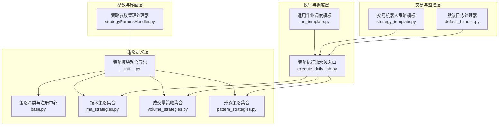
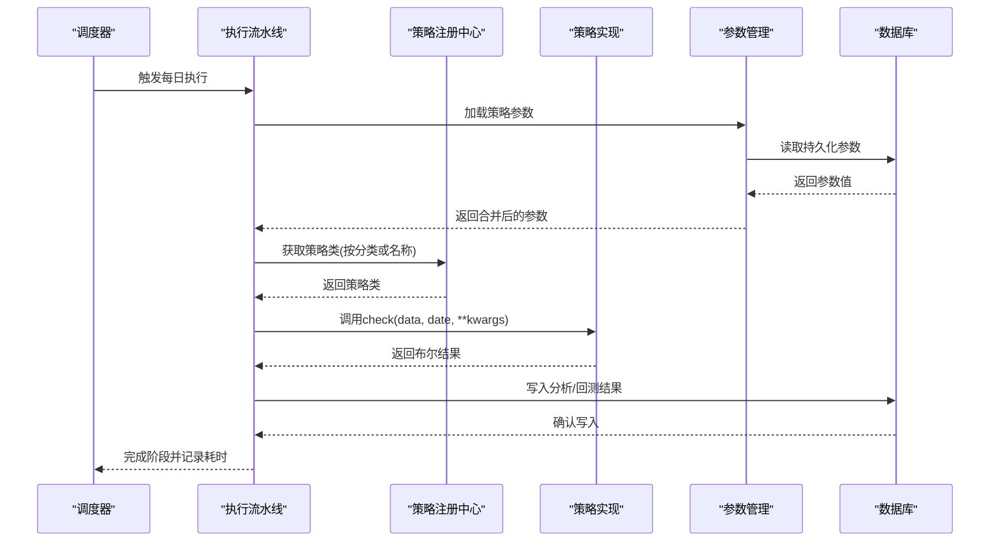
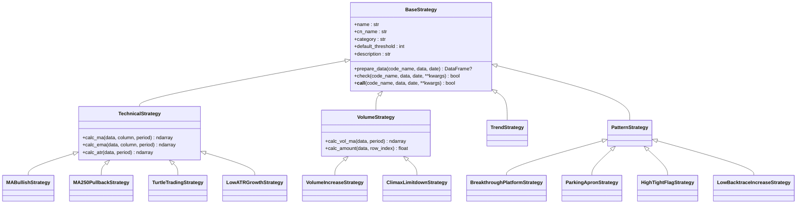
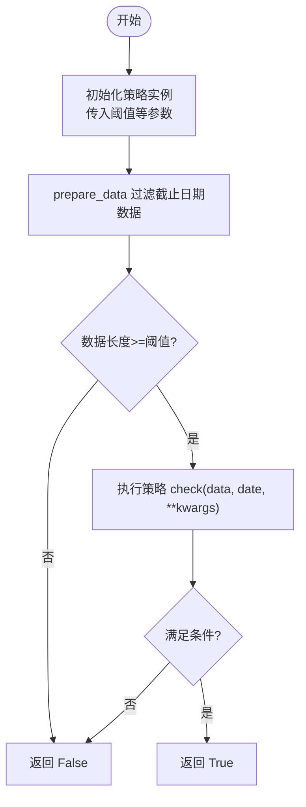
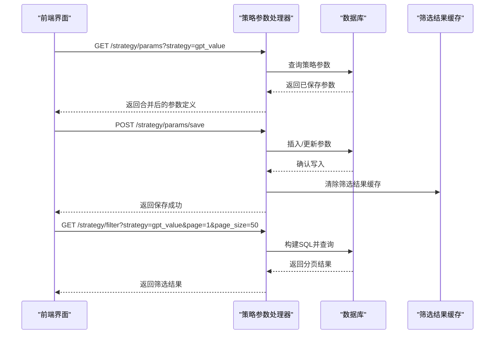
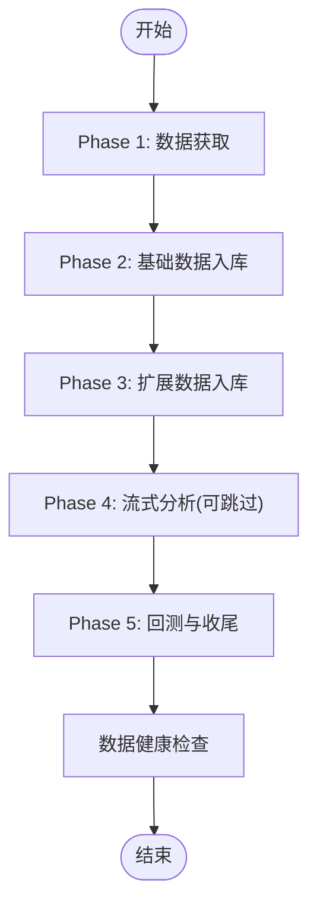
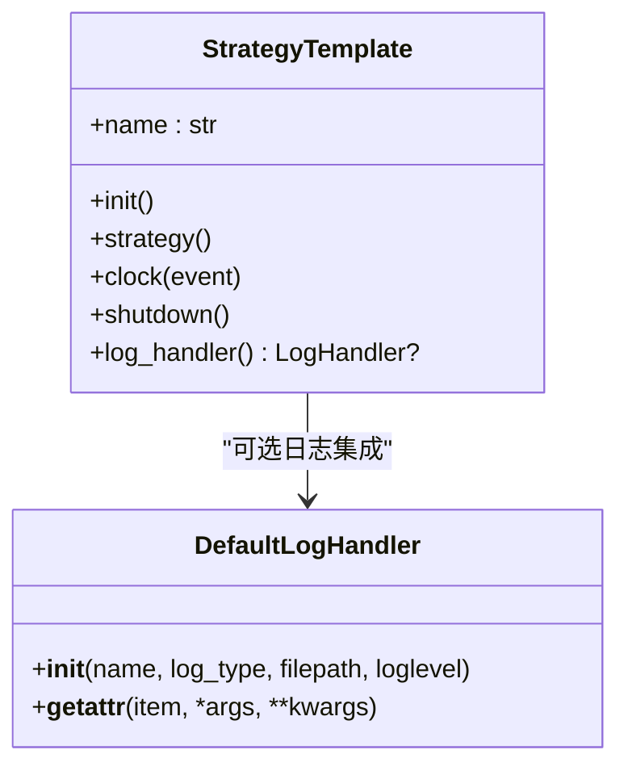
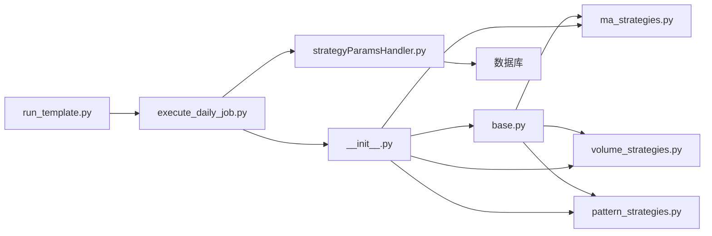

# 策略执行框架

<cite>
**本文引用的文件**
- [策略基类与注册中心](file://quantia/core/strategy/base.py)
- [策略模块聚合导出](file://quantia/core/strategy/__init__.py)
- [技术策略集合](file://quantia/core/strategy/technical/ma_strategies.py)
- [成交量策略集合](file://quantia/core/strategy/volume/volume_strategies.py)
- [形态策略集合](file://quantia/core/strategy/pattern/pattern_strategies.py)
- [策略执行流水线入口](file://quantia/job/execute_daily_job.py)
- [策略参数管理处理器](file://quantia/web/strategyParamsHandler.py)
- [通用作业调度模板](file://quantia/lib/run_template.py)
- [交易机器人策略模板](file://quantia/trade/robot/infrastructure/strategy_template.py)
- [默认日志处理器](file://quantia/trade/robot/infrastructure/default_handler.py)
</cite>

## 目录
1. [引言](#引言)
2. [项目结构](#项目结构)
3. [核心组件](#核心组件)
4. [架构总览](#架构总览)
5. [详细组件分析](#详细组件分析)
6. [依赖关系分析](#依赖关系分析)
7. [性能考量](#性能考量)
8. [故障排查指南](#故障排查指南)
9. [结论](#结论)
10. [附录](#附录)

## 引言
本文件面向策略执行框架的开发者与运维人员，系统阐述策略模板设计、策略加载机制、策略生命周期管理、注册流程、参数配置、执行监控与性能评估，以及开发规范、测试方法、部署流程与版本管理。目标是在保证策略执行灵活性与可维护性的前提下，提供可复用、可扩展、可观测的策略工程化能力。

## 项目结构
策略执行框架围绕“策略基类与注册中心”、“策略实现模块”、“策略参数配置”、“执行流水线”、“日志与监控”五大层面组织，形成清晰的分层与职责边界。

**图示来源**
- [策略基类与注册中心](file://quantia/core/strategy/base.py#L1-L202)
- [策略模块聚合导出](file://quantia/core/strategy/__init__.py#L1-L119)
- [技术策略集合](file://quantia/core/strategy/technical/ma_strategies.py#L1-L237)
- [成交量策略集合](file://quantia/core/strategy/volume/volume_strategies.py#L1-L126)
- [形态策略集合](file://quantia/core/strategy/pattern/pattern_strategies.py#L1-L276)
- [策略执行流水线入口](file://quantia/job/execute_daily_job.py#L1-L231)
- [通用作业调度模板](file://quantia/lib/run_template.py#L1-L95)
- [策略参数管理处理器](file://quantia/web/strategyParamsHandler.py#L1-L1022)
- [交易机器人策略模板](file://quantia/trade/robot/infrastructure/strategy_template.py#L1-L43)
- [默认日志处理器](file://quantia/trade/robot/infrastructure/default_handler.py#L1-L37)

**章节来源**
- [策略基类与注册中心](file://quantia/core/strategy/base.py#L1-L202)
- [策略模块聚合导出](file://quantia/core/strategy/__init__.py#L1-L119)
- [策略执行流水线入口](file://quantia/job/execute_daily_job.py#L1-L231)

## 核心组件
- 策略基类与注册中心：统一策略抽象、数据准备、分类体系与注册机制。
- 策略实现模块：按技术面、成交量、形态三大类别划分，提供具体策略实现。
- 策略参数管理：通过Web处理器持久化策略参数，支持默认值与用户自定义值合并。
- 执行流水线：封装数据采集、入库、分析、回测与收尾的阶段化流程。
- 通用调度模板：提供批量日期处理、并发执行与错误收集的通用能力。
- 交易机器人模板：为实盘交易场景提供策略模板与日志钩子。

**章节来源**
- [策略基类与注册中心](file://quantia/core/strategy/base.py#L19-L202)
- [策略模块聚合导出](file://quantia/core/strategy/__init__.py#L30-L119)
- [策略参数管理处理器](file://quantia/web/strategyParamsHandler.py#L513-L538)
- [策略执行流水线入口](file://quantia/job/execute_daily_job.py#L80-L179)
- [通用作业调度模板](file://quantia/lib/run_template.py#L18-L95)
- [交易机器人策略模板](file://quantia/trade/robot/infrastructure/strategy_template.py#L9-L43)

## 架构总览
策略执行框架采用“策略即代码”的设计，通过装饰器注册策略，运行期按需加载；执行流水线将策略与数据处理解耦，参数配置与界面交互分离，便于扩展与维护。

**图示来源**
- [策略执行流水线入口](file://quantia/job/execute_daily_job.py#L80-L179)
- [策略基类与注册中心](file://quantia/core/strategy/base.py#L159-L202)
- [策略参数管理处理器](file://quantia/web/strategyParamsHandler.py#L513-L538)

## 详细组件分析

### 策略模板设计与注册机制
- 抽象基类：定义统一的check接口、数据准备逻辑与分类标签，确保策略实现的一致性与可测试性。
- 策略分类：技术、成交量、趋势、形态四大类别，便于按领域扩展与检索。
- 注册中心：装饰器注册、按名称/分类检索，支持全量导出与兼容旧接口。
- 兼容性：保留历史函数式接口，平滑迁移。

**图示来源**
- [策略基类与注册中心](file://quantia/core/strategy/base.py#L20-L202)
- [技术策略集合](file://quantia/core/strategy/technical/ma_strategies.py#L22-L237)
- [成交量策略集合](file://quantia/core/strategy/volume/volume_strategies.py#L19-L126)
- [形态策略集合](file://quantia/core/strategy/pattern/pattern_strategies.py#L22-L276)

**章节来源**
- [策略基类与注册中心](file://quantia/core/strategy/base.py#L20-L202)
- [策略模块聚合导出](file://quantia/core/strategy/__init__.py#L30-L119)

### 策略加载机制与生命周期
- 策略加载：通过装饰器在模块导入时注册；运行期可通过名称或分类获取策略类。
- 生命周期：
  - 初始化：构造函数接收阈值等参数。
  - 数据准备：prepare_data按截止日期过滤并校验数据长度。
  - 执行：check返回布尔结果，支持kwargs扩展。
  - 销毁：策略实例无显式销毁逻辑，遵循Python GC。

**图示来源**
- [策略基类与注册中心](file://quantia/core/strategy/base.py#L38-L96)

**章节来源**
- [策略基类与注册中心](file://quantia/core/strategy/base.py#L38-L96)

### 策略注册流程与参数配置
- 注册流程：装饰器将策略类登记到全局注册表，支持按名称与分类检索。
- 参数配置：Web处理器提供参数的查询、保存、重置与动态筛选能力，参数持久化于数据库表，支持默认值与用户自定义值合并。
- 动态筛选：根据当前策略参数构建SQL条件，支持分页与缓存。

**图示来源**
- [策略参数管理处理器](file://quantia/web/strategyParamsHandler.py#L513-L538)
- [策略参数管理处理器](file://quantia/web/strategyParamsHandler.py#L591-L627)
- [策略参数管理处理器](file://quantia/web/strategyParamsHandler.py#L663-L700)

**章节来源**
- [策略参数管理处理器](file://quantia/web/strategyParamsHandler.py#L513-L538)
- [策略参数管理处理器](file://quantia/web/strategyParamsHandler.py#L591-L627)
- [策略参数管理处理器](file://quantia/web/strategyParamsHandler.py#L663-L700)

### 执行监控与性能评估
- 执行流水线：阶段化设计，包含数据采集、入库、分析、回测与收尾；支持跨节点分析数据跳过阈值判断，避免重复执行。
- 健康检查：流水线结束后对核心表进行数据完整性检查，便于定位“页面无数据”等问题。
- 并发与批处理：通用调度模板提供线程池并发执行与批量日期处理能力，捕获异常并记录日志。

**图示来源**
- [策略执行流水线入口](file://quantia/job/execute_daily_job.py#L80-L179)

**章节来源**
- [策略执行流水线入口](file://quantia/job/execute_daily_job.py#L48-L78)
- [策略执行流水线入口](file://quantia/job/execute_daily_job.py#L182-L226)
- [通用作业调度模板](file://quantia/lib/run_template.py#L18-L95)

### 交易机器人与日志集成
- 机器人模板：提供策略生命周期钩子（init、strategy、clock、shutdown），支持自定义日志句柄优先策略。
- 日志处理器：支持stdout/file两种输出方式，统一时间格式，便于生产环境排障。

**图示来源**
- [交易机器人策略模板](file://quantia/trade/robot/infrastructure/strategy_template.py#L9-L43)
- [默认日志处理器](file://quantia/trade/robot/infrastructure/default_handler.py#L15-L37)

**章节来源**
- [交易机器人策略模板](file://quantia/trade/robot/infrastructure/strategy_template.py#L9-L43)
- [默认日志处理器](file://quantia/trade/robot/infrastructure/default_handler.py#L15-L37)

## 依赖关系分析
- 策略实现依赖策略基类与注册中心，通过装饰器完成注册。
- 执行流水线依赖策略注册中心与参数管理，按阶段调用策略实现。
- 参数管理依赖数据库访问与缓存，提供默认值与用户自定义值合并。
- 通用调度模板被执行流水线与各类作业复用，提供日期解析、并发与异常处理。

**图示来源**
- [策略基类与注册中心](file://quantia/core/strategy/base.py#L159-L202)
- [策略模块聚合导出](file://quantia/core/strategy/__init__.py#L30-L119)
- [策略执行流水线入口](file://quantia/job/execute_daily_job.py#L80-L179)
- [策略参数管理处理器](file://quantia/web/strategyParamsHandler.py#L513-L538)
- [通用作业调度模板](file://quantia/lib/run_template.py#L18-L95)

**章节来源**
- [策略基类与注册中心](file://quantia/core/strategy/base.py#L159-L202)
- [策略模块聚合导出](file://quantia/core/strategy/__init__.py#L30-L119)
- [策略执行流水线入口](file://quantia/job/execute_daily_job.py#L80-L179)
- [策略参数管理处理器](file://quantia/web/strategyParamsHandler.py#L513-L538)
- [通用作业调度模板](file://quantia/lib/run_template.py#L18-L95)

## 性能考量
- 内存优化：执行流水线采用低内存模式，逐只股票从磁盘缓存读取数据，峰值内存显著降低。
- 并发控制：通用调度模板限制线程池大小，避免资源争用；异常捕获确保单任务失败不影响整体进度。
- 缓存策略：参数管理提供筛选结果缓存失效机制，减少重复计算。
- I/O优化：阶段化流水线将API密集型任务集中在Phase 1，后续阶段仅读取本地缓存。

**章节来源**
- [策略执行流水线入口](file://quantia/job/execute_daily_job.py#L132-L136)
- [通用作业调度模板](file://quantia/lib/run_template.py#L44-L58)
- [策略参数管理处理器](file://quantia/web/strategyParamsHandler.py#L619-L626)

## 故障排查指南
- 日志配置：若日志初始化失败，自动降级为basicConfig；也可通过日志处理器切换stdout/file。
- 异常捕获：执行流水线与通用调度模板均对异常进行记录，便于定位问题。
- 健康检查：流水线结束后输出核心表数据统计，辅助排查“页面无数据”问题。
- 参数一致性：参数保存后主动清除筛选结果缓存，避免脏数据影响。

**章节来源**
- [策略执行流水线入口](file://quantia/job/execute_daily_job.py#L18-L28)
- [策略执行流水线入口](file://quantia/job/execute_daily_job.py#L182-L226)
- [通用作业调度模板](file://quantia/lib/run_template.py#L58-L60)
- [策略参数管理处理器](file://quantia/web/strategyParamsHandler.py#L619-L626)

## 结论
该策略执行框架以“策略即代码”为核心理念，通过统一基类、装饰器注册与模块化分类，实现了策略的灵活扩展；结合阶段化的执行流水线、参数持久化与缓存策略，提供了良好的性能与可观测性。建议在新增策略时遵循现有基类与注册规范，充分利用参数管理与日志体系，确保策略开发、测试、部署与运维的闭环。

## 附录
- 开发规范
  - 新增策略需继承相应基类，实现check方法，并使用装饰器注册。
  - 策略命名与分类应遵循现有约定，避免冲突。
  - 参数配置应提供合理的默认值与取值范围，便于用户理解与调优。
- 测试方法
  - 单元测试：针对check方法编写输入输出断言，覆盖边界条件。
  - 集成测试：模拟执行流水线阶段，验证策略与数据链路。
  - 性能测试：对比全量加载与低内存模式下的内存与耗时差异。
- 部署流程
  - 通过执行流水线入口触发每日任务；必要时设置环境变量控制分析跳过阈值。
  - 参数配置通过Web界面完成，参数变更后自动清除筛选缓存。
- 版本管理
  - 策略注册表作为公共契约，新增策略需向后兼容旧接口或提供迁移指引。
  - 参数表结构变更需考虑向后兼容与数据迁移策略。
