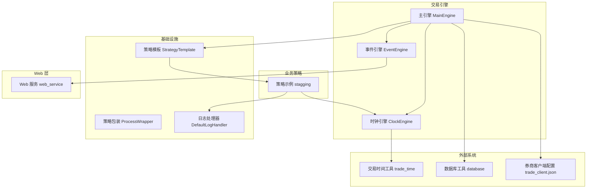
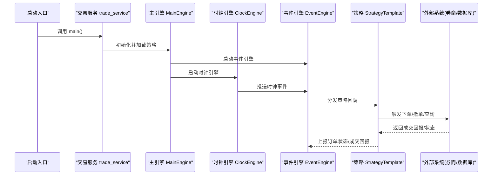
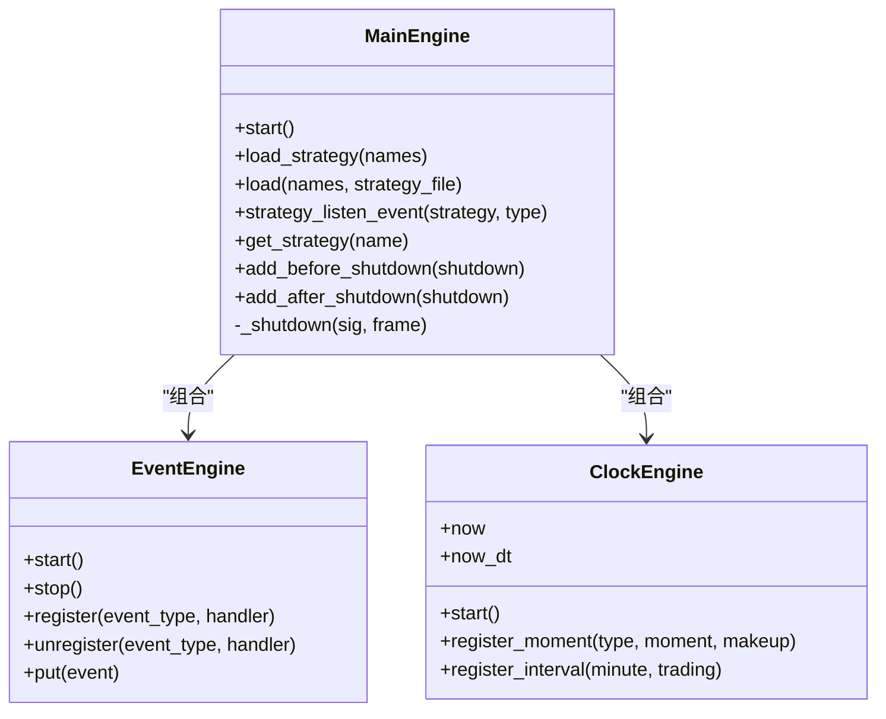
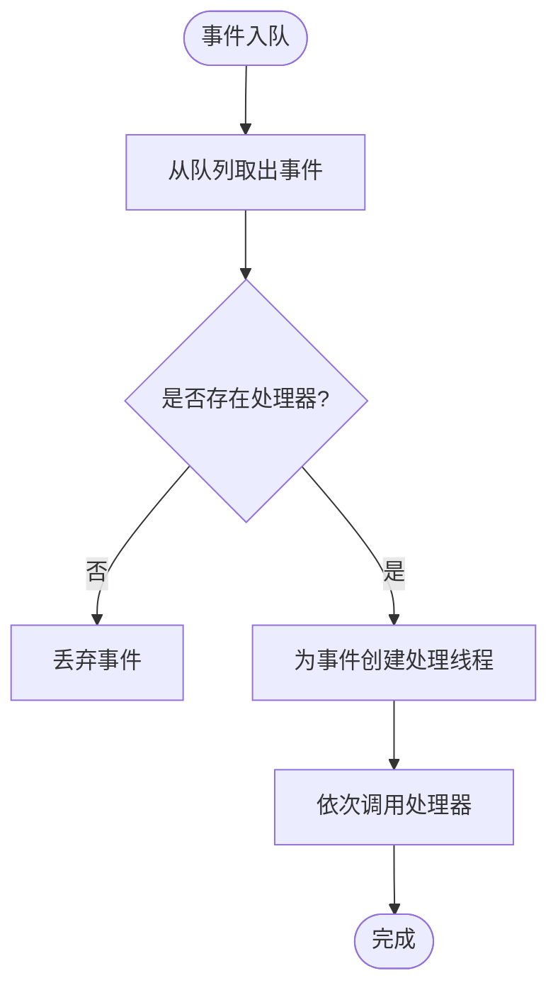
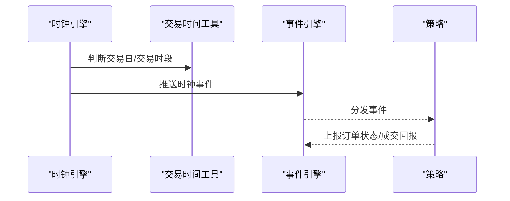
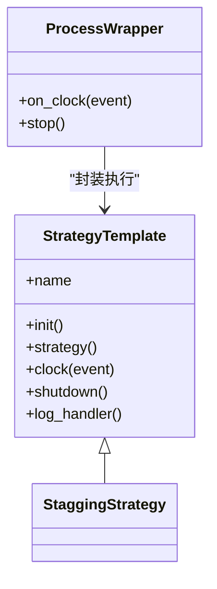
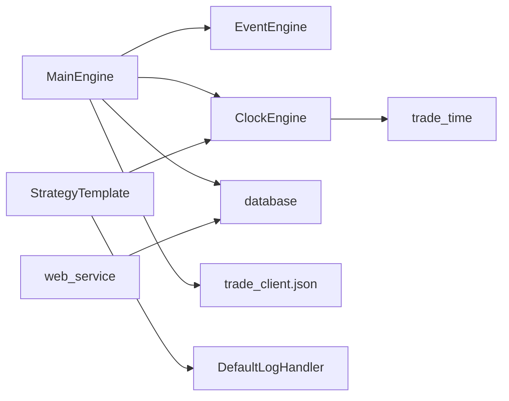

# 订单管理系统

<cite>
**本文引用的文件**
- [trade_service.py](file://quantia/trade/trade_service.py)
- [main_engine.py](file://quantia/trade/robot/engine/main_engine.py)
- [event_engine.py](file://quantia/trade/robot/engine/event_engine.py)
- [clock_engine.py](file://quantia/trade/robot/engine/clock_engine.py)
- [default_handler.py](file://quantia/trade/robot/infrastructure/default_handler.py)
- [strategy_template.py](file://quantia/trade/robot/infrastructure/strategy_template.py)
- [strategy_wrapper.py](file://quantia/trade/robot/infrastructure/strategy_wrapper.py)
- [trade_time.py](file://quantia/lib/trade_time.py)
- [database.py](file://quantia/lib/database.py)
- [web_service.py](file://quantia/web/web_service.py)
- [trade_client.json](file://quantia/config/trade_client.json)
- [stagging.py](file://quantia/trade/strategies/stagging.py)
</cite>

## 目录
1. [简介](#简介)
2. [项目结构](#项目结构)
3. [核心组件](#核心组件)
4. [架构总览](#架构总览)
5. [详细组件分析](#详细组件分析)
6. [依赖关系分析](#依赖关系分析)
7. [性能考量](#性能考量)
8. [故障排查指南](#故障排查指南)
9. [结论](#结论)
10. [附录](#附录)

## 简介
本文件面向订单管理系统的开发与运维人员，系统性梳理订单生命周期管理、订单状态跟踪、订单队列处理、订单类型与下单策略、撤单机制、成交回报处理、订单监控、异常处理与重试、超时控制、订单查询与状态同步、批量操作等能力。文档以代码为依据，结合可视化图示，帮助读者快速理解系统设计与实现细节。

## 项目结构
系统采用“事件驱动 + 策略插件”的架构，核心交易引擎由主引擎、事件引擎、时钟引擎组成；策略通过模板化接口接入；数据库层提供连接池、重试与 Upsert 能力；Web 层提供 API 与前端 SPA；配置文件承载券商客户端登录信息。

图表来源
- [main_engine.py](file://quantia/trade/robot/engine/main_engine.py#L22-L232)
- [event_engine.py](file://quantia/trade/robot/engine/event_engine.py#L19-L85)
- [clock_engine.py](file://quantia/trade/robot/engine/clock_engine.py#L99-L231)
- [strategy_template.py](file://quantia/trade/robot/infrastructure/strategy_template.py#L9-L43)
- [strategy_wrapper.py](file://quantia/trade/robot/infrastructure/strategy_wrapper.py#L12-L45)
- [trade_time.py](file://quantia/lib/trade_time.py#L12-L224)
- [database.py](file://quantia/lib/database.py#L60-L304)
- [trade_client.json](file://quantia/config/trade_client.json#L1-L5)
- [web_service.py](file://quantia/web/web_service.py#L53-L143)

章节来源
- [trade_service.py](file://quantia/trade/trade_service.py#L19-L31)
- [main_engine.py](file://quantia/trade/robot/engine/main_engine.py#L22-L232)
- [event_engine.py](file://quantia/trade/robot/engine/event_engine.py#L19-L85)
- [clock_engine.py](file://quantia/trade/robot/engine/clock_engine.py#L99-L231)
- [strategy_template.py](file://quantia/trade/robot/infrastructure/strategy_template.py#L9-L43)
- [strategy_wrapper.py](file://quantia/trade/robot/infrastructure/strategy_wrapper.py#L12-L45)
- [trade_time.py](file://quantia/lib/trade_time.py#L12-L224)
- [database.py](file://quantia/lib/database.py#L60-L304)
- [web_service.py](file://quantia/web/web_service.py#L53-L143)
- [trade_client.json](file://quantia/config/trade_client.json#L1-L5)

## 核心组件
- 主引擎 MainEngine：负责加载策略、启动事件引擎与时钟引擎、注册策略事件监听、统一关闭流程。
- 事件引擎 EventEngine：基于队列与线程的事件分发器，支持注册/注销事件处理器。
- 时钟引擎 ClockEngine：提供统一时间源、交易时段状态、周期与时刻事件调度。
- 策略模板 StrategyTemplate：策略基类，提供 clock、strategy、shutdown 等钩子。
- 策略包装 ProcessWrapper：将策略时钟事件投递至独立进程，隔离策略执行。
- 交易时间工具 trade_time：判断交易日、交易时段、休市/开盘等。
- 数据库工具 database：连接池、Upsert、重试、DDL 辅助。
- Web 服务 web_service：Tornado 应用，提供 API 与 SPA 路由。
- 券商客户端配置 trade_client.json：账户、密码、客户端路径。

章节来源
- [main_engine.py](file://quantia/trade/robot/engine/main_engine.py#L22-L232)
- [event_engine.py](file://quantia/trade/robot/engine/event_engine.py#L19-L85)
- [clock_engine.py](file://quantia/trade/robot/engine/clock_engine.py#L99-L231)
- [strategy_template.py](file://quantia/trade/robot/infrastructure/strategy_template.py#L9-L43)
- [strategy_wrapper.py](file://quantia/trade/robot/infrastructure/strategy_wrapper.py#L12-L45)
- [trade_time.py](file://quantia/lib/trade_time.py#L12-L224)
- [database.py](file://quantia/lib/database.py#L60-L304)
- [web_service.py](file://quantia/web/web_service.py#L53-L143)
- [trade_client.json](file://quantia/config/trade_client.json#L1-L5)

## 架构总览
系统以事件驱动为核心，策略通过时钟引擎触发，事件引擎负责异步分发；数据库层提供稳定的数据持久化与重试；Web 层对外暴露 API；交易侧通过 easytrader 与券商客户端交互。

图表来源
- [trade_service.py](file://quantia/trade/trade_service.py#L19-L31)
- [main_engine.py](file://quantia/trade/robot/engine/main_engine.py#L81-L91)
- [clock_engine.py](file://quantia/trade/robot/engine/clock_engine.py#L169-L204)
- [event_engine.py](file://quantia/trade/robot/engine/event_engine.py#L36-L53)
- [strategy_template.py](file://quantia/trade/robot/infrastructure/strategy_template.py#L24-L28)

## 详细组件分析

### 主引擎 MainEngine
- 职责
  - 初始化事件引擎与时钟引擎
  - 动态加载策略、注册/注销事件监听
  - 统一关闭流程（before/主/after）
- 关键点
  - 使用锁保护策略加载过程
  - 支持策略热加载（可选）
  - 通过 easytrader 与券商交互

图表来源
- [main_engine.py](file://quantia/trade/robot/engine/main_engine.py#L22-L232)
- [event_engine.py](file://quantia/trade/robot/engine/event_engine.py#L19-L85)
- [clock_engine.py](file://quantia/trade/robot/engine/clock_engine.py#L99-L231)

章节来源
- [main_engine.py](file://quantia/trade/robot/engine/main_engine.py#L22-L232)

### 事件引擎 EventEngine
- 职责
  - 事件队列与线程模型
  - 事件处理器注册/注销
  - 事件派发与处理线程
- 关键点
  - 队列阻塞与空闲处理
  - 每事件创建处理线程，降低耦合

图表来源
- [event_engine.py](file://quantia/trade/robot/engine/event_engine.py#L36-L53)

章节来源
- [event_engine.py](file://quantia/trade/robot/engine/event_engine.py#L19-L85)

### 时钟引擎 ClockEngine
- 职责
  - 统一时间源 now/now_dt
  - 交易状态 trading_state
  - 时刻事件与周期事件调度
- 关键点
  - 默认注册开盘/休市/午间/收盘/周期事件
  - 交易日与交易时段判断来自 trade_time

图表来源
- [clock_engine.py](file://quantia/trade/robot/engine/clock_engine.py#L169-L204)
- [trade_time.py](file://quantia/lib/trade_time.py#L12-L118)

章节来源
- [clock_engine.py](file://quantia/trade/robot/engine/clock_engine.py#L99-L231)
- [trade_time.py](file://quantia/lib/trade_time.py#L12-L224)

### 策略模板 StrategyTemplate 与策略包装 StrategyWrapper
- 策略模板
  - 提供 init、strategy、clock、shutdown 等钩子
  - 通过 main_engine.clock_engine 获取时钟
- 策略包装
  - 将策略时钟事件投递到独立进程，避免阻塞主循环

图表来源
- [strategy_template.py](file://quantia/trade/robot/infrastructure/strategy_template.py#L9-L43)
- [strategy_wrapper.py](file://quantia/trade/robot/infrastructure/strategy_wrapper.py#L12-L45)
- [stagging.py](file://quantia/trade/strategies/stagging.py#L14-L57)

章节来源
- [strategy_template.py](file://quantia/trade/robot/infrastructure/strategy_template.py#L9-L43)
- [strategy_wrapper.py](file://quantia/trade/robot/infrastructure/strategy_wrapper.py#L12-L45)
- [stagging.py](file://quantia/trade/strategies/stagging.py#L14-L57)

### 订单生命周期与状态跟踪
- 生命周期
  - 下单：策略生成订单请求
  - 提交/受理：提交至券商，等待受理
  - 成交：部分/全部成交
  - 完成：订单完结
  - 撤单：在未成交前撤销
- 状态跟踪
  - 通过事件引擎上报订单状态变更
  - Web 层提供查询接口，支持状态同步

说明：系统通过策略模板与事件引擎实现状态上报与同步，具体订单实体与状态枚举在策略中体现。

章节来源
- [strategy_template.py](file://quantia/trade/robot/infrastructure/strategy_template.py#L24-L28)
- [web_service.py](file://quantia/web/web_service.py#L56-L88)

### 订单队列处理
- 事件驱动队列
  - EventEngine 使用队列承载事件，逐个派发
  - 处理器线程化，避免阻塞事件循环
- 时钟事件队列
  - ClockEngine 将周期/时刻事件推送到事件引擎
  - 策略通过 clock 回调响应

章节来源
- [event_engine.py](file://quantia/trade/robot/engine/event_engine.py#L36-L53)
- [clock_engine.py](file://quantia/trade/robot/engine/clock_engine.py#L183-L204)

### 订单类型定义、下单策略、撤单机制
- 订单类型
  - 买卖方向、数量、价格类型（限价/市价）等在策略中定义
- 下单策略
  - 策略根据时钟事件触发下单逻辑
  - 示例策略在特定时刻触发打新
- 撤单机制
  - 未成交订单可在策略中发起撤单
  - 具体实现依赖券商接口（easytrader）

章节来源
- [stagging.py](file://quantia/trade/strategies/stagging.py#L32-L43)
- [main_engine.py](file://quantia/trade/robot/engine/main_engine.py#L32-L41)

### 成交回报处理
- 回报来源
  - 券商客户端回报通过策略回调进入事件引擎
- 处理流程
  - 事件派发 -> 策略处理 -> 状态更新 -> 数据库落库

章节来源
- [event_engine.py](file://quantia/trade/robot/engine/event_engine.py#L46-L53)

### 订单监控、异常处理、重试机制、超时控制
- 监控
  - 策略自定义日志处理器，输出到文件
  - Web 层提供 API 与 SPA 路由
- 异常处理
  - 数据库层对瞬态错误进行识别与重试
  - 事件引擎与策略包装对异常进行兜底
- 重试机制
  - 数据库插入/更新/执行 SQL 支持最多 3 次重试
  - 重试条件覆盖死锁、锁等待、连接断开等
- 超时控制
  - 数据库连接/读/写超时参数配置
  - 事件引擎队列阻塞超时

章节来源
- [default_handler.py](file://quantia/trade/robot/infrastructure/default_handler.py#L15-L37)
- [web_service.py](file://quantia/web/web_service.py#L53-L143)
- [database.py](file://quantia/lib/database.py#L80-L184)
- [event_engine.py](file://quantia/trade/robot/engine/event_engine.py#L36-L44)

### 订单查询接口、状态同步、批量操作
- 查询接口
  - Web 层提供多个 API 路由，支持数据查询与策略参数管理
- 状态同步
  - 通过事件引擎与策略回调实现状态上报
- 批量操作
  - 数据库层提供批量插入与 Upsert，支持主键去重

章节来源
- [web_service.py](file://quantia/web/web_service.py#L56-L88)
- [database.py](file://quantia/lib/database.py#L120-L203)

## 依赖关系分析
- 组件耦合
  - MainEngine 组合 EventEngine 与 ClockEngine
  - 策略依赖 ClockEngine 与日志处理器
  - ClockEngine 依赖 trade_time 工具
  - 数据库工具被主引擎与 Web 层复用
- 外部依赖
  - easytrader：券商客户端交互
  - Tornado：Web 服务
  - SQLAlchemy/pymysql：数据库访问

图表来源
- [main_engine.py](file://quantia/trade/robot/engine/main_engine.py#L25-L44)
- [clock_engine.py](file://quantia/trade/robot/engine/clock_engine.py#L106-L124)
- [trade_time.py](file://quantia/lib/trade_time.py#L12-L224)
- [database.py](file://quantia/lib/database.py#L60-L71)
- [trade_client.json](file://quantia/config/trade_client.json#L1-L5)
- [web_service.py](file://quantia/web/web_service.py#L99-L99)

章节来源
- [main_engine.py](file://quantia/trade/robot/engine/main_engine.py#L22-L232)
- [clock_engine.py](file://quantia/trade/robot/engine/clock_engine.py#L99-L231)
- [trade_time.py](file://quantia/lib/trade_time.py#L12-L224)
- [database.py](file://quantia/lib/database.py#L60-L304)
- [web_service.py](file://quantia/web/web_service.py#L53-L143)
- [trade_client.json](file://quantia/config/trade_client.json#L1-L5)

## 性能考量
- 连接池与重试
  - 数据库连接池参数与预检，减少连接建立开销
  - 瞬态错误自动重试，提升稳定性
- 事件处理
  - 事件派发线程化，避免阻塞
  - 队列阻塞与空闲轮询平衡
- 策略隔离
  - 策略包装进程化，避免策略异常影响主循环

章节来源
- [database.py](file://quantia/lib/database.py#L60-L71)
- [event_engine.py](file://quantia/trade/robot/engine/event_engine.py#L36-L53)
- [strategy_wrapper.py](file://quantia/trade/robot/infrastructure/strategy_wrapper.py#L28-L44)

## 故障排查指南
- 启动失败
  - 检查 trade_client.json 是否存在且可读
  - 检查券商客户端路径与凭证
- 交易不可用
  - 确认交易时间与交易日判断
  - 查看日志文件定位错误
- 数据库异常
  - 关注瞬态错误重试日志
  - 核查连接池参数与超时设置
- Web 服务问题
  - 确认端口占用与静态资源路径
  - 检查路由与 SPA fallback

章节来源
- [trade_service.py](file://quantia/trade/trade_service.py#L19-L31)
- [trade_client.json](file://quantia/config/trade_client.json#L1-L5)
- [trade_time.py](file://quantia/lib/trade_time.py#L12-L224)
- [database.py](file://quantia/lib/database.py#L80-L184)
- [web_service.py](file://quantia/web/web_service.py#L127-L143)

## 结论
本系统以事件驱动与策略插件为核心，结合时钟引擎与交易时间工具，实现了订单生命周期的关键环节；数据库层提供稳健的持久化与重试；Web 层提供查询与管理能力。通过策略模板与包装机制，系统具备良好的扩展性与隔离性，适合在生产环境中持续演进。

## 附录
- 启动入口
  - 交易服务入口位于 trade_service.py 的 main 函数
- 配置
  - 券商客户端配置位于 quantia/config/trade_client.json
- 示例策略
  - 策略示例位于 quantia/trade/strategies/stagging.py

章节来源
- [trade_service.py](file://quantia/trade/trade_service.py#L19-L31)
- [trade_client.json](file://quantia/config/trade_client.json#L1-L5)
- [stagging.py](file://quantia/trade/strategies/stagging.py#L14-L57)
