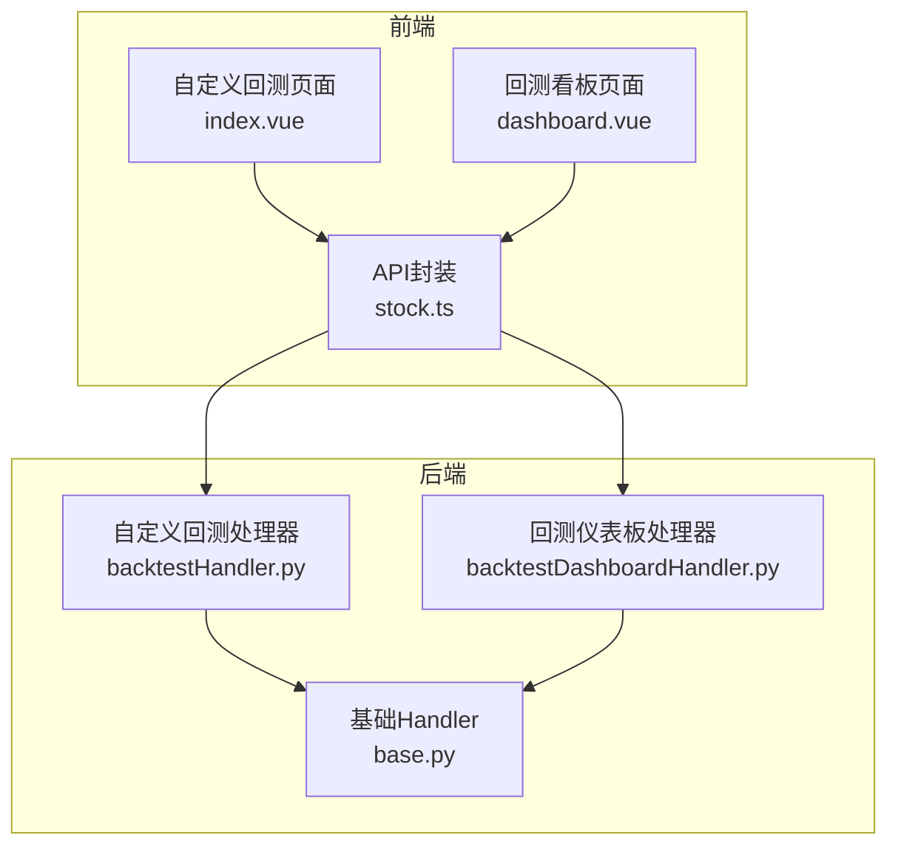
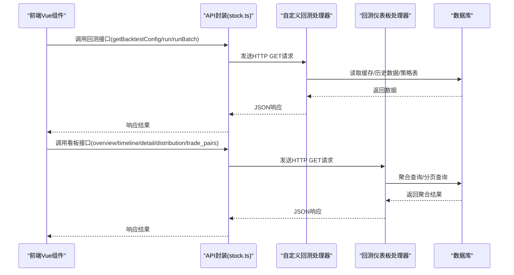
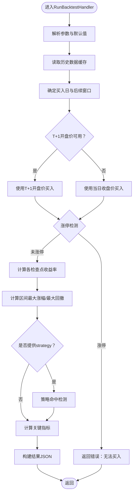
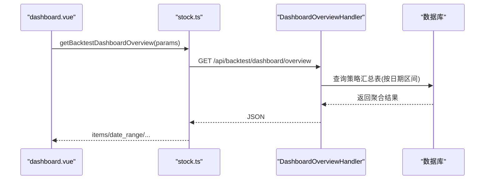
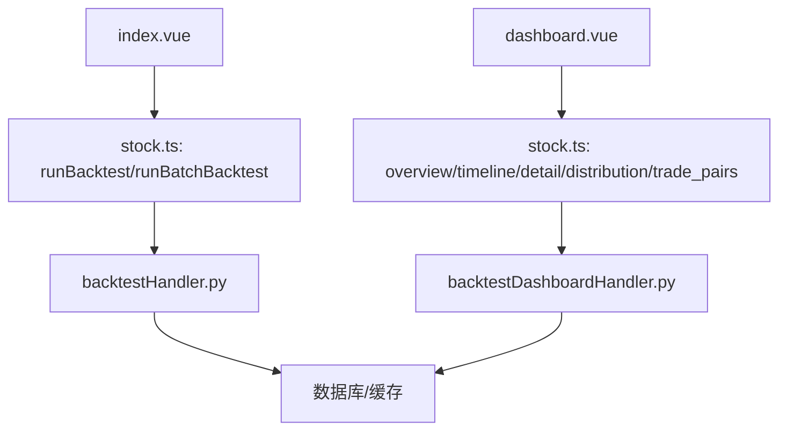
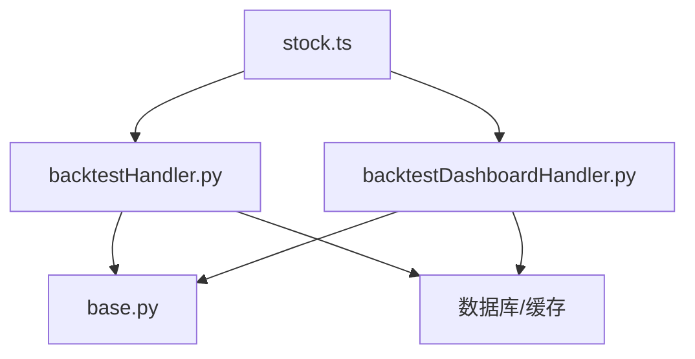

# Web回测接口

<cite>
**本文档引用的文件**
- [backtestHandler.py](file://quantia/web/backtestHandler.py)
- [backtestDashboardHandler.py](file://quantia/web/backtestDashboardHandler.py)
- [base.py](file://quantia/web/base.py)
- [index.vue（自定义回测）](file://quantia/fontWeb/src/views/backtest/index.vue)
- [dashboard.vue（回测看板）](file://quantia/fontWeb/src/views/backtest/dashboard.vue)
- [stock.ts（API定义）](file://quantia/fontWeb/src/api/stock.ts)
- [base.py（策略基类）](file://quantia/core/strategy/base.py)
- [enter.py（示例策略）](file://quantia/core/strategy/enter.py)
</cite>

## 目录
1. [简介](#简介)
2. [项目结构](#项目结构)
3. [核心组件](#核心组件)
4. [架构总览](#架构总览)
5. [详细组件分析](#详细组件分析)
6. [依赖关系分析](#依赖关系分析)
7. [性能考量](#性能考量)
8. [故障排查指南](#故障排查指南)
9. [结论](#结论)
10. [附录](#附录)

## 简介
本文件面向Quantia项目的Web回测接口，系统性梳理“自定义回测处理器”与“回测仪表板处理器”的实现与交互，覆盖请求处理流程、参数校验、数据查询、结果返回机制；同时提供API规范、参数说明、响应结构与错误处理策略。文档还包含回测仪表板的用户界面、交互逻辑、数据可视化与分页机制，帮助Web用户通过界面完成策略回测与结果分析。

## 项目结构
- 后端Python模块
  - 自定义回测处理器：提供单股回测、批量回测与回测配置查询
  - 回测仪表板处理器：提供跨策略总览、时间序列、策略明细、收益分布、买卖配对等聚合视图
  - 基础Handler：统一CORS与数据库连接检查
- 前端Vue模块
  - 自定义回测页面：输入参数、执行回测、展示单股回测与批量回测结果
  - 回测看板页面：多维度视图联动、图表渲染、分页与日期范围选择
  - API封装：统一的HTTP请求封装与参数类型定义

**图表来源**
- [backtestHandler.py](file://quantia/web/backtestHandler.py#L69-L126)
- [backtestDashboardHandler.py](file://quantia/web/backtestDashboardHandler.py#L360-L467)
- [base.py](file://quantia/web/base.py#L14-L36)
- [index.vue（自定义回测）](file://quantia/fontWeb/src/views/backtest/index.vue#L1-L363)
- [dashboard.vue（回测看板）](file://quantia/fontWeb/src/views/backtest/dashboard.vue#L1-L639)
- [stock.ts（API定义）](file://quantia/fontWeb/src/api/stock.ts#L73-L173)

**章节来源**
- [backtestHandler.py](file://quantia/web/backtestHandler.py#L69-L126)
- [backtestDashboardHandler.py](file://quantia/web/backtestDashboardHandler.py#L360-L467)
- [base.py](file://quantia/web/base.py#L14-L36)
- [index.vue（自定义回测）](file://quantia/fontWeb/src/views/backtest/index.vue#L1-L363)
- [dashboard.vue（回测看板）](file://quantia/fontWeb/src/views/backtest/dashboard.vue#L1-L639)
- [stock.ts（API定义）](file://quantia/fontWeb/src/api/stock.ts#L73-L173)

## 核心组件
- 自定义回测处理器
  - GetBacktestConfigHandler：返回可选回测周期、策略列表、默认收益周期与最大表格周期
  - RunBacktestHandler：执行单只股票回测，支持指定策略、周期、起止日期与收益检查点
  - RunBatchBacktestHandler：批量回测，按策略历史验证，支持horizons与success_days
- 回测仪表板处理器
  - DashboardOverviewHandler：跨策略总览，按日期区间与指标周期聚合
  - PerformanceTimelineHandler：策略表现时间序列（按信号日平均收益）
  - StrategyDetailHandler：策略明细（选股列表），支持分页与自定义horizons
  - ReturnDistributionHandler：收益分布直方图
  - TradePairHandler：买入-卖出配对明细（基于指标卖出表）
- 基础Handler
  - 统一CORS与数据库连接检查，保证服务稳定性

**章节来源**
- [backtestHandler.py](file://quantia/web/backtestHandler.py#L69-L126)
- [backtestDashboardHandler.py](file://quantia/web/backtestDashboardHandler.py#L360-L467)
- [base.py](file://quantia/web/base.py#L14-L36)

## 架构总览
后端采用Tornado框架，前后端通过REST接口通信。前端通过stock.ts封装的API调用后端接口，后端根据请求参数执行回测或聚合查询，返回JSON结构数据。

**图表来源**
- [stock.ts（API定义）](file://quantia/fontWeb/src/api/stock.ts#L95-L173)
- [backtestHandler.py](file://quantia/web/backtestHandler.py#L82-L126)
- [backtestDashboardHandler.py](file://quantia/web/backtestDashboardHandler.py#L360-L467)

## 详细组件分析

### 自定义回测处理器（backtestHandler）
- GetBacktestConfigHandler
  - 功能：返回回测配置（周期、策略列表、默认收益周期、最大表格周期）
  - 输出：JSON对象，包含periods、strategies、default_horizons、max_table_horizon
- RunBacktestHandler
  - 请求参数
    - code：股票代码（必填）
    - strategy：策略名称（可选）
    - period：回测周期（可选，默认1m）
    - start_date/end_date：起止日期（可选）
    - checkpoints：收益检查点（可选，逗号分隔）
  - 处理流程
    - 解析参数与默认值
    - 读取历史数据缓存，确定买入日与后续窗口
    - 计算T+1开盘价买入（考虑涨停限制）
    - 计算各检查点收益率（扣除双向交易成本）
    - 计算区间最大涨幅/最大回撤
    - 可选：策略命中检测与关键指标计算
  - 输出：包含code、name、period、buy_date、buy_price、returns、max_return、max_drawdown、strategy_result、indicators、data_points等字段
- RunBatchBacktestHandler
  - 请求参数
    - strategy：策略名称（必填）
    - period：回测周期（可选，默认1m）
    - limit：回测天数（可选，默认30）
    - horizons：收益周期列表（可选，逗号分隔）
    - success_days：成功定义天数（可选，默认取min(max_days, max(horizons))）
  - 处理流程
    - 解析策略映射与表名
    - 优先查询策略表（支持rate_1~rate_100列）
    - 若表不存在或查询失败，回退到“实时计算”模式：并行遍历股票与交易日，动态计算收益
  - 输出：包含strategy、strategy_name、period、horizons、success_days、total_stocks、total_days、success_count、success_rate、avg_returns、details等字段

**图表来源**
- [backtestHandler.py](file://quantia/web/backtestHandler.py#L82-L126)
- [backtestHandler.py](file://quantia/web/backtestHandler.py#L166-L289)

**章节来源**
- [backtestHandler.py](file://quantia/web/backtestHandler.py#L69-L126)
- [backtestHandler.py](file://quantia/web/backtestHandler.py#L166-L289)
- [backtestHandler.py](file://quantia/web/backtestHandler.py#L292-L420)
- [backtestHandler.py](file://quantia/web/backtestHandler.py#L423-L611)

### 回测仪表板处理器（backtestDashboardHandler）
- DashboardOverviewHandler
  - 功能：跨策略总览，按日期区间与指标周期聚合
  - 参数：days、metric（指标周期）、start_date/end_date
  - 输出：date_range、horizons、metric_horizon、items（每项含strategy_name、strategy_cn、type、total_signals、avg_success_rate、avg_returns、best_day、worst_day）
- PerformanceTimelineHandler
  - 功能：策略表现时间序列（按信号日平均收益）
  - 参数：strategies（逗号分隔）、days、horizon
  - 输出：date_range、horizon、series（每项含strategy_name、strategy_cn、data）
- StrategyDetailHandler
  - 功能：策略明细（选股列表），支持分页与自定义horizons
  - 参数：strategy、days、horizons、page、page_size、start_date/end_date
  - 输出：strategy_name、strategy_cn、date_range、horizons、page、page_size、total、rows
- ReturnDistributionHandler
  - 功能：收益分布直方图
  - 参数：strategy、days、horizon
  - 输出：strategy_name、strategy_cn、date_range、horizon、bins、total
- TradePairHandler
  - 功能：买入-卖出配对明细（基于指标卖出表）
  - 参数：strategy、days、page、page_size、max_hold、start_date/end_date
  - 输出：strategy_name、strategy_cn、date_range、page、page_size、total、max_hold、rows

**图表来源**
- [dashboard.vue（回测看板）](file://quantia/fontWeb/src/views/backtest/dashboard.vue#L193-L207)
- [backtestDashboardHandler.py](file://quantia/web/backtestDashboardHandler.py#L360-L467)

**章节来源**
- [backtestDashboardHandler.py](file://quantia/web/backtestDashboardHandler.py#L360-L467)
- [backtestDashboardHandler.py](file://quantia/web/backtestDashboardHandler.py#L469-L547)
- [backtestDashboardHandler.py](file://quantia/web/backtestDashboardHandler.py#L549-L637)
- [backtestDashboardHandler.py](file://quantia/web/backtestDashboardHandler.py#L639-L724)
- [backtestDashboardHandler.py](file://quantia/web/backtestDashboardHandler.py#L726-L906)

### 前端交互与数据可视化
- 自定义回测页面（index.vue）
  - 配置加载：调用getBacktestConfig，填充周期与策略下拉框
  - 单股回测：输入code、strategy、period、start_date、checkpoints，调用runBacktest，展示概要、收益表与关键指标
  - 批量回测：输入strategy、period、horizons、success_days，调用runBatchBacktest，展示汇总统计与每日明细
  - 导航：支持跳转到K线指标与回测看板
- 回测看板页面（dashboard.vue）
  - 总览：策略总览表格，支持按指标周期排序
  - 时间序列：ECharts折线图，支持多策略叠加
  - 策略明细：分页表格，支持自定义horizons
  - 收益分布：直方图表格
  - 买卖配对：分页表格，支持max_hold与跳转
  - 日期范围：支持显式start_date/end_date或days两种方式

**图表来源**
- [index.vue（自定义回测）](file://quantia/fontWeb/src/views/backtest/index.vue#L1-L363)
- [dashboard.vue（回测看板）](file://quantia/fontWeb/src/views/backtest/dashboard.vue#L1-L639)
- [stock.ts（API定义）](file://quantia/fontWeb/src/api/stock.ts#L73-L173)

**章节来源**
- [index.vue（自定义回测）](file://quantia/fontWeb/src/views/backtest/index.vue#L1-L363)
- [dashboard.vue（回测看板）](file://quantia/fontWeb/src/views/backtest/dashboard.vue#L1-L639)
- [stock.ts（API定义）](file://quantia/fontWeb/src/api/stock.ts#L73-L173)

## 依赖关系分析
- 组件耦合
  - backtestHandler与backtestDashboardHandler均依赖基础Handler（CORS与数据库连接）
  - 前端通过stock.ts统一封装HTTP请求，降低对具体后端接口的耦合
- 外部依赖
  - 数据库：策略表、汇总表、指标表
  - 缓存：历史K线缓存（提高回测效率）
  - 第三方库：pandas、numpy、talib（策略与指标计算）

**图表来源**
- [backtestHandler.py](file://quantia/web/backtestHandler.py#L17-L26)
- [backtestDashboardHandler.py](file://quantia/web/backtestDashboardHandler.py#L21-L26)
- [base.py](file://quantia/web/base.py#L14-L36)
- [stock.ts（API定义）](file://quantia/fontWeb/src/api/stock.ts#L1-L189)

**章节来源**
- [backtestHandler.py](file://quantia/web/backtestHandler.py#L17-L26)
- [backtestDashboardHandler.py](file://quantia/web/backtestDashboardHandler.py#L21-L26)
- [base.py](file://quantia/web/base.py#L14-L36)
- [stock.ts（API定义）](file://quantia/fontWeb/src/api/stock.ts#L1-L189)

## 性能考量
- 并行计算
  - 批量回测采用ThreadPoolExecutor并行处理股票，提升吞吐
- 缓存利用
  - 优先使用历史数据缓存，减少数据库压力
- 分页与限制
  - 仪表板明细与配对采用分页，避免一次性传输大量数据
  - 日期区间限制（如最多366天），防止超大数据集查询
- 成本控制
  - 统一扣除双向交易成本，避免高估收益

[本节为通用指导，无需特定文件引用]

## 故障排查指南
- 常见错误
  - 缺少必要参数：如批量回测缺少strategy
  - 无缓存数据：提示先执行数据获取
  - 买入日无足够交易数据：买入日之后无足够交易数据
  - 涨停无法买入：T+1开盘涨停
  - 未知策略：策略表不存在或名称不匹配
- 日志与状态码
  - 后端捕获异常并返回500
  - 参数校验失败返回400
- 建议排查步骤
  - 检查策略表是否存在与回测数据是否生成
  - 确认日期范围与交易日设置
  - 核对股票代码与策略名称拼写
  - 查看前端控制台与网络面板定位问题

**章节来源**
- [backtestHandler.py](file://quantia/web/backtestHandler.py#L94-L100)
- [backtestHandler.py](file://quantia/web/backtestHandler.py#L186-L219)
- [backtestHandler.py](file://quantia/web/backtestHandler.py#L225-L228)
- [backtestHandler.py](file://quantia/web/backtestHandler.py#L339-L347)
- [backtestDashboardHandler.py](file://quantia/web/backtestDashboardHandler.py#L246-L267)

## 结论
本方案通过自定义回测处理器与回测仪表板处理器，结合前端Vue组件，实现了从单股回测到跨策略总览的完整回测分析链路。后端提供灵活的参数与聚合能力，前端提供直观的可视化与交互体验。建议在生产环境中持续完善策略表与缓存数据，优化并行计算与分页策略，以进一步提升性能与用户体验。

[本节为总结性内容，无需特定文件引用]

## 附录

### API规范与参数说明

- 自定义回测配置
  - GET /api/backtest/config
  - 返回：periods、strategies、default_horizons、max_table_horizon

- 单股回测
  - GET /api/backtest/run
  - 参数
    - code：股票代码（必填）
    - strategy：策略名称（可选）
    - period：回测周期（可选，默认1m）
    - start_date/end_date：起止日期（可选）
    - checkpoints：收益检查点（可选，逗号分隔）
  - 返回：code、name、period、buy_date、buy_price、returns、max_return、max_drawdown、strategy_result、indicators、data_points

- 批量回测
  - GET /api/backtest/batch
  - 参数
    - strategy：策略名称（必填）
    - period：回测周期（可选，默认1m）
    - limit：回测天数（可选，默认30）
    - horizons：收益周期列表（可选，逗号分隔）
    - success_days：成功定义天数（可选）
  - 返回：strategy、strategy_name、period、horizons、success_days、total_stocks、total_days、success_count、success_rate、avg_returns、details

- 回测看板：总览
  - GET /api/backtest/dashboard/overview
  - 参数：days、metric、start_date、end_date
  - 返回：date_range、horizons、metric_horizon、items

- 回测看板：时间序列
  - GET /api/backtest/dashboard/timeline
  - 参数：strategies、days、horizon、start_date、end_date
  - 返回：date_range、horizon、series

- 回测看板：策略明细
  - GET /api/backtest/dashboard/strategy_detail
  - 参数：strategy、days、horizons、page、page_size、start_date、end_date
  - 返回：strategy_name、strategy_cn、date_range、horizons、page、page_size、total、rows

- 回测看板：收益分布
  - GET /api/backtest/dashboard/distribution
  - 参数：strategy、days、horizon、start_date、end_date
  - 返回：strategy_name、strategy_cn、date_range、horizon、bins、total

- 回测看板：买卖配对
  - GET /api/backtest/dashboard/trade_pairs
  - 参数：strategy、days、page、page_size、max_hold、start_date、end_date
  - 返回：strategy_name、strategy_cn、date_range、page、page_size、total、max_hold、rows

**章节来源**
- [stock.ts（API定义）](file://quantia/fontWeb/src/api/stock.ts#L95-L173)
- [backtestHandler.py](file://quantia/web/backtestHandler.py#L69-L126)
- [backtestDashboardHandler.py](file://quantia/web/backtestDashboardHandler.py#L360-L467)
- [backtestDashboardHandler.py](file://quantia/web/backtestDashboardHandler.py#L469-L547)
- [backtestDashboardHandler.py](file://quantia/web/backtestDashboardHandler.py#L549-L637)
- [backtestDashboardHandler.py](file://quantia/web/backtestDashboardHandler.py#L639-L724)
- [backtestDashboardHandler.py](file://quantia/web/backtestDashboardHandler.py#L726-L906)

### 响应结构示例（字段说明）
- 单股回测结果
  - code：股票代码
  - name：股票名称
  - period：回测周期标签
  - buy_date：买入日期
  - buy_price：买入价格
  - returns：各检查点收益数组（含days、date、price、rate、raw_rate）
  - max_return：区间最大涨幅
  - max_drawdown：区间最大回撤
  - strategy_result：策略命中结果（布尔或空）
  - indicators：关键指标（kdjk、kdjd、rsi_6、macd、cci、cr、wr_6、vr、atr等）
  - data_points：数据天数
- 批量回测结果
  - strategy：策略中文名
  - strategy_name：策略英文名
  - period：回测周期标签
  - horizons：收益周期列表
  - success_days：成功定义天数
  - total_stocks：总选股数
  - total_days：总天数
  - success_count：成功数
  - success_rate：成功率
  - avg_returns：各周期平均收益
  - details：每日明细（含date、stock_count、success_count、success_rate及各周期avg）

**章节来源**
- [backtestHandler.py](file://quantia/web/backtestHandler.py#L178-L184)
- [backtestHandler.py](file://quantia/web/backtestHandler.py#L296-L301)
- [backtestHandler.py](file://quantia/web/backtestHandler.py#L274-L288)
- [backtestHandler.py](file://quantia/web/backtestHandler.py#L407-L419)

### 策略与指标基础
- 策略基类与注册
  - 提供BaseStrategy、TechnicalStrategy、VolumeStrategy等基类与注册机制
  - 示例策略：放量上涨（check_volume）
- 指标计算
  - 关键指标由指标模块计算并返回（如kdjk、rsi_6、macd等）

**章节来源**
- [base.py（策略基类）](file://quantia/core/strategy/base.py#L20-L202)
- [enter.py（示例策略）](file://quantia/core/strategy/enter.py#L16-L61)
