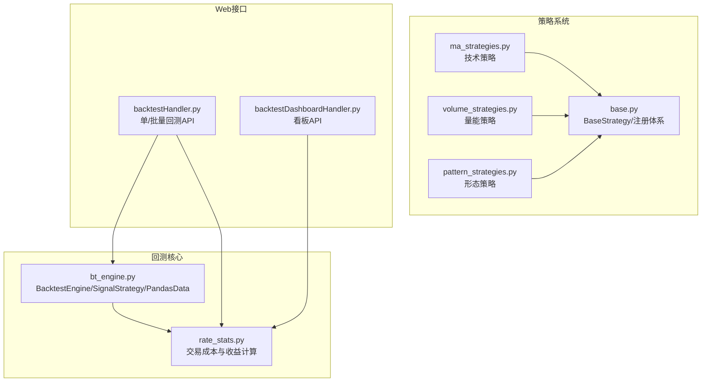
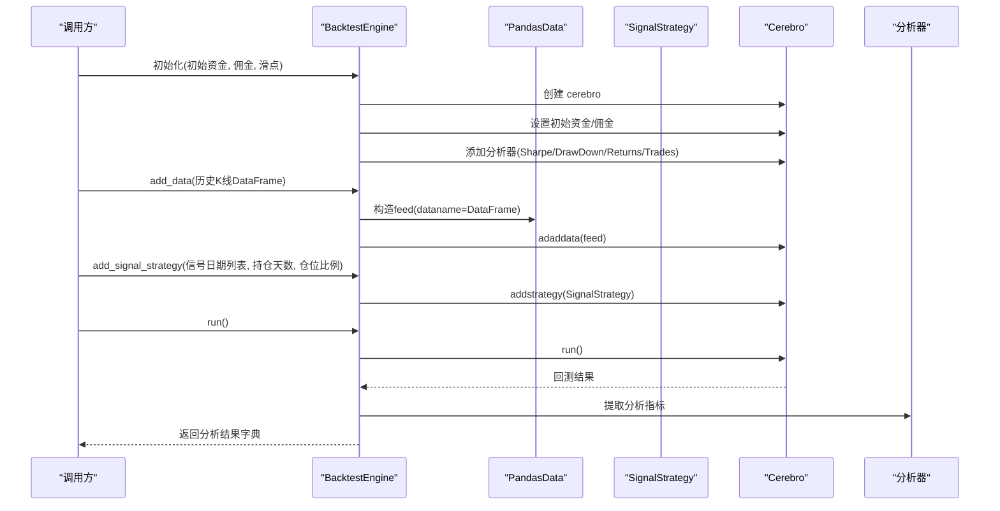
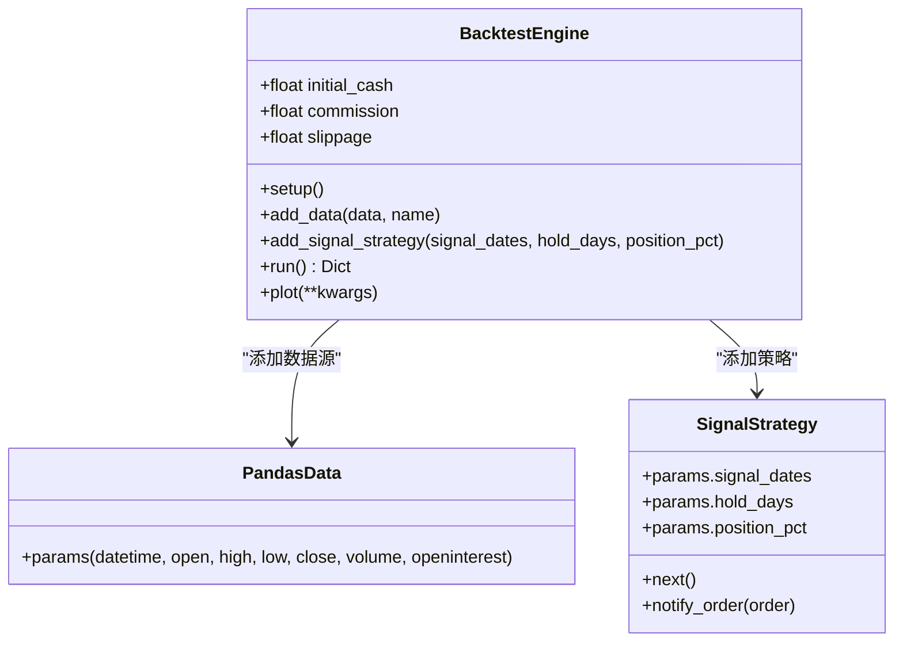
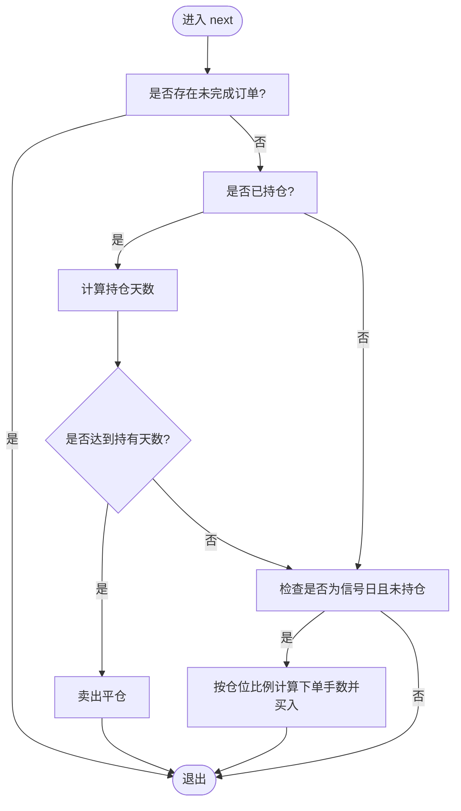
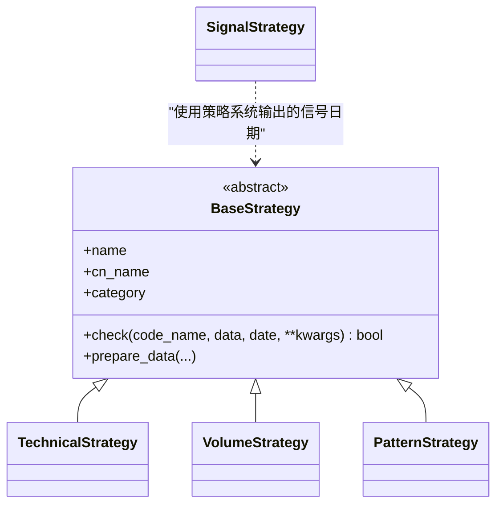
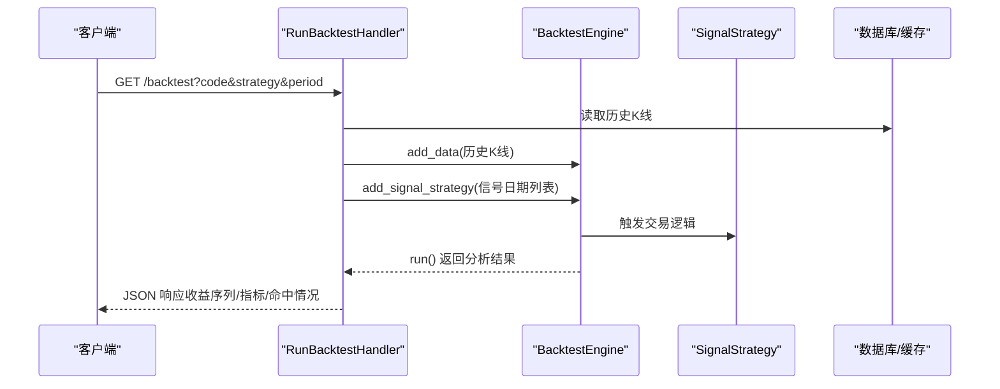
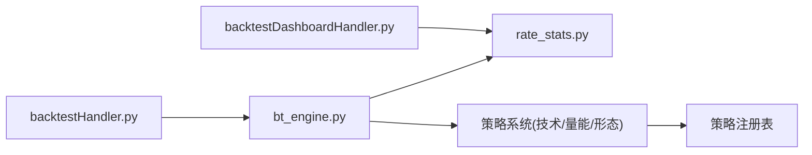

# 回测引擎架构

<cite>
**本文引用的文件**
- [bt_engine.py](file://quantia/core/backtest/bt_engine.py)
- [rate_stats.py](file://quantia/core/backtest/rate_stats.py)
- [base.py](file://quantia/core/strategy/base.py)
- [ma_strategies.py](file://quantia/core/strategy/technical/ma_strategies.py)
- [volume_strategies.py](file://quantia/core/strategy/volume/volume_strategies.py)
- [pattern_strategies.py](file://quantia/core/strategy/pattern/pattern_strategies.py)
- [backtestHandler.py](file://quantia/web/backtestHandler.py)
- [backtestDashboardHandler.py](file://quantia/web/backtestDashboardHandler.py)
- [__init__.py](file://quantia/core/backtest/__init__.py)
- [test_backtest_integrity.py](file://tests/test_backtest_integrity.py)
</cite>

## 目录
1. [简介](#简介)
2. [项目结构](#项目结构)
3. [核心组件](#核心组件)
4. [架构总览](#架构总览)
5. [详细组件分析](#详细组件分析)
6. [依赖关系分析](#依赖关系分析)
7. [性能考量](#性能考量)
8. [故障排查指南](#故障排查指南)
9. [结论](#结论)
10. [附录](#附录)

## 简介
本文件面向开发者，系统性阐述 Quantia 项目的回测引擎架构，重点覆盖：
- 基于 Backtrader 的封装与使用
- 自定义数据源 PandasData 的设计原理
- SignalStrategy 信号策略基类的实现机制
- 引擎初始化流程、数据添加机制、策略配置方法
- 引擎配置参数（初始资金、佣金、滑点）、分析器设置（夏普比率、最大回撤、收益率、交易分析）
- 回测执行流程、结果提取方法、图表绘制功能
- 与策略系统（技术、量能、形态等）的集成与扩展方式

## 项目结构
回测相关代码主要位于 quantia/core/backtest 与 quantia/web 层：
- backtest：封装 Backtrader、定义信号策略与数据源、提供批量回测与报告生成
- strategy：策略基类与各类策略（技术、量能、形态、基本面等）
- web：对外提供回测 API 与看板接口，连接数据库与缓存数据

**图表来源**
- [bt_engine.py](file://quantia/core/backtest/bt_engine.py#L1-L388)
- [rate_stats.py](file://quantia/core/backtest/rate_stats.py#L1-L108)
- [base.py](file://quantia/core/strategy/base.py#L1-L202)
- [ma_strategies.py](file://quantia/core/strategy/technical/ma_strategies.py#L1-L237)
- [volume_strategies.py](file://quantia/core/strategy/volume/volume_strategies.py#L1-L126)
- [pattern_strategies.py](file://quantia/core/strategy/pattern/pattern_strategies.py#L1-L276)
- [backtestHandler.py](file://quantia/web/backtestHandler.py#L1-L673)
- [backtestDashboardHandler.py](file://quantia/web/backtestDashboardHandler.py#L1-L906)

**章节来源**
- [bt_engine.py](file://quantia/core/backtest/bt_engine.py#L1-L388)
- [base.py](file://quantia/core/strategy/base.py#L1-L202)
- [backtestHandler.py](file://quantia/web/backtestHandler.py#L1-L673)

## 核心组件
- BacktestEngine：封装 cerebro，负责初始化、数据添加、策略配置、运行与结果提取
- SignalStrategy：基于信号日期的简单信号策略，支持持仓天数与仓位比例控制
- PandasData：适配项目 OHLCV 数据格式的自定义数据源
- StrategyBacktester：批量策略回测器，结合策略系统输出信号并汇总统计
- rate_stats：统一的交易成本与收益计算模块，保证回测贴近真实市场

**章节来源**
- [bt_engine.py](file://quantia/core/backtest/bt_engine.py#L101-L215)
- [rate_stats.py](file://quantia/core/backtest/rate_stats.py#L1-L108)
- [base.py](file://quantia/core/strategy/base.py#L19-L202)

## 架构总览
回测引擎采用“策略-数据-分析器”的三层架构：
- 策略层：SignalStrategy 与策略系统（技术/量能/形态/基本面）共同构成
- 数据层：PandasData 将 OHLCV 数据标准化注入 Backtrader
- 分析层：内置 SharpeRatio、DrawDown、Returns、TradeAnalyzer 等分析器

**图表来源**
- [bt_engine.py](file://quantia/core/backtest/bt_engine.py#L108-L207)

## 详细组件分析

### BacktestEngine 组件
- 初始化参数
  - initial_cash：初始资金，默认 100000.0
  - commission：佣金比例，默认 0.001（千分之一）
  - slippage：滑点比例，默认 0.001（千分之一）
- 关键方法
  - setup：创建 cerebro，设置初始资金与佣金，添加分析器
  - add_data：规范化日期列，构造 PandasData 并添加到 cerebro
  - add_signal_strategy：添加 SignalStrategy，传入信号日期、持仓天数、仓位比例
  - run：运行回测，提取最终资产、总收益与分析器结果
  - plot：调用 cerebro.plot 绘制图表

**图表来源**
- [bt_engine.py](file://quantia/core/backtest/bt_engine.py#L101-L215)

**章节来源**
- [bt_engine.py](file://quantia/core/backtest/bt_engine.py#L108-L215)

### SignalStrategy 信号策略基类
- 参数
  - signal_dates：信号日期集合（策略触发日）
  - hold_days：持仓天数
  - position_pct：每次买入的仓位比例（占可用资金的比例）
- 逻辑要点
  - next：若当前日期在信号集合且未持仓，则根据可用资金与当前收盘价计算下单手数并买入；若已持仓且达到持有天数，则卖出平仓
  - notify_order：记录订单执行状态，记录买入日期，便于按天数判断卖出

**图表来源**
- [bt_engine.py](file://quantia/core/backtest/bt_engine.py#L77-L98)

**章节来源**
- [bt_engine.py](file://quantia/core/backtest/bt_engine.py#L43-L99)

### PandasData 自定义数据源
- 设计目的：将项目 OHLCV 数据（含 date、open、high、low、close、volume）适配为 Backtrader 的数据源
- 关键点：将 datetime 映射为 date 列，open、high、low、close、volume 映射到对应字段，openinterest 设为 -1（不使用）

**章节来源**
- [bt_engine.py](file://quantia/core/backtest/bt_engine.py#L27-L41)

### rate_stats 交易成本与收益计算
- 交易成本参数（A股）
  - 佣金：单边 0.025%
  - 印花税：卖出单边 0.05%
  - 滑点：单边 0.05%
  - 单次往返总成本：约 0.20%
- 计算逻辑
  - 使用 T+1 开盘价作为买入基准（信号在 T 日收盘后产生，最早 T+1 开盘买入）
  - 扣除单次交易往返成本（买入+卖出）
  - 过滤涨停（T+1 开盘价较 T 日收盘价涨幅≥9.5%）导致无法买入的情况
  - 支持批量计算 N 日收益序列并返回 Series

**章节来源**
- [rate_stats.py](file://quantia/core/backtest/rate_stats.py#L11-L108)

### 策略系统与 SignalStrategy 的集成
- 策略基类：BaseStrategy 定义 check 接口与数据准备逻辑，提供注册与分类能力
- 策略类型：技术（TechnicalStrategy）、量能（VolumeStrategy）、形态（PatternStrategy）、趋势（TrendStrategy）等
- SignalStrategy 与策略系统的协作：策略系统输出信号日期，SignalStrategy 在这些日期触发交易

**图表来源**
- [base.py](file://quantia/core/strategy/base.py#L20-L202)
- [ma_strategies.py](file://quantia/core/strategy/technical/ma_strategies.py#L22-L56)
- [volume_strategies.py](file://quantia/core/strategy/volume/volume_strategies.py#L19-L69)
- [pattern_strategies.py](file://quantia/core/strategy/pattern/pattern_strategies.py#L22-L78)

**章节来源**
- [base.py](file://quantia/core/strategy/base.py#L19-L202)
- [ma_strategies.py](file://quantia/core/strategy/technical/ma_strategies.py#L22-L56)
- [volume_strategies.py](file://quantia/core/strategy/volume/volume_strategies.py#L19-L69)
- [pattern_strategies.py](file://quantia/core/strategy/pattern/pattern_strategies.py#L22-L78)

### Web 层回测接口与看板
- 单只股票回测：backtestHandler 提供单只股票回测接口，支持指定策略、周期、checkpoint 等参数，返回收益序列、区间最大收益/最大回撤、策略命中与关键指标
- 批量回测：支持从策略表读取历史选股记录，计算各周期收益并聚合统计
- 回测看板：backtestDashboardHandler 提供跨策略总览、时间序列、明细、收益分布、买卖配对等接口，支持日期范围、horizon 列表、分页等参数

**图表来源**
- [backtestHandler.py](file://quantia/web/backtestHandler.py#L82-L290)

**章节来源**
- [backtestHandler.py](file://quantia/web/backtestHandler.py#L82-L421)
- [backtestDashboardHandler.py](file://quantia/web/backtestDashboardHandler.py#L360-L724)

## 依赖关系分析
- 模块耦合
  - bt_engine 依赖 backtrader（动态导入），依赖 rate_stats 的交易成本常量
  - 策略系统通过注册表管理策略类，SignalStrategy 与策略系统解耦
  - web 层通过 backtestHandler 与 backtestDashboardHandler 调用回测引擎与策略系统
- 外部依赖
  - backtrader：核心回测框架
  - pandas/numpy：数据处理与数值计算
  - MySQL/tornado（web层）：数据库访问与HTTP服务

**图表来源**
- [bt_engine.py](file://quantia/core/backtest/bt_engine.py#L1-L388)
- [rate_stats.py](file://quantia/core/backtest/rate_stats.py#L1-L108)
- [backtestHandler.py](file://quantia/web/backtestHandler.py#L1-L673)
- [backtestDashboardHandler.py](file://quantia/web/backtestDashboardHandler.py#L1-L906)

**章节来源**
- [bt_engine.py](file://quantia/core/backtest/bt_engine.py#L1-L388)
- [base.py](file://quantia/core/strategy/base.py#L155-L202)

## 性能考量
- 数据规范化：add_data 中对日期列进行 to_datetime 与 set_index，建议提前确保数据质量，减少重复转换
- 订单状态：SignalStrategy 在订单提交/接受阶段直接返回，避免无效交易，降低交易次数
- 分析器：仅添加必要分析器，避免过多分析器带来的额外计算开销
- 批量回测：web 层支持并行处理（ThreadPoolExecutor），注意线程池大小与资源限制

[本节为通用指导，无需特定文件引用]

## 故障排查指南
- Backtrader 未安装
  - 现象：初始化 BacktestEngine 抛出 ImportError
  - 处理：安装 backtrader 后重试
- 数据格式问题
  - 现象：回测无数据或报错
  - 处理：确认 DataFrame 包含 date/open/high/low/close/volume 列，且 date 为可解析日期
- 信号日期与持仓逻辑
  - 现象：未按预期买入/卖出
  - 处理：核对 signal_dates 是否为字符串日期，确认 position_pct 与 hold_days 设置
- 涨停过滤
  - 现象：T+1 开盘涨停导致无法买入
  - 处理：检查 T 日收盘价与 T+1 开盘价差价是否达到 9.5% 上限
- 分析器结果为空
  - 现象：某些分析器指标缺失
  - 处理：确认 run() 后再提取分析器结果，避免在 cerebro 未运行时访问

**章节来源**
- [bt_engine.py](file://quantia/core/backtest/bt_engine.py#L119-L120)
- [backtestHandler.py](file://quantia/web/backtestHandler.py#L225-L229)

## 结论
Quantia 的回测引擎以 Backtrader 为核心，通过 PandasData 标准化数据、SignalStrategy 简化信号交易、rate_stats 统一交易成本与收益计算，形成清晰的策略-数据-分析三层架构。配合策略系统与 Web 层接口，既满足单只股票回测，也能支撑批量与看板场景。开发者可在此基础上扩展新的策略与分析器，保持良好的可维护性与可扩展性。

[本节为总结，无需特定文件引用]

## 附录

### 引擎配置参数说明
- initial_cash：初始资金（默认 100000.0）
- commission：佣金比例（默认 0.001）
- slippage：滑点比例（默认 0.001）

**章节来源**
- [bt_engine.py](file://quantia/core/backtest/bt_engine.py#L108-L110)

### 分析器设置说明
- SharpeRatio：夏普比率
- DrawDown：最大回撤
- Returns：总收益率
- TradeAnalyzer：交易统计（胜率、盈亏比等）

**章节来源**
- [bt_engine.py](file://quantia/core/backtest/bt_engine.py#L134-L138)

### 回测执行流程与结果提取
- 执行流程：setup → add_data → add_signal_strategy → run → 提取分析器结果
- 结果字段：初始资金、最终资产、总收益百分比、夏普比率、最大回撤、交易统计

**章节来源**
- [bt_engine.py](file://quantia/core/backtest/bt_engine.py#L181-L207)

### 图表绘制
- 使用 cerebro.plot 绘制回测结果图表，支持传入绘图参数

**章节来源**
- [bt_engine.py](file://quantia/core/backtest/bt_engine.py#L209-L214)

### Web 接口与看板参数
- 单只回测：code、strategy、period、start_date、end_date、checkpoints
- 批量回测：strategy、period、limit、horizons、success_days
- 看板：strategy、days、horizon、page、page_size、max_hold 等

**章节来源**
- [backtestHandler.py](file://quantia/web/backtestHandler.py#L82-L126)
- [backtestDashboardHandler.py](file://quantia/web/backtestDashboardHandler.py#L549-L637)

### 测试与一致性验证
- 测试覆盖：数据生成、T+1 开盘价使用、交易成本扣除、与 rate_stats 的一致性校验

**章节来源**
- [test_backtest_integrity.py](file://tests/test_backtest_integrity.py#L1-L211)
