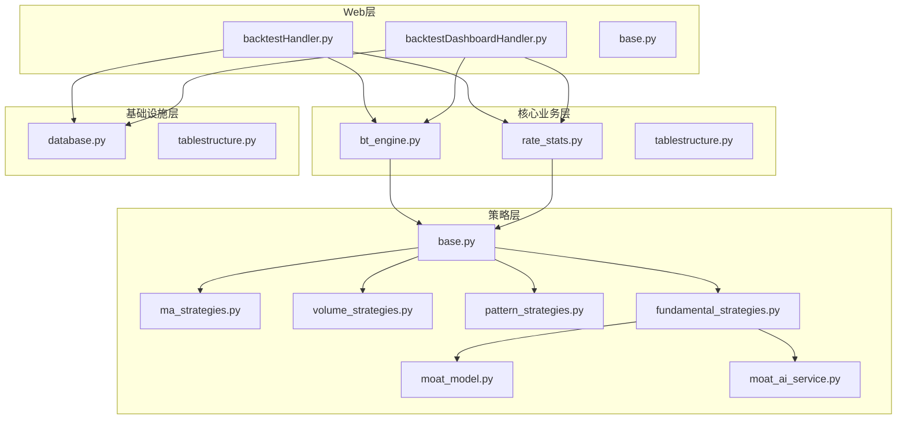
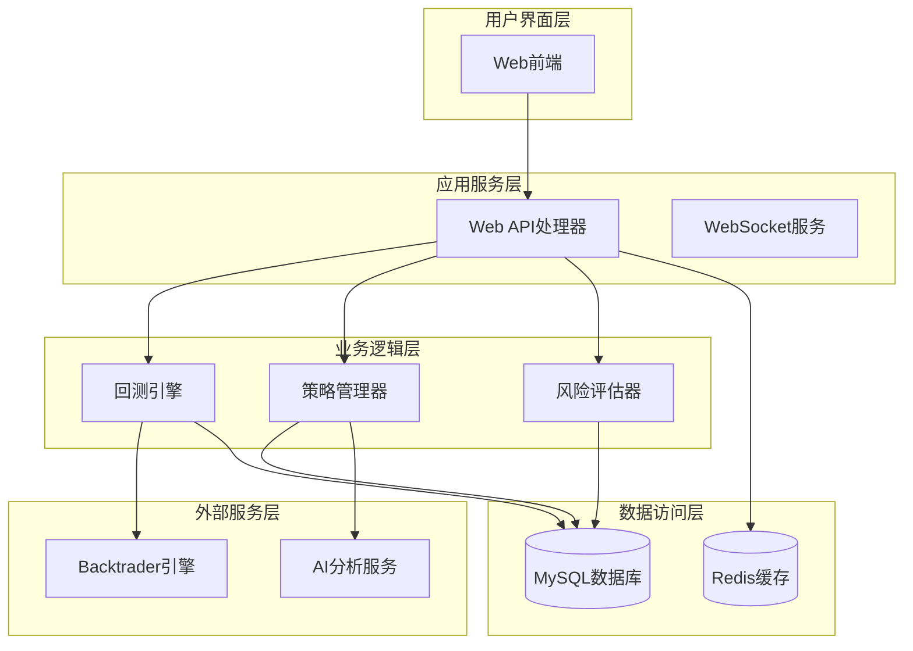
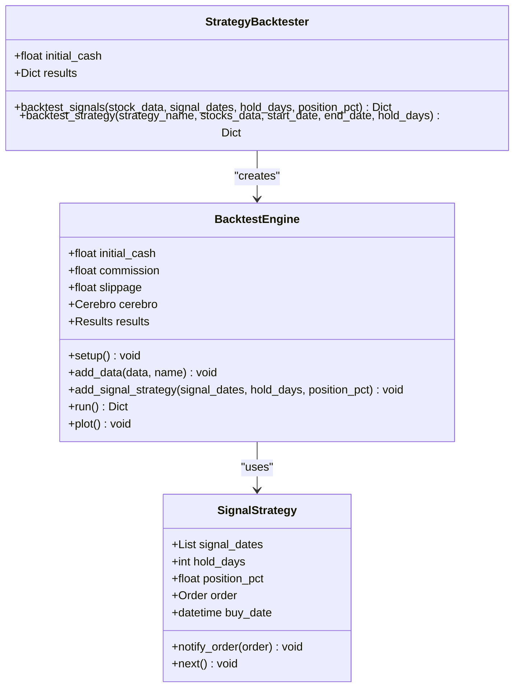
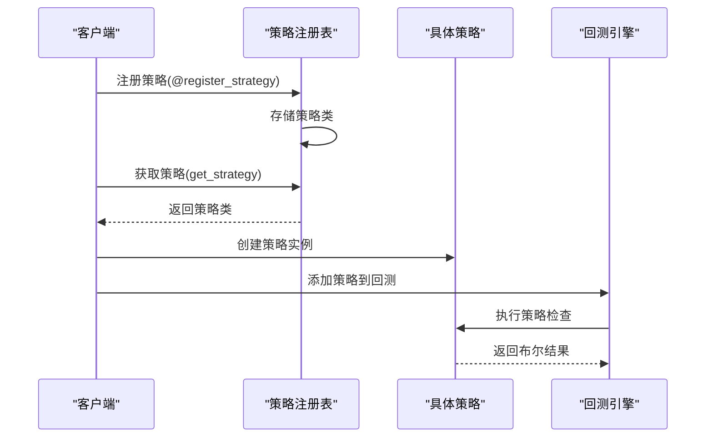
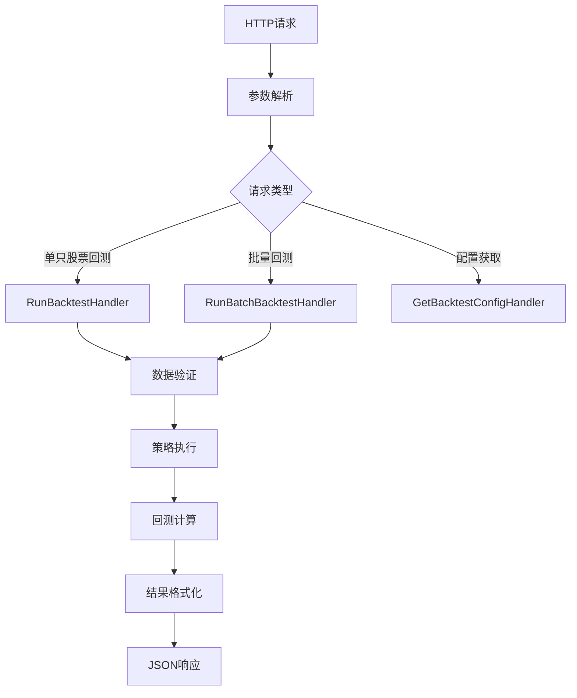
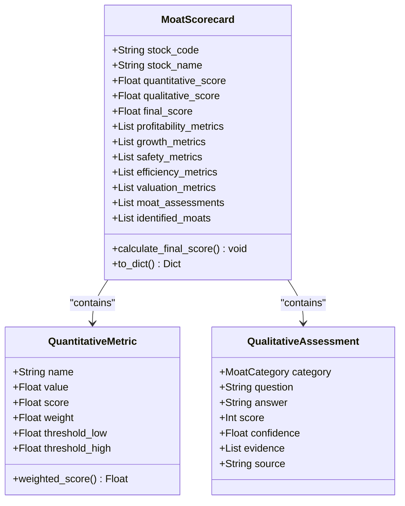
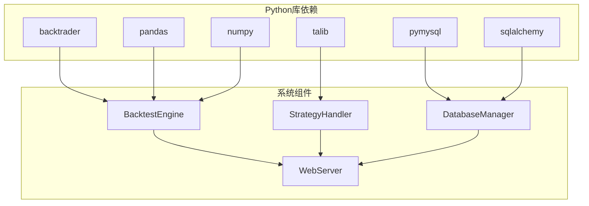
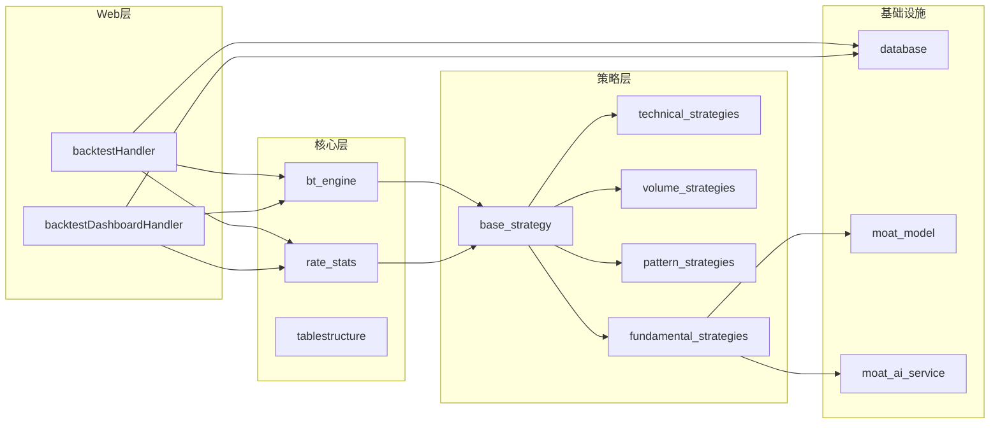

# 回测验证系统

<cite>
**本文档引用的文件**
- [bt_engine.py](file://quantia/core/backtest/bt_engine.py)
- [rate_stats.py](file://quantia/core/backtest/rate_stats.py)
- [backtestHandler.py](file://quantia/web/backtestHandler.py)
- [backtestDashboardHandler.py](file://quantia/web/backtestDashboardHandler.py)
- [base.py](file://quantia/web/base.py)
- [base.py](file://quantia/core/strategy/base.py)
- [ma_strategies.py](file://quantia/core/strategy/technical/ma_strategies.py)
- [volume_strategies.py](file://quantia/core/strategy/volume/volume_strategies.py)
- [pattern_strategies.py](file://quantia/core/strategy/pattern/pattern_strategies.py)
- [fundamental_strategies.py](file://quantia/core/strategy/fundamental/fundamental_strategies.py)
- [moat_model.py](file://quantia/core/strategy/fundamental/moat_model.py)
- [moat_ai_service.py](file://quantia/core/strategy/fundamental/moat_ai_service.py)
- [tablestructure.py](file://quantia/core/tablestructure.py)
- [database.py](file://quantia/lib/database.py)
</cite>

## 目录
1. [简介](#简介)
2. [项目结构](#项目结构)
3. [核心组件](#核心组件)
4. [架构概览](#架构概览)
5. [详细组件分析](#详细组件分析)
6. [依赖分析](#依赖分析)
7. [性能考虑](#性能考虑)
8. [故障排除指南](#故障排除指南)
9. [结论](#结论)
10. [附录](#附录)

## 简介
本系统是一个基于Backtrader的回测验证平台，专为Quantia项目设计，提供：
- 基于Backtrader的回测引擎封装
- 多策略对比分析功能
- 收益率计算与风险指标评估
- 交易成本与滑点模拟
- 回测报告生成与可视化
- Web API接口与看板展示

系统支持技术分析、成交量分析、K线形态识别、基本面分析等多种策略类型，为用户提供全面的投资决策支持。

## 项目结构
项目采用模块化设计，主要分为以下几个层次：

**图表来源**
- [backtestHandler.py](file://quantia/web/backtestHandler.py#L1-L673)
- [bt_engine.py](file://quantia/core/backtest/bt_engine.py#L1-L388)
- [base.py](file://quantia/core/strategy/base.py#L1-L202)

**章节来源**
- [backtestHandler.py](file://quantia/web/backtestHandler.py#L1-L673)
- [bt_engine.py](file://quantia/core/backtest/bt_engine.py#L1-L388)
- [base.py](file://quantia/core/strategy/base.py#L1-L202)

## 核心组件
系统的核心组件包括回测引擎、策略框架、数据结构和Web接口四个主要部分。

### 回测引擎组件
- **BacktestEngine**: 基于Backtrader的回测引擎封装
- **SignalStrategy**: 信号驱动的交易策略基类
- **StrategyBacktester**: 策略批量回测器

### 策略框架组件
- **BaseStrategy**: 策略基类，提供统一接口
- **TechnicalStrategy**: 技术分析策略基类
- **VolumeStrategy**: 成交量分析策略基类
- **PatternStrategy**: K线形态策略基类
- **FundamentalStrategy**: 基本面分析策略基类

### 数据结构组件
- **MoatScorecard**: 护城河评分卡数据模型
- **QuantitativeMetric**: 量化指标评分项
- **QualitativeAssessment**: 定性评估项

### Web接口组件
- **GetBacktestConfigHandler**: 获取回测配置
- **RunBacktestHandler**: 执行单只股票回测
- **RunBatchBacktestHandler**: 批量回测处理器
- **DashboardOverviewHandler**: 回测看板总览

**章节来源**
- [bt_engine.py](file://quantia/core/backtest/bt_engine.py#L101-L388)
- [base.py](file://quantia/core/strategy/base.py#L20-L202)
- [backtestHandler.py](file://quantia/web/backtestHandler.py#L69-L673)

## 架构概览
系统采用分层架构设计，实现了业务逻辑与数据访问的分离：

**图表来源**
- [backtestHandler.py](file://quantia/web/backtestHandler.py#L82-L126)
- [bt_engine.py](file://quantia/core/backtest/bt_engine.py#L101-L139)
- [database.py](file://quantia/lib/database.py#L60-L71)

系统架构特点：
1. **模块化设计**: 各组件职责明确，便于维护和扩展
2. **异步处理**: 支持批量回测的并行处理
3. **缓存机制**: 优化数据访问性能
4. **配置管理**: 支持动态参数调整

## 详细组件分析

### 回测引擎组件分析

#### BacktestEngine类
回测引擎是系统的核心，封装了Backtrader的所有功能：

**图表来源**
- [bt_engine.py](file://quantia/core/backtest/bt_engine.py#L101-L180)
- [bt_engine.py](file://quantia/core/backtest/bt_engine.py#L43-L99)

**章节来源**
- [bt_engine.py](file://quantia/core/backtest/bt_engine.py#L101-L215)

#### 收益率计算组件
系统提供了两种收益率计算方式：

1. **实时计算**: 基于单只股票的历史数据
2. **批量计算**: 基于策略表的批量回测

**章节来源**
- [rate_stats.py](file://quantia/core/backtest/rate_stats.py#L34-L108)
- [bt_engine.py](file://quantia/core/backtest/bt_engine.py#L310-L358)

### 策略框架组件分析

#### 策略注册与管理
系统采用装饰器模式实现策略注册：

**图表来源**
- [base.py](file://quantia/core/strategy/base.py#L159-L186)

**章节来源**
- [base.py](file://quantia/core/strategy/base.py#L155-L202)

#### 技术分析策略
系统支持多种技术分析策略：

1. **均线策略**: 均线多头、回踩年线、海龟交易法则
2. **成交量策略**: 放量上涨、放量跌停
3. **形态识别**: 突破平台、停机坪、旗形整理

**章节来源**
- [ma_strategies.py](file://quantia/core/strategy/technical/ma_strategies.py#L22-L237)
- [volume_strategies.py](file://quantia/core/strategy/volume/volume_strategies.py#L19-L126)
- [pattern_strategies.py](file://quantia/core/strategy/pattern/pattern_strategies.py#L22-L276)

### Web接口组件分析

#### 回测API处理器
系统提供了完整的回测API接口：

**图表来源**
- [backtestHandler.py](file://quantia/web/backtestHandler.py#L82-L126)

**章节来源**
- [backtestHandler.py](file://quantia/web/backtestHandler.py#L82-L290)

#### 回测看板组件
看板功能提供了多维度的回测数据分析：

1. **总览视图**: 跨策略总体表现
2. **时间序列**: 策略表现趋势
3. **明细视图**: 个股回测详情
4. **分布视图**: 收益率分布统计

**章节来源**
- [backtestDashboardHandler.py](file://quantia/web/backtestDashboardHandler.py#L360-L547)

### 基本面分析组件分析

#### 护城河评分模型
系统实现了完整的护城河评估体系：

**图表来源**
- [moat_model.py](file://quantia/core/strategy/fundamental/moat_model.py#L86-L270)

**章节来源**
- [moat_model.py](file://quantia/core/strategy/fundamental/moat_model.py#L46-L270)
- [moat_ai_service.py](file://quantia/core/strategy/fundamental/moat_ai_service.py#L170-L305)

## 依赖分析

### 外部依赖关系
系统的主要外部依赖包括：

**图表来源**
- [bt_engine.py](file://quantia/core/backtest/bt_engine.py#L16-L21)
- [base.py](file://quantia/core/strategy/base.py#L12-L14)

### 内部组件耦合关系
系统内部组件之间的依赖关系如下：

**图表来源**
- [backtestHandler.py](file://quantia/web/backtestHandler.py#L1-L50)
- [bt_engine.py](file://quantia/core/backtest/bt_engine.py#L1-L50)

**章节来源**
- [tablestructure.py](file://quantia/core/tablestructure.py#L1-L50)
- [database.py](file://quantia/lib/database.py#L1-L50)

## 性能考虑

### 回测性能优化
系统在多个层面进行了性能优化：

1. **并行处理**: 批量回测使用ThreadPoolExecutor实现并行处理
2. **数据缓存**: 使用Redis缓存热点数据
3. **数据库优化**: 合理的索引设计和查询优化
4. **内存管理**: 及时释放不再使用的数据对象

### 性能监控指标
系统监控的关键性能指标包括：
- 回测执行时间
- 内存使用量
- 数据库查询响应时间
- API接口响应时间

## 故障排除指南

### 常见问题及解决方案

#### 回测引擎初始化失败
**问题症状**: "Backtrader未安装"
**解决方法**: 
1. 安装Backtrader库
2. 验证Python环境
3. 检查依赖版本兼容性

#### 数据库连接异常
**问题症状**: 数据库连接失败或超时
**解决方法**:
1. 检查数据库服务状态
2. 验证连接参数配置
3. 查看连接池状态

#### 策略执行异常
**问题症状**: 策略检查失败或返回None
**解决方法**:
1. 检查策略参数配置
2. 验证数据完整性
3. 查看策略实现逻辑

**章节来源**
- [bt_engine.py](file://quantia/core/backtest/bt_engine.py#L119-L121)
- [database.py](file://quantia/lib/database.py#L80-L92)

## 结论
Quantia回测验证系统是一个功能完整、架构清晰的量化投资回测平台。系统的主要优势包括：

1. **模块化设计**: 各组件职责明确，便于维护和扩展
2. **多策略支持**: 支持技术分析、成交量分析、形态识别、基本面分析等多种策略类型
3. **性能优化**: 采用并行处理和缓存机制提升系统性能
4. **可视化展示**: 提供丰富的回测报告和看板功能
5. **易于使用**: 提供简洁的API接口和配置选项

系统为用户提供了一个全面的投资决策支持平台，能够帮助用户验证策略有效性并做出科学的投资决策。

## 附录

### 配置指南
系统支持多种配置方式：
- 环境变量配置
- 数据库配置
- 策略参数配置
- AI服务配置

### 参数优化策略
1. **网格搜索**: 系统化的参数空间探索
2. **遗传算法**: 智能参数优化
3. **贝叶斯优化**: 基于概率模型的参数调优
4. **在线学习**: 实时参数自适应调整

### 回测结果分析技巧
1. **夏普比率**: 衡量风险调整后收益
2. **最大回撤**: 评估下行风险
3. **胜率分析**: 评估策略稳定性
4. **收益分布**: 分析收益的统计特性
