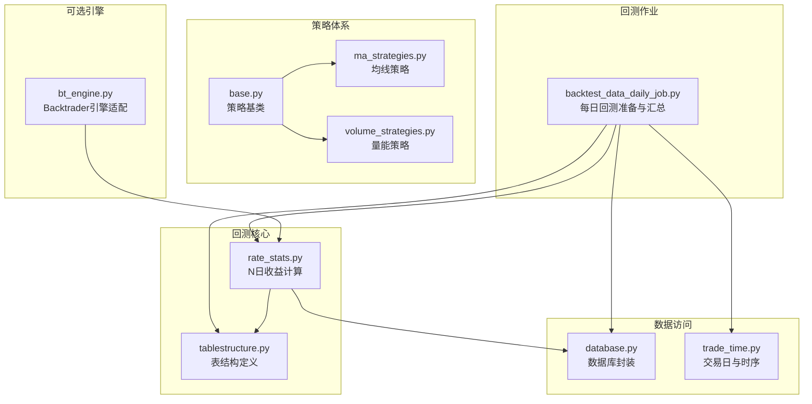
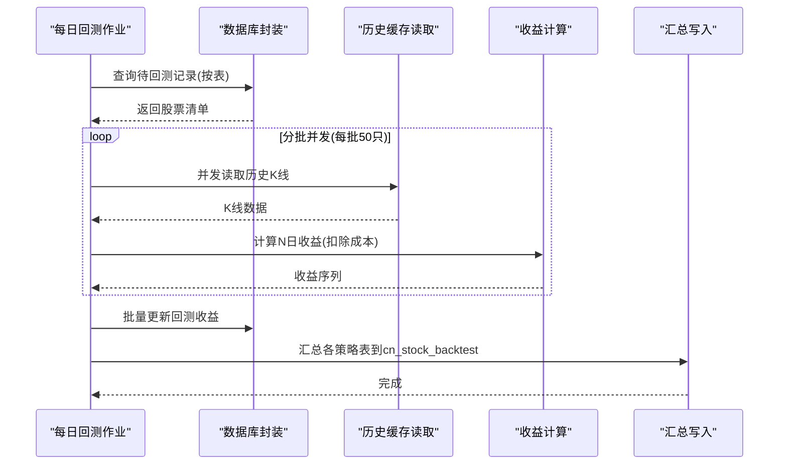
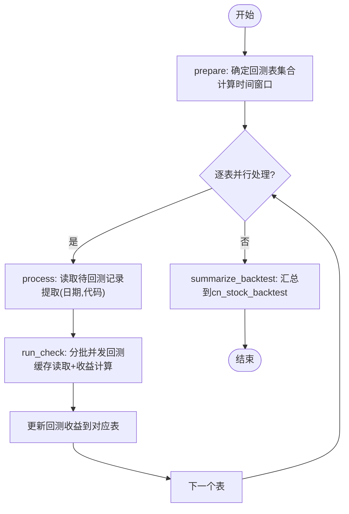
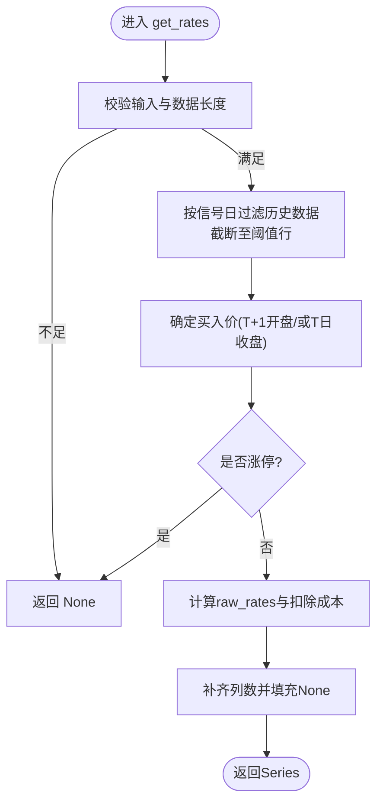
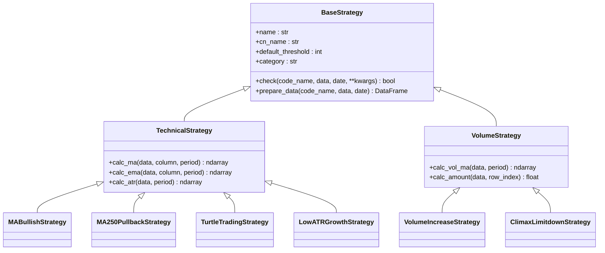
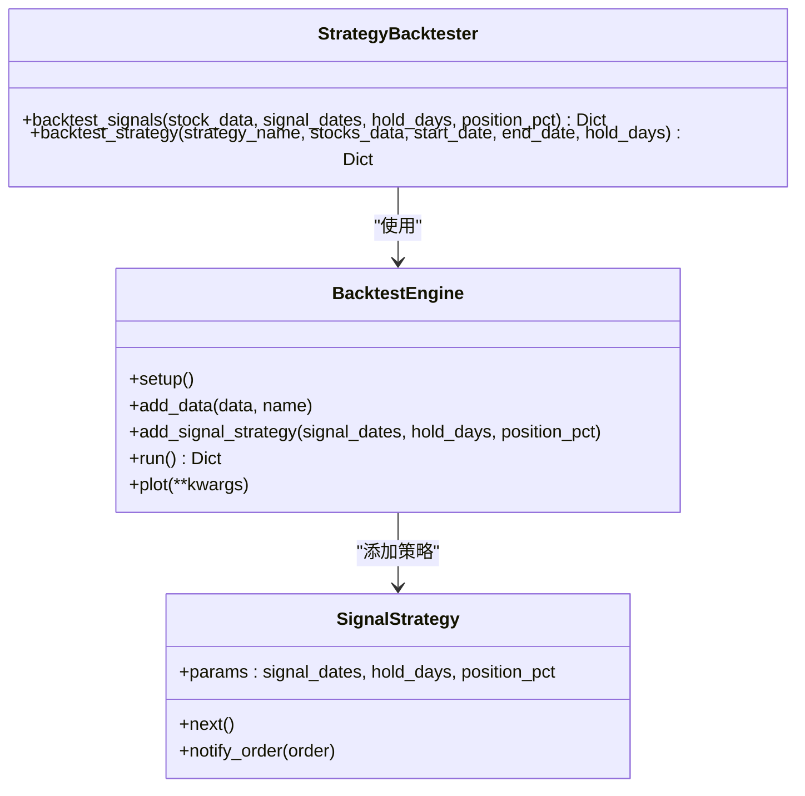
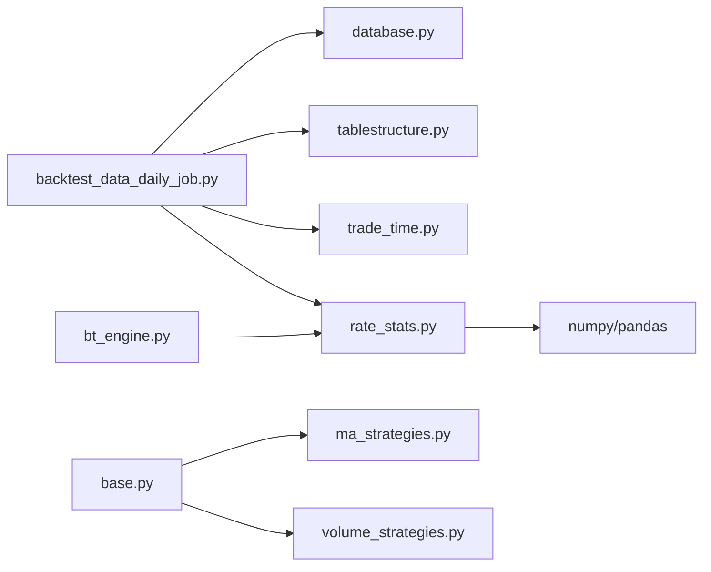

# 批量回测处理

<cite>
**本文引用的文件**
- [backtest_data_daily_job.py](file://quantia/job/backtest_data_daily_job.py)
- [bt_engine.py](file://quantia/core/backtest/bt_engine.py)
- [rate_stats.py](file://quantia/core/backtest/rate_stats.py)
- [base.py](file://quantia/core/strategy/base.py)
- [tablestructure.py](file://quantia/core/tablestructure.py)
- [database.py](file://quantia/lib/database.py)
- [trade_time.py](file://quantia/lib/trade_time.py)
- [ma_strategies.py](file://quantia/core/strategy/technical/ma_strategies.py)
- [volume_strategies.py](file://quantia/core/strategy/volume/volume_strategies.py)
</cite>

## 目录
1. [简介](#简介)
2. [项目结构](#项目结构)
3. [核心组件](#核心组件)
4. [架构总览](#架构总览)
5. [详细组件分析](#详细组件分析)
6. [依赖分析](#依赖分析)
7. [性能考虑](#性能考虑)
8. [故障排查指南](#故障排查指南)
9. [结论](#结论)
10. [附录](#附录)

## 简介
本文件面向系统管理员与开发者，全面解析 Quantia 批量回测处理系统的设计与实现，重点围绕“策略批量回测”这一核心目标，阐述数据准备、回测任务调度、每日回测作业 backtest_data_daily_job 的工作机制（策略遍历、信号收集、回测执行、结果汇总）、配置项、性能优化策略、错误处理机制，以及回测数据预处理、多股票并行处理、内存管理与进度监控等关键能力。

## 项目结构
- 批量回测入口位于 quantia/job/backtest_data_daily_job.py，负责每日回测数据准备与汇总。
- 回测核心逻辑位于 quantia/core/backtest/rate_stats.py，提供基于缓存的历史数据回测收益计算。
- 策略体系位于 quantia/core/strategy/*，包含技术面、成交量等策略基类与具体策略实现。
- 数据结构定义位于 quantia/core/tablestructure.py，统一描述各回测相关表结构。
- 数据库访问封装位于 quantia/lib/database.py，提供连接池、UPSERT、更新与查询等能力。
- 交易日与时序辅助位于 quantia/lib/trade_time.py，用于确定回测时间窗口与交易日判定。
- 可选的 Backtrader 引擎适配位于 quantia/core/backtest/bt_engine.py，便于扩展图形化回测与分析。



**图示来源**
- [backtest_data_daily_job.py](file://quantia/job/backtest_data_daily_job.py#L1-L275)
- [rate_stats.py](file://quantia/core/backtest/rate_stats.py#L1-L108)
- [tablestructure.py](file://quantia/core/tablestructure.py#L22-L44)
- [base.py](file://quantia/core/strategy/base.py#L20-L202)
- [ma_strategies.py](file://quantia/core/strategy/technical/ma_strategies.py#L22-L237)
- [volume_strategies.py](file://quantia/core/strategy/volume/volume_strategies.py#L19-L126)
- [database.py](file://quantia/lib/database.py#L60-L76)
- [trade_time.py](file://quantia/lib/trade_time.py#L127-L168)
- [bt_engine.py](file://quantia/core/backtest/bt_engine.py#L101-L214)

**章节来源**
- [backtest_data_daily_job.py](file://quantia/job/backtest_data_daily_job.py#L1-L275)
- [tablestructure.py](file://quantia/core/tablestructure.py#L22-L44)

## 核心组件
- 每日回测准备与汇总作业：负责筛选待回测股票、按表并行处理、分批并发回测、将收益结果写回数据库，并汇总到 cn_stock_backtest。
- 回测收益计算：基于缓存的历史K线数据，按信号日 T+1 开盘价计算 N 日持有收益，扣除交易成本，过滤涨停/跌停等边界情况。
- 策略基类与注册：统一的策略抽象、分类与注册机制，便于扩展与批量回测。
- 数据库封装：连接池、UPSERT、主键/索引自动维护、重试与瞬态错误处理。
- 时间窗口与交易日：根据结束日期推导起始回测区间，避免跨交易时段导致的缓存不完整。

**章节来源**
- [backtest_data_daily_job.py](file://quantia/job/backtest_data_daily_job.py#L35-L140)
- [rate_stats.py](file://quantia/core/backtest/rate_stats.py#L34-L108)
- [base.py](file://quantia/core/strategy/base.py#L20-L202)
- [database.py](file://quantia/lib/database.py#L60-L203)
- [trade_time.py](file://quantia/lib/trade_time.py#L127-L168)

## 架构总览
回测系统采用“按表并行 + 分批并发”的双层并发模型：
- 外层：按策略表并行处理，受 QUANTIA_BACKTEST_OUTER_WORKERS 控制，避免一次性加载过多表。
- 内层：对单表内的股票集合分批（默认每批 50 只），在 INNER_WORKERS 线程池内并发读取缓存并计算收益，降低内存峰值。



**图示来源**
- [backtest_data_daily_job.py](file://quantia/job/backtest_data_daily_job.py#L59-L136)
- [rate_stats.py](file://quantia/core/backtest/rate_stats.py#L34-L108)
- [database.py](file://quantia/lib/database.py#L206-L242)

## 详细组件分析

### 组件A：每日回测作业 backtest_data_daily_job
- 目标：逐表准备回测数据，按需回测并更新收益，最后汇总到 cn_stock_backtest。
- 关键流程
  - prepare：确定回测表集合（含指标表、策略表、GPT综合选股表），计算回测时间窗口，按表并行处理。
  - process：读取待回测记录，提取外键(日期+代码)，分批并发 run_check。
  - run_check：对每只股票从缓存读取历史数据，计算收益序列，聚合结果。
  - summarize_backtest：将各策略表的回测结果按日期聚合，计算成功率与各 horizon 平均收益，写入 cn_stock_backtest。
- 并发与内存
  - 外层并发：QUANTIA_BACKTEST_OUTER_WORKERS 控制表级并行度。
  - 内层并发：QUANTIA_BACKTEST_INNER_WORKERS 控制单批股票的线程数。
  - 分批策略：每批 50 只，避免一次性创建过多 Future 导致内存峰值。
  - 周期性垃圾回收：在批次与表级处理后主动 gc，降低内存压力。
- 错误处理
  - 表级与行级异常捕获，记录日志并继续处理后续数据。
  - 汇总阶段对缺失表与空结果进行安全处理。
- 性能特性
  - 仅处理 backtest 列为 NULL 的记录，避免重复回测。
  - 从磁盘缓存读取历史数据，避免全量单例加载，内存占用显著降低。



**图示来源**
- [backtest_data_daily_job.py](file://quantia/job/backtest_data_daily_job.py#L35-L140)
- [backtest_data_daily_job.py](file://quantia/job/backtest_data_daily_job.py#L167-L270)

**章节来源**
- [backtest_data_daily_job.py](file://quantia/job/backtest_data_daily_job.py#L35-L140)
- [backtest_data_daily_job.py](file://quantia/job/backtest_data_daily_job.py#L167-L270)

### 组件B：回测收益计算 rate_stats.get_rates
- 输入：(信号日, 股票代码)、历史K线DataFrame、列名模板、最大回测天数阈值。
- 核心规则
  - 买入价：使用 T+1 开盘价；若无开盘价则回退到 T 日收盘价。
  - 过滤涨停：T+1 开盘价相对 T 日收盘价涨幅≥9.5% 视为涨停，跳过该信号。
  - 收益计算：按持有 N 天的收盘价，扣除单次交易总成本（约 0.20%）。
  - 输出：Series，包含 [date, code, rate_1, rate_2, ..., rate_N]，不足部分填充 None。
- 边界处理
  - 数据不足（至少 2 行）或价格无效时返回 None。
  - 异常捕获并记录日志，避免中断整体回测。



**图示来源**
- [rate_stats.py](file://quantia/core/backtest/rate_stats.py#L34-L108)

**章节来源**
- [rate_stats.py](file://quantia/core/backtest/rate_stats.py#L34-L108)

### 组件C：策略基类与注册机制
- BaseStrategy：统一 check 接口、数据准备（按日期截断）、阈值控制。
- 分类策略：TechnicalStrategy、VolumeStrategy 等，提供常用指标计算工具。
- 注册与获取：通过装饰器注册策略，按名称获取策略类，便于策略回测器统一调度。



**图示来源**
- [base.py](file://quantia/core/strategy/base.py#L20-L202)
- [ma_strategies.py](file://quantia/core/strategy/technical/ma_strategies.py#L22-L237)
- [volume_strategies.py](file://quantia/core/strategy/volume/volume_strategies.py#L19-L126)

**章节来源**
- [base.py](file://quantia/core/strategy/base.py#L20-L202)
- [ma_strategies.py](file://quantia/core/strategy/technical/ma_strategies.py#L22-L237)
- [volume_strategies.py](file://quantia/core/strategy/volume/volume_strategies.py#L19-L126)

### 组件D：数据库封装与表结构
- 数据库封装
  - 单例连接池：engine() 返回全局连接池，减少连接开销。
  - UPSERT：基于 INSERT ... ON DUPLICATE KEY UPDATE，避免主键冲突与死锁。
  - 主键/索引：首次创建表时自动添加主键与索引。
  - 重试：对瞬态错误（死锁、锁超时、连接异常等）进行有限重试。
- 表结构
  - 回测汇总表 cn_stock_backtest：包含日期、策略名、选股数、成功数、成功率、各 horizon 平均收益。
  - 回测数据表 cn_stock_backtest_data：rate_1..rate_N 列，N 由 RATE_FIELDS_COUNT 控制。
  - 策略表：包含外键列与回测收益列，便于回测结果写回。

```mermaid
erDiagram
CN_STOCK_BACKTEST {
date date
strategy_name varchar
stock_count smallint
success_count smallint
success_rate float
avg_rate_1 float
avg_rate_3 float
avg_rate_5 float
avg_rate_10 float
avg_rate_20 float
avg_rate_30 float
avg_rate_60 float
avg_rate_90 float
avg_rate_120 float
}
CN_STOCK_BACKTEST_DATA {
rate_1 float
rate_2 float
...
rate_N float
}
CN_STOCK_FOREIGN_KEY {
date date
code varchar
name varchar
}
CN_STOCK_INDICATORS_BUY ||--o{ CN_STOCK_BACKTEST_DATA : "包含回测收益"
CN_STOCK_INDICATORS_SELL ||--o{ CN_STOCK_BACKTEST_DATA : "包含回测收益"
CN_STOCK_STRATEGIES ||--o{ CN_STOCK_BACKTEST_DATA : "包含回测收益"
CN_STOCK_STRATEGY_GPT_VALUE ||--o{ CN_STOCK_BACKTEST_DATA : "包含回测收益"
```

**图示来源**
- [tablestructure.py](file://quantia/core/tablestructure.py#L22-L44)
- [tablestructure.py](file://quantia/core/tablestructure.py#L316-L318)
- [tablestructure.py](file://quantia/core/tablestructure.py#L409-L467)

**章节来源**
- [database.py](file://quantia/lib/database.py#L60-L203)
- [tablestructure.py](file://quantia/core/tablestructure.py#L22-L44)
- [tablestructure.py](file://quantia/core/tablestructure.py#L316-L318)
- [tablestructure.py](file://quantia/core/tablestructure.py#L409-L467)

### 组件E：可选 Backtrader 引擎适配
- BacktestEngine：封装 cerebro，提供数据源、信号策略、分析器与绘图接口。
- StrategyBacktester：批量回测策略的信号，支持按策略名加载与统一调度。
- 适用场景：需要图形化回测、Sharpe、最大回撤等指标时启用。



**图示来源**
- [bt_engine.py](file://quantia/core/backtest/bt_engine.py#L101-L214)
- [bt_engine.py](file://quantia/core/backtest/bt_engine.py#L43-L99)

**章节来源**
- [bt_engine.py](file://quantia/core/backtest/bt_engine.py#L101-L214)

## 依赖分析
- 组件耦合
  - backtest_data_daily_job 依赖 database、tablestructure、trade_time、rate_stats。
  - rate_stats 依赖 pandas/numpy，受交易成本常量影响。
  - 策略体系与回测收益计算解耦，通过统一接口与表结构对接。
- 外部依赖
  - MySQL/SQLAlchemy：数据库访问与连接池。
  - pandas/numpy：数据处理与向量化计算。
  - 可选：backtrader（图形化回测）。



**图示来源**
- [backtest_data_daily_job.py](file://quantia/job/backtest_data_daily_job.py#L24-L28)
- [rate_stats.py](file://quantia/core/backtest/rate_stats.py#L4-L6)
- [base.py](file://quantia/core/strategy/base.py#L9-L14)

**章节来源**
- [backtest_data_daily_job.py](file://quantia/job/backtest_data_daily_job.py#L24-L28)
- [rate_stats.py](file://quantia/core/backtest/rate_stats.py#L4-L6)
- [base.py](file://quantia/core/strategy/base.py#L9-L14)

## 性能考虑
- 并发与内存
  - 外层表级并行与内层分批并发，结合分批大小（默认 50）与线程数（默认 2）控制峰值内存。
  - 在批次与表级处理后主动触发垃圾回收，降低内存压力。
- I/O 与缓存
  - 从磁盘缓存按需读取历史数据，避免全量加载到内存，显著降低内存占用。
- 数据库写入
  - 使用 UPSERT 避免主键冲突与死锁，配合有限重试提升稳定性。
- 时间窗口
  - 基于交易日与时序推导回测区间，避免跨交易时段导致的缓存不完整。

**章节来源**
- [backtest_data_daily_job.py](file://quantia/job/backtest_data_daily_job.py#L53-L56)
- [backtest_data_daily_job.py](file://quantia/job/backtest_data_daily_job.py#L91-L91)
- [backtest_data_daily_job.py](file://quantia/job/backtest_data_daily_job.py#L114-L130)
- [database.py](file://quantia/lib/database.py#L96-L106)
- [trade_time.py](file://quantia/lib/trade_time.py#L127-L168)

## 故障排查指南
- 常见问题
  - 数据库连接异常：检查连接池配置与瞬态错误重试策略。
  - 表结构缺失：回测汇总阶段会自动迁移列，若失败需手动检查权限与异常日志。
  - 回测收益为空：确认缓存是否完整、信号日是否为交易日、是否存在涨停过滤。
  - 并发导致的资源争用：适当降低内外层并发度，观察内存与CPU使用。
- 日志定位
  - 作业级别：backtest_data_daily_job.process 与 run_check 的异常日志。
  - 汇总阶段：summarize_backtest 的警告与异常日志。
  - 数据库操作：database.py 的重试与错误日志。

**章节来源**
- [backtest_data_daily_job.py](file://quantia/job/backtest_data_daily_job.py#L83-L86)
- [backtest_data_daily_job.py](file://quantia/job/backtest_data_daily_job.py#L130-L132)
- [backtest_data_daily_job.py](file://quantia/job/backtest_data_daily_job.py#L252-L254)
- [database.py](file://quantia/lib/database.py#L166-L184)

## 结论
backtest_data_daily_job 通过“表级并行 + 分批并发 + 缓存读取”的设计，在保证回测准确性的同时显著降低了内存占用与I/O压力。配合数据库封装的 UPSERT 与主键/索引自动维护、交易日与时序辅助、策略基类与注册机制，形成了稳定高效的批量回测流水线。建议在生产环境中合理配置内外层并发度，并结合监控与日志进行持续优化。

## 附录
- 配置项
  - QUANTIA_BACKTEST_OUTER_WORKERS：表级并行度，默认 1。
  - QUANTIA_BACKTEST_INNER_WORKERS：单批并发度，默认 2。
- 关键表
  - cn_stock_backtest：回测汇总表。
  - cn_stock_backtest_data：回测收益明细表。
  - 各策略表：包含外键与回测收益列。
- 交易成本
  - 单次交易总成本约 0.20%，在收益计算中统一扣除。

**章节来源**
- [backtest_data_daily_job.py](file://quantia/job/backtest_data_daily_job.py#L53-L56)
- [backtest_data_daily_job.py](file://quantia/job/backtest_data_daily_job.py#L91-L91)
- [tablestructure.py](file://quantia/core/tablestructure.py#L22-L44)
- [tablestructure.py](file://quantia/core/tablestructure.py#L316-L318)
- [rate_stats.py](file://quantia/core/backtest/rate_stats.py#L24-L31)
