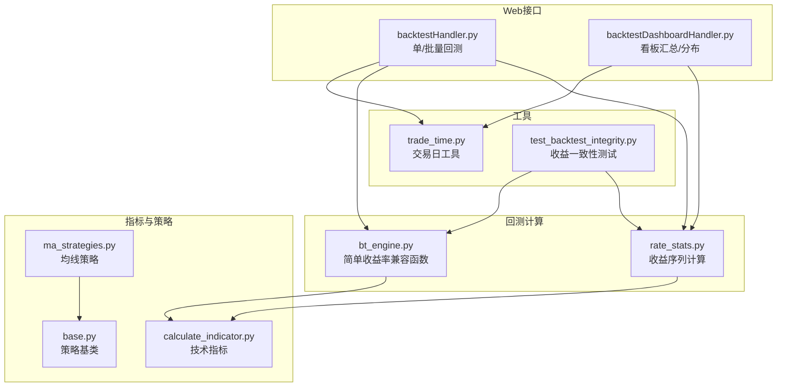
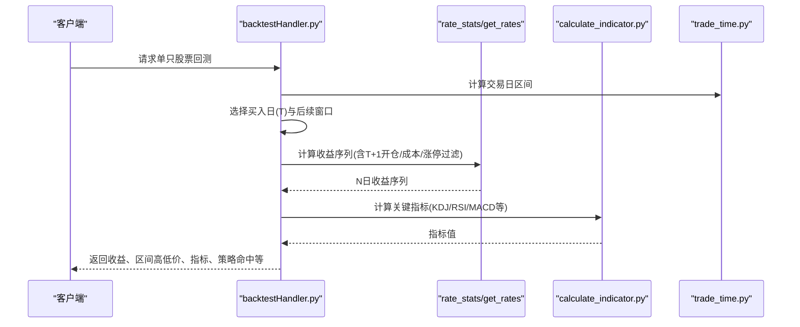
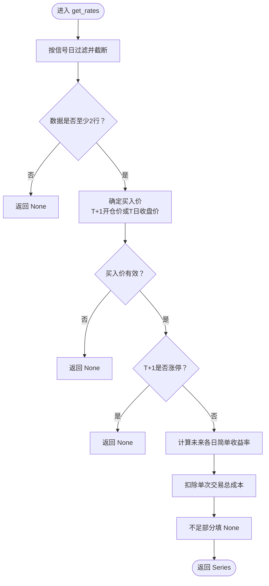
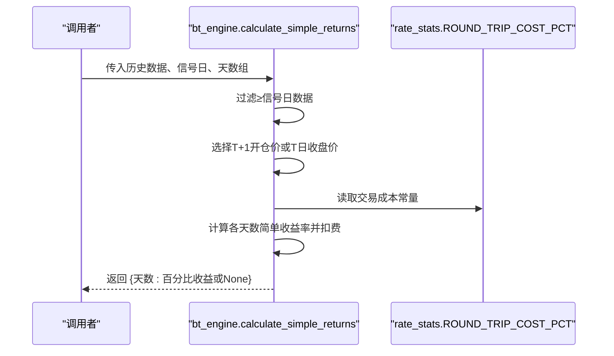
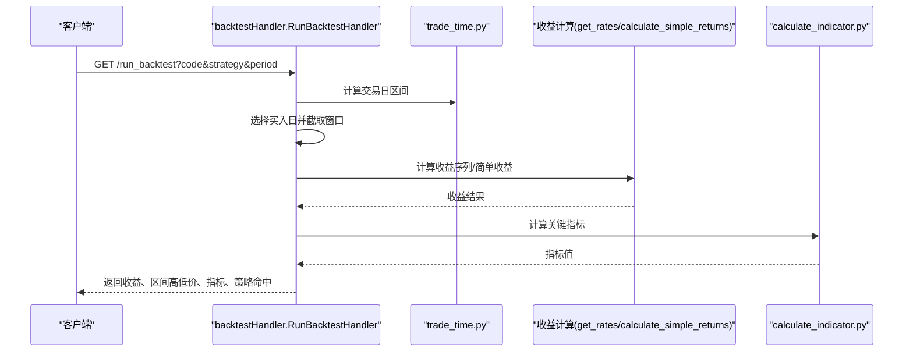
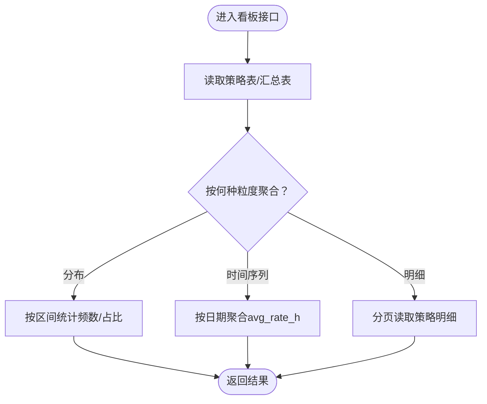
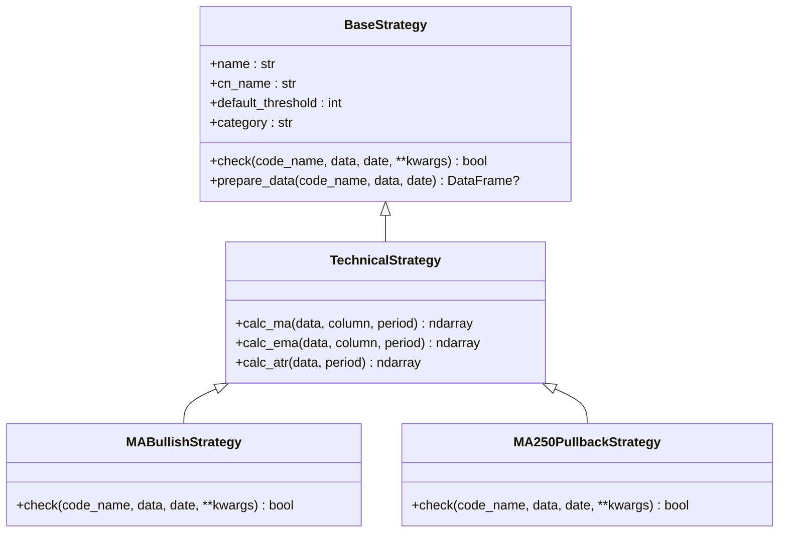
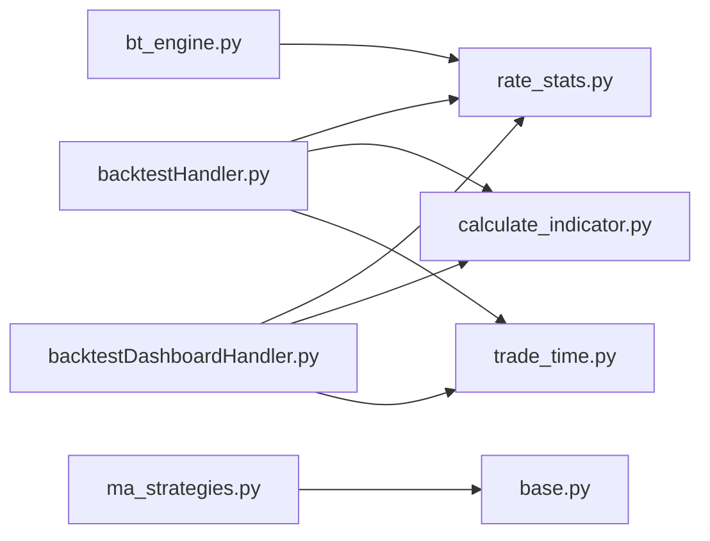

# 收益指标计算

<cite>
**本文引用的文件**
- [rate_stats.py](file://quantia/core/backtest/rate_stats.py)
- [bt_engine.py](file://quantia/core/backtest/bt_engine.py)
- [backtestHandler.py](file://quantia/web/backtestHandler.py)
- [backtestDashboardHandler.py](file://quantia/web/backtestDashboardHandler.py)
- [calculate_indicator.py](file://quantia/core/indicator/calculate_indicator.py)
- [base.py](file://quantia/core/strategy/base.py)
- [ma_strategies.py](file://quantia/core/strategy/technical/ma_strategies.py)
- [trade_time.py](file://quantia/lib/trade_time.py)
- [test_backtest_integrity.py](file://tests/test_backtest_integrity.py)
</cite>

## 目录
1. [简介](#简介)
2. [项目结构](#项目结构)
3. [核心组件](#核心组件)
4. [架构概览](#架构概览)
5. [详细组件分析](#详细组件分析)
6. [依赖关系分析](#依赖关系分析)
7. [性能考虑](#性能考虑)
8. [故障排查指南](#故障排查指南)
9. [结论](#结论)
10. [附录](#附录)

## 简介
本技术文档面向Quantia收益指标计算系统，聚焦于收益率、夏普比率、最大回撤、胜率等核心指标的计算与应用。文档详细解释简单收益率计算函数calculate_simple_returns的实现原理，涵盖T+1开盘价买入机制、交易成本扣除、多天数收益计算；同时提供风险指标评估方法、统计分析工具与数据验证机制，帮助用户准确理解回测结果的各项指标含义与计算逻辑。

## 项目结构
围绕收益指标计算的核心模块包括：
- 回测收益计算：rate_stats.py、bt_engine.py
- Web层回测接口：backtestHandler.py、backtestDashboardHandler.py
- 技术指标计算：calculate_indicator.py
- 策略基类与策略实现：base.py、ma_strategies.py
- 交易时间工具：trade_time.py
- 单元测试：test_backtest_integrity.py

**图表来源**
- [rate_stats.py](file://quantia/core/backtest/rate_stats.py#L34-L108)
- [bt_engine.py](file://quantia/core/backtest/bt_engine.py#L310-L358)
- [backtestHandler.py](file://quantia/web/backtestHandler.py#L166-L290)
- [backtestDashboardHandler.py](file://quantia/web/backtestDashboardHandler.py#L686-L724)
- [calculate_indicator.py](file://quantia/core/indicator/calculate_indicator.py#L23-L407)
- [base.py](file://quantia/core/strategy/base.py#L20-L96)
- [ma_strategies.py](file://quantia/core/strategy/technical/ma_strategies.py#L22-L55)
- [trade_time.py](file://quantia/lib/trade_time.py#L127-L168)
- [test_backtest_integrity.py](file://tests/test_backtest_integrity.py#L156-L359)

**章节来源**
- [rate_stats.py](file://quantia/core/backtest/rate_stats.py#L1-L108)
- [bt_engine.py](file://quantia/core/backtest/bt_engine.py#L1-L388)
- [backtestHandler.py](file://quantia/web/backtestHandler.py#L1-L673)
- [backtestDashboardHandler.py](file://quantia/web/backtestDashboardHandler.py#L1-L906)
- [calculate_indicator.py](file://quantia/core/indicator/calculate_indicator.py#L1-L449)
- [base.py](file://quantia/core/strategy/base.py#L1-L202)
- [ma_strategies.py](file://quantia/core/strategy/technical/ma_strategies.py#L1-L237)
- [trade_time.py](file://quantia/lib/trade_time.py#L1-L224)
- [test_backtest_integrity.py](file://tests/test_backtest_integrity.py#L1-L359)

## 核心组件
- 收益序列计算：get_rates函数，基于T+1开盘价买入、扣除交易成本、过滤涨停/跌停，输出N日收益序列。
- 简单收益率兼容：calculate_simple_returns函数，兼容旧版本逻辑，统一使用T+1开盘价与交易成本。
- Web回测接口：单只股票回测_run_backtest与批量回测_run_batch_backtest，支持区间最高/最低收益（最大回撤）与关键指标提取。
- 看板汇总：回测看板接口提供收益分布直方图、时间序列与策略明细。
- 技术指标：get_indicators提供多指标计算，支撑回测期间的技术状态分析。
- 策略基类：BaseStrategy与TechnicalStrategy为策略扩展提供统一框架。

**章节来源**
- [rate_stats.py](file://quantia/core/backtest/rate_stats.py#L34-L108)
- [bt_engine.py](file://quantia/core/backtest/bt_engine.py#L310-L358)
- [backtestHandler.py](file://quantia/web/backtestHandler.py#L166-L290)
- [backtestDashboardHandler.py](file://quantia/web/backtestDashboardHandler.py#L686-L724)
- [calculate_indicator.py](file://quantia/core/indicator/calculate_indicator.py#L23-L407)
- [base.py](file://quantia/core/strategy/base.py#L20-L96)

## 架构概览
收益指标计算贯穿“数据准备—收益计算—风险评估—可视化”的完整链路。Web层负责接收请求、组织数据与调用回测引擎；回测引擎与收益计算模块负责核心收益与成本处理；指标模块提供技术面辅助；看板模块负责统计与展示。

**图表来源**
- [backtestHandler.py](file://quantia/web/backtestHandler.py#L166-L290)
- [rate_stats.py](file://quantia/core/backtest/rate_stats.py#L34-L108)
- [calculate_indicator.py](file://quantia/core/indicator/calculate_indicator.py#L23-L407)
- [trade_time.py](file://quantia/lib/trade_time.py#L127-L168)

## 详细组件分析

### 组件A：收益序列计算（get_rates）
- 输入：信号日、历史K线（含date/open/close/high/low）、列名模板、最大回测天数阈值
- 核心流程：
  - 过滤≥信号日的数据并截断至阈值
  - 使用T+1开盘价作为买入基准；若无open列则退化为T日收盘价
  - 涨停检测：T+1开盘价相较T日收盘价涨幅≥9.5%则跳过该信号
  - 计算未来各交易日的简单收益率：(close - 买入价)/买入价 × 100
  - 扣除单次交易总成本（约0.20%）
  - 不足部分填充None
- 边界与异常：
  - 数据为空或长度不足返回None
  - 买入价≤0或NaN返回None
  - 涨停无法买入返回None
- 输出：Series，包含date、code与rate_1..rate_N

**图表来源**
- [rate_stats.py](file://quantia/core/backtest/rate_stats.py#L34-L108)

**章节来源**
- [rate_stats.py](file://quantia/core/backtest/rate_stats.py#L34-L108)

### 组件B：简单收益率兼容函数（calculate_simple_returns）
- 功能：兼容旧版本，统一使用T+1开盘价与交易成本，按指定天数组计算收益
- 关键点：
  - 默认天数组：[1, 3, 5, 10, 20, 60]
  - 使用T+1开盘价作为买入价；若无open列则使用T日收盘价
  - 扣除单次交易总成本（约0.20%）
  - 不足天数返回None
- 与get_rates一致性：单元测试验证两者在相同输入下行为一致

**图表来源**
- [bt_engine.py](file://quantia/core/backtest/bt_engine.py#L310-L358)
- [rate_stats.py](file://quantia/core/backtest/rate_stats.py#L24-L31)

**章节来源**
- [bt_engine.py](file://quantia/core/backtest/bt_engine.py#L310-L358)
- [test_backtest_integrity.py](file://tests/test_backtest_integrity.py#L194-L237)

### 组件C：Web回测接口（单只/批量）
- 单只回测_run_backtest：
  - 选择买入日（默认倒数第max_days+1天），确保有足够后续数据
  - 使用T+1开盘价作为买入价，若T+1涨停则返回错误
  - 计算各checkpoint天数的收益（扣费），并统计区间最高/最低收益（最大回撤）
  - 调用策略检测与关键指标计算
- 批量回测_run_batch_backtest：
  - 从策略表读取历史选股记录，或从缓存动态计算
  - 并行处理股票与交易日，聚合日维度统计（成功次数、平均收益、胜率）

**图表来源**
- [backtestHandler.py](file://quantia/web/backtestHandler.py#L166-L290)
- [rate_stats.py](file://quantia/core/backtest/rate_stats.py#L34-L108)
- [calculate_indicator.py](file://quantia/core/indicator/calculate_indicator.py#L23-L407)
- [trade_time.py](file://quantia/lib/trade_time.py#L127-L168)

**章节来源**
- [backtestHandler.py](file://quantia/web/backtestHandler.py#L166-L290)
- [backtestDashboardHandler.py](file://quantia/web/backtestDashboardHandler.py#L292-L611)

### 组件D：看板与统计（收益分布/时间序列/明细）
- 收益分布ReturnDistributionHandler：
  - 读取策略表中rate_h列，按区间统计频数与占比
  - 支持空数据返回空分布
- 时间序列PerformanceTimelineHandler：
  - 按日期聚合avg_rate_h，支持多策略对比
- 策略明细StrategyDetailHandler：
  - 分页读取策略表，返回日期、代码、名称与多天数收益

**图表来源**
- [backtestDashboardHandler.py](file://quantia/web/backtestDashboardHandler.py#L686-L724)
- [backtestDashboardHandler.py](file://quantia/web/backtestDashboardHandler.py#L470-L546)
- [backtestDashboardHandler.py](file://quantia/web/backtestDashboardHandler.py#L550-L636)

**章节来源**
- [backtestDashboardHandler.py](file://quantia/web/backtestDashboardHandler.py#L686-L724)
- [backtestDashboardHandler.py](file://quantia/web/backtestDashboardHandler.py#L470-L546)
- [backtestDashboardHandler.py](file://quantia/web/backtestDashboardHandler.py#L550-L636)

### 组件E：技术指标与策略基类
- 技术指标get_indicators：
  - 使用talib计算MACD/KDJ/RSI/ATR/布林带等，统一NaN/Inf处理
  - 支持阈值截取与时间窗口控制
- 策略基类BaseStrategy：
  - 提供check抽象方法与prepare_data数据准备
  - TechnicalStrategy封装常用均线/ATR计算
- 均线策略示例：
  - MABullishStrategy：MA30持续上行且涨幅>20%
  - MA250PullbackStrategy：突破年线后回踩不破，缩量整理

**图表来源**
- [base.py](file://quantia/core/strategy/base.py#L20-L96)
- [ma_strategies.py](file://quantia/core/strategy/technical/ma_strategies.py#L22-L55)
- [ma_strategies.py](file://quantia/core/strategy/technical/ma_strategies.py#L58-L137)

**章节来源**
- [calculate_indicator.py](file://quantia/core/indicator/calculate_indicator.py#L23-L407)
- [base.py](file://quantia/core/strategy/base.py#L20-L96)
- [ma_strategies.py](file://quantia/core/strategy/technical/ma_strategies.py#L22-L137)

## 依赖关系分析
- 模块耦合：
  - backtestHandler与rate_stats紧密耦合，前者调用后者进行收益序列计算
  - bt_engine与rate_stats共享交易成本常量，保证计算一致性
  - backtestDashboardHandler依赖策略表结构（rate_1..rate_N）进行统计
  - calculate_indicator为回测期间提供技术状态参考
- 外部依赖：
  - pandas/numpy/talib用于数据处理与指标计算
  - backtrader（可选）用于策略回测引擎封装

**图表来源**
- [backtestHandler.py](file://quantia/web/backtestHandler.py#L166-L290)
- [backtestDashboardHandler.py](file://quantia/web/backtestDashboardHandler.py#L292-L611)
- [rate_stats.py](file://quantia/core/backtest/rate_stats.py#L34-L108)
- [bt_engine.py](file://quantia/core/backtest/bt_engine.py#L310-L358)
- [calculate_indicator.py](file://quantia/core/indicator/calculate_indicator.py#L23-L407)
- [ma_strategies.py](file://quantia/core/strategy/technical/ma_strategies.py#L22-L55)
- [base.py](file://quantia/core/strategy/base.py#L20-L96)
- [trade_time.py](file://quantia/lib/trade_time.py#L127-L168)

**章节来源**
- [backtestHandler.py](file://quantia/web/backtestHandler.py#L166-L290)
- [backtestDashboardHandler.py](file://quantia/web/backtestDashboardHandler.py#L292-L611)
- [rate_stats.py](file://quantia/core/backtest/rate_stats.py#L34-L108)
- [bt_engine.py](file://quantia/core/backtest/bt_engine.py#L310-L358)
- [calculate_indicator.py](file://quantia/core/indicator/calculate_indicator.py#L23-L407)
- [ma_strategies.py](file://quantia/core/strategy/technical/ma_strategies.py#L22-L55)
- [base.py](file://quantia/core/strategy/base.py#L20-L96)
- [trade_time.py](file://quantia/lib/trade_time.py#L127-L168)

## 性能考虑
- 数据截断与阈值控制：通过threshold与head截断减少计算量，避免全量历史数据带来的内存与CPU压力
- 并行批处理：批量回测使用线程池并发处理股票，提升吞吐
- 指标计算优化：统一NaN/Inf处理，避免无效计算传播
- 交易成本常量化：在多个模块共享常量，减少重复计算与不一致

[本节为通用指导，无需特定文件引用]

## 故障排查指南
- 涨停无法买入：T+1开盘价相较T日收盘价涨幅≥9.5%时返回None或错误提示
- 数据不足：信号日之后数据不足两行时返回None
- 买入价异常：买入价≤0或NaN时返回None
- 收益一致性：单元测试验证get_rates与calculate_simple_returns在相同输入下的数值一致性
- 看板无数据：策略表无回测数据时返回空分布或空结果，属正常情况

**章节来源**
- [rate_stats.py](file://quantia/core/backtest/rate_stats.py#L70-L86)
- [backtestHandler.py](file://quantia/web/backtestHandler.py#L222-L233)
- [test_backtest_integrity.py](file://tests/test_backtest_integrity.py#L156-L192)

## 结论
Quantia收益指标计算系统以T+1开盘价买入机制为核心，结合交易成本扣除与涨停过滤，形成贴近真实的收益序列。通过Web层接口与看板模块，系统实现了从单只股票到批量策略的全面回测与统计分析。技术指标模块与策略基类为系统提供了强大的扩展能力。建议在生产环境中：
- 明确交易成本参数并保持跨模块一致
- 使用阈值与截断策略控制回测窗口
- 利用看板模块进行策略对比与收益分布分析
- 在策略扩展时遵循BaseStrategy接口规范

[本节为总结性内容，无需特定文件引用]

## 附录

### 数学公式与边界说明
- 简单收益率（未扣费）：$ \text{rate}_d = \frac{\text{close}[T+d] - \text{buy\_price}}{\text{buy\_price}} \times 100\% $
- 扣费后收益：$ \text{net\_rate}_d = \text{rate}_d - \text{ROUND\_TRIP\_COST\_PCT} $（约0.20%）
- 区间最高/最低收益（最大回撤参考）：$ \text{max\_return} = \max(\text{rate}) - \text{ROUND\_TRIP\_COST\_PCT} $，$ \text{max\_drawdown} = \min(\text{rate}) $

**章节来源**
- [rate_stats.py](file://quantia/core/backtest/rate_stats.py#L88-L94)
- [backtestHandler.py](file://quantia/web/backtestHandler.py#L253-L261)
