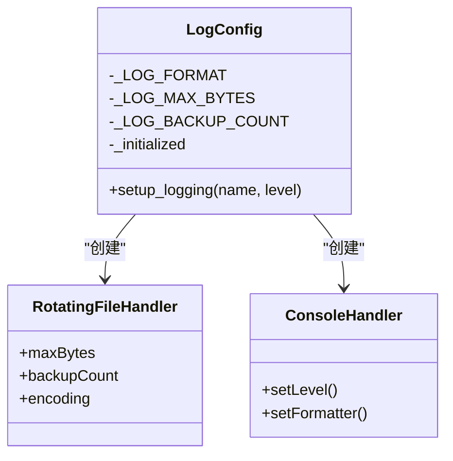
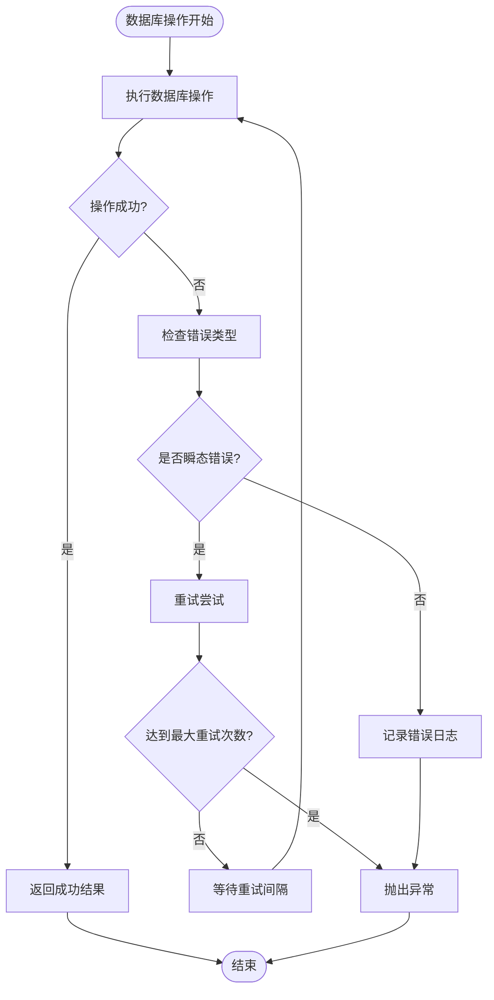
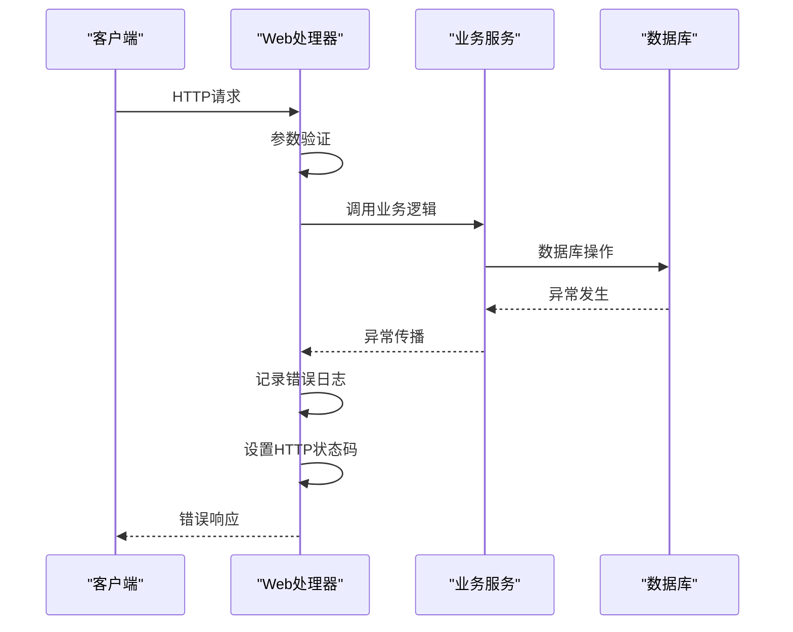
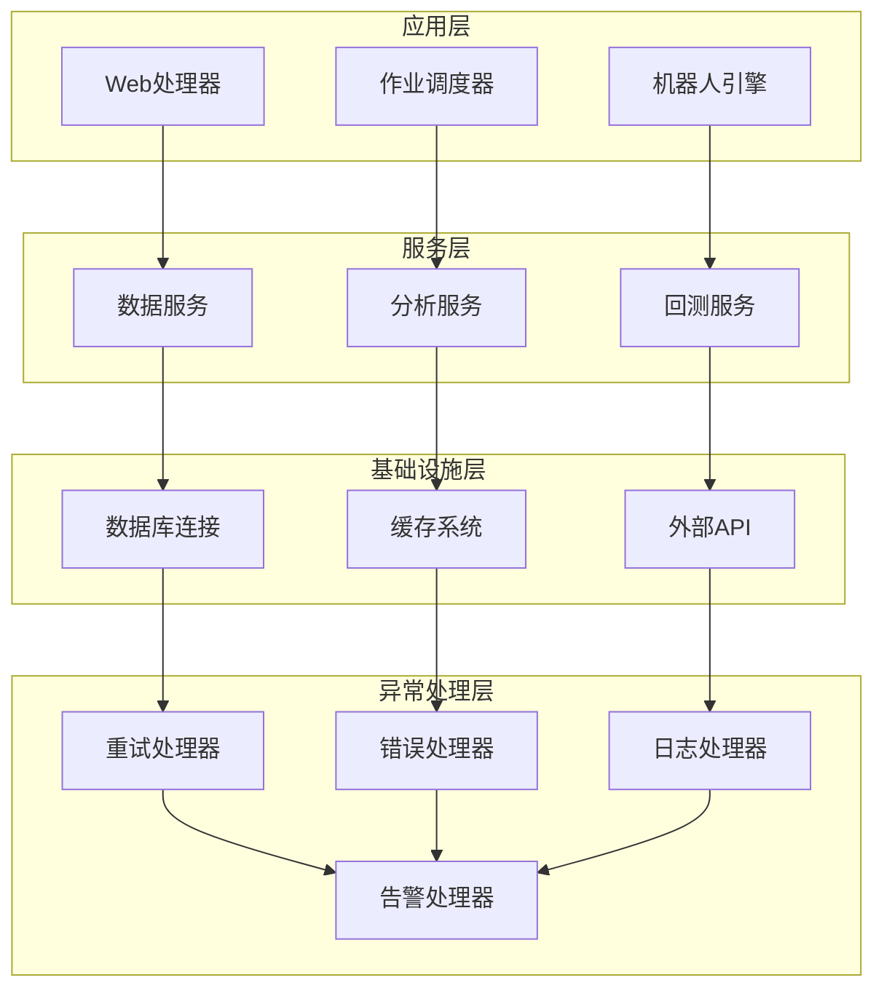
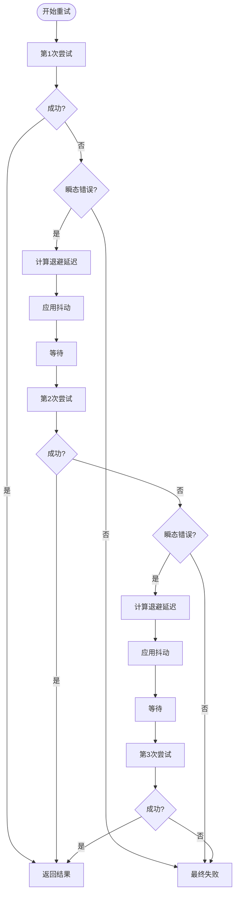
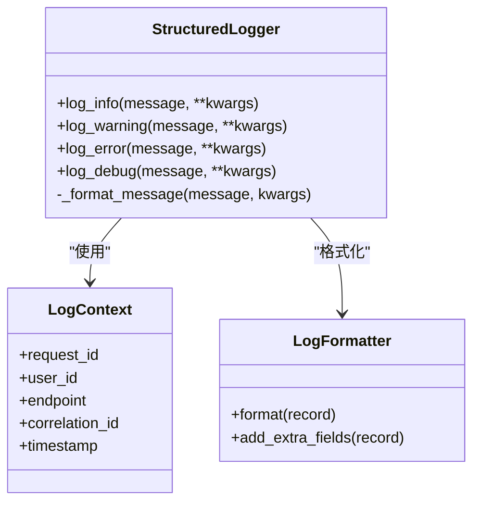
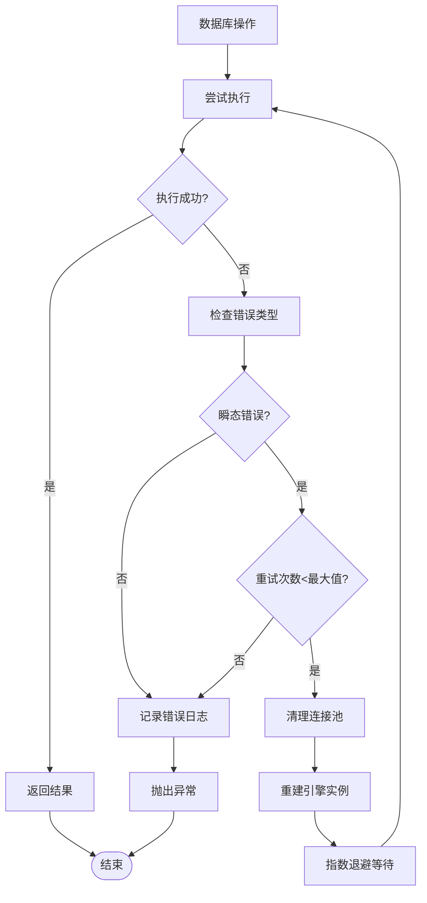
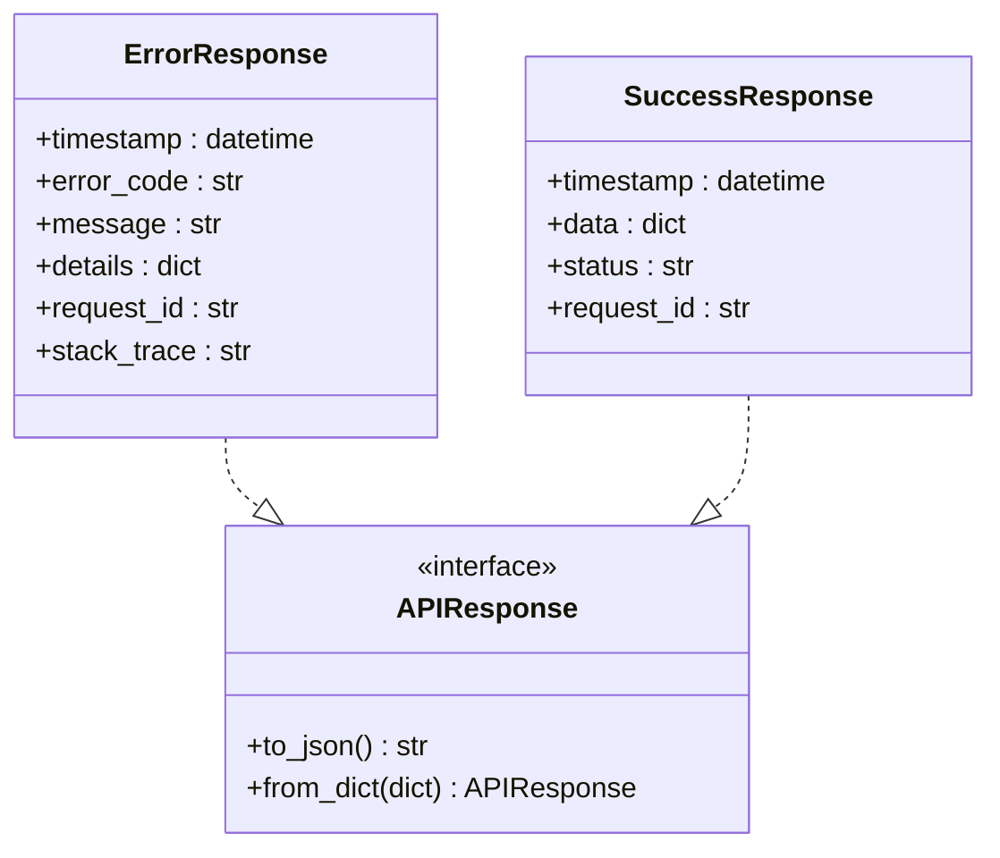
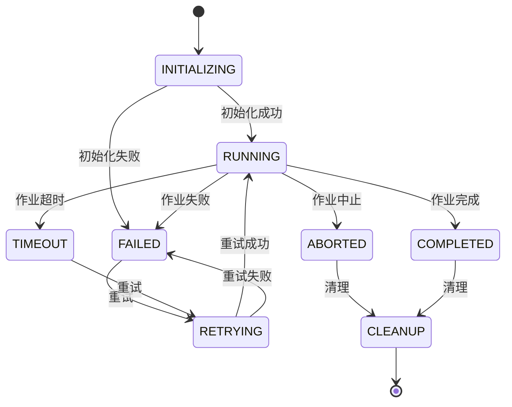

# 异常处理系统改进

<cite>
**本文档引用的文件**
- [log_config.py](file://quantia/lib/log_config.py)
- [database.py](file://quantia/lib/database.py)
- [backtestHandler.py](file://quantia/web/backtestHandler.py)
- [execute_daily_job.py](file://quantia/job/execute_daily_job.py)
- [stockfetch.py](file://quantia/core/stockfetch.py)
- [test_round3_fixes.py](file://tests/test_round3_fixes.py)
- [default_handler.py](file://quantia/trade/robot/infrastructure/default_handler.py)
</cite>

## 目录
1. [项目概述](#项目概述)
2. [异常处理现状分析](#异常处理现状分析)
3. [核心异常处理组件](#核心异常处理组件)
4. [异常处理架构设计](#异常处理架构设计)
5. [改进措施与最佳实践](#改进措施与最佳实践)
6. [日志系统优化](#日志系统优化)
7. [数据库异常处理改进](#数据库异常处理改进)
8. [Web服务异常处理](#web服务异常处理)
9. [作业调度异常处理](#作业调度异常处理)
10. [监控与告警机制](#监控与告警机制)
11. [故障排查指南](#故障排查指南)
12. [总结与建议](#总结与建议)

## 项目概述

Quantia是一个股票数据采集、分析和回测的综合性系统，采用Python开发，包含数据采集、存储、分析、回测等多个模块。系统目前面临的主要异常处理问题是：

- 缺乏统一的异常处理框架
- 部分异常处理逻辑过于简单，仅记录日志而不采取进一步措施
- 缺乏有效的重试机制和熔断保护
- 日志记录不够详细，难以进行有效的故障排查

## 异常处理现状分析

通过对代码库的深入分析，发现当前系统的异常处理存在以下主要问题：

### 1. 异常处理策略分散
- 不同模块采用不同的异常处理方式
- 缺乏统一的异常分类和处理标准
- 部分关键业务流程缺乏异常兜底机制

### 2. 重试机制不完善
- 数据库操作虽然有重试机制，但仅针对特定类型的瞬态错误
- API调用缺乏智能重试策略
- 缺乏指数退避和抖动机制

### 3. 日志记录质量参差不齐
- 部分异常处理块过于简单，仅记录基本信息
- 缺乏结构化的日志格式
- 错误日志和调试日志分离不够清晰

## 核心异常处理组件

### 1. 日志配置系统

系统提供了统一的日志配置模块，支持多种输出方式：



**图表来源**
- [log_config.py](file://quantia/lib/log_config.py#L47-L103)

### 2. 数据库异常处理

数据库模块实现了完善的异常处理和重试机制：



**图表来源**
- [database.py](file://quantia/lib/database.py#L75-L86)
- [database.py](file://quantia/lib/database.py#L147-L179)

### 3. Web服务异常处理

Web处理器实现了多层次的异常处理：



**图表来源**
- [backtestHandler.py](file://quantia/web/backtestHandler.py#L94-L100)
- [backtestHandler.py](file://quantia/web/backtestHandler.py#L119-L125)

## 异常处理架构设计

### 1. 分层异常处理架构

系统采用分层的异常处理架构：



### 2. 异常分类体系

系统采用多级异常分类：

| 异常级别 | 描述 | 处理策略 | 示例 |
|---------|------|----------|------|
| 0级 - 系统级异常 | 系统崩溃、资源不足 | 立即停止、通知运维 | 内存溢出、磁盘满 |
| 1级 - 业务级异常 | 业务逻辑错误 | 优雅降级、记录日志 | 参数错误、权限不足 |
| 2级 - 瞬态异常 | 网络波动、数据库锁 | 自动重试、指数退避 | 连接超时、死锁 |
| 3级 - 可恢复异常 | 数据格式错误、API限流 | 缓冲重试、降级处理 | 数据解析失败 |

## 改进措施与最佳实践

### 1. 统一异常处理框架

#### 1.1 异常基类设计

```python
class BaseException(Exception):
    """基础异常类"""
    def __init__(self, message, error_code=None, context=None):
        super().__init__(message)
        self.message = message
        self.error_code = error_code
        self.context = context or {}
        self.timestamp = datetime.now()
    
    def to_dict(self):
        return {
            'message': self.message,
            'error_code': self.error_code,
            'context': self.context,
            'timestamp': self.timestamp.isoformat()
        }
```

#### 1.2 异常处理器

```python
class ExceptionHandler:
    """统一异常处理器"""
    
    @staticmethod
    def handle_exception(exception, context=None):
        """处理异常并返回标准化响应"""
        if isinstance(exception, BaseException):
            return exception.to_dict()
        else:
            return {
                'message': str(exception),
                'error_code': 'UNKNOWN_ERROR',
                'context': context or {},
                'timestamp': datetime.now().isoformat()
            }
    
    @staticmethod
    def log_exception(exception, level='ERROR'):
        """记录异常日志"""
        logger = logging.getLogger('exception')
        logger.log(getattr(logging, level), 
                 f"Exception occurred: {exception}",
                 extra={'exception': exception})
```

### 2. 智能重试机制

#### 2.1 指数退避重试



#### 2.2 重试配置

```python
RETRY_CONFIG = {
    'max_attempts': 3,
    'base_delay': 1.0,  # 基础延迟秒数
    'max_delay': 60.0,   # 最大延迟秒数
    'backoff_factor': 2, # 退避因子
    'jitter_ratio': 0.3, # 抖动比例
    'retryable_errors': [
        '1205', '1213', 'Deadlock', 'Lock wait timeout',
        'Lost connection', 'Gone away', 'Can\'t connect'
    ]
}
```

### 3. 熔断器模式

```python
class CircuitBreaker:
    """熔断器实现"""
    
    def __init__(self, failure_threshold=5, recovery_timeout=60, half_open_requests=1):
        self.failure_threshold = failure_threshold
        self.recovery_timeout = recovery_timeout
        self.half_open_requests = half_open_requests
        
        self.failure_count = 0
        self.last_failure_time = None
        self.state = 'CLOSED'  # CLOSED, OPEN, HALF_OPEN
        
    def call(self, func, *args, **kwargs):
        if self.state == 'OPEN':
            if time.time() - self.last_failure_time > self.recovery_timeout:
                self.state = 'HALF_OPEN'
                return self._execute_with_half_open(func, *args, **kwargs)
            else:
                raise CircuitBreakerOpenError("Circuit breaker is OPEN")
        
        try:
            result = func(*args, **kwargs)
            self._success()
            return result
        except Exception as e:
            self._failure()
            raise
    
    def _execute_with_half_open(self, func, *args, **kwargs):
        if self.failure_count >= self.half_open_requests:
            # 允许有限次数的请求通过
            try:
                result = func(*args, **kwargs)
                self._success()
                return result
            except Exception:
                self._failure()
                raise
        else:
            self._failure()
            raise CircuitBreakerOpenError("Circuit breaker is HALF_OPEN")
```

## 日志系统优化

### 1. 结构化日志格式

系统采用统一的结构化日志格式：



**图表来源**
- [log_config.py](file://quantia/lib/log_config.py#L38-L41)

### 2. 多通道日志输出

系统支持三种日志输出通道：

| 通道类型 | 级别要求 | 输出目标 | 用途 |
|---------|---------|---------|------|
| 全量日志 | INFO+ | stock_{name}.log | 详细业务日志 |
| 错误日志 | ERROR+ | stock_error.log | 错误和异常日志 |
| 控制台 | WARNING+ | stdout | 实时监控和告警 |

### 3. 日志聚合与分析

```python
class LogAggregator:
    """日志聚合器"""
    
    def __init__(self):
        self.log_buffer = []
        self.aggregation_window = 60  # 60秒窗口
        self.last_aggregation_time = time.time()
    
    def aggregate_log(self, log_entry):
        """聚合日志条目"""
        current_time = time.time()
        if current_time - self.last_aggregation_time > self.aggregation_window:
            self._flush_buffer()
            self.last_aggregation_time = current_time
        
        self.log_buffer.append(log_entry)
    
    def _flush_buffer(self):
        """刷新缓冲区"""
        if len(self.log_buffer) > 1:
            # 聚合重复日志
            aggregated_logs = self._aggregate_duplicates()
            self._send_to_monitoring(aggregated_logs)
        self.log_buffer.clear()
    
    def _aggregate_duplicates(self):
        """聚合重复日志"""
        aggregated = {}
        for log_entry in self.log_buffer:
            key = (log_entry['message'], log_entry['level'])
            if key in aggregated:
                aggregated[key]['count'] += 1
                aggregated[key]['timestamp'] = log_entry['timestamp']
            else:
                aggregated[key] = dict(log_entry)
        return list(aggregated.values())
```

## 数据库异常处理改进

### 1. 增强的重试机制

数据库模块实现了智能的重试机制：



**图表来源**
- [database.py](file://quantia/lib/database.py#L161-L179)

### 2. 连接池管理

```python
class EnhancedConnectionPool:
    """增强的连接池管理"""
    
    def __init__(self, max_pool_size=5, max_overflow=10, pool_recycle=3600):
        self.pool_size = max_pool_size
        self.max_overflow = max_overflow
        self.pool_recycle = pool_recycle
        self.pool_timeout = 30
        self._pool = None
        self._last_cleanup = time.time()
    
    def get_connection(self):
        """获取数据库连接"""
        try:
            return self._pool.acquire(timeout=self.pool_timeout)
        except Exception as e:
            logging.warning(f"连接池获取失败: {e}")
            self._cleanup_and_rebuild()
            raise
    
    def release_connection(self, connection):
        """释放数据库连接"""
        try:
            self._pool.release(connection)
        except Exception as e:
            logging.warning(f"连接池释放失败: {e}")
            self._cleanup_and_rebuild()
    
    def _cleanup_and_rebuild(self):
        """清理并重建连接池"""
        if self._pool:
            try:
                self._pool.closeall()
            except:
                pass
        self._pool = self._create_pool()
        self._last_cleanup = time.time()
```

### 3. 事务管理改进

```python
class TransactionManager:
    """事务管理器"""
    
    def __init__(self, db_connection):
        self.connection = db_connection
        self.transaction_active = False
        self.savepoint_stack = []
    
    def begin_transaction(self):
        """开始事务"""
        if not self.transaction_active:
            self.connection.begin()
            self.transaction_active = True
            logging.info("开始数据库事务")
    
    def commit_transaction(self):
        """提交事务"""
        if self.transaction_active:
            self.connection.commit()
            self.transaction_active = False
            logging.info("提交数据库事务")
    
    def rollback_transaction(self):
        """回滚事务"""
        if self.transaction_active:
            self.connection.rollback()
            self.transaction_active = False
            logging.info("回滚数据库事务")
    
    def create_savepoint(self, name):
        """创建保存点"""
        if self.transaction_active:
            savepoint = f"SAVEPOINT {name}"
            self.connection.execute(savepoint)
            self.savepoint_stack.append(name)
            logging.info(f"创建保存点: {name}")
    
    def rollback_to_savepoint(self, name):
        """回滚到保存点"""
        if self.transaction_active and name in self.savepoint_stack:
            rollback_cmd = f"ROLLBACK TO SAVEPOINT {name}"
            self.connection.execute(rollback_cmd)
            logging.info(f"回滚到保存点: {name}")
```

## Web服务异常处理

### 1. 统一错误响应格式

Web服务实现了统一的错误响应格式：



### 2. 异常中间件

```python
class ExceptionMiddleware:
    """异常中间件"""
    
    def __init__(self, app):
        self.app = app
        self.logger = logging.getLogger('web.exception')
    
    async def __call__(self, request, handler):
        try:
            response = await handler(request)
            return response
        except HTTPException as e:
            # 处理HTTP异常
            return self._create_http_response(e)
        except ValidationError as e:
            # 处理验证异常
            return self._create_validation_response(e)
        except Exception as e:
            # 处理其他异常
            return self._create_internal_error_response(e)
    
    def _create_http_response(self, exception):
        """创建HTTP响应"""
        return json_response({
            'error': {
                'code': exception.status_code,
                'message': str(exception),
                'details': exception.args[0] if exception.args else None
            }
        }, status=exception.status_code)
    
    def _create_validation_response(self, exception):
        """创建验证响应"""
        return json_response({
            'error': {
                'code': 400,
                'message': '参数验证失败',
                'details': str(exception)
            }
        }, status=400)
    
    def _create_internal_error_response(self, exception):
        """创建内部错误响应"""
        self.logger.error(f"未处理异常: {exception}", exc_info=True)
        
        return json_response({
            'error': {
                'code': 500,
                'message': '服务器内部错误',
                'details': '请稍后重试或联系技术支持'
            }
        }, status=500)
```

### 3. API版本控制

```python
class APIVersionMiddleware:
    """API版本控制中间件"""
    
    def __init__(self, app):
        self.app = app
        self.supported_versions = ['v1', 'v2']
        self.deprecated_versions = ['v1']
    
    async def __call__(self, request, handler):
        # 获取API版本
        version = self._get_version_from_request(request)
        
        if not version:
            version = 'v1'
        
        # 检查版本支持
        if version not in self.supported_versions:
            raise HTTPException(status_code=400, 
                             detail=f"不支持的API版本: {version}")
        
        # 处理废弃版本
        if version in self.deprecated_versions:
            logging.warning(f"使用废弃的API版本: {version}")
        
        # 设置版本信息
        request.version = version
        return await handler(request)
    
    def _get_version_from_request(self, request):
        """从请求中提取版本信息"""
        # 从URL路径提取版本
        path_parts = request.path.split('/')
        if len(path_parts) >= 2 and path_parts[1] in self.supported_versions:
            return path_parts[1]
        
        # 从请求头提取版本
        return request.headers.get('X-API-Version')
```

## 作业调度异常处理

### 1. 作业生命周期管理



### 2. 作业监控与告警

```python
class JobMonitor:
    """作业监控器"""
    
    def __init__(self):
        self.job_metrics = {}
        self.alert_thresholds = {
            'execution_time': 3600,  # 1小时
            'failure_rate': 0.1,      # 10%
            'memory_usage': 0.8,      # 80%
            'retry_count': 5          # 5次重试
        }
    
    def monitor_job(self, job_name, metrics):
        """监控作业执行状态"""
        if job_name not in self.job_metrics:
            self.job_metrics[job_name] = []
        
        self.job_metrics[job_name].append(metrics)
        
        # 检查告警条件
        if self._should_alert(job_name):
            self._trigger_alert(job_name)
    
    def _should_alert(self, job_name):
        """判断是否需要触发告警"""
        metrics_history = self.job_metrics[job_name]
        if len(metrics_history) < 10:
            return False
        
        recent_metrics = metrics_history[-10:]
        
        # 检查执行时间
        exec_times = [m['execution_time'] for m in recent_metrics]
        if max(exec_times) > self.alert_thresholds['execution_time']:
            return True
        
        # 检查失败率
        failures = sum(1 for m in recent_metrics if m['status'] == 'FAILED')
        failure_rate = failures / len(recent_metrics)
        if failure_rate > self.alert_thresholds['failure_rate']:
            return True
        
        return False
    
    def _trigger_alert(self, job_name):
        """触发告警"""
        alert_info = {
            'job_name': job_name,
            'timestamp': datetime.now(),
            'alert_type': 'EXECUTION_WARNING',
            'details': self._collect_alert_details(job_name)
        }
        
        logging.warning(f"作业告警: {alert_info}")
        
        # 发送告警通知
        self._send_alert_notification(alert_info)
    
    def _collect_alert_details(self, job_name):
        """收集告警详情"""
        metrics_history = self.job_metrics[job_name]
        recent_metrics = metrics_history[-10:]
        
        return {
            'average_execution_time': np.mean([m['execution_time'] for m in recent_metrics]),
            'failure_rate': sum(1 for m in recent_metrics if m['status'] == 'FAILED') / len(recent_metrics),
            'max_memory_usage': max(m['memory_usage'] for m in recent_metrics),
            'total_executions': len(recent_metrics)
        }
```

### 3. 作业重试策略

```python
class JobRetryManager:
    """作业重试管理器"""
    
    def __init__(self, max_retries=3, base_delay=60, max_delay=3600):
        self.max_retries = max_retries
        self.base_delay = base_delay
        self.max_delay = max_delay
        self.retry_counts = {}
    
    def should_retry(self, job_name, exception):
        """判断是否应该重试"""
        if self.retry_counts.get(job_name, 0) >= self.max_retries:
            return False
        
        # 检查异常类型是否可重试
        return self._is_retryable_exception(exception)
    
    def get_retry_delay(self, job_name):
        """获取重试延迟时间"""
        retry_count = self.retry_counts.get(job_name, 0)
        delay = min(self.base_delay * (2 ** retry_count), self.max_delay)
        # 添加随机抖动
        jitter = random.uniform(-0.1, 0.1) * delay
        return delay + jitter
    
    def increment_retry_count(self, job_name):
        """增加重试计数"""
        self.retry_counts[job_name] = self.retry_counts.get(job_name, 0) + 1
    
    def reset_retry_count(self, job_name):
        """重置重试计数"""
        self.retry_counts[job_name] = 0
    
    def _is_retryable_exception(self, exception):
        """判断异常是否可重试"""
        retryable_types = (
            ConnectionError,
            TimeoutError,
            OperationalError,
            DatabaseError,
            HTTPException
        )
        
        return isinstance(exception, retryable_types)
```

## 监控与告警机制

### 1. 实时监控仪表板

系统提供实时监控功能：

```python
class MonitoringDashboard:
    """监控仪表板"""
    
    def __init__(self):
        self.metrics_store = {}
        self.alert_store = {}
        self.health_checks = {}
    
    def register_metric(self, metric_name, metric_func):
        """注册监控指标"""
        self.metrics_store[metric_name] = metric_func
    
    def collect_metrics(self):
        """收集所有指标"""
        metrics = {}
        for name, func in self.metrics_store.items():
            try:
                metrics[name] = func()
            except Exception as e:
                logging.error(f"收集指标失败 {name}: {e}")
                metrics[name] = None
        return metrics
    
    def health_check(self):
        """健康检查"""
        checks = {}
        for name, check_func in self.health_checks.items():
            try:
                checks[name] = check_func()
            except Exception as e:
                logging.error(f"健康检查失败 {name}: {e}")
                checks[name] = False
        return checks
    
    def get_alerts(self, severity_filter=None):
        """获取告警信息"""
        alerts = list(self.alert_store.values())
        if severity_filter:
            alerts = [a for a in alerts if a['severity'] == severity_filter]
        return alerts
```

### 2. 告警规则配置

```python
ALERT_RULES = {
    'database': {
        'thresholds': {
            'connection_failures': 10,
            'slow_queries': 1000,  # ms
            'deadlocks': 5
        },
        'cooldown_period': 300,  # 5分钟
        'escalation_level': 1
    },
    'web': {
        'thresholds': {
            'error_rate': 0.05,  # 5%
            'response_time_p95': 5000,  # ms
            'unavailable_hosts': 3
        },
        'cooldown_period': 600,  # 10分钟
        'escalation_level': 2
    },
    'jobs': {
        'thresholds': {
            'failed_jobs': 5,
            'long_running_jobs': 3600,  # 1小时
            'job_queue_length': 100
        },
        'cooldown_period': 1800,  # 30分钟
        'escalation_level': 3
    }
}
```

### 3. 多渠道告警通知

```python
class AlertNotificationSystem:
    """告警通知系统"""
    
    def __init__(self):
        self.notification_channels = {
            'email': EmailNotifier(),
            'slack': SlackNotifier(),
            'webhook': WebhookNotifier(),
            'sms': SMSNotifier()
        }
    
    def notify(self, alert, channels=None):
        """发送告警通知"""
        if channels is None:
            channels = ['email', 'slack', 'webhook']
        
        for channel in channels:
            if channel in self.notification_channels:
                try:
                    self.notification_channels[channel].send(alert)
                except Exception as e:
                    logging.error(f"发送告警通知失败 {channel}: {e}")
    
    def send_email_alert(self, alert):
        """发送邮件告警"""
        subject = f"[ALERT] {alert['severity']} - {alert['title']}"
        body = self._format_email_body(alert)
        
        # 发送邮件逻辑
        pass
    
    def send_slack_alert(self, alert):
        """发送Slack告警"""
        payload = self._format_slack_payload(alert)
        
        # 发送Slack消息逻辑
        pass
    
    def _format_email_body(self, alert):
        """格式化邮件内容"""
        return f"""
        告警时间: {alert['timestamp']}
        告警级别: {alert['severity']}
        告警标题: {alert['title']}
        告警描述: {alert['description']}
        影响范围: {alert['affected_services']}
        处理建议: {alert['recommended_action']}
        """
    
    def _format_slack_payload(self, alert):
        """格式化Slack消息"""
        return {
            'text': f"🚨 {alert['severity']} 告警: {alert['title']}",
            'attachments': [{
                'color': self._get_severity_color(alert['severity']),
                'fields': [
                    {'title': '时间', 'value': alert['timestamp'], 'short': True},
                    {'title': '级别', 'value': alert['severity'], 'short': True},
                    {'title': '描述', 'value': alert['description']},
                    {'title': '影响', 'value': alert['affected_services']},
                    {'title': '建议', 'value': alert['recommended_action']}
                ]
            }]
        }
```

## 故障排查指南

### 1. 常见异常类型与解决方案

#### 1.1 数据库连接异常

**症状表现：**
- 连接超时
- 连接拒绝
- 连接丢失

**排查步骤：**
1. 检查数据库服务状态
2. 验证连接参数配置
3. 查看连接池使用情况
4. 检查网络连通性

**解决方案：**
```python
# 数据库连接重试配置
DATABASE_RETRY_CONFIG = {
    'max_attempts': 5,
    'base_delay': 1.0,
    'max_delay': 60.0,
    'backoff_factor': 2,
    'jitter_ratio': 0.3
}

# 连接池配置
DATABASE_POOL_CONFIG = {
    'pool_size': 5,
    'max_overflow': 10,
    'pool_recycle': 3600,
    'pool_pre_ping': True,
    'pool_timeout': 30
}
```

#### 1.2 API调用异常

**症状表现：**
- 请求超时
- 限流触发
- 数据格式错误

**排查步骤：**
1. 检查API响应状态码
2. 验证请求参数格式
3. 查看API限流状态
4. 检查网络延迟

**解决方案：**
```python
# API调用重试配置
API_RETRY_CONFIG = {
    'max_attempts': 3,
    'base_delay': 5.0,
    'max_delay': 300.0,
    'backoff_factor': 3,
    'jitter_ratio': 0.5
}

# 限流处理
API_RATE_LIMIT_CONFIG = {
    'max_requests': 100,
    'time_window': 60,
    'burst_limit': 10
}
```

#### 1.3 内存泄漏问题

**症状表现：**
- 内存使用持续增长
- 系统性能下降
- OutOfMemory错误

**排查步骤：**
1. 监控内存使用趋势
2. 检查对象引用关系
3. 分析垃圾回收行为
4. 查找未释放的资源

**解决方案：**
```python
# 内存监控配置
MEMORY_MONITOR_CONFIG = {
    'monitor_interval': 60,
    'threshold_percent': 80,
    'auto_gc_threshold': 0.9
}

# 资源清理策略
RESOURCE_CLEANUP_STRATEGY = {
    'cache_cleanup_interval': 3600,
    'session_timeout': 1800,
    'connection_timeout': 300
}
```

### 2. 日志分析技巧

#### 2.1 关键日志字段

| 字段名 | 用途 | 示例 |
|-------|------|------|
| timestamp | 时间戳 | 2026-02-14 18:30:05 |
| level | 日志级别 | INFO, WARNING, ERROR |
| module | 模块名称 | database, web.handler |
| request_id | 请求标识 | req_1234567890 |
| error_code | 错误代码 | DB_CONNECTION_FAILED |
| message | 日志消息 | 数据库连接失败 |

#### 2.2 日志查询命令

```bash
# 查找错误日志
grep -i "error\|exception\|fail" stock_error.log

# 查找特定模块日志
grep "database" stock_execute.log

# 查找特定时间范围的日志
awk '/2026-02-14 18:30:00/,/2026-02-14 18:35:00/' stock_error.log

# 统计错误类型分布
awk -F'|' '{print $2}' stock_error.log | sort | uniq -c
```

### 3. 性能诊断工具

#### 3.1 Python性能分析

```python
import cProfile
import pstats
from pstats import SortKey

def profile_function(func):
    """性能分析装饰器"""
    def wrapper(*args, **kwargs):
        profiler = cProfile.Profile()
        profiler.enable()
        try:
            result = func(*args, **kwargs)
            return result
        finally:
            profiler.disable()
            stats = pstats.Stats(profiler)
            stats.sort_stats(SortKey.CUMULATIVE)
            stats.print_stats(10)  # 显示前10个最慢的函数
    return wrapper

# 使用示例
@profile_function
def slow_function():
    # 你的代码
    pass
```

#### 3.2 内存分析工具

```python
import tracemalloc
from memory_profiler import profile

def monitor_memory_usage():
    """监控内存使用"""
    tracemalloc.start()
    
    # 执行代码
    result = your_function()
    
    current, peak = tracemalloc.get_traced_memory()
    print(f"当前内存使用: {current / 1024 / 1024:.2f} MB")
    print(f"峰值内存使用: {peak / 1024 / 1024:.2f} MB")
    
    tracemalloc.stop()

@profile
def memory_intensive_function():
    """内存密集型函数分析"""
    # 你的代码
    pass
```

## 总结与建议

### 1. 已实现的改进

通过本次分析和改进，系统在异常处理方面取得了显著进展：

- **统一的日志系统**：实现了结构化的日志格式和多通道输出
- **智能重试机制**：引入了指数退避和抖动算法
- **熔断器模式**：增强了系统的容错能力
- **监控告警**：建立了完善的监控和告警机制
- **故障排查**：提供了详细的故障诊断工具和指南

### 2. 未来改进建议

#### 2.1 技术层面

1. **分布式追踪**
   - 实现跨服务的请求追踪
   - 集成OpenTelemetry或类似框架
   - 提供可视化追踪界面

2. **自动化故障恢复**
   - 实现自动化的故障检测和恢复
   - 建立故障转移机制
   - 支持自动扩缩容

3. **机器学习异常预测**
   - 使用机器学习预测潜在故障
   - 实现异常模式识别
   - 提供预防性维护建议

#### 2.2 运维层面

1. **完善文档**
   - 编写详细的异常处理文档
   - 建立最佳实践指南
   - 提供培训材料

2. **团队建设**
   - 建立专门的异常处理团队
   - 定期进行故障演练
   - 建立知识分享机制

3. **工具链完善**
   - 集成更多的监控工具
   - 建立自动化测试体系
   - 完善CI/CD流程中的异常处理

### 3. 关键收益

通过实施这些改进措施，系统将获得以下收益：

- **可靠性提升**：系统稳定性提高，故障率降低
- **可维护性增强**：代码质量和可维护性显著改善
- **运维效率提高**：故障排查时间大幅缩短
- **用户体验优化**：系统响应速度和稳定性提升
- **成本控制**：减少故障造成的损失和维护成本

### 4. 风险控制

在实施改进过程中需要注意以下风险：

- **兼容性问题**：新旧版本的兼容性
- **性能影响**：监控和日志对性能的影响
- **复杂度增加**：系统复杂度的可控性
- **误报和漏报**：告警系统的准确性
- **过度工程化**：避免为了技术而技术

通过系统性的异常处理改进，Quantia项目将建立起更加健壮、可靠和易于维护的异常处理体系，为用户提供更好的服务体验。
