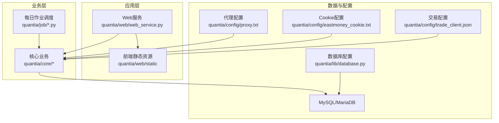
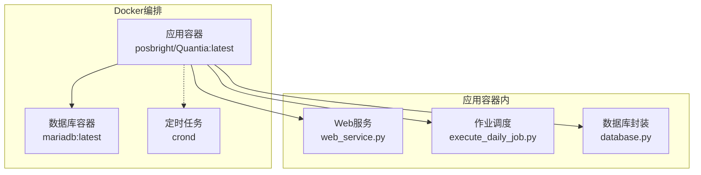
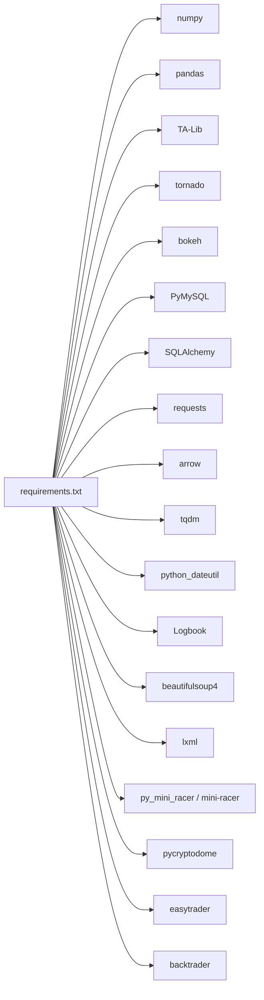

# 快速开始

<cite>
**本文引用的文件**   
- [README.md](file://README.md)
- [QUICKSTART.md](file://QUICKSTART.md)
- [requirements.txt](file://requirements.txt)
- [Dockerfile](file://docker/Dockerfile)
- [docker-compose.yml](file://docker/docker-compose.yml)
- [init_database.sql](file://docker/init_database.sql)
- [database.py](file://docker/stock/quantia/lib/database.py)
- [run_web.sh](file://docker/stock/quantia/bin/run_web.sh)
- [run_job.sh](file://docker/stock/quantia/bin/run_job.sh)
- [restart_web.sh](file://docker/stock/quantia/bin/restart_web.sh)
- [trade_client.json](file://docker/stock/quantia/config/trade_client.json)
</cite>

## 目录
1. [简介](#简介)
2. [项目结构](#项目结构)
3. [核心组件](#核心组件)
4. [架构总览](#架构总览)
5. [详细组件分析](#详细组件分析)
6. [依赖关系分析](#依赖关系分析)
7. [性能考虑](#性能考虑)
8. [故障排查指南](#故障排查指南)
9. [结论](#结论)
10. [附录](#附录)

## 简介
本指南面向新手用户，帮助你在约30分钟内完成 Quantia（Quantia）系统的安装与部署，涵盖环境准备、依赖安装、数据库配置、代理与Cookie设置、传统安装与Docker两种部署方式、系统启动与基本验证，以及常见问题排查。系统支持Windows/Linux/macOS，提供Docker镜像与Compose编排，内置多数据源抓取、技术指标计算、K线形态识别、策略选股与回测、Web可视化与可选自动交易。

## 项目结构
- 核心模块
  - quantia/job：每日数据抓取与处理作业入口
  - quantia/core：策略、指标、爬虫、K线、模式识别等核心业务
  - quantia/web：Web服务与前端静态资源
  - quantia/lib：数据库、日志、缓存、运行模板等基础设施
  - docker：Dockerfile、docker-compose、初始化SQL、定时任务与启动脚本
- 关键文件
  - requirements.txt：Python依赖清单
  - README.md：功能特性、安装与使用说明
  - QUICKSTART.md：快速入门步骤与常用操作
  - init_database.sql：数据库初始化脚本（自动创建表）
  - database.py：数据库连接与ORM封装
  - run_web.sh / run_job.sh / restart_web.sh：Web与作业启动脚本
  - trade_client.json：自动交易客户端配置（可选）

图表来源
- [database.py](file://docker/stock/quantia/lib/database.py#L15-L50)
- [run_web.sh](file://docker/stock/quantia/bin/run_web.sh#L15-L18)
- [run_job.sh](file://docker/stock/quantia/bin/run_job.sh#L15-L15)
- [init_database.sql](file://docker/init_database.sql#L5-L7)

章节来源
- [README.md](file://README.md#L321-L700)
- [QUICKSTART.md](file://QUICKSTART.md#L157-L166)

## 核心组件
- 数据库连接与ORM
  - 通过 quantia/lib/database.py 统一封装数据库连接、连接池、表结构创建与增删改查
  - 支持环境变量覆盖数据库配置（QUANTIA_DB_HOST、QUANTIA_DB_USER、QUANTIA_DB_PASSWORD、QUANTIA_DB_DATABASE、QUANTIA_DB_PORT）
- Web服务
  - 通过 quantia/web/web_service.py 提供可视化界面与API
  - Docker环境下通过 run_web.sh 启动，暴露9988端口
- 每日作业调度
  - quantia/job/execute_daily_job.py 作为统一入口，按时间与模块规则抓取、计算、识别、回测
  - Docker环境下通过 run_job.sh 调用，或由cron定时任务触发
- 自动交易（可选）
  - 通过 quantia/config/trade_client.json 配置交易账号、密码与客户端路径
  - 可选依赖 easytrader，支持自动打新等策略

章节来源
- [database.py](file://docker/stock/quantia/lib/database.py#L15-L74)
- [run_web.sh](file://docker/stock/quantia/bin/run_web.sh#L15-L18)
- [run_job.sh](file://docker/stock/quantia/bin/run_job.sh#L15-L15)
- [trade_client.json](file://docker/stock/quantia/config/trade_client.json#L1-L5)

## 架构总览
系统采用“Web + 业务核心 + 数据库”的三层架构。数据采集与处理通过每日作业完成，Web服务提供可视化与交互。Docker部署通过Compose编排数据库与应用容器，支持代理与Cookie挂载，定时任务自动执行。

图表来源
- [Dockerfile](file://docker/Dockerfile#L149-L153)
- [docker-compose.yml](file://docker/docker-compose.yml#L30-L71)
- [run_web.sh](file://docker/stock/quantia/bin/run_web.sh#L15-L18)
- [run_job.sh](file://docker/stock/quantia/bin/run_job.sh#L15-L15)
- [database.py](file://docker/stock/quantia/lib/database.py#L58-L69)

## 详细组件分析

### 环境要求与前置条件
- Python 3.11（推荐使用虚拟环境）
- MySQL/MariaDB（Docker方式可自动拉起）
- TA-Lib（Docker镜像内已预编译安装）
- 可选：自动交易依赖（同花顺客户端、tesseract识别验证码）
- 网络：可访问数据源（东方财富/腾讯/新浪），必要时配置代理
- Cookie：为避免限流，建议配置东方财富Cookie

章节来源
- [README.md](file://README.md#L333-L361)
- [requirements.txt](file://requirements.txt#L5-L7)
- [Dockerfile](file://docker/Dockerfile#L70-L85)

### 传统安装方式（Windows/Linux/macOS）
- 步骤概览
  1) 安装Python 3.11并配置国内镜像源
  2) 安装MySQL/MariaDB
  3) 安装TA-Lib（系统级库）
  4) 安装Python依赖（requirements.txt）
  5) 配置数据库连接（quantia/lib/database.py）
  6) 可选：配置代理与Cookie
  7) 启动Web服务与数据作业
  8) 验证系统运行与数据加载

- 依赖安装
  - 使用 requirements.txt 安装依赖，建议先创建虚拟环境
  - 若需升级依赖，可将版本约束改为 >= 并执行升级命令

- 数据库配置
  - 修改 quantia/lib/database.py 中的 QUANTIA_DB_HOST、QUANTIA_DB_USER、QUANTIA_DB_PASSWORD、QUANTIA_DB_DATABASE、QUANTIA_DB_PORT
  - 首次运行会自动创建数据库与表（init_database.sql）

- 代理与Cookie
  - 代理：编辑 quantia/config/proxy.txt（每行一个代理，支持带认证）
  - Cookie：通过环境变量或文件注入东方财富Cookie，提升数据获取稳定性

- 启动与验证
  - 启动Web服务：quantia/bin/run_web.bat（Windows）或 run_web.sh（Linux/macOS）
  - 访问 http://localhost:9988/
  - 运行数据作业：quantia/bin/run_job.bat 或 quantia/job/execute_daily_job.py
  - 验证：查看日志与数据库表是否生成

章节来源
- [README.md](file://README.md#L327-L534)
- [QUICKSTART.md](file://QUICKSTART.md#L9-L55)
- [database.py](file://docker/stock/quantia/lib/database.py#L15-L50)
- [init_database.sql](file://docker/init_database.sql#L5-L7)

### Docker容器化部署
- 部署方式
  - 使用 docker-compose 完整部署（包含数据库容器）
  - 或使用远程数据库，仅部署应用容器
- 关键配置
  - 环境变量：QUANTIA_DB_HOST、QUANTIA_DB_USER、QUANTIA_DB_PASSWORD、QUANTIA_DB_DATABASE、QUANTIA_DB_PORT
  - 历史数据默认年数：HIST_DATA_DEFAULT_YEARS（默认3年）
  - 数据源重试次数与间隔：DATA_SOURCE_MAX_RETRIES、DATA_SOURCE_RETRY_INTERVAL
- 启动与验证
  - docker-compose up -d 启动
  - 访问 http://localhost:9988
  - 查看日志：docker exec -it Quantia bash 后查看 /data/Quantia/quantia/log/

- 历史数据与回测
  - 进入容器后查看 run_job.sh 注释，选择合适作业执行
  - 支持批量日期与区间执行

- 常用Docker命令
  - 停止/回收/删除镜像等

章节来源
- [README.md](file://README.md#L535-L687)
- [docker-compose.yml](file://docker/docker-compose.yml#L41-L53)
- [Dockerfile](file://docker/Dockerfile#L17-L32)
- [run_web.sh](file://docker/stock/quantia/bin/run_web.sh#L15-L18)
- [run_job.sh](file://docker/stock/quantia/bin/run_job.sh#L15-L15)

### 系统启动与基本配置验证
- 启动Web服务
  - 传统安装：双击 run_web.bat 或执行 run_web.sh
  - Docker：容器启动后自动初始化并监听9988端口
- 启动作业
  - 传统安装：run_job.bat 或直接执行 execute_daily_job.py
  - Docker：通过 run_job.sh 或定时任务自动执行
- 验证方法
  - 浏览器访问 http://localhost:9988
  - 查看数据库表是否生成（init_database.sql定义）
  - 查看日志文件（stock_execute_job.log、stock_web.log等）

章节来源
- [README.md](file://README.md#L522-L533)
- [QUICKSTART.md](file://QUICKSTART.md#L47-L60)
- [init_database.sql](file://docker/init_database.sql#L5-L7)

### 自动交易配置（可选）
- 安装交易软件与tesseract
- 配置 quantia/config/trade_client.json（账号、密码、客户端路径）
- 注意：涉及资金安全，谨慎启用

章节来源
- [README.md](file://README.md#L463-L492)
- [trade_client.json](file://docker/stock/quantia/config/trade_client.json#L1-L5)

## 依赖关系分析
- Python依赖
  - 核心数据处理：numpy、pandas、TA-Lib
  - Web框架：tornado、bokeh
  - 数据库：PyMySQL、SQLAlchemy
  - 网络请求：requests
  - 工具库：arrow、tqdm、python_dateutil、Logbook
  - 数据解析：beautifulsoup4、lxml
  - JS引擎：py_mini_racer、mini-racer
  - 加密：pycryptodome
  - 交易（可选）：easytrader
  - 回测框架：backtrader

图表来源
- [requirements.txt](file://requirements.txt#L4-L41)

章节来源
- [requirements.txt](file://requirements.txt#L4-L41)

## 性能考虑
- 多线程与单例资源：系统采用多线程与单例共享资源，提高运算效率
- 增量更新：历史数据采用增量更新，首次全量耗时较长，后续快速
- 定时任务：Docker内配置定时任务，工作日自动执行数据抓取与分析
- 数据库连接池：SQLAlchemy连接池参数优化，避免频繁创建连接

章节来源
- [README.md](file://README.md#L311-L316)
- [Dockerfile](file://docker/Dockerfile#L134-L147)
- [database.py](file://docker/stock/quantia/lib/database.py#L58-L69)

## 故障排查指南
- 数据获取失败
  - 系统已配置多数据源自动切换（东方财富→腾讯→新浪）
  - 检查网络与代理配置（proxy.txt）
- 数据库连接失败
  - 检查 quantia/lib/database.py 配置与MySQL服务状态
  - 使用 mysql -u root -p -e "SELECT 1" 验证
- Web服务无法访问
  - 确认端口9988未被占用，查看 run_web.sh 输出
  - Docker环境下查看健康检查与日志
- Cookie失效
  - 重新获取并设置东方财富Cookie（环境变量或文件）
- 历史数据未更新
  - 执行 fetch_data_job.py 或 execute_daily_job.py
  - 强制重建缓存后重新获取

章节来源
- [QUICKSTART.md](file://QUICKSTART.md#L169-L194)
- [README.md](file://README.md#L435-L462)
- [database.py](file://docker/stock/quantia/lib/database.py#L15-L50)

## 结论
通过本指南，你可以在30分钟内完成Quantia系统的安装与部署，掌握传统安装与Docker两种方式，并完成系统启动、基本配置验证与常见问题排查。建议先在本地验证数据抓取与Web界面，再逐步引入代理与Cookie以提升稳定性，并按需启用自动交易功能。

## 附录
- 常用操作速查
  - 启动Web：quantia/bin/run_web.bat 或 run_web.sh
  - 启动作业：quantia/bin/run_job.bat 或 execute_daily_job.py
  - 查看日志：stock_execute_job.log、stock_web.log
  - Docker部署：docker-compose up -d
- 目录说明
  - quantia/job：数据作业脚本
  - quantia/core：核心业务逻辑
  - quantia/web：Web服务
  - quantia/config：配置文件
  - quantia/log：日志文件

章节来源
- [QUICKSTART.md](file://QUICKSTART.md#L157-L206)
- [README.md](file://README.md#L321-L326)
