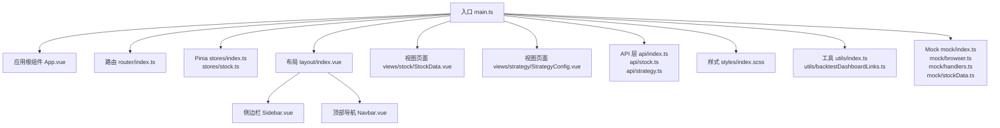
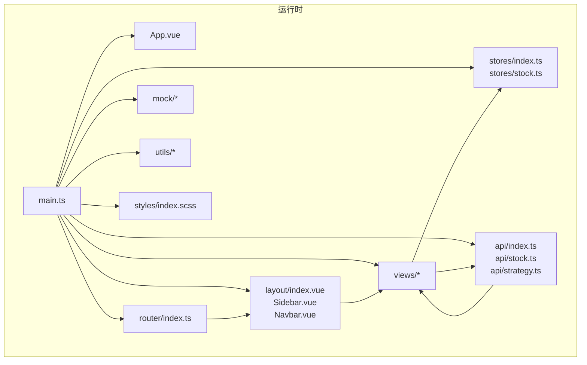
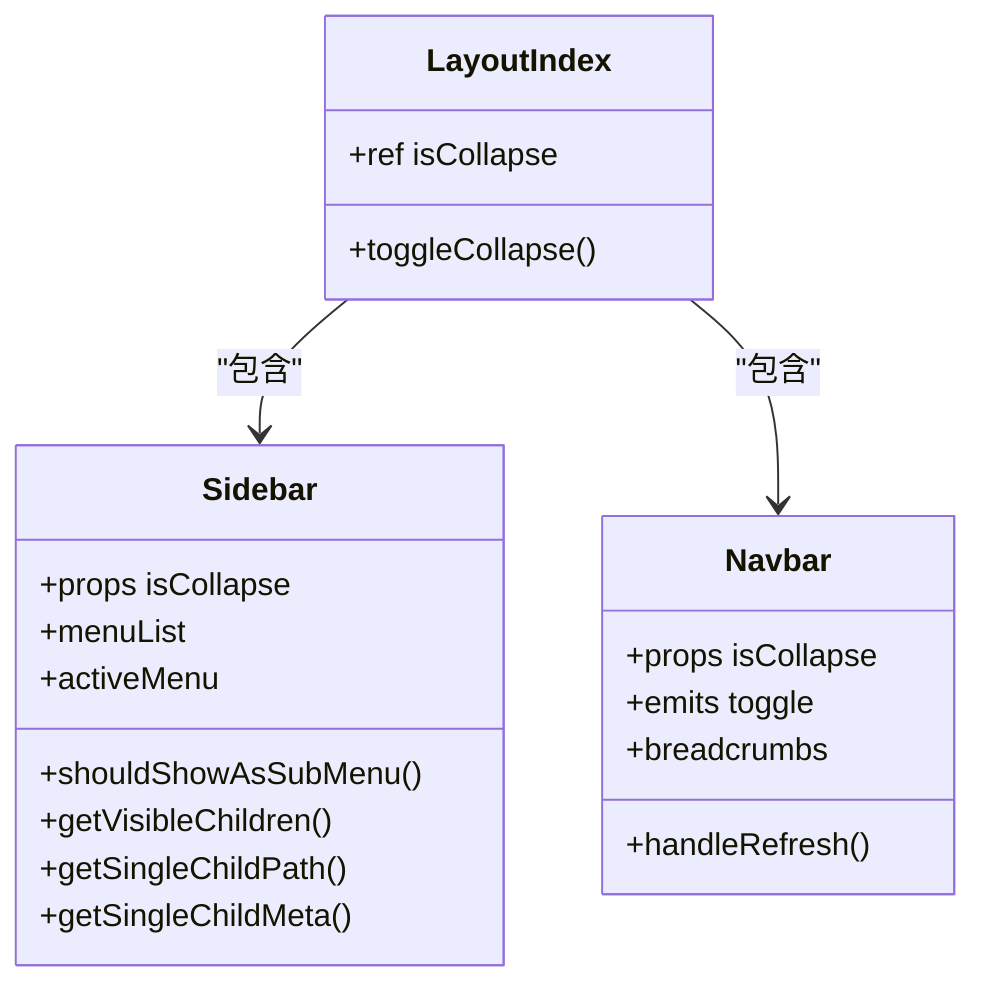
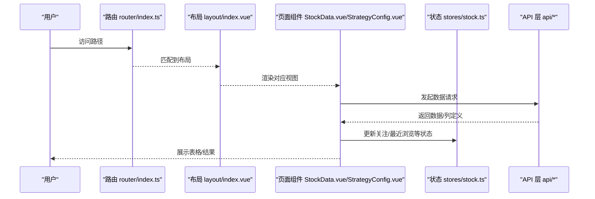
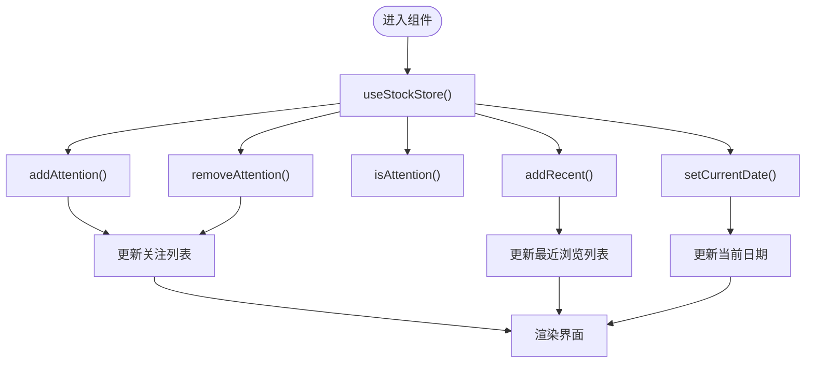
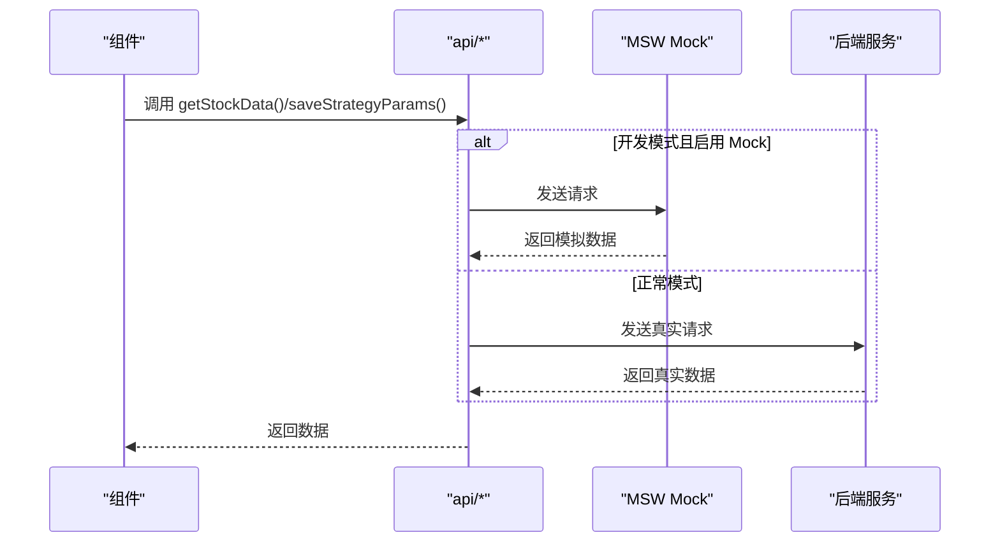
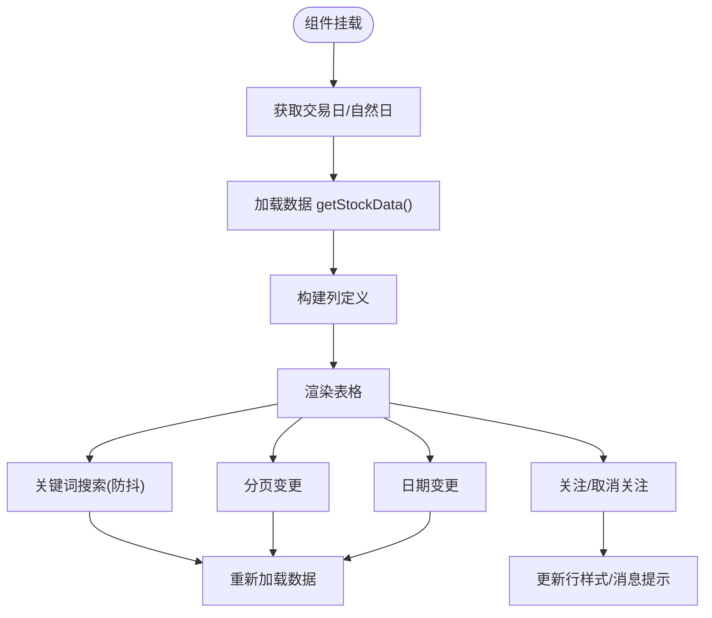
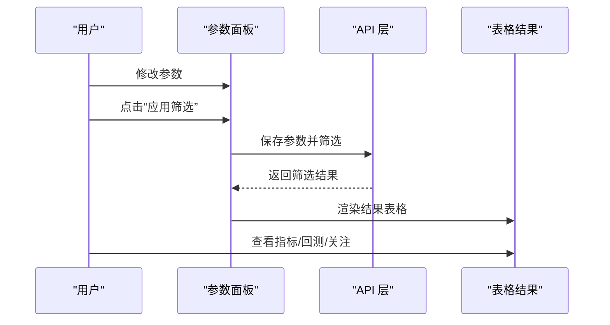
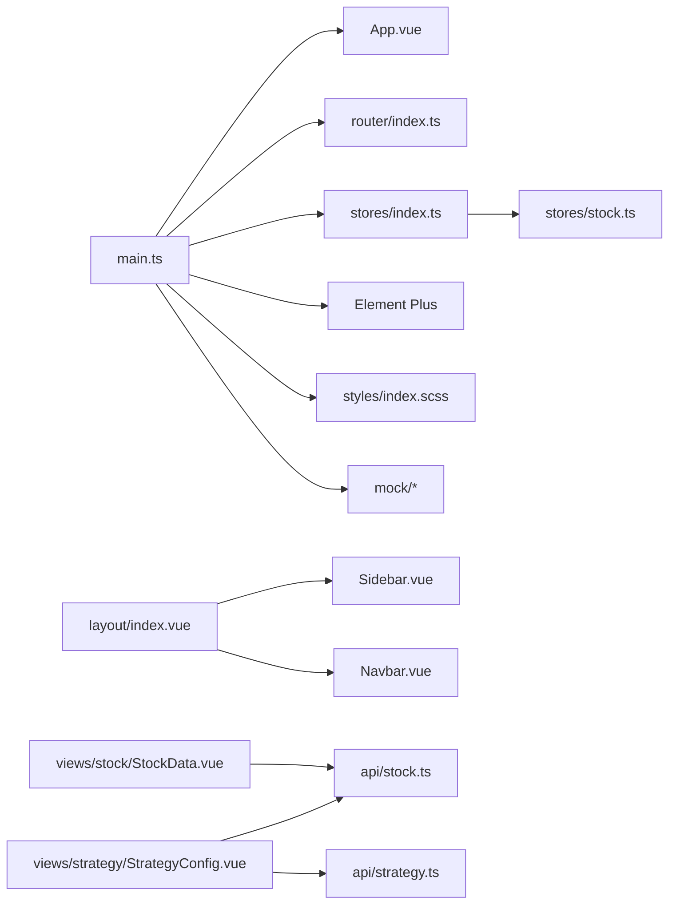

# 前端组件扩展

<cite>
**本文引用的文件**
- [main.ts](file://docker/stock/quantia/fontWeb/src/main.ts)
- [App.vue](file://docker/stock/quantia/fontWeb/src/App.vue)
- [router/index.ts](file://docker/stock/quantia/fontWeb/src/router/index.ts)
- [layout/index.vue](file://docker/stock/quantia/fontWeb/src/layout/index.vue)
- [layout/components/Sidebar.vue](file://docker/stock/quantia/fontWeb/src/layout/components/Sidebar.vue)
- [layout/components/Navbar.vue](file://docker/stock/quantia/fontWeb/src/layout/components/Navbar.vue)
- [stores/index.ts](file://docker/stock/quantia/fontWeb/src/stores/index.ts)
- [stores/stock.ts](file://docker/stock/quantia/fontWeb/src/stores/stock.ts)
- [views/stock/StockData.vue](file://docker/stock/quantia/fontWeb/src/views/stock/StockData.vue)
- [views/strategy/StrategyConfig.vue](file://docker/stock/quantia/fontWeb/src/views/strategy/StrategyConfig.vue)
- [styles/index.scss](file://docker/stock/quantia/fontWeb/src/styles/index.scss)
- [api/index.ts](file://docker/stock/quantia/fontWeb/src/api/index.ts)
- [api/stock.ts](file://docker/stock/quantia/fontWeb/src/api/stock.ts)
- [api/strategy.ts](file://docker/stock/quantia/fontWeb/src/api/strategy.ts)
- [types/index.ts](file://docker/stock/quantia/fontWeb/src/types/index.ts)
- [types/stock.ts](file://docker/stock/quantia/fontWeb/src/types/stock.ts)
- [utils/index.ts](file://docker/stock/quantia/fontWeb/src/utils/index.ts)
- [utils/backtestDashboardLinks.ts](file://docker/stock/quantia/fontWeb/src/utils/backtestDashboardLinks.ts)
- [mock/index.ts](file://docker/stock/quantia/fontWeb/src/mock/index.ts)
- [mock/browser.ts](file://docker/stock/quantia/fontWeb/src/mock/browser.ts)
- [mock/handlers.ts](file://docker/stock/quantia/fontWeb/src/mock/handlers.ts)
- [mock/stockData.ts](file://docker/stock/quantia/fontWeb/src/mock/stockData.ts)
</cite>

## 目录
1. [简介](#简介)
2. [项目结构](#项目结构)
3. [核心组件](#核心组件)
4. [架构总览](#架构总览)
5. [详细组件分析](#详细组件分析)
6. [依赖关系分析](#依赖关系分析)
7. [性能考量](#性能考量)
8. [故障排查指南](#故障排查指南)
9. [结论](#结论)
10. [附录](#附录)

## 简介
本指南面向希望基于现有 Vue.js 前端框架进行“组件扩展开发”的工程师，目标是帮助你在不破坏既有架构的前提下，快速、规范地新增前端组件、路由、状态与样式，并实现与后端 API 的对接。文档覆盖以下主题：
- Vue 组件架构与目录组织
- 组件开发规范与最佳实践
- 路由配置与面包屑导航
- Pinia 状态管理与共享数据
- API 接口扩展与 Mock 使用
- 样式定制与响应式布局
- 组件通信、事件处理、数据绑定与响应式设计
- 从简单展示组件到复杂交互组件的完整扩展示例

## 项目结构
前端位于 docker/stock/quantia/fontWeb/src 目录，采用按功能域划分的组织方式：
- 入口与应用根组件：main.ts、App.vue
- 路由：router/index.ts
- 布局：layout/index.vue 及其子组件 Sidebar.vue、Navbar.vue
- 状态管理：stores/index.ts、stores/stock.ts
- 视图页面：views 下各模块页面（如 StockData.vue、StrategyConfig.vue）
- API 层：api/index.ts、api/stock.ts、api/strategy.ts
- 类型定义：types/index.ts、types/stock.ts
- 工具函数：utils/index.ts、utils/backtestDashboardLinks.ts
- 样式：styles/index.scss
- Mock：mock/index.ts、mock/browser.ts、mock/handlers.ts、mock/stockData.ts

图表来源
- [main.ts](file://docker/stock/quantia/fontWeb/src/main.ts#L1-L40)
- [App.vue](file://docker/stock/quantia/fontWeb/src/App.vue#L1-L19)
- [router/index.ts](file://docker/stock/quantia/fontWeb/src/router/index.ts#L1-L336)
- [layout/index.vue](file://docker/stock/quantia/fontWeb/src/layout/index.vue#L1-L80)
- [layout/components/Sidebar.vue](file://docker/stock/quantia/fontWeb/src/layout/components/Sidebar.vue#L1-L152)
- [layout/components/Navbar.vue](file://docker/stock/quantia/fontWeb/src/layout/components/Navbar.vue#L1-L110)
- [stores/index.ts](file://docker/stock/quantia/fontWeb/src/stores/index.ts#L1-L2)
- [stores/stock.ts](file://docker/stock/quantia/fontWeb/src/stores/stock.ts#L1-L70)
- [views/stock/StockData.vue](file://docker/stock/quantia/fontWeb/src/views/stock/StockData.vue#L1-L599)
- [views/strategy/StrategyConfig.vue](file://docker/stock/quantia/fontWeb/src/views/strategy/StrategyConfig.vue#L1-L697)
- [api/index.ts](file://docker/stock/quantia/fontWeb/src/api/index.ts)
- [api/stock.ts](file://docker/stock/quantia/fontWeb/src/api/stock.ts)
- [api/strategy.ts](file://docker/stock/quantia/fontWeb/src/api/strategy.ts)
- [styles/index.scss](file://docker/stock/quantia/fontWeb/src/styles/index.scss)
- [utils/index.ts](file://docker/stock/quantia/fontWeb/src/utils/index.ts)
- [utils/backtestDashboardLinks.ts](file://docker/stock/quantia/fontWeb/src/utils/backtestDashboardLinks.ts)
- [mock/index.ts](file://docker/stock/quantia/fontWeb/src/mock/index.ts)
- [mock/browser.ts](file://docker/stock/quantia/fontWeb/src/mock/browser.ts)
- [mock/handlers.ts](file://docker/stock/quantia/fontWeb/src/mock/handlers.ts)
- [mock/stockData.ts](file://docker/stock/quantia/fontWeb/src/mock/stockData.ts)

章节来源
- [main.ts](file://docker/stock/quantia/fontWeb/src/main.ts#L1-L40)
- [router/index.ts](file://docker/stock/quantia/fontWeb/src/router/index.ts#L1-L336)

## 核心组件
- 应用入口与插件注册：在入口文件中完成应用初始化、Element Plus 国际化、Pinia、路由挂载以及开发环境下的 Mock 启用。
- 布局系统：统一的容器布局，包含侧边栏菜单与顶部导航栏，支持折叠切换与面包屑导航。
- 页面组件：StockData.vue 提供通用数据表格、搜索、分页、日期选择、关注/取消关注、回测跳转等能力；StrategyConfig.vue 提供策略参数配置、筛选结果展示与分页。
- 状态管理：Pinia Store 封装关注列表、最近浏览、当前日期等状态，提供增删查改方法。
- 路由系统：集中定义页面路由、嵌套路由、重定向、通配路由与 404 处理，支持旧版路径兼容。

章节来源
- [App.vue](file://docker/stock/quantia/fontWeb/src/App.vue#L1-L19)
- [layout/index.vue](file://docker/stock/quantia/fontWeb/src/layout/index.vue#L1-L80)
- [layout/components/Sidebar.vue](file://docker/stock/quantia/fontWeb/src/layout/components/Sidebar.vue#L1-L152)
- [layout/components/Navbar.vue](file://docker/stock/quantia/fontWeb/src/layout/components/Navbar.vue#L1-L110)
- [stores/stock.ts](file://docker/stock/quantia/fontWeb/src/stores/stock.ts#L1-L70)
- [views/stock/StockData.vue](file://docker/stock/quantia/fontWeb/src/views/stock/StockData.vue#L1-L599)
- [views/strategy/StrategyConfig.vue](file://docker/stock/quantia/fontWeb/src/views/strategy/StrategyConfig.vue#L1-L697)

## 架构总览
整体采用“入口 -> 布局 -> 视图 -> API -> 状态”的数据流，配合 Element Plus UI 组件库与 SCSS 样式体系，形成可扩展的前端架构。

图表来源
- [main.ts](file://docker/stock/quantia/fontWeb/src/main.ts#L1-L40)
- [router/index.ts](file://docker/stock/quantia/fontWeb/src/router/index.ts#L1-L336)
- [layout/index.vue](file://docker/stock/quantia/fontWeb/src/layout/index.vue#L1-L80)
- [stores/index.ts](file://docker/stock/quantia/fontWeb/src/stores/index.ts#L1-L2)
- [stores/stock.ts](file://docker/stock/quantia/fontWeb/src/stores/stock.ts#L1-L70)
- [api/index.ts](file://docker/stock/quantia/fontWeb/src/api/index.ts)
- [views/stock/StockData.vue](file://docker/stock/quantia/fontWeb/src/views/stock/StockData.vue#L1-L599)
- [views/strategy/StrategyConfig.vue](file://docker/stock/quantia/fontWeb/src/views/strategy/StrategyConfig.vue#L1-L697)
- [mock/index.ts](file://docker/stock/quantia/fontWeb/src/mock/index.ts)
- [utils/index.ts](file://docker/stock/quantia/fontWeb/src/utils/index.ts)
- [styles/index.scss](file://docker/stock/quantia/fontWeb/src/styles/index.scss)

## 详细组件分析

### 布局与导航组件
- 布局容器负责整体页面结构与动画过渡，侧边栏根据路由生成菜单，顶部导航提供面包屑与折叠控制。
- 侧边栏根据子菜单数量决定是否以子菜单形式展示，支持图标与标题。
- 顶部导航提供折叠切换、面包屑导航与刷新按钮。

图表来源
- [layout/index.vue](file://docker/stock/quantia/fontWeb/src/layout/index.vue#L1-L80)
- [layout/components/Sidebar.vue](file://docker/stock/quantia/fontWeb/src/layout/components/Sidebar.vue#L1-L152)
- [layout/components/Navbar.vue](file://docker/stock/quantia/fontWeb/src/layout/components/Navbar.vue#L1-L110)

章节来源
- [layout/index.vue](file://docker/stock/quantia/fontWeb/src/layout/index.vue#L1-L80)
- [layout/components/Sidebar.vue](file://docker/stock/quantia/fontWeb/src/layout/components/Sidebar.vue#L1-L152)
- [layout/components/Navbar.vue](file://docker/stock/quantia/fontWeb/src/layout/components/Navbar.vue#L1-L110)

### 路由与页面组件
- 路由集中定义了多级菜单、重定向、通配与 404 页面，并对旧版路径进行兼容重定向。
- StockData.vue 是通用数据展示组件，支持动态列、搜索、分页、日期选择、关注/取消关注、回测跳转等。
- StrategyConfig.vue 提供策略参数配置、筛选执行、结果展示与分页。

图表来源
- [router/index.ts](file://docker/stock/quantia/fontWeb/src/router/index.ts#L1-L336)
- [layout/index.vue](file://docker/stock/quantia/fontWeb/src/layout/index.vue#L1-L80)
- [views/stock/StockData.vue](file://docker/stock/quantia/fontWeb/src/views/stock/StockData.vue#L1-L599)
- [views/strategy/StrategyConfig.vue](file://docker/stock/quantia/fontWeb/src/views/strategy/StrategyConfig.vue#L1-L697)
- [stores/stock.ts](file://docker/stock/quantia/fontWeb/src/stores/stock.ts#L1-L70)
- [api/index.ts](file://docker/stock/quantia/fontWeb/src/api/index.ts)
- [api/stock.ts](file://docker/stock/quantia/fontWeb/src/api/stock.ts)
- [api/strategy.ts](file://docker/stock/quantia/fontWeb/src/api/strategy.ts)

章节来源
- [router/index.ts](file://docker/stock/quantia/fontWeb/src/router/index.ts#L1-L336)
- [views/stock/StockData.vue](file://docker/stock/quantia/fontWeb/src/views/stock/StockData.vue#L1-L599)
- [views/strategy/StrategyConfig.vue](file://docker/stock/quantia/fontWeb/src/views/strategy/StrategyConfig.vue#L1-L697)

### 状态管理（Pinia）
- 定义了 StockItem 接口与 useStockStore，提供关注列表、最近浏览列表、当前日期等状态与方法。
- 通过 Pinia 的组合式 API 方式使用，便于在组件中直接调用。

图表来源
- [stores/stock.ts](file://docker/stock/quantia/fontWeb/src/stores/stock.ts#L1-L70)

章节来源
- [stores/index.ts](file://docker/stock/quantia/fontWeb/src/stores/index.ts#L1-L2)
- [stores/stock.ts](file://docker/stock/quantia/fontWeb/src/stores/stock.ts#L1-L70)

### API 扩展与 Mock
- API 层通过 api/index.ts 汇总导出，具体接口在 api/stock.ts、api/strategy.ts 中实现。
- 开发模式下可通过 import.meta.env.MODE 控制是否启用 Mock，使用 MSW（mockServiceWorker）拦截请求。
- Mock 提供浏览器端请求拦截器与处理器，便于离线调试与联调。

图表来源
- [main.ts](file://docker/stock/quantia/fontWeb/src/main.ts#L13-L24)
- [api/index.ts](file://docker/stock/quantia/fontWeb/src/api/index.ts)
- [api/stock.ts](file://docker/stock/quantia/fontWeb/src/api/stock.ts)
- [api/strategy.ts](file://docker/stock/quantia/fontWeb/src/api/strategy.ts)
- [mock/index.ts](file://docker/stock/quantia/fontWeb/src/mock/index.ts)
- [mock/browser.ts](file://docker/stock/quantia/fontWeb/src/mock/browser.ts)
- [mock/handlers.ts](file://docker/stock/quantia/fontWeb/src/mock/handlers.ts)
- [mock/stockData.ts](file://docker/stock/quantia/fontWeb/src/mock/stockData.ts)

章节来源
- [main.ts](file://docker/stock/quantia/fontWeb/src/main.ts#L13-L24)
- [api/index.ts](file://docker/stock/quantia/fontWeb/src/api/index.ts)
- [api/stock.ts](file://docker/stock/quantia/fontWeb/src/api/stock.ts)
- [api/strategy.ts](file://docker/stock/quantia/fontWeb/src/api/strategy.ts)
- [mock/index.ts](file://docker/stock/quantia/fontWeb/src/mock/index.ts)
- [mock/browser.ts](file://docker/stock/quantia/fontWeb/src/mock/browser.ts)
- [mock/handlers.ts](file://docker/stock/quantia/fontWeb/src/mock/handlers.ts)
- [mock/stockData.ts](file://docker/stock/quantia/fontWeb/src/mock/stockData.ts)

### 数据表格与交互组件（StockData.vue）
- 动态列：根据后端返回的列定义生成表格列，自动过滤空列，支持 tooltip 与自适应宽度。
- 搜索与分页：支持关键词搜索（带防抖）、分页大小与页码变更。
- 日期选择：根据实时性标志选择交易日或自然日。
- 关注/取消关注：通过 toggleAttention 接口更新关注状态并在界面上反馈。
- 回测跳转：提供多种回测视图入口（看板、时间序列、明细）。

图表来源
- [views/stock/StockData.vue](file://docker/stock/quantia/fontWeb/src/views/stock/StockData.vue#L80-L339)

章节来源
- [views/stock/StockData.vue](file://docker/stock/quantia/fontWeb/src/views/stock/StockData.vue#L1-L599)

### 策略配置与筛选（StrategyConfig.vue）
- 策略选择：支持切换不同策略并加载对应参数组。
- 参数编辑：支持数字（带滑块与输入框）、文本、密码、选择等控件。
- 筛选执行：保存参数后发起筛选请求，展示筛选结果与分页。
- 结果操作：支持查看指标详情、进入回测、关注/取消关注。

图表来源
- [views/strategy/StrategyConfig.vue](file://docker/stock/quantia/fontWeb/src/views/strategy/StrategyConfig.vue#L64-L262)

章节来源
- [views/strategy/StrategyConfig.vue](file://docker/stock/quantia/fontWeb/src/views/strategy/StrategyConfig.vue#L1-L697)

## 依赖关系分析
- 入口依赖：main.ts 依赖 App.vue、router、Pinia、Element Plus、样式与 Mock。
- 布局依赖：layout/index.vue 依赖 Sidebar 与 Navbar；Sidebar 依赖路由配置生成菜单；Navbar 依赖路由生成面包屑。
- 页面组件依赖：StockData.vue 依赖 API、工具函数、状态；StrategyConfig.vue 依赖策略 API、关注接口与路由。
- 状态依赖：stores/stock.ts 为全局状态，被多个页面共享使用。
- Mock 依赖：main.ts 中根据 MODE 决定是否启动 mockServiceWorker。

图表来源
- [main.ts](file://docker/stock/quantia/fontWeb/src/main.ts#L1-L40)
- [router/index.ts](file://docker/stock/quantia/fontWeb/src/router/index.ts#L1-L336)
- [layout/index.vue](file://docker/stock/quantia/fontWeb/src/layout/index.vue#L1-L80)
- [layout/components/Sidebar.vue](file://docker/stock/quantia/fontWeb/src/layout/components/Sidebar.vue#L1-L152)
- [layout/components/Navbar.vue](file://docker/stock/quantia/fontWeb/src/layout/components/Navbar.vue#L1-L110)
- [stores/index.ts](file://docker/stock/quantia/fontWeb/src/stores/index.ts#L1-L2)
- [stores/stock.ts](file://docker/stock/quantia/fontWeb/src/stores/stock.ts#L1-L70)
- [views/stock/StockData.vue](file://docker/stock/quantia/fontWeb/src/views/stock/StockData.vue#L1-L599)
- [views/strategy/StrategyConfig.vue](file://docker/stock/quantia/fontWeb/src/views/strategy/StrategyConfig.vue#L1-L697)
- [api/stock.ts](file://docker/stock/quantia/fontWeb/src/api/stock.ts)
- [api/strategy.ts](file://docker/stock/quantia/fontWeb/src/api/strategy.ts)
- [mock/index.ts](file://docker/stock/quantia/fontWeb/src/mock/index.ts)

章节来源
- [main.ts](file://docker/stock/quantia/fontWeb/src/main.ts#L1-L40)
- [router/index.ts](file://docker/stock/quantia/fontWeb/src/router/index.ts#L1-L336)

## 性能考量
- 表格渲染优化：StockData.vue 对动态列进行空值过滤与最小宽度计算，避免无效列占用空间；使用 el-table 的固定列与自适应宽度减少重排。
- 请求节流与防抖：搜索输入采用 500ms 防抖，降低频繁请求带来的压力。
- 分页与懒加载：通过分页参数控制数据量，避免一次性加载过多数据。
- Keep-alive 缓存：布局中对路由组件使用 keep-alive，减少重复渲染成本。
- Mock 环境：开发阶段启用 MSW 可显著降低联调等待时间，提升迭代效率。

[本节为通用指导，无需列出具体文件来源]

## 故障排查指南
- 路由 404：确认路由配置中是否存在通配与 404 子路由，检查路径拼写与 meta 标记。
- 数据不显示：检查 API 返回格式是否符合 StockData.vue 的预期（columns/data/total），确认后端接口是否返回新旧两种格式。
- Mock 未生效：确认 import.meta.env.MODE 是否为 mock，且 mockServiceWorker 已启动。
- 日期异常：确认实时性标志与交易日接口返回值，避免使用客户端本地日期导致数据不一致。
- 样式冲突：检查 styles/index.scss 与组件 scoped 样式优先级，避免覆盖 Element Plus 默认样式。

章节来源
- [router/index.ts](file://docker/stock/quantia/fontWeb/src/router/index.ts#L314-L327)
- [views/stock/StockData.vue](file://docker/stock/quantia/fontWeb/src/views/stock/StockData.vue#L95-L124)
- [main.ts](file://docker/stock/quantia/fontWeb/src/main.ts#L13-L24)

## 结论
本指南提供了从前端入口、布局、路由、状态、API 到样式的完整扩展路径。遵循本文档的规范与流程，你可以安全地新增组件、路由与状态，同时保持与现有架构的一致性与可维护性。建议在开发过程中：
- 优先复用现有布局与组件（如 StockData.vue 的表格能力）
- 使用 Pinia 管理跨页面共享状态
- 通过 Mock 快速联调，再切换到真实 API
- 严格遵守组件命名与目录约定，便于后续维护

[本节为总结性内容，无需列出具体文件来源]

## 附录

### 组件开发规范清单
- 目录与命名：组件放置于 views 或 layout/components 下，遵循 PascalCase 命名；页面组件以页面名命名，如 MyPage.vue。
- 组件结构：使用 <script setup> 语法，合理拆分逻辑与模板，避免在模板中写复杂表达式。
- 事件与通信：通过 props 传递只读数据，通过 emits 派发事件；兄弟组件通过父组件中转或 Pinia 共享状态。
- 数据绑定：优先使用 v-model、计算属性与 watch，避免在模板中直接调用方法。
- 响应式设计：使用 Element Plus 布局组件与 SCSS 变量，适配不同屏幕尺寸。
- 错误处理：对异步请求进行 try/catch 并提示用户，避免静默失败。
- 样式：尽量使用 scoped 样式，必要时在 styles/index.scss 中统一注入全局样式。

[本节为通用规范，无需列出具体文件来源]

### 扩展示例步骤（从零到一）
- 新增页面组件：在 views 下新建 MyPage.vue，参考 StockData.vue 的数据加载与表格渲染模式。
- 配置路由：在 router/index.ts 中新增路由条目，设置 meta 标签（标题、图标、是否实时等）。
- 定义状态：在 stores/stock.ts 中扩展所需状态与方法，或新建独立 store。
- 编写 API：在 api/ 下新增接口文件，封装请求方法；开发阶段启用 Mock。
- 引入样式：在 styles/index.scss 中补充必要的全局样式或在组件内使用 scoped 样式。
- 调试与测试：使用 Mock 验证交互，完成后切换真实 API；在组件中增加必要的错误提示与加载状态。

[本节为通用流程，无需列出具体文件来源]
