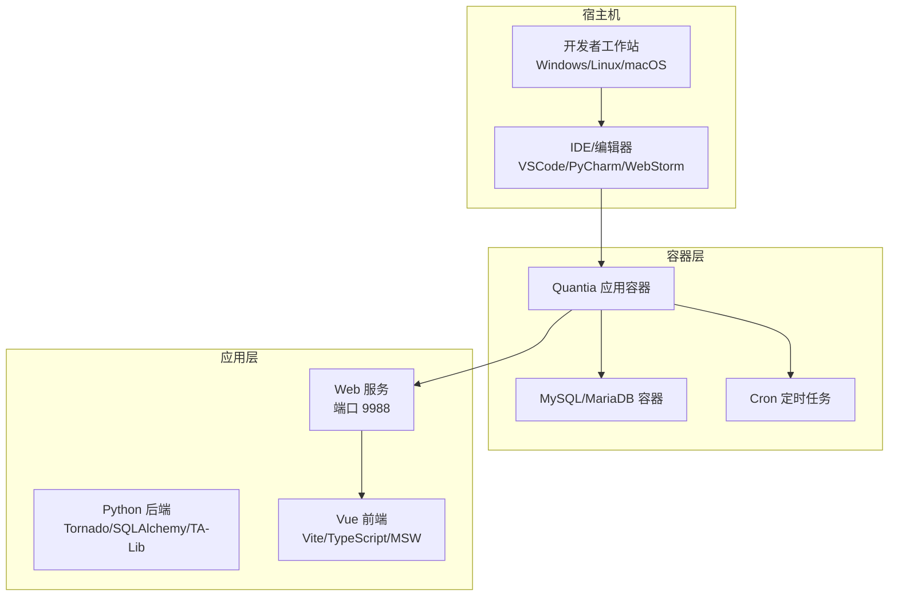
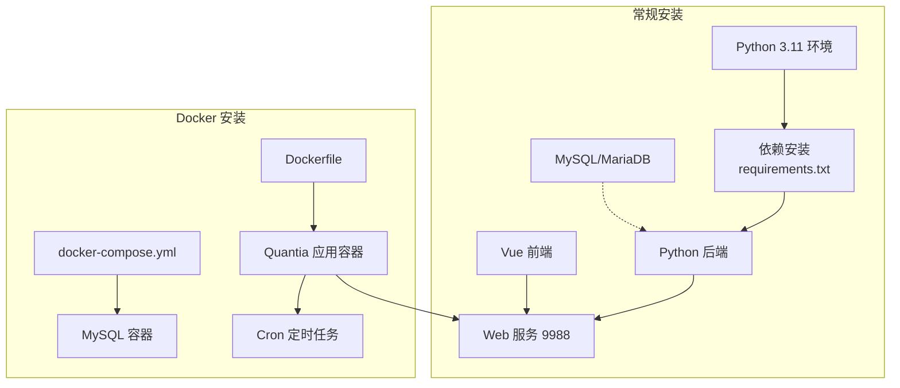
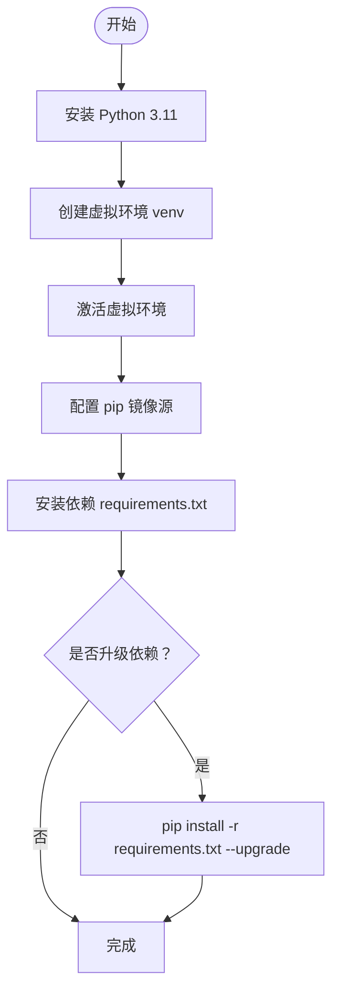
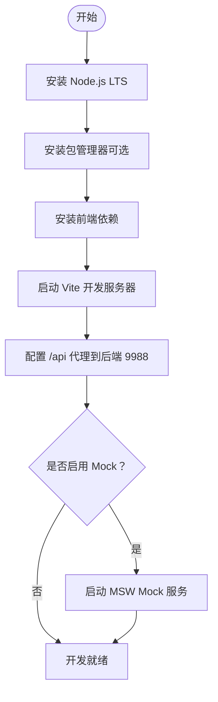
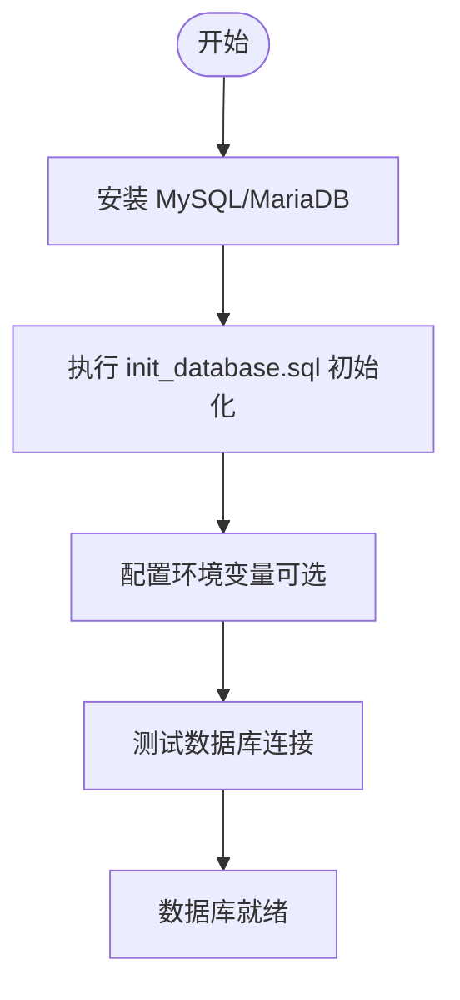
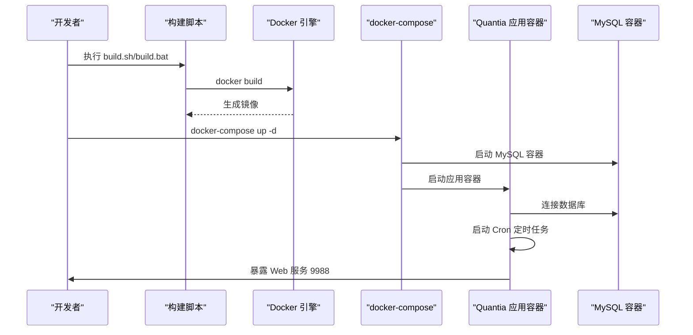
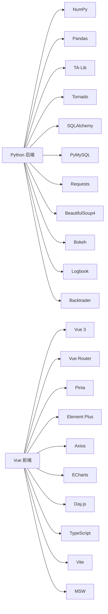

# 开发环境搭建

<cite>
**本文档引用的文件**
- [README.md](file://README.md)
- [QUICKSTART.md](file://QUICKSTART.md)
- [requirements.txt](file://requirements.txt)
- [docker/Dockerfile](file://docker/Dockerfile)
- [docker/docker-compose.yml](file://docker/docker-compose.yml)
- [docker/init_database.sql](file://docker/init_database.sql)
- [docker/build.sh](file://docker/build.sh)
- [docker/build.bat](file://docker/build.bat)
- [docker/stock/quantia/lib/database.py](file://docker/stock/quantia/lib/database.py)
- [docker/stock/quantia/fontWeb/package.json](file://docker/stock/quantia/fontWeb/package.json)
- [docker/stock/quantia/fontWeb/vite.config.ts](file://docker/stock/quantia/fontWeb/vite.config.ts)
- [docker/stock/quantia/fontWeb/tsconfig.json](file://docker/stock/quantia/fontWeb/tsconfig.json)
- [docker/stock/quantia/fontWeb/src/main.ts](file://docker/stock/quantia/fontWeb/src/main.ts)
</cite>

## 目录
1. [简介](#简介)
2. [项目结构](#项目结构)
3. [核心组件](#核心组件)
4. [架构总览](#架构总览)
5. [详细组件分析](#详细组件分析)
6. [依赖关系分析](#依赖关系分析)
7. [性能考虑](#性能考虑)
8. [故障排除指南](#故障排除指南)
9. [结论](#结论)
10. [附录](#附录)

## 简介
本指南面向开发者，提供从零开始搭建 Quantia 股票数据分析系统开发环境的完整流程。内容涵盖：
- 开发环境要求与依赖安装
- Python 环境配置与虚拟环境
- Node.js 前端环境配置
- 数据库环境准备（MySQL/MariaDB）
- Docker 环境搭建与镜像构建
- IDE 设置与调试配置
- 代码格式化与 Git 工作流
- 常见问题排查与性能优化建议

## 项目结构
项目采用前后端分离与多语言混合架构：
- 后端：Python（Tornado Web 框架、SQLAlchemy、PyMySQL、TA-Lib 等）
- 前端：Vue 3 + TypeScript（Vite 构建、Element Plus UI、MSW Mock）
- 数据库：MySQL/MariaDB（初始化 SQL 脚本）
- 容器化：Dockerfile + docker-compose，支持本地与远程数据库
- 任务调度：Cron 定时任务（小时/工作日/月度）

图表来源
- [docker/docker-compose.yml](file://docker/docker-compose.yml#L1-L87)
- [docker/Dockerfile](file://docker/Dockerfile#L1-L153)
- [docker/stock/quantia/fontWeb/package.json](file://docker/stock/quantia/fontWeb/package.json#L1-L44)

章节来源
- [README.md](file://README.md#L321-L700)
- [docker/docker-compose.yml](file://docker/docker-compose.yml#L1-L87)
- [docker/Dockerfile](file://docker/Dockerfile#L1-L153)

## 核心组件
- Python 后端：提供 Web API、数据抓取、指标计算、策略选股、回测与交易服务
- Vue 前端：提供回测看板、K线图、选股结果展示与交互
- 数据库：MySQL/MariaDB，包含每日行情、资金流、筹码分布、策略结果等表
- 容器编排：Dockerfile、docker-compose、cron 定时任务
- 依赖清单：requirements.txt 管理 Python 依赖版本范围

章节来源
- [requirements.txt](file://requirements.txt#L1-L41)
- [docker/init_database.sql](file://docker/init_database.sql#L1-L455)
- [docker/Dockerfile](file://docker/Dockerfile#L87-L109)

## 架构总览
系统支持两种部署方式：常规安装与 Docker 安装。

图表来源
- [README.md](file://README.md#L327-L694)
- [docker/Dockerfile](file://docker/Dockerfile#L1-L153)
- [docker/docker-compose.yml](file://docker/docker-compose.yml#L1-L87)

## 详细组件分析

### Python 环境配置
- 版本要求：Python 3.11（建议最新版）
- 虚拟环境：推荐使用 venv 创建隔离环境
- 国内镜像：配置 pip 阿里云镜像源以提升安装速度
- 依赖安装：使用 requirements.txt 安装依赖，支持升级与生成新依赖清单

图表来源
- [README.md](file://README.md#L333-L390)
- [QUICKSTART.md](file://QUICKSTART.md#L9-L27)
- [requirements.txt](file://requirements.txt#L1-L41)

章节来源
- [README.md](file://README.md#L333-L390)
- [QUICKSTART.md](file://QUICKSTART.md#L9-L27)

### Node.js 环境配置
- 前端技术栈：Vue 3 + TypeScript + Vite
- 包管理：npm/yarn/pnpm（项目使用 package.json 管理依赖）
- 开发代理：Vite 代理到后端 Web 服务（端口 9988）
- Mock：MSW（Mock Service Worker）支持开发时模拟 API

图表来源
- [docker/stock/quantia/fontWeb/package.json](file://docker/stock/quantia/fontWeb/package.json#L1-L44)
- [docker/stock/quantia/fontWeb/vite.config.ts](file://docker/stock/quantia/fontWeb/vite.config.ts#L1-L32)
- [docker/stock/quantia/fontWeb/src/main.ts](file://docker/stock/quantia/fontWeb/src/main.ts#L1-L40)

章节来源
- [docker/stock/quantia/fontWeb/package.json](file://docker/stock/quantia/fontWeb/package.json#L1-L44)
- [docker/stock/quantia/fontWeb/vite.config.ts](file://docker/stock/quantia/fontWeb/vite.config.ts#L1-L32)
- [docker/stock/quantia/fontWeb/tsconfig.json](file://docker/stock/quantia/fontWeb/tsconfig.json#L1-L26)
- [docker/stock/quantia/fontWeb/src/main.ts](file://docker/stock/quantia/fontWeb/src/main.ts#L1-L40)

### 数据库环境准备
- 数据库类型：MySQL 或 MariaDB
- 初始化：使用 init_database.sql 创建数据库与表结构
- 连接配置：支持环境变量覆盖（QUANTIA_DB_HOST、QUANTIA_DB_USER、QUANTIA_DB_PASSWORD、QUANTIA_DB_DATABASE、QUANTIA_DB_PORT）
- 字符集：utf8mb4，推荐 collation utf8mb4_unicode_ci

图表来源
- [docker/init_database.sql](file://docker/init_database.sql#L1-L455)
- [docker/stock/quantia/lib/database.py](file://docker/stock/quantia/lib/database.py#L17-L45)

章节来源
- [docker/init_database.sql](file://docker/init_database.sql#L1-L455)
- [docker/stock/quantia/lib/database.py](file://docker/stock/quantia/lib/database.py#L17-L45)

### Docker 环境搭建
- 构建方式：支持 Linux/macOS（build.sh）与 Windows（build.bat）
- 镜像配置：Dockerfile 内置国内镜像源、时区、TA-Lib C 库、Python 依赖
- 编排：docker-compose.yml 提供完整部署（含 MySQL）与远程数据库部署
- 定时任务：Cron 定时执行数据抓取与分析任务
- 健康检查：Web 服务健康检查（curl）

图表来源
- [docker/build.sh](file://docker/build.sh#L1-L99)
- [docker/build.bat](file://docker/build.bat#L1-L63)
- [docker/Dockerfile](file://docker/Dockerfile#L1-L153)
- [docker/docker-compose.yml](file://docker/docker-compose.yml#L1-L87)

章节来源
- [docker/build.sh](file://docker/build.sh#L1-L99)
- [docker/build.bat](file://docker/build.bat#L1-L63)
- [docker/docker-compose.yml](file://docker/docker-compose.yml#L1-L87)

### IDE 设置与调试配置
- Python：推荐 VS Code + Python 扩展，配置解释器为虚拟环境
- Vue：WebStorm/VS Code Vue 扩展，TypeScript 严格模式
- 调试：后端使用断点调试；前端使用 Vite Dev Server + MSW Mock
- 代理：Vite 代理到后端 9988 端口，便于联调

章节来源
- [docker/stock/quantia/fontWeb/vite.config.ts](file://docker/stock/quantia/fontWeb/vite.config.ts#L13-L26)
- [docker/stock/quantia/fontWeb/src/main.ts](file://docker/stock/quantia/fontWeb/src/main.ts#L12-L24)

### 代码格式化与 Git 工作流
- 代码风格：Python 使用 PEP 8；前端使用 ESLint/Stylelint（项目未提供配置文件，建议在本地配置）
- Git：分支策略建议采用 Git Flow；提交信息规范建议使用约定式提交
- 依赖管理：requirements.txt 使用 >= 约束，便于升级；前端 package.json 管理依赖

章节来源
- [requirements.txt](file://requirements.txt#L1-L41)
- [docker/stock/quantia/fontWeb/package.json](file://docker/stock/quantia/fontWeb/package.json#L1-L44)

## 依赖关系分析
- Python 依赖：NumPy、Pandas、TA-Lib、Tornado、SQLAlchemy、PyMySQL、Requests、BeautifulSoup4、Bokeh、Logbook、easytrader、backtrader 等
- 前端依赖：Vue 3、Vue Router、Pinia、Element Plus、Axios、ECharts、Day.js、TypeScript、Vite、MSW 等
- 容器依赖：Python 3.11-slim、TA-Lib C 库、MySQL 客户端、Cron、Supervisor

图表来源
- [requirements.txt](file://requirements.txt#L1-L41)
- [docker/stock/quantia/fontWeb/package.json](file://docker/stock/quantia/fontWeb/package.json#L15-L38)

章节来源
- [requirements.txt](file://requirements.txt#L1-L41)
- [docker/stock/quantia/fontWeb/package.json](file://docker/stock/quantia/fontWeb/package.json#L1-L44)

## 性能考虑
- 数据库连接池：SQLAlchemy 连接池大小与溢出配置，减少连接开销
- 并发写入：使用 Upsert（ON DUPLICATE KEY UPDATE）避免重复主键冲突
- 瞬态错误重试：数据库连接/锁异常自动重试，提升稳定性
- 历史数据缓存：Docker 环境默认缓存天数可配置，减少重复抓取
- 定时任务：Cron 分时段执行，避免高峰时段资源竞争

章节来源
- [docker/stock/quantia/lib/database.py](file://docker/stock/quantia/lib/database.py#L60-L71)
- [docker/stock/quantia/lib/database.py](file://docker/stock/quantia/lib/database.py#L94-L106)
- [docker/Dockerfile](file://docker/Dockerfile#L28-L30)

## 故障排除指南
- 数据获取失败：系统具备多数据源自动切换（东方财富→腾讯→新浪），仍失败时检查网络与代理
- 数据库连接失败：确认数据库服务运行、凭据正确、网络可达
- 历史数据更新：采用增量更新机制，首次全量抓取后后续快速补缺
- Docker 容器无法启动：检查健康检查、端口占用、卷挂载路径
- 前端无法访问后端：确认 Vite 代理配置与后端服务端口

章节来源
- [QUICKSTART.md](file://QUICKSTART.md#L169-L195)
- [docker/docker-compose.yml](file://docker/docker-compose.yml#L66-L71)
- [docker/stock/quantia/fontWeb/vite.config.ts](file://docker/stock/quantia/fontWeb/vite.config.ts#L13-L26)

## 结论
通过本指南，开发者可在本地快速搭建 Quantia 的 Python 后端与 Vue 前端开发环境，并可选择 Docker 一键部署。建议优先使用 Docker 环境以减少系统差异带来的问题，同时结合虚拟环境与包管理器确保依赖一致性。遇到问题时，可参考故障排除章节与日志定位。

## 附录
- 快速开始：克隆仓库、创建虚拟环境、安装依赖、配置数据库、运行数据作业与 Web 服务
- 常用命令：数据抓取、指标计算、策略选股、回测、Docker 部署与日志查看

章节来源
- [QUICKSTART.md](file://QUICKSTART.md#L1-L207)
