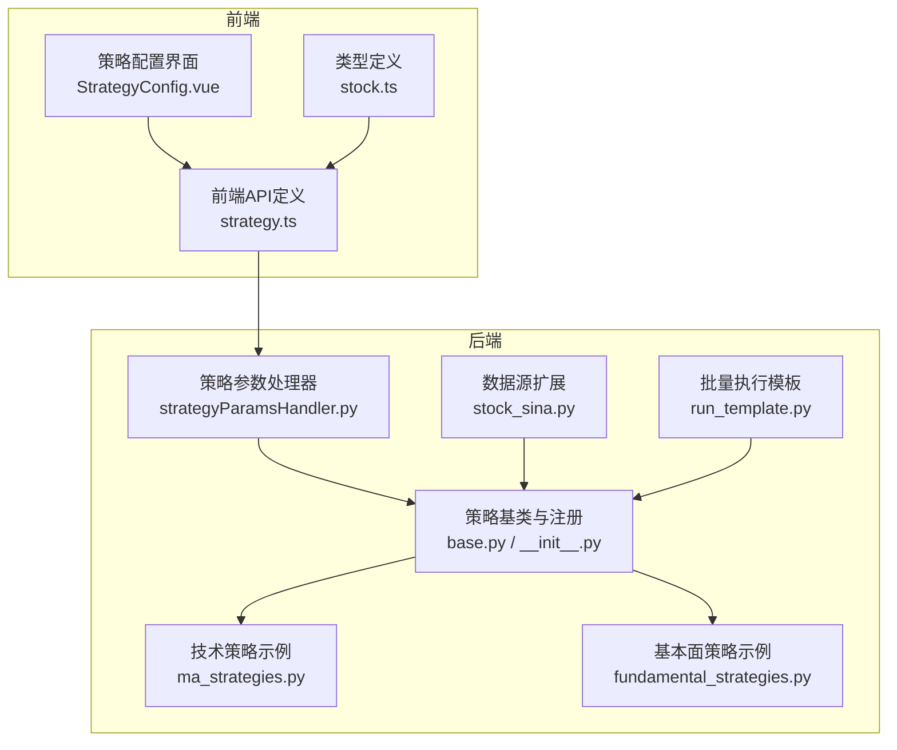
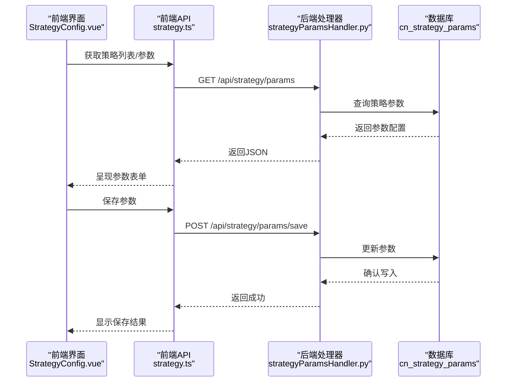
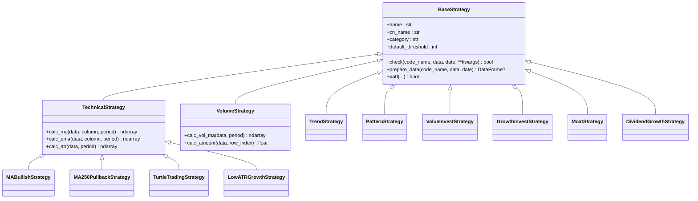
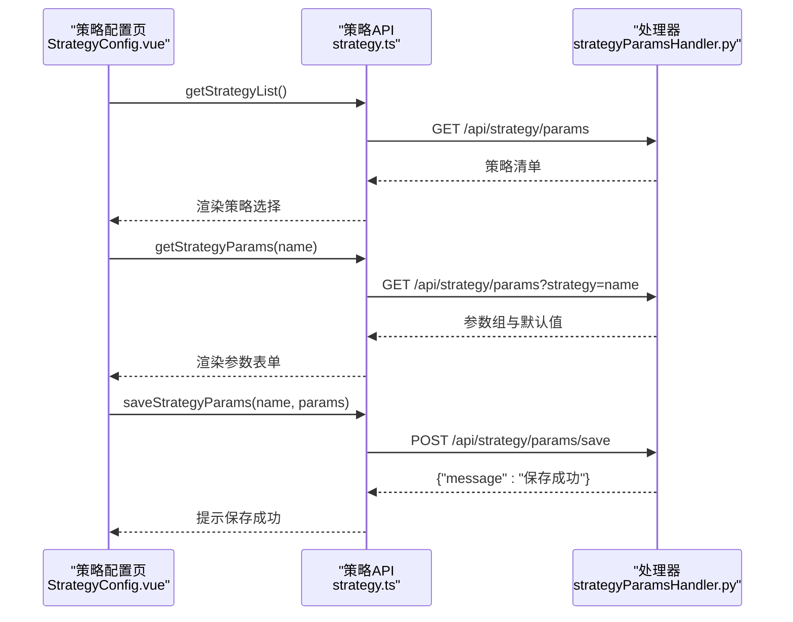
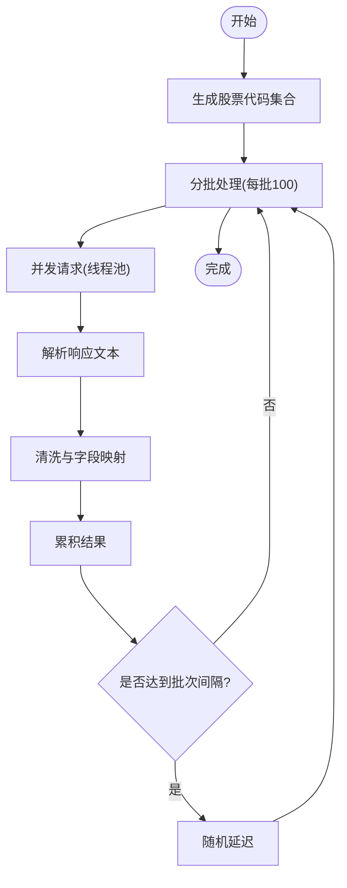

# 扩展开发指南

<cite>
**本文档引用的文件**
- [README.md](file://README.md)
- [QUICKSTART.md](file://QUICKSTART.md)
- [requirements.txt](file://requirements.txt)
- [quantia/core/strategy/base.py](file://quantia/core/strategy/base.py)
- [quantia/core/strategy/__init__.py](file://quantia/core/strategy/__init__.py)
- [quantia/core/strategy/technical/ma_strategies.py](file://quantia/core/strategy/technical/ma_strategies.py)
- [quantia/core/strategy/fundamental/fundamental_strategies.py](file://quantia/core/strategy/fundamental/fundamental_strategies.py)
- [quantia/fontWeb/src/api/strategy.ts](file://quantia/fontWeb/src/api/strategy.ts)
- [quantia/fontWeb/src/views/strategy/StrategyConfig.vue](file://quantia/fontWeb/src/views/strategy/StrategyConfig.vue)
- [quantia/fontWeb/src/types/stock.ts](file://quantia/fontWeb/src/types/stock.ts)
- [quantia/web/strategyParamsHandler.py](file://quantia/web/strategyParamsHandler.py)
- [quantia/core/crawling/stock_sina.py](file://quantia/core/crawling/stock_sina.py)
- [quantia/lib/run_template.py](file://quantia/lib/run_template.py)
</cite>

## 目录
1. [简介](#简介)
2. [项目结构](#项目结构)
3. [核心组件](#核心组件)
4. [架构总览](#架构总览)
5. [详细组件分析](#详细组件分析)
6. [依赖分析](#依赖分析)
7. [性能考量](#性能考量)
8. [故障排查指南](#故障排查指南)
9. [结论](#结论)
10. [附录](#附录)

## 简介
本指南面向希望扩展 Quantia 系统的开发者，涵盖策略扩展、数据源扩展、前端组件扩展与配置管理的完整方法论。内容基于系统现有策略注册机制、接口规范、配置持久化与前端交互模型，帮助你在不破坏既有架构的前提下，安全、高效地定制与扩展系统功能。

## 项目结构
系统采用模块化分层组织：
- 核心业务层：策略、指标、形态、K线可视化、数据抓取等
- Web 层：Tornado 提供后端接口，Vue 前端提供可视化与交互
- 作业调度层：统一的批量执行模板与定时任务
- 配置与持久化：策略参数配置表、日志与缓存

图表来源
- [quantia/fontWeb/src/api/strategy.ts](file://quantia/fontWeb/src/api/strategy.ts#L1-L93)
- [quantia/fontWeb/src/views/strategy/StrategyConfig.vue](file://quantia/fontWeb/src/views/strategy/StrategyConfig.vue#L1-L200)
- [quantia/fontWeb/src/types/stock.ts](file://quantia/fontWeb/src/types/stock.ts#L1-L80)
- [quantia/web/strategyParamsHandler.py](file://quantia/web/strategyParamsHandler.py#L1-L200)
- [quantia/core/strategy/base.py](file://quantia/core/strategy/base.py#L1-L202)
- [quantia/core/strategy/technical/ma_strategies.py](file://quantia/core/strategy/technical/ma_strategies.py#L1-L237)
- [quantia/core/strategy/fundamental/fundamental_strategies.py](file://quantia/core/strategy/fundamental/fundamental_strategies.py#L1-L351)
- [quantia/core/crawling/stock_sina.py](file://quantia/core/crawling/stock_sina.py#L1-L200)
- [quantia/lib/run_template.py](file://quantia/lib/run_template.py#L1-L95)

章节来源
- [README.md](file://README.md#L1-L700)
- [QUICKSTART.md](file://QUICKSTART.md#L1-L207)

## 核心组件
- 策略基类与注册机制：提供统一的 check 接口、数据准备、分类与注册表
- 技术/成交量/趋势/形态策略基类：封装常用指标计算与分类
- 策略参数配置与持久化：通过 Handler 将参数映射到数据库表
- 前端策略配置界面：提供参数读取、保存、重置与动态筛选
- 数据源扩展：多数据源容错与并发抓取
- 批量执行模板：统一的日期参数解析与并发调度

章节来源
- [quantia/core/strategy/base.py](file://quantia/core/strategy/base.py#L1-L202)
- [quantia/core/strategy/__init__.py](file://quantia/core/strategy/__init__.py#L1-L119)
- [quantia/web/strategyParamsHandler.py](file://quantia/web/strategyParamsHandler.py#L1-L200)
- [quantia/fontWeb/src/api/strategy.ts](file://quantia/fontWeb/src/api/strategy.ts#L1-L93)
- [quantia/fontWeb/src/views/strategy/StrategyConfig.vue](file://quantia/fontWeb/src/views/strategy/StrategyConfig.vue#L1-L200)
- [quantia/core/crawling/stock_sina.py](file://quantia/core/crawling/stock_sina.py#L1-L200)
- [quantia/lib/run_template.py](file://quantia/lib/run_template.py#L1-L95)

## 架构总览
系统采用“策略即插即用”的扩展架构：
- 策略通过装饰器注册到全局注册表，运行时按名称或分类获取
- 前端通过 API 获取策略参数配置，保存后由后端 Handler 写入数据库
- 数据源扩展遵循统一的抓取接口，支持多源容错与并发
- 作业层通过模板函数统一处理批量日期与并发执行

图表来源
- [quantia/fontWeb/src/views/strategy/StrategyConfig.vue](file://quantia/fontWeb/src/views/strategy/StrategyConfig.vue#L64-L128)
- [quantia/fontWeb/src/api/strategy.ts](file://quantia/fontWeb/src/api/strategy.ts#L43-L92)
- [quantia/web/strategyParamsHandler.py](file://quantia/web/strategyParamsHandler.py#L1-L200)

## 详细组件分析

### 策略注册与扩展机制
- 基类职责：定义 check 接口、prepare_data 数据准备、分类常量与调用包装
- 注册机制：装饰器将策略类注册到全局字典，支持按名称与分类检索
- 扩展方法：新建策略类继承合适基类，使用装饰器注册，设置唯一 name 与分类

图表来源
- [quantia/core/strategy/base.py](file://quantia/core/strategy/base.py#L20-L202)
- [quantia/core/strategy/technical/ma_strategies.py](file://quantia/core/strategy/technical/ma_strategies.py#L22-L237)
- [quantia/core/strategy/fundamental/fundamental_strategies.py](file://quantia/core/strategy/fundamental/fundamental_strategies.py#L30-L351)

章节来源
- [quantia/core/strategy/base.py](file://quantia/core/strategy/base.py#L155-L202)
- [quantia/core/strategy/__init__.py](file://quantia/core/strategy/__init__.py#L30-L119)

### 策略参数配置与持久化
- 前端 API：提供获取策略列表、获取参数、保存参数、重置参数与动态筛选接口
- 后端 Handler：维护默认参数字典，持久化到 cn_strategy_params 表，支持缓存与查询
- 前端界面：策略配置页加载参数、保存后刷新状态、支持分页与搜索联动

图表来源
- [quantia/fontWeb/src/views/strategy/StrategyConfig.vue](file://quantia/fontWeb/src/views/strategy/StrategyConfig.vue#L64-L128)
- [quantia/fontWeb/src/api/strategy.ts](file://quantia/fontWeb/src/api/strategy.ts#L43-L92)
- [quantia/web/strategyParamsHandler.py](file://quantia/web/strategyParamsHandler.py#L24-L200)

章节来源
- [quantia/fontWeb/src/api/strategy.ts](file://quantia/fontWeb/src/api/strategy.ts#L1-L93)
- [quantia/fontWeb/src/views/strategy/StrategyConfig.vue](file://quantia/fontWeb/src/views/strategy/StrategyConfig.vue#L1-L200)
- [quantia/web/strategyParamsHandler.py](file://quantia/web/strategyParamsHandler.py#L1-L200)

### 数据源扩展（以新浪为例）
- 统一抓取入口：构造股票代码集合，分批并发请求，解析响应并清洗字段
- 容错与限流：设置随机延迟与异常捕获，避免被目标站点限流
- 扩展要点：新增数据源时遵循现有解析与字段映射约定，确保与数据库表结构一致

图表来源
- [quantia/core/crawling/stock_sina.py](file://quantia/core/crawling/stock_sina.py#L18-L200)

章节来源
- [quantia/core/crawling/stock_sina.py](file://quantia/core/crawling/stock_sina.py#L1-L200)

### 前端组件扩展（策略配置页）
- 类型定义：统一的股票、指标、K线、策略结果与回测结果类型
- 组件职责：加载策略列表、参数表单渲染、保存与重置、分页筛选与搜索联动
- 扩展建议：新增策略时同步完善前端类型与界面交互，保持一致性

章节来源
- [quantia/fontWeb/src/types/stock.ts](file://quantia/fontWeb/src/types/stock.ts#L1-L80)
- [quantia/fontWeb/src/views/strategy/StrategyConfig.vue](file://quantia/fontWeb/src/views/strategy/StrategyConfig.vue#L1-L200)

### 批量执行与并发调度
- 参数解析：支持当前日期、区间日期、枚举日期三种模式
- 并发控制：线程池最大并发限制，交易日过滤与任务提交节奏控制
- 错误处理：批量任务异常捕获与日志记录

章节来源
- [quantia/lib/run_template.py](file://quantia/lib/run_template.py#L17-L95)

## 依赖分析
- Python 核心依赖：NumPy、Pandas、TA-Lib、Tornado、Bokeh、PyMySQL、SQLAlchemy、Requests、Arrow、tqdm、beautifulsoup4、lxml、py_mini_racer、Crypto、easytrader、backtrader
- 前端依赖：Vue 生态、Element Plus、路由与状态管理等（由 package.json 管理）

章节来源
- [requirements.txt](file://requirements.txt#L1-L41)

## 性能考量
- 多线程与并发：数据抓取与策略执行均采用线程池并发，提升吞吐
- 数据缓存与增量更新：历史数据缓存与增量更新减少重复抓取
- 指标计算优化：使用向量化库与 TA-Lib，避免循环计算
- 前端分页与搜索节流：避免高频请求与大数据量渲染

## 故障排查指南
- 数据获取失败：检查网络与代理配置，确认多数据源容错链路
- 数据库连接失败：验证主机、端口、用户名与密码，确认服务运行
- 策略参数保存失败：检查 Handler 对应表是否存在，字段映射是否正确
- 前端筛选无结果：确认参数范围是否过严，尝试放宽条件或调整日期

章节来源
- [QUICKSTART.md](file://QUICKSTART.md#L169-L195)

## 结论
通过策略注册机制、参数配置持久化、数据源扩展与前端组件的协同，系统提供了清晰的扩展路径。遵循本文档的接口规范与最佳实践，开发者可在不破坏系统稳定性的前提下，快速实现自定义策略、数据源与前端功能扩展。

## 附录
- 开发环境搭建：Python 3.11、MySQL、TA-Lib、依赖安装与 Docker 部署
- 快速开始：虚拟环境、数据库配置、运行数据作业与 Web 服务
- 常用命令：批量执行、历史数据更新、Docker 部署与日志查看

章节来源
- [README.md](file://README.md#L321-L700)
- [QUICKSTART.md](file://QUICKSTART.md#L1-L207)
