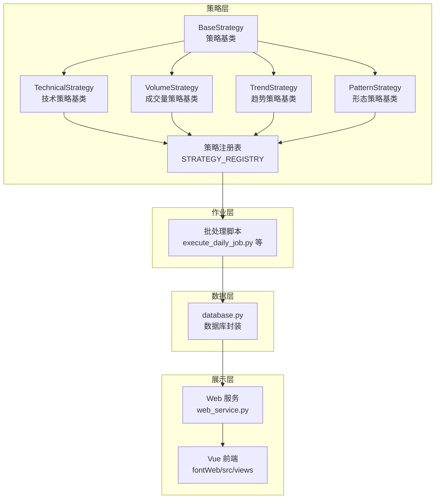
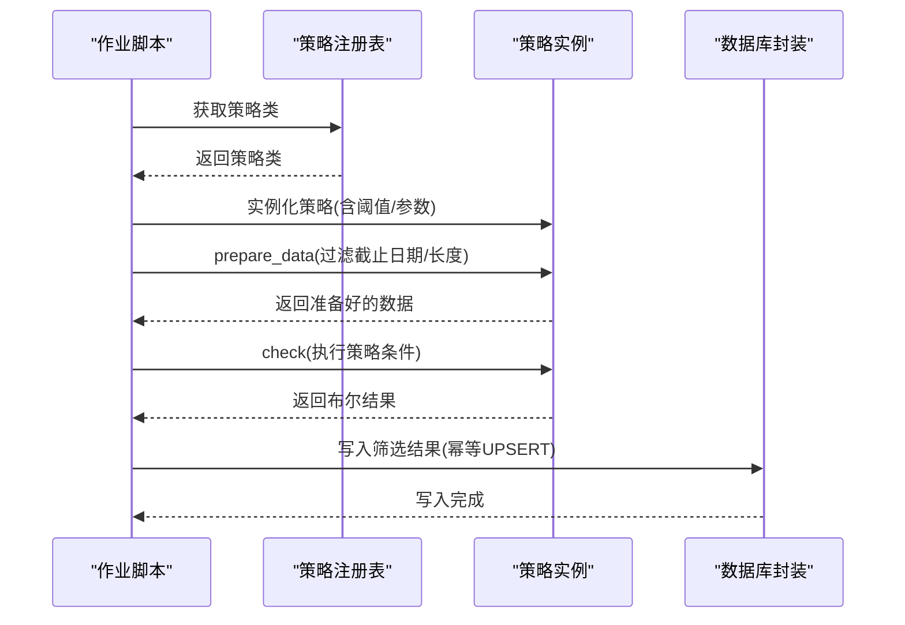
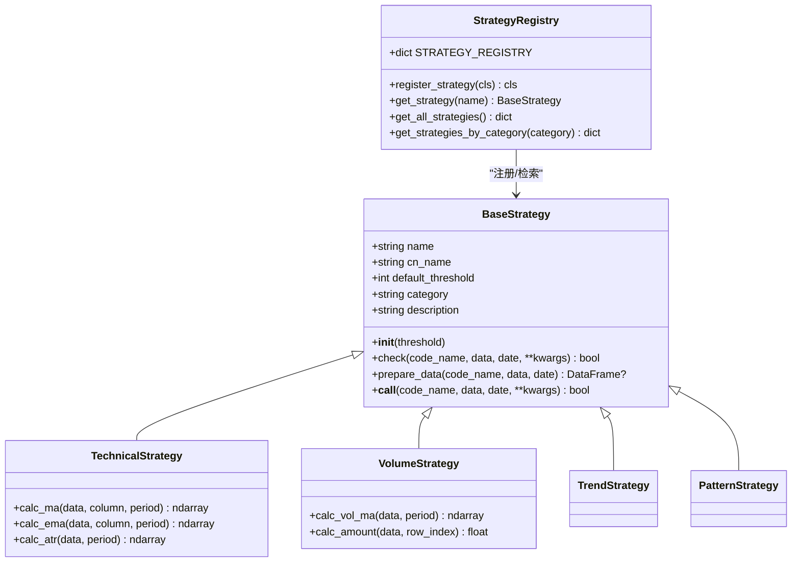
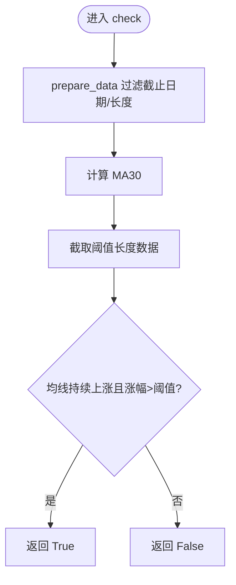
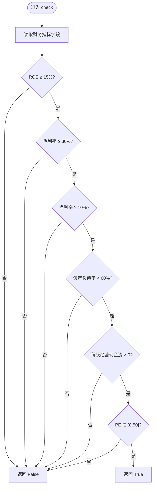
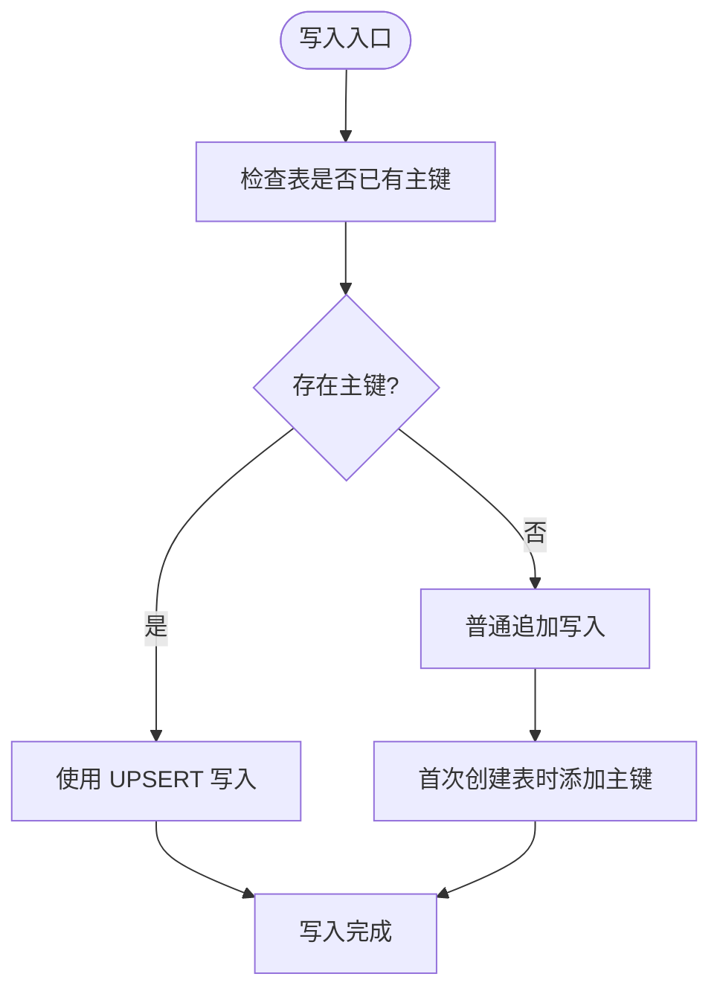
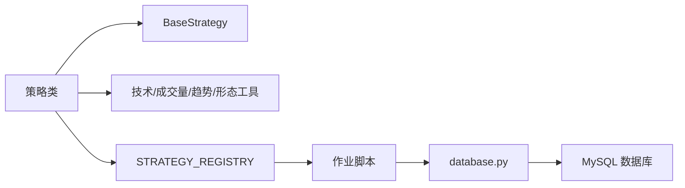

# 插件开发指南

<cite>
**本文档引用的文件**
- [README.md](file://README.md)
- [QUICKSTART.md](file://QUICKSTART.md)
- [quantia/core/strategy/base.py](file://quantia/core/strategy/base.py)
- [docker/stock/quantia/core/strategy/base.py](file://docker/stock/quantia/core/strategy/base.py)
- [quantia/core/strategy/technical/ma_strategies.py](file://quantia/core/strategy/technical/ma_strategies.py)
- [docker/stock/quantia/core/strategy/fundamental/fundamental_strategies.py](file://docker/stock/quantia/core/strategy/fundamental/fundamental_strategies.py)
- [quantia/lib/database.py](file://quantia/lib/database.py)
- [docker/stock/quantia/lib/database.py](file://docker/stock/quantia/lib/database.py)
</cite>

## 目录
1. [简介](#简介)
2. [项目结构](#项目结构)
3. [核心组件](#核心组件)
4. [架构总览](#架构总览)
5. [详细组件分析](#详细组件分析)
6. [依赖关系分析](#依赖关系分析)
7. [性能考虑](#性能考虑)
8. [故障排查指南](#故障排查指南)
9. [结论](#结论)
10. [附录](#附录)

## 简介
本指南面向希望为 Quantia/Quantia 股票系统开发“策略插件”的开发者，系统化讲解插件架构设计、接口规范、生命周期管理、配置与通信机制，并提供从简单到复杂策略的完整开发示例与最佳实践。通过遵循本文档，开发者可以快速理解系统策略体系，编写高质量、可维护、可扩展的选股策略插件。

## 项目结构
Quantia 采用模块化与分层架构组织策略与数据处理：
- 策略层：统一的策略基类与注册机制，支持技术面、成交量、趋势、形态、基本面等分类。
- 数据层：数据库访问封装，提供连接池、幂等写入、主键与索引管理。
- 作业层：定时任务与批处理脚本驱动数据抓取、指标计算、策略执行与回测。
- Web 展示层：Vue 前端与后端 Web 服务，提供可视化界面与交互。

图表来源
- [quantia/core/strategy/base.py](file://quantia/core/strategy/base.py#L20-L202)
- [docker/stock/quantia/core/strategy/base.py](file://docker/stock/quantia/core/strategy/base.py#L20-L202)
- [quantia/lib/database.py](file://quantia/lib/database.py#L60-L120)
- [docker/stock/quantia/lib/database.py](file://docker/stock/quantia/lib/database.py#L58-L120)

章节来源
- [README.md](file://README.md#L1-L700)
- [QUICKSTART.md](file://QUICKSTART.md#L1-L207)

## 核心组件
- 策略基类与注册机制
  - 统一抽象基类定义策略接口与通用数据准备流程。
  - 注册表支持按名称检索与分类查询，便于动态加载与管理。
- 技术策略基类
  - 提供常用技术指标计算工具（如 MA、EMA、ATR），简化策略实现。
- 数据库封装
  - 单例连接池、幂等写入（UPSERT）、主键与索引自动管理、重试与瞬态错误处理。
- 作业调度与生命周期
  - 通过批处理脚本驱动策略执行与数据更新，支持批量日期与增量更新。

章节来源
- [quantia/core/strategy/base.py](file://quantia/core/strategy/base.py#L20-L202)
- [docker/stock/quantia/core/strategy/base.py](file://docker/stock/quantia/core/strategy/base.py#L20-L202)
- [quantia/lib/database.py](file://quantia/lib/database.py#L60-L120)
- [docker/stock/quantia/lib/database.py](file://docker/stock/quantia/lib/database.py#L58-L120)

## 架构总览
策略插件的运行生命周期如下：
- 初始化：加载策略注册表，解析策略参数与配置。
- 数据准备：按策略阈值与截止日期过滤历史数据。
- 条件判断：执行策略 check，返回布尔结果。
- 结果写入：将筛选结果写入数据库，支持幂等更新。
- 可视化：Web 展示层读取数据库并呈现结果。

图表来源
- [quantia/core/strategy/base.py](file://quantia/core/strategy/base.py#L47-L96)
- [quantia/core/strategy/base.py](file://quantia/core/strategy/base.py#L159-L202)
- [quantia/lib/database.py](file://quantia/lib/database.py#L120-L185)

## 详细组件分析

### 策略基类与注册机制
- 接口规范
  - check 方法：接收股票标识、历史数据、截止日期与可选参数，返回布尔值。
  - prepare_data：按截止日期过滤数据并校验最小长度阈值。
  - __call__：允许直接调用策略实例。
- 分类基类
  - TechnicalStrategy、VolumeStrategy、TrendStrategy、PatternStrategy 提供通用指标计算工具。
- 注册机制
  - register_strategy 装饰器将策略类注册到 STRATEGY_REGISTRY。
  - get_strategy/get_all_strategies/get_strategies_by_category 支持按名称与分类检索。

图表来源
- [quantia/core/strategy/base.py](file://quantia/core/strategy/base.py#L20-L202)
- [docker/stock/quantia/core/strategy/base.py](file://docker/stock/quantia/core/strategy/base.py#L20-L202)

章节来源
- [quantia/core/strategy/base.py](file://quantia/core/strategy/base.py#L20-L202)
- [docker/stock/quantia/core/strategy/base.py](file://docker/stock/quantia/core/strategy/base.py#L20-L202)

### 技术策略示例：均线多头
- 策略目标：识别 MA30 持续上涨且涨幅超过阈值的股票。
- 关键实现要点
  - 使用 TechnicalStrategy.calc_ma 计算 MA30。
  - 通过 prepare_data 过滤截止日期与最小长度。
  - 按分段比较均线序列并计算涨幅阈值，返回布尔结果。

图表来源
- [quantia/core/strategy/technical/ma_strategies.py](file://quantia/core/strategy/technical/ma_strategies.py#L36-L55)

章节来源
- [quantia/core/strategy/technical/ma_strategies.py](file://quantia/core/strategy/technical/ma_strategies.py#L22-L56)

### 基本面策略示例：价值投资策略
- 策略目标：筛选 ROE、毛利率、净利率、资产负债率、现金流、PE 等指标达标的价值股。
- 关键实现要点
  - 使用 FundamentalCriteria 与 FundamentalFilter 进行多层级筛选。
  - 支持批量过滤与日志记录异常。
  - 通过参数化配置策略阈值，便于扩展与复用。

图表来源
- [docker/stock/quantia/core/strategy/fundamental/fundamental_strategies.py](file://docker/stock/quantia/core/strategy/fundamental/fundamental_strategies.py#L73-L111)

章节来源
- [docker/stock/quantia/core/strategy/fundamental/fundamental_strategies.py](file://docker/stock/quantia/core/strategy/fundamental/fundamental_strategies.py#L30-L120)

### 数据库封装与幂等写入
- 连接池与单例
  - engine() 返回单例 SQLAlchemy Engine，配置池大小与超时。
- 幂等写入
  - insert_other_db_from_df 支持主键存在时的 UPSERT，避免重复写入。
- 主键与索引
  - 首次写入检测并自动添加主键与索引，提升查询性能。
- 重试与瞬态错误
  - 对死锁、锁超时、连接异常等瞬态错误进行重试与连接池清理。

图表来源
- [quantia/lib/database.py](file://quantia/lib/database.py#L126-L203)
- [docker/stock/quantia/lib/database.py](file://docker/stock/quantia/lib/database.py#L93-L138)

章节来源
- [quantia/lib/database.py](file://quantia/lib/database.py#L60-L203)
- [docker/stock/quantia/lib/database.py](file://docker/stock/quantia/lib/database.py#L58-L138)

## 依赖关系分析
- 策略依赖
  - 策略类依赖 BaseStrategy 与分类基类提供的工具方法。
  - 策略通过注册表集中管理，便于统一调度与可视化展示。
- 数据依赖
  - 策略执行结果写入数据库，依赖 database.py 的连接池与写入方法。
- 作业依赖
  - 批处理脚本负责调度策略执行与数据更新，贯穿系统生命周期。

图表来源
- [quantia/core/strategy/base.py](file://quantia/core/strategy/base.py#L159-L202)
- [quantia/lib/database.py](file://quantia/lib/database.py#L60-L120)

章节来源
- [quantia/core/strategy/base.py](file://quantia/core/strategy/base.py#L155-L202)
- [quantia/lib/database.py](file://quantia/lib/database.py#L60-L120)

## 性能考虑
- 策略侧
  - 使用 TA-Lib 计算指标，避免重复计算；按阈值长度截断数据，减少无效遍历。
  - 将可复用的指标计算封装为分类基类方法，提升复用性与一致性。
- 数据库侧
  - 单例连接池与池预热，减少连接建立开销。
  - 幂等写入避免重复主键冲突导致的死锁与回滚。
  - 首次写入自动添加主键与索引，显著提升查询性能。
- 作业侧
  - 批量日期与增量更新策略，缩短每次执行时间。
  - 多数据源与代理配置，提升数据获取稳定性与速度。

## 故障排查指南
- 策略未注册
  - 症状：按名称获取策略时报未注册错误。
  - 处理：确认策略类使用 register_strategy 装饰器，并在导入路径中可见。
- 数据不足
  - 症状：策略返回 False 且日志提示数据长度不足。
  - 处理：调整 default_threshold 或检查数据截止日期过滤逻辑。
- 数据库写入失败
  - 症状：写入异常或主键冲突。
  - 处理：启用幂等写入（UPSERT），检查瞬态错误重试与连接池清理。
- 连接池异常
  - 症状：连接丢失、超时或死锁。
  - 处理：开启 pool_pre_ping 与 pool_recycle，必要时 dispose 重建连接池。

章节来源
- [quantia/core/strategy/base.py](file://quantia/core/strategy/base.py#L173-L186)
- [quantia/lib/database.py](file://quantia/lib/database.py#L166-L184)
- [docker/stock/quantia/lib/database.py](file://docker/stock/quantia/lib/database.py#L117-L138)

## 结论
Quantia 的策略插件体系以统一基类与注册机制为核心，结合数据库封装与作业调度，实现了高内聚、低耦合、易扩展的插件化架构。开发者可基于分类基类快速实现策略，通过注册表统一管理与调度，并借助数据库封装实现高性能、幂等的数据写入。遵循本文档的最佳实践与示例，可高效构建从简单到复杂的选股策略插件。

## 附录

### 开发步骤清单
- 设计策略接口：继承合适的基础策略类，实现 check 与 prepare_data。
- 注册策略：使用 register_strategy 装饰器注册到 STRATEGY_REGISTRY。
- 配置参数：设置 name、cn_name、category、description 与 default_threshold。
- 实现逻辑：利用分类基类提供的指标计算工具，按业务规则返回布尔结果。
- 写入结果：将筛选结果写入数据库，使用幂等写入避免重复。
- 可视化集成：在 Web 层配置视图字典，自动展示策略结果。

章节来源
- [quantia/core/strategy/base.py](file://quantia/core/strategy/base.py#L20-L96)
- [docker/stock/quantia/core/strategy/base.py](file://docker/stock/quantia/core/strategy/base.py#L20-L96)
- [docker/stock/quantia/core/strategy/fundamental/fundamental_strategies.py](file://docker/stock/quantia/core/strategy/fundamental/fundamental_strategies.py#L30-L120)
- [quantia/lib/database.py](file://quantia/lib/database.py#L120-L185)
