# 形态策略开发

<cite>
**本文档引用的文件**
- [pattern_recognitions.py](file://quantia/core/pattern/pattern_recognitions.py)
- [pattern_strategies.py](file://quantia/core/strategy/pattern/pattern_strategies.py)
- [tablestructure.py](file://quantia/core/tablestructure.py)
- [klinepattern_data_daily_job.py](file://quantia/job/klinepattern_data_daily_job.py)
- [base.py](file://quantia/core/strategy/base.py)
- [volume_strategies.py](file://quantia/core/strategy/volume/volume_strategies.py)
- [ma_strategies.py](file://quantia/core/strategy/technical/ma_strategies.py)
- [calculate_indicator.py](file://quantia/core/indicator/calculate_indicator.py)
- [cyq.py](file://quantia/core/kline/cyq.py)
- [bt_engine.py](file://quantia/core/backtest/bt_engine.py)
- [README.md](file://README.md)
</cite>

## 目录
1. [简介](#简介)
2. [项目结构](#项目结构)
3. [核心组件](#核心组件)
4. [架构总览](#架构总览)
5. [详细组件分析](#详细组件分析)
6. [依赖分析](#依赖分析)
7. [性能考虑](#性能考虑)
8. [故障排查指南](#故障排查指南)
9. [结论](#结论)
10. [附录](#附录)

## 简介
本指南面向希望开发K线形态识别与策略的开发者，系统讲解形态识别原理、61种K线形态的判断逻辑、形态组合分析方法，以及反转形态、持续形态、整理形态的识别标准与开发要点。文档结合仓库中的实际实现，提供参数调整、时间确认、成交量配合等关键技术，帮助开发者构建准确、可回测的形态策略。

## 项目结构
围绕形态策略开发的关键模块包括：
- 形态识别核心：基于TA-Lib的61种K线形态识别
- 形态策略：基于形态识别结果的选股策略
- 数据准备与批处理：每日K线形态识别与入库
- 策略基类与工具：统一的策略抽象与复用
- 技术指标与成交量策略：为形态策略提供辅助信号
- 回测引擎：将形态策略转化为可验证的交易信号

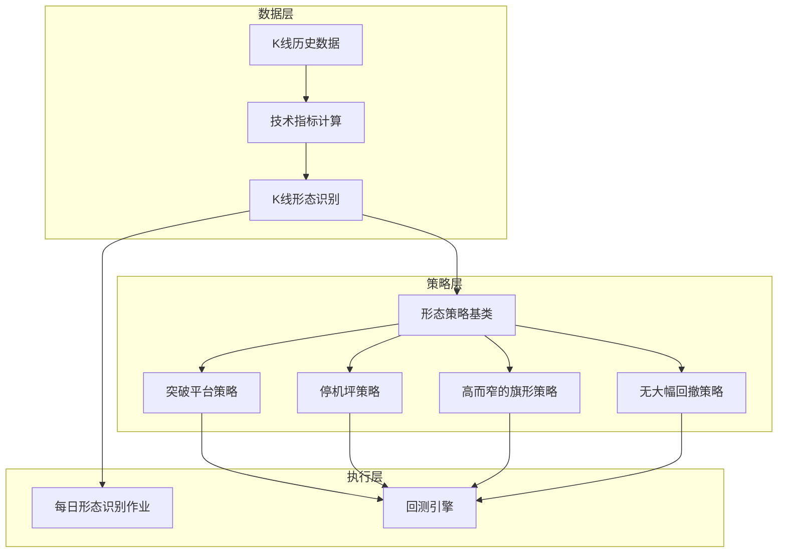

**图表来源**
- [tablestructure.py](file://quantia/core/tablestructure.py#L470-L585)
- [pattern_recognitions.py](file://quantia/core/pattern/pattern_recognitions.py#L10-L34)
- [pattern_strategies.py](file://quantia/core/strategy/pattern/pattern_strategies.py#L22-L276)
- [klinepattern_data_daily_job.py](file://quantia/job/klinepattern_data_daily_job.py#L24-L83)
- [bt_engine.py](file://quantia/core/backtest/bt_engine.py#L101-L208)

**章节来源**
- [README.md](file://README.md#L85-L113)
- [tablestructure.py](file://quantia/core/tablestructure.py#L470-L585)

## 核心组件
- 形态识别核心：提供统一的形态识别入口，遍历61种形态函数，返回最新交易日的形态标记。
- 形态策略：基于形态识别结果与成交量、技术指标等信号，构建可执行的选股策略。
- 策略基类：提供check接口、数据准备、注册机制等通用能力。
- 指标与成交量策略：为形态策略提供均线、ATR、量比等辅助信号。
- 回测引擎：将策略信号转化为可验证的交易回报与统计指标。

**章节来源**
- [pattern_recognitions.py](file://quantia/core/pattern/pattern_recognitions.py#L10-L71)
- [pattern_strategies.py](file://quantia/core/strategy/pattern/pattern_strategies.py#L22-L276)
- [base.py](file://quantia/core/strategy/base.py#L20-L96)
- [volume_strategies.py](file://quantia/core/strategy/volume/volume_strategies.py#L19-L126)
- [ma_strategies.py](file://quantia/core/strategy/technical/ma_strategies.py#L22-L237)
- [bt_engine.py](file://quantia/core/backtest/bt_engine.py#L101-L208)

## 架构总览
形态策略开发的完整流程如下：
- 数据准备：加载K线数据，按日期过滤，截取阈值窗口。
- 形态识别：对61种形态逐一调用TA-Lib函数，得到形态标记。
- 策略执行：策略根据形态标记与成交量、技术指标等信号进行判断。
- 回测验证：将策略产生的买卖信号输入回测引擎，评估收益与风险。

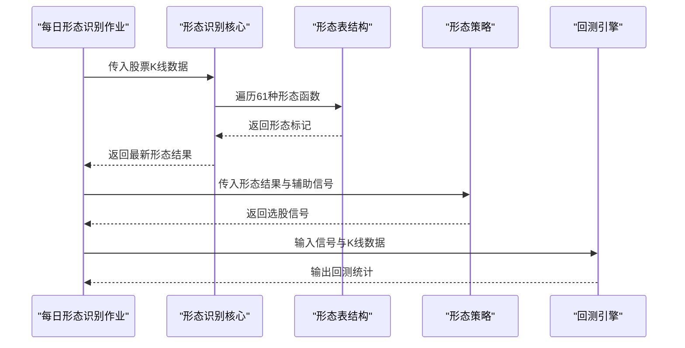

**图表来源**
- [klinepattern_data_daily_job.py](file://quantia/job/klinepattern_data_daily_job.py#L24-L83)
- [pattern_recognitions.py](file://quantia/core/pattern/pattern_recognitions.py#L10-L34)
- [tablestructure.py](file://quantia/core/tablestructure.py#L470-L585)
- [pattern_strategies.py](file://quantia/core/strategy/pattern/pattern_strategies.py#L22-L77)
- [bt_engine.py](file://quantia/core/backtest/bt_engine.py#L181-L208)

## 详细组件分析

### 形态识别核心
- 输入：K线数据（open/high/low/close/volume），可选结束日期与阈值窗口。
- 处理：按日期过滤、截取窗口、逐个调用TA-Lib形态函数，返回最新形态标记。
- 输出：包含形态列的DataFrame，便于策略消费与入库。

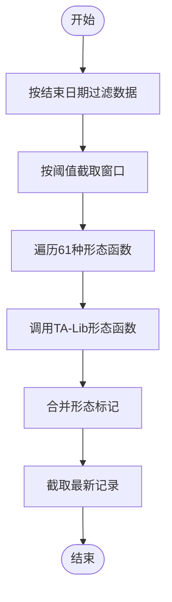

**图表来源**
- [pattern_recognitions.py](file://quantia/core/pattern/pattern_recognitions.py#L10-L34)

**章节来源**
- [pattern_recognitions.py](file://quantia/core/pattern/pattern_recognitions.py#L10-L71)

### 形态表结构与61种形态
- 表结构定义了61种形态的英文字段、中文名称与对应TA-Lib函数映射。
- 支持按需启用/禁用特定形态，便于策略定制与性能优化。

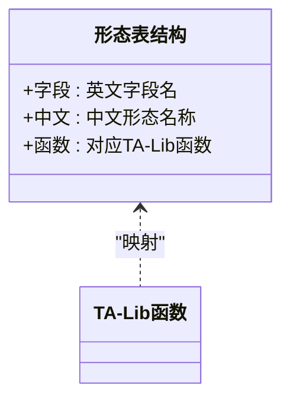

**图表来源**
- [tablestructure.py](file://quantia/core/tablestructure.py#L470-L585)

**章节来源**
- [tablestructure.py](file://quantia/core/tablestructure.py#L470-L585)
- [README.md](file://README.md#L89-L100)

### 形态策略基类与注册
- 基类提供check接口、数据准备、阈值控制与注册机制。
- 策略通过装饰器注册，统一管理与调用。

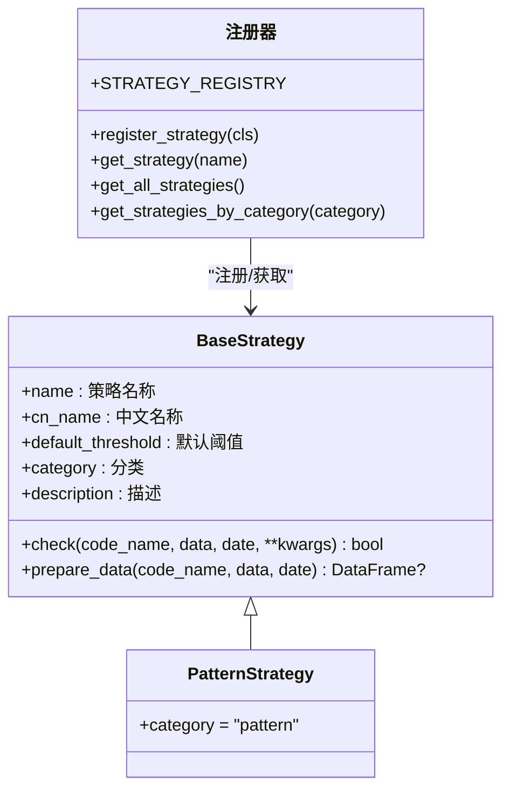

**图表来源**
- [base.py](file://quantia/core/strategy/base.py#L20-L96)
- [base.py](file://quantia/core/strategy/base.py#L155-L202)

**章节来源**
- [base.py](file://quantia/core/strategy/base.py#L20-L96)
- [base.py](file://quantia/core/strategy/base.py#L155-L202)

### 突破平台策略（持续形态）
- 识别平台整理后放量突破60日均线的信号。
- 关键逻辑：突破日满足收盘价≥MA60>开盘价，且成交量放大；突破前某日收盘价与MA60偏离在-5%~20%之间。

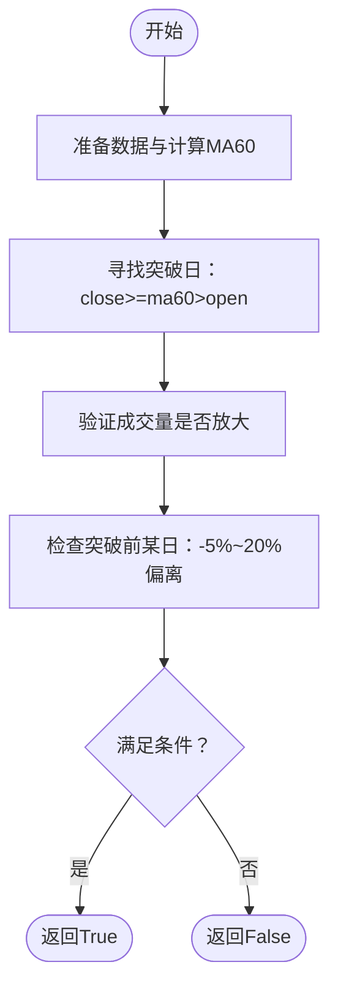

**图表来源**
- [pattern_strategies.py](file://quantia/core/strategy/pattern/pattern_strategies.py#L22-L77)
- [volume_strategies.py](file://quantia/core/strategy/volume/volume_strategies.py#L19-L69)

**章节来源**
- [pattern_strategies.py](file://quantia/core/strategy/pattern/pattern_strategies.py#L22-L77)
- [volume_strategies.py](file://quantia/core/strategy/volume/volume_strategies.py#L19-L69)

### 停机坪策略（反转形态）
- 识别涨停后横盘整理、蓄势待发的反转信号。
- 关键逻辑：最近N日涨幅>9.5%且放量上涨；次日高开高走且涨跌幅≤3%；随后2-3日连续高开高走且涨跌幅±5%以内。

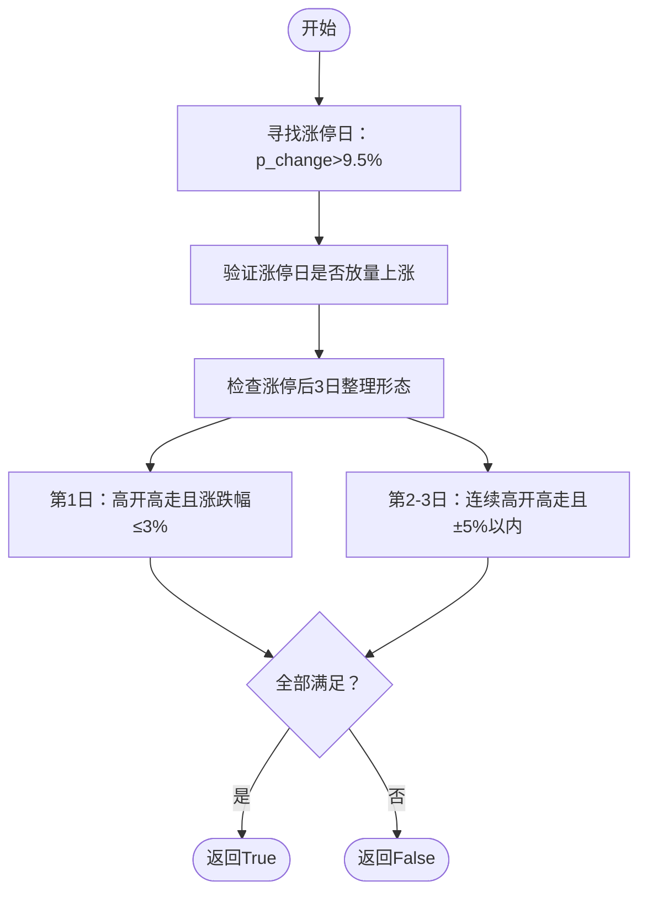

**图表来源**
- [pattern_strategies.py](file://quantia/core/strategy/pattern/pattern_strategies.py#L80-L148)
- [ma_strategies.py](file://quantia/core/strategy/technical/ma_strategies.py#L140-L166)

**章节来源**
- [pattern_strategies.py](file://quantia/core/strategy/pattern/pattern_strategies.py#L80-L148)
- [ma_strategies.py](file://quantia/core/strategy/technical/ma_strategies.py#L140-L166)

### 高而窄的旗形策略（持续形态）
- 识别短期快速上涨后窄幅整理、有机构参与的持续形态信号。
- 关键逻辑：当日收盘价/区间最低价≥1.9；区间内连续两天涨幅≥9.5%；需满足“istop”条件（机构参与）。

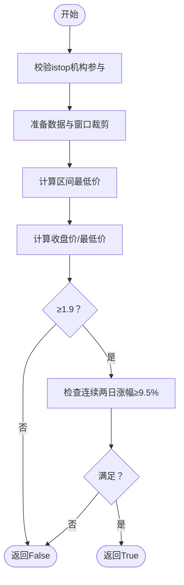

**图表来源**
- [pattern_strategies.py](file://quantia/core/strategy/pattern/pattern_strategies.py#L151-L204)

**章节来源**
- [pattern_strategies.py](file://quantia/core/strategy/pattern/pattern_strategies.py#L151-L204)

### 无大幅回撤策略（持续形态）
- 识别稳健上涨、无大幅回撤的持续形态信号。
- 关键逻辑：60日涨幅>60%；期间不得出现单日跌幅>7%、高开低走>7%、两日累计跌幅>10%、两日高开低走累计>10%。

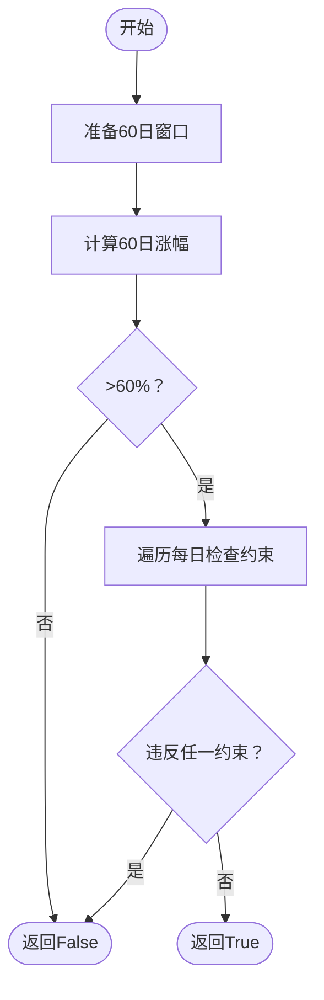

**图表来源**
- [pattern_strategies.py](file://quantia/core/strategy/pattern/pattern_strategies.py#L206-L251)

**章节来源**
- [pattern_strategies.py](file://quantia/core/strategy/pattern/pattern_strategies.py#L206-L251)

### 形态识别作业与数据流
- 每日作业加载股票历史数据，调用形态识别核心，多线程并发处理，最后写入数据库表。

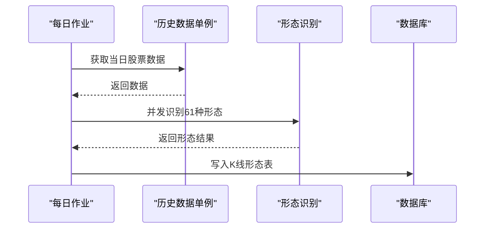

**图表来源**
- [klinepattern_data_daily_job.py](file://quantia/job/klinepattern_data_daily_job.py#L24-L83)

**章节来源**
- [klinepattern_data_daily_job.py](file://quantia/job/klinepattern_data_daily_job.py#L24-L83)

### 技术指标与成交量策略
- 技术指标：提供MA、ATR等计算工具，供策略复用。
- 成交量策略：提供放量上涨、放量跌停等成交量信号，增强形态识别的确认度。

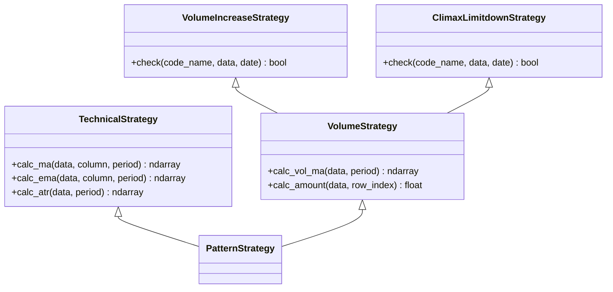

**图表来源**
- [base.py](file://quantia/core/strategy/base.py#L99-L143)
- [volume_strategies.py](file://quantia/core/strategy/volume/volume_strategies.py#L19-L126)

**章节来源**
- [base.py](file://quantia/core/strategy/base.py#L99-L143)
- [volume_strategies.py](file://quantia/core/strategy/volume/volume_strategies.py#L19-L126)

### 回测引擎
- 将策略信号转化为可验证的交易回报，支持夏普比率、最大回撤、交易次数等指标。
- 支持自定义持仓天数与仓位比例，便于策略参数优化。

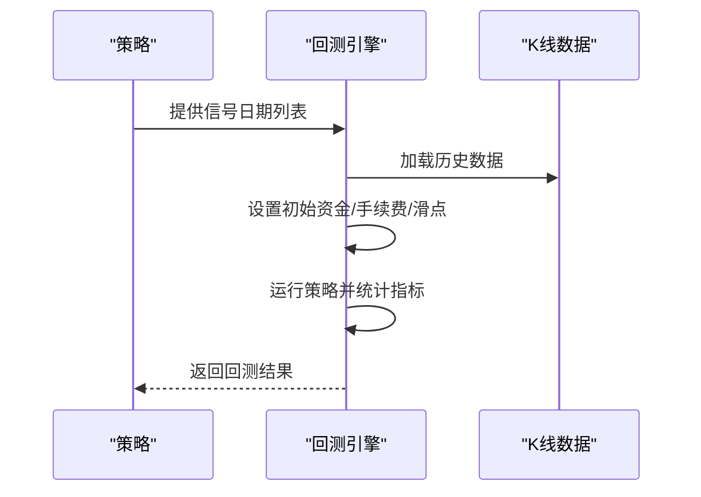

**图表来源**
- [bt_engine.py](file://quantia/core/backtest/bt_engine.py#L101-L208)

**章节来源**
- [bt_engine.py](file://quantia/core/backtest/bt_engine.py#L101-L208)

## 依赖分析
- 形态识别依赖TA-Lib的61种形态函数，通过表结构映射到具体函数。
- 策略依赖指标与成交量策略提供的辅助信号，提升识别准确率。
- 回测引擎依赖Backtrader，提供标准化的回测接口。

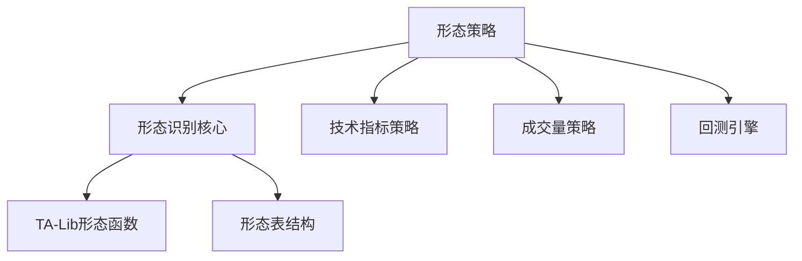

**图表来源**
- [tablestructure.py](file://quantia/core/tablestructure.py#L470-L585)
- [pattern_recognitions.py](file://quantia/core/pattern/pattern_recognitions.py#L10-L34)
- [pattern_strategies.py](file://quantia/core/strategy/pattern/pattern_strategies.py#L22-L77)
- [bt_engine.py](file://quantia/core/backtest/bt_engine.py#L101-L208)

**章节来源**
- [tablestructure.py](file://quantia/core/tablestructure.py#L470-L585)
- [pattern_recognitions.py](file://quantia/core/pattern/pattern_recognitions.py#L10-L34)
- [pattern_strategies.py](file://quantia/core/strategy/pattern/pattern_strategies.py#L22-L77)
- [bt_engine.py](file://quantia/core/backtest/bt_engine.py#L101-L208)

## 性能考虑
- 并发处理：每日形态识别作业使用线程池并发处理，显著提升吞吐。
- 数据截断：通过阈值与窗口截断减少计算量，避免全量历史带来的性能压力。
- 指标缓存：技术指标计算采用TA-Lib，高效稳定；建议在策略中复用已有指标列，避免重复计算。
- 数据库写入：按日批量写入，减少IO开销。

**章节来源**
- [klinepattern_data_daily_job.py](file://quantia/job/klinepattern_data_daily_job.py#L68-L83)
- [calculate_indicator.py](file://quantia/core/indicator/calculate_indicator.py#L23-L404)

## 故障排查指南
- 形态识别异常：检查TA-Lib安装与版本兼容性，确认数据列完整性。
- 策略返回空：确认数据长度阈值、日期过滤与窗口截断逻辑。
- 回测失败：确认Backtrader安装，检查信号日期与数据匹配关系。
- 成交量策略失效：检查量比计算与阈值设置，确保数据清洗（NaN/Inf）。

**章节来源**
- [pattern_recognitions.py](file://quantia/core/pattern/pattern_recognitions.py#L24-L26)
- [calculate_indicator.py](file://quantia/core/indicator/calculate_indicator.py#L13-L21)
- [bt_engine.py](file://quantia/core/backtest/bt_engine.py#L119-L121)

## 结论
本指南基于仓库中的实际实现，系统阐述了K线形态识别原理与61种形态的判断逻辑，总结了反转、持续、整理形态的识别要点，并提供了形态策略的参数调整、时间确认、成交量配合等关键技术。通过策略基类、指标与成交量策略、回测引擎的协同，开发者可以快速构建并验证形态策略，提升策略的准确性与可回测性。

## 附录
- 形态识别结果含义：负值表示卖出信号，0表示未出现该形态，正值表示买入信号。
- 可扩展性：通过表结构新增形态字段，或在策略中组合多种形态与信号，实现更复杂的形态组合分析。

**章节来源**
- [README.md](file://README.md#L101-L106)
- [tablestructure.py](file://quantia/core/tablestructure.py#L470-L585)
